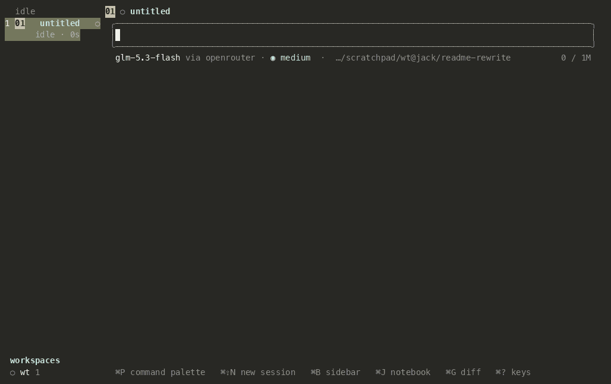

# Yi

A coding agent in one Rust binary, built from small generic primitives that compose.
The model works inside a persistent Python kernel, where subagents are function calls
and plans are programs: the agent loop is a program the model writes, not a
conversation it has.



```bash
yi                                             # workspace: sessions on a rail, chat panes
```

```bash
yi --solo                                      # one chat, inline in the terminal
```

```bash
yi ask --model faux/faux-1 --json "prompt"     # offline scripted provider, no key
```

## What the model can do here

**Work in a live kernel.** Every session can own a Jupyter kernel. Variables, imports
and data frames survive between turns and across restarts: the kernel snapshots after
each successful cell and restores on boot. Python reaches Yi only through named host requests
(read an address, search history, change the plan, spawn a child), so the model's tools
are also a library it can script. This is code as the action space, as in
[CodeAct][codeact].

**Call subagents like functions.** From a cell:

```python
answers = await asyncio.gather(*(
    rlm.ask("Can this function panic? Quote the line.", [url]) for url in urls))

child = await rlm.run("Port the parser to the new token type",
                      role="worker", isolation="worktree")
```

`rlm.ask` runs a read-only reader over the lines it is handed and returns its answer. `rlm.run` starts a `reader`, a narrow `worker`, or a full `root` child and
returns a handle. A child's authority is cut from its parent's: its wall (the paths and
URLs it may not touch) and its lease (tokens and time) only narrow down the tree. This
is the [recursive language model][rlm] pattern as the harness's own way to delegate.
Recursion depth is configurable (1 to 3) and a family holds at most 16 live sessions
by default.

**Write plans as programs.** A plan is a graph of todos that code declares:

```python
from yi import Plan, Writer, contract, cmd, fork_join

plan = await Plan.create("split the config loader")
for part in ("parse", "validate"):
    await plan.todo(key=part, delegate=Writer(accept=contract(cmd(f"cargo test {part}", critical=True))))
await plan.todo(key="wire", after=["parse", "validate"], delegate=Writer(accept="cargo test"))
run = await plan.run(shape=fork_join, budget="1h")
```

The engine journals every change in a digest-chained log, starts ready todos on
children, and grows a todo into a sub-plan with `decompose` when it turns out bigger
than it looked ([LLMCompiler][llmc] runs a task graph the same way, and [ADaPT][adapt]
decomposes only when needed). A todo with a contract (a command, a schema, an example,
or a jury of reader models from another family) closes only when its check passes.
`yi plan` shows the graph, and `yi why <file>:<line>` traces a line of code back to the
words that asked for it.

**Edit without landing in the wrong place.** `read` shows every line with its number
under a `[path#TAG]` header, where the tag is a four-hex hash of the whole file. `edit`
cites those numbers and that tag. If the file moved underneath, the numbers are
rebased; if a cited line's text changed, the edit is refused with the current text.
These are [hashline][hashline] edits: line numbers plus a file hash tag. Every touched
file is checkpointed, and `/undo` restores only what the turn changed.

**Find things by address.** Anything the model can cite has a URL: `user://3` (the third
message you typed), `agent://reviewer`, `plan://<id>`, `kernel://worker/df`,
`history://<agent>/tail/20`, `checkpoint://<tree>/<path>`. One resolver reads them all
and logs each read. To orient, `get_context` returns one packet: symbol neighbourhood,
file skeletons, change heat, the repo's gate commands. Skills sit in a budgeted catalog
and load on demand.

## Built from primitives

Yi has no workflow modes. A list of generic primitives does the work, and every feature
is a composition of them:

| primitives | |
|---|---|
| Session, Provider, Tool, Prompt fragment, Permission | the loop, the model, the calls, the prompt, the decision per call |
| Kernel, Url | the live Python process; the one reference type |
| Child, Lease, Wall, Envelope | a subagent, its budget, its deny set, its mail |
| Todo, Plan, Contract | a unit of work, a journaled graph of them, a done-predicate |
| Lane, Node, Schedule, Channel | a worktree, a machine, a clock, an event buffer |

| feature | is |
|---|---|
| review pod | Child (reader) × N + Contract |
| delegate a todo to a worktree | Plan + Contract + Child + Lane |
| heartbeat | Schedule + Todo |
| a child asks you a question | Envelope + Todo blocked on you |
| `yi why` | Url (`user://n`) + Todo + Plan journal |

The full table, with the decision behind each row, is
[YI_DESIGN.md §3](docs/YI_DESIGN.md#3-primitives-and-composition).

## Context is a budget, not a buffer

Every source that competes for the window (project instructions, skills, tool output,
prior turns) has a byte budget, and every cut is loud: a `[…]` row at the cut says what
was kept out of how much, which cap cut it, and the one call that gets the rest. Large
output is spilled whole to disk and the row names the path.

Compaction keeps the request prefix byte-identical across turns so the provider's
prompt cache keeps hitting, and a failed summary never silently drops history. The
fixed prefix every request pays, system prompt plus tool table, is measured in CI;
adding a sentence fails the build until the growth is committed on purpose.

## Safety is structure

- **Modes.** `ask`, `auto` (the default), `yolo`. Auto allows reads, in-tree writes and
  commands it can prove safe, runs unproven commands inside a macOS Seatbelt sandbox
  with loopback-only network (elsewhere they ask), and asks before anything
  destructive or networked.
- **Evidence.** A rule or hold turns a match into a question with a reason; a denial
  says what it saw.
- **A floor no mode lifts.** Credential stores (`~/.ssh`, `~/.aws`, `~/.gnupg` and
  sixteen more), device nodes and the workspace's own `.git` are denied even in `yolo`.
- **Least privilege for children.** Walls and leases only narrow down the family tree.
  The kernel never holds MCP sockets or tokens.
- **Only your words are instructions.** Your typed messages reach the model bare;
  host notices, child reports and summaries arrive fenced as context.
- **Optional classifier.** Set `models.classifier` and a local [Laya][laya] sidecar,
  started and stopped with the daemon, says which skill a typed message calls for and
  settles reviewable permission asks: it allows when confident a call is safe, asks you
  when confident it is not, and leaves the middle to the reviewer or to you. It sees the
  command and the reason for the ask, never your messages or tool output. Off by
  default; `classifier.approval: "wait-for-user"` keeps it out of approvals.

## Sessions outlive the window

A session is an append-only JSONL log in Pi's v4 format, byte for byte: branch, rewind
to any entry, resume after a crash, read it with tools that are not Yi. `yi` starts a
daemon (`yi serve`) that owns every session; close the console and the work keeps
running, reattach and it replays. Each root session works in its own git worktree, a
lane, and lands by pull request with `/land`.

Heartbeats wake a session on a clock, channels carry events in from adapters, and an
advisor can review the work log. All of it is optional, and all of it is written to the
same log.

## Surfaces

| command | |
|---|---|
| `yi`, `yi --solo` | workspace, single chat ([keys](docs/KEYS.md)) |
| `yi ask [--json] [--schema]` | one-shot, scriptable, structured output |
| `yi serve`, `yi acp`, `yi rpc` | daemon, [Agent Client Protocol][acp] for editors, framed JSON |
| `yi plan`, `yi why`, `yi lanes`, `yi sessions` | the plan graph, traceability, worktrees, history |
| `yi fetch <url>`, `yi memory`, `yi catalog` | the address space from a shell |
| `yi setup`, `yi doctor`, `yi login`, `yi trust`, `yi undo` | setup and repair |

## Configure

One file, `~/.yi/config.json`; every key is in
[YI_DESIGN.md §17.1](docs/YI_DESIGN.md).

```jsonc
{
  "model": "openrouter/z-ai/glm-5.3-flash",   // default model
  "models": {                                  // per-role overrides
    "summarizer": "...",                       // compaction, cheaper is fine
    "advisor": "...",                          // naming this turns the reviewer on
    "classifier": "english"                    // the Laya sidecar, off when unset
  },
  "permissions": { "mode": "auto" },
  "rlm": { "maxDepth": 1 },                    // how deep a family nests (ceiling 3)
  "kernel": { "prewarm": true },               // boot the kernel at session open
  "mcp": { "enabled": false }                  // MCP stays off until asked
}
```

## Develop

`just dev` builds, stops a daemon a previous build left running, and starts `yi`.
`just check` runs fmt, clippy, the guardrails and the tests. Read
[YI_DESIGN.md](docs/YI_DESIGN.md) (the law) and [ARCHITECTURE.md](docs/ARCHITECTURE.md)
(the map) first; where changes land is in [CONTRIBUTING.md](CONTRIBUTING.md).

## License

MIT, in `LICENSE`. `vendor/` keeps its upstream Apache-2.0 notices.

[codeact]: https://arxiv.org/abs/2402.01030
[rlm]: https://arxiv.org/abs/2512.24601
[llmc]: https://arxiv.org/abs/2312.04511
[adapt]: https://arxiv.org/abs/2311.05772
[hashline]: https://stencil.so/blog/the-harness-problem
[acp]: https://agentclientprotocol.com
[laya]: https://huggingface.co/convaiinnovations/laya
