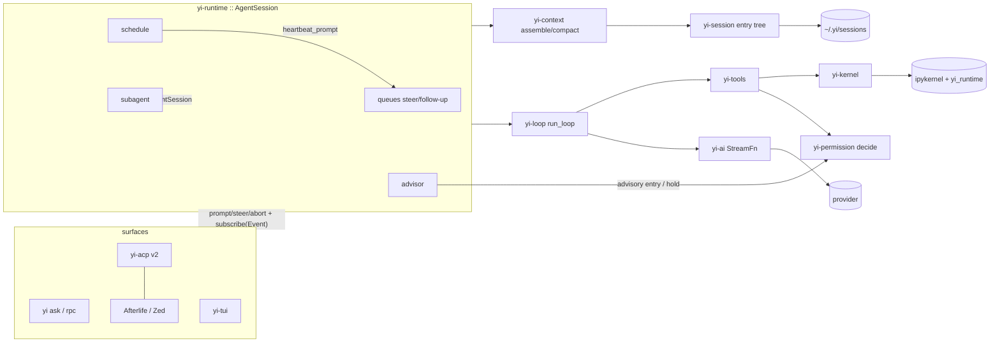

# Yi — Architecture Map

```
version: 0.8.0          # bump on any structural change; log it below
design:  YI_DESIGN.md   # the deep design; § refs below point into it
status:  phase 2c done  # yi mcp live (config-gated, D36): stateless connect/tools-list/get/call, grep over cached snapshots, schema snapshots, SKILL.md; e2e vs fixture stdio server. Next: phase 4 (kernel) on go.
```

## Changelog

| ver | date | change |
|---|---|---|
| 0.8.0 | 2026-08-24 | Phase 2c landed: yi-mcp-cli in every build behind the `mcp.enabled` config gate (D36). Command grammar per mcpc: connect <server> [@s] (config-entry / file:entry / file resolution), close/restart @s, grep over cached connect-time snapshots (progressive discovery, exit 1 on no match), @s tools-list/tools-get (--schema strict|compatible snapshots)/tools-call (k:=v httpie pairs, inline JSON, stdin)/resources-list/prompts-list/ping; --json MCP-spec output, --max-chars truncation; SKILL.md adapted from mcpc as the only model-facing surface, printed by `help --skill`. One-shot execution: per-command current-thread runtime, rmcp client over TokioChildProcess, no resident process. Sessions in ~/.yi/mcp/sessions.json (wire shapes in yi-types), states live/connecting/disconnected/unauthorized/expired, never auto-removed. Streamable-HTTP via ureq transport is the next 2c batch; stdio covers the exit gate (5 e2e tests vs a python fixture server). deny: chrono wrapper-scoped to rmcp, graph limited to shipping targets, dev-deps excluded. Cost: +0.94 MiB dist (3.85 MiB), +1.8 ms startup (3.9 ms), deps 10/107. |
| 0.7.1 | 2026-08-24 | D36: MCP ships compiled-in and config-gated (`mcp.enabled`, default false), superseding D9's cargo feature — MCP is standard in 2026 agents and a rebuild-to-enable is the wrong gate; reqwest ban becomes unconditional (rmcp minimal + ureq streamable-HTTP transport). Phase 2c begun on this basis; 2c deferrals: OAuth login/logout (mcpc auth spans excised), tasks-*, connect --keep bridge. |
| 0.7.0 | 2026-08-24 | Phase 3 landed: yi-context (P2 projection over Pi v4 retained-tail semantics, P3 accounting with BodyAfterPrefix scope + server-observed prefill, P4 policy, P5 cut over projected messages — the v4 retained_tail wire makes message indices the operative output, entry ids ride details, P6 serializer, P7 prompts verbatim (kernel-persistence note deferred to phase 4 with the kernel), P8 cumulative file ops, P9 window chain + Roll fallback, P10 ledger reader over prime harness_state.json (mtime-synced, no skill/refine), P11 stable prefix + overlay assembly, P16 source budgets, P17 retention floor (user messages verbatim, newest-first 64k, oldest middle-truncated), P18 world-state diff sections, L4 convertToLlm port incl. summary/bash wrappers + yi_internal_context drop-at-compaction). Auto-compaction: maybe_compact loop hook at every message boundary inside the tool loop (P13), prefix-aligned single-request summarization (14.5; split-turn second request dropped — the whole-context summary covers the prefix), front-trim retry then summary-less Roll, store append keeps in-memory == re-projection. P14 attribution rides LaneRecord::Usage cause=child_usage_attributed (no new wire shape); own_and_total split. rpc: compact (schedule/immediate) + compact_status; CLI enables compaction by default. New wire shapes: CompactionWindow, CompactionDetails, HarnessKind/Scope/Entry. Zero new deps. |
| 0.6.4 | 2026-08-24 | Phase 2b landed: hashline port (format/tag, tokenizer, parser with OMP recoveries, verbatim message table, clipboard incl. named registers, brace-scanner block resolver honoring the no-tree-sitter rule, snapshot store with seen-line provenance, patcher with prepare/commit + symlink recheck + tag-path recovery + no-op loop guard; boundary repair and drift recovery stay out) — read/edit tools over it, prompt.md verbatim as the edit description. yi-permission: pure decide() with fixed precedence, M10 catastrophic denylist (lexical, workspace .git added, yolo included), sha256 session rules over yi-types wire shape (schema v2), D35-minimal holds, M11 mode fragments, runtime broker with TTY ask / headless evidence-carrying deny. Exit: OMP error texts pinned by 38 hashline tests; live hashline edit succeeded first try vs deepseek-v4-flash (ICL bet validated). Deps: xxhash-rust, sha2. |
| 0.6.3 | 2026-08-24 | Phase 2b approved with D35 scope trims: clipboard registers deferred until move instrumentation shows demand (D11 economics unproven); D26 compound-command decisions ship v1 as whole-command + ParseOutcome::Unparsed (per-segment needs a shell parser; the codex lesson was never re-keying unparseable onto bash, not segmentation); M5 holds land as type + decide() input with User source only (advisor, the consumer, is phase 5). Hashline confirmed core after review: it is the file-editing instance of the verify-don't-trust spine; user has production evidence from OMP; in-context learning covers format novelty. |
| 0.6.2 | 2026-08-24 | D34: OpenRouter lands as the third native provider (openai-completions wire; data/openrouter.json 349 models via Pi's generator; OPENROUTER_API_KEY). First A9 compat quirks ported from pi-ai: supportsDeveloperRole, thinkingFormat=openrouter (nested reasoning:{effort}), requiresReasoningContentOnAssistantMessages. Yi's hardcoded model default removed: --model → config.json "model" key → error; dev target (openrouter/deepseek/deepseek-v4-flash-0731) is user config, not code. |
| 0.6.1 | 2026-08-24 | Phase 2 core landed: yi-tools (T1 subset, read/write/glob/grep/bash, exec-tool discovery, runtime ToolAdapter with abort-kills-subprocess), AgentSession store persistence + resume, `yi rpc` (LF-framed commands/responses/events, v4 persistence per D33, protocol tests spawn the binary), `yi ask --yolo` tool wiring. Guardrails: fn-size ceiling 150 (split 3 mapper fns), schemas.lock live (24 shapes). globset added (ledger row). |
| 0.6.0 | 2026-08-24 | Phase 2 begun → D33: `yi rpc` persists the v4 mutation log; Pi's coding-agent still writes v3 (verified: `session-manager.ts` CURRENT_SESSION_VERSION = 3, never imports harness/session), so the phase-2 exit narrows to RPC protocol tests (framing, command/response semantics, event stream) and skips Pi's v3 file-format assertions. yi-session lands: SessionState mutation replay (S1–S9 over the v4 wire types), one SessionStore for both backends (memory = no file), JsonlRepo/MemRepo, torn-tail repair + newline re-termination, fork (branch/tree), 25-case conformance port + Pi-fixture load tests. Usage token fields u64→i64 (Pi writes negative adjustment deltas). |
| 0.5.9 | 2026-08-24 | Phase 1 landed: yi-loop (L1-L12, I1/I2/I4), yi-ai (anthropic-messages + openai-chat adapters, SSE, JSON salvage, transform, retry, bundled catalog), yi-runtime AgentSession + ProviderStream glue, yi ask (text/json). Exit partially met: loop parity + faux e2e green; live-provider turn awaits a key. docs/solutions/ generated (ADRs from the decision log, architecture, coding practices). |
| 0.5.8 | 2026-08-23 | Phase 0 exit met: yi-types wire layer + AssistantMessageEvent enum + faux replay (yi-ai), all gates green. schemas.lock generation deferred to phase 1 alongside the first schema churn. |
| 0.5.7 | 2026-08-23 | Pi session format re-verified against source: v4 mutation log, not v3 → D32; S5/S7/§3 corrected; yi-types wire types + golden fixtures land (byte-identical round-trip). |
| 0.5.6 | 2026-08-22 | Repo-plumbing review (codex/jcode/atuin/rainfrog/mdfried manifests, CI, toolchain) → D31: release/dist profile split, centralized workspace deps, toolchain pin = MSRV, naming law, lints opt-in gate, src/-scoped ratchets. Phase 0 scaffold begun. |
| 0.5.5 | 2026-08-22 | Doc cleanup: staleness fixes (P17/P18 refs, naming table cut, decision log ordered, A.10 retitled, X1 `--session-dir`); §6/§12/R8/A.1/changelog compressed to single sources; summed event budget re-based 13→18 (measured: 13 loop + 5 `_yi/*`). |
| 0.5.4 | 2026-08-22 | Codex pass 2 → D29 (retry-after-first-byte; freeform tool format), D30 (PTY cut; skills catalog; hardening batch); A.10 pass-2 spans + excise. |
| 0.5.3 | 2026-08-22 | Advisor × benchmarks → D28 two-tier enable; §15.3 item 11. |
| 0.5.2 | 2026-08-22 | OMP case study → §9.2 feature-admission gates (D27). |
| 0.5.1 | 2026-08-22 | Codex case study → compaction/subagent/goal ports (D25), anti-lessons (D26); §8.17 re-based on codex `ext/goal`. |
| 0.5.0 | 2026-08-22 | ref/ reorganized; jcode case study → §9.1 zero-start gates (D23); §15 AA-benchmark integration (D24). |
| 0.4.0 | 2026-08-22 | Advisor context contract v3 (D19); one-path pass (D20–D22); §6 kernel re-verified. |
| 0.3.4 | 2026-08-21 | Pi interop suite: D16 provider pass-through, D17 Pi-differential testing (phase 3), D18 session handoff; Pi templates/skills-roots/theme import folded in (§3.1). |
| 0.3.3 | 2026-08-21 | D14 L3: remote-rendered UI bridge (§8.16) — sidecar hosts real pi-tui, Yi is a display server; measured ceiling 92–96 % of Pi's example corpus. |
| 0.3.2 | 2026-08-21 | G1 resolved: catastrophic-path denylist adopted (M10, D15). Hook bridge + Pi-compat shim recorded as stretch (D14). |
| 0.3.1 | 2026-08-21 | Rubric traceability vs the six-harness review added; honest scorecard projection; safety gap named (G1). |
| 0.3.0 | 2026-08-21 | Bloat review: D1–D13 (ACP v2-only, auto-review deferred, daemon = ACP-router supervisor + worker-per-root, board deferred with gh-issues plan, branch-summary/CompactionCheck deferred, mcp folded to feature, best-of-N demoted to pattern). HAR compliance (§18) and schema stability (§19) made normative. Port maps embedded (Appendix A). |
| 0.2.0 | 2026-08-21 | Rust greenfield pivot; crates consolidated 17→12; TUI/CLI primitives; embedded skills/modes/rtk; advisor v2 (research-grounded); memory design (§16). |
| 0.1.0 | 2026-08-21 | Initial design as Zig fork of fx (superseded). |

## Crates (12 default; `yi-mcp-cli` behind feature `mcp`) and line budgets

Budgets are ceilings (§9 ratchet); the target is always smaller.

| crate | owns | deps (internal) | budget |
|---|---|---|---|
| `yi-types` | every serde shape: messages, entries, events, tool/permission/schedule/kernel wire, config. Schema authority (§19) | — | 3,000 |
| `yi-loop` | `run_loop` + interrupt module (§8.2, §8.6) | types | 1,000 |
| `yi-ai` | providers: anthropic, openai-chat, openai-responses, faux; catalog; redact-free (§8.5) | types | 4,000 |
| `yi-session` | entry tree repo, JSONL codec, tree ops, conformance (§8.4) | types | 2,500 |
| `yi-context` | P1–P18: projection, accounting, compaction, ledger, assembly (§8.1) | types, session | 2,500 |
| `yi-permission` | modes, rules, holds, decide(); M7/M8 deferred (§8.7, D3) | types | 1,500 |
| `yi-tools` | Tool trait, fs/hashline/bash+reduce/exec-tools/checkpoint/skills (§8.8, §5, §14.3) | types, permission | 9,000 |
| `yi-kernel` | Jupyter client: ZMQ, HMAC, host.request (§8.9, §6) | types | 2,500 |
| `yi-runtime` | AgentSession + modules `subagent`, `schedule`, `advisor` (§8.3, §8.10–8.12) | all above | 6,000 |
| `yi-acp` | ACP v2 server, Event→update (§8.13, D1) | runtime | 2,000 |
| `yi-tui` *(feature `tui`)* | inline-viewport TUI (§8.14) | runtime | 4,000 |
| `yi-cli` | composition root; ask / rpc / acp / serve / sessions / undo; `mcp` feature (§8.15, D9) | all | 2,000 |

Non-crate: `python/yi_runtime` (prime verbatim, §6), `skills/` (bundles, §14.1), `vendor/rtk`
(§14.3), `scripts/guardrails` (§9), `evals/` cassettes (§12).

## Data flow



## Feature ledger

value/complexity: H/M/L. Status: **core** (launch), **gated** (cargo feature), **deferred**
(designed, scheduled later), **pattern** (recorded, unscheduled), **cut**.

| feature | § | status | V | C | note |
|---|---|---|---|---|---|
| pure loop + 13-event enum | 8.2 | core | H | L | |
| entry tree sessions (Pi byte-compat) | 8.4 | core | H | M | schema anchor |
| Pi RPC mode | 8.15 X4 | core | M | L | kept per review (renderer over Event stream) |
| context P1–P14, P16–P18; prefix-aligned P7 | 8.1 | core | H | M | P15 deferred (D7); live 0.7.0 (P12 with kernel, ph 4) |
| hashline edit (+ registers, instrumented) | 8.8, D11 | core | H | M | boundary-repair excluded |
| permission modes/rules/holds, deterministic auto | 8.7 | core | H | M | |
| model auto-review M7/M8 | 8.7, D3 | deferred (ph 6+) | L | H | only if deterministic-auto nags |
| bash reduce (launch set) | 14.3, D13 | core | H | M | 4 filters + TOML engine |
| file checkpoints + /undo | 5.3 | core | H | M | shadow gitdir |
| kernel + ipython + rlm() subagents | 8.9, 8.10 | core (ph 4) | H | H | earns its H complexity |
| dill snapshot | 8.9 K10 | core (ph 4b) | M | L | kept per review |
| heartbeats | 8.11 | core (ph 5) | H | M | |
| goals + autonomous | 8.17, D25 | deferred (ph 6) | H | M | kept per review; re-based on codex ext/goal (out-of-transcript, continuation audit) |
| advisor (6 signals, Advise+ClaimAudit) | 7 | core (ph 5) | H | M | the innovation focus; work-log context v3 (D19); two-tier default + headless Hold degrade (D28) |
| CompactionCheck | 7.5, D8 | deferred | M | M | when compaction misbehaves |
| SelectCandidate / best-of-N | 7.5, D10 | pattern | — | — | judge-selection over parallel subagents; never a TTC flag |
| ACP v2 server | 8.13 | core (ph 5b) | H | M | Afterlife integration point |
| ACP v1 adapter | D1 | **cut** | L | H | additive if a v1 client appears |
| daemon (ACP-router supervisor + worker/root) | 7, D4 | deferred (ph 6) | H | M | one protocol, isolation kept |
| TUI | 8.14 | gated `tui` (ph 7) | M | M | |
| board + GitHub issues via `gh` | 14.4, D5 | deferred (plan on record) | M | M | zero persistence |
| MCP CLI | 5.2, D9 | gated `mcp` | M | M | subcommand; proxy cut |
| docs conversion (anydoc) | 14.6 | gated `docs` | M | L | |
| modes (caveman/ponytail) + skills bundles | 14.1–14.2 | core | M | L | data + ~150 lines |
| branch summarization P15 | D7 | deferred | L | M | |
| structured output `--schema` | D10 | pattern | M | L | |
| worktree subagent isolation B11 | 8.10 | deferred (ph 4c) | M | M | |
| embeddings / semantic search | 14.6 | cut until grep fails | L | H | |
| auto-skills / refine / self-extension | 5, 14.5 | **cut** (policy) | — | — | never |
| catastrophic-path denylist M10 | 8.7, D15 | core | H | L | ~200 lines; absolute tier of jcode's gate |
| hook bridge L1/L2 + **L3 remote-rendered UI** (U27–U30, A10, §8.16) | D14 | stretch | H | M | L2 ≈ 60–65 %; **L3 ≈ 92–96 %** of Pi's 78 examples unmodified; core cost ~1k lines under `tui` feature |
| `yi-pi-compat` shim | D14 | stretch (external pkg) | M | M | real Bun ⇒ extensions' fs/spawn work; renderers/themes/games never |
| provider pass-through (all pi-ai providers via sidecar) | 3.1, D16 | stretch | H | L | zero core lines beyond A10 |
| Pi-differential testing (Pi as eval baseline) | 3.1, D17 | core (ph 3, test infra) | H | M | token ratchet reports Yi-vs-Pi |
| bidirectional session handoff (`yi adopt`) | 3.1, D18 | stretch | M | L | reversible migration per session |
| Pi templates as commands + skills roots + theme import | 3.1 | core | M | L | folded into X1/§5/U17 |
| AA benchmark adapters (harbor + pier) + E1–E9 gates | 15 | core (ph 3b) | H | L | ~250 lines Python; TB2.1/QnA free via harbor datasets |
| ARC-AGI-3 client | 15.5 | pattern | — | — | not in the index; build only if pursued |
| PTY interactive exec | 12, D30 | **cut** | M | H | auto-background + `ipython` cover it; per-session approval hole; ~3.7k lines |
| freeform/grammar tool format (hashline) | 8.8 T1, D29 | core (ph 2b) | M | L | openai-responses only; ~50 lines |

## Decision log

| id | decision | why | reversible via |
|---|---|---|---|
| D1 | ACP v2 only | no v1 client in this setup; dual wire shapes were the cost | add adapter (C4 in git history) |
| D2 | Pi RPC kept | user call; cheap as a Renderer impl | — |
| D3 | model auto-review deferred | 500 lines for one mode; deterministic auto covers launch | port A.4 spans |
| D4 | daemon = ACP-router supervisor + worker-per-root, ACP v2 both hops | keeps crash isolation + non-blocking, drops second protocol/leases/journals (~15k→~2k lines) | — |
| D5 | board deferred; gh-issues plan recorded | UI after core proves out; plan prevents re-design | §14.4 plan |
| D6 | goals kept | user call | — |
| D7 | branch summarization deferred | rare path | P15 |
| D8 | CompactionCheck deferred | add on observed compaction failure | V5 job |
| D9 | mcp = cargo feature of yi-cli; proxy cut. **Feature-flag half superseded by D36** (config gate); proxy cut stands | one binary; single-user | — |
| D10 | best-of-N = multi-agent judge-selection pattern only | selection>synthesis (arXiv 2603.20324); never a TTC flag | — |
| D11 | hashline registers kept, instrumented | move-token economics; parser support ~free | stats-driven cut |
| D12 | dill snapshot kept (4b) | cheap durability for long-running goal | — |
| D13 | reduce launch set = generic + engine + cargo/git/grep/error-stream | port on first need | add filter fns |
| D14 | Pi extensibility = wire hook bridge + Bun sidecar; L3 hosts real `@earendil-works/pi-tui` (MIT) and remote-renders `render(width)→lines` into Yi slots | Pi's UI contract is remotable strings, not a toolkit — reimplementation never needed; fail-safe: bridge can crash, core cannot | L1→L2→L3 incremental |
| D15 | G1 closed: absolute catastrophic-path denylist (home dir, device nodes, workspace `.git`) denied in every mode incl. yolo | rubric's blast-radius axis; 200 lines, no parsing cleverness | — |
| D16 | pi-ai provider pass-through via sidecar | closes the providers axis optionally, zero ports | A10 |
| D17 | Pi-differential testing; Pi's suites in CI | free reference implementation; har-verify differential rung | evals/ |
| D18 | bidirectional session handoff | §19 rule 4 makes it free; reversible migration | `yi adopt` |
| D19 | advisor reviews the emitted work log, not actions-only: user prose verbatim (constraint-first truncation, directives panel), verb-table-selected assistant prose, `i` intents; thinking still excluded | actions-only too narrow to trace intent (user call); selection keeps OMP's token/cache failures out | §7.6 v2 in git history |
| D20 | bridge wire = JSON-RPC 2.0 reusing the ACP codec | one framing grammar for acp/daemon/bridge — D4's logic extended | — |
| D21 | compaction logic ports from prime only; Pi compaction spans demoted to conformance reference | two port-verbatim sources for one mechanism | A.1 |
| D22 | one token estimator (fx `StreamingEstimator`) serves P3 and streaming display | duplicate estimators drift apart | — |
| D23 | jcode-derived guardrails: zero-start budgets on every dimension the mess can move to (globs, struct/impl fan-out, filenames, dup, env surface, ratchet-reset integrity, allowlist boundaries); closed tool registry; single quirks module; not-in-scope list with one-in-one-out | jcode: every grandfathered ratchet red at HEAD, both zero-start gates held (§9.1) | — |
| D24 | AA-index benchmark integration: `--json` exit-0 + in-band failure, Pi-camelCase usage wire, proxy-aware transport, `--yolo`/`--continue`, eval deny rules on verifier/test paths, harbor+pier adapters in `evals/adapters` (~250 lines Python) | three benchmarks, one adapter shape; correctness gates are binary before any tuning (§15) | — |
| D25 | codex ports: compaction accounting/floor/chain/mid-turn (P3/P17/P9/P13), world-state diff overlay (P18), typed injection wrapper (L4), subagent fork_turns + mailbox + role-split (B1/B5/B13/B6), goals re-based on codex `ext/goal` over prime | codex's four strong subsystems verified from source; goal-outside-transcript survives compaction by construction | A.10 table |
| D26 | codex anti-lessons: retry ceiling + total wall budget + visible retries (R9), unparsed-command as distinct decision input, denial-carries-evidence, per-segment compound decisions, toolchain caches writable, preamble ≤ 8 KB, no orphan prompts, per-turn (not per-step) router build, no advisory-only state tools | codex: 50-min silent hangs, unfixable prompt loops, 53 KB preamble, print-statement plan tool | — |
| D27 | OMP-derived feature admission: functions over values admitted freely; turn-participants gated (core-hit budget, ≤ 3 interaction cells declared with named tests, one delivery channel, seam ≤ 8 members); surfaces budgeted zero-start; fix-churn F/A > 2.0 triggers reseam review | OMP: sealed features cost nothing, the 8 turn-observers broke it (78-file interaction-test matrix); LOC is the wrong metric — checkpoint 212 LOC/128 core hits vs hashline 7,193/2 | §9.2 |
| D28 | advisor two-tier enable: signals+RuleReviewer default-on (deterministic, ~zero tokens), LlmReviewer opt-in and signal-triggered only; advisor Hold → Warn when no interactive surface | verification is value, thrash is volume; reviewer tokens bill to the benchmarked run; an unanswerable Ask is a hang-to-timeout | D17 A/B decides reviewer default |
| D29 | retry after first byte is safe and adopted: every completed item commits to the tree as it arrives, a retry rebuilds from the tree, partials never enter history; delivery certainty still gates side-effectful ops. Hashline `edit` ships as a freeform/grammar tool on openai-responses | revises A4's before-first-byte rule (fx DeliveryCertainty kept for its real purpose); a stream dying at 90 % no longer costs the turn; JSON-escaping tax off the largest payload | fx rule restorable |
| D35 | 2b scope trims: registers deferred (instrumentation hooks only), D26 per-segment decisions deferred (Unparsed is still its own decision input), M5 holds minimal (type + decide input, User source) | registers are unproven token economics consuming parser complexity; per-segment needs a shell parser in tension with M10's no-cleverness rule; holds' consumer is the phase-5 advisor | each restores from its A.3/A.4 span; decide() signature already carries holds so widening is additive |
| D36 | mcp gate revised (supersedes D9's feature flag): yi-mcp-cli compiled into every build, gated at runtime by `mcp.enabled` config (default false); rmcp minimal features, streamable-HTTP via a ureq-based transport impl — reqwest stays banned unconditionally; proxy stays cut | MCP is table-stakes in 2026 agents: a rebuild to enable a standard capability is wrong, two binaries double the test matrix, and a compiled-out feature can never join the benchmarked default config (§15.1); the real restraint is architectural (no resident client, no prompt-time injection, CLI-only) and survives; the dep objection dissolves with rmcp default-features=false + custom ureq transport | re-add the cargo feature and strip the dep |
| D34 | OpenRouter is the third native provider, filling the "3 + faux" slot as an openai-completions endpoint: bundled catalog + env key + compat quirks (A9 begins), no new adapter; Yi carries no built-in default model — the model comes from --model or the user config's "model" key | the dev/test target is deepseek-v4-flash-0731 via OpenRouter (user directive 2026-08-24); OpenRouter is wire-identical to openai-completions so a custom adapter would be dead weight; a hardcoded default model in the binary is product opinion where Yi should be neutral | drop catalog file + auth arm; quirks stay (they are per-model compat, not per-provider) |
| D33 | `yi rpc` writes v4 only: one store (the D32 mutation log); the phase-2 exit gate narrows to Pi's RPC protocol tests — framing, command/response semantics, event stream — and skips the file-format assertions in `rpc.test.ts`, which check the v3 session-manager layout Pi's coding-agent still writes but its own agent package has abandoned | building a v3 writer chases a format Pi is leaving; the harness v4 log is where Pi is going and yi-types already locks it byte-identical | v3 reader/writer via the D32 migration fn if Pi interop demands it |
| D32 | Pi session compat targets the v4 mutation log: yi-types models header + every entry/record/lane/fact shape, fixture-locked byte-identical (fixtures generated by Pi's own storage code); S7's operation-log cut narrows to "Yi maintains none" — records are read, preserved, re-emitted, never runtime-maintained | Pi moved v3→v4 under the design (verified 2026-08-23); byte-compat against a stale format is meaningless | v3 reader via migration fn if old files surface |
| D31 | repo plumbing from ref evidence: `release` stays cargo-default, `dist` profile carries opt-level "s"/fat LTO/CGU 1/`panic=abort`/strip and is what ratchets measure; all deps centralized in `[workspace.dependencies]`; `rust-toolchain.toml` exact stable = MSRV, inherited; naming law folder `x/` ⇒ `yi-x`; per-crate `[lints] workspace = true` enforced by manifest-verify; single inherited version; feature allowlist (§13.4 only); size ratchets scoped to `src/`, test LOC separate budget; `check_guardrails.sh` is the CI entrypoint | zero of six refs ship `panic=abort` in release (breaks unwind harnesses); jcode uncentralized deps = 16 tokio feature sets + 86 duplicate lock versions; codex: workspace lints silent without per-crate opt-in; codex `core/` 67 % test LOC | §13.2 v1 in git history |
| D30 | codex pass-2 batch: auto-background over PTY (approval attaches to the action, not the channel — every PTY stdin write bypasses the gate); skills = catalog under P16 2 %-window budget + file locator + existing `read`, no skills tool; hash-pinned trust for project exec tools; durable R3 queue; downgrade tolerance (§19 r6); M11 permission-mode fragments; S6 newline-retermination/deferred-create/tolerance-ladder; X7 precedence enum + strict unknown-key errors; workspace lints + stdio print bans + blob gate | 3.7k-line PTY subsystem vs 78 lines of policy; the rest are zero-to-low-cost hardening with codex receipts | per-row |

## Phase gates (condensed from §11)

0 scaffold+guardrails → 1 loop+ai+runtime+ask → 2 session+rpc+tools (+2b hashline/permission,
2c mcp feature) → 3 context+compaction (+3b evals) → 4 kernel+subagents (+4b dill) →
5 heartbeats+advisor, 5b ACP v2 → 6 daemon+goals+M7 → 7 TUI → then board.

## Rubric traceability (vs the six-harness review that seeded this project)

Target axes (what Yi optimizes) vs non-goals. "10 by design" means the design contains the
best-in-class mechanism plus a fix for every criticism the review made of it; the score is
*earned* only after implementation + soak — maturity cannot be designed.

| review axis | weight | best in review | Yi at design | evidence / gap |
|---|---|---|---|---|
| Architecture | 15% | Pi 9.3 | **10 by design** | Pi's loop (its 9.3 core, ≤1k lines enforced) + prime's ownership chain; every criticized structure has a countermeasure: OMP 112KB loop → budget; prime 385KB agent-session → 6k-crate ceiling + module budgets; fx orchestrator monolith + deps×4 → typed stages + one AgentSession; jcode app-core gravity → boundaries.toml; prime's 2-protocol daemon → ACP v2 both hops (D4) |
| Code quality | 12.5% | Pi 9.3 | **rules support 10** | HAR normative (§18), zero-panic from day 0 (stronger than jcode's grandfathered budgets), forbid(unsafe), file/function ratchets, no-comment policy. Earned in implementation |
| Context & durability | 10% | Prime 10.0 | **10 by design** | superset: prime's exact spans (A.2) + prefix-aligned summarization, source budgets, token ratchet, addressable recall, file checkpoints — none of which prime has. Full credit lands at phases 3–6 |
| Safety & permissions | 7.5% | fx 9.1 | **10-track at launch (G1 closed, D15)** | fx engine + rule IDs + holds + ask-default + child-inherit (stronger defaults than all six). Gap: the rubric names blast-radius control (cut, D-earlier) and auto-review (deferred, D3) |
| Performance & portability | 5% | fx 9.7 | **10 on the cared half** | ≤6 MiB / ≤5 ms ratcheted, zero C deps. Not chased: WASM/N-API embedding, Windows |
| Tests & CI | 7.5% | jcode 9.8 | **plan exceeds 9.8** | jcode's full ratchet set + schema lock + token ratchet + cache-stability + 2 conformance suites + cassettes + vt100 + fuzz + weekly miri, from phase 0 |
| Features/tools | 12.5% | OMP 10.0 | non-goal (~7) | deliberate: kernel, hashline, heartbeats, advisor — not breadth |
| Extensibility | 10% | OMP 9.7 | non-goal (~8) | deliberate: Python-in-kernel + exec tools + skills; no plugin runtime |
| Providers | 7.5% | OMP 9.9 | non-goal (~7.5) | 3 + faux; adding one is a leaf |
| UX/surfaces | 7.5% | OpenCode 9.6 | non-goal (~8) | CLI + ACP (Afterlife) + TUI later |
| Maturity | 5% | OpenCode 9.6 | starts at fx's 4.2 | only soak fixes this |

**G1 — closed (D15):** the absolute tier of jcode's gate ships at launch as M10: a
catastrophic-path denylist (home dir, device nodes, workspace `.git`) denied in every mode
including yolo, ~200 lines, no parsing cleverness, no reflection protocol. With holds and
ask-default this credibly clears fx's 9.1 on the rubric's own terms.
