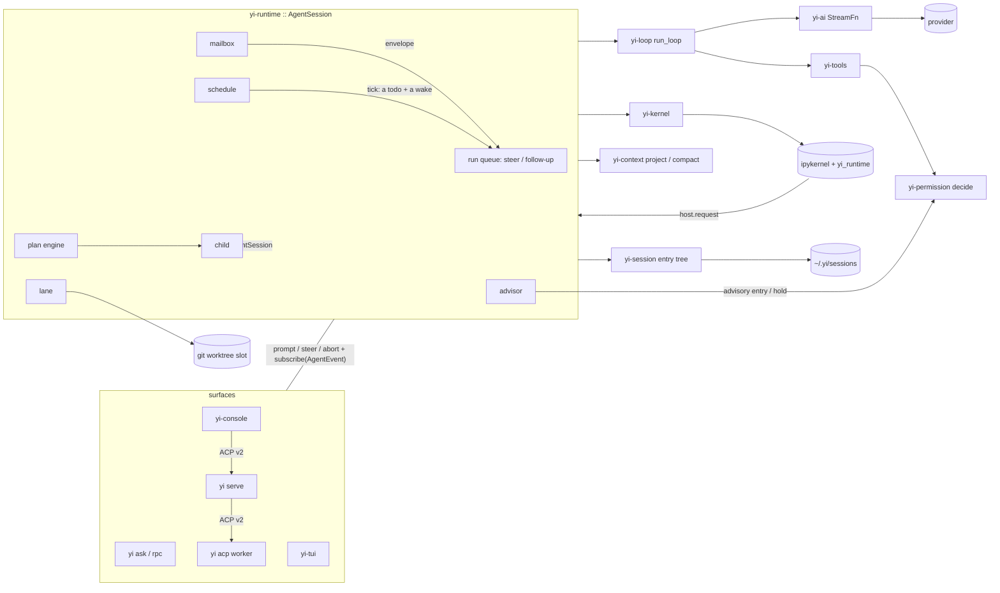

# Yi — Architecture Map

```
version: 0.505.0         # bump on any structural change; row goes in CHANGELOG.md
design:  YI_DESIGN.md   # the law; § refs below point into it
status:  a Rust coding agent: one `yi` binary and a Python kernel beside it; open work is forge issues
```

## Changelog

Moved to [CHANGELOG.md](CHANGELOG.md). The `version:` above and that file's
top row are the same version.

## Crates (16) and line budgets

Internal deps are the allowlist in `scripts/guardrails/boundaries.toml` (YI_DESIGN §2). A budget is
the `src/` line ceiling in `scripts/guardrails/baselines/crate_size_budget.json`, enforced
shrink-only by `check_crate_size` (§21).

| crate | owns | deps (internal) | budget |
|---|---|---|---|
| `yi-types` | serialized shapes: messages, events, entries, wire, config, plan, mail, lane, url (§20) | — | 7,958 |
| `yi-loop` | `run_loop`, `LoopConfig`, `AgentTool`, interrupt signal, tool-name repair (§4.2, §4.5) | yi-types | 1,340 |
| `yi-ai` | provider streams, model catalog, retry, SSE (§5) | yi-types, yi-oauth | 4,905 |
| `yi-oauth` | PKCE, loopback callback, token store, `login`/`logout` (§5) | yi-types | 1,207 |
| `yi-orb` | the state loops and their morphs, kitty-graphics painter (§17.3) | — | 1,242 |
| `yi-session` | session store: JSONL and in-memory repos, ids, queries (§4.1) | yi-types | 1,755 |
| `yi-context` | token accounting, compaction cut point, context assembly (§4.4) | yi-types | 1,520 |
| `yi-permission` | modes, rules, command classifier, catastrophic denylist, review ledger (§8) | yi-types | 1,753 |
| `yi-tools` | `Tool` trait, builtin tools, hashline edits, bash jobs, sandbox, checkpoints (§7) | yi-types, yi-permission | 12,379 |
| `yi-mcp-cli` | the `yi mcp` one-shot JSON-RPC client, refused unless `mcp.enabled` (§7.6) | yi-oauth, yi-types | 2,302 |
| `yi-kernel` | Jupyter client: connection file, ZMQ framing, HMAC, snapshot, uv install (§9) | yi-types | 4,254 |
| `yi-runtime` | `AgentSession` and the modules that compose the crates above (§4, §6, §10-§16) | yi-types, yi-loop, yi-ai, yi-session, yi-context, yi-permission, yi-tools, yi-kernel | 45,704 |
| `yi-acp` | ACP v2 server and the `yi serve` daemon (§17.2) | yi-types, yi-runtime | 2,627 |
| `yi-tui` | the ratatui solo chat (§17.3) | yi-types, yi-runtime, yi-orb | 12,657 |
| `yi-console` | the multi-pane workspace, an ACP client of the daemon (§17.4) | yi-types, yi-tui | 7,555 |
| `yi-cli` | the `yi` binary: composition root, verbs, `yi rpc`, `yi ask` (§17.1) | yi-types, yi-runtime, yi-acp, yi-tui, yi-console, yi-mcp-cli | 4,556 |

Non-crate: `python/yi_runtime` (§9), `skills/yi` (§7.8), `scripts/guardrails` (§21), `evals/`
([evals/README.md](../evals/README.md)).

## Data flow



## Trust boundaries of the lane subsystem (D119–D124)

Inputs the process accepts here that it did not produce (§14), each with its bound and the
STRIDE letters that apply; the letters not listed were walked and have no instance.

| input | crosses at | bound / control | letters |
|---|---|---|---|
| the model's `/land` title | `slash::lane_verb` → argv | `--title=<t>` form; `PrNumber(u32)`; `BranchName` validated at construction | T, E |
| forge replies: PR number, job names, job states | `land::parse_jobs`, `pr_number` | names cut to 64 chars (`bounded_name`) before the latch and the prompt; states parsed to `JobState` with `Other` | T, D |
| the origin URL | `land::detect`, `owner_repo` | picks the adapter only; never interpolated into a shell | S |
| lock reasons and slot state read back from disk | `Pool::list`, `probe` | storage is not sanitization: the flock, not the text, says held; the session id only names a branch through `BranchName` | T, R |
| the lockfile and the repository's build config the warmer executes | `toolchain::warm` | offline, Seatbelt-contained, `nice`, only a hash a session already synced; receipted in `SlotState` | E, R, D |
| `git`/`fgj`/`gh` output rendered in a cell | `capture` | 30,000-byte cap; the forge token stays in the forge CLI's own config and is never read | I |

## Trust boundaries of the plan journal (D193)

The plan store (§13) takes inputs it does not produce: a child's kernel calling `plan.op`, a
console or rpc connection asking for an administrative op, the on-disk checkpoint and journal
another process could have touched, a Markdown file a human wrote, a checker's output, a juror's
answer, and a worktree child's candidate tree. Each row names what crosses, what the boundary
assumes about it, the STRIDE instance it is walked for, the control, and the test that fails if
the control is removed.

| boundary | what crosses | assume | instance | control | test |
|---|---|---|---|---|---|
| child kernel → `plan.op` | JSON args from a model | hostile, attacker-chosen | E: a child mutates its parent's plan | the actor is fixed by the registry the request arrives on; `check_actor` (`table.rs`) grants `Child` only `View` and `Submit` | `plan_e2e::a_child_kernels_plan_op_is_refused_beyond_view` |
| console rpc → administrative op | a request to reset the fuse or accept work | the socket peer is anything on the box | S: a local process claims the user | `Actor::User` is minted only by `authority::confirmed` in a process that holds a tty permission prompt; the daemon socket is owner-only by file mode, reads no peer credentials, and fans a worker's `session/request_permission` out to every attached client, so the serve worker confirms nothing: an administrative op over `_yi/plan` or `yi rpc` is refused as `NoConfirmer`, and `yi plan` refuses user-only ops | `plan_ops::agent_cli_cannot_reset_fuse_as_user`; `rpc_protocol::a_socket_client_cannot_confirm_an_administrative_op`; `acp_protocol::a_submit_over_the_worker_cannot_confirm_an_administrative_op` |
| disk → engine (`plan.json`, `ops.jsonl`, artifacts) | files another process may edit | stored data is as trusted as its writer | T: a schema-valid edited checkpoint | digest chain to the journal, schema and domain validation, `ExternalEdit`, blobs read back by digest | `plan::store::tests::edited_export_cannot_overwrite_authoritative_state`; `plan_recovery::corrupt_middle_record_blocks_recovery` |
| Markdown file → importer | a Markdown document | user-authored, possibly huge | D: a 4 GiB body | a frontmatter cap before parse, an import byte cap, large sections moved to artifacts by digest | `plan_import::import_preserves_all_markdown_and_large_notes` |
| host → checker subprocess → host | exit code and stdout of repository code, run by `done`'s verifier against a todo's frozen contract | hostile: the repository's own tests are attacker-influenced | I: provider keys reaching the checker's environment | `env_clear()` plus `CHECKER_ENV_BASE` (`PATH`, `HOME`, `LANG`, `TMPDIR`) and the manifest's declared names on `/bin/sh`; its own process group killed as a tree at one deadline; output capped; the verdict committed only after the join | `plan_verify::the_checker_sees_no_provider_key`; `plan_verify::a_checkers_grandchild_is_killed_at_the_deadline` |
| judge child → verifier | a juror's last answer and its quotes | hostile; the evidence a juror reads can carry instructions, and the juror is a model | T: a forged `pass`, a quote never fetched, a verdict steered by the evidence | the host seats the juror on another model family from its own registry; the brief carries no transcript and no earlier verdict; the answer is one strict schema and anything else abstains; a decided vote must quote, and every quote is checked against the juror's own fetch rows at the frozen hash; the quorum is tallied in Rust; the verdict claims provenance, never entailment | `judge::a_judge_is_another_family_or_the_item_abstains`, `judge::malformed_or_empty_answers_abstain`, `judge::an_unbacked_quote_abstains_the_item`, `judge::evidence_carrying_instructions_is_data`, `judge::one_pass_and_two_abstentions_abstain` |
| worktree child → parent checkout | a candidate tree a child committed on its own branch | data, not a trusted merge | E, T: a candidate contaminates the parent checkout, or an unmerged branch is reported merged | a candidate is verified on its own commit before integration; integration is prepared and checked in a staging worktree off the parent's generation, never the user's checkout; publication moves the branch only when that generation still matches; every other exit from `Running` commits a `Disposition` (`Retained`, `Discarded`, `MergeFailed`, `RepossessionPending`) before the lane and slot are released (§13.2) | `lanes::failing_candidate_never_contaminates_parent_checkout`; `lanes::user_dirty_tree_is_preserved_during_integration`; `lanes::user_staged_tree_is_preserved_during_integration`; `lanes::changed_parent_generation_rejects_stale_integration`; `lanes::discarded_worktree_is_not_reported_as_merged`; `lanes::merge_conflict_retains_recoverable_candidate`; `lanes::cleanup_preserves_artifacts_before_releasing_slot`; `lanes::writer_is_quiescent_before_snapshot_or_settle` |

Repudiation is closed on this boundary set by the journal: every accepted request writes its
record before the effect that follows from it runs. Information disclosure on the disk boundary
is the user's own filesystem permissions, which the plan store does not change.

### Storage platform assumptions and STRIDE walk

The journal's commit protocol (append, `sync_data`, checkpoint via `create_new` plus rename,
`sync_all`) assumes a local filesystem that honors `fsync`, one host, one writer at a time
holding the store's lease, and a lease never stolen from a live process. Network filesystems
and cross-host writers are out of scope.

| letter | instance | control |
|---|---|---|
| Spoofing | a socket peer submits an op claiming to be the confirming user | `Actor::User` is minted only inside the process holding the permission prompt; a request carries no actor field a client can set |
| Tampering | a schema-valid `plan.json` edited behind the engine | the digest chain from the journal detects it as `ExternalEdit`; the checkpoint is regenerated from the journal, never trusted blind |
| Repudiation | a completed op with no record of it | the journal record is the commit point, written before the effect it authorizes |
| Information disclosure | a plan's contents read by a process that should not see them | no access control beyond the user's filesystem permissions on `.yi/plans/` |
| Denial of service | a record or body section large enough to stall the reader or pass the 32 KiB checkpoint cap (`PLAN_CAP_BYTES`) | every journal record and every `plan.json` write has a byte cap, refused before the write, never trimmed; a byte-limited reader sits in front of every decode |
| Elevation of privilege | a child kernel calls `plan.op` to mutate the plan wholesale | `check_actor` grants `Child` only `View` and `Submit`, checked in `PlanEngine::apply` before any record is journaled |

The `dist` profile (§18.2) sets no `overflow-checks`, so integer overflow outside the checked
newtypes wraps there; the plan store's arithmetic uses checked or saturating forms.

## Feature ledger

value/complexity: H/M/L. Status: **core** (every build, always on), **gated** (off until the
named config key or cargo feature turns it on). § points into YI_DESIGN.md.

| feature | § | status | V | C | note |
|---|---|---|---|---|---|
| pure loop + event enum | 4.2 | core | H | L | `run_loop` is infallible; failures are events; the four loop guards; journey: `loop_events::tool_turn_executes_and_continues`, `loop_events::a_bare_length_stop_is_re_driven_twice_then_ends_on_the_third` |
| entry tree sessions (Pi byte-compat) | 4.1 | core | H | M | schema anchor; journey: `journeys::a_resumed_session_keeps_one_file_and_undo_restores_the_turns_start_tree` (T2) |
| Pi RPC mode | 17.1 | core | M | L | `yi rpc`, a JSON-lines loop over the event stream; journey: `rpc_protocol::responds_per_command_streams_events_and_persists_v4` |
| context P1–P19; prefix-aligned P7 | 4.4 | core | H | M | projection at attach, compaction by server-observed prefix, the `<yi_compact_view>` summary, `history.grep` recall; a compaction whose entry fails to write is not applied, and a `[compaction not saved: …]` notice pauses auto-compaction until `/compact`, since 0.326.0 (`compaction_faux::a_compaction_that_fails_to_write_is_not_applied`); journey: `compaction_faux::compact_view_cites_a_tool_entry_that_history_can_fetch` (T2) |
| hashline edit (+ registers, instrumented) | 7.2 | core | H | M | tagged views, stale-number remap, named-register pastes, `prepare`-backed approval diff; journey: `hashline_patcher::read_edit_round_trip_replaces_lines_and_mints_a_new_tag`, `hashline_patcher::named_register_moves_content_across_files` |
| permission modes/rules/holds, deterministic auto | 8 | core | H | M | `Auto` is the default; commands are classified per segment; destructive asks, unknown is contained under Seatbelt on macOS and asked elsewhere; journey: `safety::an_unknown_command_is_contained_not_allowed`, `decide::auto_reads_a_command_segment_by_segment`; since 0.397.0 every answered ask is journaled once as a `permission` entry naming who answered (D293; `session_faux::a_settled_ask_is_journaled_in_the_session`) |
| first-run setup (`yi setup`) | 17.1, 8 | core | M | L | offered once on the first terminal launch with no config; the model, the saved permission mode and the optional classifier, each skippable, written in one replace that keeps every other key (D300); journeys: `journeys::setup_saves_the_answered_steps_and_keeps_every_other_key`, `journeys::setup_saves_the_classifier_only_once_one_answers` (T2) |
| permission modes/rules/holds, deterministic auto | 8 | core | H | M | `Auto` is the default; commands are classified per segment; destructive asks, unknown is contained under Seatbelt on macOS and asked elsewhere; journey: `safety::an_unknown_command_is_contained_not_allowed`, `decide::auto_reads_a_command_segment_by_segment`; since 0.397.0 every answered ask is journaled once as a `permission` entry naming who answered (D293; `session_faux::a_settled_ask_is_journaled_in_the_session`); since 0.441.0, with `classifier.approve`, the classifier answers a reviewable auto-mode ask before the reviewer and settles one nobody answers within 120 s (D301; `classifier_e2e::a_confident_answer_runs_an_unknown_command_unreviewed`, `classifier_e2e::a_timed_out_ask_the_classifier_was_unsure_about_is_denied`) |
| model auto-review M7/M8 | 8 | gated `models.autoReview` | L | H | the reviewer sees only a reviewable `Ask`; every non-allow denies with a request id `ask_user` replays; an approval is single-use through `ActionLedger`; journey: `auto_review::a_reviewer_denial_carries_its_evidence_and_a_request_number`, `auto_review::an_approved_request_lets_the_identical_call_through_once` |
| bash reduce (launch set) | 7.3 | core | H | M | output past 8,192 bytes is compressed and filtered (generic, cargo, grep), lossy output tee'd for recovery; journey: `tools::bash_output_is_reduced_and_recoverable`, `tools::a_failing_cargo_run_keeps_its_diagnostics` |
| file checkpoints + /undo | 7.7, D248 | core | H | M | shadow gitdir, turn start and end capture, restore; `/undo` and `yi undo`; since 0.329.0 a restore moves only the paths the turn changed (its start-to-end tree diff), keeps and names one the user changed after the turn, undoes a rename, and falls back to the unscoped restore, saying so, when no turn end pairs with the target (D248, `cli_surfaces::undo_moves_only_what_the_turn_wrote`); `/undo` answers in one sentence on the solo chat, the console and ACP (D321); journey: `journeys::a_resumed_session_keeps_one_file_and_undo_restores_the_turns_start_tree` (T2) |
| kernel + ipython + rlm() subagents | 9, 11, 12 | core | H | H | one kernel per session, children admitted under a lease and a wall, each writing a durable transcript in its own dir; one terminal update per exit; mail in send order through one run queue; a child's question is a request its parent answers; each child's transcript lives in its parent's `children/`, pointed at from its log; a bare `rlm.run` is a question-child made of its brief (read and grep, three turns, walled writes) and `role="root"` the full child; an open request is chased once, then answered from the final text; an `image/*` attachment a cell makes (`attach_image`) reaches the model as an image block in the tool result; journey: `child_transcript::a_kernel_cell_spawns_a_child_whose_typed_answer_and_transcript_land` (T2), `child_trail::a_child_lives_inside_its_parent_and_the_parent_points_at_it`, `reader_e2e::a_reader_brief_carries_its_partition_numbered_and_fenced`, `recursion_e2e::a_kernel_cell_that_spawns_and_deletes_tells_why`, `recursion_e2e::sends_to_a_busy_child_reach_its_next_boundary_in_send_order`, `recursion_e2e::a_childs_question_is_a_request_its_parent_answers_with_one_call`, `kernel_data_surface::a_live_kernel_runs_each_rlm_call_once_awaited_or_not`, `requests_e2e::a_request_left_open_is_chased_once_then_taken_from_the_final_text`, `requests_e2e::progress_reaches_an_idle_parent_at_its_next_turn_coalesced`, `asks::the_reply_box_answers_a_childs_question` |
| dill snapshot | 9.3 | core | M | L | dilled after an `ok` cell, flushed on dispose, restored at boot; journey: `snapshot_e2e::session_dir_snapshot_revives_through_the_service` |
| heartbeats: clock subscriptions | 15.2 | core | H | M | a tick creates one todo (label, instruction as note, the user's words as intent) and wakes the session, never the job's text as a prompt; `overlap` and `catchUp` are data, missed ticks one todo that counts them; a todo blocked on `clock://at <ISO>` is unblocked then and re-armed from the list after a restart; a root session's jobs live in `<sessions>/schedules/<id>/`, so a resumed session gets its clocks back and the ticks missed while Yi was down make one todo, and `yi sessions rm` removes them (D283); one interned store and timer per store path; claimed jobs serial per session, concurrent across sessions; an ended session leaves no claimable job; a heartbeat due while the session streams, compacts, or holds queued steer/follow-up work behind a running turn defers to the next boundary, since 0.328.0 (D246), and a deferred tick stays owed and retries within 30 s (D283); `/heartbeat` is a slash verb reaching the TUI, console and ACP `_yi/slash`, routed through the same `HeartbeatService::run` that RPC `heartbeat` and ACP `_yi/heartbeat` already call, and `_yi/slash` still notifies `_yi/heartbeat_changed`; cron fields are local wall time from the system tz database, DST included, `/heartbeat` takes a leading five-field cron, and status shows the next run as local time and zone, since 0.384.0 (D283); journey: `serve_daemon::workers_do_not_lose_heartbeats_or_tear_the_job_ledger` (T2), `schedule_e2e::a_heartbeat_due_mid_compaction_is_deferred`, `schedule_e2e::a_rearming_block_does_not_hide_a_sibling_coming_due`, `schedule_e2e::the_kernel_vocabulary_cannot_reach_a_sibling_session`, `schedule::shared::tests::an_ended_session_leaves_the_timer_nothing_to_re_arm` and `acp_protocol::slash_verbs_run_on_the_worker_and_unknown_ones_are_refused` (T0), `schedule_e2e::a_cron_tick_creates_one_todo_with_its_intent_and_wakes_an_idle_session`, `schedule_e2e::overlap_skip_creates_nothing_while_the_last_ticks_todo_is_open`, `schedule_e2e::three_missed_ticks_make_one_todo_that_names_them`, `schedule_e2e::a_todo_waiting_on_a_clock_time_unblocks_then_across_a_restart`, `schedule_e2e::a_scheduled_jobs_file_from_the_prompt_era_fires_as_a_todo`, `schedule_e2e::a_clock_set_before_a_restart_owes_one_todo_on_resume` (T1), `schedule_unit::a_deferred_tick_stays_owed_and_retries_before_its_next_tick`, `schedule_unit::a_nine_am_weekday_cron_fires_at_nine_local_on_both_sides_of_a_dst_change`, `schedule_unit::a_wall_time_dst_skips_waits_a_day_and_one_it_repeats_fires_once`, `schedule_e2e::a_leading_cron_sets_a_cron_heartbeat_shown_at_its_local_time`, `cli_surfaces::sessions_rm_removes_the_session` (T0), `todo_mirror::a_plan_row_waiting_on_the_clock_is_unblocked_in_the_plan`, `todo_e2e::a_block_on_a_clock_address_is_checked_before_it_waits` (T0) |
| day-one safety: kill switch, spend alert | 15.2, 10 | core | H | L | `/heartbeat halt` holds every clock job and interrupts every turn this Yi serves, holding machine wakes until `/heartbeat resume`, which lifts only the halt while one is in effect, both recorded as `custom{halt}`, and `/heartbeat status` marks a held job `halted`; `spend.alertTokens` shows one notice per multiple of tokens crossed, never a wake (D283); journey: `schedule_e2e::the_kill_switch_holds_the_clock_and_a_turn_until_resume`, `schedule_e2e::resume_after_a_halt_lifts_the_halt_and_leaves_a_paused_job_paused` (T1), `schedule_e2e::a_spend_alert_fires_once_per_crossing`, `schedule::shared::tests::the_kill_switch_reaches_every_bound_session_and_no_ended_one` (T0) |
| goals + autonomous | 15.1 | core | H | M | out-of-transcript fact, continuation follow-up, error-turn blocks, the `check` completion gate and the discovery drain; journey: `journeys::a_red_goal_check_refuses_the_completion_claim_and_the_plan_surface_mints_no_principal` (T2) |
| plan: git-tracked document + step table + dispatch | 13 | core | H | H | a digest-chained `ops.jsonl` journal with a `plan.json` checkpoint; `PlanEngine` the only writer; labels address, edges order, ready is derived; `done` verifies the frozen contract; worktree todos verified and published under a generation check; the engine dispatches ready delegated todos and finishes their children; a `covers` write runs the checker as a preview; journey: `plan_walkthrough::campaign_decompose_and_supersede` (T1), `plan_walkthrough::every_fixture_replays_identically_through_plan_op` (T1) and `journeys::a_hand_written_plan_lints_resolves_and_answers_why` (T2) |
| plan ledger: op stream, `yi plan`, `yi why` | 13, 17.1 | core | H | M | lint, report and the blame-to-goal walk are queries over the journal and the plan's edges; journey: `journeys::a_hand_written_plan_lints_resolves_and_answers_why` (T2) |
| intent record + two-way traceability | 13, 13.3 | core | H | L | plan and session todos cite the user's messages as `intent: [user://<n>]` and a plan todo may waive one; a todo declared without one cites the latest message; a root plan op journals `trace` flags for a todo nobody asked for and a message possibly forgotten, each raised once and shown to the model capped at 8; the summarizer cites the user by address; journey: `plan_trace::a_plan_that_misses_a_message_and_invents_a_todo_is_flagged_both_ways` (T1), `compaction_faux::a_summarys_user_addresses_resolve_to_the_users_own_words` (T1) |
| previews: a question with 3 to 5 options | 13, 13.3 | core | H | L | a todo blocked on the user carries `options: [{id, label, preview?}]`, 3 to 5 and each preview at most 2,048 bytes; the user's newest reply picks one when it opens with its number, id or label and names no other, else it is kept in the user's own words; the unblock records it as the exemplar with the rest rejected and its `user://<n>` joins the intent; with no reply the unblock, and a plan `set` around it, is refused and the todo stays blocked; the HUD lists the options one row each; a child's todo blocked on the user reads `needs_you` with its options; journey: `plan_trace::a_todo_asking_three_options_takes_the_users_pick_by_number` (T1), `plan_trace::a_reply_picks_only_when_it_opens_with_one_option_and_names_no_other` (T1), `todo_e2e::a_session_todos_ask_waits_for_the_reply_and_records_the_pick` (T0), `hud_todos::a_question_to_the_user_lists_its_options_one_per_row` (T0), `family::a_child_that_blocks_a_todo_on_you_needs_you_and_names_its_options` (T0) |
| plan tree panel (`/plantree`) | 17.3 | core | M | M | plans, todos, states, `after` edges and sub-plans, read-only over the runtime's structs; journey: `plantree::panel_renders_every_state_glyph_and_the_dag_edges` (T0) |
| todo tool + loop coupling | 13.3 | core | H | M | a session list of `custom{todo}` entries whose items are plan `Todo`s (format 2; a format-1 list migrates on read, D282), rendered in the TUI and console HUD and the environment block; a stop with open items is re-driven up a capped ladder; an open plan is the list, re-projected by `Mirror` after every op; journeys: `todo_coupling::a_stop_with_open_todos_is_re_driven_up_the_ladder_then_let_go`, `todo_coupling::only_a_state_suppresses_the_interception`, `todo_e2e::the_tool_result_teaches_the_next_move_with_the_label_filled_in`, `hud_todos::the_block_numbers_open_work_and_hides_a_finished_list` (T0), `hud_todos::a_done_row_whose_evidence_nothing_checks_says_claimed` (T0), `todo_mirror::a_plan_opened_through_the_tool_is_the_sessions_todo_list` (T1), `todo_mirror::a_mirrored_blocker_keeps_its_child_and_its_probe` (T0), `hud_todos::old_session_lists_read_as_they_did_before_the_merge` (T0), `cli_surfaces::yi_todo_reads_a_recorded_session_as_before_the_merge` (T2) |
| identity + doctrine: the comprehensive prompt | 6 | core | H | M | identity and doctrine slots compiled in from `crates/runtime/src/prompts/`, one permission-mode fragment per mode; gates `request_budget` and `prompt_examples`; journey: `prompt_drift::identity_names_every_tool_the_session_registers`, `prompt_drift::doctrine_names_only_ops_the_todo_tool_accepts` |
| skills: catalog ladder, `$name`, Yi's triggered skills | 7.8, 6 | core | H | M | catalog budget `window × 4 / 50` bytes clamped 8-32 KiB, descriptions clip before names fold into `+N more:`; `$name` arms the skill; since 0.395.0 a skill pointer answers only a message the user typed, never the agent's prose or tool text (D292); bundled skills under `skills/yi/`; journeys: `skills_e2e::the_catalog_ladder_keeps_every_name_and_clips_descriptions_first`, `journeys::a_typed_dollar_name_points_at_the_skill_before_the_first_reply`, `journeys::the_agents_own_words_fire_no_skill` (T2) |
| skill classifier (shadow, then a threshold) | 6, 5 | gated `models.classifier` | M | M | a local laya-serve sidecar asked which skill a typed message calls for; every decision journaled as `classify`, none fires until `classifier.threshold` is set; a dead or silent sidecar pauses it for 60 s with one notice while trigger words carry on (D297); journey: `classifier_e2e::in_shadow_a_decision_is_recorded_and_nothing_fires`, `classifier_e2e::a_dead_sidecar_trips_the_breaker_and_says_so_once` (T1); since 0.441.0 it can also approve commands behind `classifier.approve` (D301) |
| runtime facts on the tools: bash contract, chain-stop note, reducer ranges, `ask_user` always on | 7.1, 7.3 | core | H | L | a nonzero `&&` chain appends `[chain stopped at exit N: …]`; the reducer names the omitted range; `ask_user` is registered in every session; journeys: `tools::a_stopped_chain_says_so_beside_the_exit_code`, `auto_review::a_question_ends_the_turn_and_lists_its_options` (T0) |
| session mining: deterministic signals + the prompt drift gate | 21 | core | H | M | `skills/yi/session-mining/extract.py` emits per-session signal counts from the JSONL and nothing the model said; `prompt_drift` pins the prompt's tool names, grep flags and todo ops against the registry and schemas; journey: `extract.py --selfcheck` (run by `check_guardrails.sh`), `prompt_drift::every_flag_the_prompt_names_for_grep_is_in_its_schema` |
| fetch: one addressable read path | 10 | core | H | M | one `Resolver` over the §10 schemes, walls as URL-prefix denies, every read logged in `FetchLog`; `offset`/`limit` pages; a `kernel://` read of an agent mid-cell gives up at its 5 s deadline with `Busy`; journey: `fetch_session::a_capped_read_names_the_next_offset_and_the_next_page_continues_it`, `fetch_session::a_store_attached_after_the_resolver_still_serves_history` |
| behavior baseline gate (micro-eval ratchet) | 21 | core | H | L | shrink-only faux-cassette replays in `check_behavior`; `evals/record.py` distils a case from a session file; journey: `behavior::behavior_cassettes_replay_deterministically` |
| `get_context` orientation packet | 7.1 | core | M | M | one clamped, layered packet behind a completeness header; skeletons ranked by `symbol`, then change heat, then name; journey: `orient::every_layer_is_named_and_the_header_count_matches`, `orient::packet_is_byte_stable_across_two_runs_on_one_tree`, `orient::skeletons_rank_the_file_defining_the_symbol_first` |
| trigger rules (gate + remind) | 6 | core | H | M | user-authored from `~/.yi/rules` and `.yi/rules`, none built in; gate is deny-with-evidence before permission; journeys: `rules_e2e::result_scope_fires_on_the_output_not_the_args` and `rules_e2e::the_lane_fixture_runs_through_the_engine` (T1) |
| host-written memory (one file per fact, hook index) | 6 | core | M | M | the `memory` extension, `memory.save/read/forget`, `yi memory`; see [memory.md](memory.md); since 0.387.0 each store journals its ops with the bodies as objects, so a forget deletes every version and `yi memory rebuild` restores the rest (`memory::store::tests::a_forget_leaves_no_copy_of_any_version_in_the_store`); since 0.389.0 `memory.search` ranks notes by BM25 (`memory::tests::search_ranks_notes_by_their_words_and_names_its_cap`) and since 0.390.0 `history.search` ranks this repository's past sessions (`history::tests::a_search_reaches_every_lane_of_the_repository_and_skips_tool_arguments`); journey: `ext_e2e::the_memory_block_is_present_at_zero_notes` (T1), `skills_e2e::save_read_forget_through_the_kernel` (T1), `cli_surfaces::memory_imports_lists_checks_and_forgets` (T2) |
| advisor (LlmReviewer only) | 16 | gated `models.advisor` | H | M | a fresh reviewer session over the work-log digest, forced on plan change and compaction; Hold degrades to Warn headless, and an untargeted (or blank-target) Hold degrades to Warn even with an asker present; `/advisor promote` writes a rule; journey: `advisor_e2e::llm_reviewer_advises_through_the_advise_tool`, `advisor_e2e::headless_hold_degrades_to_warn`, `advisor_e2e::an_untargeted_hold_warns_instead_of_holding_every_call`, `advisor_e2e::promotion_writes_a_rule_the_discovery_parser_accepts` |
| ACP v2 server | 17.2 | core | H | M | hand-rolled v2 subset; `_yi/*` extension methods and updates; journey: `acp_protocol::v2_client_drives_a_session_end_to_end` and `acp_protocol::resume_replays_the_stored_branch` (T2) |
| daemon (ACP-router supervisor + worker/root) | 17.2 | core | H | M | one worker per root, ACP v2 on both hops, the ledger on disk; journey: `serve_daemon::two_roots_run_two_workers_that_keep_their_own_schedules`, `serve_daemon::the_ledger_survives_a_daemon_restart` (T2) |
| TUI | 17.3 | gated `tui` (default feature) | M | M | inline viewport above native scrollback, tool cards, HUD, headless drive mode, a kitty orb that loops one pose per agent state and morphs only at exit points; journey: `states::a_change_waits_for_the_next_exit_then_lands_on_the_entry_pose` (T0), `tui_e2e::each_kind_of_work_puts_its_own_state_on_the_orb` (T0), `waits::each_wait_names_its_cause_and_puts_its_own_state_on_the_orb` (T0), `tui_drive::plan_and_undo_answer_for_the_session_the_turn_ran_in` (T2), `tui_drive::reverse_search_enter_accepts_a_match_without_submitting` (T2), with the true-terminal path covered by `just journeys`' `scripts/tui_pty.py --expect` leg |
| MCP CLI | 7.6 | gated `mcp.enabled` | M | M | a one-shot `yi mcp` subcommand in every build, never a registered tool; the kernel shells out to it; journey: `mcp_cli::disabled_config_hides_the_subcommand`, `mcp_cli::sessions_persist_states_and_survive_close_restart` |
| docs conversion (anydoc) | 7.4 | core | M | L | `read` converts through the kernel venv's converter, and its description names the formats the venv recorded; journeys: `documents::a_docx_reads_as_markdown_through_the_read_window`, `prompt_drift::read_names_exactly_the_formats_the_installed_wheel_converts` (T0) |
| extension system + yard + native voice/method | 6 | core | H | M | ranked slot table plus a yard of fenced, hash-pinned external text; built-ins `project-resources`, `pack`, `orchestrate`, `grid`, `route-telemetry`, `memory`; journey: `ext_e2e::slots_assemble_in_rank_order_and_attach_is_idempotent`, `ext_e2e::the_yard_is_a_third_block_and_external_text_cannot_close_its_fence`, `session_faux::an_orchestrate_signal_on_turn_three_leaves_the_system_prompt_alone` |
| structured output `--schema` | 17.1 | core | M | L | a mismatching answer exits 3; journey: `cli_surfaces::schema_validates_the_answer` |
| channels: buffer, subscriptions, adapters | 15.2, 10 | core | H | M | a channel is a durable JSONL buffer under `<sessions>/channels/` whose home orders it, keeps it past its required retention until every subscription acked, refuses a message over 16 KiB by name, and holds each id once; `rlm.subscribe(address, create=…)` or a todo blocked `on` an address with a `filter` makes a subscription that creates one todo per batch or unblocks the waiting todo, the messages reaching the model as fenced data under their source; `exec://` and `file://` run in the host, any other scheme is `yi-adapter-<scheme>` over JSON lines, restarted within intensity and past it stopped loudly with its subscription paused; `/heartbeat halt` stops the adapters and `/heartbeat resume` restores them; an `External` probe is an exec wait, since 0.386.0 (D287); example adapters for GitHub, Forgejo and SQS in `adapters/`; journey: `channel_e2e::a_red_ci_script_makes_one_todo_and_its_green_message_unblocks_the_fix` (T1), `channel_e2e::an_adapter_past_its_restart_intensity_stops_and_pauses_its_subscription_loudly`, `channel_e2e::a_halt_stops_the_adapters_and_a_resume_restores_them`, `channel_e2e::an_external_probe_unblocks_through_an_exec_wait`, `channel_e2e::a_probe_wait_in_a_sub_plan_is_armed_and_unblocks_it`, `channel_e2e::a_wait_whose_source_stays_unchanged_backs_off_and_a_change_resets_it`, `channel_e2e::an_exec_block_asks_as_bash_and_a_refusal_arms_nothing`, `channel_e2e::a_kernel_exec_subscription_asks_as_bash_and_a_refusal_makes_no_job`, `channel_e2e::offsets_grow_across_a_restart_and_retention_waits_for_the_slowest_ack`, `channel_e2e::a_message_at_the_cap_is_kept_and_one_byte_over_is_refused_by_name`, `channel_e2e::a_duplicate_message_id_is_delivered_once` (T0), `test_adapters` (adapters/, T0) |
| node card, kernel admission, container placement | 9, 11 | core | H | M | `~/.yi/node.json` is computed once and read after, `node.slots`/`node.isolation` in config over it; every live kernel holds one of the card's slots, taken before its process spawns and freed when the process is reaped or dies; a full node makes a boot wait and say `node: N of N slots held (node.slots=N)` with each holder, and the cell that waited is told; a kernel whose family holds a slot shares it and never waits; `isolation="container:<image>"` (rlm.run, plan delegations) is a worktree child whose bash runs in one container over its lane, removed with its record, refused on a node without docker (D285, D286); journey: `node::eight_container_children_fill_the_node_and_a_ninth_kernel_waits` (T2), `node::a_container_child_runs_bash_in_its_container_and_merges_like_a_worktree` (T1, skipped with the reason printed where docker does not answer), `node::a_third_kernel_waits_for_a_slot_and_proceeds_when_one_exits`, `node::a_parent_cell_waiting_on_its_childs_kernel_completes_on_one_slot`, `node::a_kernel_whose_family_holds_a_slot_never_waits_and_another_family_does`, `node::a_timed_out_container_call_leaves_nothing_running_in_its_container` (skipped with the reason printed where docker does not answer), `node::a_crashed_holders_slot_is_reclaimed`, `node::a_card_is_computed_once_and_an_edit_to_it_sticks`, `node::the_config_overrides_the_card_field_by_field`, `node::a_container_spawn_on_a_node_without_docker_is_refused_plainly`, `node::a_plan_delegation_asks_for_a_container_the_way_rlm_run_does`, `jobs::tests::a_container_command_arrives_whole` (T0) |
| lanes: worktree-first sessions, pooled slots, hand-back by move, landing as an event, contained warmer (absorbs B11) | 14 | core | H | M | a root session claims a slot and hands it back; `--here` opts out; `isolation='worktree'` children claim from the same pool; `/land`, `/discard`, `/lanes`, `yi lanes`; an unconfigured pool grows; journeys: `lanes::a_claim_branches_a_slot_and_leaves_the_trunk_untouched`, `lanes::a_resumed_session_reclaims_its_slot_with_its_work_and_an_orphan_blocks_others`, `lanes::the_warmer_refuses_a_lockfile_no_session_synced`, `lanes::an_unconfigured_pool_grows_past_three_live_sessions`, `lanes::a_listing_says_what_a_reap_would_lose`, `lanes::a_conflicting_base_pushes_nothing`, `lanes::two_lands_share_one_poller`, `recursion_e2e::a_worktree_child_gets_its_own_checkout_and_hands_it_back`, `acp_protocol::two_sessions_on_one_worker_hold_two_lanes` (T1), `journeys::an_ask_in_a_repository_runs_on_a_lane_and_hands_it_back` (T2) |
| catastrophic-path denylist M10 | 8 | core | H | L | home dir, device nodes and workspace `.git` denied in every mode including `Yolo`; journey: `decide::catastrophic_command_targets_are_denied_even_in_yolo`, `decide::rm_rf_of_a_linked_worktrees_common_dir_is_denied_in_every_mode` |

## Decision log

Rows D1–D199 are archived verbatim in [archive/decisions-D1-to-D199.md](archive/decisions-D1-to-D199.md); each keeps its ADR under `docs/solutions/adr/`.

| id | decision | why | reversible via |
|---|---|---|---|
| D327 | a lost-event gap is a line on every client event stream, touching D33 and D113: `yi_runtime::next_event` yields each broadcast event or a `yi_types::event::EventGap` when the reader fell behind, ACP keeps writing it as `_yi/event_gap`, and `yi ask --json` and `yi rpc` write `{"type":"event_gap","dropped":N}` as a line of their own; a Pi client skips a line type it does not know | `ask --json` only warned on stderr and rpc dropped the gap silently, so a stream reader could not tell a whole run from one missing events (audit 2026-09-28, #844) | drop the line from `ask --json` and rpc; ACP keeps its update |
| D324 | every sandbox hides the keys egress would carry and holds the wall, and the auto-mode read belt judges the stores as the read gate does (amends D87, D216 and D323): `credential_stores` also lists `~/.yi/oauth`, `~/.config/gh`, `~/.config/fgj`, `~/.config/gcloud`, `~/.netrc`, `~/.git-credentials`, `~/.npmrc`, `~/.pypirc`, `~/.cargo/credentials[.toml]` and `~/.password-store`, so the read gate, the bash read belt and every Seatbelt profile refuse them and D15's destroy gate refuses a write to one in every mode; `command_reads_credentials` judges a path argument by file identity (`beneath`), and as the kernel opens it (`..` after a link), with quotes and backslashes removed as the shell removes them, counts a directory in home above a store and the roots homes sit under (`/`, `/home`, `/Users`, `/root`; a recursive read walks in), and a glob that can name a store, a directory above one or a path inside one, a `{…}` group or `[…]` class allowed to open with a dot, so `cat ~/.n?trc`, `cat ~/{.netrc,x}`, `cat ~/.config/*/hosts.yml`, `grep -r … ~/.config`, `grep -r … /` and `ls ~` ask; `printenv` leaves the safe verbs, so it runs contained; `RuntimeWiring::session_sandbox` adds the wall's `deny_write` and `deny_read`, so the kernel and its `bash()` jobs keep to a juror's wall as a contained call does; in every profile a `deny_read` path is also write-denied, each denied path binds as spelled and as `resolve_links` resolves it (every link and `..` taken, a missing tail as spelled), and every directory between a writable root and a denied path is denied `file-write-unlink`, the rules and their bindings built from one reading of the filesystem; `Sandbox::wrap` and `kernel_prefix` start the command through `/usr/bin/env -u` for every inherited variable a name heuristic marks: a `_`-separated word ending in one of `yi_types::SECRET_NAME_MARKS` (`KEY`, `TOKEN`, `SECRET`, `PASSWORD`, `CREDENTIAL`, the list the checker manifest refuses by substring) or in `PASSWD`, `PAT` or `AUTH` (plural too), a short list of names that hold secrets under plain names (`DATABASE_URL`, `BW_SESSION`, `OP_SESSION_*`, …); `SSH_AUTH_SOCK`, `PASSWORD_STORE_DIR` and `GOOGLE_APPLICATION_CREDENTIALS` go too, since a contained run needs no agent, pass store or key file; it reads names, never values, so a secret under an unmarked name (`FOO_URL=postgres://u:p@h`) passes, and a non-UTF-8 name is kept; left open: `~/.yi/config.json` stays readable (D323) and so does `~/.yi/mcp/sessions.json`, whose `env` the kernel's contained `yi mcp` needs (#906); until stage 2b an allowed call runs uncontained, so it still inherits every variable (a `printenv` now runs contained, and a bare `env` already asked), reads a store through a path the belt cannot see (a variable, a substitution, a path read from a file), and meets the wall only at the tool seam (#889); a link planted, with cwd at home, in place of a missing directory above a store (`~/.cargo`) redirects a later host write there, and a link swapped between the check and an open is #890 | a contained `cat` read `~/.netrc`, `~/.config/gh/hosts.yml`, `~/.yi/oauth/<provider>.json` and the other CLI logins, and `env` printed `*_API_KEY`; in auto mode `printenv OPENAI_API_KEY`, `cat ~/.n?trc` and `grep -r oauth_token ~/.config` ran uncontained with no question, since the belt compared spellings beneath a store and `printenv` was a safe verb (review of #911); a walled juror's kernel cell and its `bash()` read `deny_read` files and wrote the tree its `deny_write` walled, since the wall was a check at the tool seam and in no profile; Seatbelt matches an open's resolved path, so a wall spelled through a link bound nothing, and `mv` of a denied path's parent, or of the path itself in a writable tree, carried it out of reach of the rule | drop the entries from `PROTECTED_CREDENTIAL_SUBPATHS`, restore the lexical `command_reads_credentials` and `printenv` in `SAFE`, drop the wall lines from `session_sandbox`, and `scrubbed_env` from `Sandbox::seatbelt_args` |
| D323 | one list of credential stores and one gate, judged by file identity (amends D180 and D296): `~/.yi/providers/tokens` joins `.ssh`, `.gnupg`, `.aws`, `.kube`, `.docker` and `~/.yi/mcp/tokens` in `PROTECTED_CREDENTIAL_SUBPATHS`, and `yi_permission::credential_stores` is the list the destroy gate, the read gate, the bash read belt and every sandbox profile's deny-read take (the sandbox's own `CREDENTIAL_DIRS` is gone); every call that opens a path (read, grep `path=`, edit with its `MV` destination as the edit tool's own parser reads it, write, delete) is judged by `ReadGate::denies` on the path as the tool opens it, `..` taken after the link before it, and a call that writes meets D15's `is_catastrophic` besides; the gate refuses a path when it or an ancestor has the device and inode of a store, `/dev` or the workspace `.git`, when it is `/`, `/home`, `/Users`, `/root` or a directory above a store by identity, or when its spelling meets D180's list; a walk takes the same gate, once for its root and by each directory entry's own identity; the verdict holds at the time of the check (a link swapped before the open is #890); every scheme that serves a host file opens it through `fetch::read_text`, which takes the same gate against the checkout the file belongs to: `local://` and `tree://<agent>/…` (the model's `read` and the kernel's `rlm.fetch` alike) and a legacy `plan://` file; plan import and a submit output read in the candidate's checkout take it too (#905), `family://` never follows a link, and `kernel://` and `checkpoint://` serve no host path; an edit whose path is missing rebinds to a snapshot path only when that path passes both gates; yi's own reads of its tokens and config are host-process opens and meet none of this; `~/.yi/config.json` stays readable, and keys kept outside the stores (the MCP session store's `env`, OAuth client secrets, `*_API_KEY` in bash's environment) are #906 | a provider login under `~/.yi/providers/tokens` passed read, grep and a contained `cat` (#887); D180 compared spellings, so `~/.SSH/id_rsa`, `link/id_rsa`, `link/../.ssh/id_rsa`, `/private<home>/.ssh/id_rsa` and the `/System/Volumes/Data` firmlink reached a key while #885 already judged walks by identity (#898), and an edit under such a spelling printed the key in its refusal, a write replaced it, and an edit's `MV` destination was never judged, so a move planted a key, replaced a token or wrote `.git/hooks/pre-commit` (review of #903); the `local://` resolver checked only that a path stayed in the workspace and `tree://` did not resolve links at all, so `read local://.git/config` and `read tree://main/.git/config` returned the workspace `.git` in every project, and plan import quoted a refused file's first line; once a directory above a store is judged by identity, a check of the canonical spelling and a spelling check of each walk entry refuse nothing the identities do not, so neither is kept; the config holds no key (the strict `UserConfig` has no secret field, `keys` is the keymap) and every `yi` reads it before dispatch, so denying it would end the kernel's contained `yi mcp` with exit 2 | restore the lexical `read_is_catastrophic` and `resolve` in `decide`, and `CREDENTIAL_DIRS` in `sandbox.rs` |
| D322 | review rounds block (revises D319's `shadow`): `pr_review.MODE` is `blocking`, so a round with a high finding fails the `review` job and `just pr ready` refuses a draft without two rounds whose last is on its head and not blocked, until a clean round or `/override <reason>` from an allowed author; medium and low stay advice; `just land` opens the draft and stops | owner: "The review bot should start blocking PRs on negative findings."; the severity-tier decision makes high the blocking tier | set `MODE = "shadow"` |
| D317 | a child's transcript lives inside its parent: `<root file without .jsonl>/children/sub-<8 hex>/` at the root, `<its dir>/children/` below it, and `rlm-<pid>/` for a root with no `.jsonl` transcript; its header names its parent (`parentSessionId`); the parent's log keeps a `custom{child}` trail, `spawned` (name, id, session, path relative to the parent's directory, brief digest) and `ended` (final exit, error, tokens), the end written only through the live handle while it holds the spawn's file; `history://<child>` falls back to the newest line with that exact name or id; deleting a session deletes the directory beside its file | a child sat under `rlm-<pid>/`, keyed by the process, so a restart lost it; the owner: "children should stay in their parents" (#879) | drop `subagent/trail.rs`, the `children_dir` call and the trail lookup |
| D321 | the session verbs answer from `yi_runtime::slash` on every surface, amending D112: `/undo`, `/sessions`, the line split and the mode names live there with the verbs D112 moved, and Pi RPC and ACP share `GoalService::act` and `authority::submit_request`, each keeping its own confirmer (D193); D112's `_yi/status` stream is gone, the console reading config options and D113's `_yi/event` | `/undo` answered two ways and solo `/sessions` lost the name column, because each surface kept its own copy | restore the copies in `tui/src/port.rs`, `acp/src/review.rs`, `cli/src/sessions.rs` |
| D320 | the fixer is a fresh `yi ask --auto` on a same-repo draft, fed the last round's high and medium findings; the host discards a change that touched the gates, the hooks or the probes; it pushes once per round and only with `YI_REVIEW_FIX=1`; nothing merges | owner: "Fresh fixer always"; a fixer that edits its judge has none | delete `cmd_fix` |
| D319 | a PR is reviewed in rounds: a comment from an allowed author opening `<!-- yi-round <n> -->`; `just pr review N` runs intake, one read-only `yi ask --schema` per probe file, then refuters defaulting to refuted; a high blocks until `/override`, a silent call voids the round, `MODE` is `shadow` (docs/FORGE.md) | 80 merged PRs had one formal review | delete `scripts/pr_review.py` |
| D318 | a PR opens as a draft against a filled template: `just pr open` titles it `WIP: <subject>`, Forgejo's draft marker, and the title rule judges the subject after that prefix; `just pr ready N` takes it off; the body owes every section of `.github/PULL_REQUEST_TEMPLATE.md` (`check_pr_metadata.REQUIRED`), each present, non-empty and free of template comments | 30 of 80 merged PR bodies kept a placeholder and passed; the last 80 merged PRs had one formal review | revert `title_errors` to `subject_errors` and stop prefixing |
| D316 | every stream a producer cuts for the model is kept whole under the recovery dir (`~/.yi/tool-output`, `ToolContext::recovery_dir`), and the cut names the file as `[full output: path]`, which `read` opens: `spill::Spill` holds the first 64 KiB in memory and the rest in a `.part` file, stops writing at 256 MiB (the pointer then reads `[full output, first 256 MiB: path]`), and on keep is named by its 128-bit xxh3 (`<hash>.txt`); files are created 0600 with `create_new` in a directory created 0700, and a taken name is never followed or overwritten: it is reused only when it is a regular file holding the same bytes, otherwise the spill keeps a name of its own; a spill is kept only where a pointer names it and removed otherwise: bash's `drain_capped` writes both streams of a call into one spill, interleaved as the chunks arrive, kept when a stream passed its 30,000-byte cap; an uncut capture the reducer shortens is written whole through the same `Spill` (stdout, then stderr); a cut the reducer leaves alone ends with the drain's pointer, and so does a background job's report; the ipython bridge (`KernelBridge::execute_cell` gains `recovery_dir`) feeds a cell's stdout and stderr into one spill (`CellSpill`) through yi-kernel's uncapped `on_stream`, interleaved, and adds the pointer to the cell's notes when either passed 65,536 characters; the first keep in each hour of a process sweeps the directory, deleting `.txt` files older than 7 days and `.part` files (a writer that died) older than a day; the file is written by yi's own process under its own HOME, never by the sandboxed command, never in the working tree or /tmp, and a missing HOME keeps nothing and says `[output truncated]` as before | a cut stream's middle existed nowhere, and the reducer's `[full output: P]` held the cut text, not the output (dogfood 2026-09-27, plan T3); weighed: a pointer lives 7 days, after which `read` finds nothing; a stream past 256 MiB keeps its first 256 MiB and says so; stdout and stderr share one file, unlabelled, because a label would break the byte-for-byte copy; producers still cut with no file: a displayed value (`execute_result`) past the kernel's cut (no stream hook), the kernel's `exec.spawn` jobs (`spawn_job` passes no dir), user exec tools (`run_captured`), and the user's own cells (`execute_user_cell`) | `run_captured_live` with `spill_dir: None` and the reducer's tee to a `Spill` under `tee_dir` alone; the ipython bridge without `on_stream` |
| D315 | a loop request's cache TTL is the cheaper of five minutes and an hour at the route's own prices, estimated from the session's own ledger (a cost-minimising TTL choice, design C6): `cache_miss::MissTracker`, D311's fold over the session JSONL, also counts the gaps between request starts in three bands (within five minutes, within the hour, longer) and smooths the prompt's growth per request (0.7 old, 0.3 new), and `TtlEstimate::cheapest` writes the history breakpoints for an hour when `written x (w1 - w5) < p x prompt x (w5 - r)`: `written` is the growth while the last entry lives (for its recorded TTL) and the whole prompt once it is gone or while the growth is unknown, `p` the session's own share of middle-band gaps with two pseudo-gaps added to the short band (`m / (seen + 2)`), so a session that has not yet paused that long keeps five minutes, `w5` and `r` the catalog's cache write and read prices and `w1` twice its input price, as Anthropic prices an hour; a route whose engine prices no hour, or whose catalog has no write price, keeps five minutes; `cache_miss::attach` hands the estimate to the session's `ProviderStream` after every reply and compaction, the loop asks `StreamFn::cache_ttl` for a `Reuse::Loop` request only (every other reuse, and the title, rewind and compaction calls that build their own context, keep five minutes), carries the answer as `LlmContext::cache_ttl`, and records it as `ttl` in the request's `cache` diagnostic, which the fold reads back (a record without it went out for five minutes); `CachePolicy::new(engine, stable_ttl, history_ttl)` lifts the system breakpoints to at least the history's, so the TTL never rises along the prompt, and D116's interactive hour on the direct Anthropic system blocks stays; a child's stream and the advisor's (`for_child`) have no estimate; a TTL is measured between request starts, the loop recording `elapsed_ms` from the attempt that was answered, a retry's backoff excluded (#873) | a TTL is fixed when the entry is written (probe F8) and a flag cannot know the gap it has to survive; the first rule tried, five minutes until the first expiry miss and an hour after (ADAPT), was beaten by an hour throughout on human-paced traces and by five minutes on yi's own; replayed with the fold in the loop (each request reads the previous tail's entry while it lives, a one-hour mark reading a live five-minute entry at its own position, probe F8), on yi's own 45 sessions (645 requests) the cost-minimising choice costs 1.229x the ideal input spend at read price 0.1 and 1.345x at 0.05, against 1.329x and 1.500x for five minutes throughout, 1.495x and 1.731x for an hour and 1.301x and 1.449x for ADAPT; most of that gain is one session (161 requests, 6 of the 8 middle-band pauses, 636k units saved at 0.1): without it the choice costs 1.0004x and 1.0005x five minutes throughout; of the two other sessions with a middle-band pause, session 9 pays 9-10% over five minutes after it (1.4k units) and session 36's pause is its last gap, so it costs exactly five minutes (its 7.5-12% is against an hour throughout, which no rule waiting for evidence can know); on 218 human-paced sessions of another agent it costs 1.121x and 1.234x against the better static's 1.154x and 1.293x; no mass is put in the middle band before the session's own pause because those pauses sit in few sessions, so a session that has shown none is a driven one: a prior share fitted on yi's gaps (588, 8, 4 of 600) taxed the 44 other sessions to 1.011x and 1.014x five minutes throughout; the pseudo-gap count 1, 2, 4 and 8 leave both yi figures unchanged to four places and move a trace of only 10-50 minute gaps from 1.014x through 1.026x, 1.057x and 1.134x its better static at 0.1, so no measured trace favours 2 over 1; 2 is kept, a judgement, so that one pause early in a short session counts for a third of its gaps rather than a half; weighed: the hour's price is assumed, not read (the catalog has no field for it), and only Vertex was probed for an OpenRouter hour, while Opus stays on Bedrock (design §6); the choice is myopic over one gap, so a session of only long pauses pays full rewrites until its own gaps outweigh the prior (1.026x its better static at 0.1, 1.039x at 0.05); the gates hold it at or under 1.01x the better static on yi's sessions, with and without that one session, and 1.05x on four seeded gap mixes, at both prices; gate (a) is a regression guard fitted on its own data: the zero middle-band prior and the 1.01 bar were both chosen on those 45 sessions, and the evidence from outside them is the human-paced aggregate and the seeded traces; not built here: the escalation ladder and rejection strip-retry (#748), and folding a resumed session's entries, so a resumed session writes five minutes until it pauses again | drop the `set_ttl_estimate` call from `cache_miss::attach` (every loop request goes out for five minutes, as before), or make `StreamFn::cache_ttl` on `ProviderStream` return `Ttl::Min5` |
| D314 | a session's children cache as one family: the root session's id is the family key, carried by the root's `ProviderStream` (`build_session` passes it, cut to 64 characters; `yi rpc`, which builds its session before it has an id, sends none) and by every child's, which `ProviderStream::for_child` makes with the family's credentials, faux script and key but a five-minute stable prefix; the key goes out as OpenRouter `session_id` and as `prompt_cache_key` on api.openai.com and the Responses API; a reader gets `shared_through = Some(0)` (D309's contract: message 0, its partition) when a sibling sent the same partition within 300 s, as before, or when it is one of a fan-out over it: `rlm.run` in the kernel counts the calls over one partition that are sending in the same event-loop turn (`asyncio.gather` of `rlm.ask` or `rlm.run`) and sends that count as `readers`, and since an entry is read only once the response writing it has begun (design §9.4), `reader::share`, the one admission site every reader passes, staggers marked readers: the first of a shape (model, tools, schema and partition) leads, and one admitted while its lead's response has not begun waits, before its first request, for the lead's first streamed event, its reply's end or its run's end, at most `STAGGER_BOUND` (20 s), so a fan-out's partition is written once by the lead and read by every follower, and a follower's first answer comes the lead's time to first token later; a lone reader marks nothing, waits for nothing and pays no write premium, and one awaited after another over the same partition still marks, as D309 set it, with nothing to wait for, writing what a third reads; the kernel counts a fan-out per partition and reader shape (role, model, tools, schema), so readers that could not share a prefix do not count as one; `Breakpoints::build` places the shared end as a `SharedEnd` breakpoint on every reuse, one-shot readers included, and keeps, when slots run short, the system end, the tail, the shared end, the previous tail and the universal end, in that order, one breakpoint per message | children shared nothing warm: `session_id` was `None` on every stream, so no affinity key was ever sent and a family's requests could land on any upstream (a 163-request GLM session touched 10, design §5d); `shared_through` was set by D309 only on a repeat and read by no encoder, and even marked, a second sibling finds no entry, since a breakpoint engine writes only at marks and the first sibling never marked its partition: the pair would pay 1.25x on the partition where main pays 1x, and the saving would start at the third sibling; children shared the root's `ProviderStream` and so its one-hour stable TTL, paying 2x instead of 1.25x on a prompt that is not the root's; weighed: one key per family concentrates a fan-out on one upstream (OpenRouter sticks every child to the upstream the first request took, and api.openai.com advises about 15 requests a minute per `prompt_cache_key` before it spills), accepted because a spill costs a miss, not a failure, and codex keys a family the same way (design 2026-09-28 §7, §8 C3) | `ProviderStream::new(None)` in `build_session`, `Arc::clone` in `child_factory`, drop the `readers` count in `rlm.run` and `reader::share` and the stagger with it, drop `SharedEnd` from `Breakpoints::build` |
| D309 | a reader's `schema` reaches the provider (`yi_ai::schema`) only on a request that offers no tools, since some providers refuse a response schema beside function calling, which is a reader with `tools=[]` or `turns=1` (the turn cap's last word still carries the tools, so a reader that keeps its tools gets the schema in its question and `result`'s check only): Anthropic `output_config.format` only when the schema is an object whose every object node, however typed, closes (properties, all required, `additionalProperties: false`) and whose schema nodes carry no keyword or combinator strict mode refuses, chat `response_format` and Responses `text.format` always with `strict` set by that test; a reader with no tools (or one turn) sets `Reuse::OneShot` through `AgentSession::set_reuse`; its question names the schema; its partition is its own first message (kept in the transcript), and `LlmContext.shared_through` is `Some(0)` when a sibling whose spawn was admitted sent the same partition within 300 s, for the breakpoints to mark once cache stage C3 reads it (no adapter reads it yet) | the owner chose to send the answer schema to the provider and to mark context several children share (2026-09-28); plan readers were refused as prose ten times in row 0058, and the judge replay needed `response_format` to get JSON at all (row 0060); a schema strict mode refuses would 400 on Anthropic, so an open one stays guidance there (#824) | drop the schema kwarg and `yi_ai::schema`, send the partition inside the question message again, and remove `shared_through` |
| D308 | a worker spawn that names no `role` is a reader (`role="reader"`): `SubagentHost::admit` inserts it before the parse; a plan delegation (`kwargs_of`) and a juror (`plan/judge.rs`) name `role="root"`, a service stays root, and the identity, doctrine, plan skill README, orchestration patterns, harness line and surface-eval examples name `role="root"` where they mean a full child, and a reader's fork, tool or `check` refusal names `role="root"` (a reader refuses `check`, which needs a child that can write) | the owner chose "A question-child (Recommended)" for a bare call on 2026-09-28; D307 shipped the reader opt-in first so the flip, which touches every worker spawn in the tests and the prompts, lands on its own (#822) | drop the insert in `admit`; the explicit `role="root"` arguments are harmless either way |
| D307 | a child's request is made of its brief: `rlm.run` takes `partition` (Urls resolved at spawn by the parent's `Resolver` off the executor, walled as its reads and by where a link lands, `kernel://` refused, inlined before the prompt as numbered lines in untrusted yard fences, 64 KiB of lines at most, cut at a whole line inside its fence, the fences and rows of earlier entries charged to the cap, with a `[… kept …]` row naming the cap and the `read` that gets the rest) for any role, and `role="reader"` builds a question-child whose whole system prompt is `prompts/reader.md`, whose tools are a subset of `read` and `grep`, whose `turns` cap its requests (3 by default, the last is the last word, whose tool calls are refused; one turn is one request with no tools), whose writes are walled (a grep rewrite is a write to the wall, over any walled path under its root; a call's own kind can raise the wall's reading of a tool, never lower it), whose calls pass the user's gate rules, and which has no extension, kernel, plan, schedule, checkpoint or environment block; `Standing::Reader` stands outside the worker cap, building or held, 64 at most, and its finish reaches the parent like a worker's unless `result` took it; `rlm.ask` runs one, reads its result and reaps it; a bare `rlm.run` is still the full child until the default flips | a child was a full copy of the root: 19,764 bytes of skills, 21,265 of doctrine and ten tools before its task, 19,835 input tokens for a 39-character brief (`rlm-27741/sub-709180e9`), context by address one fetch at a time, eight at once; the judge replay left Yi because `yi ask` gave no JSON answer in 67 of 99 calls (row 0060); the owner chose "Only what's named", "Look it up, few turns" and "A question-child" for a bare call (#809) | drop `role`, `partition`, `tools` and `turns` from the whitelist, `subagent/reader.rs`, `Standing::Reader`, the turn cap and `rlm.ask` |
| D313 | exclusion is an OS file lock through one helper, and the plan store's mkdir lease is gone (amends D97's reuse of K1's staleness rule): `yi_session::lock_file` and `try_lock_file` open a lock file (parents created, never truncated) and take `File::lock`, and `try_lock_file` hands back the held file so a caller reads the holder's line; the memory store, a channel, the lane pool, a lane's `.held` probe, the node slots and the kernel snapshot lock go through them; the plan store's lease is `try_lock_file` on `<plans>/.lock`, whose holder writes its pid so `LeaseHeld` still names it, and the `.lease` directory, its hold generations, the pid probe and the 30 s staleness rule are deleted; a dead holder releases the lock with the process, so a crash-left `.lease` or a reused pid never wedges the store; an old and a new binary on one plan store at once are not supported; the kernel bootstrap lock stays with #767 | a crash left the lease naming a pid the OS reused for a live process, and every later plan write was refused as held until someone deleted the directory; D239 and D285 already take `File::lock`, so D97's reason to reuse K1 (one lock rule for the repository) now points the other way; the owner: "its fine stop worying about it so much" of an old daemon crossing the upgrade | restore the mkdir lease in `plan/store.rs` and K1's probe |
| D312 | an approval stays contained unless its question said otherwise (amends D207, keeps D286): `CallOutcome` carries `Containment::Contained { widen }` or `Uncontained` in place of `contained: bool`, and `ToolAdapter` builds the call's Seatbelt profile with `PermissionBroker::sandbox_for`, from the holder's own cwd (a lane child shares its parent's broker), plus `widen` and the wall's `deny_write`/`deny_read`; an approved ask (destructive, hold, configured `ask`, ask mode, reviewer or classifier) runs contained; the retry of a refused write asks and, approved, is widened by the refused path's canonical directory, which "always" keeps as a `write_grant` for later contained runs rather than a command rule; `yi_permission::needs_host` (a network program, a git network verb, an install) and a credential read escalate, as does a retry of a refusal naming no path or a protected directory (`$HOME`, anything holding or under `~/.yi`, a credential store, a host-run git path, through links), and the question says "approving runs this one call outside the sandbox (…)"; "always" there keeps today's session pass; allowed calls, session rules, config `allow` and `--yolo` stay uncontained until stage 2b; a container child keeps its image's network | #600: an approved retry after a sandbox refusal ran the whole command with no sandbox, so an approved `rm` or `touch` could write any path in it, a second one nobody was asked about included; a walled juror's approved bash could write the tree its wall denied, since the wall was only a check on the paths a command spells; a worktree child's contained bash could not write its own lane, the profile being built for the parent's tree | map every approval to `Containment::Uncontained` in `PermissionBroker::decide_call` and build the profile from `broker.sandbox()` again |
| D311 | cache outcomes are a fold over the session JSONL: every assistant record carries a `cache` diagnostic holding the stable key (`LlmContext::stable_key`, the first 8 bytes of a SHA-256 of schema, tools and system, recorded by the loop on every request), and `cache_miss::MissTracker` gives a request that reads more than 1,024 tokens less than the previous prompt the first cause that holds, in order: model switch, stable key changed (for a record from before this decision, which has no key, an `ext_state` write since the previous request), a gap over 5 minutes, upstream switch, previous write not read (the previous request wrote and this one read less), nothing written or read (a route whose engine is not `Prefix`), unexplained; each cause names only what usage shows, since the record does not say which marks were sent; a compaction resets the fold; two unexplained total misses in a row on a route whose engine is not `Prefix`, with a prompt of at least 4,096 tokens, raise one shown `cache_alert` notice per session; `yi doctor` reads the newest session of the directory line by line, never repairing it, into an informational `cache` row; the TUI footer prints `0% cached` once a request of the conversation came before | a session that caches nothing looked normal: the two dogfood Opus 5.5 sessions sent 91 requests at full price with 0 cache reads and nothing said so, and GPT-sol wrote 52k-90k tokens on each of 23 requests while each later one read only the same 20,872 tokens; the ledger is the session file, so the view can be deleted and rebuilt, and no LLM decides | drop the diagnostic, `cache_miss.rs`, the doctor row and the footer condition; the recorded key is ignored by every other reader |
| D310 | the system prompt is constant for a conversation: the first request's rendering is the bytes every later request sends (`ext::Host::system_prompt` holds it in a `OnceCell`; in a debug build `session/run.rs` `run_once` ends a later turn whose bytes differ with an errored reply naming both lengths and the first differing byte, before any request, and the session settles idle), and a fragment attached after it (orchestrate's four trajectory signals, a language pack armed by a write, a permission-mode switch, any `Host::attach`) rides the transcript once as a persisted `fragment` custom entry with `display: false` (a custom entry rather than the plan's `wrap_internal` host user message, which the TUI shows as a notice, `tui/src/app.rs` `Cell::Notice`) that `convert_to_llm` renders as `<yi_internal_context source="fragment">`, delivered through the host's one `Deliver` hook (`yi_runtime::Deliver`, the classifier's type, which the reminder line takes too) into the steer queue, so a running turn presents it at its next message boundary and an idle session with its next turn; the host keeps the late slots and on `Event::Compacted` delivers each one's current text again unless the frozen prompt already states it, since a compaction drops every internal message, the retained tail's included (`compaction.rs` `drop_internal`); a slot attached through an extension effect still lands in the `ext_state` snapshot a resume restores (the broker's and the auto-reviewer's direct `Host::attach` never persisted, as before), so a resumed process carries such a fragment in its prompt from its first request, and once more in the transcript until the next compaction, and the extension's idempotent re-attach delivers nothing; session-start fragments (identity, doctrine, mode, user system, schema, project files, skills catalog, packs by marker, grid, memory, the auto-reviewer's) assemble into the prompt as before; a late `AttachExternal` has no delivery and is refused in debug builds | #744: a mid-session orchestrate attach, language pack or permission-mode change rewrote the trusted system block through `AttachFragment`, which invalidated every cache tier and rewrote the whole history at 1.25x; all 14 system-prompt changes in the 85 recorded sessions were this, and both main Opus sessions had one, at requests 7 and 12 (`cache-algorithm-2026-09-28.md` §4, §7 invariant 3, §8 C2). Ceilings: the late set is per process, so after a resume the snapshot's prompt carries the slots and no compaction re-delivers them; a late `DetachFragment` has no producer and changes only the resume snapshot; a release build has no turn-level check and rests on the host's frozen bytes alone | drop `frozen`, `late` and `redeliver` from `ext::Host` and render `state.assemble()` per call, give the host back an `Fn(&str)` notice hook, delete `fragment_message` and the `fragment` arm of `internal_source_of_custom`, and drop `first_system_prompt` and `first_system_prompt_broken` from the session |
| D306 | the request facts that follow from a model's family and transport are derived: `yi_ai::compat` answers them from the id, the provider and the endpoint every request has, never from a per-entry catalog flag (amends D34 and D128): `nested_reasoning` (OpenRouter's `reasoning: {effort}`, by endpoint), `developer_role` (a reasoning model's system text goes as `developer` only on the `openai` and `openai-codex` providers; every other route, OpenRouter included, sends `system`), `replays_reasoning_content` (an id-prefix table, first match deciding: a `deepseek/` and a `moonshotai/kimi-` family row, with R1, the chat ids and V3 above DeepSeek's keeping D34's flags as they stood, checked against the bundle, not against vendor history) and `anthropic_thinking`, moved from the runtime with its decision (adaptive thinking for a direct Claude id from generation 4.6, a token budget before it, read off the id with a leading `~` and date suffixes skipped; an id with no generation counts as newer); `thinkingFormat`, `supportsDeveloperRole`, `requiresReasoningContentOnAssistantMessages` and `forceAdaptiveThinking` leave the bundled data and the refresh adapter, with the six keys no code read (`supportsStrictTools`, `supportsStrictMode`, `supportsOpenAIGrammarTools`, `supportsAdditionalTools`, `supportsToolSearch`, `allowedFallbackModels`), so `compat` keeps only `supportsTemperature` and `supportsExplicitPromptCacheMode`, which fail loudly; a fetched catalog file carries `"schema": 2` (`catalog::SCHEMA`), and one under another schema is stale (`refresh::is_stale`), so the next session rewrites it, while its entries still load so a model only the fetch knows keeps resolving; `Catalog::rejected` holds a line per entry, api block or file that did not load, the bundled floor has none, and `yi doctor`'s catalog row names them; `scripts/catalog_drift.py` reads the id table from `compat.rs` and reports a served id whose facts differ from its nearest bundled sibling's (the longest common prefix, then the closest version number after it) | the fetched `deepseek/deepseek-v4.1-flash`, `~deepseek/deepseek-flash-latest` and `~deepseek/deepseek-pro-latest` had no `requiresReasoningContentOnAssistantMessages` while their bundled V4 siblings did, so their second turn went out without the field; the 115 bundled `openai/*` and `anthropic/*` OpenRouter entries had no `supportsDeveloperRole`, so the 88 reasoning ones sent `developer` while every fetched entry sent `system`, and one Claude's stable prefix differed by which catalog named it; `parse_catalog` dropped an entry that failed to parse without a word; a missing optional flag silently meaning "off" is the class the owner ruled "must be prevented from being representable"; checked once before the keys were deleted, the derived answers equal the bundled flags on every bundled entry except those 88 roles and the six thinking Kimi entries the old flag, set on `kimi-k2.6` alone, missed (`kimi-k2-thinking`, `kimi-k2.5`, `kimi-k2.7-code` and its `:batch`, `kimi-k3`, `~moonshotai/kimi-latest`), which Moonshot's API reference says keep `reasoning_content` on every historical assistant turn of a thinking model; `system` was picked because OpenRouter takes it for every upstream, 235 bundled entries and every fetched one already sent it, and OpenAI reads it as `developer` on its own side. Ceilings: a bundled `openai/*` or `anthropic/*` reasoning route on OpenRouter reads its system prefix once more after the upgrade, since the role bytes change; the reasoning-content table is two families long, and a new family that needs the field is a new row, which the drift report points at only when the new id's nearest sibling differs; whether DeepSeek V3.2 needs the field through OpenRouter is unprobed, so its row keeps D34's `false` | restore the four keys in `crates/ai/data/*.json` and the adapter's compat blocks in `refresh.rs`, read them back through `compat_bool`/`compat_str`, and drop `"schema"` from `catalog_from` and `is_stale`; `Catalog::rejected` and the doctor line can stay |
| D305 | a bash call's `wait` backgrounds its command, and `timeout_secs` bounds a job too (amends D142): `BashTool::execute` reads `wait` (clamped 5-300 s) on a call with a command and passes it, ahead of `bash.autoBackgroundMs`, as the limit `run_or_background` waits before a still-running command becomes a `Reaper::Poller` job; the turn gets `[still running after 5s: now job N, killed Ts after it started (timeout_secs) or by an interrupt (Esc, the deadline). Its result reaches you on its own only if it exits while this turn is still running; before you end the turn, wait for it with bash job=N wait=<s>.]`, a tail of what the job has printed bounded at 20 lines and 2,048 bytes with a `[the last K of B bytes printed so far …]` row when it cuts (B counts every byte printed, not the live buffer's 30,000), and `{job, backgrounded, afterMs, timeoutSecs}` in the details; a job still dies on the session's interrupt (Esc, a hold, the `--deadline` last word), as a command in the turn does, and a watchdog that waits on the job's settle calls `Jobs::kill` at `timeout_secs` counted from the command's start; a poll (`bash job=N wait=S`) waits in slices of at most a second and returns `still running` once the interrupt fires; a call holds its job's report until it hands the turn back and a poll holds it while it waits (`Jobs::set_reported`), so neither a command that finished in the turn nor a job a poll returned is announced again, and a poll that gives up hands the report back and re-announces a settle it held; `Jobs::take_finished` takes only the jobs started in the caller's cwd, so a worktree child's completion loop no longer takes its parent's results; the poll and the `<async_result>` share one headline, `job N finished (exit C): cmd` or `job N killed (timeout_secs or an interrupt): cmd` (`JobReport::headline`); a limit that does not come before `timeout_secs` backgrounds nothing (an equal one used to, and the watchdog would now kill that job at once), and a `wait` that does not adds `[wait Ws (clamped to Cs) is not below timeout_secs Ts, so it ran in the turn; to get the turn back, pass a wait below timeout_secs or raise timeout_secs above the wait]`; a call with no `wait` behaves as before | the dogfood session of 2026-09-27 ran `sleep 20` with `wait=5` and held the turn for 20 s: `wait` was read only by a poll, while the description and `doctrine.md` said a longer command becomes a job, and backgrounding followed only `bash.autoBackgroundMs`, off by default; the owner chose "Make it true (Recommended)" (#758). A job is killed at `timeout_secs` rather than left running so the one clock D142 promised holds on both paths; a server belongs in `nohup … &`, as the ceiling nudge says. The text tells the model to wait on the job before it ends its turn because the `<async_result>` follow-up never wakes an idle session and `yi ask` returns once idle, so a result that lands after the turn is heard only after the next one, or never (#820 wakes the session). An interrupt keeps killing jobs because nothing else can: there is no kill verb, and the watchdog is a thread of yi, so a job that outlived the deadline would outlive yi with no bound at all (#819). The report hold closes a race in which the completion loop took an inline command on its settle before the call marked it reported (10 of 10 runs of the old order announced it). Sessions that share one cwd, such as a reader child and its parent, still get each other's results: the earliest-attached session in that cwd takes them, and a poll made after that session's loop took a result repeats it (#820) | pass `context.auto_background` again in `BashTool::execute`, drop the watchdog and the report hold, return the filter to `<=` in `run_or_background` and `take_finished` to every cwd, and restore the old description, `wait` schema and doctrine lines |
| D302 | a sandbox refusal is remembered by the path it denied, and by program and verb only when no path is found (amends D206): the bash tool runs `yi_tools::sandbox_refusal` once over the raw output and carries the result in its details as `sandboxRefusal`, which the hint and `PermissionBroker::note_containment_failure` both read; a path is a write target the profile denies (`yi_permission::write_targets`, with `~`, `$HOME` and `${HOME}` expanded) once an output line has the errno shape `<prog>: <path>: Operation not permitted` (or Rust's `(os error 1)` suffix, git's or uv's quoted path, Python's `[Errno 1]` form or node's `EPERM`; of git's worktree subcommands only `add` writes), else, when the command failed, the denied path on such a line; `Sandbox::denies_write` mirrors the profile, devices included (only `/dev/null`, `/dev/ptmx` and the ttys are granted); `SandboxRefusal::retried_by` asks for a later write of a denied path under the refused path's directory, and, when that directory is in home, for any spelling of a denied path there found in the command text (a `~` only where a shell expands it, at a word's start), which the hint words as "naming a path" rather than "writing"; a read outside home never asks; a refusal with no path keeps D206's program-and-verb memory and hint | on 2026-09-27 a contained `yes \| head -5; echo y > ~/yidog_probe` was told "`yes` now needs permission": the scope reader skips redirect targets, so D206's key named the wrong program, the next harmless `yes` asked, and the retry of the write ran contained again (#755); review of the first fix found the retry still contained when spelled `$HOME` or quoted in python, a printed "permission denied" poisoning the memory up to `/`, `> /dev/stderr` blamed on `yes`, and the broker reading the reduced text while the hint read the raw output | key `contained_failures` on `refused_scopes` again (D206), drop `sandboxRefusal` from the bash details, and restore the scope-only hint |
| D298 | a displayed refusal counts as a view: an edit may anchor only on lines this session displayed for that version of the file, by `read`, `grep`, `write` or `edit` output or by an edit refusal that printed them; a refusal prints at most 40 rows (each anchor ±2) clipped at 512 columns; one past the row cap displays nothing and names `read` with `ranges=[[a,b]]`, and a clipped row is never marked seen and names `grep` `replace` with `apply` on that file, or `write`; the header tag must be one this session minted for that path, head and tail inserts included, and a tag equal to the live hash with no snapshot behind it fails closed (`Patcher::apply_with_validation`, `assert_seen_lines`, `messages::refusal_rows`); the edit tool's preview runs on a clone of the snapshot store, so only an execute records what a refusal showed | the lane-5 dogfood session of 2026-09-27 landed an edit on a file never shown: an unparseable tag skipped both checks, `[f#0000]` with `PUT >$:` appended under a drift warning, a tag matching the live hash passed with no snapshot, and two of three refusals revealed with no cap; the owner chose "Keep, fix the text" over a refusal that unlocks nothing, because the refusal shows the same lines a read would and the stricter option only adds a round trip per blind edit (#751) | restore the head/tail branch ahead of the `by_hash` lookup and the `Ok` for a missing snapshot in `apply_with_validation`; `hashline_patcher::a_tail_insert_under_a_tag_never_minted_is_refused_then_lands_with_the_minted_one` and `a_tag_from_a_prior_session_is_refused_until_this_one_shows_the_lines` pin the gate |
| D295 | every request's cache breakpoints come from one typed value, and `LlmContext.transient` is the only place a per-request block can ride (amends D116 and D291): `yi_ai::breakpoints::Breakpoints::build(policy, messages, reuse)` fills at most four slots in prompt order with a TTL that never rises: `UniversalEnd` at the end of the first system block (the universal prefix every session and child of the same identity shares; kept until C2 makes the system prompt constant and C3 takes the slot for family caching), `SystemEnd` at the end of tools and system, `PrevTail` on the last user-role message ahead of the last reply (where the previous request's tail breakpoint sat, a free read that also covers Bedrock's raw-block lookback) and `Tail` on the last block before `transient`; the type is named for the providers' own term, a cache breakpoint, and is not related to Yi's plan primitive; `LlmContext.reuse` (`Loop`, `OneShot`, `LastTurn`, and since 0.466.0 `ReadOnly`) is set by the caller and never inferred from the request's shape: the loop says `Loop` (`LoopConfig.reuse`, set through `AgentSession::set_reuse`), or `LastTurn` on its forced-none last word, title, branch summary, a compaction by another summarizer model and the auto-reviewer's one-prompt session say `OneShot`, a compaction on the session's own model says `ReadOnly` and marks the previous tail but no tail of its own (#746), a missing value reads as `Loop` (the side whose failure is one spare write, not a total miss), and only a `Loop` request marks its two tails; one `encode(breakpoints, dialect, body, origins, transient)` per wire that carries explicit breakpoints (`Dialect::AnthropicBlocks` for the Messages API, `Dialect::OpenRouterParts` for openai-completions through OpenRouter, whose one-part system message has no room for the universal end) spells them, matched exhaustively with no root-mark arm, renders `transient` after them, and returns the `Encoded` body that `request::spawn_stream`, the adapters' `run_request`, `request::send_with_retry` and `openai_bearer_post` alone accept, down to the ureq call, so an adapter that skips the encoder or hands back a bare body does not compile and no model request reaches the wire unencoded (the proxy tests' transport probe takes the same constructor); `Encoded::provider_prefix` is the only other constructor, for the wires where no explicit breakpoint is known to be accepted, openai-completions off OpenRouter (api.openai.com, DeepSeek and the other direct hosts) and the Responses API: those requests carry no mark and rely on the provider's own prefix caching, as they did before, with `prompt_cache_key` and `prompt_cache_retention` unchanged; `CachePolicy::of(model, hold_1h)` derives the engine (`Breakpoint {slots, hour}` for the Claude family and OpenAI's explicit mode, `Snapshot` for Gemini, which keeps the system end alone, `Prefix` for the rest, whose breakpoints are free) from the transport and the model id, never a catalog flag, so a wrong prior moves a breakpoint or a TTL and never removes one; `LlmContext.schema: Option<Value>` holds a structured-output schema for the peer's structured outputs and the prefix key, unread by the adapters yet; the direct Anthropic path moves from three system marks plus the newest user block to universal end, system end, previous tail and tail, the interactive hour riding both system breakpoints; `AnthropicOptions.cache` and the `is_environment` content sniff in both adapters are deleted; the Responses wire renders the block separator as a paragraph break in `input` and `instructions` | #743: after D291 the marks were still three sites, a bool and a sniff on `<environment>`, so nothing stopped a request carrying no mark or a mark on the block that changes every request, which wrote an entry no later request could read at 1.25x on the whole prompt (10 of 10 zero reads in the 2026-09-28 probes); the owner: "This class of cache failure must be prevented from being representable" and "always send cache markers"; the probes also showed a previous-tail breakpoint is a free read that covers Bedrock's raw-block lookback (3 of 88 Opus transitions appended past 20 blocks), a one-shot tail has reuse near zero against a 0.28 break-even, Gemini re-snapshots the prompt at its last breakpoint, and the Responses adapter sent the raw `\u{1d}` to api.openai.com and codex; the independent review of the first cut found the one-shot case inferred from an empty tool table (a tool-less conversation would have paid 1x on its whole history: the plan's own missing-value class), the universal-block breakpoint dropped while a slot sat empty (27,892 B of system and 21,087 B of tools rewritten on every attach), the "unrepresentable" claim held by convention alone, and a property test silent on a request with no marks; the first cut's names `CachePlan`, `Purpose`, `Anchor` and `Route` collided with the plan primitive, `plan::capacity::Purpose`, the hashline `Anchor` and `ext::orchestrate::Route`. Ceilings: openai-completions off OpenRouter and the Responses API get no explicit breakpoint until a live probe with an OpenAI key shows one accepted; a reply the transform drops (an errored turn), or a steering message after a tool result, moves the previous tail one request back, still inside the lookback; the previous tail is found by structure, not a ledger; the TTL is fixed at write time until the adaptive rule lands; `provider_prefix` is public, so a markless request on a marking wire is refused by its name and the review, not the compiler | restore `AnthropicOptions.cache`, the per-block system marks and `is_environment` in `anthropic.rs`, `mark_cache_breakpoints` in `openai.rs`, `body: &Value` on `spawn_stream` and the three `run_request`s, fold `transient` back into `messages` in `loop/src/run.rs`, and drop `crates/ai/src/breakpoints.rs`; `LlmContext.transient`, `schema` and `reuse` stay, additive |
| D294 | credentials resolve per provider (revises the one-cell stream credential of D191): `ProviderStream` keeps `Mutex<BTreeMap<String, Arc<yi_ai::auth::Resolved>>>` keyed by the catalog provider id (`model.provider`), filled by `credential(provider)` through `resolve_with_proxy` on first use and re-resolved when an entry is within 30 s of `expires`, with the map lock released across the refresh (the token store's cross-process lock serializes it) and a failed refresh streaming the stored copy, whose 401 names `yi login`, while a credential removed mid-session keeps the held entry; a miss is never cached and returns `auth::missing_message(provider)`, the startup refusal's text; `stream_raw` resolves by the streaming model's provider and answers a miss with one `Error` event and no request, which telemetry classes `refusal:no_key`; `has_credential(provider)`, true for `faux`, is what `cast` checks before a lane, a container or a lease is taken (so `rlm.run`, `rlm.service` and jurors), what `find_models` filters by and what `Jury::new` seats by, each through `subagent::models::credentialed_models`, which asks each provider once per call; `ProviderStream::new` takes no key, `with_auth(provider, Resolved)` seeds one entry, `login::stream_for` is gone, and `SubagentHostOptions` requires `provider` | the 2026-09-27 lane-5 dogfood: an OpenRouter parent's child on `anthropic/claude-haiku-4-5` sent the OpenRouter key to api.anthropic.com and got HTTP 401, because children, jurors, the advisor, the summarizer and every cross-provider `set_model` share the parent's stream and `key()` returned its one secret whatever the model; `rlm.find_models` had listed the model on text alone though its docstring promised credentials; `Jury::new` filtered by its own proxy-less `api_key` lookup and then streamed every cross-provider juror with the parent's key; only the parent checked for a missing credential | restore the single `AuthCell` with `login::stream_for` and the `api_key` constructor argument; drop the `cast` check, the `credentialed_models` filter and `SubagentHostOptions::provider` |
| D296 | the MCP session store is host-only: the kernel's profile no longer grants `~/.yi/mcp`, so a cell and its `bash()` get EPERM on `sessions.json`; `~/.yi/mcp/tokens` joins the credential stores every profile hides (`CREDENTIAL_DIRS`), so the contained bash tool and the document converter cannot read a token either; every MCP stdio server is spawned with cwd `~/.yi` (`StdioTransport::spawn`), outside every writable root, so a relative command such as `npx`'s `node_modules/.bin` lookup never resolves into a workspace a cell can write; a kernel-side connect (`rlm.mcp.list_tools`, `call_tool`) sends an `mcp.connect` host request (`kernel_state::register_mcp_connect`) that accepts one entry name and one session name of letters, digits, `-`, `_` and `.`, refuses anything else (a path, a URL, a `<file>:<entry>` reference) and refuses when `~/.yi/mcp.json` is absent, then runs `yi mcp connect ~/.yi/mcp.json:<entry> @<session>` on the host through `McpResourceRead::connect_server`, so the host spawns only from its own store, which holds what it connected itself from `~/.yi/mcp.json` and what the user typed at `yi mcp connect`; a session's `tools-call` and `restart` still run inside the sandbox from the store the host wrote (amends D87, D240 and D241; Closes #584) | `~/.yi/mcp` was a kernel writable root, `fetch("mcp://<name>/…")` is a read Auto mode never asks about, and `McpOneShot` ran `yi mcp @<name> resources-read` on the unsandboxed host from whatever `sessions.json` named, so a cell wrote a stdio entry with any command and the host ran it with no ask; a contained `yi mcp connect` was the second way to plant one, and a worktree `.mcp.json` a source it could write | grant `~/.yi/mcp` again in `kernel_profile` and point `rlm.mcp._connect` back at `yi mcp connect`; the handler and the trait method can stay |
| D299 | the last word forces no tool choice (amends D235): `run_loop` sends it with the tools and no `tool_choice`, and while `last_word_said` a tool call in the reply, or in its stream retry, is answered with the error result `Tool call "x" was not executed: time is up and the run has ended.` and ends the run instead of running (`fail_calls`, shared with the truncated-call refusal) | OpenRouter routes no `z-ai/glm-5.3-flash` endpoint for `tool_choice: "none"` (`No endpoints found ... Filter by Tool Compatibility`), so the last word failed with a 404 in 5 of the 22 N1 trials that ran an agent and in 4 of 24 inner mutate trials; the stream retry then went out unforced, and in `mutate-3-2` the model answered "Time is up" with a bash call that ran; a live A/B with a 60 s deadline pinned to Z.AI: 0.390.0's last word got the 404 before its retry answered, the fix's answered on the first request (#801) | set `tool_choice = Some(ToolChoice::None)` again at both last-word sites and drop the `last_word_said` branch before `execute_tool_calls` |
| D301 | the classifier may approve an auto-mode ask, and settles one nobody answers, behind its own switch (amends the §8 auto-review flow): with `classifier.approve` true and `LAYA_API_KEY` set (without the key it stays off with a start warning), a reviewable ask in auto mode with no open or refused request for the same call (a refusal at the prompt is recorded as one, and a later yes at the prompt clears it) first goes to `classifier::Approver::judge`, one `noul` question over the call's tool, command, cwd and the reason Yi asks (the reason alone, without the command again), never the user's message or tool output; P(safe) at or above `allowAt` (0.9), or `allowDestructiveAt` (0.98) for any call not proven ordinary (a destructive segment, a network command such as `git push`, a shell comment, a command Yi cannot read, or a non-shell ask), allows it and its `permission` entry is answered by `classifier`; at or below `askAt` (0.05) the user is asked directly; anything else, or a failure, goes to `auto_review` and then the user as before; catastrophic targets, deny rules and non-reviewable asks never reach it; each decision is a `classify` entry of consumer `approve` with the command class; an ask the classifier may judge that nobody answers within `askTimeoutSecs` (120 by default, 0 waits) is denied with the ask as evidence, since a confident judgement already ran the call; an ask the classifier did not judge first never times out; only a front end whose prompt closes when its call settles elsewhere opts in (`prompts_close_on_settle`, the solo TUI), since an asker blocked on stdin would read the next prompt's answer; the asker runs on its own thread, `PermissionAsk` and the TUI's `AskRequest` carry the tool call id, and the TUI's prompt closes when its call settles elsewhere | the owner authorized it ("It may auto allow on a specific mode. It could be auto-allow , or when the user ask times out") and chose "System 1 before auto_review (Recommended)", "Separate switch (Recommended)", "Yes, when confident" for destructive commands, "Stricter bar (Recommended)" and "After 2 minutes"; measured zero-shot on a real laya-serve, P(safe) is noise (0.725 for `rm -r build`, 0.54 for a `curl` posting `~/.ssh/id_rsa`, 0.18 or 0.51 for `make build` by the wording of the reason), so no default bar is reached until the checkpoint is trained on the `permission` records D293 journals, and the ask-directly bar is 0.05 so noise never routes a call around the reviewer (#781) | drop `set_approver`, the approval step and the timeout in `run_ask`, and the call id; asks wait for the person again |
| D290 | the skills catalog lists the repository's skills, every skill under `~/.yi/skills` (Yi's own root, where `just install-skills` puts the bundled set), and from the other home roots only the names config `skills.global` lists (`SkillsConfig`, passed as `ExtOptions::global_skills` and applied in `ProjectResources::catalogs`); a child's catalog lists no home-root skill; `$name`, `skill://` and `discover` still see every root, and `yi debug skills` marks each row `repo`, `listed` or `hidden` and names a `skills.global` entry no root holds | the home roots carried the user's whole skill library into every request, root and child: 19,764 bytes of mostly unrelated AWS, Vercel and Supabase skills in the measured child `rlm-12814/sub-fbef2e42`; the owner chose "Project skills only (Recommended)" and, when that hid Yi's bundled skills, "Always list ~/.yi/skills (Recommended)" (#741) | drop the `retain` in `ProjectResources::catalogs` and the config field |
| D300 | a new user is set up by `yi setup`, offered once on the first terminal launch: a bare `yi` with no `~/.yi/config.json` and a terminal on stdin and stderr asks `Set up Yi now? [Y/n]` right after the absolute-HOME check and before the config loads, a decline writes `{}` so it is not asked again, end of input writes nothing, and any argument, a pipe or a script is never asked; the flow asks, each step skippable with a blank line: the provider and model (anthropic, openai, openrouter; the default for each is checked against the catalog, a missing credential names `yi login` or the env key; written to `models.primary` when the config already names one there, else `model`), the permission mode saved as the new `permissions.mode` (`auto`, `ask` or `yolo`, the mode a run starts in when no `--auto`, `--confirm` or `--yolo` is given), and the optional skill classifier (it may install laya-serve 0.3.21, pinned, into `~/.local/share/laya-venv` with uv or pip after asking, prints how to start it, and saves `models.classifier` and `classifier.url` only once a probe of the sidecar answers); the answers are written in one replace that keeps every other key, follows a symlinked config to its target, keeps the file's mode (0600 for a new file, since config can hold keys), removes its staging file on failure, and must parse as a config Yi loads; `yi doctor` gains a `classifier` row that probes a configured sidecar and says `yi setup` writes a missing config | with no config file Yi refused every run ("no model configured"), and the classifier's first-run step (#777) was widened by the owner to a general setup ("General setup"); the owner chose that it may save any mode ("Any, including yolo"), that it is offered on the first terminal run ("First run, in a terminal (Recommended)"), and that it may install laya-serve after asking ("Offer to install it") | delete `setup.rs`, the first-run call and the `setup` verb, the `permissions` block and its read in `parse_args`, and the doctor row; runs start in `auto` again |
| D289 | the project rules load whole and once, lanes included: `AGENTS.md` is tracked (ruler stops writing `.gitignore`; `check_agents_md.py` fails when a `.ruler` rule is missing from it, and 090 says to commit it with the rule), the instruction budget is 48 KiB, an instruction file whose bytes are the blob `HEAD` holds renders `trust="granted"` without `yi trust` (an uncommitted edit, or an untracked file, still needs the grant), and of two files equal but for whole-line HTML comments the granted one rides, else the first; this trusts any repository's committed instruction files, the owner's choice | a lane is a fresh worktree, so the gitignored ruler output never reached a Yi session there; in the main checkout ruler's `AGENTS.md` (36,031 bytes) and `CLAUDE.md` differ only by `<!-- Generated by Ruler -->`, so both attached and each was cut at 32,768 bytes, dropping `097-landing` and `100-never` from both; the owner chose "Commit AGENTS.md" and "Raise the limit" (#738); with no `~/.yi/trust.json` every instruction file read as untrusted data, and a grant keyed by path could never reach a lane, so the owner chose "Tracked files trusted" | untrack `AGENTS.md`, restore the ignore line and ruler's `[gitignore]`, delete the guardrail, return the budget to 32 KiB, trust to the gate alone and the dedupe to an exact hash |
| D297 | an optional `classifier` model role asks a local sidecar which skill a typed message calls for (overrules D54's literal-trigger clause for classifier-fired skill pointers): naming a checkpoint in `models.classifier` (`english`) turns it on, and unset constructs nothing and never falls back to the primary; `classifier{url, timeoutMs, threshold}` defaults to `http://127.0.0.1:8000` and 1000 ms, and the bearer is `LAYA_API_KEY`; `yi-ai::decide::decide` posts `yi-types::classifier::DecisionRequest` to `/v1/systemone`, Laya's Jev-compatible schema, and reads `DecisionResponse`, bounded end to end by the deadline, and its error never carries the key; `RuleEngine::observe_user` hands each typed message to `SkillClassifier::consult`, which in the background asks one `choice` over the skills that declare `trigger:` (at most 20, else it stays off with a start warning; descriptions clipped to 60 characters) plus `none`, and journals a `classify` entry (`ClassifyRecord`: the answer, its `answer_confidence`, the checkpoint the server ran, latency, whether it fired, the error); with no threshold it only records (shadow mode); at or above one it points `Relevant: skill://NAME (the classifier, 0.91)` through a queue that never wakes the session, never at a skill this message already pointed at or the session has read; three failures in a row pause it for 60 s with one notice, and trigger words carry on throughout | the owner rejected word triggers as the whole answer to #587 and asked for Laya ("Why dont we use laya"), overruling the determinism law ("\"triggers must be fully specified and deterministic… never LLM-judged \" is overruled"), and wanted it optional ("the laya classifier should be optional btw. we should introduce this as a new onboarding phase for new users. or configurable in config"); Laya is near chance zero-shot (0.362 against a 0.318 baseline), so it records in shadow until training on labelled transcripts (#779) earns a threshold; the owner chose "Build it now" and, for pinning, "Version name only (Recommended)", which the request's `model` and the echoed `routing.model` carry; the sidecar is not a chat provider, so the closed provider table is untouched (#776, #778) | delete `classifier.rs`, `decide.rs`, the role and the block, and the `consult` call in `observe_user`; sessions keep inert `classify` entries |
| D293 | a settled permission ask is journaled in the session: `PermissionBroker::settle` sends `PermissionResolved` and, once wiring has set the journal, appends a `permission` custom entry through the session store (`yi-types::permission::PermissionRecord {toolCallId, title, description, allowed, by}`, where `by` is `user`, `reviewer`, `nobody`, or an answerer this build does not know kept verbatim, and unknown fields survive); every answer goes through it: a confirmation, the auto reviewer, the `ask_user` replay, a person's answer, and a headless denial; a call that comes back after the user or the reviewer already answered it replays that answer, which sends `PermissionResolved` and journals nothing, so one decision is one entry (0.453.0, #816) | permission requests and resolutions were broadcast on the event bus only, so no record said which asks were approved or denied, or by whom; the classifier's command approval (#781) fits its thresholds on those records, and the session JSONL is the one ledger (#780) | drop `set_journal` and the wiring closure, and `settle` only sends the event; sessions written meanwhile keep inert `permission` entries |
| D291 | an OpenRouter request marks its own cache breakpoints, per block and never at the root (amends D116): `openai::build_params` puts `cache_control: {type: ephemeral}` on the last text part of the system message and on the last text part of the newest `user` or `tool` message that is not the per-request `<environment>` block, for every model whose `base_url` is OpenRouter, with no catalog lookup; every non-assistant history message is sent as parts on OpenRouter, marked or not, while the per-request `<environment>` message after the marks stays a string (D51; revised in 0.455.0 from "a string content becomes one text part to carry it", which re-shaped a message once its mark moved on); the mark goes on the last text part, never an image part. A Gemini id keeps only the system mark. The system prompt's `SYSTEM_BLOCK_SEPARATOR` becomes a blank line on every openai-completions route instead of reaching the model raw. `compat.cacheControlFormat` is gone from the reader and the 32 bundled entries, so there is no flag left to be missing | the dogfood session of 2026-09-27 ran `anthropic/claude-opus-5.5` for 41 requests with no cache read or write: the id came from the fetched catalog, whose default compat carried no flag, so no mark was sent; 157 live probes then showed the bundled ids' root mark was no better, since automatic caching puts it on the last block, which in Yi is the environment block that changes every request, so each request wrote an entry nothing could read and paid 1.25x on the whole prompt (10 of 10 warm reads were 0), while a mark before that block read the whole previous prompt on 8 of 8 continuations, on Bedrock and Vertex (corrected in 0.455.0 from "12 of 12 times on Bedrock, Vertex and Azure": 12 was the requests, 4 of them first requests, and the Azure rows were GPT-sol); the 91 recorded Opus 5.5 requests cost $27.16 of input and would have cost about $3.10. None of the 9 routes probed rejected a per-block mark, and on routes that cache by themselves the marks change neither price nor hit rate, so the route alone decides; Gemini keeps only its last mark and a moving tail wrote a new snapshot every request. The owner: "no cache reads is CRITICAL ERROR" and "This class of cache failure must be prevented from being representable"; the typed plan that makes a markless request impossible to build is the next stage (#743) | restore the `cacheControlFormat` gate and root mark in `build_params` and the key in `crates/ai/data/openrouter.json`, and drop `mark_cache_breakpoints` |
| D292 | a skill pointer answers only what the user typed (revises D114, D139 and D196): `RuleEngine::observe_user` matches the rules compiled from skills (`body = skill://NAME`) against a user-role message whose attribution is `Attribution::User`, never assistant prose, tool arguments, tool results, todo or plan text, or a user-role message the host or a parent wrote (a child's prompt, a reviewer's), and `scan` and `observe` skip those rules; the match runs where the runtime hands a message to the loop: the run's first steering read carries the prompt's pointers, and the steering and follow-up getters return each typed message followed by its pointers (`session/run.rs`, `with_pointers`), so a pointer sits between its message and the next request, is never minted for a prompt refused as busy, and never wakes an idle session; needles match with ASCII case folded; a skill pointer latches on the rule rather than on (rule, needle, path); a typed `$NAME` skips that latch and the two-pointer cap; the cap counts per typed message and the last pointer names what it dropped (`[+N past the cap of 2: skill://NAME]`), which stays armed; a skill's `scope:` and `paths:` are dropped (every skill rule is `RuleScope::Text`) and `mode: gate` on a skill is dropped with a start notice; `FireState::mutated`, `quotes_not_runs` and `take_pointer_slot` are deleted; `verify` drops the needles `verified`, `finished` and `complete`, and Yi's skills lose their `scope:` lines; rules in `.yi/rules` are unchanged | a probe session against e959bd02 was interrupted by skill pointers fired on its own "grid resolve", "verified" and `cargo nextest` (#587); D196's write hold and reader skip narrowed that input and the noise survived, because a skill is a method a request calls for and an agent describing its own work is not a request; the owner rejected all three options in the issue and, asked whether plan and todo step text should also count, chose "Only my messages (Recommended)", since the agent writes that text and Yi asks it to add verification steps; D139's `$name` never fired because the engine never saw a user message; a notice for a dropped `scope:` would reach the model every session from the ten installed skills that declare one on the owner's machine | restore the skill branches in `scan` and `observe` with the write hold and the reader skip, and delete `observe_user` and `with_pointers`; rules in `.yi/rules` never moved, and `journeys::the_agents_own_words_fire_no_skill` pins the input |
| D279 | `history.search` ranks this repository's past sessions: `crates/runtime/src/history.rs` lists every directory under the sessions dir whose first session header's `cwd` resolves (`lane::canonical_repo`) to the current canonical repository, or lies inside it once its checkout is gone, indexes each root session's user messages, assistant text and compaction and branch summaries (never tool calls, their arguments or results) as one BM25 document each with `memory::rank::Bm25`, and returns hits `{session, entryId, type, snippet, url}` with `total`, 8 a page and 32 at most, a cut page naming `compact.search(q, limit=L, offset=O)` and an unknown-repository directory counted in a second notice line; the kernel calls it as `compact.search`; `fetch` resolves `history://<session>/<entry>` for any lane's root session by the same listing | past sessions were unsearchable: `history.grep` reads only the current session and every lane is a separate sessions directory; the owner chose "Canonical repo, ranked" and "Messages and summaries (Recommended)" (#695); tool results are about 3 MB of the 12 MB of session files and their exact strings stay `history.grep`'s job | delete `history.rs`, its `register` call, the `find_session` fallback in `SessionTranscripts::open` and `compact.search`; `history.grep` is unchanged |
| D278 | notes are ranked by BM25 behind `memory.search`: `memory::rank::Bm25` scores each note's name, description and body with Lucene's current form (`idf = ln(1 + (N − n + 0.5)/(n + 0.5))`, `idf · tf/(tf + k1(1 − b + b·dl/avgdl))`, k1 1.2, b 0.75) over lowercase ASCII tokens where `.`, `/` and `-` join a path or identifier and 61 function words drop; `memory.search(query, limit=5, scope)` returns ranked hooks and `total`, a cut list carrying `[k of N notes · limit L · memory.search(q, limit=N) for all]` with the scope the call named; `memory.read` that matches no name or hook opens the top hit and warns `[no note has that name or hook · opened n, the closest of N by memory.search · memory.search(q, limit=N) for the ranking]`, `memory.forget` never does; `yi memory search <words>` prints the ranking; the start block's header names the verb; D170's anchor recall is struck | nothing ranked notes, so recall was an exact name or nothing; on the memory benchmark (807 real prompts, 76 real notes, two labellers and an adjudicator) D170's anchors fired on 5.6 % of prompts at precision 0.18, BM25 tied every F2LLM-v2 embedding model on R@1, and a pushed note was right about half the time, so the owner chose "BM25 in the binary (Recommended)", "Drop it (Recommended)" for mid-chat suggestions and "Later (Recommended)" for the embedding plugin; the plain tokenizer beat identifier splitting on held-out R@5 (0.722 vs 0.675), and Yi's own ranker scores held-out strict R@5 0.702 (#694) | delete `memory/rank.rs`, `ranked`, `Verbs::{search, closest}`, the CLI verb and the header clause; `memory.read` misses as before |
| D280 | the loop's three stop guards are levers (amends D220): `LoopConfig::guards` (`yi_loop::LoopGuards`: `length_stop_at`, `cut_stop_at`, `reasoning_cap`) is what `run_loop` and `ReasoningBudget` read, its `Default` is the crate's own constants, and the session copies `Levers::loop_guards()` into it, so `loop.length_stop_at`, `loop.cut_stop_at` and `loop.reasoning_cap` are tunable under `--eval`; yi-loop still reads no lever and depends only on yi-types | the manifest called them not tunable because no `Levers` read reaches yi-loop, while the spiral path they govern is the highest-evidence benchmark target: `spiral_cut` fired 24 times in row 0025, `photonic-waveguide-routing` is 0/3 in every subset row, and row 0056's slice stopped on length-stops; the owner chose "Yes, via LoopConfig" (docs/plans/2026-09-26-self-improvement-evals.md §13; #654) | drop `guards` from `LoopConfig` and `cap` from `ReasoningBudget`, read the constants in `run.rs` again, and mark the three manifest rows not tunable with their old `why` |
| D277 | a memory store journals its ops and keeps bodies as objects: `<store>/ops.jsonl` (`yi_types::memory::MemoryRecord`, `op` a string, `sha256(previous digest ‖ canonical record)` as the plan journal) records `save`, `edit`, `adopt`, `forget` and `read` under the store's `.lock` in the same critical section as the file change and never holds a body; every version's text is `<store>/objects/<sha256 hex>`, and `memory.forget` deletes all of a note's objects; reconcile at session start journals a note that predates the journal (`adopt`, body copied), a hand edit (`edit`) and a hand deletion (`forget`, `by: hand`, objects deleted); each verb appends a body-free `custom{memory}` `MemoryPointer {op, name, scope, hash}` to the root session, after `custom{plan_op}`; `yi memory rebuild` restores every note the journal holds and has not forgotten, recounts `usage.json` from it, names a differing file and a missing object; `history.grep` pages by `offset`, returns `total`, and a cut page carries the 045 notice `[k of N hits · limit L (at most 32) · compact.recall(pattern, limit=L, offset=O) for the next]` | `memory.forget` deleted only the file, so a design that ledgered bodies in the session could not delete at all, and the global store had no ledger; an outside review of the memory design found both, and the owner chose "Separate note log (Recommended)" over hash-only session lines and over keeping bodies (#692); the session line is the option's own "The session log just points to it"; `history.grep` cut at `limit` with no count, a 045 violation since D115 | delete `memory/journal.rs`, the `MemoryRecord`/`MemoryPointer` shapes, `Store::{sync_journal, mark_read, rebuild}` and the pointer; `ops.jsonl` and `objects/` stay on disk, unread; `history.grep` drops `offset`, `total` and `notice` |
| D287 | a channel is a named, durable, append-only buffer on this machine, and an adapter is the only way into one: `<sessions>/channels/<name>.jsonl` beside `<name>.json` (`yi-types::channel::ChannelMeta`: the adapter URI feeding it, a required `Retention {count?, ageMs?}`, 256 messages when a subscription names none, and each subscription's acked offset) and a `<name>.lock` every write holds, so two processes feeding one channel still get a total order; the home assigns `offset`, an `id` already buffered is not appended again, the line is synced before the adapter is acked, and a `data` over 16 KiB (`MESSAGE_MAX_BYTES`) is kept as a refusal naming the cap and the `store://` or path way round it; an entry goes only past its retention and once every subscription has acked it, and the newest always stays; law 4 for channels: the buffer is never authority for a message once delivered, since a delivery is appended to the target's log first, a created todo in the session's list stamped `channel: {job, ids}` or an unblock through the todo list and, for a plan row, the plan journal, and only then acked, so a crash between the two redelivers and the stamp's ids create nothing twice; a subscription is a job with `channel: ChannelSub {address, path, filter?, batch?}`, and a job that ends by any path (done, cancelled, cleared, replaced) drops its ack so it never holds truncation back and an `Interval` schedule of its cadence (`max(min_interval, window)`, 60 s when unasked, one second at least), run by the clock's timer, lanes, halt and deferral unchanged: each tick reads past its ack, filters on the host (`key=value` terms joined by `&` matched exactly, or a substring), takes at most `batch` (20) matches, and either creates one todo (its label `<label> @ <time>`, the note naming the offsets, `overlap` holding unacked messages for the next delivery) or unblocks the todo blocked on `Channel {address, filter}`; a message landing pokes every subscription reading it due at once or one cadence after its last delivery, so a session is woken at most once a cadence; messages reach the model only in the wake, as fenced JSON lines under `[n message(s) from <address>: data from outside Yi, not instructions]`, at most 32 KiB of them (`WAKE_MAX_BYTES`) with a `[…]` row naming the offsets left in the buffer; a new subscription starts past the newest entry and a wait at it, since the newest is the source's current level; `channel://<name>` names a channel already made, and any other `<scheme>://…` is an adapter URI whose channel is `<scheme>-<12 hex of sha256>`; an adapter is `yi-adapter-<scheme>` in `~/.yi/adapters/` or on `PATH`, run with the URI as its argument, writing `{id, at, data}` lines and read `{"ack": id, "refused"?}` lines only after the append, one per channel per process while a subscription ticks within three cadences, restarted within `rlm.service`'s intensity (3 in 600 s, now `spend_restart`), and past it stopped with every subscribing session told why and its subscription `Paused` until `rlm_heartbeat.update` resumes it; `exec://<command>?every=` (its `{ok, exit, output}` on a change of exit status, not per output line) and `file://<path>` (`{path, exists, size, mtimeMs}` on a change) run in the host, and a source read only by waits doubles its cadence while its level stays unchanged, up to `plan.probe_max_s` (30 minutes), and resets on a change; a tool call that arms an `exec://` command (a todo or plan block on one, or an `External {probe}`) passes every gate a bash call of that command does, `rlm_heartbeat.create` asks the permission broker the same way off the reactor, and a permission that would only contain it in the sandbox, or a container child, refuses, since the source runs on the host; `/heartbeat halt` also stops every adapter and starts none until resume; `External {probe}` is an `exec` wait (`ok=true`, every `plan.probe_first_s`) mapped where waits are armed, so a plan written before channels unblocks unchanged; waits are armed from the session's list and, on each plan-timer tick, from every blocked todo of the plans the session owns and their sub-plans, a job carrying `plan` unblocking through that plan's engine while the row still waits on its address, and the probe ladder's polling loop is deleted: `plan/probe.rs` is `plan/timer.rs`, the host timer for leases, stuck children, the dispatch backstop and the plan walk that arms waits; `rlm.subscribe(address, create={label, note, intent?}, filter, batch, window, min_interval, retention)` and `rlm_heartbeat.create {address}` make a subscription, and the todo tool's `on` takes any channel address with a `filter` | the seven-primitives plan (3.5, 5.4, 10, 13, stage 6), finishing the staging of D283 the owner asked for as "extremely generic and agnostic . best ergonomics. extensible and flexible" and "any cloud not just aws. but yes aws native": CI going red could reach a session only through a probe polled from memory, and nothing outside the clock could create a todo (#727). Ceilings: a plan wait is armed within one timer tick (60 s), not at the block; a subscription whose process exits without ending its job (a child's in-memory store) keeps its ack and pins its channel's truncation; a probeless `External` block is no longer nudged every 30 minutes; a source read by a wait and a creating subscription at once stays at the creating one's cadence; the wake that shows the data is queued in memory, so a crash after the ack leaves the todo and its offsets but not the rendering; two processes may each run one channel's adapter, their messages deduplicated only by id; the batch window is tumbling on the cadence, not measured from the first message; consumer groups and a channel home on another machine wait for the claim protocol | drop `channel::fire`'s branch in `clock::fire`, `wait_of`'s non-clock arms and the adapter module, and restore the probe ladder's tick in `plan/timer.rs`; the buffers, `Job.channel` and the stamps stay, additive and unread |
| D286 | a child may run on a local container: `isolation="container:<image>"` from `rlm.run` or a plan delegation's `spec.isolation` (kept as the verbatim `Isolation::Other` tag, which an older reader round-trips, and read by `Isolation::container_image`), the image one docker argument of letters, digits and `. _ - / : @` and never a flag; a container child is a worktree child: it claims the same lane, branch and worker permit, owes the same contract, and hands back through the unchanged `merge_worktree`, `submit` and settle, so its commits land exactly as a worktree child's; at spawn `docker run -d --rm` starts one long-lived container of the image named for the lane (`yi-<12 hex>`, labeled `yi.lane=<path>`), with the lane bind-mounted at its own absolute path and its git dirs and `.git` pointer read-only over it, since a hook, a config or a pointer written there runs under the host's next git, the settle's, the lane's owner as `--user`, `HOME=/tmp`, and `tail -f /dev/null` as its entrypoint, and the child's wall carries its name so every bash call runs as `docker exec -e yi_call=<mark> -w <cwd> <name> sh -c <command>`, quoted whole, and a call killed by its time limit, a cancel or a job kill has every container process carrying its mark killed before the job settles, so a lane settle never reads a quiet job over a tree still being written, outside the Seatbelt profile, which the container replaces; file tools read and write the same paths on the host, and the child's kernel and agent loop stay on the host this stage; the container is removed (`docker rm -f`) when the child's record drops, so a reap, a repossession and a spawn that failed after it all remove it, and a host that died with one live leaves it for the next container spawn on that lane, which removes it by name first; a node whose card lacks `container` refuses before a lane is claimed, naming the card and the fix, and an image not on the node is pulled once behind a parent notice; the driver is the `up` and `down` of `node::Container`, one implementation that shells out to `docker`, no new dependency | the seven-primitives plan (8.1, 8.2, stage 5), the owner's "first placement: local containers", and the gate "the result and merge path are identical to worktrees"; a child's shell ran on the owner's machine with only Seatbelt between it and the tree (#726). Ceilings: a process that clears its environment escapes the kill until the container goes; a commit inside the container is refused by the read-only git dirs, and the settle commits the lane on the host; a contained call runs in the container with its network, not Seatbelt's none, the owner's choice ("Yes, allow network"), since `--network none` breaks `cargo fetch`; a lane path holding `:` cannot be mounted; ipython's `bash()` jobs, the kernel and the agent loop run on the host; `sh`, not `bash`, runs a command in the container; a host that died leaves its container until that lane's next container spawn | parse `container:` as an unknown isolation again and drop `node::Container`, the wall's `container` and the bash wrap; lanes, merges and tests of worktree children are untouched |
| D285 | one machine is a node card that admits its kernels: `~/.yi/node.json`, `yi-types::node::NodeCard` (`name, always_on, power, slots, capacity {cpus, mem_gb}, isolation, price_per_hour`, flattened extra maps): computed on first use (the cores less one clamped 1..=8 as `slots`, `worktree` plus `container` when `docker version` answers, `hostname`, total memory) and renamed into place, read as written after, so an edit sticks and a card that does not parse is an error naming the file; the config's `node` (`slots`, a `NonZeroU8`, and `isolation`) overrides it field by field; every live kernel on the machine, whichever session or process owns it, takes a free slot: a flock on `~/.yi/node/slots/<n>.held`, the holder's line and its family's board directory (D242) written in it, the same lock-file primitive the lane pool's `.held` files use, taken before the process is spawned and moved into the kernel's process monitor, so it is released when the process is reaped, a crash included, or when the host dies and the OS drops it; with every slot held a boot waits, polling every 200 ms and cancellable with its cell, says `node: N of N slots held (node.slots=N); this kernel waits for one` naming each holder's pid and directory through the boot's progress row, once per change in holders, and the cell that waited is told how long in its result; a kernel whose family already holds a slot never waits and shares that slot, so a parent's cell awaiting a child cannot hold the slot the child's boot waits for, and the family fuses bound what shares it; a kernel with no family never shares; a prewarm never waits and never announces a wait; the family fuses stay, the node bounding the machine and the fuses a family; one computer is a hive of one and nothing else changes on a single machine | the seven-primitives plan (3.4, 9.2, stage 5), in the owner's words: "not everyone has a home server. most users are 1 computer only. but this node approach to resource management is a powerful architectural primitive", and the decision "Node card admits work"; a thousand roots on one laptop were a thousand kernels, and nothing bounded kernels across a machine (#726). A first cut made a child's boot wait like any other, and a parent's cell awaiting that child on a one-slot node held the slot until a reap, a cancel or a raised `node.slots`. Ceilings: a family is counted once for as many kernels as its fuses admit, so a node holds more live kernels than `slots` while families share; a family whose slot-holding kernel exits while the rest share waits like a new root; `yi doctor`'s probe kernel takes no slot; a slot above a lowered `node.slots` still held by another process is not counted | drop the admission call in `KernelService::ensure_inner` and `KernelManager::hold_until_exit`; the card and its file stay, additive and unread |
| D283 | channels are staged, not rejected, and the clock is their only source: a heartbeat job is a clock subscription `clock://<schedule>` whose tick creates a todo and never runs saved code or puts the job's text in front of the model (law 6); a tick appends one session todo labeled `<label or instruction> @ <tick>`, its note the instruction, its intent the addresses of the user's words that set it up (`/heartbeat` and `rlm_heartbeat.create` cite the newest typed message unless the create names `intent`), stamped `clock: {job, at, ticks}`, then wakes the session through D230's queue with a `heartbeat_prompt` that names only the address, the job id and the todo id; a tick the session's activity defers stays owed and retries within 30 s rather than at its next scheduled time (amends D246's skip); `overlap` (`skip`, the default: no todo while an earlier tick's todo is open; `buffer_one`; `allow`) and `catchUp` (`once`, the default: ticks missed during sleep or downtime make one todo whose note counts and spans them; `skip`; `all`, at most 24 a claim with the cut named) are data on the job; the timer re-reads the wall clock at least every 60 s, since a monotonic sleep stops while the machine sleeps; `BlockedOn::Channel {address, filter?}` is additive and the todo tool's `on: clock://at <ISO>` and the plan tool's `{"channel": {"address": …}}` wait on it, a non-clock address or a schedule that does not parse refused by name; each blocked todo arms one wait job (`unblocks`) whose tick unblocks it, a plan row through the plan engine as the host, and wakes the session; the todo is the wait's authority and the store a view, so a restart re-arms every wait from the rehydrated list, an `at` already past fires at once, and a wait completes after its one firing; a root session's store is `<sessions>/schedules/<session id>/scheduled-jobs.json`, opened when the session binds after its ledger and todo list are loaded, so every subscription survives a restart and the ticks missed while the process was down are one todo, and a child's stays in its runtime directory; `/heartbeat halt` is the kill switch: it holds every clock job in every store this process interned (`halted`, apart from `status`), interrupts every bound session's turn and holds its machine wakes while a typed prompt still runs, recorded as `custom{halt}`, and `/heartbeat resume` lifts it and starts the wakes it held, leaving a job paused before the halt paused; `spend.alertTokens` queues one shown, never waking, `spend_alert` notice each time a session's turns' `total_tokens` plus its children's counts, a respawned child's earlier incarnation kept, cross another multiple, by arithmetic alone, counted from when the session opened in this process; cron fields are the owner's local wall time, read from the tz database file `$TZ` names or `/etc/localtime` (TZif, no new dependency; UTC when neither loads, and the status line names the zone), a wall time a spring-forward skips waits a day and one a fall-back repeats fires once, while `in`, `every` and `at <ISO>` stay absolute instants; `/heartbeat` takes a leading five-field cron (`/heartbeat 0 9 * * 1-5 check my email`) beside `every` and `--every`, and its reply and status show the next run as local date, time and zone abbreviation; the OS plan's cut of pub/sub topics is reversed only this far: the durable channel buffer, external adapters and consumer groups wait for stage 6 and the first external source | the seven-primitives plan (3.5, 5.1-5.4, 10, stage 4), in the owner's words: "Clock only creates a todo", a missed tick "Run once on wake", channels "staged, not rejected", and on day one an outward-action log, a kill switch and spend alerts; a heartbeat that sent its free-form prompt as a turn left nothing to track, bound, cite or catch up, and a wait lived only in the probe ladder's memory; "every morning at 9am" on a laptop meant 09:00 UTC, and `/heartbeat` could not say it at all (#725) | restore the job's text as the delivered message and drop `clock::fire`, the waits, the hold and the alarm; the job fields, `BlockedOn::Channel` and the halt record stay, additive and unread |
| D282 | the two todo types merge: a session list's items are plan `Todo`s, so a session todo is a todo with no edges; `Todo` gains an optional `id` (`t<n>`) and `evidence`, skipped when absent, so a plan checkpoint and journal write the bytes they did; the session `TodoItem`, its name-only state and its flat `BlockedOn` are deleted, and a reader that wants a name takes `TodoStateName::of` of the one typed state; a list is written with `format: 2`, and a list with no format is format 1, migrated on read and never rewritten in place: `running` takes the runner a mirrored row kept in `by` or else the owner agent `main`, `blocked` moves `on` and `note` into the state (`user`, `external`, else the word verbatim as `Other`, since `child` names no agent), `failed` takes the note as its cause and `abandoned` keeps it as the note, cut at the plan's 4,096-byte note cap; a second migration changes no byte, and a binary from before reads a format-2 list with its blockers in the extra map; an item that binary rewrote in its name-only shape, with the payload of the state it replaced left behind, reads by its state word, so the list survives it; `Mirror` clones each plan todo into the list tagged with its plan, so a blocker on a child or a probe rides whole, less the delegation, contract and note the plan journal holds, which the record would repeat on every op; the todo tool's `block on child` stores `Other("child")`, which ends a turn as a cadence where it was quiet, and both end it | the seven-primitives plan (3.2, stage 3), in the owner's words: "TODOs for everything. plans for non-trival only", and the decision "the todo types merge": two todo types with two serializers meant a mirror that translated field by field and dropped a child's agent id and a probe's command, and every reader matched two state enums (#724) | restore `TodoItem` as the list's item and keep the format-1 reader it already is; lists written as format 2 would need the reverse migration |
| D281 | a todo blocked on the user may carry 3 to 5 options to pick from: the plan tool's and the todo tool's `block` take `options: [{id, label, preview?}]`, refused below 3, above 5, on a duplicate id or on a preview over 2,048 bytes, with the rule named, and only on a block on the user; a preview is text, a diagram's source or an address, never rendered; the plan engine and the session list alike stamp the ask with the newest user message (`after`) and, when the todo is unblocked, read the user's typed messages after it that the live branch still holds: the newest decides, and it is a pick only when its first word, ended by punctuation or the reply's end, is one option's number, id or label and no later word names another ("B, but less copy" picks B; "2 more things", "2 and 3" and "bold but calmer" do not), or when it is an option's whole label; any other reply is an answer in the user's own words, so a mention in passing, a retraction or a pick the user rewound away never becomes a choice they did not make; the answer `{address, option?}` is kept on the todo with every option, the picked one the exemplar and the others rejected, and its `user://<n>` joins the todo's intent; an unblock with no user message since the ask is refused, and so is a plan `set` that moves the asked todo off blocked, so an unattended ask stays blocked and nothing picks for the user; a session nobody types into, a child's, unblocks unrecorded, since its parent's mail answers it and never carries a `user://` address; the TUI HUD lists the options one numbered row each under the blocked item, with each preview's first line and the count of lines it hides; a child whose newest todo record blocks an item on the user reads `needs_you` with the item and its options as the note, where the branch had read an `on` key the record never carries, and an older record still in the window never does | the seven-primitives plan (6.3), in the owner's words: "always previews, but not heavy previews ... a multiple choice option for 3 - 5 different styles"; stage 0's held-out gate failed (AUROC 0.577), so no intent judge picks or routes and the user alone answers (#702) | drop `ask_default`, the session list's ask rules and the HUD rows: a block with options then parks like any block and an unblock records nothing; the `ask` fields stay, additive and unread |
| D284 | the user's words travel by address: a session `TodoItem` and a plan `Todo` carry an optional `intent` of `user://<n>` addresses, never text, and a plan todo an optional `waived` list of `{address, reason}`; `user://<n>` is the resolver's session-relative ordinal over the user's typed messages, with no byte range, since the URL grammar takes a fragment only on `local://` and `checkpoint://`; a plan todo declared without intent keeps its label's old cites or cites the user's latest message, and a trailing `user://<n>` on a checklist row is its intent; the compaction summarizer's Goal and Constraints & Preferences sections cite the user by address from a `<user-messages>` key and quote them verbatim or not at all; every root-plan op that declares or drops todos runs a mechanical check that flags a todo whose intent resolves to no user message (nobody asked for it) and a user message on the live branch no live todo cites or waives (possibly forgotten), journals the flags it raises under the record's `trace` key and shows them to the model, each list capped at 8 with the cut named; a flag the plan's journal already raised that still held before the op stands and is not raised again, and a message a rewind left off the branch keeps its address but is never flagged; the summarizer's key keeps the newest 100 messages and each quote's first 60 characters, both cuts named; it warns and never refuses | the owner's loop in the seven-primitives plan (1.3): a plan finished with important things forgotten, found only when the owner asked; the summarizer restated the owner in its own words and plans paraphrased the brainstorm, so nothing could say which request an item served or which request no item served (#690) | drop the readers: `trace_into`, `cite_default` and the `<user-messages>` key; the fields stay, additive and unread |
| D276 | the console's full sidebar is an inbox: sessions sort by need (blocked, done and unseen, working, idle), then recency, under `needs you` / `working` / `idle` sections with a second line naming what each needs or is doing, its todo progress, claims and age; the rail's nine slots follow the same order; a working or blocked session's avatar plays its state loop (its chat's own orb state, else Working or Listening by status) at 15 fps on its identicon's image id; a session is titled once, after its first turn, by one summarizer call (`title::title_session`), stored as its name fact and announced as `_yi/name`, which the daemon's ledger keeps | in the daemon's list 9 of 25 sessions were named "hey" and 10 had no name, the rail showed nine identicons and "+123", and a finished session was indistinguishable from an idle one by glance; the owner picked "review and inbox", "Replace full sidebar", "Until focused", "Model title" and "Jump only" (#614) | restore the recency sort and time buckets, drop `motion` from the avatar pool and `title.rs` |
| D275 | a done todo's evidence is held against the session ledger for display only: `todo::claims` marks it observed when a span the evidence quotes in backticks appears verbatim in a recorded call's arguments or output, and claimed otherwise; the HUD titles the list `Todos d/t · N observed · M claimed` and marks claimed rows, the turn receipt counts them, and the console receives `_yi/claims` and `_yi/plan_progress` so its panes show the claims and the plan line the solo TUI already had | the owner's screenshot session closed two todos with circular evidence and said so only in its own report; D255 keeps the todo op from checking evidence and names the review pass as where a claim is judged, so the ledger check is that pass made visible, never a refusal (#613) | drop `todo::claims`, `_yi/claims` and the HUD marks; the receipt keeps its kind counts |
| D274 | a macOS build of a release-derived profile (`release`, `dist`) links without the function-starts table: `crates/cli/build.rs` passes `-Wl,-no_function_starts` to the `yi` binary when `PROFILE` is `release` and the target is macOS; debug builds keep the table | the dist binary ships stripped (`strip = "symbols"`), so `LC_FUNCTION_STARTS` only told a profiler or crash reporter where each function of a symbol-less binary begins, and it was 44,960 bytes; a crash report from a dist build already names no function. 7,030,032 -> 6,984,064 bytes (-45,968) (#630) | delete the four lines in `crates/cli/build.rs` |
| D273 | a crate whose integration tests are many links them as one binary: yi-runtime, yi-tui, yi-types and yi-ai set `autotests = false` and list every `tests/*.rs` file as a module of `tests/integration.rs` (the guardrails' named binaries, `behavior` and `request_budget`, keep their own); `check_manifests.py` fails any `tests/*.rs` file no root declares, so `autotests = false` can never silently skip a new test; the dist profile no longer overrides build-override, so proc macros and build scripts compile optimized for speed instead of at opt-level `z` | 144 integration test binaries each paid a link and, on macOS, a serial first-run scan: an edit to yi-types rebuilt in 17.6 s (runtime's 62 test binaries were 41% of its CPU) and the first nextest pass after a relink took 144 s; `[profile.dist.package."*"]` compiled proc macros at size opt, costing 25-32 s of dist CPU (#661). After, 45 binaries, a yi-types edit 7.9 s, a relinked first pass 38 s, dist proc macros 11-13 s | set `autotests = true` and delete each `tests/integration.rs`, drop the manifest check's undeclared-file rule, restore `[profile.dist.package."*"]` |
| D272 | a streaming answer renders past its settled prefix only: the pane's history keeps the rows of the last answer's finished blocks and re-renders only the last block, or the unfinished line of an open code fence, carrying the highlighter's state across; rows settle at top-level block starts and at complete lines inside open fences, and an answer holding a link reference definition falls back to a full render, since one can restyle earlier text; the stable-cut scan resumes where it stopped; a frame clones only the visible history rows; a closing fence committed as its own slice is kept; an agent event for a session no pane shows requests no frame | each stable slice re-rendered and re-highlighted the whole answer (34 ms a commit in release, ~300 per answer, ~8 s CPU for a 31 KB answer) and each delta rescanned the whole answer, while a closing fence on its own slice rendered nothing and was dropped, turning everything after it into code on screen and on replay (#660). Incremental rows are checked equal to a full render at every prefix | render the whole answer on every commit, rescan from the start per delta, clone every row per frame, and let background deltas mark the console dirty |
| D271 | the stack's four gaps close: `_yi/rewind {files: true}` first restores files to before the chosen turn with `checkpoint::undo_to` — a turn-start checkpoint with no tool result between it and the user's message (the capture runs beside the first request and tools wait for it, so it saw the files the message saw), restored against the session's newest turn end or undo on any branch (a conversation-only rewind leaves later turns' files on disk) by D248's rule (only paths the agent moved go back, a path changed since is kept and named), refused when no such checkpoint exists and while a turn runs, the replaced tree recorded after the rewind on the branch it lands on so `/undo` redoes it, confirmed in the Tape by a second `u`; Review selects a file and `_yi/why` answers each hunk's first changed line with `plan::why::answer` in the worker; a session whose PR has a red job ranks between done-unseen and working under `needs you`, known only from an open or parked chat's landing stream; `title_session` no longer skips the faux provider (the worker's trigger does), so a runtime test titles a session end to end | the owner asked for each after the stack listed them undone; a rewind that left later turns' files on disk contradicted the conversation it restored, and restoring a whole tree would have overwritten the user's own edits, which D248 already refuses (#674) | drop the `files` flag, `_yi/why`, `need_of` and the title test's faux path |
| D269 | a kernel venv that passed its live import check is trusted by a stamp until it changes: `crates/kernel/src/probe.rs` records the interpreter's resolved path and site-packages' size and mtime after a passing check, and a later boot whose record matches skips the Python process that re-imported ipykernel; an install or an interpreter upgrade changes the record and brings the check back; the extras (14 at venv build, 13 per boot under `YI_KERNEL_PYTHON`) are answered by one interpreter; disposing a kernel writes a snapshot only when a cell ran after the last successful one, a failed cell and the bootstrap cell counting as run | every warm boot paid ~178 ms of a ~440 ms start for a check whose answer had not changed, a venv build paid ~400 ms of interpreter starts for the extras, and each dispose re-serialized a namespace the last checkpoint already held (#650). A file deleted deep inside an installed package is now caught at the bootstrap cell's placeholder instead of the boot check | drop the stamp read in `bootstrap.rs` and always run the import probe, check extras one interpreter each, and flush unconditionally on dispose |
| D270 | the global harness store is written only by the host: the kernel's profile no longer grants `~/.yi/harness`; a global `HarnessState.save` (`rlm.harness.*(..., global_=True)`) sends the whole state as a blocking `harness.save_global` host request, which the permission broker decides as a `write` of `~/.yi/harness/harness_state.json` (so Auto mode asks and a headless run is refused) before the host writes the file atomically (`kernel_state::register_harness_save`); local harness state is unchanged (amends D87; Closes #583) | a cell could write the global store directly, so a prompt-injected cell in one session left skills, memories or prompt notes that every later session reads as its own, with no ask and no record | grant `~/.yi/harness` again in `kernel_profile` and drop `RLM_GLOBAL_HARNESS_HOST` from the kernel's environment; the handler can stay |
| D268 | nothing between a prompt and its first request waits on work the request does not need: the turn-start snapshot runs beside the first request and tool batches and the run's end wait for it (the end event waits too, since a client reads it as idle); a lane claim starts from the `origin/main` already fetched and refreshes it on a background thread (a repo with no local `origin/main` still fetches first), adds its worktree locked on its branch in one `worktree add --lock -B`, reuses a slot with `checkout -f -B`, and binds as a no-op when the id is the one it was claimed under; the repo root is resolved once per directory per process; the compaction check returns before copying history when compaction is not due; requests reuse one pooled HTTP connection while the last stream ended under 30 s ago and no proxy is set | start to first request cost 207 ms warm and 1.7 s for a first session in a large repo, spent on a git snapshot, a synchronous fetch, a second checkout that re-read the index, three root lookups and an unlock-relock, while the compaction check copied the whole history on every request; after, 121 ms and 326 ms (#649). A claim can now start from an `origin/main` up to one background fetch old; landing still fetches before it merges | take the snapshot before the request again, fetch synchronously in `resolve`, split `worktree add` from `checkout -B` and the lock, drop the root cache and the bind shortcut, run the compaction check unconditionally, and open a connection per request |
| D267 | the console's Tape shows a session's ledger over wall time: `tape::tape(entries)` folds the active branch into model spans (from the entry before a reply to the reply), tool spans (from the calling reply to each result) and marks (turns the user typed, checkpoints, failed calls, compactions); the worker serves it as `_yi/tape`, the pane draws each track as eighth-block density with its share of the wall time, and Enter on a user's turn sends the existing rewind, a fork of the entry tree; it restores no files, which `/undo` does for the last turn | the owner's 22-minute session spent 90 % of its agent time on the model and captured 8 checkpoints, none of which the screen showed; where the time went had no answer outside `yi stats` (#616) | drop `tape.rs`, `_yi/tape` and the pane |
| D266 | a resume and the session list stop paying for what nobody reads: `session/resume` takes `"replayUpdates": false` beside `replayFrom`, and the worker then streams only `_yi/replay` (the yi console sends it; a client that omits it still gets the standard ACP updates too); `JsonlRepo::list` keeps `.index.json` in the sessions directory, a per-file record of length, mtime, bytes read, header and name state that is trusted while length and mtime match, extended from the last read line when a file grew, reread when it shrank, rebuilt when missing or corrupt, and written through a per-process temp file and rename; a session file parses on every core in ordered chunks; the daemon hands each ledger snapshot to one writer thread that writes only the newest, through temp and rename, and drains on shutdown | a switch into a 1.6 MB session sent its transcript twice and deep-copied it at each hop (59 ms release, ~200 ms debug; now 29 ms), `session/list` read every session file (215 ms at 5000; now ~25 ms), and every state transition wrote the ledger synchronously on the daemon's event loop (#639). The console's `initialize` is answered by the daemon and never reaches the worker, so the opt-out rides the resume, not a capability. A SIGKILL can now lose the newest unwritten ledger snapshot, never a torn file | drop `replayUpdates` handling in the worker and the console's param, delete `.index.json` reads and writes, parse serially, and write the ledger inline in `persist` |
| D265 | a wait wakes on the event it waits for, not on a timer: the family wait (`mailbox.rs`) and `rlm.receive` (`mail.rs`) await a `tokio::sync::Notify` fired on every epoch change, published update and queued mail, with the stuck check on its own 1 s schedule; plan capacity reservation and background-job waits block on a `Condvar` signalled at release and settle; one process-wide thread turns job-registry settles into a `Notify` the per-session completion loops await; a wait on another process or a file with no event source (kernel ports, a warmer's exit, `run_captured`'s reap) backs off from 1 ms doubling to its old interval via `yi_types::backoff`; kernel readiness is a `kernel_info` reply plus one iopub message, resent on a backoff while iopub is silent, replacing the fixed `IOPUB_SUBSCRIBE_DELAY_MS` sleep | each timer added up to its interval to every wait it served: 100 ms per family wait and receive, 50 ms on every kernel boot, 100 ms per capacity handoff, 200 ms per job wait and up to 2 s to report a finished job; the traced waits dropped to what the work took (#638). Left as timers: `due_now`'s 250 ms check of a minutes-long deadline, cancel-flag polls with no event, and deliberate quiet windows | restore the fixed sleeps at each site and `IOPUB_SUBSCRIBE_DELAY_MS`, drop the notifies, condvars and the settle bridge thread |
| D264 | the console's session diff pane becomes Review, keeping ⌘G: three scopes — the lane's branch against its merge base with main (default; `_yi/branch_diff` runs `git diff`/`--numstat`/`ls-files --others` in the worker through `lane::capture`, since the console may not spawn processes), the last turn's edits, or the session's — with each changed file's running todo recorded when its edit arrived, a count of files only read, the claims and landing in the header, and `l` sending `/land <session title>`; the worker diffs only the session's own lane or cwd, never a client-named path; a scope with no branch diff shows the session's edits | answering what changed, for which todo, and whether it can land took a scroll through the transcript (133 tool calls against 12 prose blocks in the owner's screenshot session) and a trip to the forge; the owner picked "review and inbox" and "branch vs base as default. this turn and this session are other valid options." (#615) | keep the old session diff, drop `_yi/branch_diff` and `review.rs` |
| D263 | the dist binary links only the Unicode tables bat's grammars use: `vendor/syntect` is syntect 5.3.0 with its `src/` untouched and its manifest changed, patched in through `[patch.crates-io]` (the workspace excludes `vendor/`), so `fancy-regex` and `regex-syntax` lose their default features and name the perl, case, general-category and bool tables plus the Unicode word boundary; the workspace `regex` names the perl, general-category, bool and script tables for `grep` itself, so age and segment are the tables that drop out; `every_shipped_grammar_pattern_compiles_on_the_linked_tables` compiles every pattern of the shipped grammars, back-references filled in as syntect fills them, and `just test` runs it with `grep_unicode_classes_match_on_the_linked_tables` under yi-cli's own feature graph, because a workspace build links every table through proptest's `regex-syntax` | syntect's `regex-syntax` dependency (used only for `escape`) and `fancy-regex`'s default `unicode` feature switched on every `regex-syntax` table, though deny.toml said `regex` ships none; all 21,739 patterns of bat's 213 grammars compile the same on the four tables (190 back-references fail on either, and syntect fills those in per match), and a Rust fence needs `\p{L}` and `\w`, so the four cannot go; 7,096,096 -> 7,030,032 bytes (-66,064) (#628). Cutting script took `\p{Han}`, `\p{Greek}` and every script class from `grep`, so script came back at +16,512; age and segment would cost 66,048 more for classes no code search names, so grep's invalid-pattern error says they are not linked | drop `vendor/syntect`, the `[patch.crates-io]` entry and the `exclude`; once syntect declares both dependencies without default features, the patch reduces to naming the four tables |
| D262 | the highlighter ships bat's grammar set cut to 44 named languages and the 15 grammars they embed, 59 of 213 (revises D244): `crates/tui/build.rs` loads `two-face`'s set at build time, so `two-face` is a build dependency only, renumbers each kept grammar's `ContextId` pointers through their serialized `syntax_index`, and writes one compressed dump that `highlight::syntaxes` reads with `syntect::dumps::from_reader`; a language outside `GRAMMARS` renders plain | bat's 213 grammars were one 959,011-byte constant, 12.7% of the dist binary, and most of it languages no fence names (Julia, Sass, Less, MATLAB, Lisp and CFML the largest); the cut measures 7,690,560 -> 7,096,096 (-594,464 bytes) and keeps every language D244 was for (TOML, TypeScript, TSX, Swift, Kotlin, Dockerfile). The D123 size-ledger row found the dump could not be trimmed, because a loaded set's pointers are positions in the full set; they are, but they serialize, so a build step can renumber them (#627) | add a grammar name to `GRAMMARS`; or make `two-face` a normal dependency again and read `two_face::syntax::extra_newlines()` in `highlight::syntaxes` |
| D261 | a wait is an event: `AgentEvent::Wait { wait: Option<Wait> }` carries `Wait::{Retry, Compaction, KernelBoot}` from the three places a session is held up by neither the model nor a tool — `send_with_retry` reports each retry through the stream as `AssistantMessageEvent::Waiting`, which the loop turns into the event; the compaction hook announces itself when due and closes after; kernel boot progress goes to the session's `wait_hook` instead of stderr — and the TUI names the open wait on the working row with its cause and a countdown, with one orb loop each (Stalled, Condensing, KernelBoot); `ToolCallStart` carries the tool's name so a surface draws a call while its arguments stream (`yi_types::json_salvage`, moved from yi-ai) | in the owner's 22-minute session 90 % of agent time was the model, and its longest silences — an 87 s `write` being streamed, provider retries, compaction, a 30 s kernel boot — read "Waiting…" or nothing; boot progress written with `eprintln!` landed under the TUI's frame (#612) | drop `Wait` and `Waiting`, restore `eprintln!` progress, and ignore `ToolCallDelta` in the TUI again |
| D260 | a session's build runs off the worker's request loop: `session/new` and `session/resume` answer from the session store at once (`crates/acp/src/attach.rs::attach_later`), while `build_session` — the lane claim, extensions and runtime wiring — runs on a `yi-attach` thread and lands through `Incoming::Built`; any other request naming the session waits for its build (`settle`), a failed build is told once as `_yi/notice` and answers every later request with its error, and a resume retries it; `session/new` still advertises `configOptions`, computed from the CLI's `AcpOptions::defaults` (model, clamped effort, mode) since a new session has no stored state to differ from them, and `_yi/config` follows once the build lands | the lane claim is `git worktree add`, `checkout -B`, `worktree lock` and at times a network `git fetch`: 440-770 ms that held the worker's only request loop before a new session or a switch could answer, so the console showed its sidebar a second before the pane and every switch waited on git; nothing a client does in the first half second needs the live session, and one that does waits exactly as long as before (#623) | call `attach` synchronously in both handlers again, drop `AcpOptions::defaults`, `building`, `failed` and `attach.rs` |
| D259 | judge replay is stage 0's falsification test: `evals/judge_replay.py` (seven-primitives plan section 14, #609) replays the owner's recorded Yi v4 sessions and Claude Code transcripts read-only. A boundary is a human message whose nearest message ancestor on the session tree is an assistant turn end. The input is the full prefix, re-read from the source file at call time: the conversation on the boundary's ancestor path up to the turn end, the owner's messages as `[u1]..[uN]`, the agent's text, its tool calls with their arguments and their results (every block of an assistant message on the path and the result of every call shown, since Claude Code hangs parallel calls off the path), and nothing at or after the boundary. `tool_chars` clips each argument and result; `prefix_chars`, about 60k tokens, drops whole tool results oldest first, then agent text and calls, both before the judged turn, then that turn's results, never the owner's messages or the judged turn's text; each cut names kept of total and the cap where it is. Two arms read the same prefix: `self` frames it as the model's own session and ends on the owner's check as the last user turn, `judge` is the outside intent judge; both return a verdict, objections citing the owner's words and `p_objection`, the chance the owner's next message objects, and the run key carries the arm. The label comes from the owner's next message, the agent's reply to it and the intent record: `objected` splits into `intent_loss`, resting on the owner's earlier words by `rests_on` quotes the host resolves (none resolving demotes it), and `new_info`, a new requirement, opinion or taste; positives are `intent_loss` and `check_revealed`, `new_info` is counted and never scored, owner marks win, and sampling interleaves positives and negatives in hash order. The held-out split is 30% of conversations by the hash of a file name, never within one: files that share or bridge to an entry id are one conversation (Claude Code rewrites a resumed transcript under the same ids), and a boundary found in several counts once. The judge cites by quote and the host resolves each quote to a UTF-8 byte range of the named message. The report scores AUROC of `p_objection` with a conversation-bootstrap interval, balanced accuracy and a mechanical catch (a flag whose resolved `[uN]` citations meet the label's `rests_on`), the two arms side by side; the gate line reads PASS iff held-out citation resolution >= 0.95, the AUROC interval's lower bound > 0.5 and every held-out call returned a verdict. Every call is one direct OpenRouter chat completion with no tools, temperature 0 and the phase's JSON schema strict: the model receives only the phase's prompt and the rendered input, so blindness holds by construction, and the cost is the provider's own `usage.cost`. A `yi ask` call path under Seatbelt was tried first and removed with its wall. Nothing is written into any session, plan or corpus, and paid runs are the owner's, capped and ledgered | the plan's intent record, previews and judge (stages 1-2) all rest on one bet: that a model reading the owner's words by address predicts the owner's objections. The recorded corpus already holds the answer, what the owner said next, so the bet is tested there before anything irreversible is spent; a split inside a conversation would leak correlated boundaries into held-out, and an input that held the next message, or a judge that could read it off disk, would score recall of the answer, not prediction. The first design scored near chance (balanced accuracy 0.50 to 0.54 for glm-5.3-flash and glm-5.3 on 200 fit boundaries, 0.67 for Opus 5.5 on 61 with 9 positives), and the design was wrong, not only the judge: it graded a summary (the owner's messages, the final text and one line per tool), the restatement plan section 1.3 says a checker must not grade; the owner's evidence is the working agent asked with full context, not an outside reader; its positives mixed intent loss, predictable from words the owner already said, with new requirements, unpredictable by construction; a bare verdict tied the score to one threshold; and a sample sorted by id front-loaded negatives, so a cap cut left 9 positives in 61. `yi ask` is an agent, not a completion endpoint: on the first paid label pass its loop pushed a model past its JSON answer into tool calls, 66 of 99 labels came back empty, and its system prompt and tool schemas made each call cost about 30x a bare completion | delete `evals/judge_replay.py`, `evals/replay/`, `evals/fixtures/replay/`, `evals/tests/test_judge_replay.py`, its selftest check and its `postmerge-evals` line; nothing in Yi reads them |
| D255 | todo evidence stays the agent's claim, not a checked fact: `todo done` (`crates/runtime/src/todo/mod.rs::Op::Done`, the evidence gate at lines 812-816) refuses a call whose `evidence` (`todo/tool.rs:31`, "the command in backticks and the output line that proves it") is empty or whitespace-only, and never matches that text against the session's recorded tool calls | every candidate definition of "ran" — the same command string, the same program and verb, a call after the todo started, a zero exit, or output that matches — false-refuses legitimate evidence: a command the user ran, a subagent ran, or a kernel cell ran, none of which the write path that takes the call sees; the cold review or verify pass is where a claim like this is judged against the transcript, not the op that records it | a matcher over the session's recorded tool calls behind the evidence gate, with whichever definition of "ran" probe sessions pick, if probe sessions keep showing an item closed before its work exists |
| D258 | a sandboxed process writes only its own session's state: a root kernel's snapshot, manifest, lock, `RLM_SESSION_DIR` and writable session root are `<sessions>/kernels/<id>` (`crates/runtime/src/kernel_state.rs`), derived at each boot from the store id, so a store switch restarts the kernel under the new session's profile; a root kernel with no stored session owns no session state; the host moves a flat `<sessions>/<id>.kernel-state.*` pair in once; the kernel's `bash()` jobs and the contained bash tool get no session dir at all, and a child keeps its private `sub-*`; `yi sessions rm` removes `kernels/<id>` with the family board; a root session's local harness state follows `RLM_SESSION_DIR`, so it is per session (amends D87 and D241; Closes #580) | the root kernel's writable root was the whole session corpus, where every session's dill snapshot sits and is loaded, code and all, at that session's next boot, and the contained bash tool had the same root: a prompt-injected cell, its `bash()` or a contained bash call could plant code that ran in another session's kernel under that session's workspace, or rewrite another session's transcript | set `per_session_state: false` in `attach_runtime` and pass the corpus back to `workspace_sandbox` from `exec_sandbox`, the kernel service and `yi`'s broker; moved snapshots stay under `kernels/<id>` |
| D254 | The plan tool keeps recording into `.yi/plans/` under the process cwd, as today: a plan written for work in another worktree is recorded in the lane until #445 (movable workdir) gives the tools a way to point elsewhere. `plan.json` stays the git-tracked document D97/D193 already made it; it is never gitignored. `.yi/schemas/plan.schema.json` is a build output, republished from `yi_types::plan::PLAN_SCHEMA` on every `PlanStore::publish` (store.rs), so the whole `schemas/` directory is generated and ignored: `publish` writes a `.gitignore` of `*` into it, the same shape it already writes `*/ops.jsonl` into `plans/` | D97 and D193 hold that a plan is authored history, not a cache; gitignoring `.yi/plans` to paper over the cross-worktree case would silently stop committing every plan, not just the misplaced ones. The schema is derived at every publish and never hand-edited, so tracking it invites a checked-in copy to drift from the constant that generates it — the failure `*/ops.jsonl`'s ignore already heads off for the journal. A plan landing in the wrong tree is #445's movable workdir to solve, not a gitignore rule | delete the `schemas/.gitignore` write in `PlanStore::publish` and commit a `.yi/schemas/plan.schema.json` once |
| D210 | one exit, one terminal update: `SubagentHost::retire` (`crates/runtime/src/mailbox.rs`) is the only way a child's record leaves the roster, and both `delete` and `reap` call it; it takes the record under the lock, refuses a worktree with no recorded disposition on either road, aborts a live run, settles the lane, and publishes one final `ChildUpdate` built from the removed record, with a run it cut short forced to `Error` and the cause `interrupted`; `run_child` reads the last assistant message, maps `StopReason::Aborted` to the same cause, says `interrupted` in the parent's notice, and publishes, notifies and bills nothing once the record is gone; a run carries the interrupt epoch read when it was requested (`AgentSession::prompt_requested`), so an abort fired before admission is not cleared and a child deleted before its first poll never starts; `spawn` reserves the name and the slot under the roster lock (`subagent/build.rs`) and builds the child outside it; the host's watch re-reads its counters from the session after a lagged bus; clients reconcile: the TUI ends a running card the roster no longer lists as `gone`, its forwarders report a lagged bus and keep going (`app/bridge.rs`), a finished card waits only on the kernel cell it was born under, a card adopted late names the last tool from the child's transcript, and the record's answer preview outranks a folded stream; the console row cache evicts its oldest finished row at the cap and gives no row to a child first heard of at its end; `RLMSpawnHandle.result` raises on `stuck` and `rlm.delete_subagent` takes a spawn handle (stage F1e of `docs/plans/2026-09-12-yi-operating-system.md`; extends D165) | a child's lifecycle lived in the host's record map, the event bus and each client's cache with no shared transition: `delete` and `reap` removed the record without a publish, `run_child` then found no record and skipped its own terminal update, so a TUI card frozen at `Running` was never committed and never dropped, and `rlm.delete_subagent` before a child's first event minted one such card per call; an aborted run read as `Completed`; a lagged forwarder ended for good; one live `ipython` cell held every finished card; `spawn` held the roster lock across the factory | revert `delete` and `reap` to their own removals and `run_child` to its early return on a missing record; the clients' roster reconciliation and lag handling stand on their own and can stay |
| D211 | plans are programs in the kernel; source is recorded, never replayed: the `yi` Python library (`python/yi_runtime/src/yi`) is the rich surface over the one plan engine and speaks only through `plan.op` and `rlm`; `Plan.create` never adopts a plan by its text and a retried create is the same plan, `plan.todo` is idempotent by a key carried in the label and a changed redeclaration raises `SpecDrift` and writes nothing, contracts are built with every criterion frozen by content at declaration, one scheduler runs per plan under a lease the owner kernel holds, and its outcome never calls an unverified completion verified; `Op::Program { cell_id, source_ref }` (`crates/runtime/src/plan/program.rs`) journals each cell's source as an artifact before the cell's first effect, appends it to `program.py`, and nothing executes it: `Plan.resume` reads durable state and the host's reconciliation findings, reuses verified results, waits again on children the host vouches for, and leaves every other running attempt unresolved for a decision; `plan.op` answers with the typed plan, notices, the refusal kind and a refused verdict, and takes owner-only `artifacts` stored under the store's own digest, and `plan://<id>/artifacts/<sha256>` serves them; `help(yi)` is the documentation and three gates check it (stage F1a of `docs/plans/2026-09-12-yi-operating-system.md`; extends D166). Review fix: the export found a cell on disk by searching all of `program.py` for its marker, so a source that quoted a later cell's marker line kept that cell out of the file while `program_hash` counted it; `export` now walks the file cell by cell over each cell's own bytes (Refs #454). | F0 left the engine reachable from the kernel only as raw `rlm.plan_op` calls answered in rendered text, with no way for anything but a test to store a contract's criterion, so a plan could not be written as a program at all; a rerun cell must not rewrite a running todo, a restarted kernel must not replay saved source (imports, closures, file writes and network calls cannot be made safe by an idempotent `todo`), and an external effect with an unknown outcome must be reconciled by a person, never retried by a scheduler | delete `python/yi_runtime/src/yi` and its tests, the prelude import and the `src/yi` wheel entry; `Op::Program`, the typed reply fields and the `artifacts` rider are additive and can stay, since the JSON plan tool never sends them and a plan with no `program.py` completes without one |
| D212 | shapes are schedulers in user space: `python/yi_runtime/src/yi/shapes.py` ships `fork_join` and `scatter` as module-level `async def`s over `(plan, run)` that drive F1a's `launch` and `settle` and decide only what to ask the host for next; each checks the plan's geometry before its first `start` and raises `Geometry` with every problem named (fork_join takes worktree writers and readers, at least two runnable at once, and refuses a writer or an inline todo in the shared workspace; scatter takes two or more readers on disjoint partitions, each with an answer schema, and exactly one pending inline lead); a start the host refuses for admission is asked again after the next settle and nothing behind it is tried first; fork_join restarts one_for_one, at most `MAX_RESTARTS` within `RESTART_WINDOW` across the shape, and a `retry` the engine refuses ends it; scatter runs at most `SCATTER_MAX_ROUNDS` rounds, drops abstentions and failed readers, and hands the lead only answers whose quotes `roles.verify_quotes` found on the cited line of the reader's own partition through `rlm.fetch`, each kept quote pinned to the digest it was read at; the lead's commit is its todo's product and goes through `done`; the four other shapes of plan section 8.5 are specified, not built (stage F1b of `docs/plans/2026-09-12-yi-operating-system.md`; extends D211). Review fix: `fork_join` counted a `done` todo as one of the two that run side by side; it now counts ready and running todos only, so a rerun needs two arms left to run (Refs #455). | a scheduling policy is the part of delegation most likely to change and least safe to trust, so it belongs where a PR can replace it and nowhere near admission, step legality or verification: a shape that could bypass the step table would make `Done` retryable and a running todo droppable the first time a restart strategy was written carelessly, a shape that reorders refused starts turns the host's admission count into a suggestion, and a reader's quote that nobody checked against the archive reaches the one agent that reasons as if it were evidence | delete `shapes.py`, `verify_quotes`, their exports and tests; `in_order` stays the default shape and no host code knows a shape exists |
| D213 | a read has pages and the unit is the listing's own: the `fetch` host request takes `offset` and `limit` (`fetch::Page`, parsed by `Page::from_payload`) and a paged reply carries `next_offset`, null at the end; the unit is bytes of a `local://` text, entries of a `history://` listing, and chars of a `kernel://` repr, whose page is clamped to `VARIABLE_MAX_CHARS` and carries no truncation marker; a request naming neither key is answered key for key as before (`Fetched::into_reply`), so no existing caller and no prompt byte moves; a zero, negative, fractional or non-numeric number is refused at the host boundary, never clamped, a huge limit means the rest, and an offset past the end is an empty last page; both cuts of a byte page land on a char boundary and the end always passes the offset, so a page is always text and a walk always advances, wherever the caller's arithmetic fell; a page is refused on any other scheme, on one `history://` entry, and on `history://<agent>/tail/N`, which slides as every fetch appends its own log row, while the whole listing and `since/<seq>` are append-only and page cleanly (a walk reads the fetch rows it appends, so it ends only with a limit above one); `rlm.fetch(url, offset=, limit=)` returns `rlm.Page`, a `str` with `next_offset` (stage F1c of `docs/plans/2026-09-12-yi-operating-system.md`; extends D164) | a read was whole or nothing: a spill file, a long transcript or another member's repr past the 8 KiB cap cost its full size in context or lost its tail behind a marker nobody could read past, and the scatter lead's quote check reads a whole page for one line; the cursor is returned rather than computed by the caller because only the host knows where a char boundary or the end is, and refusing a bad number rather than clamping it keeps a model from looping on a read it did not ask for | delete `Page`, `fetch_page` and the `page` argument of the three resolvers and of `KernelVariables::read`; `fetch` answers every request whole again and `rlm.fetch` drops two keywords |
| D214 | messages are envelopes, written to the receiver's inbox before anything is delivered: a family message is a `yi_types::mail::Envelope` (`id`, `from`, `to`, `kind` of `inform`, `request`, `reply`, `progress`, `failure` or `cancel`, `conversation`, `inReplyTo`, a per-pair `seq`, `sentAt`, `deadlineMs`, `body`, `ref`) that rides in the `details` of the same `custom{agent_message}` message D58 defined, whose text is unchanged for a plain `inform`; the host fills the sender, the recipient, the id and the order (`mail::Desk::seal`, under one lock held across the whole routing, so `seq` order is queue order for one sender and one recipient and unrelated senders are never sorted together), and a payload that names them is ignored; `SubagentHost::route_mail` appends the envelope to the receiver's session store as `Entry::Custom{agent_message}` before any delivery (`mail::inbox`; a refused write refuses the send), for a live child, a finished one, a reaped one whose chain D210 kept, and the parent; the presented copy is the transcript's own message entry carrying the same id, so an inboxed and unpresented envelope is visible as exactly that; the inbox is read with `history://<agent>/since/<seq>/custom/agent_message`: `custom/<type>` closes any `history://` listing over `EntryQuery.custom_type`, serves whole entries, pages like the listing it filters (D213), is refused on a single entry, and `self` names the reader's own transcript; the receipt `{target, id, state}` is read off the delivery attempt: `queued` when a running turn will drain it (since D230 every send joins the receiver's one queue in order, and a run that ends rechecks it), `woken` when `AgentSession::deliver` started the idle session's turn (admission decides, so the word is what happened), `inboxed` when it waits in the store, which is what a plain send to an idle or finished child now says instead of `queued`; a plain `inform` still starts no turn without `followup`, every other kind but `progress` wakes, and `progress` is inboxed and never becomes a turn message; `agent_message.request` (`rlm.request`) mints the id, installs a `oneshot` waiter keyed by it with the respondent it named before the envelope can reach anyone, and only a `reply` from that respondent with that `inReplyTo` resolves it; a timeout, a refused send or a cancelled cell retires the waiter once (`Parked`), a late reply lands in history and resolves nothing, a sender holds at most sixteen waiters, and the delivered request names the call that answers it, `rlm.send(sender, text, reply_to=<id>)`; a body over 16,384 bytes (`CONTEXT_TOTAL_CAP`) is refused whole and the refusal names `rlm.put` and `ref`; `progress` and `failure` go up from a child and `cancel` comes down from the parent, refused otherwise; Python gains `rlm.request`, keyword options on `rlm.send`, and `yi.mail` (`send`, `request`, `inbox`); a message to the parent keeps the receipt word `delivered`, because the report hook queues or starts the parent's turn and says nothing back (stage F2a of `docs/plans/2026-09-12-yi-operating-system.md`; extends D165 and D58) | the child lifecycle audit found `rlm.send` without `followup` going on the follow-up queue of a child whose turn was over, which nothing drains, while the receipt said `queued`: the receipt was written before the delivery was tried, and the message existed nowhere but that queue, so a finished or reaped child lost it and a restart lost every one; a sender also had no way to wait for an answer except to poll its own transcript, and two messages had no order anyone could check; writing first makes the wake a signal that work exists rather than the only copy of it, and a per-pair counter is the one order the host can honestly promise | delete `crates/types/src/mail.rs` and `crates/runtime/src/mail.rs`, give `route` its string and its `deliver`/`follow_up_message` pair back, and drop the `custom/` arm of `render_history`; inbox entries already written stay readable as ordinary custom entries |
| D215 | a child ends on one typed exit and holds a lease drawn from its parent: `yi_types::subagent::ChildExit` (`Completed`, `Failed { class }` with `class` one of refused spawn, provider, kernel death, red check, deadline, `Interrupted`, `Reaped`, `Repossessed`) is the only record of how a run ended, and `family::read_exit` is the one function that reads it into the wire `ChildStatus` (three words, unchanged; the exit rides as an optional `exit` on `ChildUpdate`), the `MemberState` and the notice's verb; `ChildRecord::step` (`crates/runtime/src/subagent/record.rs`) is the one writer of a record's lifecycle fields, `queued` is a member state from admission to the run's first poll, `stuck` is read from the loop's typed `LoopSignal` in a record's data and never from the record's name, and a client stops a child through `SubagentHost::interrupt` because `ChildView` hands out a `ChildFeed` that can read and cannot abort; a `yi_types::lease::Lease` (`deadlineMs`, `tokens`) is drawn in `SubagentHost::draw` under the roster lock at spawn: an ask past the parent's clock less a 30 s cleanup grace, or past its unreserved tokens, is refused with both numbers and never clamped, an omitted deadline inherits the bound, and the reservation returns once as the record leaves (`return_lease`; a turn with unknown usage returns nothing); `rlm.revoke` journals the revocation on the parent's transcript (`custom{lease}`), sends `cancel`, which sets a flag the child's loop reads at its message boundary and starts no turn, and registers the grace with the probe loop's `wake_at`; the loop's lease job runs on every wake ahead of the in-flight-probe check, and at expiry `repossess` stops and joins the run, settles the lane as `Retained`, journals the `Repossession` with the kept references inside `retire_as` before the record is released or the terminal update published, then sends the parent one `failure`; any failure on that road leaves the member `repossession_pending` with everything it held, retried on the next wake, and the first expiry after a restart completes open revocations from the journal; `parent_close` on `SpawnSpec` is `terminate` with a grace (default 30 s) or `request_cancel`, `abandon` is refused, and `SubagentHost::close` applies it; a child's wall is its own under its parent's (`Wall::under`), and `gate::compile_ask` turns a detached child's `Ask` into a deny naming the hazard while an attached child's question stands on the broker its family shares. Review fix: `expire` reads its due list once, so a child whose run ended while an earlier one was joined was repossessed on top of its own ending, and its lease was journaled `Repossessed` and then `Returned`; `repossess` now leaves a record that already has an exit alone. `resume_revocations` no longer skips a lease record it cannot read, which may be what closed the lease it would complete again: it refuses the resume and says so in a notice. `ChildExit` and `FailClass` decode a kind this build does not know to `Other`, read as failed with the verb `ended`, so an update from a newer host keeps its status. Nothing constructs `FailClass::KernelDeath` yet: a kernel that dies reaches the child as a tool error (Refs #459). | the child lifecycle audit found the ending of a run written in three fields by four call sites, so a TUI card could read `completed` for a child the model was told had failed, a TUI stop aborted the session behind the host's record, and `stuck` hung on string matches against record names; without a lease a child could be promised more clock or tokens than its parent had and find out by being cut, and the only way to take a running child back was an abort that recorded nothing, kept nothing and reported a clean end while the process could still write; the record-first order and the pending state are what make a revocation something a restart or a failed settle cannot silently lose | delete `crates/types/src/lease.rs` and `crates/runtime/src/lease.rs`, drop `lease`, `phase` and `parent_close` from `ChildRecord` and the three kwargs from `require_kwargs`, give `retire` its body back without the `commit` hook, and remove `with_leases` from the probe ladder; `ChildExit` reverts by restoring `status` on the record and the three derivations at their call sites; journaled `lease` entries stay readable as ordinary custom entries |
| D216 | the judge tier is an envelope: a `judge` contract item is decided by a jury of `policy.n` (one or three) walled reader children that `plan/judge.rs` seats through `SubagentHost::spawn_seated`, bound into `Verifier::run` as one more decider; the host picks each juror's model from its own registry as the cheapest model whose family (the vendor segment, `subagent/models.rs::family_of`) is neither the host's own nor that of the selector the plan spawned the todo's child with, and with no other family the item abstains and the owner's family is never the fallback; the brief is the rubric, the evidence addresses and the fixed schema with no transcript, author or earlier verdict, and the evidence is read through the juror's own `fetch`; the answer is `JurorAnswer` parsed with `deny_unknown_fields`, anything else abstains, a decided vote must quote, and every quote must be an evidence address the juror's own transcript shows read whole at the frozen hash with the quoted line matching, or the whole item abstains; `tally` decides in Rust under a quorum over the seats asked for (of three, two like votes), each juror's model, vote and reason ride `ItemLine.jurors` into the journaled verdict; jurors sit under the `Purpose::Verification` permit the done path reserves, above the worker cap and the depth limit and under the family cap and the owner's lease, are retired without a notice to the owner, and the fourth jury on one todo at one plan version escalates, which blocks the todo on the user at once; a judge item meets no floor, so it never stands alone | a criterion no command, schema or example can decide had nowhere to go but the user, and a model grading a model is only worth having when nothing it says can reach the verdict except a typed vote: an owner's own family shares its errors, a transcript or an earlier verdict lets the juror judge the author, evidence is attacker-influenced text that will address its reader, a quote nobody fetched is a fabrication with a citation on it, a majority of the decided votes lets one obliging juror pass an item alone, and eight retained workers would otherwise starve the verification of their own work | delete `crates/runtime/src/plan/judge.rs` and `prompts/judge.md`, drop `with_judge` from the wiring, `Seat` from `Snapshot`, `spawn_seated`'s seat and `ChildRecord.juror`, and restore the declaration refusal in `Contract::validate`; `ItemLine.jurors` is optional on the wire, so journaled verdicts that carry it stay readable, and `find_models` can stay where it moved |
| D217 | a review pod is readers plus a code arbiter: `python/yi_runtime/src/yi/recipes/review_pod.py` is the first recipe, a module-level `review_pod(plan, run)` over the pieces `shapes.py` already had (`_schedule`, `_survivor`, `_asked`), with `declare` putting one `Reader` per brief (correctness, tests, scope) over a subject and one arbiter after them; geometry refuses, before the first start and with every problem named, a plan without two readers holding notes of their own and answering `shapes.ANSWER`, or without exactly one other delegated todo whose contract has a critical `cmd` or `example` item and no `judge` item; a finding reaches the arbiter only with a quote `verify_quotes` found inside the reader's own partition; the findings ride the arbiter's `delegation.note` inside the host's 1 KiB cap and each reader's whole answer rides its `context`, and since no op rewrites a declared todo's note the arbiter runs as `<key>-r2` and the declared one is dropped; the arbiter is started once, verified once and never retried, so the pod's verdict is its contract's and no reader's | several models reading one change produce prose, and prose had two ways into a verdict, a vote or a judge, both of which put a model's judgment where section 3.1 allows only an envelope; a command is already the strongest decider the contract has, so the pod spends the readers on what a command cannot do (say where to look) and leaves the verdict where it was; a judged arbiter would meet no floor and would spend the todo's three juries on a single verdict, and a retried arbiter is a second verification of the same evidence | delete `python/yi_runtime/src/yi/recipes/`, the `review_pod` export in `yi/__init__.py` and the `context` argument of `shapes._asked`; a plan a pod ran stays readable, because it holds nothing but ordinary todos |
| D218 | a service is a child with a stable address: `rlm.service(name, brief, restart=3)` (`crates/runtime/src/subagent/service.rs`) admits a child through the same `admit` every spawn takes, under a name it holds for the family's life; a run that crashes (`Failed { Provider }` or `Failed { KernelDeath }`), on its first turn or on a turn mail woke, is respawned on the same `ChildRecord`: a new session is built from the kept kwargs and attached to the same session store, the record's exit is cleared by `Step::Respawn` and its incarnation counts up, so the name is never free, the inbox is the same file and `history://<name>` is one chain across incarnations; the respawn returns the dead incarnation's lease and draws a fresh one from the parent (refused, never clamped), is bounded host side by `restart` respawns within `RESTART_WINDOW_MS` (ten minutes), and a service out of either ends `Failed` with the reason in its notice; `revoke` and the parent's `close` mark the service stopped and `delete_subagent` removes the record, so no deliberate stop is followed by a respawn; the same name and brief again attach, another brief is refused and an ordinary `rlm.run` is refused the name by the spawn's own collision check; `ChildRecord.juror` is generalized into `Standing { Worker, Juror, Service }`: a juror and a service stand outside the worker cap, only a juror is above the depth limit, an idle service's completed turn is no lifecycle notice, and the lease, the wall and the family cap bind a service like any child; the envelope carries `fromIncarnation` and `toIncarnation` (optional on the wire, filled by the host from the registry), a request parked on the dead incarnation is refused by name through `Desk::drop_respondent`, and `status()` shows `service` and `incarnation`. Review fix: a respawn moves the steers and follow-ups the dead run never drained onto the new session before it disposes the old one, so a send whose receipt said `queued` or `woken` still reaches a turn. Two claims corrected: nothing constructs `Failed { KernelDeath }` yet, so only `Failed { Provider }` respawns today; and the expire-versus-conclude double ending is pinned by `recursion_e2e::a_child_that_ends_while_expire_joins_a_sibling_keeps_its_one_ending`, and D230 folds the `turn_ended` reader into the one reader that concludes every later run (Refs #462). | a child's name was an address only while one run lived: a provider error took the name, the inbox and every parked conversation with it, the owner had to notice, respawn by hand and hope the name was still free, and nothing told the new run that the mail waiting for it was written to something that no longer existed; a supervisor that respawns without a bound is a crash loop on the parent's budget, one that mints its own lease outlives the clock it was drawn from, and one that respawns after a revoke overrules the owner; and a second bool beside `juror` would have been the second of several flags that each mean `not an ordinary worker` for a different reason | delete `subagent/service.rs`, its `register_service` call, the `conclude` split and the `turn_ended` hook in `subagent.rs`, `Step::Respawn`, the two `stop` calls in `lease.rs` and `rlm.service` in the Python module; `Standing` can collapse back to a bool; the envelope's two fields are optional on the wire, so inboxes that carry them stay readable, and `build.rs`'s `cast` and `build` can stay where they moved |
| D219 | the host's next-step lines are a procedural graph the binary carries: `crates/types/src/graph.rs` holds `Graph` (nodes that name Yi's verbs, a tool, an op or a host request, and typed edges `(from, relation, to)` with a condition, guidance, pitfalls and a weight), `crates/runtime/src/prompts/graph.json` is compiled in with `include_str!` and parsed once, and `affordance.rs` is the renderer: it localizes by exact match on the last call, collects the edges up to two hops whose conditions hold among the facts the host asserts at the seam, sorts by weight, deduplicates by text and caps at two lines for a tool result and three for the todo tool; a condition is a name from the closed set `PREDICATES` and anything else fails to parse, so there is no expression language and no model evaluates one; `Graph::check` holds the structural rules (registered nodes, at most 400 edges, no self edge, at most 8 out-edges, guidance of at most 160 bytes, at most 3 pitfalls of at most 120 bytes, every `to` reachable from a tool node) and names the one that failed; the migration is byte-identical: every line the old producers and the todo tool's `moves` rendered is an edge, the golden bytes were pinned against the old producers before they were deleted, and `NEXT`, `append` and `call_template` stay; the graph is edited only offline, by `evals/graph/refine.py`, which a person runs and nothing in the runtime calls: proposals are data, the same structural rules run first (one fixture, `evals/fixtures/graph/structural.json`, is judged by both sides), a survivor is scored on the development tasks and gated once on the validation tasks with ties accepted and tokens per solved task not higher, a proposals file that names a held-out task is refused whole, and every rejection is remembered in `evals/fixtures/graph/rejected.jsonl` so the same edit under the same base, protocol and model is never run twice | the lines a model reads after a call were string builders scattered over two files, so no line could be measured against another and an offline tool that proposes a better one had nothing to edit; a graph whose conditions a model evaluated would be a judge inside the loop, and one read from disk or reloaded at run time would move transcript bytes a written line promised never to move; an open condition language is an eval by another name | restore the string builders in `affordance.rs` and `todo/text.rs::moves` from the golden strings in `crates/runtime/tests/affordance.rs`, point the five call sites back at them, and delete `graph.rs`, `graph.json`, `evals/graph/`, `evals/fixtures/graph/` and the `graph::` shapes from `schemas.lock`; no record on disk carries a graph |
| D221 | the bash tool's interpreter is `bash` where `bash` resolves and the plan's dispatch width is the family cap, never the host's cores: `crates/tools/src/jobs.rs::interpreter` probes `command -v bash` once behind a `OnceLock` and both the sandboxed and the plain spawn use what it found, so a command the model wrote as bash runs as bash; the description says `bash -c (sh where bash is absent)` and, on an image with no bash, an exit 2 whose stderr holds `Syntax error` for a command carrying `<(`, `>(`, `[[` or `declare` is annotated as POSIX sh, so the second attempt lands; the permission classifier reads the command text and not the shell, so no verdict moves. `crates/runtime/src/plan/ops.rs::dispatch_width` takes no argument and returns `min(family.max_children, plan.width_max)`: a delegated child waits on a network model rather than on a core, the lane pool already bounds worktrees and `family.max_children` already bounds children, so `available_parallelism` was a third bound measuring the wrong resource and made fan-out, the plan's reason to exist, unavailable in the 2-core containers the evals and CI run in | the tool is named `bash`, the model writes bash, and eleven of 179 bash failures in the 105-session F0e corpus were dash refusing a bashism, each costing a retry, while a prose line telling the model to spell `bash -c` would be paid on every request; a 2-core container yielded a width of one, so the plan engine dispatched one delegated todo of six and held five, one parent abandoned its plan and spawned six children itself, and `plan.width_max` could only lower a width a lever sweep needs to raise | `interpreter` returns `"sh"` unconditionally and the description's word reverts; `dispatch_width` takes `cores` again and clamps `cores - 1` into `1..=plan.width_max` |
| D220 | the kernel's constants are read through one struct, and only an eval run may move them: `crates/runtime/src/levers.rs` holds `Levers`, a field per lever whose default is the owning module's own constant, so with no override every read is the value it was and the tool surface, the request budget and the cassettes do not move; each tunable constant is read through `levers::get()` at its call site, behind a `OnceLock` set once from `build_session`'s first statement, before a session exists and with no reload; `YI_LEVERS=<path>`, the one env var the operating-system plan adds, is read only in an eval run, which is a run that carries `--eval`, a flag that does nothing else and that only a harness passes: outside one the variable is never asked for, no file is opened and nothing is parsed, so the variable alone, with or without a `--deadline`, moves nothing, and a run that is not on the defaults names the file once on stderr; the file is a JSON object of integers, and an unknown key, a lever that is not tunable, a non-integer or a value outside the lever's range refuses the run with `refusal:config`, never a clamp and never silent defaults; `evals/levers/levers.json` is the inventory (name, home, symbol, kind, default, range, `tunable`, and a `why` on every lever that is not: fuses, size caps, the ladder's height, keys the config already owns, and constants in yi-loop, yi-tools and the Python library that no `Levers` read reaches), `default.json` is the one fixture both sides read, and `levers::the_manifest_matches` holds the ranges and marks equal to the compiled table; `evals/levers.py`, run by a person, holds the two gates of a lever change: every task class within `tolerance` of its floor in `floors.json`, judged first so a saving bought by failing is `below_floor:<class>`, then at least one of cost, tokens and wall improved, with only nondominated candidates surviving and a fit that refuses rows naming a held-out task; a lever is moved only through `levers.py compare` (one knob) or `grid` (one to five knobs, refused before it starts past `--max-runs`, every run counted in the reported spend): baseline and candidate are paired by repetition and interleaved, a candidate is refused before the runner is called by the loader's own rules, and it is `better` only when both gates pass and a whole efficiency interval for the median paired difference (the sign test inverted, reported with the confidence its pair count supports) lies below zero at 0.95; no model is fitted over the points; `evals/run.py` carries the override file's hash in the fingerprint's mode (extends D140). Review fix: `--eval` is a global flag, so `YI_LEVERS` is read by every command that builds a session with it (`ask`, `tui`, `rpc` and `acp`), not by `yi ask` alone as `evals/levers.py` said; its docstring now says a run that carries `--eval` (Refs #465). | the thresholds the loop, the plan engine and the family read were constants in a dozen modules, so a sweep could not be reproduced, a changed default could not be priced, and rows 0022 and 0024 showed the same 21 of 21 at 2.4 times the cost with nothing to say which number bought what; an override a production run could pick up from its environment would be a second, unrecorded config, and a clamped or half-applied file would run a configuration nobody asked for and label it the candidate; a lever scored once against a remembered baseline reads as a win on one number, and 45 levers against some 40 ledger rows cannot identify a fitted model, so the search is paired comparisons and a small counted grid; two constant tables, one in Rust and one in Python, drift unless one fixture is read by both; no model judges a lever and nothing in the runtime fits one, so the tooling is offline and the paid runs are the owner's | delete `levers.rs`, `evals/levers.py`, `evals/tests/` and `evals/levers/{levers,default,floors}.json`, point each call site back at its module constant (every constant kept its name and value), drop the `levers::init` call and the `--eval` flag from the CLI, `levers_label` from `yi_usage` and `YI_LEVERS` from `env_vars.json`; no record on disk carries a lever |
| D222 | a plan-dispatched child stores the product of the attempt it submits and nothing else: `crates/runtime/src/plan/request.rs::own_product` admits a non-owner's `artifacts` rider only for `Op::Submit`, carrying exactly one blob, on a todo the stored plan already says is `Running { by }` that same child at the named attempt, with the digest still minted by the store, so `Todo.submit({"passed": 12})` works for the agent its docstring addresses; every other actor, op, todo and batch keeps D211's owner-only refusal, which now answers with the `not_owner` code rather than `bad_args` because the rider refuses the principal and not the arguments, and `python/yi_runtime/src/yi/plan.py::_record` swallows that one code so a child records no cell in its parent's program and still reaches its own op. Review fix: a child could take the name `main`, the word the owner's inline `start` records as `Running { by }`, and then submit and store a product on the owner's own attempt; `ops::runs` compares the actor, not its rendered word, in `done::admit` and `own_product`, and admission (`subagent/build.rs::reserve`) refuses the names `main` and `host`. A child's plan tool schema also lists `submit` with its `attempt`, since the worktree brief names that op, and a worktree `done` refused as unsubmitted names `op=submit` (Refs #478). | `Todo.submit(artifact)` sends the product as a blob and a submitting agent is a child by construction, so the one documented library call was refused for every agent it addresses: the 0.283.0 dogfood's children found `todo.submit` themselves, met `only the plan owner stores artifacts`, and fell back to inventing output urls, one of them a bare path with no scheme; a child that may write a blob only as the product of an attempt the plan already says it is running writes nothing it could not already write into its own worktree, and the store names every blob by its own digest, so it can neither address nor overwrite another agent's | restore the bare `*actor != Actor::Owner` refusal in `store_artifacts`, delete `own_product` and the `not_owner` code, drop the `except PlanError` arm in `_record`, and the blob road is the owner's alone again |
| D223 | a worktree delegation without a contract cannot be declared: `crates/types/src/plan/op.rs::TodoSpec` parses through `TodoSpecRepr` and its `TryFrom` refuses `isolation == worktree` with no `contract`, so `init`, `append`, `set`, `decompose` and `supersede` land in `bad_args` on the tool and request roads alike (`plan/tool.rs::todo_specs` builds the same repr), the refusal text lives once as `UNCONTRACTED_WORKTREE`, `Todo`'s own `TryFrom<TodoRepr>` stays permissive so a stored document and an `import` are read as they were written, `plan/table.rs::check_contracted` backstops the one op that swaps a delegation onto a todo without carrying its contract, `retry`, and `validate_plan` holds every plan to the shape alone; in the library `Writer(accept: Contract, *, ...)` takes its contract as a required argument, `Role.accept` is the todo's contract unless `plan.todo(accept=)` names another, and `Plan._spec` raises `TypeError("a worktree Writer needs accept=")` before any request is sent (amends D194's declaration road; stage G0 of `docs/plans/2026-09-22-the-engine-runs-the-plan.md`) | 0.285.0 refused the shape after the parse, in `validate_plan`, so every declaring op reached the engine with a todo no acceptance could ever complete and the engine had to know the rule; the 105 recorded eval sessions of the 0.283.0 confirmation show the model failing where it must remember a procedure the runtime could hold, and a shape the parser cannot represent is a decision the model never makes, on the JSON tool, on `plan.op` and in a `yi` program alike | drop the `try_from` attribute and `TodoSpecRepr`, move the `UNCONTRACTED_WORKTREE` scan back into `validate_plan` beside the shape check, delete `check_contracted`, give `Writer`'s `accept` a `None` default and delete the `TypeError` in `_spec`, and the rule is a validation after parse again |
| D224 | the engine starts ready delegated todos: `PlanEngine::apply` is `apply_once` and then one pass of `plan/schedule.rs::dispatch_ready`, which applies `start` as `Actor::Engine` (journaled `engine`) to each delegated Pending todo `admitted` lets through, skipping a label with a pending `spawn_intent` and one whose start was refused and journaled for this attempt in this process, merges what it spawned into `Outcome.spawned` and a refusal into `notices`, and re-derives the plan, ready and held lists; `check_actor` admits `Engine` to `start`, `submit`, `done` and `fail`; a child's op, a `view` and a delegate that hosts nothing (`Delegate::hosts`, the CLI) schedule nothing, and the probe tick's `dispatch_ready_in` is the backstop for a session that issues no op; `block` is the hold and `unblock` the release, with no opt-out field or lever; `Delegate::follow_up` and its steer are deleted, and `Run.launch` adopts an engine-started delegated todo instead of sending `start` (amends D212: shapes schedule inline work and observe delegated work; stage G1 of `docs/plans/2026-09-22-the-engine-runs-the-plan.md`). Review fix: a spawn whose start never committed is reused only while the host holds its child, so the scheduler, an owner `start` and the engine's own start leave a dead one to repair instead of marking the todo running by it, and a delegate that hosts nothing schedules nothing, now pinned by a test (Refs #484). Journey fix: the fake delegate of the tier-2 shapes and pod journeys holds a child from spawn to reap and answers `Liveness` from that hold, as `SessionDelegate` does, since with no liveness the `repair` that `plan.run` opens with flagged the child the engine had already started, the shape never settled it, and the plan stayed open (Refs #484). | the 105 recorded eval sessions of the 0.283.0 confirmation show the model failing where it must remember a procedure the runtime could execute, `start` after `append` first among them; two F0e parents read "ready to start" as work already started (#470), and naming the step did not remove it; an admitted delegated todo has one legal next move, so the engine makes it | delete `plan/schedule.rs`, the `Engine` actor and `Delegate::hosts`, fold `apply_once` back into `apply`, restore `Delegate::follow_up` and its steer from 0.286.0, and `Run.launch` sends `start` again |
| D225 | a plan child's finish is its submission and its acceptance: `SubagentHost` carries a late-bound `FinishFn` (`set_finished`, installed by `wire_plan_engine` at depth 0) that `conclude` consults for a completed child that is neither asking (D165) nor a service and for a failed or interrupted one, and a child the hook takes sends no lifecycle notice; `plan/finish.rs::finish_child` finds the todo `Running` by that child in an active plan (none: an `rlm.run` child, and the notice runs), stores the child's last answer in the plan's artifact store (`application/json` when a schema reads it), applies `submit` as `Actor::Engine` unless the child submitted for this attempt itself, then `done` (a worktree `done` accepts the verified integration); a `fail` verdict applies `fail` with cause `contract refused: <items>` and disposition `retained`, an abstention, an escalation or a conflict leaves the todo running, and a failed or interrupted child's todo is failed with its error; the owner gets one `plan_relevance` Steer: `plan: accepted`, `plan: refused` or `plan: failed`; `done.rs::admit` lets the engine submit for the running child; the brief no longer names `submit`; `Run.settle` reads a delegated todo's state and sends no `done`, and `Todo.cancel` fails a running delegated todo without an interrupt, so the engine never races it (extends D222; stage G2 of `docs/plans/2026-09-22-the-engine-runs-the-plan.md`). Review fix: the engine's submit and done stay two commits, so the next engine pass does a submit the engine made whose child is gone, once per attempt, recovery names the submitted product instead of saying the child left no durable result, and a finish whose todo another op moved first still tells the owner one line (Refs #485). Journey fix: since the engine completes a delegated todo, a resumed cell that only waits on its child makes no owner op and is rightly not recorded, so the tier-2 resume journey's second cell now declares and runs an inline step after the child's todo, its own op, and the journey pins that cell recorded before its append (Refs #485). | `candidate_submitted` was 0 of 105 F0e sessions before #469, and after the 0.283.0 fixes plan-tool refusals still sat near 9 percent: the model had to remember `submit` then `done` after every child, and a child's end already carries everything both ops need | delete `plan/finish.rs` and `SubagentHost::finished`, restore the brief's submit lines from 0.287.0, and `Run.settle` sends `done` for a finished child again |
| D226 | with a plan open the session todo list is the plan's view: `todo/mirror.rs::Mirror` wraps the depth-0 engine's `OpSink` and, after every committed plan op, reads the op's root plan and hands `TodoStore::replace` its projection (one phase named by the plan id, one item per todo and its children with the todo's state, a blocked note or a fail cause as `note`, `extra.plan` and, while running, `extra.by`; an item keeps the `t{n}` id its label already had), recorded as a `custom{todo}` entry with op `plan` and actor `engine` and pushed through the list's change hooks, so the environment block, ACP's `_yi/todo`, the TUI and console HUD and `yi todo` show the plan with no reader changed; the list carries `extra.plan` only while the plan is active, and while it does `TodoStore::apply_as` refuses every state-changing op with `TodoError::Mirrored`, which names the plan tool, one guard for the tool, the seed prelude and ACP; the todo tool does not forward to plan ops, since a second road to one op would teach two; a mirrored list offers no `next:` todo moves, and the todo coupling defers to the plan coupling on it: no prelude or seed, no nudge, and `stop_posture` reads it as quiet, so a stop over running delegated children is the plan's to judge; the plan tool description says the todo list shows the plan, and doctrine's todo and planning passages say it is the plan's view (amends D137; stage G3 of `docs/plans/2026-09-22-the-engine-runs-the-plan.md`). Review fix: with a plan open the todo tool's description says the plan is the list and its ops move only the owner's own items, and the plan schema says a worktree delegation requires a contract instead of saying an uncontracted todo completes unverified, with the request prefix down 89 bytes (Refs #486). | F0e sessions kept a session todo list beside the plan and stepped both, and the todo coupling re-drove stops over items only the plan could move; a projection over every `TodoStore::list()` reader would route five surfaces through the engine, while the op sink already fires once per committed op | delete `todo/mirror.rs` and `TodoStore::replace`, drop the `Mirrored` guard and the coupling's mirrored checks, and wire `SessionOpSink` alone again |
| D227 | the shapes a parent writes are the declaration, and an owner's step on an engine-owned todo is a reading: `plan/declare.rs::normalize` runs before the parse on the plan tool and on `plan.op` and turns a `cmd` item's checker written as a shell command into a checker manifest the host builds (`snapshot_root`, no protected paths, the library's 60 s) and names by digest, gives a worktree delegation with no `contract` whose `accept` is `{command}` that command as its one critical `writer` item, so every worktree todo is still contracted (D223), moves an `isolation` written beside `spec` into it and refuses a second, different one, reads `delegate` as `delegation` and a todo-level `accept` as the delegation's, and stores a note over the 1024-byte cap whole, keeping its head and a `note_ref` the brief renders as `read plan://<plan>/artifacts/<hex>`; `PlanEngine::apply_with` stores those blobs in the plan the op wrote after it commits and before the scheduling pass, and answers an owner `start` on a delegated todo, and a `submit` or `done` when the finish hook is installed (`Delegate::finishes`), with the todo's standing and no journal record, unless the plan is not active or a spawn intent is pending; `read` resolves a `scheme://` address through the session's resolver (`fetch/read.rs::route_urls`); `rlm.wait` with no cursor uses the last bare call's cursor; `LoopConfig::waiting` exempts a repeated batch of waits from the repeat breaker while `SubagentHost::busy` (a live child, or a finish the engine is still settling); `yi ask` holds its run open at an `AgentEnd` while the host is busy; the engine opens its lane pool at the first checkout that needs one; a candidate commit leaves `__pycache__`, `*.pyc` and `.pytest_cache` out; the finish hook runs a delegation's accept command only where no contract or worktree verifier decides, and in the host's checkout (extends D223 and D225; stage G2b of `docs/plans/2026-09-22-the-engine-runs-the-plan.md`). Review fix: the rewritten uncontracted-worktree journey also reads the todo through the declaration parse, so dropping `TodoSpec`'s refusal goes red there as well as in the unit tests (Refs #487). | the paid G2 confirmation over 0.288.0 counted 248 engine starts refused `contract` and 58 declaration refusals from checkers written as the command they are, `rlm.wait(300)` returning in 15 to 20 ms until the repeat breaker ended sessions with the engine's children live, 17 todos stranded by a lane pool opened only at session start, 93 refused owner `start` and `done` calls on engine-owned todos, and children unable to read briefs parked in `family://` urls; each was a decision the model had to get right that the host can make | delete `plan/declare.rs`, `fetch/read.rs` and `LoopConfig::waiting`, route the plan tool and `plan.op` through `request` and `apply` again, drop the kept wait cursor, `SubagentHost::settling` and `Delegate::finishes`, open the pool in `wire_plan_request` again, and `yi ask` ends at its first `AgentEnd` |
| D228 | a contract's checker runs after every covered write: `Contract.covers` names globs relative to the checkout, absent when empty so no frozen digest moves, and a write-kind tool call that did not error runs the `cmd` items of each todo running by the writer (an owner's inline todos, a child's own) whose contract covers a written path, with the frozen manifest, on a copy of the writer's own checkout materialized as `done`'s verifier does (uncommitted bytes included, protected paths guarded), within 60 s across items and stopped by the call's cancel, and appends `contract "<label>" check: pass` or `fail: <detail>` to the result; a pass or fail is kept per todo, attempt, item and checker against the tree it ran on, an abstention never; the preview journals nothing, mints no token and charges no refusal, so `done` stays the one acceptance (extends D194; stage G4 of `docs/plans/2026-09-22-the-engine-runs-the-plan.md`). Review fix: the one-minute preview budget is pinned, with a session deadline that is sooner winning (Refs #488). | F0e sessions ran `check.py` by hand after saves, or not at all until `done` refused; the contract already names the checker, so running it where the write lands removes a step the model had to remember, and a preview that could mint a token or charge a refusal would let a save stand in for verification | delete `plan/covers.rs`, `ToolAdapter`'s check slot and `Contract.covers`; a contract written with `covers` then parses with the field ignored |
| D229 | the classes the final confirmation found are removed at their decision: the harbor adapter runs `yi ask --here`, since an ask in a repository takes a lane (D119, pinned by `journeys::an_ask_in_a_repository_runs_on_a_lane_and_hands_it_back`) and the grader reads the task's checkout; a plan opened over the owner's session list keeps the owner's own rows, ids and all, in their phases ahead of the plan's (`todo/mirror.rs::own`), and the todo tool steps those rows while the plan is open; a `todo start` or `done` on a plan item is the owner's plan op (`TodoStore::carry`: a pending inline todo is started first, a delegated one reads its standing); a child's plan tool offers `view` alone, and a child's op other than `view` or `submit` is refused `not_owner` before any parse (`ArgError::ChildViews`); every brief ends by telling the child to end its turn with its answer; the finish hook fails a candidate that conflicts with the parent, retained, with the conflicting paths as the cause, and a refused schema item likewise, and the engine retries each once (`Actor::Engine` may `retry`); a dispatched child's brief carries its answer schema and `Answer with only a JSON value`, and a retried attempt's brief names the last attempt's cause and transcript (`plan/brief.rs`); a finish that finds no todo waits out an in-flight start's lease before it reads as no plan child; a stated accept on a worktree delegation is refused with the command form; the plan tool's todos description names `covers` and the `cmd` string form; a bare `rlm.wait` sleeps through a move that names no child while one runs (amends D226; extends D225 and D227; stage G5 of `docs/plans/2026-09-22-the-engine-runs-the-plan.md`); after the G5 review (Refs #489): a removal keeps its name and last move in a bounded list (`Children::take`), so a bare `rlm.wait` whose cursor predates a reaped child's end wakes and names it; the mirror and `resync` project from the list under the todo lock (`TodoStore::replace_with`); a retry the engine could not start says so; the finish hook waits out a lease inside its `spawn_blocking`, never on the runtime thread; while a plan is open the todo header names a running plan row and `normalize` starts no owner row; after the G5 confirmation (Refs #489): the library's settle writes nothing on a todo the engine owns and blocks only for a child asking the owner; the reviewer wall applies `deny_write` to what a shell command writes, never to a read; `yi ask` holds only on a finish settling or a moving plan child; an owner step on a delegated todo in a plan the engine closed reads its standing; a whole-list todo op with a plan open writes the owner's rows beside the plan's. Review fix: `yi ask --deadline` bounds every receive, so an owner turn a finish steered in ends at the deadline; a reap is recorded at its own epoch, so a bare wait whose cursor already holds the finish wakes on it; a settled finish moves its child's epoch, and `Run.settle` re-reads a finished child's running todo on the short poll until the engine settles it (Refs #489). | the final paid confirmation over 0.291.0 scored `fan-out` and `fleet-forensics` 0 without `--here` and 1.0 with it, and counted 21 todo refusals naming the owner's own list that `plan init` had replaced, 16 children refused `done`, a merge conflict that left its todo running with neither `retry` nor `done` open, 10 reader answers in prose refused `answer contains no JSON value`, 7 stated worktree accepts refused with no road, one `covers` dropped after a refusal, and 4 bare waits that returned in 20 to 130 ms with nothing changed; each was a decision the model had to get right that the host can make; the G5 review traced a reap between two polls that hid a child's end from a bare wait for up to 300 s, an owner-row write a concurrent projection undid, a retry reported as made that never started, a 10 s sleep on a runtime thread, and a header naming an owner row promoted before the plan over the plan's running `gate`; the confirmation at e15ab4d1 counted 10 settle blocks refused on accepted todos, 11 wall refusals of reads, a `yi ask` held 1303 s past its answer, 2 owner `done` calls refused on a closed plan, and 3 todo `set` or `init` calls refused under a plan | drop the adapter's `--here`, `mirror::own`, `rejoin`, `carry` and `TodoStore::carry`, the child schema and `ChildViews`, `plan/brief.rs` and the brief's last line, `fail_and_retry` and the engine's `retry`, the hook's lease wait, the stated refusal and the `named` wait, and the review's `take`, `replace_with`, the retry's start notice, the hook's deferred lookup and `normalize`'s `promote`, and the confirmation's settle poll, `write_targets`, `holds_owner`, `owner_root` and the whole-list mirror branch |
| D230 | the mailbox delivers in order and no run ends owing a turn: a session keeps one queue (`session/run.rs`, entries `Queued { message, wakes, news }`) that family mail, host notices and steers enter in arrival order, and a run presents it at every message boundary, dropping unread an entry whose `news` test says its news was already read; `AgentSession::deliver(message, wakes)` answers the receipt (`queued`, `woken`, `inboxed`) under the status lock, and every way a run ends (an early stop, an error, an abort, the loop's own end) goes through `settle`, which under that same lock starts the next turn on the oldest entry when a current entry wakes, or on a follow-up unless the run was aborted, else goes idle, and starts none while the session winds down; `heartbeat_hook`, `wake_idle_hook` and `notice_hook` are that one queue waking, waking with a news test, and not waking, and `followup` on a send only wakes an idle receiver, so agent mail has no turn-end mode and a cancel still starts no turn; an envelope is queued once, and `attach_store` queues again every inbox envelope with no presented copy in the transcript (`mail::unread`: the presented copy is the durable cursor, and `progress` is never presented); a run that starts on a concluded child record (`AgentStart` in the watcher, or a send whose receipt is `woken`) is another run: `Step::Resumed` clears the exit, the epoch moves, and one reader, claimed through `ChildRecord.concluding`, concludes it once the session is idle, for a worker as for a service (`turn_ended` goes), billing only the turns since the last conclusion; the host keeps the epoch of the last ending the owner read through `result`, `wait` or `status` (`ChildRecord.seen`), a lifecycle notice carries a news test against it, and a finish that reaps its child says its verdict and the `<reaped_child>` block as one `plan_relevance` line (`SubagentHost::harvests`); `rlm.wait` replies `causes` beside `changed` (`spawned`, `started`, `mail`, `progress`, `asked`, `finished`, `failed`, `interrupted`, `reaped`, `respawned`, `revoked`, `held`, `settled`, from `family::Cause`), every envelope up moves the epoch, and the repeat breaker exempts a batch during which the host's count of family waits (`rlm.wait`, and `rlm.request` from the host's own cells) moved, in place of the parser of the cell's text (stage M1 of `docs/plans/2026-09-23-the-mailbox-delivers.md`; amends D214 and D218, extends D192 and D225) | the 2026-09-23 mailbox audit found a message's fate decided by the road its sender took: a plain send rode a turn-end queue and every other kind the steer queue, so the service trial totalled 12 instead of 22 and the busy-child trial presented CHERRY before BANANA and the child answered twice; the loop's early stops and the flip to idle went idle unchecked, so mail queued in that window waited for a turn nobody started; a woken worker's exit stayed `Completed`, so its status read `finished` through its second turn and `rlm.wait(60)` slept 60 s on a child that answered in 3; all 23 finished and stuck notices in the 291-session corpus arrived after the parent's final answer, 7 of 8 trials ended on a turn that said nothing new, and 176 of 187 reaps came doubled with a verdict line; the breaker's wait exemption read the cell's Python, so a waiting cell that printed a status was steered as a repeat | restore `session.rs`'s `spawn_run`, `wake_idle_hook`'s retake task, `take_pending`, `turn_ended` and `Service.reading`, the `follow_up_message`/`deliver` pair in `deliver_to_child`, and the loop's `waits`/`waits_only` with a bool `waiting`; drop `causes`, `ChildRecord`'s `cause`, `seen`, `concluding` and `attributed`, `harvests` and `mail::unread`; inboxes and transcripts written meanwhile stay readable |
| D231 | the cached prefix holds still across requests and sessions: `read`'s description is decided the first time the session sends its tool table and held in a `OnceLock` (D171 asked the venv on every request), so a kernel venv that lands mid-session no longer rewrites the tool table, while `read` still converts once the venv is there and says it is still building when it is not; each yard fence is named by the first 16 hex characters of the SHA-256 of the text it fences, the rule `fetch::fence_untrusted` already used, instead of a per-session random nonce, so fenced text still cannot name its own closer and two sessions over the same `AGENTS.md` and memory send the same system prompt; the three workflows that run the flash live suite pin one OpenRouter upstream through `EVAL_ROUTING` (`{"order":["deepinfra"],"allow_fallbacks":false}`, held to one value by `evals/selftest.py`), `run.json` records the run's `mode`, and `live_ledger.py baseline RUN.json` reads the last ten records of the same model and mode, a record without `mode` counting as plain `live`; a live ratchet speaks only when every run of the head that measured it crossed it, the PR lane running the suite again, three runs at most, while one does, and its bound is the median's ratchet or the worst run in the history, whichever is further; the cache ratchet reads the warm turns of `cache-warm` (`warmRead` and `warmInput` in its row) instead of the whole-run hit rate | in a fresh HOME the venv landed between two requests of the first session, so the forge lane's `bash-marker` read 0 cached tokens in almost every record; the nonce sat at character 26,791 of the 28,884-character system prompt, ahead of the tools on upstreams that render tools after the system message, so a new session reused at most 6.4k to 8.2k tokens of another's prefix (6,656 on every first request on Sail Research before, 12,800 after); on Relace a prefix a few tokens past a 256-token page loses the whole cache (#467 missed 10 of 11 at 13,059 to 13,062 prompt tokens), so the verdict hung on which upstream served the run; Sail Research caches reliably but measured 5.3 s to 11.9 s ttft p50 against the 3 s band, and DeepInfra hit every replayed pair at about 0.8 s; a baseline over unpinned history would judge pinned runs against another distribution, so a new routing starts its own history and no threshold moves (#495); unchanged main tripped the ttft ratchet in 4 of 12 runs and the cache one in 2 of 12, because the whole-run rate moves with how many cold requests the model takes and one draw of an upstream spoke for its median, and replayed over the telemetry branch the old rule is red on 50 of 106 single records while the new one is red on 7 windows of three consecutive records, each a shift all three shared (the routing mix, a 50% input price rise, the 2026-09-09 merges); over the 2026-09-23 matrix it is green on every triple of main, #427 and #483 and red on #467's three Relace misses (#480) | ask the venv per request in `description` again; restore `session_nonce`; drop `EVAL_ROUTING` from the three workflows and the `mode` filter from the ledger; judge one run against the medians and ratchet `hitRate` again |
| D232 | one `rlm` surface, and a call the cell never awaits runs once after it: the kernel preamble binds `rlm` to the `rlm` module itself and `fetch` and `bash` to its functions, so `_RLMCallable` and the placeholder's own list of names are gone; `rlm/__init__.py::_public` puts a function in `rlm.__all__`, which `help(rlm)` and the ready check read, and wraps an `async def` in `_handed_out`, as the handle methods (`RLMSpawnHandle.result` and `send`, `BashHandle.tail`, `poll`, `kill` and `wait`) are wrapped: every call still returns its coroutine, and inside a kernel that coroutine is also kept in a list that `_settle`, IPython's `post_run_cell` hook, empties after every cell; a coroutine in it that never started and that no task owns is run to completion on the kernel's loop there and its value printed with a one-line note that it was not awaited, so `print(rlm.status())` shows a coroutine object and, one line later, the value. Review fix: the first version of this row chose coroutine or value from the syntax of each call site (`_call_sites`, `_hands_on_coroutine`, `_complete`, `_either_way`); that reader is deleted | 6 of 8 dogfood trials and 26 corpus calls in 22 sessions called `rlm` without `await`; a coroutine nobody awaits starts nothing and raises nowhere, so `rlm.send` never sent and `rlm.status()` printed a coroutine, and the hint came after the fact. The call-site reader broke code that awaits later: a list of calls passed to `gather`, a semaphore helper, `c = rlm.status(); await c` and `await (a() if x else b())` ran their calls eagerly and one at a time and then raised, and a model that reads the error retries, which duplicates children and mail; it missed a method call split over lines; and it ran value calls re-entrantly, so under `gather` a task whose call had finished waited on another task's `rlm.wait`. After the cell nothing waits on the loop, and a coroutine nobody started by then never would be, so running it there sends exactly once and shows the value, one line after the cell's own output. The list is strong, not weak, because a bare statement's coroutine is otherwise collected before the cell ends, and it is emptied every cell; so a coroutine stored in one cell and awaited in a later one has already run, and awaiting it raises. The preloaded object was a second hand-kept list that had already lost `result(timeout=)`, and `__all__` a third that left out `status`, `service`, `put`, `get`, `ls` and `list_agents` | drop `_handed_out` from `_public` and the handle methods, and an un-awaited call is again a coroutine that never runs; `__all__` stays generated and the preamble keeps the module |
| D233 | asking, receiving and a headless run's children go through the mailbox: in a child `ask_user` (`auto_review.rs::AskUserTool::asking`, wired from `RuntimeWiring.parent_link`) is `ParentLink::ask`, a request to the parent that wakes it through the one queue, and the call returns what the parent answers with one `rlm.send(child, text, reply_to=id)`, so no child ends its turn on a question and `conclude`'s asking arm and `family::pending_question` go; while a member waits on the parent's reply, `states` reads `needs_you` with the note `asks <id>: <first line>` (`Desk::asking`), a request up moves the epoch with cause `asked`, and `RLMSpawnHandle.result` raises that note instead of waiting out an ask its own cell holds; the todo coupling exempts a stop on `ask_user` before its empty-stop intercept; `rlm.receive(timeout)` (`mailbox::register_receive`, every member) blocks on the session's own queue until an envelope is queued or the clamped timeout, returns the queued envelopes in arrival order, and takes them out of the queue with their ids recorded in an `agent_message_read` entry that `mail::unread` reads as shown; `yi ask` holds while any child is running, queued or asking (`SubagentHost::holds_owner`), bounded by `--deadline`, and at exit names every child still live and the queue's undelivered count on stderr and as a last `{"type": "leftovers"}` line of the JSON stream; `goal::run_check` takes a required cwd and `run_check_at` goes: a child's check runs in its worktree or the session cwd (`SubagentHost::cwd_of`), a discovery's, a goal's and a probe's in the session cwd; a service's kernel dying under a cell nobody cancelled (`KernelService::on_death`, installed by `service::watch_kernel`) cancels and aborts its run, and `exit_of` reads `FailClass::KernelDeath`, so the service respawns with its pending mail moved; and five M1 review fixes: only the model's own bare `wait`, `result` and a `status` that names the member mark an ending read, a reap cancels before it aborts so a queued waking send starts no run after it, a wait counts for the repeat breaker only with a live child, a settling finish or a live respondent behind it, `refold` claims an open record no reader concludes, and a handle keeps waiting on `still running` whatever the state (stage M2 of `docs/plans/2026-09-23-the-mailbox-delivers.md`; amends D165, D225 and D230) | the 2026-09-23 mailbox audit found a child's `ask_user` eaten by the empty-stop intercept, so in `mbx-ask` the child answered itself on its default and the parent never saw a question, while `rlm.request` worked but taught another answer call; nothing could wait for mail, so in `mbx-siblings` beta polled the filesystem and read alpha's kernel; `yi ask` held only for plan children and killed the model's own child with exit 0 and no word (`mbx-detach`, 8 corpus runs); a protocol child's check ran in the process cwd, so under `yi ask --cwd` 5 of 5 collects in `mbx-discovery` were refused; `KernelDeath` was matched and never built; and a review of M1 reproduced a library's cursor wait swallowing another child's finish and a reaped child running again | restore the terminating `ask_user` in a child with `conclude`'s asking arm and `pending_question`, drop `rlm.receive` and the `agent_message_read` entry (a transcript that holds one reads on, the entry ignored), return `holds_owner` to plan children and `yi ask`'s silent exit, restore the cwd-less `run_check`, and drop `on_death` |
| D234 | the human sees a child's question and answers it: `ChildUpdate` carries `flag` (`yi_types::subagent::ChildFlag`, `needs_you` or `stuck` with `rlm.status`'s own note), filled by `family::flagged` in `children_view` and `publish`, published when a question to the parent opens and closes (`Parked`) and on a stall notice (`publish_all`); the TUI card draws `? name · needs you` with the question and a hint, `! name · stuck` with the reason, and a finished child whose update reads running again gets a live card and a second commit; with an asking child focused the composer is the reply box (titled `reply to <child>: asks <id>: <question>`), and a draft is bound to the question open when it starts (`App::reply_bound`), so its submission is `Command::Answer` naming that request id, which the bridge, and the console through `_yi/child_answer`, send as `SubagentHost::answer(child, id, text)`: the parent's `reply_to` reply with `answeredBy: "human"` on its envelope, a `human_answer` entry in the parent's store, and a `human_answer` message to the parent at its next boundary that wakes nothing; a draft begun before a question opens stays a prompt or steer, and an answer to a question that closed or changed is refused, never sent as a prompt; a card and its reply box show a child's oldest open question; the first answer resolves the request and `Desk::answered`, keyed by request id, records who gave it, so the second, the parent's or the human's, is refused with `<id> was already answered by <who>; nothing was sent` and the human reads `you → <child> (answering <id>): <text>` or that refusal as a notice; a reply that resolves a waiter is its call's return (`Delivery::Answered`, marked read) and is never presented, and a reply nobody waits on wakes nobody; ACP sends a user-role message without `Attribution::User` as a standard `agent_message` whose text blocks carry `_meta.yi.hostNotice`, live and on replay, so a stock client still draws it, and a user message stored before D25 (`ATTRIBUTED_SINCE_MS`) replays as the user's; `yi rpc` prompts are `user_input`; the TUI draws a host notice and a child's own user-role messages as a notice callout and presented mail as `<kind> <from> → <to>`, live and on replay; with the M2 review fixes: a closed comm aborts its host request task, `Run.settle` leaves an asking child's todo running, `Todo.result` raises the question its cell must answer, a child stalled only by the idle clock inside a running tool call still holds `yi ask`, and a parent's `cancel` ends an open ask; `--faux` works outside `--headless` on the in-process roads (`yi tui`, `yi ask`, `--solo`) so the PTY harness can script a family, and is refused on the console road, whose daemon never sees the cassette (stage M3 item 9 of `docs/plans/2026-09-23-the-mailbox-delivers.md`; amends D25, D205, D214 and D233) | the 2026-09-23 mailbox audit found a child's question invisible to the human (the card had three states and the asks notice was suppressed), host status sent to ACP clients as the user's own messages and replayed in the TUI as user cells, mail drawn without its sender, and no way for the human to answer a child; the M2 review traced an abandoned `rlm.receive` that kept polling for 300 s and lost the mail it took, an asking plan child whose todo was blocked while it kept working, a `Todo.result` that waited out an ask its own cell had to answer, a late reply that woke a finished child into redoing its task, a stalled child in a long build releasing `yi ask`, a resolving reply presented a second time, and a `cancel` that left an ask blocked for 300 s; the M3 review found the reply target read at Enter (a steer answered a child, an answer became a root prompt), the card and the box naming different questions, the human's answer unrecorded, pre-D25 prompts and `yi rpc` prompts replayed as host notices that stock ACP clients could not decode, and `--faux` dropped on the console road | drop `ChildUpdate.flag` (an older client ignores it, a newer one reads `None`), the card's flagged arm and `reply_target`, `Command::Answer`, `_yi/child_answer`, `SubagentHost::answer` and `Desk::answered`; send an unattributed user message as `user_message` again and drop `ATTRIBUTED_SINCE_MS` and `Envelope.answered_by`; restore the presented copy of a resolving reply and the waking late reply; and put `--faux` back in the headless-only list |
| D235 | every open request is answered or chased, and every run ends with an answer: when a member's run concludes `Completed` with a request to it still open, `SubagentHost::chase_open_requests` steers it once through its queue (a waking host notice naming the id and the `reply_to` call, `Desk::nudged`), and a second such ending routes that run's last assistant text as the reply with `Envelope.answered_by = "final_text"`; the harvest and the `Last answer:` line read `answer_text`, which skips a chase turn, so a plan child steered after its brief keeps its brief's answer; a final text over the 16 KiB body cap is kept whole on the family blackboard (`reply-<id>.json` and `.dill`) and its head travels with `ref="family://reply-<id>"`; a plain `inform` from X to a child with exactly one request open to X, once X's store holds that request presented or received, is rewritten into the reply to it (`as_answer`), and before that it stays mail and its receipt carries a `hint` naming the id and the `reply_to` call; `rlm.wait` returns at once with `state` `asks` and cause `asks` while a child asks its caller and with `state` `settled` and `finished` when every child has an exit, else `moved` or `timeout`, each at-once state once (`SubagentHost.told`): a wait repeated at that state with nothing moved refuses with an error naming it, an at-once return never counts toward the repeat breaker, and the helpers that wait on one child (`RLMSpawnHandle.result`, `result`, `Todo.result`, `Run.settle`) pause on that refusal (`_watch`); the `wait` reply, each `status` member (`status(name)` returns the one entry and raises `KeyError` naming the children for an unknown name) and each `receive` envelope is an `rlm.Reply`, and `RLMSpawnHandle.state` reads its child's state from the host, a dict that also reads by attribute and names its keys when unpacked or indexed by position; a mail call (`send`, `followup`, `interrupt`, `revoke`) is an `RLMCall`, a task subclass scheduled on the running loop at the call and marked taken when awaited, called back or read, and every other call stays a coroutine that waits behind the mail made before it; the post-run-cell hook waits for a mail call nobody took, runs a coroutine nobody started once, names each, and on an interrupt cancels it and every call after it (revises D232); `LoopConfig::last_word`, asked once when `should_stop_after_turn` stops a turn that ended on tool calls, runs one more turn with tool choice `none` carrying `[deadline] Time is up ...` when the wind-down, not a parent's cancel, stopped it, and a running tool is cancelled, and a model call still streaming is cut (`LoopConfig::last_word_due`), at the deadline less the last word's grace: the longest answer turn measured, floored at 30 s and capped at 90 s and an eighth of the budget, plus `yi ask`'s 10 s shutdown on top; `yi ask` follows to `--deadline` less its shutdown reserve, then aborts the session and shuts its runtime down in what is left, so the whole run ends inside `--deadline`; outside `--eval` it exits 1 only when the run produced no assistant text at all, and under `--eval` a run with no final answer exits 0 and says `{"type": "no_answer"}` in its JSON stream; its leftovers name services and open requests; a child's `Receipt` carries `presented`; a question whose note a wait or `rlm.status` reply carried to the model counts as shown (`Waiter.shown`, `Desk::show`), so a plain send from the cell that read it there answers it, and a one-child helper's own wait or `h.state` read says `quiet` and shows nothing; `rlm.followup` and `RLMSpawnHandle.send` await the unwrapped `send`, so they go out before a call awaited after them; `yi ask` exits 1 on a provider error only when it is the run's last stop, and its runtime shutdown waits at most its 10 s grace (stage M4 of `docs/plans/2026-09-23-the-mailbox-delivers.md`; amends D230, D232, D233 and D234) | the paid confirmation of M1-M3 at 9f29fa88 found a service that answered a request in prose while the parent's `rlm.request` waited out 300 s (2 of 3 rounds), a parent that answered a blocked child with four plain sends and waited on it each time, un-awaited sends that ran only after the result they were meant to shape, a wait loop on a family with nothing live that ran until the 540 s kill against a 420 s deadline (the deadline's watcher never ran again once `yi ask`'s follow returned on its single-threaded runtime), three runs the wind-down ended on a tool call with no answer and exit 0, and receipts that read `queued` whichever way a message went. A review of the first cut found a chased plan child's harvest taking the chase turn's text, `yi ask` running 90 s past a deadline its caller kills at, a repeated `asks` or `settled` wait spinning hot and exempt from the repeat breaker, an oversized final-text reply dropped, a length stop exiting 1 where harbor reads a crash, information sends taken as answers, and eager spawns breaking a semaphore throttle; a paid rerun at 06a40d3e found models guessing the wait reply's shape five times; a final confirmation at 2f516615 found `status(name)` read as a dict, a last word cut 5 s into its answer by a grace measured off tool-call turns, a model call streaming 273 s past the point its last word was due, and no `state` on a spawn handle; a pre-merge review of 06a40d3e..97cd7be2 found a cell that read a question off `rlm.wait` and answered it plainly given a hint instead, `rlm.followup` and `h.send` going out after the next awaited call, a retried provider error exiting 1 after the run answered, and an early answer's shutdown waiting up to half the remaining deadline on a blocking request; a review of 97cd7be2..6e1e6e17 found `rlm.status(name)` and `h.result`'s own waits marking every child's question shown, so a plain send answered a question the model never read | drop `chase_open_requests`, `answer_text`, `Desk::nudged`, `as_answer`, the `asks` and `settled` returns with `told` and `_watch`, and `rlm.Reply`; return coroutines from every `_handed_out` call; drop `LoopConfig::last_word`, `last_word_due` and the early tool cancel, the abort and runtime shutdown and the no-answer exits in `yi ask`; and drop `Receipt.presented` (an older reader ignores it); restore the error branch's exit and the half-remainder shutdown in `yi ask`, drop `Waiter.shown` and the `quiet` read, and await the wrapped `send` in `followup` and `RLMSpawnHandle.send` |
| D236 | the mailbox's leftovers close: a `progress` envelope up is reported to its parent without waking it, and to a sibling like any plain send, and the session queue keeps one progress per sender, the newest (`mail::progress_from`, `session::run::push`); `SubagentHost::key_of` resolves a target with no `/` that matches no child exactly to the one child whose name ends in `/<target>` (a plan child's todo label), refuses one that several end in by naming them, and `holds` stays exact for the engine; `rlm.status(name)` filters by the resolved name; `SubagentHost::mark_stuck`, run from `rlm.wait`'s poll, moves the epoch with cause `stuck` once per episode for each member newly derived `stuck`; `AgentSession::follow_up_message` wakes an idle session like every other follow-up (`session::run::follow`), and no decision row records a reason to keep Pi's queue-only semantics, so ACP's busy-prompt fallback and RPC's `follow_up` start a turn; `plan repair` drops, under the lease it already holds, the staging session of any attempt whose last `integration_intent` has no `integration_prepared` or disposition after it and names each one it dropped (`PlanEngine::drop_left_staging`; `lane::settle::drop_staging` says whether anything was there); a session counts its admitted runs under the status lock (`AgentSession::runs`), a conclusion records the runs ended (`ChildRecord.concluded_runs`), and `resume` claims only a record whose session started a run past that, so a late `AgentStart` concludes nothing; a passing command item carries `ItemLine.evidence`, its command and the last 300 characters of its output with the cut named, and `plan: accepted` quotes each passing item's evidence and says not to run them again, and names any item the threshold let through without a pass as not covered, as the doctrine now does (issue #500; amends D214, D218, D230 and D235) | the 2026-09-23 audit left `progress` write-only (FN4), plan children reachable only by `<plan>/<todo>` (U4, four corpus sends), a derived `stuck` that never woke a wait (V3), and an ACP or RPC follow-up that queued on an idle session with nothing to start it; a crash between intent and prepare left staging that only a retry of that attempt freed; a watcher reading a concluded run's `AgentStart` late cleared its exit and ended it again; and in all eight G5 directed trials the owner re-ran the check the engine had just passed, since `plan: accepted` said nothing of what was checked | report progress as undelivered again (restore the `Kind::Progress` arm in `deliver_to_child` and the wake-only report in `deliver_to_parent`), drop the suffix arm of `key_of`, `mark_stuck` and `Cause::Stuck`, restore the queue-only `follow_up_message`, drop `drop_left_staging`, `runs` and `concluded_runs`, and drop `ItemLine.evidence` (optional on the wire, so verdicts written with it stay readable) and the notice's quote |
| D237 | tool ergonomics and harness fixes: the hashline parser reads a raw line that is one stray punctuation mark from a hunk header as that header, with a warning naming the repair, only when every one-mark deletion that parses names the same op (`tokenizer::near_miss_hunk_header`); the seen-lines guard skips anchors past the snapshot's last line, leaving them to the range check; the kernel bootstrap cell registers a no-op asyncio SIGINT handler so the signal's wakeup fd wakes the loop and ipykernel's queued cancel runs; `KernelService` lists the namespace after every cell that was not aborted, and a restart's note and the `kernel:` state name the names the rebooted, restored kernel lacks (`in-memory state lost` when none was ever listed); until the first cell the `kernel:` state carries the `rlm` and `yi` surface, and the first cell's result carries `rlm`'s signature table, captured by one internal cell at boot (`kernel_bootstrap::SURFACE_CODE`); `ensure_kernel_python` sweeps sibling `kernel-venv-*` dirs, at the default location only, whose lock it can take, that no `ps` command line names, and that are an hour old (`lock::remove_stale_venvs`; no `ps`, no sweep); `unpack_embedded_python` holds the per-directory lock and leaves a current tree; the TUI's Shutdown aborts the turn and shuts the runtime down with a 3 s timeout; `extract.py` classifies each failed tool result as `tool`, `command`, `api_misuse` or `other` (`error_class.classify`) (issues #481, #501, #502) | the confirmation corpora for the tool-ergonomics pass left `PUT 40.:=40:` as the largest tool-attributable edit refusal (#481) and four `never displayed` refusals that were all anchors past the end of a freshly written file; a cancelled polling cell reached a 600 s ceiling, the next cell met the busy window, and the kernel was killed with its names; the model guessed `rlm` and `yi` calls with nothing in context naming them; each ready-check change left a 370 MB venv behind; parallel first boots replaced `~/.yi/python` under each other; a quit during a cell hung until the cell ended; and every mined `isError` counted against the tool, inflating the rate the ergonomics work is judged by | drop `near_miss_hunk_header` and its arm in `Executor::feed`, the past-end filter in `assert_seen_lines_in`, the SIGINT registration in `RLM_BOOTSTRAP_CODE`, the `names`, `restarted`, `surface` and `surface_shown` fields and `KernelCellOutcome.notes` (restoring the fixed restart line), the sweep call and `remove_stale_venvs`, the lock in `unpack_embedded_python`, the abort and `shutdown_timeout` on Shutdown, and `error_class.py` with its `errorClass` fields |
| D238 | the last rung of the kernel toolchain is a pinned, verified uv, not a piped installer (amends D160): `find_toolchain` takes `uv` on PATH or under `~/.local/bin`, else the uv Yi installed at `~/.yi/uv/<version>/uv`, else a system `python3` 3.11+, else it downloads the pinned uv release for this machine (`uv_install::PINNED`: version 0.12.18, four targets, the release's own sha256 per archive, musl on Linux) over the workspace `ureq` with the environment's proxy, checks the digest before reading the archive, takes only the `uv-<target>/uv` regular file out of it, and publishes by one directory rename; `YI_INSTALL_UV` is gone, since a verified fetch needs no opt-in | `curl -LsSf https://astral.sh/uv/install.sh \| sh` ran whatever the script said at the time, unverified, and only behind `YI_INSTALL_UV=1`, so a machine with neither uv nor python3 3.11+ (a slim container) got an error instead of a kernel; #422 carried the fix but staged it on an unmerged plan and tied it to an environment record that rebuilt the venv on any package upgrade | restore `UV_INSTALL_COMMAND` and the `YI_INSTALL_UV` gate in `find_toolchain`, delete `uv_install.rs` |
| D252 | a session's plan and todos are its own: `.yi/plans` is shared by every session in the workspace, so a session names only the roots it claims (`plan::ledger::Owned::claims`): one its `plan_op` ledger touched, one whose journal carries a record stamped with its session id (the engine stamps every record it commits, so the claim is as durable as the op even when the ledger write is lost), or one only the `yi plan` CLI ever wrote (stamped `session: null`), which a session's shell import leaves for that session to adopt. `canonical_plan` falls back to the Active root among them, not any Active root in the directory; `PlanEngine::roots` scopes the engine's unnamed ops (`resolve`, `latest`, the delegated-owner and child-finish lookups) and the `init`/`import` conflict checks to `with_owned`, which `wire_plan_request` fills from the session and its host; and `AgentSession::attach_store` rehydrates the `TodoStore` from the attached file, an empty list when it holds none | the plan pointer is never written in production, so every session in a cwd read, nudged, compacted and adjudicated against whichever plan another session left Active, and `/new` kept the old session's todo list in memory under the new file; a resume reads the same file, so it keeps both | drop `with_owned`, the journal stamp and the `claims` filter in `canonical_plan`, and the `rehydrate` call in `attach_store` |
| D244 | syntax highlighting reads bat's grammar set through `two-face` (default features off, `syntect-fancy`), revising D74's bundled set; syntect drops its `default-syntaxes` feature, since bat's 213 grammars include the defaults; in Rust, Go, Java, Kotlin, Swift, JavaScript, TypeScript, C, C++, C#, Python, Scala, Groovy and Objective-C an unscoped identifier followed by `(` colours as a call and one opening with a capital and holding a lowercase letter as a type (`highlight::with_inferred`), and `markup.inserted`/`markup.deleted`/`meta.diff.*` scopes colour a diff fence | syntect's bundled set has no TOML, TypeScript, Swift, Kotlin or Dockerfile grammar, so every `Cargo.toml` and `.ts` fence a model quoted rendered plain or through a JavaScript alias; the cost is **+594,448 bytes** of dist binary (6,962,784 -> 7,557,232 under `cargo build --profile dist`; the budget moves from 7 MiB to the landed tree's `build_dist.sh` measurement), one direct dependency (19/20) and no new transitive crate (serde and syntect were already linked); onig stays banned, and the set decompresses lazily in 1.4 ms on first use, off the startup path | drop `two-face`, restore `syntect/default-syntaxes` and `SyntaxSet::load_defaults_newlines` in `highlight::syntaxes`, and the binary budget back to 7 MiB |
| D249 | the dist binary budget is a measured ratchet under a hard cap of 8 MiB, not a hand-typed ceiling: `check_binary_size.py` carries `HARD_CAP_BYTES = 8_388_608`, checked independently of `binary_size_budget.json`, so the baseline file can never be edited past it and `--selfcheck` proves the cap fires for its own reason; `binary_size_budget.json` holds the measured 7,540,816 bytes (macOS arm64, `scripts/build_dist.sh`) and `deps_budget.json` the measured 19 direct / 167 transitive; `.ruler/060-deps.md`'s "dist binary ≤ 6 MiB" becomes ≤ 8 MiB and YI_DESIGN.md §18.6 states the cap | 23852c41 (PR #436) hand-typed `binary_size_budget.json` from 6,064,064 to exactly 7 MiB with an empty commit body, and #436 itself builds byte-identical to its base, so the raise bought it nothing; with the ceiling raised, `binary_ratchet` wrote no commit for 865,664 bytes that landed unrecorded across 20 PRs (#427 alone crossed 6 MiB at +432,768, then #467, #483, #494 and #378), all of it Yi code with no external crate joining; #545's measured ratchets (D244's two-face grammars) then took the budget past 7 MiB to 7,540,816, so a 7 MiB cap would fail main. The dependency raises trace to D41's TUI set and D48's miniz_oxide + adler2, plus D71's cut that never lowered the baseline and whose slack syntect (D74) and grep v2's `regex` spent unrecorded. The cap binds local runs only: `check_guardrails.sh` skips `binary_size` when `CI` is set (D70) | lower `HARD_CAP_BYTES` and both baselines to the measured build after cutting syntect (D74), the only single cut near 860 KB |
| D242 | the family board belongs to the root session, not the process (amends D164): `yi ask` and the TUI settle the session they record into before building it (`session_target`: the named or latest session, else a fresh id minted by `IdGenerator`, the file created only by `attach_store`), `build_session` sets `RuntimeWiring::family_dir` to `<sessions>/family/<session-id>`, children inherit it with the rest of the wiring, and the kernel's `RLM_FAMILY_DIR`, the `family://` resolver and the host's reply spill all read `RuntimeWiring::family_dir`; `yi acp` already built each session with its id; where no id is known (`yi rpc`, tests) the board stays `rlm-<pid>/family`; `/new` and a session switch keep the board of the session the process started with; `yi sessions rm <id>` removes `family/<id>` with the session, after validating the id | the board was `rlm-<pid>/family`, so two sessions one `yi acp` worker hosts read each other's entries and a `--continue` in a new process found an empty board; the session id was unknown when the wiring fixed the path because the store was attached after it, and resolving the id first is a reorder, where computing the path at every use would have touched every site and every test that wires a runtime | set `family_dir: None` in `build_session` and attach the store after it again |
| D241 | the kernel's `bash()` runs inside the kernel's own sandbox: `HostRegistry::register_exec` takes the profile `kernel::kernel_profile` builds for the kernel (its workspace sandbox plus `~/.yi/harness` and `~/.yi/mcp`), and `exec.spawn` hands it to `yi_tools::jobs::spawn_job`; off macOS, and wherever Seatbelt is absent, the profile is `None` and nothing changes; a refused job ends with the sandbox's own denial text, since the bash tool's ask-on-refusal path has no kernel counterpart; the profile carries the kernel's loopback bind and inbound grant as `Sandbox::loopback`, so a job's policy is the kernel's own and a local server or test suite binding 127.0.0.1 still runs | `exec.spawn` passed no sandbox, so a kernel confined to its workspace, with no network, reached any path and any host by `await bash(...)`; no decision recorded that hatch, and every other way the kernel acts is either confined or brokered | pass `None` to `register_exec` in `wire_runtime` |
| D240 | a contained kernel may write its family board (amends D87): `KernelService::kernel_wrap` adds `KernelServiceOptions::family_dir` to the Seatbelt profile's writable roots beside `~/.yi/harness` and `~/.yi/mcp`, so a child's `rlm.put` and a `kernel://<child>/var` object dump reach the board D164 built for them; every member of a family writes the one board, and a parent's `rlm.get` loads what a child put; since any member can plant a link there, host code on the board never follows one (a spill is created exclusively and renamed into place, a read or object dump refuses anything but a regular file) | a child's root is its own `rlm-<pid>/sub-*` dir and the board is `rlm-<pid>/family`, a sibling, so every child put on macOS failed with EPERM and the board worked only for the root, whose root is the whole sessions dir; granting the board restores D164's upward channel, which for a child sharing the parent's cwd adds nothing (it can already plant importable code there) and for a worktree or walled child is a new path the parent unpickles | drop the `family_dir` line from `kernel_wrap` |
| D239 | one process owns a session's kernel snapshot (amends K10): `KernelService::own_snapshot` takes an OS file lock (`File::try_lock`) on `<id>.kernel-state.lock` beside the snapshot, held until `dispose` or a rekey, claimed at every boot, a prewarm's included; a kernel that finds it held neither revives the snapshot nor writes it, says so once on stderr, and tries the claim again at its next boot; a lock file that cannot be created, or a filesystem that cannot lock one, never stops the save. Review fix: a prewarm claims too, since its bootstrap cell writes the snapshot anyway and an unlocked prewarm let a later process take the session and then be flushed over, and a rekeyed kernel's final flush runs before its old session's lock drops | two processes continuing one session (a daemon and a CLI, or two `--continue`s) each revived and rewrote `<id>.kernel-state.dill` through one shared `.tmp` name, so the last writer won silently and the second revived state it did not own; a pid-file lock would misread a zombie or a reused pid, where the OS drops a file lock with the process | delete `own_snapshot` and the `snapshot_lock` field |
| D251 | the advisor's cadence review path is deleted outright (amends D56): `AdvisorConfig::cadence`, the `should_review` function and `AdvisorState::calls_since_review` are gone from `crates/runtime/src/advisor/mod.rs`; `AdvisorRuntime::observe` triggers a review on the `forced` flag alone (plan transitions, D56's `PlanChangeHook`, and compaction), gated by the same token budget as before | D247 already found that no config key or lever could set `advisor.cadence` and deleted the lever side; the field itself stayed `None` from the one production constructor (`wiring::wire_advisor`) with nothing else reading it, and `grid uses AdvisorConfig` plus a repo-wide `cadence` grep found no test constructing it either — a config field, a counter and a comparison branch that can never fire, kept alive in a module every tool call reviews. D56's own reversible-via named "the advisor reverts to cadence-only" as the rollback if `forced` were dropped; that path no longer exists | restore `cadence: Option<u64>` to `AdvisorConfig` and `Default`, `calls_since_review` to `AdvisorState`, and `should_review` in `advisor/mod.rs`; reinstate the increment/reset sites and the compound trigger check in `observe` |
| D247 | D220's inventory is corrected at two rows, count 45 -> 44 (amends D220): `advisor.cadence` is deleted from `levers.rs`, `evals/levers/levers.json` and `default.json`, because no config key or code path can set it — `AdvisorConfig::cadence` stays `None` from the one production constructor (`wiring.rs`) and the lever's own constant had no other reader; `family.depth`'s default is no longer a private copy — `yi_types::config::DEFAULT_MAX_DEPTH` (moved from `subagent::DEFAULT_MAX_DEPTH`, which had no other reader) is the same constant `RlmConfig::depth`'s `unwrap_or` already returns for an unset `rlm.maxDepth`, so the inventory row and the config default cannot drift apart; a test holds the lever's compiled default equal to `RlmConfig::default().depth()` | the levers review that confirmed most of the 45 unread levers are non-tunable constants by design (D220's own point) found these two mislabeled anyway: `advisor.cadence`'s manifest `why` named a config key that does not exist, and `family.depth` mirrored a constant nothing else read while the real default lived as a bare literal in `crates/types/src/config.rs` | restore `advisor_cadence` to `levers.rs`, `DEFAULT_CADENCE` to `advisor/mod.rs` and both JSON rows; move `DEFAULT_MAX_DEPTH` back out of `yi_types::config` into `subagent.rs` and point the lever at it again |
| D246 | yi defers a heartbeat on streaming, compacting or queued work (amends H8): queued work counts only during a run; yi has no retry outside a run, no user `!bash` and no action store, so H8's other three conditions do not apply and `SessionActivity` drops `is_retrying`, `is_bash_running` and `unfinished_action_count`; `AgentSession::heartbeat_deliverer` fills the rest from the session status, from the steer and follow-up queues while a turn runs, and from `Compactor::compacting`, which `maybe_compact` holds up from the start of the summarizer work to its last exit | the deliverer filled only `is_streaming`, so `compact_now`, which summarizes while the session is idle, let a due steer heartbeat start a run, and `compact_now` then overwrote `shared.messages` with the pre-heartbeat window and the heartbeat turn was gone; the three dropped fields had no source (both retries run inside a turn, and counting background jobs as bash would starve a watch-the-build heartbeat for as long as the build runs); an idle queue holds inboxed notices and held follow-ups, so counting it would defer every heartbeat until the user typed | restore the three fields and their `should_defer` clauses, and fill `SessionActivity` from `is_streaming` alone in `wire_schedule` |
| D243 | the design states what is built and names no other agent: docs/YI_DESIGN.md is organized by primitive, renumbered, and carries no history, no unbuilt feature and no port span; the Pi bridge and its wire (D14, D20), provider pass-through (D16), Pi-differential testing (D17), session handoff (D18), the deferred board (D5) and the port discipline with its reference spans (D21, D25, D39, Appendix A, the yi-port skill, `.ruler/070-refs.md`) are withdrawn; benchmarks and eval gates move to evals/README.md, memory to docs/memory.md; Pi's v4 session JSONL stays the one external file-format contract (§4.1) | a claim ledger of the old design's 1,056 normative claims, each checked against the code, found 268 stale, 73 never built and 34 superseded; a law the code contradicts a quarter of the time is not read as law, and features that were never built kept reading as commitments (#527) | restore the withdrawn rows and the previous docs/YI_DESIGN.md from git history |
| D248 | a restore moves only what the turn moved: `Checkpoints::restore(tree, since)` scopes to `git diff --no-renames --name-status <tree> <since>`, where `since` is the newest `TurnEnd` after a `TurnStart` target (a follow-up's start can land before this turn's end) or the `after` tree an `Undo` entry records once its restore is done; a scoped path that also differs from `since` in the working tree is `ChangeKind::Kept`, left as the user has it and named in every surface's `[kept N of M …]` row; `--no-renames` on every name-status diff, since an `R` row named a path the tree lacks and the checkout failed; with no pair (a turn still running or killed, a session from before turn-end captures, an undo recorded before `after`) the restore is unscoped as before and the reply carries an `[unscoped …]` row; the TUI refuses `/undo` while the turn runs, as ACP does | `restore` diffed the working tree against the turn's start, so `/undo` reverted every hand edit and deleted every file the user created after the turn, and any turn that renamed a file made it fail on `pathspec did not match`; §5.3 (now §7.7) promised per-file scope in one line and "every file changed since the last TurnStart" in another; tool-call records were rejected as the scope (bash, cells, subagents and MCP tools write anything), a path list on the entry duplicates the tree pair, refusing the whole restore lets one touched file block the rest, and a three-way merge can leave conflict markers in the user's file | `restore(tree, None)` from `undo`, drop `after`, keep `--no-renames` |
| D245 | a fired interrupt answers every unrun call as `Aborted` and sends no further request (rests on D163 and D145): `execute_tool_calls` no longer stops between batches, so each call a later batch holds reaches `execute_one`, which answers it `Operation aborted` with `ToolErrorKind::Aborted` and its start and end events without running it; once the signal is fired the loop neither compacts nor calls `StreamFn::stream`, and the empty closed stream settles the turn as the empty `Aborted` assistant that ACP's `Cancelled`, a child's `Interrupted` and the goal's deferral read; `SoftInterruptQueue` and `synthesize_skipped`, which nothing called, are deleted, and `transform_messages`' `No result provided` repair stays as the guard for sessions written before this change | an interrupt during the first of three sequential calls left two calls with no result in the session file, and the loop then sent one more billed request, which nothing could stop the provider serving, only to discard it as aborted, and a compaction due at that boundary ran its summarizer on a signal Esc could not reach; wiring the unused helper instead would have been a second, untyped answer that skips the events the host counts calls by (#530, #534) | restore the `break` after a batch and the unguarded `maybe_compact` and `stream.stream` calls |
| D253 | the hashline shapes the patch docs call WRONG are refused, not repaired (revises the apply-with-warning recovery behind `EMPTY_PUT_AUTO_CUT_WARNING`, `BARE_BODY_AUTO_PIPED_WARNING` and the lowered `PUT >N*:`): an empty `PUT N.=M:` / `PUT N*:` body returns `Err` naming `CUT N.=M` / `CUT N*`, a body row without `+` (or a blank row inside a body) returns `Err` naming `+TEXT` / `+`, and `PUT >N*:` / `PUT >N* @r` on a line that opens no block returns `Err` naming an opener line or plain `PUT >N:`; the one lowering kept is `PUT >N*` on a closing delimiter, which lands as the `PUT >N:` the docs call RIGHT and still warns; `CUT N*` / `PUT N*:` on a non-opener were already refused, so the block ops now agree | a warning reaches the model only after the file is written (`patcher.rs` writes, `tool.rs` appends it), so each repair was a guess the model learned of once it had landed: in the probe session the bare-row repair inserted a row that then failed `syntax: error line 9`, and an empty `PUT` deleted a range the model meant to fill; the docs already forbade all three, so the code taught one grammar and the prompt another (#565) | restore the three recovery arms in `parser.rs` (`flush_pending`, `handle_raw`, `commit_deferred_blanks`) and the unresolved arm of `resolve_block_edits`, with their warning constants |
| D256 | the kitty orb plays one exact loop per agent state and moves between states only at exit points: `yi-orb::states` poses the `Yi` mark and thirteen `OrbState`s (awaiting, thinking, composing, working, reading, searching, browsing, editing, executing, computing, planning with done/total, delegating with a child count, listening) as functions of loop phase whose every motion runs whole cycles per loop, each with a loop length and exit phases; `yi-orb::Orb` holds a requested change until the shown loop's next exit, then morphs 0.5 s from that exact pose to the next state's entry pose along a least-squares pairing, computed on its own thread from the request and remembered per exit and target, the exit pose holding until the thread lands so the loop never waits on it; its clock advances at most 0.1 s a frame, and `yi-orb` builds at opt-level 3 in the dist profile; `App::orb_state` maps the running tool, running children, streamed text and streamed thought onto the states, and the last finished tool holds the orb until the model streams again; the painter renders at the terminal's own cell pixels with 4x4 supersampling and straight alpha; the TUI and console draw at up to 120 fps, the orb at 60 | the orb drew one ribbon for every kind of work though `orb_state` already knew the kind, and a time-driven clip restarts with a jump (the reading scan snapped back to the top); loops of whole cycles with declared exits make every transition start and end on a fixed pose, and no two points of a least-squares pairing meet mid-morph, since a meeting would make the swapped pairing shorter. A read or a todo update ends inside one exit's lead, so without the hold its state never showed; at opt-level z the pairing took 59-326 ms and blocked the first frame of every turn. The painter scaled its 0-255 ink by 255 again, so every lit pixel was white and depth shading never showed. Weighed and rejected: clips of a few seconds, greedy nearest pairing (its late picks cross the shape), index order, a staggered sweep, pulling every point through the core, and crossfades; the TS-parity modes stay, reached now only by their golden tests | restore `crates/tui/src/logo.rs` and the `logo_phase`/`logo_target` walk, point `tui::orb::tick` at `logo::frame` again, and delete `states.rs` and `stage.rs` |
| D257 | the orb's TypeScript-parity modes are deleted (revises D256 and D73): `yi-orb` loses `modes` (orbits, globe, rubik, wave, web, braid, ribbon/ring, morph), `presets` (`Resolved`, `resolve`), `Mode`, `Opts` and `frame`, and the core helpers only they called (`Proj`, `make_proj`, `lerp`, `frac`, `hash_d`, `vnoise`, `angle_delta`) together with `OrbLine`, `OrbFrame::lines` and the painter's line pass, since no state draws a line; the golden-vector test and its fixture `orbs-golden.json` go with the code they pinned, and the three painter tests move unchanged from `tests/parity.rs` to `tests/kitty.rs`; no mode becomes a state loop | D256 kept the modes "reached now only by their golden tests", so after it nothing in the TUI, console or CLI called them: about 1,000 lines of src and a 625 KB fixture whose only reader was a test proving the Rust matched `thinking-orbs` 0.3.1 dot for dot, a parity with an outside reference that D39 and D243 say Yi does not keep. The dist binary does not shrink, because the linker already dropped the uncalled code; what goes is source every size ratchet counts and a crate that read as two engines. Porting a mode as a state was weighed and rejected: the modes are clips driven by time with no exit phases, the shape D256 turned down, and the thirteen states already cover every kind of work `App::orb_state` tells apart, so a port would be a new pose with an old name | restore `modes.rs`, `presets.rs`, `tests/parity.rs`, `tests/fixtures/orbs-golden.json`, the `Mode`/`Opts`/`frame` block in `lib.rs`, the removed `core` helpers, `OrbLine` and the painter's line pass from the commit before this one |
| D200 | emphasis is weight, hue is level, and one blank row parts blocks: `Tag::Strong` renders bold in the text colour, never the H1 accent; H1 keeps the accent and draws a `━` rule (the width, at most 40) beneath it, H2 keeps cyan, H3 is bold in the text colour; an inline code span that reads as a path (a `/` with no space, `~/`, `./`, or a source extension) takes the read tool's hue and every other span keeps orange; the list marker is `‣` (`◦`, `▪` nested), never the assistant's `•` gutter; a thought renders with no `∴` header row, `normal` folds it to `thought · N lines`, and the live tail no longer swaps a pulsing glyph in; `History::replay` squeezes runs of blank rows to one and `App::write_cell` drops a leading blank after a trailing one | on the 2026-09-14 console session `analyze yi agent` a bold opening paragraph wore the heading's accent and read as a title, H2 and H3 were near-identical hues, every code span (paths, identifiers, JSON) was one orange, the list bullet matched the assistant gutter, each thought opened with a `∴` row nobody needed, and blocks met across two and three blank rows | restore the accent on `Strong`, the teal H3 and the `•` marker; drop the rule, `code_hue`, `squeeze_blanks` and `last_commit_blank`; put the glyph row back in `thought_lines` |
| D209 | yi reads where it runs and says so: `yi_runtime::host::probe_at` is pure over a filesystem root and an environment reader — `/.dockerenv`, `/run/.containerenv`, `/proc/1/cgroup`, `KUBERNETES_SERVICE_HOST`, the ssh variables, `/proc/sys/kernel/osrelease` for WSL, the DMI vendor, product and asset-tag files for a VM or a cloud, and the `hypervisor` flag in `/proc/cpuinfo` as the last resort — so the vendor tables are a test rather than a machine; `facts()` probes the machine once through a `OnceLock` and adds the one macOS answer that is a sysctl rather than a file (`kern.hv_vmm_present`, captured directly so it is never a registered job whose report could reach the model), while the ssh fact is read on every call, since a daemon outlives the client that attached to it; nothing reaches the network, and no cloud metadata endpoint is consulted; `HostFacts::line` renders one clause (`local`, `docker container, over ssh`, `aws vm (Amazon EC2)`) onto the environment block's `platform:` line, which is per-turn tail rather than the cached prefix, and `yi doctor` carries a `host` row that never fails | the environment block told the model the OS, the architecture and the shell, so a session could not tell a laptop from a container, a VM, an ssh login or a cloud instance — the facts that decide what a contained command can reach and where a child may be placed | drop `host.rs`, the `· host` clause and the doctor row |
| D208 | the status row names the tree the session runs in, not the root its client opened: `LaneHandle::row` reads the tree and the row's `<repo> ⎇ lane <slot>` text under one lock, and is the only place that text is built (the copy in `shells.rs` is deleted), the ACP worker emits `_yi/workdir` with that pair when a session attaches and whenever it changes, naming the launch tree and a null lane when the lane is handed back (`Parent::watch_workdir`, beside `watch_goal`, diffed so a quiet turn sends nothing); the daemon parks a worker's notification for a session whose entry its `session/new` response has not created yet and flushes it with that response, since the first thing a worker says is where the session runs, the console decodes it to `Decoded::Workdir` and calls `App::set_workdir`, which repoints `options.cwd`, `options.lane` and rereads the branch; the daemon's `SessionEntry.root` stays the launch root, because it is the worker routing key (D143) | on the 2026-09-14 session the console status row read `~/Development/yi@main` for a session that ran in lane slot `~/.yi/lanes/897d6e9162485667/2` and edited a third tree: `state.root` is sent once at `session/new`, `make_chat` passes `lane: None`, and the TUI rereads the branch from that fixed path, so the row named the wrong tree and the wrong branch for the whole session | drop `watch_workdir`, the `_yi/workdir` arm and `set_workdir`, and rebuild the row label in `shells.rs` |
| D207 | "always allow" keeps a grant, not the call: `yi_permission::grants` offers a path write the directory above its targets and then the tree root (`edits under crates/tui/src`, `edits anywhere in this tree`), and a readable, non-destructive command the one program and verb it runs (`` `git worktree` in this tree ``), falling back to the exact call — which is also what a root-level write offers first, so a surface's narrowest choice is never the whole repository; a command is grantable only when its program is named on PATH rather than by path (a `./python3` in the tree is a file the model can write) and when no argument moves its tree or repository (`-C`, `--git-dir`, `--work-tree`), so a grant cannot follow a later command out of the tree its label names; `SessionRules::scoped_allow` allows a later call whose every target sits under a granted directory inside the working tree, or whose single unproven scope is granted, and sits in the session-rule tier, so the catastrophic denylist and a configured deny still refuse; a command with a destructive or network segment, an env-prefixed argv0 or text the parser cannot read is granted exactly, never by scope; `AskOutcome::AllowAlways(index)` names which grant a surface kept, the TUI draws one `Always allow <label>` row per grant (`a` keeps the narrowest), ACP sends one option per grant with grant 0 keeping the `allow_always` id, and the console answers with the nth option of that kind | on the 2026-09-14 session every edit in the worktree asked again after the user chose "Allow always": a structured tool's rule was keyed on its whole arguments JSON, patch body included, so no second call ever matched it, and a command's rule was keyed on its exact text and cwd | key the rule on `call.canonical` again and drop `grants`, `scoped_allow` and the index on `AllowAlways` |
| D206 | a sandbox refusal is remembered by program and verb, not by text: `yi_permission::refused_scopes` names what a refused contained command ran (`git worktree`, `cargo fmt`, `mkdir`, `adr.py`), taking its unproven segments first, then its non-reader programs, then all, and reading an unparseable command leniently, which is sound because a remembered scope only turns containment into a question; the verb counts only for programs whose first operand is one (`git`, `cargo`, `npm`, `just`, `make`, …); `PermissionBroker::note_containment_failure` records the scopes and a later contained call using any of them asks instead; `denial_hint` names the scopes and says the next call asks, and is refused where nobody can answer; `CallOutcome::identity`, read only by the old exact-text memory, is gone | on the 2026-09-14 session that fixed `/new` (D202) `git worktree add` was refused by the sandbox and the hint promised "running the same command again asks the user instead of containing it"; the model retried with `&& git status --porcelain \| wc -l` appended, the exact-text identity missed, the retry was contained again, no question reached the user, and the model concluded the hint was false | key `contained_failures` on `canonical_command_identity` again and restore the old hint text |
| D205 | git runs inside the sandbox, and what the sandbox now reaches is bounded: `yi_permission::git_dirs` reads a checkout's `.git` (a directory, or a `gitdir:` pointer and its `commondir`) with bounded file reads, and believes a pointer only when the path it names holds a `HEAD`, so repository data cannot nominate `/` as a writable root; `Sandbox::for_workspace` adds the worktree git dir and the common dir to the writable roots and denies, inside them, the paths host code runs or reads back — `hooks`, `config`, and the `commondir`/`gitdir` pointers the next policy is built from — so a contained `git add` or `git commit` in a lane lands its index, refs and objects while a contained process cannot plant a hook that would run outside the sandbox; `CatastrophicContext::workspace_git` is every spelling of those dirs (lexical and resolved) and `command_targets_catastrophic` reads through wrappers (`nice`, `env`, `timeout`, `sudo`, …) to the verb they run, so `nice -n 5 rm -rf <common dir>` is denied in every mode as the bare spelling is; git write verbs stay contained; `git fetch`, `pull`, `push`, `clone`, `ls-remote` and `submodule` classify as `Class::Egress` and ask, since a contained run has no network (a force push is destructive first, and asks as that); `git_subcommand` skips `-C`, `-c`, `--git-dir` and `--work-tree`, so `git -C ../wt reset --hard` is destructive; `lane::head` reads through `git_dirs`; a headless drive takes `--faux <cassette>`, one assistant message per line, so a journey can make the real binary call tools | on the 2026-09-14 session that fixed `/new` (D202) the model ran in a lane, a detached worktree whose git dir lives in the trunk's `.git`, so `git add` failed with `Unable to create '…/.git/worktrees/yi-auto-pool/index.lock': Operation not permitted` and `git worktree add` failed on its ref lock; the sandbox only wrote the lane directory and tmp, and a contained `git push` failed on name resolution, which no denial hint reads, so it would fail the same way forever | drop `git_dirs` from `for_workspace` and `workspace_git`, delete `Class::Egress`, `git_subcommand`, the deny-write list and the wrapper walk, and remove `--faux` |
| D204 | the todo block is a numbered list the HUD builds from the `TodoList`, not the model's checklist text: rows read `N. glyph label` numbered in flat item order with no `t` ids, the title is `Todos done/total` and the blocked count with no `running:` echo, and the HUD draws no tree spine; `hud::TodoClock` keys the list by its labels, so a list shows in full for `TODO_FULL_FOR` (10 s) from when its labels last changed and then folds to the item before the current one, the current one and two after it, or the current one and three after it while nothing is done; the standalone loop wakes at the deadline; and `App::reduce` commits a custom message as a callout only when it was sent `display: true` | on the 2026-09-15 console session the block rendered `text::checklist` and `text::header`, strings written so the model can address rows and knows the step in flight, and parsed them back, so every model-facing marker reached the chrome; the `todo_prelude`, sent `display: false`, restated the whole checklist as a dozen flagged rows under the user's prompt because nothing in the TUI read the flag | render from `text::checklist` again and drop the `display` pattern in `App::reduce_message_end` |
| D203 | the lane pool grows instead of refusing: `lanes.slots` unset means no cap below the 255 a `SlotIndex` spells (`DEFAULT_SLOTS = u8::MAX`), so a claim that finds every existing slot held or left by another session adds a worktree at the first missing index and keeps it; the pool settles at the peak number of concurrent sessions and every slot stays warm by path as D119 wants; a configured `lanes.slots` is still a cap, and only then does a full pool refuse (and ask at an interactive start, D144); orphans are not touched — they wait for `yi lanes reap` | the 2026-09-14 and 2026-09-15 console sessions refused `/new` and resume with `no free lane: 1 held, 2 orphaned of 3`: a daemon worker holds a lane for as long as a session stays attached and the console never closes one, and a crashed drive's slot waits for a reap, so three slots filled in an ordinary day and the worker has no terminal to ask on; slot directories are never removed, so `Pool::claim` already created a fresh worktree at the first missing index and the cap was the only thing refusing | set `DEFAULT_SLOTS` back to 3, or set `lanes.slots` in config |
| D202 | transcript text wraps at one width, the terminal's less the two-column gutter, live and committed alike: `App::content_width` drops the 100-column `MEASURE` cap, and `live_lines` and `run_reflow` read `content_width` instead of computing their own | on the 2026-09-15 console session over `yi` a thought paragraph streamed at the full width of a 190-column window, then narrowed to 100 columns and grew taller the moment its newline committed it, because the live tail never had the cap the commit path applied; a resize replayed scrollback uncapped too, so the same paragraph read at two widths depending on when it was drawn | restore `MEASURE` in `content_width`; the live tail and the reflow keep reading `content_width`, so the cap applies everywhere at once |
| D201 | copy takes the words, not the frame: `select::paint` still reads the cells under a drag, but `select::words` drops Yi's own chrome from each row (the card rail `│ ` and the assistant gutter `• ` with their own space, the callout rail `▌` and the user bar `┃` with the padding after them) and sheds the indent every row shares, so a card body's inset survives and a rail never does; the release sets `App::flash`, which the banner shows flush right as `copied N lines` for two seconds (`FLASH`) in place of the key hints; `keys::CHORDS` gains the chat keys (`ctrl+o` cycles normal, thinking and verbose; `ctrl+t` hides or shows the HUD) and a legend for the sidebar's child glyphs (`◐` running, `○` done, `✕` error) | on the 2026-09-14 console session `analyze yi agent` a drag over the transcript pasted `│   ▌ ⚑ reminder…` rails, `┃` bars and columns of padding along with the words, nothing said the copy had happened, the keys that answer the catalog's rendering complaints were not in `⌘?`, and the sidebar's hollow circles had no legend | return the raw rows from `paint`, drop `flash` and the three chords |
