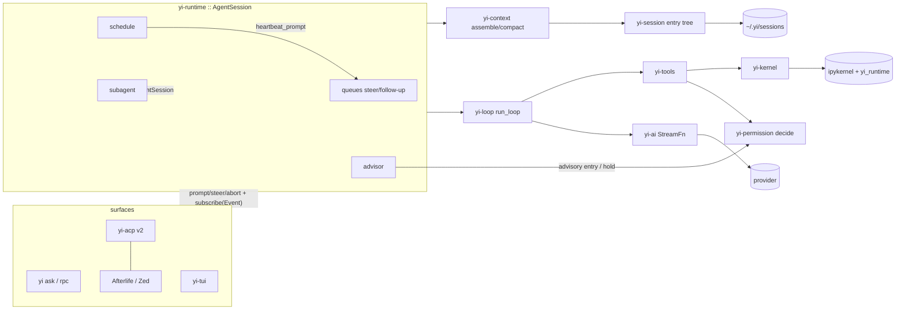

# Yi — Architecture Map

```
version: 0.58.0         # bump on any structural change; log it below
design:  YI_DESIGN.md   # the deep design; § refs below point into it
status:  phase 4 done   # yi-kernel (Jupyter client over pure-Rust zeromq) + uv venv bootstrap + verbatim rlm Python runtime (mcp.py rewritten over `yi mcp --json`) + ipython tool + runtime::subagent (rlm.run depth 1). Exit gate green: recursion scenarios incl. a live-kernel round trip. 4b done. Phase 5 done: runtime::schedule + runtime::advisor. Phase 5b done: yi-acp v2 server (hand-rolled wire, D40). Phase 6 done: yi-runtime::goal (G1-G6) + `yi serve` daemon (D4 supervisor + worker-per-root; exit gate green: a heartbeat dispatches while no client is attached and a reconnected client lists and resumes the session). Phase 7 done: `yi-tui` (D41 design — codex/atuin inline skeleton, opencode subagent UX, OMP HUD/status) in the default build; `yi [prompt]` opens the TUI on a TTY (X1). Phase 8 (D42): nothing is deferred any more — every deferred, stretch, and never-built row is open work in docs/TODOS.md (ids A1-M5), worked in that order. U13 stable-prefix streaming landed in 7; U18, dynamic viewport height, and the gitignore-aware @-walk are A3, A2, A4. TODOS section B (CLI surfaces) is closed at 0.19.0, which also lands the T14 capture/restore half of C1.
```

## Changelog

| ver | date | change |
|---|---|---|
| 0.58.0 | 2026-08-28 | `binary_size` joins `startup` as local-only (D70, superseding that half of D68). D68 kept it in CI because it is deterministic — a file length against a byte budget, independent of what else the machine is doing. True, and not enough: it is deterministic *per target*, and §13.3 names the target in the row itself — macOS arm64 — while CI is `ubuntu-latest`. The first run said so: the tree that measures 4,636,976 bytes on macOS builds to 6,980,216 on the Linux runner, so the gate failed by 2.3 MiB with nothing regressed. A per-target CI baseline was the alternative and is rejected — a second budget ratcheting on its own schedule, guarding a binary nobody ships, against a §13.3 row that names one platform on purpose. The dist build step goes with the gate, since an LTO build per run bought nothing once its only reader stopped running there. D68's shape survives: CI runs every gate that is meaningful where CI runs, the two that are not print a skip naming their row rather than vanishing from the list, and both still run on the machine where the budget was set. |
| 0.57.0 | 2026-08-28 | The dist profile optimises for size at every level, not just Yi's own crates (D69). `opt-level` moves from "s" to "z" in `[profile.dist]` and in `[profile.dist.package."*"]`, and the dist binary goes 6,041,360 -> 4,636,896 bytes: **-1,404,464, -23.2 %**, turning D63's 0.25 MiB of headroom into 1.58 MiB. §13.2 had carried the comment "`z` measured too; `s` usually wins on startup-heavy code" since D31, and this is the measurement that retires it — four binaries built from one tree (s, z on workspace crates only, z everywhere, and a nightly `-Zlocation-detail=none -Zfmt-debug=none` probe), each timed idle because a concurrent build reads a startup gate several times its quiet value. `yi --version` is 3.7 ms under all three stable variants and a full faux turn is 138.4 / 138.0 / 137.7 ms, so the size came free at the two latencies Yi ratchets. The nightly probe bought a further 316,368 bytes and is rejected in the same breath: it costs `rust-toolchain.toml`'s exact-stable-as-MSRV and every derived `Debug`. min-sized-rust's remaining rungs are rejected on the same evidence — build-std and `panic=immediate-abort` are hello-world wins against 533 KiB of `std` in a 4.5 MiB `.text`, and UPX trades a 5 ms startup budget for antivirus heuristics. |
| 0.56.0 | 2026-08-28 | CI stops being red for reasons unrelated to the code (D68). Both `binary_size` and `startup` read `target/dist/yi`, which no workflow step built, so `check` failed on every push and every pull request — the five PRs open when this landed all showed a red gate that said nothing about their contents. The two gates are split rather than fixed together: `ci.yml` now builds the dist profile and `binary_size` is enforced everywhere, because it reads a file length against a byte budget §13.3 states and the answer does not depend on what else the machine is doing — it is the ceiling that rejected syntect in D63, and a budget only checked when somebody remembers is a budget that drifts. `startup` is skipped when `CI` is set: it is wall-clock against 5 ms on a shared runner, and the workflow rules already say that number reads several times its quiet value under a concurrent build and must be re-measured idle before it is believed. The skip prints a line naming D68 rather than silently dropping a check — `check_startup.py` already refuses to pass quietly when hyperfine is missing, and an environment that cannot measure earns the same treatment. |
| 0.55.0 | 2026-08-28 | `~/.yi/config.json` is parsed once, into a type, and a bad file is an error (X7, §19). Four `read_to_string(...).ok()` + `from_str(...).ok()` sites across yi-cli and yi-mcp-cli each read a broken or misspelled file as an absent one, so `"modle"` behaved exactly like an unset default and the user never saw the typo. `yi-types::config` gains `UserConfig` with `BashConfig`/`PlanConfig`/`McpConfig` beside it, all `Option`, all `deny_unknown_fields` — config is §19's deliberate exception to schema tolerance, since it is not durable state and an unknown key is a typo the user wants named. The *reading* is in yi-cli, not beside the shape: yi-types is the DTO wall (§2), serde and nothing else, so no `std::fs` and no `$HOME` cross into it. yi-cli `set`s the `OnceLock` rather than `get_or_init`s it, so an accessor that ran before the load is an error instead of a default that silently wins, and exits 2 naming the path and the key serde stopped on. yi-mcp-cli stops opening the file at all — `mcp.tokenStore` is handed to `run()` by the caller that already read it, leaving one reader and one verdict. No decision-log row: this implements X7 rather than revising it. |
| 0.54.0 | 2026-08-28 | A thinking level the model does not support clamps to the nearest one it does, instead of being sent verbatim. `thinking_level_map` already distinguished a level a model renames from one it rejects (`null`), but `mapped_effort` read only the requested key and fell through to the caller's own string, so asking a model for `max` when its map says `"max": null` put `max` on the wire for the provider to refuse. `nearest_effort` walks the six ranked levels and takes the closest non-`null` one, breaking a tie toward the weaker level — an unsupported level degrades thinking, it never silently turns it off. A model whose every level is `null` sends no `reasoning` key at all, and on the Responses path drops `include: reasoning.encrypted_content` with it, since there is no reasoning to encrypt. `off` is deliberately outside the ranked set. The duplicate `mapped_effort` in `openai_responses.rs` is deleted for the one in `openai.rs`. |
| 0.53.0 | 2026-08-28 | `check_trailers.py` gates the workflow rule against assistant co-author trailers, which nothing enforced: every commit across the five open PRs carried `Co-Authored-By: Claude`, and 50 are already on main. The gate scans `HEAD --not origin/main`, so the landed 50 stay untouched and only a new commit is refused — a rule that fires on published history is one people disable. It matches the trailer for seven assistant names, never a human co-author, and never a prose mention. `ci.yml` gains `fetch-depth: 0`: the default depth-1 checkout has no `origin/main`, and the gate would have reported ok on every PR without ever comparing anything. A missing base ref is therefore a failure, not a pass. |
| 0.52.0 | 2026-08-28 | Review pass over 0.45.0-0.51.0, no new surface. `ToolCell` loses its `Default` impl: five construction sites had been saying `..ToolCell::default()`, which is exactly the exhaustive-field check that makes the compiler find every site when a field is added — each site now names all ten fields, and `Running`/`calls: 1` stop hiding behind a name that reads like zero. A kernel cell's `details.diffs` carry a real unified `patch` computed in `yi-tools`, where every other patch is computed, instead of `old_str`/`new_str` that `pycell` string-formatted into a fake patch and handed straight back to its own parser — a three-line change inside a 200-line replacement was rendering 400 rows. `details` strings are capped at 64 KiB (`tool::detail_text`) because they are stored in the session file and replayed from it, and `write` skips the base read entirely past that cap rather than reporting a missing base as a whole-file addition. `diffview::budgeted` drops from three passes to one, `Layout` from a struct to two arguments, and elapsed time from two render paths to one. `motion` swaps its raised-cosine easing for an eight-entry integer dwell table, which also removes every float-to-int cast but the one where a cosine becomes a band weight; the breath cycle and its table are held in agreement by a test. `AgentState::Idle` was never constructed and is gone; the Explored verb column is a fixed width, so adjacent blocks line up; `Type` needs a lowercase letter, so `MAX_ROWS` is no longer coloured as a type. Comment volume comes back under budget (1450 -> 1438) rather than ratcheting past it. |
| 0.51.0 | 2026-08-28 | The screen moves as one program (U42 · D66). `yi-tui::motion` gives the UI one clock and two cadences: braille at 80 ms for a call in flight, the diamond `◇◈◆◈` at 250 ms for agent-level work, so task cells and HUD rows pulse together instead of each keeping its own counter. The working line's narration takes codex's shimmer — a raised-cosine band swept across it, coloured by blending the theme's own dim toward its own text so it reads on any ground, and degrading to dim/normal/bold below truecolor, which is the gradient a 16-colour terminal can actually show. A finished HUD row is struck through left to right over twelve frames and then settles, so a completion is seen happening rather than announced; a live thought's `∴` becomes a breathing starburst eased 70→230 ms, every frame one cell wide because a width change would reflow the row under it on each tick. Only the live region animates: a committed row cannot be repainted, so the same cell in scrollback keeps its static glyph. Everything here is a pure per-frame function tested directly — the faux provider answers instantly, so no run ever observes a turn in flight. |
| 0.50.0 | 2026-08-28 | The subagent family becomes something you can look at (U41 · D65). `/agents` opens a popup over the children: `├─`/`└─` connectors, a glyph per state in the child's own accent, **own-usage** token and call columns so the total is the sum of what is on screen, and a ten-cell context bar that turns warning at 80 %. Children spawned by one kernel cell group under a single dim `⊙ rlm.run(...)` row naming that cell — the row no other Rust agent TUI can draw, and the attribution costs no wire field: Yi's children come from `rlm.run` inside an `ipython` call, so the kernel call running when a child appears is the call that made it, and one born outside carries nothing rather than a wrong parent. `x` arms a two-second in-row `x again to stop` and a second press aborts that child's session; moving the selection disarms, and so does walking away. The HUD header stops saying `Subagents` and starts saying `● 2 running · ◐ 1 idle · ○ 3 done`, dropping each count as it reaches zero. prime-agent's fullscreen dashboard is deliberately not ported — §8.14 bans the alternate screen — so only its row model crosses over. |
| 0.49.0 | 2026-08-28 | Four rules the tool cell was missing (U40 · D64). A call held at the permission gate renders `△` in warning colour **in place** — the transcript row the user is being asked about now says so, instead of showing an ordinary running spinner while a prompt waits elsewhere; the pairing runs on `call_id`, which also replaces the name-and-status scan that matched a result to the cell that started it. A run of finished read-only calls no longer spends a row each: `read`/`grep`/`glob`/`find` accumulate and commit as one `✱ Explored ×3` cell with a verb column in accent, closing on any other commit or at `AgentEnd` and rendering in the live region while still open, because grouping cannot be retroactive once a row is in the terminal's own scrollback. A run of one commits as the plain cell it always was, and a failure never joins a run. `bash` renders `$ cargo test --workspace` highlighted rather than echoing the word `bash` where the command belongs, with `· exit 1` in error colour on its digest. And blank-line spacing moves to the commit path: a blank separates two multi-row blocks, a run of one-line calls packs flush — now that a tool cell can be one row or forty, no cell can decide its own separation. |
| 0.48.0 | 2026-08-28 | Code reads as code (U39 · D63, closing TODOS A7). `yi-tui::highlight` is a hand-rolled per-line scanner over Rust, Python, shell, JSON and TypeScript/JS, resolved from a fence's info string or a path's extension and declining anything else rather than guessing. codex's conversion policy is kept exactly: foreground and bold, never a background — a background would fight the U37 tint the row renders inside — and never italic or underline, the two attributes terminals render least consistently. `spans` takes the caller's base style and adds only colour, which is what lets a highlighted row keep its diff tint; deletions keep their syntax colour under `DIM` so polarity still reads with both sides coloured. Scanning is per line and a line over 4 KiB renders plain; there is no token cache, because the cost OMP's LRU-256 exists to amortise is an FFI hop and a regex engine, and this is a char walk. syntect was measured before it was rejected, and the first measurement was wrong in syntect's favour — a probe that loaded a syntax set without parsing let LTO strip the parser and reported +0.38 MiB. A probe that actually parses reports +1.06 MiB *with no grammars loaded at all*, so a trimmed syntax set cannot rescue it; synoptic, the one comparable pure-Rust alternative, is +0.96 MiB and pulls the banned `regex` (docs/size-ledger.md carries every figure and the correction) — so the `highlight` cargo feature goes with it: a feature gating no dependency gates nothing. Applied at markdown fences, diff bodies, the kernel cell's source, and the `bash` head, which now renders `$ cargo test --workspace` as a highlighted command with `· exit 1 · 1s` on its digest rather than echoing `bash` where the command should be. |
| 0.47.0 | 2026-08-28 | The kernel call stops looking like a `glob` (U38 · D62). `yi-tui::pycell` renders `ipython` from its D60 record: a one-row head `⊙ python · df = pd.read_csv("data.csv") · ↑ 12 ↓ 4 lines · 340ms`, byte-identical whether the body is open or shut — a head that changes width when the body opens moves every row under it and the reader loses their place. The preview is prime-agent's *scored* line rather than the first one, so imports, comments, decorators and `print` no longer stand in for the work; a `%%bash` cell says `bash`, because its output is a shell's. Redaction runs before anything reaches a frame: an `sk-` run of sixteen key-shaped characters anywhere in a token, a quoted literal on a line naming key/secret/token/password, and any 32-character base64 run are replaced — deliberately over-broad, since the alternative is a scratch credential in a scrollback and every bug-report frame dump. Verbose opens the source under a `› ` prompt gutter with stdout, `result`, muted stderr and the traceback beneath, splitting stdout that precedes a `Traceback (most recent call last):` back out of the traceback; a failed cell shows both in Normal too, which is U15's standing rule. The cell's own file edits (`details.diffs`) render through U37 under a `╰─ <path>` header, so kernel-side writes are as legible as an `edit`. |
| 0.46.0 | 2026-08-28 | The transcript shows the change (U37 · D61). `yi-tui::diffview` renders a tool result's `details.patch` as codex's four-layer row — line-number gutter, sign column, content, and a tint carried to the right edge — with the palette forked on `ColorTier` × dark/light and codex's values verbatim, down to the more saturated light-theme gutter that keeps a number legible on the pastel and the 16-colour fork that drops backgrounds the terminal owns. Three details are load-bearing rather than decorative: the gutter never narrows below three digits (derived from the widest number it would widen at line 100 and re-pad rows already in native scrollback, which cannot be rewritten), a `-N` answered by `+N` blanks the repeated number, and rows wrap by column with a blank gutter that keeps the sign column — a word-wrapped diff row loses the alignment that makes two versions comparable, and a truncated one loses the column that marks an addition. A removal and an addition run of exactly one line each is a replacement, so the tokens that differ are marked in reverse video with the indentation excluded; a longer run is a rewrite and marks nothing. The body renders in **Normal** mode against an 8-hunk/40-row budget that keeps change rows, trims edge context, drops whole hunks from the tail and names what it dropped; Verbose renders it whole. The digest line gains `+N -N` in the diff's own colours, and `edit`'s old numbered-line body is deleted as subsumed. |
| 0.45.0 | 2026-08-28 | Tools record what they did, not just what they printed (D60), the plumbing the docs/plans/2026-08-28-tui-visual-upgrade.md phases render from. `edit` and `write` put the unified patch they already computed on `ToolResult.details` (`patch`, `added`, `removed` — counts skip the `--- a/`/`+++ b/` pair, which shares the sign column but is not a change row); the write tool reads the file before writing because nothing else reconstructs the ground it replaced, and a no-op edit sets no key rather than claiming an empty patch. `ipython` adds its source, `stdout`, `stderr`, `result` and the structured `KernelError` beside the joined text the model reads, so a renderer can style stderr and a traceback apart. `yi-tui`'s `ToolCell` carries the merged record and gains a `Default`, which is what stops a sixth field touching four construction sites again. Appendix A.2 narrows prime-agent's excise the way A.8 narrowed opencode's: `packages/tui/` and `src/modes/` were opened for the D60 study, seven spans are cited as implementation reads, the rest of both trees stays a sink; §8.14's donor list names prime-agent. |
| 0.44.0 | 2026-08-28 | The grid skill goes bundled: `skills/yi/grid/SKILL.md` joins the yi/* set (installed by `just install-skills`, discovered via the bundled skills root, shadowable per project). Teaches the query loop (`survey` -> `resolve`/`uses`/`scope` before grep), the refusal semantics (empty = cannot-prove; a resolve miss is exit 2 with the closest callsigns), handle pins, and the hard boundary that Yi's own edit tool — never `grid edit` — is the write path. Opens with an applicability check (`grid version`; absent binary = skill does not apply, fall back to grep) since the bundle lands on machines without grid. The per-repo copy at `.yi/skills/grid/` is deleted — one source, project shadowing still available where a repo wants a variant. |
| 0.43.2 | 2026-08-28 | The headless drive's `wait-idle` waits for the turn it just submitted (TODOS A10). A prompt reaches the runtime thread over a channel, so `running` — set by the `AgentStart` that comes back — is still false immediately after Enter, and a script that only checked it walked on while the turn was being written: the rewind drive test opened the session tree one entry short and rewound to the wrong message. It failed once inside a full-suite run and passed standalone every time, which is what a submit-to-start gap looks like. The App now counts submissions against `AgentStart`s and `wait-idle` also waits for that gap to close. |
| 0.43.1 | 2026-08-28 | `/plan` and `/goal` join the TUI (TODOS N9's client-side half, A5's next rows). Both are read-only: `/plan` prints the frontier summary the advisor's digest header uses plus the ready tasks with their acceptance, `/goal` prints status, objective, budget, the goal's check and the tail of its last failure. Deliberately no mutation — plan transitions are host-verified (D52) and a keystroke writer would sit outside that check, and a goal is explicit-only (G2), which a `/goal create` shortcut would quietly undo. The slash dispatch generalizes with them: one `pending_command` slot carrying the whole line, one `commands.rs` handler per verb, so the remaining A5 rows are arms rather than plumbing. ACP `_yi/plan` stays open — no ACP client has asked for it (C8). |
| 0.43.0 | 2026-08-28 | TODOS I1: advice can become a standing rule (V11 · D59). `/advisor` prints the stats line plus the promotable ids, and `/advisor promote <advice-id>` writes a D54 rule file into the project's `.yi/rules` — trigger from the advice's target, `gate` when the reviewer judged Hold and `remind` otherwise, gap 5, body the advice verbatim under a provenance line naming the advice it came from. The written file is parsed back with the same reader discovery uses (an unparseable rule is removed rather than left to fail silently) and inserted into the live `RuleEngine`, so the constraint binds this session instead of the next one; `attach_runtime` now attaches an engine even with zero rule files, because the tool adapters capture that Arc when tools are installed. Advice is retained before D28's headless degrade, so a Hold promotes as the gate the reviewer meant even where delivery had to soften it; advice naming no target is refused rather than guessed at. Promotion has no host request — the model cannot install a rule for itself. TUI: slash commands take arguments (a `/` query containing a space runs verbatim instead of completing to the highlighted item, which silently dropped the payload), and `advisor` joins `SLASH_COMMANDS`, the first of A5's rows. |
| 0.42.1 | 2026-08-28 | Docs catch up with the F-row and wall landings, no code change. YI_DESIGN gains §8.10.1, an as-built addendum to the subagent table: `B14 result` (a finished child's answer as schema-checked data in the parent's kernel namespace — plan §3.3's upstream half) and `B15 wall` (the B1 overlay's reduction arm) are named primitives rather than changelog prose, and B5's fork budget, B11's commit-before-merge, and B6's D58 revision are recorded against their rows. docs/solutions gains ADRs for D52, D53, D54, D56 and D58 (the index's no-ADR range narrows to D36-D51) and its one-pager names the runtime's modules and the two invariants this work added: a terminal claim is measured, and an overlay only reduces a child. TODOS: the header re-bases to 0.42.1 and `F6`'s premise is corrected — discovery is the host's in-process map, not a directory listing, so the JSONL ledger waits for a second writer process to exist. `.ruler` records four rules this work paid for: split a module at a seam when it hits the file ceiling, read the version header and last D-row immediately before writing them (two collisions this session), never `git add -A` in a shared tree, and prove a new gate by disabling the gate rather than the test. |
| 0.42.0 | 2026-08-28 | The guardrail aggregator gets the workflow it was written for (D31 named jcode's unreferenced aggregator as the failure to avoid; Yi had the same hole). `.github/workflows/ci.yml` runs fmt-check, clippy, `check_guardrails.sh` and `cargo test --workspace` on push to main and on every pull request, calling the commands directly rather than installing `just`; cargo-deny and cargo-machete come from a prebuilt install action so the aggregator's two tool checks pass instead of failing open. `just check` now includes `test` — the recipe gated on fmt, clippy and guardrails while never once running the suite it was quoted as proof of. Recorded open, because the workflow will surface it: the workspace test run is flaky under CPU contention. Two independent failures were observed during cold full-workspace runs and neither reproduces alone — `recursion_e2e` timing waits, and `tui_drive`'s rewind script, which uses fixed `wait 200`/`wait 500` sleeps and under load rewinds the wrong exchange. Doc drift corrected in the same pass: the crates header said 12 default with `yi-mcp-cli` behind a cargo feature, which D36 replaced with 13 crates gated at runtime by `mcp.enabled`. `yi-mcp-cli` still has no row or line budget in that table. |
| 0.41.0 | 2026-08-28 | TODOS N7's open half: the reviewer wall (plan §3.4). `rlm.run(deny_write=[…], deny_read=[…])` is a B1 overlay that *reduces* a child — `yi-runtime::wall::Wall` refuses any call whose extracted targets fall under a denied prefix (lexically normalized, so `../` cannot walk out) and any `bash` whose command names one, before the permission check and before the spawn. Write-deny leaves reads open, which is what expand-only needs: an implementer child can read the acceptance instrument and cannot edit it, so a mismatch is reported rather than legislated away; `deny_read` is the opt-in for sampled instruments where visibility itself is the Goodhart risk, and it implies write-deny. Enforced at the `ToolAdapter` seam rather than inside `decide()` as the plan drafted: the permission broker is shared parent-wide by B10, so a per-child reduction cannot live on it — the adapter is where per-session gates already sit (D54's rule gate) and is equally pre-execution, proven by a marker file the denied command never creates. Not a sandbox and recorded as such: a command that names no denied path runs. The orchestrate and review skills carry the knob. |
| 0.40.0 | 2026-08-27 | TODOS F2 and F3: children stop being fire-and-forget calls (design B6, B13 · D58). One router in `yi-runtime::mailbox` serves all three directions — a child reaches `parent` or a named sibling through the `ParentLink` its spawn handed it (a `Weak` on the parent host, so a family is not a reference cycle), the parent reaches one child by name or `all`; a broadcast returns one receipt per target rather than failing whole on the first bad one, an unknown name names the children that do exist, and no agent can address itself. `agent_message.send` carries `followup`: false queues for the target's next turn (B13 `send`), true delivers into a running turn at its boundary or starts one when the child is idle (B13 `followup`). `rlm.wait` blocks for children to report or finish, clamped to 1-300 s with the clamp reported, and an update is collected once instead of re-reported forever; `rlm.interrupt` ends a run and keeps the record where `rlm.delete_subagent` (B13 `close`) reaps it. `rlm.result` is the plan §3.3 upstream: a finished child's answer as data in the parent's kernel namespace, parsed as JSON when it is JSON and checked against a caller-supplied schema by the hoisted B4 validator at that seam, so a malformed result is refused rather than passed on; `handle.result(schema=…)` polls for it in Python. `subagent.rs` was split at the 1,200-line file ceiling: messaging and mailbox to `mailbox.rs`, the worktree hand-back verbs onto `worktree.rs`. Open and recorded: the TUI composer for child sessions (U29 stays read-only). |
| 0.39.0 | 2026-08-27 | TODOS F4 and F5: a child can inherit the thread it must continue, and a mutating child gets its own tree (design B5, B11). `rlm.run(fork=…)` seeds the child before its first turn — `'all'` for the parent's whole history, `n` for the last n turn boundaries (user messages, not messages), cut from the tail to the child's window less compaction's own reserve rather than to an invented fraction; `fork='all'` refuses a `model`/`thinking` override instead of silently ignoring it (B1's inherit rule). `rlm.run(isolation='worktree')` runs `git worktree add -b yi/<child-id>` off the parent's HEAD into the child's artifacts dir and builds the child with that path as its cwd — the factory now takes a `ChildBuild` so a per-child cwd exists at all, and it propagates through the child's tools, kernel and rule discovery. Hand-back is explicit: `rlm.merge_worktree` commits the child's uncommitted work on its branch first (without that step the merge brings nothing over), merges `--no-ff`, then removes the tree; `rlm.discard_worktree` throws branch and tree away. Both refuse while the child runs, and `rlm.delete_subagent` refuses a child still holding a worktree — no reap silently drops work. The orchestrate skill and the `rlm.run` docstring carry both knobs. |
| 0.38.0 | 2026-08-28 | Direct OpenAI (`openai-responses`) is dispatched instead of falling through to faux (D57). Catalog ids such as `gpt-5.6-luna` already carried that api tag, but `ProviderStream` only knew `anthropic-messages` and `openai-completions`. `yi-ai::openai_responses` is the A3 adapter: `POST /v1/responses`, typed SSE with the official terminals (`response.completed` / `response.incomplete` / `response.failed` / `error`) emitted without waiting for body EOF, `store: false` with Yi-replayed `input` Items, function tools only (hosted tools stay off), `include: reasoning.encrypted_content` so rewind still has a reasoning item. OpenRouter stays on `openai-completions`. D29 freeform `edit` is not in this slice. |
| 0.37.0 | 2026-08-27 | TODOS F1: the child status a client reads is typed, not inferred (design B7). `yi-types::subagent` lands `ChildId`/`ChildStatus`/`ChildActivity`/`ChildUpdate {id, name, status, activity, toolUseCount, tokenCount, answerPreview, error}` and `AgentEvent::ChildUpdate` carries it on the *parent's* bus, so one fold in `SubagentHost` (a watcher task per child, admission and terminal publishes included) replaces every consumer's private derivation. ACP maps it to a `_yi/subagent_update` notification; the TUI's task cell now takes status and the toolcall counter from the update (its own `ToolExecutionStart` counter is deleted) and keeps its child subscription only for what the update does not carry — the focus replay and the `last_tool` argument summary. `ChildView` becomes the same update plus the session handle, so the roster poll and the event stream are two deliveries of one record rather than two derivations. |
| 0.36.0 | 2026-08-27 | The advisor gets its consumer and the plan gets its reviewer moments (TODOS N8 + N9 slices, N7 skill half · D56). `models.advisor` is declared (C6's rule held: the role lands with its consumer): naming it resolves the model, constructs `LlmReviewer` in `wire_advisor`, and flips `AdvisorConfig::reviewer` — unset, the advisor keeps observing silently. Plan transitions poke the advisor: every host-verified `plan.update`/`plan.edit` write calls a `PlanChangeHook` that requests the next boundary's review (still budget-gated — a poke can never overspend) and plants a one-line frontier summary (`plan v3: 2 ready, 1 running…`) as the digest chunk's context header, so the reviewer sees tunnel vision (`N` calls on one task while ready tasks sit unclaimed) without any deterministic signal speaking. PlanAudit as a separate V5 job is recorded dissolved: the shrink vectors it would police are structurally refused (SHRINK_ERROR, host-run checks), and what remains is the ordinary Advise judgment — no speaking job without a gap (D50). `plan.staleReminderTurns` config knob lands over the constant. The `yi/review` bundled skill carries the cold-reviewer brief (only the standard, never the implementation story); the wall's write-deny overlay stays open on the F-row Spec machinery (N7). |
| 0.35.0 | 2026-08-27 | D55: comments get typed referents and named grants. §18 said how much a comment may say and never what it may point at, so backticks meant a local fn, a Jupyter wire tag and a `ref/` path interchangeably. A Rust item in a `///`/`//!` comment is now an intra-doc link, checked at doc-build: `rustdoc::broken_intra_doc_links` and `private_intra_doc_links` are denied in `[workspace.lints.rustdoc]` (inherited by all 13 crates, which already opt in per D31) and `cargo doc --workspace --no-deps --document-private-items` joins `check_guardrails.sh` — `--document-private-items` is load-bearing, since most of Yi's items are `pub(crate)` and rustdoc silently declines to resolve links into them without it. The tree documented clean before the lint landed, so nothing was seeded red. Bare backticks now mean not-an-item, which is the common case and correctly stays bare: parameters (`keep_recent`), wire names (`display_data`, `sessionUpdate`), reference symbols (`convertToLlm`). Body comments cannot carry a checked link (rustdoc resolves only in doc comments) and that ceiling is written into §18 rather than papered over. Second half: a comment invoking §18 grant (1) or (2) opens `Incident:` or `Invariant:`, a closed vocabulary `check_comments.py` enforces by rejecting any other `Word:` prefix — `Precedence:`, `Draining:` and `Detached:` were the three one-offs it caught. Tags ride an existing first line, so comment volume is unchanged and no baseline moves. |
| 0.34.0 | 2026-08-27 | Trigger rules land (plan §3.5, TODOS N6 · D54): user-authored standing corrections fire at the moment they apply. `yi-runtime::rules` discovers `~/.yi/rules/*.md` + `<cwd>/.yi/rules/*.md` (project shadows global by name; zero builtin rules; malformed files are skipped with the reason delivered as a notice, never silently): frontmatter `trigger` (literal substrings, comma-separated — regex waits on C2), `scope` (text | tool | tool:<name>), `gap` (once default | N completed turns), `mode` (remind | gate; gate requires a tool scope). Gate rules deny at the `ToolAdapter` seam BEFORE the permission check and before any spawn, carrying the rule body and source path as evidence (D26 shape); `Once` means deny-first-attempt, let the informed retry through. Remind rules deliver the body verbatim as `custom{reminder}` at the boundary — tool-scoped ones match arguments at the gate, text-scoped ones match assistant prose at MessageEnd. The V7 EmissionGuard is deliberately NOT in this path: a test proved its session-scoped dedupe silently swallows a user-chosen re-arm gap, so the per-rule gap latch is the noise budget (plan §3.6 rule 1 revised accordingly). Engine state is session-local; a restart re-arms `once` rules (recorded, acceptable). Adapter-level e2e proves a gated command never executes. `skills::frontmatter` is shared, not duplicated. Baselines re-based (comments 1143→1161, test LOC 12612→12952), each pending its own commit. |
| 0.33.0 | 2026-08-27 | Closing the loop, first slice (docs/plans/2026-08-27-closing-the-loop.md · D52, D53): completion becomes a measurement and the plan becomes a fact. `Goal` gains `check`/`checkTimeoutMs`/`checkFailure` (additive): `goal.update(complete)` now runs the check host-side through the shared `run_captured` executor and rejects the claim on nonzero exit, persisting the output tail as the audit and carrying it into the continuation prompt (`{{ check_status }}`); blocked reports never run it. `Fact::Plan` lands beside `Fact::Goal`: an expand-only task DAG (`yi-types::plan` — `PlanVersion`/`TaskId` newtypes, `TaskState` with untagged `Other`, flattened extras) whose transitions are one legality table; a done claim is host-verified (task `check` + evidence against the task `schema`, validated by the B4 subset validator hoisted from yi-cli to `yi-runtime::schema` since yi-cli is not a dependency of yi-runtime) and a failed claim blocks the task with the evidence; `plan.edit` only adds or reopens (SHRINK_ERROR names the rule); `frontier()` is derived, never stored; goal continuation now carries the frontier and a plan untouched 12 completed turns steers one latched `custom{reminder}`. Surfaces: `plan.*` host requests + bundled kernel skill `plan` (venv identity moves), rpc `plan` arm; goal create gains `check` everywhere. The doctrine fragment ships (`prompts/doctrine.md`, in the stable prefix — request budget re-based) and two bundled skills land: `yi/orchestrate` (decision-complete briefs, delegate-vs-do, cold reviewer) and `yi/session-mining` (kernel sweep, coverage line, backtest, propose-never-apply). Baselines re-based in this change, each pending its own commit: schemas.lock (+5 plan shapes), test LOC 12157→12612, request budget 9159→10211 (doctrine bytes), comment volume 1119→1143. |
| 0.32.0 | 2026-08-27 | TODOS H1 (diff half), H2 and H3: the ACP surface stops being half-built. `session/request_permission` carries the T13 patch as structured `content: [{changes, patch}]` (C7) beside the prose, so a client renders a diff instead of parsing one out of a description; the asker signature becomes one `PermissionAsk` whose `text()` folds description and patch the single way every text consumer already wanted, which is why the TUI and CLI prompts are byte-identical to before. `session/set_config_option` gains `mode`: `PermissionBroker::mode` moves behind a lock, `AgentSession` keeps the broker the way it keeps the advisor and goal services, and an unknown value is refused naming `ask|auto|yolo`. A successful `_yi/heartbeat` apply now emits `_yi/heartbeat_changed` (C9) before its reply — a heartbeat also fires with no method call, so the reply is not the signal. Not done and recorded as such: terminal output is emitted at `ToolExecutionEnd`, not streamed, because `ToolExecutionUpdate` has no emitter and the tool contract returns once; `_yi/advisor` and `_yi/max_depth` stay unimplemented because both would be live switches over machinery that does not exist yet. |
| 0.31.1 | 2026-08-27 | The prefix check covers both providers and every inherited message, not the opening one. `assert_prefix_survives_a_turn` compares the system block, the tool table and each message the second turn carries over, so a re-render at any depth fails rather than only at message one; `openai::build_params` goes through the same helper, where the system prompt is the first message rather than its own field, so one more block is covered there. No second size ratchet: the two encoders serialize the same prompt and tool source, so a second number would track the same content twice. Verified by injecting the D51 reshape into the OpenAI mapper and watching `message 1 was re-rendered by a later turn` before reverting. |
| 0.31.0 | 2026-08-27 | Cost gets a gate, and the gate found a bug (TODOS J4, J5, J8 · D51). `crates/runtime/tests/request_budget.rs` builds an Anthropic request over a fixed prompt-and-tool fixture and asserts the system block, the tool table and the opening user message are byte-identical across two turns; `scripts/guardrails/check_request_budget.py` ratchets the prefix size against `baselines/request_budget.json` (986 + 8,173 = 9,159 bytes), `--update` in its own commit like every other baseline. No cassette and no recorded session were needed — `anthropic::build_params` is pure, so the fixture is two `LlmContext` values. The skills catalog is excluded: it is assembled from the machine's roots and would make the number depend on the runner. On its first run the message assertion failed, which is D51: `convert_messages` rendered `UserContent::Text` as a bare JSON string and then rewrote whichever user message was last into a one-element text block so the cache breakpoint could be attached, so that message serialized differently the turn after. Anthropic's cache entry is a hash of the content prefix ending at the breakpoint — the `cache_control` marker is not hashed, but any block at or before it that changes is — so from turn two onward the lookup diverged at message one and the whole conversation was re-billed as fresh input on every request. Text user content is now always `[{"type":"text","text":…}]` and the string arm of the breakpoint attachment is deleted as unreachable; the comparison ignores the marker, which the documented key excludes. |
| 0.29.0 | 2026-08-27 | D50: the deterministic advisor is deleted. `advisor::signals` (six signals, `Fired`, `SignalKind`, the irreversible probe), `RuleReviewer`, the `Reviewer` trait, and the signal arm of the trigger policy all go; `V1` is cut and `V2` narrows to cadence. The advisor keeps the work log, the digest, the guard, the delivery path and the outcome ledger, and speaks only through `LlmReviewer`, which no model role names yet — so the default session observes and says nothing. Reported symptom was an advisory on nearly every tool call. Cause: §7.3 shipped the trigger tier as the delivered voice, and `signals.rs` documented its own output as "high recall, low precision — a trigger, not a verdict". The verb tables and `split_sentences` move to `advisor::digest`, which is what still uses them. `Tool::irreversible` stays — permission is its real consumer. |
| 0.28.0 | 2026-08-27 | D49: the comment rule is rewritten to test content rather than sigil, and gains its first gate. §18 granted doc comments to `yi-types` alone, which made 1,017 of the 1,129 doc-comment lines in `crates/*/src` nominal violations while saying nothing about the 82 blocks that had grown to four lines or more — the rule was aimed at the wrong target and, with no script behind it, was never aimed at all. A comment now earns its line by naming an incident, an invariant, or a `yi-types` schema fact, in three lines or fewer, whatever sigil carries it. `scripts/guardrails/check_comments.py` ratchets two numbers, shrink-only: comment volume outside `yi-types` and the count of runs past the cap (a license or attribution header at line 1 is exempt). Both were seeded at what the tree measured — 1,415 lines and 82 runs — because a gate cannot land red, and the sweep that followed took them to 1,119 and 0, which makes the cap hard from here. Full workspace suite green across the sweep; the TUI drives a turn headless unchanged. |
| 0.27.0 | 2026-08-27 | D48: the kitty orb transmits zlib-deflated (`o=z`). U34 sent raw base64 RGBA, so a single 192px frame was 198,948 bytes of escape — 150x the entire non-kitty session's terminal output, for one small mark. `animating` holds while `logo_target > 0.0`, which is the whole turn, so at `FRAME_MS = 33` the orb was pushing roughly 6.1 MB/s down the same pty the answer streams over, three orders of magnitude past the text it was competing with. The frame is 83% fully transparent pixels and deflates 11x at its densest, 49x at the wordmark; the same PTY capture that measured 198,948 bytes now measures 4,029. Ghostty's own binary carries `kitty_gfx: failed to read decompressed data`, so the path was verified present before it was taken, not assumed. Nothing about the image changes — `paint_rgba` is untouched and the test inflates the wire bytes back to the painted RGBA, checking RFC 1950's header rule rather than trusting the compressor about its own output. This does not prove the jitter is fixed: the faux provider settles a turn in microseconds, so the sustained rate stays a derivation from the measured per-frame cost. |
| 0.26.1 | 2026-08-27 | A turn no longer redraws at the frame ceiling for no reason. The event loop marked every iteration dirty while `running`, so a turn drew at U6's 16 ms ceiling regardless of whether anything had changed — five frames per visible spinner step, four of them byte-identical. Ratatui's differ suppressed the *output*, so nothing reached the terminal, but the markdown re-render, wrap, cell build and buffer diff all still ran. Arriving tokens already mark their own frame dirty in `reduce_agent`, so the request is now gated on the spinner phase actually advancing, and the poll wakes on the spinner's own 80 ms boundary rather than a fixed 90 ms that beat against it and made the glyph step unevenly. |
| 0.26.0 | 2026-08-27 | D47: resize reflow, adopted from codex whole. A terminal resize now clears scrollback and the visible screen and re-emits the retained transcript at the new width, instead of repainting only the rows above the viewport on top of what the emulator already reflowed. Ported adapted from `transcript_reflow.rs` (the width/debounce/stream state machine, 75 ms trailing debounce so a drag rebuilds once at the settled width rather than at every intermediate one), `app/resize_reflow.rs` (clear-then-replay, row-capped while rendering from source rather than after writing), and `resize_reflow_cap.rs` (per-terminal row caps: VS Code 1,000 · WezTerm 3,500 · Windows Terminal 9,001 · Alacritty 10,000 · everything else the 1,000-row fallback). `History`'s flat 256-cell ring is replaced by that row budget. The whole frame is now wrapped in one synchronized-update bracket (codex `draw_with_resize_reflow`'s `sync_update`) rather than only the commit — the commit used to present a scrolled screen with a stale viewport under it, which is the flicker seen at every paragraph boundary. A ceiling increase was authorized and proved unnecessary: the crate sits at 8,464 lines against D43's 10,000. |
| 0.25.3 | 2026-08-27 | Esc actually interrupts, and the mark survives a resize. Two things ate the interrupt: `ProviderStream::stream` took the `InterruptSignal` and discarded it (`_signal`), and the loop's stream consumer was a bare `recv().await`, so a turn with no tool call had no checkpoint at all between its first token and its last — the TUI's Esc-Esc fired the signal correctly and nothing downstream could act on it until the turn had already ended. The consumer now selects `biased` on `signal.wait()` and ends the turn `Aborted`, keeping what streamed. Separately, `I1`'s `reset_if_epoch` had zero callers and the signal is per-session, so the first abort that did land poisoned every later turn; the epoch is now read at admission and compare-and-cleared in the spawned run. And a resize forces the kitty mark to be placed again: a placement scrolls with the text under it, but `resize_viewport` only reports a change when the viewport rect moves — on a width-only resize the app computed the same cell, skipped the re-emit, and the image stayed where the emulator left it until the next turn re-armed the morph. Measured on a PTY with kitty advertised: 3 placements across two width resizes, against 1 before. |
| 0.25.2 | 2026-08-27 | Two fixes the 0.25.1 mark investigation surfaced. The approval prompt renders its diff as a diff: 0.25.0 gave every mutating call a patch, but `ApprovalView` cut the description to 200 chars and three wrapped lines and `wrap_line` has no newline handling, so the patch flattened into one span and the feature was invisible on the surface it was built for — the body now splits on newlines, colors `+`/`-`/`@@`, drops the `--- a/` / `+++ b/` pair the title already carries, and truncates rather than wraps (a wrapped diff line loses the column that says whether it is an addition), capped at 10 rows. And the live tail is now budgeted against the rest of the bottom stack: `resize_viewport` clamps the viewport to the screen and `put` silently drops what no longer fits, so `live_tail_rows`'s hard floor of 6 — which knows nothing about what the stack below it needs — cost an 8-row screen its status line, and a taller floor would have cost it the composer. |
| 0.25.1 | 2026-08-27 | The session mark trails the streaming tail instead of leading it (D46). U34 placed it at the top of the live region on the reasoning that the answer flows underneath, but U13 commits each stable paragraph to scrollback mid-stream, so the viewport's top row is the commit boundary rather than the top of the answer — the mark rendered there sat spliced between the committed half and the streaming half, walking down through the prose once per paragraph, and each move forced a kitty delete-and-replace so the orb visibly jumped. Below the tail it is always after all rendered prose, which is where the finished answer already put it, so streaming and rest now agree. |
| 0.25.0 | 2026-08-27 | Tool calls state their outcome, and mutations are previewable before they land. TUI: a finished tool cell carries a one-line `└ ` digest in every mode (codex commits five result lines by default, OMP four — Yi committed none, so a call left no trace of what it produced unless verbose was armed *before* it ran); Ctrl+O now rebuilds the rows above the viewport from the retained transcript, so the mode change reaches cells already on screen instead of only future ones, and the mode moves to the status line's mode slot rather than committing a notice per toggle. Verbose bodies are typed — reads and edits hang off a dim line-number gutter with the hashline anchor header dropped, searches print each path once, and the preview keeps head 5 / tail 5 (codex `output_lines`) because a command's error is in the tail the old `take(10)` discarded. A failure's body is never mode-gated. `edit` cells name their target, parsed from the patch's own `[path#TAG]` headers — the tool takes no `path` argument, so they rendered bare. Tools: `Tool::preview` (defaulted) lets a mutating tool render its own diff for the approval prompt — `edit` runs the patcher's existing `prepare` dry-run over a forked clipboard, which is where T13 was missing since only `write` had a preview; `grep` gains clamped `context` lines in ripgrep's own `path-N-text` shape. `edit` results now carry a context window per hunk instead of only the first, so a multi-hunk edit leaves every change anchorable and no longer forces a full re-read. TUI `/undo` reaches the T14 checkpoints (A5's first row); `/expand` is deleted, subsumed by the retroactive Ctrl+O. Prompt: `grep` is named as literal-only with `rg`-through-bash as the regex path, and the ipython tool says the kernel runs in Yi's own venv and how to reach the project's. |
| 0.24.2 | 2026-08-27 | `/new` starts a fresh chat from inside the TUI: a new store from the same `JsonlRepo` the CLI uses, adopted by the running session with the `reset()` + `attach_store` pair `cli::rpc`'s `new_session` already used, over the screen-and-scrollback reset a rewind performs. It refuses while a turn is running rather than stranding that turn's messages in a file the session no longer writes to. |
| 0.24.1 | 2026-08-27 | List markers stopped being written into the line buffer. A list whose items are separated by blank lines is *loose*, and CommonMark wraps each loose item's content in a paragraph — so the paragraph handler's blank flushed the marker on its own, one blank line above its own text (`1.` / `` / `read — ...`). The marker is now held pending and claimed by whichever line opens the item, which also makes looseness render as the author wrote it: loose lists keep their blank line between items, tight ones stay dense. The hanging indent follows from the markers actually on the line instead of a fixed two spaces, so `10. ` and every nested glyph wrap under their own text rather than two columns short. |
| 0.24.0 | 2026-08-25 | Transcript legibility pass and D44 (both user-directed). The bullet gutter marks the message, not every paragraph: streaming retains one slice per stable blank line, and each slice re-rendered on its own took a fresh bullet, so a resize repaint grew one per paragraph where the live paint had one — `History::retain` merges consecutive assistant slices back into the message. A callout keeps its rail and drops the bullet beside it; the advisor's note takes that rail plus blank air instead of a dim aside. The live region shows half the screen rather than six rows — a markdown table has no blank line inside it, so nothing commits until the message ends and a fixed tail cut the table's header off mid-stream. `bash` stops reporting every command as irreversible: read-only verbs (and the reporting half of `git`) are screened per `&&`/`|`/`;` segment, so the advisor's flag means something again. The status bar drops the `yi` segment and the mark shrinks from 8×4 to 6×3 cells. |
| 0.23.0 | 2026-08-25 | Rewind became visible (user-directed). Selecting a user message in the tree now rewinds to its *parent* and hands the message back to the composer unsent, as OMP's `navigateTree` does; the screen and its scrollback are cleared and the branch is replayed, so the undone turns leave the transcript instead of sitting above a rewound context. `replay_session` reads the active branch rather than every entry in the file — the whole-tree read is what left the abandoned turns on screen. The tree itself is rebuilt in OMP's `TreeSelectorComponent` layout (titled panel, help row, `Search:`, divider, `cursor + gutter + ● + role: text` rows, centered window with a scrollbar, filter label) in Yi's own colors, with Alt+↑/↓, PgUp/PgDn and Home/End. `scripts/tui_pty.py` gains `--send` and `--raw` so a real-terminal run can be driven and its escapes counted. |
| 0.22.0 | 2026-08-25 | TODOS C2 and C4. `yi-tools::reduce` is T17/T18/T19/T20 with hand-written filters: cargo keeps its diagnostics on a red run, grep is capped, everything else gets ANSI stripping, repeat collapse and head/tail — below a 2 KiB floor nothing is touched, and a lossy result is tee'd under `~/.yi/tool-output` (no tee ⇒ raw). The rtk TOML corpus stays unwired: it needs a regex dependency, which is a §13.3 decision, not a refactor. `yi-tools::jobs` gives `bash` the D13 background half — off unless `bash.autoBackgroundMs` is set, polled through the same tool with no command, and finished jobs reach the model through the R3 follow-up queue. |
| 0.21.0 | 2026-08-25 | TODOS C3, C5 and C6. C3: `yi-runtime::skills` assembles the catalog (name, description, path) from the global and project roots, project shadowing global, fitted to the P16 `skills_meta` budget and appended to the system prompt; the model opens a skill with `read`. The bundled set installs into the global root (`just install-skills`) rather than into the binary. L13 lands as `yi-loop::repair`: a tool call naming `functions.Echo_tool` runs `echo` instead of failing, while an ambiguous or genuinely unknown name still fails with the model's own spelling. §12 model roles arrive as `yi-types::config::ModelRoles` — `"models": {primary, summarizer}` in `~/.yi/config.json`, the summarizer used for compaction's summary call only, since the window math must stay on the turn's model. |
| 0.20.0 | 2026-08-25 | TODOS C1 and C7 closed. `yi-tools::diff` is T13: a unified patch with absolute paths, verified by `git apply` reproducing the post state, and the approval prompt for `write` now shows what the overwrite changes instead of only its path. T14 completes with a turn-end capture beside the turn-start one, `Checkpoints::diff(a, b)`, and `yi undo list`; undo deliberately skips the turn-end capture it is standing in, so undo/redo still toggles. |
| 0.19.1 | 2026-08-25 | Quitting the TUI prints the command that brings the session back (`yi --session <id>`, OMP's parting hint), and the TUI now honours `--session` / `--continue`: a resumed session replays its stored entries so the screen and the model's context agree. A hint is only printed for a session that recorded something. |
| 0.19.0 | 2026-08-25 | TODOS B closed: `yi sessions list|show|rm`, `yi undo`, `--continue`, `--session`, `--schema`, and static `completions/yi.{bash,zsh,fish}` (X10). `yi ask` now records every turn to a session file — without that `--continue` has no leaf to resume. B2 needed checkpoints, so the T14 core lands with it: `yi-tools::checkpoint` (shadow gitdir, capture/restore) and a turn-start capture hook on `AgentSession` that writes a `custom{checkpoint}` entry; undo records the state it replaced, which is what makes it undoable. `--schema` answers are validated against a JSON Schema subset and exit 3 on a mismatch — never prose on stdout. |
| 0.18.0 | 2026-08-24 | D43: `yi-tui` ceiling 5,000 → 10,000 lines. |
| 0.17.3 | 2026-08-24 | Docs pass: README rewritten as a self-contained statement of what Yi is and why (no reference-codebase names — those belong in the design doc, not the front door). `.ruler` gains the two rules this session paid for (prove a regression test red before claiming the fix; a capability path is only exercised when the capability is advertised) and the ref/ category note. `yi-tui` budget row corrected to D41's 5,000 and its overage tracked as A10. |
| 0.17.2 | 2026-08-24 | U34 morph fixed: a settled mark stops the frame timer, and the idle gap was being turned into progress, so the first animating frame consumed the whole morph and the wordmark snapped to the orb. Step is clamped to one frame (`logo::advance`). The mark now leads the live region with the streaming answer under it, so it holds one position while text grows. |
| 0.17.1 | 2026-08-24 | U34 revised (user-directed): one orb, not two — the `Yi` wordmark and the thinking orb are the same dot cloud morphing between them, exponential ease-in, settled at rest with no repaint. The scrollback session header is dropped with it. `scripts/tui_pty.py --term` added: the harness hardcoded `xterm-256color`, so no kitty-graphics path had ever been exercised under a PTY. |
| 0.17.0 | 2026-08-24 | TUI visual language (user-directed, reference-first): role delineation (opencode `┃` bar + codex/OMP tint + codex `• ` gutter), codex heading ladder, OMP bullets, visible link destinations, `│` code rail, OMP boxed tables, OSC 133 prompt zones, U34 session mark (a frozen U33 orb frame). Fixes: wrapped paragraphs no longer indent (the wrapper strips a line-leading indent, so only continuations showed it), nested bullets keep their indent, composer placeholder removed. `yi-tui::render` split out of `app`. |
| 0.16.2 | 2026-08-24 | Resize, second pass: the cursor-delta heuristic fixed growing but not shrinking, so codex's real path is ported instead — `update_inline_viewport_for_resize_reflow` (no scroll when the terminal itself shrank, clear from `min(prev, new)`), `invalidate_viewport`, and rebuilding the rows above the viewport from transcript source (`yi-tui::history`, 256-cell ring). |
| 0.16.1 | 2026-08-24 | Resize fix: a terminal reflows its screen on resize, so the viewport anchor went stale and each resize step left its composer box behind. Ported codex's cursor-delta re-anchor (`tui.rs:1156-1175`) with the cursor tracking it needs; `scripts/tui_pty.py` grew `--resize`. |
| 0.16.0 | 2026-08-24 | TODOS A1: `yi-tui::terminal` — codex's mutable-viewport `Terminal` ported (A.10 fallback taken; ratatui's `Viewport::Inline` height is fixed at construction). The inline viewport now sizes itself to the live region every draw and stays bottom-anchored. |
| 0.15.1 | 2026-08-24 | TODOS A3, A4: U18 external editor (Ctrl+G / `/editor`) wired; the file walk behind `glob`, `grep`, and the TUI `@` popup is gitignore-aware, one implementation in yi-tools surfaced through yi-runtime. |
| 0.15.0 | 2026-08-24 | D42: every deferred/stretch/pattern row undeferred; open work enumerated in docs/TODOS.md and the feature ledger flipped to `open (<id>)`. Phase gates end at 7; TODOS.md is the queue. |
| 0.14.3 | 2026-08-24 | Session retrospective hardening. Working/default orb evaluates the ribbon preset (orbits-64 reads as noise at cell-rect scale). New `.ruler/085-tui.md`: TUI verification (drive mode mandatory for TUI behavior changes, nonzero-offset vt100 cases, protocol lifecycle semantics as incident comments, `scripts/tui_pty.py` for the true-terminal path), reference-first UX (donor refs are the default, a smaller fresh implementation is a deviation to confirm), the visual-approach gate (medium/aesthetic decisions get a mock + sign-off before code), and byte-cursor streaming commits. New skill `yi-tui-verify` (drive-mode workflow + PTY harness); `yi-port` gains the banned-dep adaptation and reference-golden-fixture precedents. The CPR-answering PTY harness is promoted from session scratch to `scripts/tui_pty.py`. U13 row rewritten to the shipped slice-commit contract. |
| 0.14.2 | 2026-08-24 | Orb + markdown fixes from live review. Kitty orbs: placements scroll with the text under them, so every placement of the image id is deleted before each re-place (plus a fixed placement id) — no more stamp trails up the transcript; emission decouples from the draw scheduler and runs at ~30 fps on its own loop cadence while an orb is live. Streaming: the stable-prefix committer now renders each newly stable slice standalone against a byte cursor — re-rendering the whole prefix let the renderer's trailing-blank trimming misalign the committed-line count, duplicating list items mid-stream. Tables: the codex table pipeline adopted outright on user direction (A.10 pass-3, port adapted): styled-span cells (inline code/bold inside cells survives by construction — the previous string-capture dropped `code` cells into a concatenated leak), spillover-row filtering, column metrics with Narrative/TokenHeavy/Compact kinds, priority shrinking with binary-searched balancing, aligned grid rendering with in-cell wrapping and ━/─ separators, and the key/value record fallback at codex's exact fragmentation/starvation thresholds. |
| 0.14.1 | 2026-08-24 | User-directed TUI corrections. Orbs render via the **kitty graphics protocol only** (U33 revised): the reference canvas painter ported to RGBA (mirrored ink, feathered discs, alpha depth, transparent ground so Ghostty's blur shows through), chunked base64 APC frames under one stable image id, placed in an 8×4-cell rect at the working line beside the verb label, deleted at turn end; detection is TERM kitty/ghostty or KITTY_WINDOW_ID. The braille rasterizer is **deleted** — binary dots with one color per cell cannot carry the radius+ink depth language, and at readable density it saturates (516 dots onto 576 grid points); non-kitty terminals get the pre-orb spinner line back, nothing in between. Status line condensed: the transcript banner is gone (the `yi` wordmark in the status row is the branding), the context gauge bar is gone in favor of a compact `N% of 1M` segment (windows ≥ 1M collapse to M units), paths left-truncate at 24 cells, session ids display 8 chars. |
| 0.14.0 | 2026-08-24 | Thinking orbs (U33, A.13): the thinking-orbs engine ported verbatim to `yi-tui::orb` — 9 deterministic mode painters over shared projection/lattice/noise/z-sort primitives, with the resolved (state × size) tunings baked from the library's own spec so no scaling machinery can drift. **Geometry-exact: all 72 golden vectors (11,288 dots) pass at the reference's own 1e-4 tolerance**, compared after a tolerance-quantized canonical sort (coincident-z ring dots order by last-ulp float noise that legitimately differs between engines). Braille rasterizer (2×4 dots per cell, ink mirrored for dark themes, quantized to the theme's dim/muted/text tiers, brightest dot picks the cell fg; web edges Bresenham first, nodes on top). In the TUI: the `20` preset renders inline in the working line (3×2 cells) with the verb label replacing "Working…", and the `64` preset (12×6 cells) crowns the HUD while a turn runs; activity maps to the reference verbs — searching/solving by tool class, connecting on live children, composing while prose streams, listening at the approval view. Zero new deps; the golden json is a committed fixture (blob allowlist). |
| 0.13.1 | 2026-08-24 | Identity prompt: every session leads with `yi_runtime::identity_fragment()` (`prompts/identity.md`) — Yi (易) by Jack Maxwil, github.com/jackmaxwil/yi, capabilities summary (file tools + bash, persistent Jupyter kernel, `rlm` subagents). Operating doctrine is deliberately deferred to a later fragment. |
| 0.13.0 | 2026-08-24 | TUI polish pass 2 (user-directed, D41): **U13 streaming commits land** — mid-turn markdown commits progressively to scrollback at blank-line boundaries outside code fences (`markdown::stable_cut`; prefix renders are deterministic so committed lines never change), only the unstable tail repaints in the live region — this fixes long responses hiding behind pre-Yi scrollback mid-generation. **Tables** render as minimal fixed-layout grids (content-derived column widths capped at 32, bold header, dim rules, cells truncate — supersedes the "no table layout engine at launch" bullet on user direction; codex ships none, opencode gets OpenTUI's free). **Transcript modes** normal|thinking|verbose on Ctrl+O (U32): normal collapses thought to `∴ thinking · N lines` and tools to one line; thinking shows reasoning bodies; verbose adds tool result previews; `/expand` still prints the last tool verbose. Tool summaries preview grep/glob patterns, ipython first line, fetch urls. Advisories strip their `<advisory>` markup and render `⚑ source` + dim italic text. Thin dim dividers between user turns; 2-col right margin + 1-col composer inset; status paths left-truncate (tail is the signal); session id shows 8 chars; the status row carries a persistent bold-accent `yi` wordmark; the terminal title follows session focus via OSC 2 (`Yi — <latest user prompt>`, headless no-op). app.rs sheds input handling to `input.rs` for the file-size budget. |
| 0.12.2 | 2026-08-24 | TUI visual identity (D41 polish, user-directed): truecolor-dark theme is TokyoNight Moon (accent #82aaff, muted #828bb8, dim #636da6, error/warning/success from the palette; session accents blue/magenta/teal/yellow/green/orange; text stays `Reset` so the terminal fg wins); composer border muted instead of accent cyan; status row moves below the composer (OMP bottom-bar shape), working line sits above it; a one-line brand banner (`yi <version> · 易 · <model>`) commits at session start. Reasoning/prose split: thought cells carry a dim-italic `∴ thinking` label + body while assistant prose stays bright terminal fg; reasoning-heavy models stream their thought tail dim in the live region so the screen is never blank before prose arrives. |
| 0.12.1 | 2026-08-24 | TUI drive mode (U19/X1): `yi tui --headless --keys <file> --frames <dir>` runs the real UI loop — same App, reduce, and draw path — over ratatui's in-memory `TestBackend` (wrapped with a no-op `Write` so the synchronized-update commit path is unchanged), with scripted keys in the keymap grammar (`key ctrl-t`, `type …`, `wait <ms>`, `wait-idle <ms>`, `quit`) replacing the keyboard and every changed frame dumped as plain text. Deterministic rendered-UI testing without a PTY; 60 s wall cap, `wait-idle` timeout exits 1. The runtime bridge (forwarders + command driver thread) is extracted from `run_tui` and shared. Also this session: the inline-viewport draw-offset fix (rects must anchor at `area.y`; found by a CPR-answering PTY harness driving the real binary — the in-process vt100 tests started the viewport at row 0 where the offset is invisible) with a pre-scrolled regression test, and the composer's codex/OMP frame (rounded border, accent idle / dim running, placeholder hints). e2e: spawned `yi tui --headless` renders a faux turn + steered second prompt into dumped frames. Zero new deps. |
| 0.12.0 | 2026-08-24 | Phase 7: `yi-tui` lands (D41). Pure core: U8/U9 keymap (atuin shape, media keys and super dropped), U6 frame scheduler (dirty flag + OMP adaptive floor + 60 fps ceiling), U14 hand-rolled span wrap (unicode-width aware, `://` tokens never split — codex's guard needs the banned textwrap/url crates), U13 markdown via pulldown-cmark (+ `commit_complete_source` newline gate, wired to streaming in a later pass), U17 color tiers + OMP name-hash session accents, U5/U15/U27 cell vocabulary (tool rows with intent narration + Ctrl+O preview expansion, opencode two-line task cell with live `↳`), U28 pinned HUD (tree-spine progress, queued-messages block, settle-clear, Ctrl+T toggle), U16 status row (context gauge with threshold tick + collision-avoiding labels, OMP truncation cascade with protected path, focused-child dim + 👻), U31 session tree selector (double-Esc, connectors/gutters, filter modes, Enter = `move_lane` rewind + `attach_store` re-projection), U10 composer (tui-textarea + omp paste atoms verbatim semantics + history), U11 `/`+`@` popups, U12 approval view answering the TUI Asker over std mpsc. Shell: U1 guard (kitty DISAMBIGUATE+REPORT_ALTERNATE_KEYS, panic hook restores first), U2 inline viewport (fixed 16 rows v1), U3 `insert_before` commits in synchronized-update brackets, U7 drain-then-draw synchronous UI thread — runtime on its own thread, commands over an unbounded channel, events over std mpsc forwarders; per-child forwarders feed U27 counters and U29 focus (rule into scrollback, store replay, live child cells, read-only). Runtime: `SubagentHost::children_view()` exposes child handles (TUI event taps). CLI: X1 dispatch (`yi [prompt]` → TUI on TTY, ask otherwise; `yi tui` explicit), `keys` config overrides, JsonlRepo store attach. Tests 19: pure-module units + faux-session e2e (turn renders user+assistant cells), VT100Backend (codex, adapted — ratatui 0.29 hides `writer`) proving `insert_before` on a real VT parser, and the gate e2e: real SubagentHost spawn → task cell with toolcall counter → focus rule + back. Dist 5.32 MiB (+0.87, inside the ≤ 1 MiB budget), startup 3.27 ms, deps 19/165. Deferred: U18 external editor, stable-prefix streaming commit, dynamic viewport height, gitignore-aware @-walk. |
| 0.11.0 | 2026-08-24 | TUI design relitigated (D41) after a study of opencode `packages/tui` (A.8 excise amended) and OMP's HUD/status surfaces. §8.14 revised: codex/atuin/mdfried remain the mechanical skeleton (inline viewport, native scrollback, sync UI thread); opencode supplies the subagent UX — U27 two-line task cell with a live `↳` line fed by the child session's event stream, U29 focus navigation (inline adaptation of opencode's route swap: rule into scrollback, replayed badged child cells, nav footer replacing the composer, read-only, child permissions bubble to parent); OMP supplies U28 pinned HUD (rebuilt in place in the live region, tree-spine progress meter, queued-messages block, data = U20 `cards()` pulled forward as a pure view — U21 board view stays deferred per D5) and the revised U16 status line (composer top border, context gauge in the group gap, named truncation cascade, session-accent identity, subagent badge, intent-narrating spinner). Line budget 4k → 5k incl. tests; ≤ 1 MiB unchanged; no new deps beyond the §13.4 `tui` row. U31 added mid-phase on user direction: OMP's double-Esc session tree — an overlay of the session's Pi-format entry tree (connectors, fuzzy search, filter modes); selecting an entry rewinds by `move_lane`-ing the leaf there and reprinting the transcript (the tree is already the store's shape; nothing new persisted). A persisted todo/plan tool is planned for a later phase; its HUD rows land with it (D26's advisory-only ban stands — the planned tool will persist a session-store fact like `Fact::Goal`). |
| 0.10.0 | 2026-08-24 | Phase 6: goals + `yi serve` daemon. Goals (§8.17, D25 — codex ext/goal as reference): yi-types gains Goal/GoalStatus (wire enum with Other) and `Fact::Goal` — the goal is a session-store fact beside the header, never a transcript entry, so compaction cannot lose it by construction; SessionStore gains set_goal/goal. G4: strict `{{name}}` template engine port adapted from codex utils/template (unused supplied value = ExtraValue error; `{{{{`/`}}}}` escapes) + the three prompts ported adapted (`<untrusted_objective>` tags, anti-shrinkage, evidence primacy, completion audit, blocked-×3 audit; update_plan paragraph excised per D26; tool surface renamed goal.update). G2 authority split verbatim: goal.get/goal.create (fails while unfinished)/goal.update accepting only complete\|blocked — host owns pause/resume/limits; registered as kernel host requests, mirrored as the rpc `goal` command and the ACP `_yi/goal` method; bundled python skill `goal` (venv identity hash moves, rebuild on next boot). G3: continuation on idle via a new AgentSession::wake_idle_hook (AgentEnd is emitted while the status is still Running, so a status-gated hook would strand the prompt in a follow-up queue — the hook waits out the turn then starts one); abort defers continuation until the next user input; a turn that ends in StopReason::Error blocks the goal so continuation cannot loop against a failing provider (codex on_turn_error). G5: per-response accounting (uncached input + output), wall-clock accumulation, one-shot budget crossing Active→BudgetLimited delivering the budget_limit prompt. G6: custom{goal_prompt} rides L4 as source="goal", dropped at compaction, and flows to ACP as `_yi/goal_prompt` via the C9 bridge. Daemon (D4): yi-acp::daemon — supervisor routes ACP v2 between unix-socket clients (0600) and one `yi acp` worker process per root over stdio, ACP both hops, one serialized supervisor task (request-id rewrite map, sessionId→root routing learned from session/new\|resume responses, permission-bridge requests routed back by id); workers outlive client connections — notifications with no attached client drop, schedulers keep firing; worker exit errors its pending requests. `yi serve` arm + `--socket` flag (default ~/.yi/daemon.sock); `_yi/heartbeat` ACP method (H10 surface). Deferred still: H7 per-session lanes and B8 rlm-ledger — worker-per-root keeps one writer per root, so the directory registry and per-session serial queue still hold. e2e: goal continuation loop drives a faux session past idle until a failing turn blocks it; budget one-shot; template ExtraValue; rpc goal round trip; daemon gate test above. Zero new external deps (15/132; thiserror was already workspace-declared). |
| 0.9.7 | 2026-08-24 | Phase 5b: yi-acp v2 server. D40: `agent-client-protocol` rejected at the dep gate — measured 2.0.0 at +55 workspace transitive (cap 135) with schemars non-optional, a second async stack (async-io/async-process/blocking) beside tokio, and v2 still behind `unstable_protocol_v2`; Yi hand-rolls the v2 wire subset it emits (design §13.3 row flipped). yi-types::acp: JSON-RPC frames (AcpFrame/AcpResponse/AcpErrorResponse) + the session/update vocabulary (agent_message_chunk, agent_thought_chunk, agent_message/user_message full updates for replay, state_update running/idle{stopReason}/requires_action, tool_call_update + tool_call_content_chunk, terminal_update/terminal_output_chunk, usage_update) + AcpExtensionUpdate carrying `_yi/*` kinds with unknown fields re-emitted verbatim (C9, §19). yi-acp: C1 negotiate (≥2 → v2; v1 → exact "Unsupported protocol version: this agent speaks ACP v2 or later"); C3 to_updates — pure, exhaustive over AgentEvent so a new event variant fails compile; C7 terminal half (bash results → terminal_output_chunk base64 + terminal_update exit status + terminal-ref tool content; diff half waits on T13); C9 generic bridge: Custom{custom_type} → `_yi/<custom_type>` (advisory and heartbeat_prompt flow today; `_yi/heartbeat_changed` arrives with a schedule-change hook later); C2 SessionRegistry over JsonlRepo (new/list/resume/close/delete; per-session forwarder task owns its IdMap); C5 permission bridge — the sync Asker seam writes session/request_permission synchronously then blocks on a std channel that the stdin reader thread (not the executor) answers, so the current-thread runtime cannot deadlock; C6 resume{replayFrom} walks stored entries into full-message updates after the response; C8 config options model + thought_level (mode/_yi/advisor/_yi/max_depth error as unsupported until their seams are mutable). yi-cli: `yi acp` arm; build_session takes Option<Asker> (tty ask, rpc none, acp bridge). e2e: scripted v2 client over the spawned binary — full turn streams chunks and state frames, v1 mismatch string pinned, resume replays the stored branch; bridge unit-tested via injectable sink. Zero new deps (15/132 unchanged). |
| 0.9.6 | 2026-08-24 | Phase 5, second half: runtime::advisor (V1-V13). yi-types gains Advice/AdviceKind/AdvisorySeverity/AdvisoryOutcome. Six launch signals (V1, pure, stateful over the message stream): tool_failure_streak (=3), repeat_tool (identical tool+canonical args ×3, no_op_edit_repeat as the edit flavor), pre_irreversible (probes the real tool table's irreversible()), verification_skip (edits + final answer, no test/build command in the turn), unbacked_claim (§7.4 verb table vs the turn tool log — high recall, a trigger not a verdict). V2 trigger (any signal ∨ explicit cadence, budget-gated) + V3 hourly ring-buffer budget. V4 digest: user verbatim with constraint-first truncation (elided spans keep the entry id as the pull handle), assistant sentence-selection by the verb table, tool+result lines, all entry-id'd; V12 directives panel (verbatim constraint sentences, append-only). V5: Reviewer seam — RuleReviewer (canned advice, zero tokens) inline; LlmReviewer (own AgentSession, fixed system prompt + ADVISOR.md, tools {advise, transcript}, one prompt per review, spend recorded to the budget) runs signal-gated in a spawned task when advisor.reviewer is enabled (off by default, D28). V7 EmissionGuard adapted from omp (#3520 incident: noise blocklist, FIFO-4096 dedupe, one note per cycle; NFKC dropped for lack of a normalizer — row updated). V8 delivery: custom{advisory} rendering the omp-verbatim <advisory severity target guidance="weigh, don't blindly obey"> block — running session → steer (next boundary), idle → follow-up queue, never waking an idle primary; Hold → PermissionBroker.insert_hold (M5 gains expires_at_ms TTL + mutable holds + can_ask), degrading to Warn headless (D28). V9 outcome ledger: custom{advisory_outcome} after a 5-action window, target-touched tracked; /advisor stats renders the counters. V10 ADVISOR.md read from cwd. V13 transcript pull tool over the advisor's retained log (never thinking, never cross-session). V11 promote deferred until advice ids surface interactively. attach_runtime wires signals-on/reviewer-off by default; rpc gains heartbeat + advisor_stats commands. e2e: guard dedupe/noise/rate-limit, per-signal fixtures, constraint-first truncation, a real failure streak landing <advisory> in the next faux turn, headless Hold→Warn, LlmReviewer advising through the advise tool, rpc surface round trip through the spawned binary. |
| 0.9.5 | 2026-08-24 | Phase 5, first half: runtime::schedule (heartbeats). yi-types gains the schedule shapes (JobStatus/JobSource/DeliveryMode/ScheduleKind, CronSchedule, Job, DispatchRecord, ScheduleState — Yi-owned `scheduled-jobs.json` format, epoch-ms timestamps, flatten extra). H1 parse verbatim from prime (`in 5m`/`every 10m`/`at ISO`/@aliases/5-field cron incl. exact error strings; cron evaluated in UTC — std has no tzdata and chrono is banned, divergence noted in the H1 row; hand-rolled minimal ISO-8601 UTC parse; Hinnant civil math shared from yi-kernel to keep the duplication budget at zero). H3 next_run; H4 JobStore (tmp+fsync+rename, corrupt file degrades to empty, on_change notify); H5 claim-before-deliver verbatim (already-claimed due jobs skip, schedules advance at claim); H6 recover-on-start with prime's exact "Interrupted before scheduled operation completion" marker; H8 defer table verbatim (steer delivers through plain streaming, follow_up waits; compacting/retrying/bash/pending always defer); H9 delivery as custom{heartbeat_prompt} rendering <heartbeat job run>prompt</heartbeat>, L4-wrapped as yi_internal_context source="heartbeat" and dropped at compaction; Steer→steer queue, FollowUp→follow-up queue, idle sessions started via a new AgentSession::run_handle/prompt_message seam. Scheduler = one timer task armed to next_active_run_at, re-armed on store change; one session ⇒ one serial queue (H7 lanes = phase 6). H10 surfaces: /heartbeat grammar (set/status/pause/resume/clear, --every/--steer/--follow-up) + rlm_heartbeat.{list,create,update,delete} host requests registered in attach_runtime; scheduler lifecycle owned by the session (drop stops the timer). CLI: the tokio runtime now exists before build_session (the scheduler timer spawns at wiring time); run_rpc takes the runtime instead of building its own. e2e: a due heartbeat wakes an idle faux session with the framed prompt and re-arms the job; orphaned claims recover as interrupted from the reopened file; surface round trip. |
| 0.9.4 | 2026-08-24 | K10 completed: compaction-prune machinery. Snapshot template regains prime's prune branch (oversized variables identified against the per-variable cap, purged from the live namespace and the `Out` cache after the manifest is written; purge loop finishes through KeyboardInterrupt; `pruned` in the marker line and manifest) plus `build_list_names_code` (snapshot-filtered listing). KernelManager: `prune_oversized_variables()` (bounded capture with prune) and `list_namespace_names()` (5 s bound, `KERNEL_STATE_LISTING_TIMEOUT_MS`). KernelService::sync_after_compaction — a peek, never a boot — prunes, lists, and returns the `<ipython_state>` notice (prime `_syncKernelStateAfterCompaction`, adapted; notice text verbatim-shaped). AgentSession gains `set_on_compacted`; both maybe_compact sites (loop closure + compact_now) fire it on an applied compaction; attach_runtime wires the hook to spawn the sync and push the notice into the B6 steer channel. KernelSnapshotResult gains `pruned` (additive). e2e: over-cap variable pruned and NameError-dead while under-cap survives, listing filters In/Out, service sync with no kernel returns None, hook fires on compact_now. |
| 0.9.3 | 2026-08-24 | Phase 4b: K10 dill snapshot/restore. crates/kernel/src/snapshot.rs generates the kernel-side Python (per-variable dill with the always-skip set {rlm, mcp, asyncio, In, Out, …}; unpicklable variables skipped with a reason, never fatal; 16 MiB/variable and 256 MiB aggregate caps; atomic tmp+os.replace write plus a JSON manifest; builtins hardened via the _b alias) and parses the single marker-prefixed stdout result line (marker lowercase `__yi_kernel_state__` so the env-surface scan ignores it). KernelManager gains KernelSnapshotConfig, a 1.5 s debounced snapshot after every ok non-internal cell (debounced captures auto-abort after 5 s), snapshot_state()/restore_state() (best-effort, Option returns, diagnostics into the stderr tail), and a dispose-time flush bounded by 5 s before teardown. Bootstrap installs dill and `.bootstrap-version` records snapshot:"dill" (field check, no schema bump — pre-dill venvs rebuild once). KernelService: sessions with a session_dir snapshot into <dir>/kernel-state.dill; restore runs after start and before the bootstrap cell so live handles overwrite revived names; the `<ipython_state_restored>` notice fires only after a successful bootstrap and is wired to the B6 steering channel in attach_runtime. Old-flush vs new-restore is serialized by construction: busy recovery awaits kill() (which flushes) before ensure(). New wire shapes: KernelSnapshotResult/KernelRestoreResult/KernelSnapshotSkip + BootstrapVersion.snapshot (additive Option). e2e: namespace revives across two real kernels, generator skipped not fatal, In/Out never saved, missing file ⇒ empty restore; service-level test proves dispose-flush → revive → notice. 173 tests. |
| 0.9.2 | 2026-08-24 | Bundled Python skills land (first two): `compact` and `attach-image` copied from prime into python/skills/ (Yi-owned per D39, docstrings re-identified; attach-image drops the unpublishable runtime dep, keeps pillow). K1 bootstrap installs them after the runtime (declared order, per-skill failure degrades to the unavailable wrapper, never fails the venv); `.bootstrap-version` gains the skills list and the identity hash now covers python/skills/** so any skill edit rebuilds the venv. Bootstrap cell gains the skill-module wrapper (callable modules, unavailable placeholders, import-error registry). Host side: `compact.run` accepts summary-focus `instructions` (Compactor::schedule_with_instructions feeds build_summarization_prompt), `compact.status` returns real usage {tokens, context_window, percent, scheduled} via a session status handle, `model.info` gains `input` so attach_image's vision check works. e2e: real kernel boots the rebuilt venv, compact.status/run round-trip and set the host compactor pending, attach_image emits a display_data attachment that lands in ExecuteResult.attachments. |
| 0.9.1 | 2026-08-24 | D39: ports are one-time copies — corrected the ownership premise that had crept into rules and docs. Yi owns everything under crates/ and python/; verbatim porting was the initial de-risk tactic, never a parity obligation; ref/ stays study material with no upstream tracking. Rewrote .ruler/020/070/100, design §1/§3/§6/§13.3/Appendix A preamble, and the yi_runtime docstrings accordingly. Pi v4 session-file byte-compatibility stands as the one deliberate interop contract (format, not code). |
| 0.9.0 | 2026-08-24 | Phase 4 landed. yi-kernel: K1 uv venv bootstrap (`.bootstrap-version` mismatch ⇒ rebuild, mkdir+pid lock with stale-break, RUNTIME_READY_CHECK verbatim, XDG fallback, YI_KERNEL_PYTHON/VENV overrides, uv required or YI_INSTALL_UV=1); K2 connection file (0600 in 0700 mkdtemp, 25 ms port poll); K3 `<IDS|MSG>` HMAC framing (hmac+sha2, python-hashlib golden fixture); K4 channel order verbatim (control pump → 50 ms slow-joiner → iopub pump → kernel_info handshake; shell drained in a background task); K5 execute queue (tokio Mutex FIFO + active-execution re-entrancy guard); K6 pure iopub reducer (65,536-char caps with truncation markers, display MIME routing, >10 MiB attachment fails the cell, on_stream uncapped); K7 host.request comms dispatched before the parent filter, reply on control, comm-id dedupe, LRU-256 late agent-message handlers, last_cell_code attribution, reserved `status` envelope, unregistered type errors prime's way; K8 lifecycle (abort = interrupt + 1 s grace force-Aborted without clearing active; busy-reuse re-interrupt 500 ms ≤ 5 s then KernelBusyAfterInterruptError; generation counter beats stale starts; JPY_PARENT_PID reaping; orphan pid journal env-gated via YI_ORPHAN_JOURNAL, inactive only on confirmed kill; 1 KiB stderr tails on failures); K9 boot gate min(16, max(4, cpus×2)) wrapping start only; K11 RLM_* env verbatim + YI_BIN for the kernel-side mcp wrapper. python/yi_runtime: rlm/__init__.py, harness.py, skill.py byte-verbatim from prime-agent-runtime; mcp.py+mcp_base.py rewritten as a subprocess wrapper over `yi mcp --json` (no SDK, no sockets in the kernel; McpIntegration binds server tools as async methods); RUNTIME_READY_CHECK passes against the shipped package (pinned by test). yi-tools: `ipython{code}` tool (kind Exec, sequential) over a KernelBridge capability seam. yi-runtime: KernelService provisioner (lazy boot, memo, retry-after-failure, headless busy recovery = kill + fresh kernel + restart notice), HostRegistry (mcp.config → {}, mcp.refresh throws, mcp.begin_login absent, compact.run schedules only, compact.status, model.info, rlm.find_models), bootstrap cell adapted (yi paths in the missing-runtime message), subagent module (B1 spec with unknown-kwarg rejection, B2 admit: depth<max default 1 + unique names + 8-slot cap where completed children hold slots until reaped, B3 sub-<8hex> dirs, B5 detached spawn returning at admission with `[task from parent]` prompt, B9 usage attribution onto the parent's last assistant + child_usage_attributed store record, B6 role split: terminal notices arrive as user-role steering), attach_runtime wiring children recursively at depth+1. K12 contract fixtures deferred to the vocabulary's next growth; B7 `_yi/subagent_update` events, B13 mailbox, agent_message.*, fork seeding, and 4b dill snapshot stay on the deferred ledger. New deps: zeromq (pure Rust), hmac; transitive 111 → 132 (budget 135, D38); dist 4.45 MiB (+0.49); startup 3.8 ms; 168 tests. |
| 0.8.1 | 2026-08-24 | D37 landed (2c batch 2) — streamable-HTTP transport (ureq-based rmcp client impl, hand-rolled SSE parser, sse-stream as a type-only direct dep) and OAuth login/logout (PKCE S256, /dev/urandom entropy, keychain-or-file token store split from profile metadata, issuer binding + refresh lockfile per codex lessons, no auto-login). |
| 0.8.0 | 2026-08-24 | Phase 2c landed: yi-mcp-cli in every build behind the `mcp.enabled` config gate (D36). Command grammar per mcpc: connect <server> [@s] (config-entry / file:entry / file resolution), close/restart @s, grep over cached connect-time snapshots (progressive discovery, exit 1 on no match), @s tools-list/tools-get (--schema strict|compatible snapshots)/tools-call (k:=v httpie pairs, inline JSON, stdin)/resources-list/prompts-list/ping; --json MCP-spec output, --max-chars truncation; SKILL.md adapted from mcpc as the only model-facing surface, printed by `help --skill`. One-shot execution: per-command current-thread runtime, rmcp client over TokioChildProcess, no resident process. Sessions in ~/.yi/mcp/sessions.json (wire shapes in yi-types), states live/connecting/disconnected/unauthorized/expired, never auto-removed. Streamable-HTTP via ureq transport is the next 2c batch; stdio covers the exit gate (5 e2e tests vs a python fixture server). deny: chrono wrapper-scoped to rmcp, graph limited to shipping targets, dev-deps excluded. Cost: +0.94 MiB dist (3.85 MiB), +1.8 ms startup (3.9 ms), deps 10/107. |
| 0.7.1 | 2026-08-24 | D36: MCP ships compiled-in and config-gated (`mcp.enabled`, default false), superseding D9's cargo feature — MCP is standard in 2026 agents and a rebuild-to-enable is the wrong gate; reqwest ban becomes unconditional (rmcp minimal + ureq streamable-HTTP transport). Phase 2c begun on this basis; 2c deferrals: OAuth login/logout (mcpc auth spans excised), tasks-*, connect --keep bridge. |
| 0.7.0 | 2026-08-24 | Phase 3 landed: yi-context (P2 projection over Pi v4 retained-tail semantics, P3 accounting with BodyAfterPrefix scope + server-observed prefill, P4 policy, P5 cut over projected messages — the v4 retained_tail wire makes message indices the operative output, entry ids ride details, P6 serializer, P7 prompts verbatim (kernel-persistence note deferred to phase 4 with the kernel), P8 cumulative file ops, P9 window chain + Roll fallback, P10 ledger reader over prime harness_state.json (mtime-synced, no skill/refine), P11 stable prefix + overlay assembly, P16 source budgets, P17 retention floor (user messages verbatim, newest-first 64k, oldest middle-truncated), P18 world-state diff sections, L4 convertToLlm port incl. summary/bash wrappers + yi_internal_context drop-at-compaction). Auto-compaction: maybe_compact loop hook at every message boundary inside the tool loop (P13), prefix-aligned single-request summarization (14.5; split-turn second request dropped — the whole-context summary covers the prefix), front-trim retry then summary-less Roll, store append keeps in-memory == re-projection. P14 attribution rides LaneRecord::Usage cause=child_usage_attributed (no new wire shape); own_and_total split. rpc: compact (schedule/immediate) + compact_status; CLI enables compaction by default. New wire shapes: CompactionWindow, CompactionDetails, HarnessKind/Scope/Entry. Zero new deps. |
| 0.6.4 | 2026-08-24 | Phase 2b landed: hashline port (format/tag, tokenizer, parser with OMP recoveries, verbatim message table, clipboard incl. named registers, brace-scanner block resolver honoring the no-tree-sitter rule, snapshot store with seen-line provenance, patcher with prepare/commit + symlink recheck + tag-path recovery + no-op loop guard; boundary repair and drift recovery stay out) — read/edit tools over it, prompt.md verbatim as the edit description. yi-permission: pure decide() with fixed precedence, M10 catastrophic denylist (lexical, workspace .git added, yolo included), sha256 session rules over yi-types wire shape (schema v2), D35-minimal holds, M11 mode fragments, runtime broker with TTY ask / headless evidence-carrying deny. Exit: OMP error texts pinned by 38 hashline tests; live hashline edit succeeded first try vs deepseek-v4-flash (ICL bet validated). Deps: xxhash-rust, sha2. |
| 0.6.3 | 2026-08-24 | Phase 2b approved with D35 scope trims: clipboard registers deferred until move instrumentation shows demand (D11 economics unproven); D26 compound-command decisions ship v1 as whole-command + ParseOutcome::Unparsed (per-segment needs a shell parser; the codex lesson was never re-keying unparseable onto bash, not segmentation); M5 holds land as type + decide() input with User source only (advisor, the consumer, is phase 5). Hashline confirmed core after review: it is the file-editing instance of the verify-don't-trust spine; user has production evidence from OMP; in-context learning covers format novelty. |
| 0.6.2 | 2026-08-24 | D34: OpenRouter lands as the third native provider (openai-completions wire; data/openrouter.json 349 models via Pi's generator; OPENROUTER_API_KEY). First A9 compat quirks ported from pi-ai: supportsDeveloperRole, thinkingFormat=openrouter (nested reasoning:{effort}), requiresReasoningContentOnAssistantMessages. Yi's hardcoded model default removed: --model → config.json "model" key → error; dev target (openrouter/deepseek/deepseek-v4-flash-0731) is user config, not code. |
| 0.6.1 | 2026-08-24 | Phase 2 core landed: yi-tools (T1 subset, read/write/glob/grep/bash, exec-tool discovery, runtime ToolAdapter with abort-kills-subprocess), AgentSession store persistence + resume, `yi rpc` (LF-framed commands/responses/events, v4 persistence per D33, protocol tests spawn the binary), `yi ask --yolo` tool wiring. Guardrails: fn-size ceiling 150 (split 3 mapper fns), schemas.lock live (24 shapes). globset added (ledger row). |
| 0.6.0 | 2026-08-24 | Phase 2 begun → D33: `yi rpc` persists the v4 mutation log; Pi's coding-agent still writes v3 (verified: `session-manager.ts` CURRENT_SESSION_VERSION = 3, never imports harness/session), so the phase-2 exit narrows to RPC protocol tests (framing, command/response semantics, event stream) and skips Pi's v3 file-format assertions. yi-session lands: SessionState mutation replay (S1–S9 over the v4 wire types), one SessionStore for both backends (memory = no file), JsonlRepo/MemRepo, torn-tail repair + newline re-termination, fork (branch/tree), 25-case conformance port + Pi-fixture load tests. Usage token fields u64→i64 (Pi writes negative adjustment deltas). |
| 0.5.9 | 2026-08-24 | Phase 1 landed: yi-loop (L1-L12, I1/I2/I4), yi-ai (anthropic-messages + openai-chat adapters, SSE, JSON salvage, transform, retry, bundled catalog), yi-runtime AgentSession + ProviderStream glue, yi ask (text/json). Exit partially met: loop parity + faux e2e green; live-provider turn awaits a key. docs/solutions/ generated (ADRs from the decision log, architecture, coding practices). |
| 0.5.8 | 2026-08-23 | Phase 0 exit met: yi-types wire layer + AssistantMessageEvent enum + faux replay (yi-ai), all gates green. schemas.lock generation deferred to phase 1 alongside the first schema churn. |
| 0.5.7 | 2026-08-23 | Pi session format re-verified against source: v4 mutation log, not v3 → D32; S5/S7/§3 corrected; yi-types wire types + golden fixtures land (byte-identical round-trip). |
| 0.5.6 | 2026-08-22 | Repo-plumbing review (codex/jcode/atuin/rainfrog/mdfried manifests, CI, toolchain) → D31: release/dist profile split, centralized workspace deps, toolchain pin = MSRV, naming law, lints opt-in gate, src/-scoped ratchets. Phase 0 scaffold begun. |
| 0.5.5 | 2026-08-22 | Doc cleanup: staleness fixes (P17/P18 refs, naming table cut, decision log ordered, A.10 retitled, X1 `--session-dir`); §6/§12/R8/A.1/changelog compressed to single sources; summed event budget re-based 13→18 (measured: 13 loop + 5 `_yi/*`). |
| 0.5.4 | 2026-08-22 | Codex pass 2 → D29 (retry-after-first-byte; freeform tool format), D30 (PTY cut; skills catalog; hardening batch); A.10 pass-2 spans + excise. |
| 0.5.3 | 2026-08-22 | Advisor × benchmarks → D28 two-tier enable; §15.3 item 11. |
| 0.5.2 | 2026-08-22 | OMP case study → §9.2 feature-admission gates (D27). |
| 0.5.1 | 2026-08-22 | Codex case study → compaction/subagent/goal ports (D25), anti-lessons (D26); §8.17 re-based on codex `ext/goal`. |
| 0.5.0 | 2026-08-22 | ref/ reorganized; jcode case study → §9.1 zero-start gates (D23); §15 AA-benchmark integration (D24). |
| 0.4.0 | 2026-08-22 | Advisor context contract v3 (D19); one-path pass (D20–D22); §6 kernel re-verified. |
| 0.3.4 | 2026-08-21 | Pi interop suite: D16 provider pass-through, D17 Pi-differential testing (phase 3), D18 session handoff; Pi templates/skills-roots/theme import folded in (§3.1). |
| 0.3.3 | 2026-08-21 | D14 L3: remote-rendered UI bridge (§8.16) — sidecar hosts real pi-tui, Yi is a display server; measured ceiling 92–96 % of Pi's example corpus. |
| 0.3.2 | 2026-08-21 | G1 resolved: catastrophic-path denylist adopted (M10, D15). Hook bridge + Pi-compat shim recorded as stretch (D14). |
| 0.3.1 | 2026-08-21 | Rubric traceability vs the six-harness review added; honest scorecard projection; safety gap named (G1). |
| 0.3.0 | 2026-08-21 | Bloat review: D1–D13 (ACP v2-only, auto-review deferred, daemon = ACP-router supervisor + worker-per-root, board deferred with gh-issues plan, branch-summary/CompactionCheck deferred, mcp folded to feature, best-of-N demoted to pattern). HAR compliance (§18) and schema stability (§19) made normative. Port maps embedded (Appendix A). |
| 0.2.0 | 2026-08-21 | Rust greenfield pivot; crates consolidated 17→12; TUI/CLI primitives; embedded skills/modes/rtk; advisor v2 (research-grounded); memory design (§16). |
| 0.1.0 | 2026-08-21 | Initial design as Zig fork of fx (superseded). |

## Crates (13, all in the default build; `yi-mcp-cli` gated at runtime by `mcp.enabled`, D36) and line budgets

Budgets are ceilings (§9 ratchet); the target is always smaller.

| crate | owns | deps (internal) | budget |
|---|---|---|---|
| `yi-types` | every serde shape: messages, entries, events, tool/permission/schedule/kernel wire, config. Schema authority (§19) | — | 3,000 |
| `yi-loop` | `run_loop` + interrupt module (§8.2, §8.6) | types | 1,000 |
| `yi-ai` | providers: anthropic-messages, openai-completions (OpenRouter), openai-responses (native OpenAI, 0.37.0), faux; catalog; redact-free (§8.5) | types | 4,000 |
| `yi-session` | entry tree repo, JSONL codec, tree ops, conformance (§8.4) | types | 2,500 |
| `yi-context` | P1–P18: projection, accounting, compaction, ledger, assembly (§8.1) | types, session | 2,500 |
| `yi-permission` | modes, rules, holds, decide(); M7/M8 deferred (§8.7, D3) | types | 1,500 |
| `yi-tools` | Tool trait, fs/hashline/bash+reduce/exec-tools/checkpoint/skills (§8.8, §5, §14.3) | types, permission | 9,000 |
| `yi-kernel` | Jupyter client: ZMQ, HMAC, host.request (§8.9, §6) | types | 2,500 |
| `yi-runtime` | AgentSession + modules `subagent`/`mailbox`/`worktree`, `goal`, `plan`, `rules`, `wall`, `schedule`, `advisor` (§8.3, §8.10–8.12, §8.17) | all above | 6,000 |
| `yi-acp` | ACP v2 server, Event→update (§8.13, D1) | runtime | 2,000 |
| `yi-tui` | inline-viewport TUI (§8.14) | runtime | 10,000 (D43) |
| `yi-cli` | composition root; ask / rpc / acp / serve / sessions / undo (§8.15) | all | 2,000 |

Non-crate: `python/yi_runtime` (prime verbatim, §6), `skills/` (bundles, §14.1), `vendor/rtk`
(§14.3), `scripts/guardrails` (§9), `evals/` cassettes (§12).

## Data flow



## Feature ledger

value/complexity: H/M/L. Status: **core** (launch), **gated** (cargo feature), **deferred**
(designed, scheduled later), **pattern** (recorded, unscheduled), **cut**.

| feature | § | status | V | C | note |
|---|---|---|---|---|---|
| pure loop + 13-event enum | 8.2 | core | H | L | |
| entry tree sessions (Pi byte-compat) | 8.4 | core | H | M | schema anchor |
| Pi RPC mode | 8.15 X4 | core | M | L | kept per review (renderer over Event stream) |
| context P1–P14, P16–P18; prefix-aligned P7 | 8.1 | core | H | M | P15 deferred (D7); live 0.7.0 (P12 live with the kernel, 0.9.0) |
| hashline edit (+ registers, instrumented) | 8.8, D11 | core | H | M | boundary-repair excluded; a context window per hunk and a `prepare`-backed approval diff since 0.25.0 |
| permission modes/rules/holds, deterministic auto | 8.7 | core | H | M | yolo is the default mode since D44; `--confirm` selects ask. `bash` screens read-only commands so `irreversible` is not a synonym for `Exec` |
| model auto-review M7/M8 | 8.7, D3 | open (D1, D2) | L | H | undeferred D42 |
| bash reduce (launch set) | 14.3, D13 | live 0.22.0 (Rust filters) | H | M | generic + cargo + grep, tee'd recovery; the rtk TOML corpus waits on a regex-dependency decision (C2), which also gates a regex mode for `grep` (literal + context lines only, 0.25.0) |
| file checkpoints + /undo | 5.3 | live 0.20.0 | H | M | shadow gitdir, both capture points, restore, tree-to-tree diff, `yi undo list`; TUI `/undo` live 0.25.0 |
| kernel + ipython + rlm() subagents | 8.9, 8.10 | live 0.9.0 | H | H | earns its H complexity; B7 typed child updates live 0.37.0 (ACP `_yi/subagent_update` + TUI task cell); B5 fork seeding + B11 worktree isolation live 0.39.0; B6 messaging + B13 mailbox live 0.40.0 (D58) |
| dill snapshot | 8.9 K10 | live 0.9.3 | M | L | kept per review |
| heartbeats | 8.11 | live 0.9.5 | H | M | H7 per-session lanes open (G1): worker-per-root keeps one serial queue per session |
| goals + autonomous | 8.17, D25 | live 0.10.0 | H | M | codex ext/goal shape: out-of-transcript fact, continuation audit, error-turn blocks; `check` completion gate since 0.33.0 (D52) |
| plan: task DAG fact + host-verified transitions | 8.17, D53 | live 0.33.0 | H | M | expand-only; frontier in the continuation prompt; staleness reminder; reviewer wall and advisor jobs still open (TODOS N7/N8) |
| trigger rules (gate + remind) | 16 MM7, D54 | live 0.34.0 | H | M | user-authored, zero builtins, literal-only until C2; gate = deny-with-evidence before permission; per-rule gap is the noise budget |
| advisor (LlmReviewer only) | 7 | live 0.9.6 | H | M | V11 promote live 0.43.0 (D59); the innovation focus; work-log context v3 (D19); headless Hold degrade (D28); six deterministic signals deleted at D50; `models.advisor` names the reviewer since 0.36.0 (D56) and plan transitions force reviews; V11 promote open (I1) |
| CompactionCheck | 7.5, D8 | open (E2) | M | M | undeferred D42 |
| SelectCandidate / best-of-N | 7.5, D10 | open (M5) | — | — | judge-selection over parallel subagents; never a TTC flag |
| ACP v2 server | 8.13 | live 0.9.7 | H | M | Afterlife integration point; C7 diff content waits on T13 (open H1); C8 covers model + thought_level, its other three options and `_yi/heartbeat_changed` open (H2, H3) |
| ACP v1 adapter | D1 | **cut** | L | H | additive if a v1 client appears |
| daemon (ACP-router supervisor + worker/root) | 7, D4 | live 0.10.0 | H | M | one protocol, isolation kept; H7 lanes + B8 ledger open (G1, F6); one writer per root today |
| TUI | 8.14 | gated `tui` (ph 7) | M | M | resumable (`--session`/`--continue` replay the transcript, quit prints the resume command); esc-esc opens the OMP-shaped session tree and a rewind visibly unsends the turn. 0.45.0-0.51.0 (D60-D66): edits and writes render their diff in Normal mode (U37), the kernel call has its own cell (U38), code is highlighted without a dependency (U39), read-only calls group and a waiting call goes amber (U40), `/agents` shows the family and what spawned it (U41), and every animated glyph runs off one clock (U42) |
| board + GitHub issues via `gh` | 14.4, D5 | open (K1) | M | M | zero persistence; undeferred D42 |
| MCP CLI | 5.2, D9 | gated `mcp` | M | M | subcommand; proxy cut |
| docs conversion (anydoc) | 14.6 | open (M1) | M | L | `docs` feature; undeferred D42 |
| modes (caveman/ponytail) + skills bundles | 14.1–14.2 | live 0.21.0 | M | L | catalog from both roots under the P16 budget; bundles installed into the global root |
| branch summarization P15 | D7 | open (E1) | L | M | undeferred D42 |
| structured output `--schema` | D10 | live 0.19.0 | M | L | JSON Schema subset (type/required/properties/items/enum); mismatch exits 3 |
| worktree subagent isolation B11 | 8.10 | live 0.38.0 | M | M | `isolation='worktree'`; explicit merge/discard hand-back, delete refuses while a tree is held |
| embeddings / semantic search | 14.6 | cut until grep fails | L | H | |
| auto-skills / refine / self-extension | 5, 14.5 | **cut** (policy) | — | — | never |
| catastrophic-path denylist M10 | 8.7, D15 | core | H | L | ~200 lines; absolute tier of jcode's gate |
| hook bridge L1/L2 + **L3 remote-rendered UI** (U27–U30, A10, §8.16) | D14 | open (L1, L2) | H | M | L2 ≈ 60–65 %; **L3 ≈ 92–96 %** of Pi's 78 examples unmodified; core cost ~1k lines under `tui` feature |
| `yi-pi-compat` shim | D14 | open (L3, external pkg) | M | M | real Bun ⇒ extensions' fs/spawn work; renderers/themes/games never |
| provider pass-through (all pi-ai providers via sidecar) | 3.1, D16 | open (L4) | H | L | zero core lines beyond A10 |
| Pi-differential testing (Pi as eval baseline) | 3.1, D17 | core (ph 3, test infra) | H | M | token ratchet reports Yi-vs-Pi |
| bidirectional session handoff (`yi adopt`) | 3.1, D18 | open (L5) | M | L | reversible migration per session |
| Pi templates as commands + skills roots + theme import | 3.1 | core | M | L | folded into X1/§5/U17 |
| AA benchmark adapters (harbor + pier) + E1–E9 gates | 15 | open (J1, J2) | H | L | ~250 lines Python; TB2.1/QnA free via harbor datasets |
| ARC-AGI-3 client | 15.5 | open (J7) | — | — | not in the AA index |
| PTY interactive exec | 12, D30 | **cut** | M | H | auto-background + `ipython` cover it; per-session approval hole; ~3.7k lines |
| freeform/grammar tool format (hashline) | 8.8 T1, D29 | open (C8) | M | L | openai-responses only; 0.37.0 still sends JSON function tools |

## Decision log

| id | decision | why | reversible via |
|---|---|---|---|
| D70 | `binary_size` is skipped when `CI` is set, on the same terms as `startup`, and D68's dist build step is removed from `ci.yml` | D68 called the gate deterministic and missed that its baseline names a platform (§13.3: macOS arm64). The Linux runner builds the same tree to 6,980,216 bytes against a 4,636,976 macOS baseline, so the gate failed by 2.3 MiB while nothing had regressed — a byte-exact ratchet cannot cross an ABI. A second per-target baseline would drift on its own schedule and guard a binary nobody ships | delete the `CI` guards in `check_guardrails.sh` and restore the dist build in `ci.yml` |
| D69 | the `dist` profile carries `opt-level = "z"` at both levels — the workspace crates and `package."*"` — revising D31's "s", and the §13.2 comment that predicted otherwise is deleted rather than amended | measured on one tree rather than inherited from folklore: "z" everywhere is 4,636,896 bytes against "s"'s 6,041,360, and the startup and turn latencies D31 named as the reason for "s" do not move — 3.7 ms on `yi --version` for both, 138 ms on a full faux turn for both, timed idle. The objection "s usually wins on startup-heavy code" is true of code that spends its time in a hot loop the optimiser can unroll; Yi's startup is process spawn, one JSON parse and a write, where the win is smaller code to page in. Nothing else on min-sized-rust's ladder is stable: rungs 1-6 were already applied at D31, and 7 upward all cost nightly | one word at each of the two sites; every ratchet re-measures on the next `build-dist` |
| D68 | `binary_size` runs in CI (the workflow builds the dist profile first); `startup` is skipped when `CI` is set, and the skip is printed rather than silent | both gates read a dist binary CI never built, so `check` was unconditionally red and nobody read it. They split because they fail differently: `binary_size` is deterministic and guards the 6 MiB ceiling that rejected syntect in D63, so it is worth an LTO build per run; `startup` is wall-clock against 5 ms on a shared runner, and a gate whose own repository rules say to disbelieve it under load trains everyone to re-run the job and hides the one time it is right | delete the `CI` guard in `check_guardrails.sh`, drop the dist build from `ci.yml` |
| D66 | every animated glyph derives from the App's single 80 ms tick, converted once through `motion::elapsed_of`; no surface keeps a counter of its own, and only the live region animates | two counters drift, and a screen whose spinner, task cells and HUD pulse out of phase reads as several unrelated animations rather than one program working. The 80 ms tick is also the frame scheduler's wake boundary, so it is the real resolution of anything Yi can show — a dwell shorter than a tick renders as a tick, which is why the eased breath is specified in milliseconds and quantised at the call site rather than pretending to sub-tick precision. The live-region restriction is the scrollback rule again: a committed row cannot be repainted, so an animated glyph there is frozen at whatever frame it was written with | drop the `motion` call sites; `spinner_frame` still renders every surface as it did |
| D65 | the subagent family gets a `BottomView` (`/agents`), never a fullscreen dashboard, and a child's spawning kernel cell is attributed by observation rather than by a new wire field | §8.14 bans the alternate screen, so prime-agent's 2,916-line agents view ports as its row model and nothing else — connectors, own-usage columns, context bar, in-row confirm — over the popup primitive U11 already provides. The spawn attribution is the interesting half: Yi's children are created by `rlm.run` inside an `ipython` call, so the kernel call that is running when a child appears *is* the call that made it, and stamping `ChildUpdate` with an originating id would add a wire field, a schema shape and runtime plumbing to learn something the UI can already see. The failure mode is bounded in the safe direction — a child born outside a kernel call carries no attribution rather than a wrong one | drop the `Bottom::Agents` arm and the `spawn` field; the HUD, the task cells and the children themselves are untouched |
| D64 | a finished read-only call is **deferred**, not committed: `read`/`grep`/`glob`/`find` accumulate and commit as one `Explored` cell when the run closes (any other commit, or `AgentEnd`), rendering in the live region while open. Blank-line spacing is computed at commit time from the rendered height of the previous cell rather than emitted by each cell | grouping cannot be retroactive — a committed row is in the terminal's own scrollback and cannot be rewritten — so the choice is defer or never group, and eight rows of looking crowd out the answer they were looking for. Deferral is safe because the live region shows the open run, so nothing is invisible; the failure mode it trades for is a timing one, which a unit test caught immediately and which `AgentEnd` bounds. The spacing rule moves for the same reason: only the commit path knows what the previous cell actually rendered, and now that a tool cell can be one row or forty, a cell cannot decide its own separation | drop the `explore_verb` arm in `commit_cell` and the height check in `write_cell`; every cell commits itself as before |
| D63 | syntax highlighting is a hand-rolled five-language scanner in `yi-tui::highlight`, not `syntect`, and not behind a cargo feature. §8.14's "`syntect` with a trimmed syntax set is a later `highlight` feature" is revised | measured, not assumed, and re-measured when the first probe proved wrong. Against a 286,048-byte do-nothing baseline built beside them, each probe loading a set *and* running one `parse_line` so LTO cannot strip the parser: syntect 5.3 with its bundled syntaxes is +1.40 MiB over 32 crates, syntect with **no** syntaxes at all — its code alone — is +1.06 MiB, and synoptic (the only comparable pure-Rust alternative) is +0.96 MiB and pulls `regex`, which deny.toml bans outright. Yi had 0.25 MiB of headroom. The decisive number is the second one: since the grammars are only ~355 KB of syntect's cost, **trimming the syntax set cannot save it** — the floor is a regex engine, which is what a sublime-syntax highlighter is. `syntect` is also a crate §13.5 bans by name. The scanner covers exactly the languages Yi's own surfaces show and cost 16,544 bytes, a sixty-fourth of the cheapest crate that would do it. The feature gate goes with it: a cargo feature exists to make a dependency optional, and there is no dependency | delete the module and the four call sites; every surface renders the plain text it rendered before |
| D62 | the `ipython` cell renders from its own record (U38), not U15's generic tool shape, and its collapsed head is byte-identical to its expanded head. The one-line preview is scored rather than the cell's first line, and is redacted before it reaches a frame | the kernel is Yi's largest tool and rendered as its most anonymous one: `⊙ ipython import pandas as pd` names the bookkeeping and hides the work, and a cell that wrote three files, printed forty lines and raised looked exactly like a `glob`. The byte-identical head is the difference between a mode toggle a reader can use and one that scrolls the transcript out from under them. Redaction is not tidiness — a scratch cell holding a key would otherwise reach the screen, the scrollback, and every frame dump taken for a bug report, so it over-redacts by design (a token *containing* an `sk-` run, not only one starting with it) | delete the `name == "ipython"` arm in `ToolCell::lines`; the generic head, digest and typed body still render the same result |
| D61 | an edit or write renders its diff in **Normal** mode, not behind Verbose, and the transcript's diff rows wrap rather than truncate. U15's head-plus-digest contract stands for every other tool | a call whose entire subject is a change was the one cell that showed none of it: `updated; first change at line 2` names a location and withholds the content, and the reader who wanted the content had to know Ctrl+O existed and then re-read the cell. Truncation is right for U12's approval box, which has a fixed height and must not jitter, and wrong here — the transcript has no height budget, and a truncated diff row drops the column that marks an addition. The flood risk is answered by a budget (8 hunks, 40 rows) rather than by hiding, so the cost is bounded and named on screen | render an empty `Vec` from `yi-tui::diffview::render`; the digest line and the typed body are untouched behind it |
| D60 | a tool's result carries a typed record of what it did in `details` — an edit or write puts its unified patch there (`patch`/`added`/`removed`), a kernel cell puts its source, its streams apart and its structured error — and the transcript renders from that record rather than re-deriving one from the tool's prose. The prose `content` the model reads is unchanged | the patch was already computed at every write site and thrown away one layer below the screen, so the transcript's only options were a one-line digest or a second diff implementation over text it would have to re-parse; `details` is the field §19 already reserves for exactly this and is additive, so old sessions keep parsing and new ones replay with their diffs intact. The cost is the kernel cell's source stored twice (the assistant's tool call already has it), taken deliberately so replay needs no cross-entry correlation | drop the `details` assignments in the three tools; every consumer already treats the keys as optional |
| D59 | advisor promotion (V11) compiles into a D54 rule file under `<cwd>/.yi/rules`, not an M4 permission pattern or an M5 hold: the rule carries the advice text verbatim with a provenance line, gate mode covers the deny case, and the file is plain markdown the user edits or deletes. The seam is user-only — a TUI command, never a host request | V11 predates D54. Prose advice does not compile to allow/deny/ask: an M4 pattern would keep the verdict and throw away the sentence that explains it, and M5 holds die with the session, which is the opposite of what V11 exists for. D54's gate mode already denies with evidence, so one standing-instruction surface serves both. The doctrine risk is the runtime adopting its own generated words as law, which is why promotion requires a user act and the file names its source | point `promote` at `ConfigRule` instead; the rule files are inert markdown once the engine stops reading them |
| D58 | an agent's words reach another agent as a provenanced `custom{agent_message}` — `<agent_message from="…">…</agent_message>` inside a user-role message — not as an injected assistant-role message the way B6 specifies | B6 took the role split from codex and prime, whose providers accept consecutive same-role messages; Anthropic's Messages API requires alternating roles, and a report lands exactly where a turn just ended, so the assistant-role form would put two assistant messages back to back on Yi's own default provider. The hardening B6 wanted is provenance the model can see, which the envelope carries; unlike the `yi_internal_context` wrapper it is not dropped at compaction, because a child's report is content the parent needs to keep | swap `agent_message()` in `mailbox.rs` to build an `AgentMessage::Assistant`; nothing else reads the envelope |
| D57 | Direct OpenAI is a real `openai-responses` A3 adapter, never an alias onto `openai-completions`. Conversation state stays in Yi (`store: false`, no `previous_response_id`). Hosted OpenAI tools stay off; Yi's tool loop and permission broker own side effects. Stream terminals are `response.completed`, `response.incomplete` (length), `response.failed`, and `error`; Done/Error is emitted when that event arrives, not at HTTP EOF. Every `incomplete` maps to Length regardless of `incomplete_details.reason` (`StopReason` has no filter variant; the turn still terminates cleanly). D29 freeform `edit` is still JSON-schema functions on this path | Chat Completions cannot do tool calling with reasoning on GPT-5.4+; aliasing Luna onto `/chat/completions` would look live and then drop tools. Server-side response ids fight rewind, compaction, and the disk transcript. An in-request hosted-tool loop bypasses M10. OpenAI's contract has four terminals including `incomplete`; treating EOF as success is the langchain/OpenClaw incident | drop the match arm (Luna falls back to faux again); D29 freeform is an additive tool-format row |
| D56 | plan transitions are the advisor's review moments: a `PlanChangeHook` forces the next boundary's review with a frontier summary line as digest context; `models.advisor` is the switch that constructs the reviewer; PlanAudit is dissolved into Advise because expand-only structure already blocks the shrink vectors it would have policed | D50 deleted per-call deterministic triggers; task transitions restore a sparse, structural, meaningful cadence without the runtime speaking — the poke is silent and budget-gated, only the LLM reviewer has a voice. A separate PlanAudit job would be a speaking layer with no remaining gap | drop the hook wiring in attach_runtime and the `forced` flag; the advisor reverts to cadence-only |
| D55 | comment referents are typed: a Rust item in a doc comment is an intra-doc link, bare backticks mean not-an-item (parameter, wire name, or reference-codebase symbol), and a comment claiming §18 grant (1) or (2) opens with `Incident:` or `Invariant:` from a closed vocabulary | D49 fixed *how much* comment the tree carries and left *what a comment points at* unspecified, so one sigil carried three unrelated referents — `` `resize_viewport` `` (local fn), `` `display_data` `` (Jupyter wire tag) and `` `history_cell/messages.rs:530` `` (a path in ref/) are indistinguishable to a reader and to every tool. Links make the first kind machine-checked at zero comment-volume cost; the tag makes the grant §18 already defines auditable, which it was not — 6 of ~1,161 lines said which licence they were invoking | drop the two `[workspace.lints.rustdoc]` rows and the `cargo doc` line in `check_guardrails.sh`; links degrade to prose and the tag check is one function in `check_comments.py` |
| D54 | triggered rules are a deterministic layer that speaks, threading D50: the runtime is a *matcher delivering the user's own verbatim words* at a moment the user chose, never a reviewer generating judgment — rules ship zero built in, triggers are precise literals the author wrote, every rule carries a repeat gap, and the voice is the rule body unedited. Gate rules act at the tool gate as deny-with-evidence; the advisor guard is excluded from the reminder path because its session-scoped dedupe overrides user-chosen gaps | omp TTSR (docs/ttsr-injection-lifecycle.md) supplies the pattern; D50's failure was runtime-shipped always-on heuristics with the runtime's own voice — every axis is inverted here. TRACE (§16): corrections compiled into runtime checks beat recalled prose; this is the ladder's middle rung between doctrine text and a permission hold | delete `yi-runtime::rules` and the two seam hooks (adapter pre-check, boundary observer); rule files are inert markdown without them |
| D52 | completion claims are host-verified: `goal.update(complete)` runs the goal's executable `check` (exit 0 = pass) before accepting, and a plan task's done claim runs its `check` and validates evidence against its `schema`; rejection persists the evidence (goal `checkFailure`, task `Blocked{reason}`) | Factory 2026-08 result (single-agent median 56.7 vs 89.3 with an independent completion standard): checks made during implementation inherit its scope, and a self-administered audit stops early; §16's TRACE rule (enforced beats recalled) applied to completion. Revises G2's "the model may report terminal state" — the report stands, the host verifies it | drop the check run in `GoalService::update`/`PlanService::verify_done`; the fields are additive Options and stay parseable |
| D53 | the plan is a session-store fact (`Fact::Plan`), never a transcript entry or an event-only tool: an expand-only task DAG with host-verified transitions, derived frontier, goal-continuation integration, and a latched staleness reminder. Plans may be model-inferred; goals stay explicit-only (G2). One-in-one-out: the M4 embedding API row is demoted to not-in-scope (§1.1) | codex `update_plan` at 2026-08 HEAD is still `send_event`-only and banned in codex's own Plan Mode — D26's "print statement with a schema" confirmed current; the 0.11.0 ledger note pre-committed the fact-backed shape; plan state must change what the runtime does next (frontier drives continuation), which is the D26 test | delete the module and the fact arm; stored plan facts keep parsing via the wire enum |
| D51 | user text content is always a one-element text block in the `anthropic-messages` request, diverging from Pi's mapper, which emits a bare string and reshapes only the message carrying the cache breakpoint | the reshape made a block *before* the breakpoint change between turns, and the documented cache entry is a hash of the prefix ending at the breakpoint, so the multi-turn read never matched past the system and tool blocks — the whole conversation was re-billed as fresh input on every request. The marker itself is excluded from the hash, so moving it forward each turn is correct and only the shape flip was the defect. Pi's request bytes are not an interop surface (only session files are), so matching them buys nothing against this cost | one arm in `convert_messages`; the request-prefix test pins the behaviour and would go red on a revert |
| D50 | Yi has no deterministic advisor. The six signals and `RuleReviewer` are deleted rather than tuned or defaulted off; the advisor is the LLM reviewer or nothing, and project-specific checks ("edits landed with no test run") belong in a skill | a deterministic check is high-recall by design, which makes it a good way to notice and a bad way to speak: `unbacked_claim` fired on any summary sentence whose words missed the tool arguments, and because each fire embedded its own sentence as evidence, `EmissionGuard`'s text-keyed dedupe never collapsed two. Keeping it silent-but-measuring was considered and dropped: every `RuleReviewer` arm set `target: None`, so `PendingOutcome` was never pushed and `targets_touched` was 0 by construction — the instrument could not have answered the question it was being kept for. A skill has the judgment step the runtime lacks: the model invokes it when the moment is relevant | the code is one deleted module; the LLM reviewer, digest, guard, delivery and outcome ledger are untouched and still carry the pipeline |
| D49 | the comment rule tests a comment's content, not its sigil, revising §18's "doc comments on `yi-types` public items" grant. A comment is earned by naming an incident, an invariant, or a `yi-types` schema fact, and `///` is allowed wherever it is earned; a hard three-line cap and a shrink-only volume ratchet outside `yi-types` back it | the sigil test was measured against the code and found to be the wrong test: 1,017 of 1,129 doc-comment lines sat outside `yi-types` and were nominally violations, including load-bearing ones (the kitty-placement incident, the ratatui fork's reason for existing) whose only fault was sitting on an item instead of above a constant. Enforcing it as written would have deleted the knowledge the rule exists to preserve, while the actual failure the user reported — 82 comment blocks of four lines or more, and doc comments that restate the signature under them — was invisible to it. Nothing enforced any of it: fifteen guardrail scripts and none counted a comment | revert §18 to the sigil grant and delete `check_comments.py` with its baseline; the three-line cap and the ratchet are independent of each other and either can go alone |
| D48 | `miniz_oxide` is admitted as a direct dependency so the kitty orb can use the graphics protocol's `o=z` compressed transmission | the dependency budget exists to keep the binary and the tree small, and this costs +32.3 KiB and +2 transitive crates against 487 KiB of remaining headroom. What it buys is not a micro-optimisation: the orb was sending 198,948 bytes per frame at 30 fps down the same pty as the streamed answer, and the answer is what the user is reading. The two alternatives both lose — `t=t` temp-file transmission is 3300x smaller on the wire but writes 4.4 MB/s into `/tmp`, breaks whenever the terminal is across an ssh hop, and keeps the direct path alive as a fallback anyway; reducing `ORB_PX` costs fidelity that was deliberately tuned. `miniz_oxide` is `#![forbid(unsafe_code)]`, MIT/Zlib/Apache-2.0, and pulls only `adler2` | drop `o=z` from the control keys and pass `rgba` straight to `base64`; the dependency then has no caller and comes back out of both manifests |
| D47 | resize rebuilds transcript scrollback from source, revising §8.14's "no reflow on resize. Old rows keep their old width" | user directive 2026-08-27, after reading how codex actually handles it. §8.14 rejected codex's reflow at "700 lines, not needed", but A1/A2 then shipped a partial one — repainting only the rows above the viewport — which is the worst available option: it paints one window of freshly-wrapped lines on top of content the emulator has already reflowed, leaving the duplicated fragments at two wrap widths this row was filed for. codex's own `update_inline_viewport_for_resize_reflow` deliberately touches nothing above the viewport (*"resize reflow owns rebuilding those rows from transcript source, so scrolling here would move the viewport once and then replay history into the wrong row"*); the rebuild is a separate, debounced, row-capped pass that clears scrollback and re-emits the transcript at the new width. Yi adopts that pass whole rather than keeping a fragment of it. The user authorized a `yi-tui` ceiling increase for this; it was not needed — the port landed the crate at 8,464 lines against D43's 10,000, so D43 stands unrevised | the reflow is one module behind one scheduler; delete it and the partial repaint both, and old rows keep their old width as §8.14 originally said |
| D46 | the session mark renders below the live tail, revising U34's "the mark leads the live region" | the leading placement was correct only while the live region held the whole answer. U13's stable-prefix streaming moved every settled paragraph into scrollback mid-turn, which made the viewport's first row the commit boundary — so the mark was not leading the answer, it was dividing it, and it changed rows once per committed paragraph (each change a kitty delete-and-replace, which is the visible jump). U34's own goal — one steady position that reads as the agent rather than a spinner — is what the trailing placement actually delivers, and it matches where the mark already sits once the turn ends | move the `put` back above `live_lines`; the placement is one statement's position in the bottom stack and the regression test names the ordering it defends |
| D45 | a transcript-mode change repaints the rows above the viewport from the retained transcript, revising U32's "committed cells keep the mode they rendered under". A tool cell's result digest is shown in every mode, and a failed call's body is never mode-gated | U32 read the immutability of *native scrollback* as immutability of the transcript, but §8.14 already rebuilds the rows above the viewport from `yi-tui::history` on every resize — the mechanism existed and the mode change simply was not using it. As written, Ctrl+O only affected cells committed after it, so the reader had to predict before a call ran that they would want to see its output; the fix is to reuse the resize path, not to add one. What has genuinely scrolled off the screen is still never touched | drop the `pending_repaint` request and the toggle reverts to future-cells-only; the digest reverts by re-gating it on the verbose mode |
| D44 | yolo is the default permission mode; `--confirm` selects the ask gate. X1's `--yolo` stays, now a no-op default | user directive 2026-08-25. The gate was answering for a single-user personal agent on its author's own machine, where every prompt was approved; a confirmation nobody ever declines trains the reflex that makes the one that matters get approved too. M10's catastrophic denylist is unchanged and still denies in yolo, which is the tier that was actually load-bearing | flip the default back in `parse_args`; `--confirm` and the mode plumbing stay either way |
| D43 | `yi-tui`'s ceiling is 10,000 lines, revising D41's 5,000 (which itself revised 4,000) | the crate now carries what the earlier numbers costed as one surface: a forked mutable-viewport terminal with its own history insertion, the resize-reflow path, a markdown renderer with tables, the orb engine and its morph, plus the transcript, HUD, status, keymap and drive-mode machinery. The budget was set before three of those existed. Ceilings are meant to make growth deliberate, not to be quietly exceeded — the honest move is to name the number that reflects the surface and hold it | lower it once a subsystem leaves the crate; the file and function ratchets still bind every part of it |
| D42 | nothing stays deferred: every `deferred` / `stretch` / `pattern` row and every ledger row marked core-but-unbuilt becomes open work, enumerated two lines each in docs/TODOS.md (A1-M5) with the gate that closes it; the phase-gate ladder ends at 7 and TODOS.md is the queue after it. Cuts stay cut (ACP v1 D1, PTY exec D30, embeddings, auto-skills) — a cut is a decision, not a delay | user directive 2026-08-24; the deferral list had become the place work went to be forgotten (phase 3b evals were skipped outright, checkpoints and bash reduce sat as ledger `core` with no code), and a single ordered queue with a per-item done-gate is what the ledger's status column could not express | re-defer any row by moving it back to the ledger with a status and a reason |
| D1 | ACP v2 only | no v1 client in this setup; dual wire shapes were the cost | add adapter (C4 in git history) |
| D2 | Pi RPC kept | user call; cheap as a Renderer impl | — |
| D3 | model auto-review deferred | 500 lines for one mode; deterministic auto covers launch | port A.4 spans |
| D4 | daemon = ACP-router supervisor + worker-per-root, ACP v2 both hops | keeps crash isolation + non-blocking, drops second protocol/leases/journals (~15k→~2k lines) | — |
| D5 | board deferred; gh-issues plan recorded | UI after core proves out; plan prevents re-design | §14.4 plan |
| D6 | goals kept | user call | — |
| D7 | branch summarization deferred | rare path | P15 |
| D8 | CompactionCheck deferred | add on observed compaction failure | V5 job |
| D9 | mcp = cargo feature of yi-cli; proxy cut. **Feature-flag half superseded by D36** (config gate); proxy cut stands | one binary; single-user | — |
| D10 | best-of-N = multi-agent judge-selection pattern only | selection>synthesis (arXiv 2603.20324); never a TTC flag | — |
| D11 | hashline registers kept, instrumented | move-token economics; parser support ~free | stats-driven cut |
| D12 | dill snapshot kept (4b) | cheap durability for long-running goal | — |
| D13 | reduce launch set = generic + engine + cargo/git/grep/error-stream | port on first need | add filter fns |
| D14 | Pi extensibility = wire hook bridge + Bun sidecar; L3 hosts real `@earendil-works/pi-tui` (MIT) and remote-renders `render(width)→lines` into Yi slots | Pi's UI contract is remotable strings, not a toolkit — reimplementation never needed; fail-safe: bridge can crash, core cannot | L1→L2→L3 incremental |
| D15 | G1 closed: absolute catastrophic-path denylist (home dir, device nodes, workspace `.git`) denied in every mode incl. yolo | rubric's blast-radius axis; 200 lines, no parsing cleverness | — |
| D16 | pi-ai provider pass-through via sidecar | closes the providers axis optionally, zero ports | A10 |
| D17 | Pi-differential testing; Pi's suites in CI | free reference implementation; har-verify differential rung | evals/ |
| D18 | bidirectional session handoff | §19 rule 4 makes it free; reversible migration | `yi adopt` |
| D19 | advisor reviews the emitted work log, not actions-only: user prose verbatim (constraint-first truncation, directives panel), verb-table-selected assistant prose, `i` intents; thinking still excluded | actions-only too narrow to trace intent (user call); selection keeps OMP's token/cache failures out | §7.6 v2 in git history |
| D20 | bridge wire = JSON-RPC 2.0 reusing the ACP codec | one framing grammar for acp/daemon/bridge — D4's logic extended | — |
| D21 | compaction logic ports from prime only; Pi compaction spans demoted to conformance reference | two port-verbatim sources for one mechanism | A.1 |
| D22 | one token estimator (fx `StreamingEstimator`) serves P3 and streaming display | duplicate estimators drift apart | — |
| D23 | jcode-derived guardrails: zero-start budgets on every dimension the mess can move to (globs, struct/impl fan-out, filenames, dup, env surface, ratchet-reset integrity, allowlist boundaries); closed tool registry; single quirks module; not-in-scope list with one-in-one-out | jcode: every grandfathered ratchet red at HEAD, both zero-start gates held (§9.1) | — |
| D24 | AA-index benchmark integration: `--json` exit-0 + in-band failure, Pi-camelCase usage wire, proxy-aware transport, `--yolo`/`--continue`, eval deny rules on verifier/test paths, harbor+pier adapters in `evals/adapters` (~250 lines Python) | three benchmarks, one adapter shape; correctness gates are binary before any tuning (§15) | — |
| D25 | codex ports: compaction accounting/floor/chain/mid-turn (P3/P17/P9/P13), world-state diff overlay (P18), typed injection wrapper (L4), subagent fork_turns + mailbox + role-split (B1/B5/B13/B6), goals re-based on codex `ext/goal` over prime | codex's four strong subsystems verified from source; goal-outside-transcript survives compaction by construction | A.10 table |
| D26 | codex anti-lessons: retry ceiling + total wall budget + visible retries (R9), unparsed-command as distinct decision input, denial-carries-evidence, per-segment compound decisions, toolchain caches writable, preamble ≤ 8 KB, no orphan prompts, per-turn (not per-step) router build, no advisory-only state tools | codex: 50-min silent hangs, unfixable prompt loops, 53 KB preamble, print-statement plan tool | — |
| D27 | OMP-derived feature admission: functions over values admitted freely; turn-participants gated (core-hit budget, ≤ 3 interaction cells declared with named tests, one delivery channel, seam ≤ 8 members); surfaces budgeted zero-start; fix-churn F/A > 2.0 triggers reseam review | OMP: sealed features cost nothing, the 8 turn-observers broke it (78-file interaction-test matrix); LOC is the wrong metric — checkpoint 212 LOC/128 core hits vs hashline 7,193/2 | §9.2 |
| D28 | advisor two-tier enable: signals+RuleReviewer default-on (deterministic, ~zero tokens), LlmReviewer opt-in and signal-triggered only; advisor Hold → Warn when no interactive surface | verification is value, thrash is volume; reviewer tokens bill to the benchmarked run; an unanswerable Ask is a hang-to-timeout | D17 A/B decides reviewer default |
| D29 | retry after first byte is safe and adopted: every completed item commits to the tree as it arrives, a retry rebuilds from the tree, partials never enter history; delivery certainty still gates side-effectful ops. Hashline `edit` ships as a freeform/grammar tool on openai-responses | revises A4's before-first-byte rule (fx DeliveryCertainty kept for its real purpose); a stream dying at 90 % no longer costs the turn; JSON-escaping tax off the largest payload | fx rule restorable |
| D35 | 2b scope trims: registers deferred (instrumentation hooks only), D26 per-segment decisions deferred (Unparsed is still its own decision input), M5 holds minimal (type + decide input, User source) | registers are unproven token economics consuming parser complexity; per-segment needs a shell parser in tension with M10's no-cleverness rule; holds' consumer is the phase-5 advisor | each restores from its A.3/A.4 span; decide() signature already carries holds so widening is additive |
| D36 | mcp gate revised (supersedes D9's feature flag): yi-mcp-cli compiled into every build, gated at runtime by `mcp.enabled` config (default false); rmcp minimal features, streamable-HTTP via a ureq-based transport impl — reqwest stays banned unconditionally; proxy stays cut | MCP is table-stakes in 2026 agents: a rebuild to enable a standard capability is wrong, two binaries double the test matrix, and a compiled-out feature can never join the benchmarked default config (§15.1); the real restraint is architectural (no resident client, no prompt-time injection, CLI-only) and survives; the dep objection dissolves with rmcp default-features=false + custom ureq transport | re-add the cargo feature and strip the dep |
| D40 | the ACP v2 wire is hand-rolled: serde shapes in `yi-types::acp` (the subset Yi emits), JSON-RPC 2.0 codec in `yi-acp`; wire names verified against `agent-client-protocol-schema` 1.5.0 source as a read-only reference | the crate the design chose failed the phase-5b dep gate on measurement: +55 workspace transitive (cap 135), `schemars` non-optional (the "schemars off" condition §13.3 assumed no longer exists), a second async runtime stack beside tokio, v2 still feature-gated `unstable_protocol_v2`; the sole planned client is Afterlife and C9's unknown-field tolerance covers forward compat | swap `yi-types::acp` for the crate if its tree slims or v2 stabilizes; the shapes are §19-versioned so the swap is additive |
| D41 | TUI relitigation: opencode's child-session subagent UX (U27 task cell, U29 focus) and OMP's pinned HUD (U28, over U20 `cards()`) + status-line anatomy (U16 revised: composer top border, context gauge, truncation cascade) adopted onto the codex/atuin inline-viewport skeleton; opencode's alternate-screen retained scene graph, dialog framework, sidebar, and OMP's 24-segment preset system rejected; `yi-tui` budget 4k → 5k lines incl. tests | user-directed design review: opencode has the best subagent UX, OMP the best TODO/status design; both are transcript/live-region content and port onto the inline skeleton without the alt screen — OMP itself pairs native scrollback with pinned rebuilt-in-place HUDs | each adoption reverts independently (U27/U28/U29 are additive rows; U16 can fall back to the one-`format!` line); budget re-shrinks via the ratchet |
| D39 | ported code is Yi-owned from the moment it lands: port actions (verbatim/adapted) describe the initial translation only, done byte-close to de-risk bring-up; there is no upstream tracking and no long-term parity with pi/prime/omp/fx/codex — later evolution follows the design tables, not the refs. Exception: Pi v4 session-file byte-compatibility, an interop contract with a format (fixture-locked), not parity with code | the opposite premise ("byte-verbatim, don't edit") had crept into rules/docs and would have frozen Yi to dead snapshots of other agents; the whole point of a personal agent is owning every line | none needed — reverting would mean adopting upstream tracking, a new decision |
| D38 | the kernel is compiled unconditionally — no `kernel` cargo feature (supersedes the §13.4 row): zeromq/hmac/sha2 in every build, the kernel process boots lazily on first `ipython` call, a pure-chat build waits until someone wants one | same logic as D36: a rebuild-to-enable gate on a standard capability is wrong, and the runtime cost of the compiled-in path is a lazy ~0.4 MiB, zero processes until used | re-add the feature and thread it through yi-runtime |
| D37 | MCP streamable-HTTP + OAuth land dep-free: ureq impl of rmcp's `StreamableHttpClient` trait with a hand-rolled SSE parser over `sse-stream` types (direct dep, type-only); OAuth 2.1 authorization-code + PKCE S256 hand-rolled over ureq (mcpc auth spans are excised — spec-derived design; rmcp's `auth` feature rejected: pulls oauth2 + reqwest); entropy from /dev/urandom (rand stays banned; RandomState is for ids, not secrets); profile metadata in ~/.yi/mcp/profiles.json, tokens in the darwin keychain via `security` subprocess with `mcp.tokenStore` config (keychain | file); issuer-binding validation + callback `iss` check and a cross-process refresh lockfile (both codex rmcp-client lessons); tokens audience-pinned via RFC 8707 `resource`; a 401 never auto-opens a browser — login is a user action | 2026 MCP servers are predominantly remote HTTP with OAuth; zero new crates keeps §13.5 intact | drop oauth.rs + transport file; deny.toml unchanged |
| D34 | OpenRouter is the third native provider, filling the "3 + faux" slot as an openai-completions endpoint: bundled catalog + env key + compat quirks (A9 begins), no new adapter; Yi carries no built-in default model — the model comes from --model or the user config's "model" key | the dev/test target is deepseek-v4-flash-0731 via OpenRouter (user directive 2026-08-24); OpenRouter is wire-identical to openai-completions so a custom adapter would be dead weight; a hardcoded default model in the binary is product opinion where Yi should be neutral | drop catalog file + auth arm; quirks stay (they are per-model compat, not per-provider) |
| D33 | `yi rpc` writes v4 only: one store (the D32 mutation log); the phase-2 exit gate narrows to Pi's RPC protocol tests — framing, command/response semantics, event stream — and skips the file-format assertions in `rpc.test.ts`, which check the v3 session-manager layout Pi's coding-agent still writes but its own agent package has abandoned | building a v3 writer chases a format Pi is leaving; the harness v4 log is where Pi is going and yi-types already locks it byte-identical | v3 reader/writer via the D32 migration fn if Pi interop demands it |
| D32 | Pi session compat targets the v4 mutation log: yi-types models header + every entry/record/lane/fact shape, fixture-locked byte-identical (fixtures generated by Pi's own storage code); S7's operation-log cut narrows to "Yi maintains none" — records are read, preserved, re-emitted, never runtime-maintained | Pi moved v3→v4 under the design (verified 2026-08-23); byte-compat against a stale format is meaningless | v3 reader via migration fn if old files surface |
| D31 | repo plumbing from ref evidence: `release` stays cargo-default, `dist` profile carries opt-level "s"/fat LTO/CGU 1/`panic=abort`/strip and is what ratchets measure; all deps centralized in `[workspace.dependencies]`; `rust-toolchain.toml` exact stable = MSRV, inherited; naming law folder `x/` ⇒ `yi-x`; per-crate `[lints] workspace = true` enforced by manifest-verify; single inherited version; feature allowlist (§13.4 only); size ratchets scoped to `src/`, test LOC separate budget; `check_guardrails.sh` is the CI entrypoint | zero of six refs ship `panic=abort` in release (breaks unwind harnesses); jcode uncentralized deps = 16 tokio feature sets + 86 duplicate lock versions; codex: workspace lints silent without per-crate opt-in; codex `core/` 67 % test LOC | §13.2 v1 in git history |
| D30 | codex pass-2 batch: auto-background over PTY (approval attaches to the action, not the channel — every PTY stdin write bypasses the gate); skills = catalog under P16 2 %-window budget + file locator + existing `read`, no skills tool; hash-pinned trust for project exec tools; durable R3 queue; downgrade tolerance (§19 r6); M11 permission-mode fragments; S6 newline-retermination/deferred-create/tolerance-ladder; X7 precedence enum + strict unknown-key errors; workspace lints + stdio print bans + blob gate | 3.7k-line PTY subsystem vs 78 lines of policy; the rest are zero-to-low-cost hardening with codex receipts | per-row |

## Phase gates (condensed from §11)

Gates 0-7 are closed; open work after 7 is docs/TODOS.md, not a gate (D42).

0 scaffold+guardrails → 1 loop+ai+runtime+ask → 2 session+rpc+tools (+2b hashline/permission,
2c mcp feature) → 3 context+compaction (+3b evals) → 4 kernel+subagents (+4b dill) →
5 heartbeats+advisor, 5b ACP v2 → 6 daemon+goals+M7 → 7 TUI → then board.

## Rubric traceability (vs the six-harness review that seeded this project)

Target axes (what Yi optimizes) vs non-goals. "10 by design" means the design contains the
best-in-class mechanism plus a fix for every criticism the review made of it; the score is
*earned* only after implementation + soak — maturity cannot be designed.

| review axis | weight | best in review | Yi at design | evidence / gap |
|---|---|---|---|---|
| Architecture | 15% | Pi 9.3 | **10 by design** | Pi's loop (its 9.3 core, ≤1k lines enforced) + prime's ownership chain; every criticized structure has a countermeasure: OMP 112KB loop → budget; prime 385KB agent-session → 6k-crate ceiling + module budgets; fx orchestrator monolith + deps×4 → typed stages + one AgentSession; jcode app-core gravity → boundaries.toml; prime's 2-protocol daemon → ACP v2 both hops (D4) |
| Code quality | 12.5% | Pi 9.3 | **rules support 10** | HAR normative (§18), zero-panic from day 0 (stronger than jcode's grandfathered budgets), forbid(unsafe), file/function ratchets, no-comment policy. Earned in implementation |
| Context & durability | 10% | Prime 10.0 | **10 by design** | superset: prime's exact spans (A.2) + prefix-aligned summarization, source budgets, token ratchet, addressable recall, file checkpoints — none of which prime has. Full credit lands at phases 3–6 |
| Safety & permissions | 7.5% | fx 9.1 | **10-track at launch (G1 closed, D15)** | fx engine + rule IDs + holds + ask-default + child-inherit (stronger defaults than all six). Gap: the rubric names blast-radius control (cut, D-earlier) and auto-review (deferred, D3) |
| Performance & portability | 5% | fx 9.7 | **10 on the cared half** | ≤6 MiB / ≤5 ms ratcheted, zero C deps. Not chased: WASM/N-API embedding, Windows |
| Tests & CI | 7.5% | jcode 9.8 | **plan exceeds 9.8** | jcode's full ratchet set + schema lock + token ratchet + cache-stability + 2 conformance suites + cassettes + vt100 + fuzz + weekly miri, from phase 0 |
| Features/tools | 12.5% | OMP 10.0 | non-goal (~7) | deliberate: kernel, hashline, heartbeats, advisor — not breadth |
| Extensibility | 10% | OMP 9.7 | non-goal (~8) | deliberate: Python-in-kernel + exec tools + skills; no plugin runtime |
| Providers | 7.5% | OMP 9.9 | non-goal (~7.5) | 3 + faux; adding one is a leaf |
| UX/surfaces | 7.5% | OpenCode 9.6 | non-goal (~8) | CLI + ACP (Afterlife) + TUI later |
| Maturity | 5% | OpenCode 9.6 | starts at fx's 4.2 | only soak fixes this |

**G1 — closed (D15):** the absolute tier of jcode's gate ships at launch as M10: a
catastrophic-path denylist (home dir, device nodes, workspace `.git`) denied in every mode
including yolo, ~200 lines, no parsing cleverness, no reflection protocol. With holds and
ask-default this credibly clears fx's 9.1 on the rubric's own terms.
