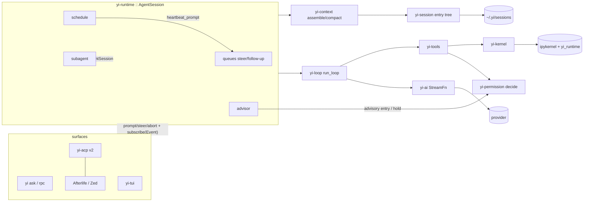

# Yi — Architecture Map

```
version: 0.146.0         # bump on any structural change; row goes in CHANGELOG.md
design:  YI_DESIGN.md   # the deep design; § refs below point into it
status:  phase 4 done   # yi-kernel (Jupyter client over pure-Rust zeromq) + uv venv bootstrap + verbatim rlm Python runtime (mcp.py rewritten over `yi mcp --json`) + ipython tool + runtime::subagent (rlm.run depth 1). Exit gate green: recursion scenarios incl. a live-kernel round trip. 4b done. Phase 5 done: runtime::schedule + runtime::advisor. Phase 5b done: yi-acp v2 server (hand-rolled wire, D40). Phase 6 done: yi-runtime::goal (G1-G6) + `yi serve` daemon (D4 supervisor + worker-per-root; exit gate green: a heartbeat dispatches while no client is attached and a reconnected client lists and resumes the session). Phase 7 done: `yi-tui` (D41 design — inline skeleton, subagent UX, pinned HUD/status) in the default build; `yi [prompt]` opens the TUI on a TTY (X1). Phase 8 (D42): nothing is deferred any more — every deferred, stretch, and never-built row is open work, worked in that order — the rows lived in docs/TODOS.md (ids A1-M5) until 2026-09-02 and are now issues on the forge, one per row, titled with the row's id (D106; the file is frozen at docs/archive/todos-2026-09-02.md). U13 stable-prefix streaming landed in 7; U18, dynamic viewport height, and the gitignore-aware @-walk are A3, A2, A4. TODOS section B (CLI surfaces) is closed at 0.19.0, which also lands the T14 capture/restore half of C1.
```

## Changelog

Moved to [CHANGELOG.md](CHANGELOG.md). The `version:` above and that file's
top row are the same version.

## Crates (13, all in the default build; `yi-mcp-cli` gated at runtime by `mcp.enabled`, D36) and line budgets

Budgets are ceilings (§9 ratchet); the target is always smaller.

| crate | owns | deps (internal) | budget |
|---|---|---|---|
| `yi-types` | every serde shape: messages, entries, events, tool/permission/schedule/kernel wire, config. Schema authority (§19) | — | 3,000 |
| `yi-loop` | `run_loop` + interrupt module (§8.2, §8.6) | types | 1,000 |
| `yi-ai` | providers: anthropic-messages, openai-completions (OpenRouter), openai-responses (native OpenAI, 0.37.0), faux; catalog; redact-free (§8.5) | types | 4,000 |
| `yi-session` | entry tree repo, JSONL codec, tree ops, conformance (§8.4) | types | 2,500 |
| `yi-context` | P1–P19: projection, accounting, compaction, ledger, assembly (§8.1) | types, session | 2,500 |
| `yi-permission` | modes, rules, holds, decide(); M7/M8 review verdicts + the action ledger (§8.7, D81) | types | 1,500 |
| `yi-tools` | Tool trait, fs/hashline/bash+reduce/exec-tools/checkpoint/skills (§8.8, §5, §14.3) | types, permission | 9,000 |
| `yi-kernel` | Jupyter client: ZMQ, HMAC, host.request (§8.9, §6) | types | 2,500 |
| `yi-runtime` | AgentSession + modules `subagent`/`mailbox`/`lane`, `goal`, `plan`, `rules`, `wall`, `schedule`, `advisor` (§8.3, §8.10–8.12, §8.17) | all above | 6,000 |
| `yi-acp` | ACP v2 server, Event→update (§8.13, D1) | runtime | 2,000 |
| `yi-orb` | thinking-orb engine + kitty painter (A.13) | — | 1,378 (D73) |
| `yi-tui` | inline-viewport TUI (§8.14) | runtime, orb | 9,406 (D73) |
| `yi-cli` | composition root; ask / rpc / acp / serve / sessions / undo (§8.15) | all | 2,000 |

Non-crate: `python/yi_runtime` (ported verbatim, §6), `skills/yi/` (catalog skills, §14.1), `vendor/rtk`
(§14.3), `scripts/guardrails` (§9), `evals/` cassettes (§12).

## Data flow



## Trust boundaries of the lane subsystem (D117–D122)

Inputs the process accepts here that it did not produce, each with its bound and the
STRIDE letters that apply; the letters not listed were walked and have no instance.

| input | crosses at | bound / control | letters |
|---|---|---|---|
| the model's `/land` title and `--closes` | `slash::lane_verb` → argv | `--title=<t>` form; `PrNumber(u32)`; `BranchName` validated at construction | T, E |
| forge replies: PR number, job names, job states | `land::parse_jobs`, `pr_number` | names cut to 64 chars before the latch and the prompt; states parsed to `JobState` with `Other` | T, D |
| the origin URL | `land::detect`, `owner_repo` | picks the adapter only; never interpolated into a shell | S |
| lock reasons and slot state read back from disk | `Pool::list`, `probe` | storage is not sanitization: the flock, not the text, says held; the session id only names a branch through `BranchName` | T, R |
| the lockfile and the repository's build config the warmer executes | `toolchain::warm` | offline, Seatbelt-contained, `nice 19`, only a hash a session already synced; receipted in `SlotState` | E, R, D |
| `git`/`tea`/`gh` output rendered in a cell | `capture` | 30 000-byte cap; the forge token stays in `tea`'s own config and is never read | I |

## Feature ledger

value/complexity: H/M/L. Status: **core** (launch), **gated** (cargo feature), **deferred**
(designed, scheduled later), **pattern** (recorded, unscheduled), **cut**.

| feature | § | status | V | C | note |
|---|---|---|---|---|---|
| pure loop + 13-event enum | 8.2 | core | H | L | |
| entry tree sessions (Pi byte-compat) | 8.4 | core | H | M | schema anchor; journey: `journeys::a_resumed_session_keeps_one_file_and_undo_restores_the_turns_start_tree` (T2) |
| Pi RPC mode | 8.15 X4 | core | M | L | kept per review (renderer over Event stream) |
| context P1–P19; prefix-aligned P7 | 8.1 | core | H | M | live 0.7.0 (P12 live with the kernel, 0.9.0); P15 branch summaries live 0.76.0 (TODOS `E1`) — a rewind collects the orphaned span before `move_lane` and the summarizer role writes `Entry::BranchSummary{from_id}` behind it, best-effort; P19 is the compact view — tool pointers, `stale` reads, `[Earlier]`, `[Kernel]`, entry-id citations — ahead of the full P7, with `history.grep` recall beside it, live 0.144.0 (D115) — journey: `compaction_faux::compact_view_cites_a_tool_entry_that_history_can_fetch` (T2) |
| hashline edit (+ registers, instrumented) | 8.8, D11 | core | H | M | boundary-repair excluded; a context window per hunk and a `prepare`-backed approval diff since 0.25.0 |
| permission modes/rules/holds, deterministic auto | 8.7 | core | H | M | auto is the default mode since 0.62.0 (D44 superseded); `--yolo` and `--confirm` select the other two. `yi-permission::safety` classifies each command segment; destructive asks, unknown is contained in a Seatbelt sandbox on macOS (0.64.0) and asked elsewhere, allow needs proof |
| model auto-review M7/M8 | 8.7, D3, D81 | live 0.77.0 | L | H | D81 revises D3's deferral: the reviewer sees only the auto-mode fallback `Ask` (the `reviewable` flag), every non-allow path denies, and an approval binds to an `ActionId` for one call. Off unless `models.autoReview` names it. Every reviewed decision still announces and settles on the event stream, so a model-authorized call is as visible to the TUI and ACP as a human-answered one |
| bash reduce (launch set) | 14.3, D13 | live 0.22.0 (Rust filters) | H | M | generic + cargo + grep, tee'd recovery; the rtk TOML corpus waits on a regex-dependency decision (C2), which also gates a regex mode for `grep` (literal + context lines only, 0.25.0) |
| file checkpoints + /undo | 5.3 | live 0.20.0 | H | M | shadow gitdir, both capture points, restore, tree-to-tree diff, `yi undo list`; TUI `/undo` live 0.25.0; journey: `journeys::a_resumed_session_keeps_one_file_and_undo_restores_the_turns_start_tree` (T2) |
| kernel + ipython + rlm() subagents | 8.9, 8.10 | live 0.9.0 | H | H | earns its H complexity; B7 typed child updates live 0.37.0 (ACP `_yi/subagent_update` + TUI task cell); B5 fork seeding + B11 worktree isolation live 0.39.0; B6 messaging + B13 mailbox live 0.40.0 (D58); every child writes a durable v4 transcript flat in its own `session_dir`, outliving the reap, since 0.74.0 (D78, `F7`); journey: `child_transcript::a_kernel_cell_spawns_a_child_whose_typed_answer_and_transcript_land` (T2) |
| dill snapshot | 8.9 K10 | live 0.9.3 | M | L | kept per review |
| heartbeats | 8.11 | live 0.9.5, lanes 0.84.0 | H | M | H7 per-session lanes closed (G1, D86): one interned timer per ledger, a `spawn_blocking` lane per session, and a timer deadline that skips busy sessions, so neither a due sibling nor a job scheduled mid-block waits out a blocked lane, and a session that ends or rebinds leaves neither a lane nor a claimable job behind; journey: `serve_daemon::workers_do_not_lose_heartbeats_or_tear_the_job_ledger` (T2), `schedule_e2e::a_rearming_block_does_not_hide_a_sibling_coming_due`, `schedule_e2e::the_kernel_vocabulary_cannot_reach_a_sibling_session` and `schedule::shared::tests::an_ended_session_leaves_the_timer_nothing_to_re_arm` (T0) |
| goals + autonomous | 8.17, D25 | live 0.10.0 | H | M | out-of-transcript fact, continuation audit, error-turn blocks; `check` completion gate since 0.33.0 (D52); journey: `journeys::a_red_goal_check_refuses_the_completion_claim_and_the_plan_surface_stays_read_only` (T2) |
| plan: git-tracked document + step table + dispatch | 8.17.1, D97, D105 | live 0.106.0 | H | H | JSON frontmatter since 0.108.0 (D105); supersedes the 0.33.0 task-DAG fact on storage only — D26 and host-verified done carry forward, and D53's anti-laundering intent survives as `drop`-marks-Abandoned plus an audited `supersede`; labels address, edges order, ready is derived, the spawn fuse and the dispatch width live in the file and on the machine rather than in config. Since 0.107.0 a `Blocked{on: External}` probe is actually run on a saturating ladder (D100) and a declared output schema is validated at `done` rather than merely resolved (D102); journey: `plan_walkthrough::campaign_decompose_and_supersede` (T1) and `journeys::a_hand_written_plan_lints_resolves_and_answers_why` (T2) |
| plan ledger: op stream, `yi plan`, `yi why` | 12, D103 | live 0.107.0 | H | M | every op is a durable session record, and the outcome ledger, the critical path, the discovery ratio, the mechanical lint and the blame-to-goal walk are queries over it plus the plan's own edges — no new store; journey: `journeys::a_hand_written_plan_lints_resolves_and_answers_why` (T2) |
| plan tree panel (`/plantree`) | 6, D104 | live 0.107.0 | M | M | the full DAG — plans, todos, states, `after` edges, sub-plans — read-only over the runtime's own structs; journey: `plantree::panel_renders_every_state_glyph_and_the_dag_edges` (T0), recorded as a drive run for the PR |
| fetch: one addressable read path | D98 | live 0.106.0 | H | M | eight internal schemes behind one resolver; walls as URL-prefix denies, declared by `rlm.run(deny_url=[...])` since 0.107.0; the fetch log is both the pin ledger and the context-relevance instrument, and `FetchLog::relevance` is the M3 query over it; `history://` and `agent://` reach a live child and a session on disk through one transcript seam (D101); `agent://` and a child's `kernel://` are ephemeral and refused in a terminal record; journey: `plan_walkthrough::campaign_decompose_and_supersede` (T1) |
| behavior baseline gate (micro-eval ratchet) | 15 | live 0.73.0 | H | L | D76: shrink-only cassette replays in `just check`, faux tier only; cases are commits; `evals/record.py` distils a case from a v4 session file since 0.73.0, redacted at record time and fatal on anything a linear cassette cannot replay; the first real-provider recording and the eval ledger stay user-run (J1, J2, J3); journey: the cassette corpus itself is the T1 tier |
| decomposition protocol (check-first · ladder · scoped transport · drain gate) | 8.10, 8.17 | live 0.72.0 | H | M | D77: the model proposes `SubtaskSpec`, code validates and lowers it; depth stays 1 until a campaign shows the task class; the drain gate rides goal completion and fails closed on a plan it cannot read; the ladder's upper rungs refuse the next done-claim before its check runs since 0.78.0 (D82), each further claim priced at one structural move naming that one task; the streak and the grant ride the plan fact, so a resume cannot launder a rung; journey: `plan_e2e` (T1) — the rpc plan surface became read-only at D97, so the T2 journey that drove the ladder through it was rewritten to the goal gate it also covered |
| `get_context` orientation packet | 5 | live 0.70.0 | M | M | one clamped, layered packet behind a completeness header; 445 bytes of tools prefix; layer fit still open (P13) |
| trigger rules (gate + remind) | 16 MM7, D54 | live 0.34.0 | H | M | user-authored, zero builtins, literal-only until C2; gate = deny-with-evidence before permission; per-rule gap is the noise budget; `scope: result`/`error`, `paths:`, `after: N`, an evidence latch keyed on (rule, needle, path), and SKILL.md trigger pointers live 0.143.0 (D114); fire-lane eval (`evals/rule_fires.py`) live 0.142.0 — journeys: `rules_e2e::result_scope_fires_on_the_output_not_the_args` and `rules_e2e::the_lane_fixture_runs_through_the_engine` (T1) |
| advisor (LlmReviewer only) | 7 | live 0.9.6 | H | M | V11 promote live 0.43.0 (D59); the innovation focus; work-log context v3 (D19); headless Hold degrade (D28); six deterministic signals deleted at D50; `models.advisor` names the reviewer since 0.36.0 (D56) and plan transitions force reviews; V5 `CompactionCheck` live 0.76.0 as an advisory flag (D80, revising D8) — a compaction enters the work log as its own pull-able digest line beside the directives panel; V11 promote open (I1) |
| CompactionCheck | 7.5, D8 | open (E2) | M | M | undeferred D42 |
| SelectCandidate / best-of-N | 7.5, D10 | open (M5) | — | — | judge-selection over parallel subagents; never a TTC flag |
| ACP v2 server | 8.13 | live 0.9.7 | H | M | Afterlife integration point; C7 diff content waits on T13 (open H1); C8 covers model + thought_level, its other three options and `_yi/heartbeat_changed` open (H2, H3); journey: `acp_protocol::v2_client_drives_a_session_end_to_end` and `acp_protocol::resume_replays_the_stored_branch` (T2) |
| ACP v1 adapter | D1 | **cut** | L | H | additive if a v1 client appears |
| daemon (ACP-router supervisor + worker/root) | 7, D4 | live 0.10.0 | H | M | one protocol, isolation kept; H7 lanes + B8 ledger open (G1, F6); one writer per root today; journey: `serve_daemon::two_roots_run_two_workers_that_keep_their_own_schedules` (T2); the N-workers-by-M-kernels stress matrix is still unbuilt (G2) |
| TUI | 8.14 | gated `tui` (ph 7) | M | M | resumable (`--session`/`--continue` replay the transcript, quit prints the resume command); esc-esc opens the session tree and a rewind visibly unsends the turn. 0.45.0-0.51.0 (D60-D66): edits and writes render their diff in Normal mode (U37), the kernel call has its own cell (U38), code is highlighted without a dependency (U39), read-only calls group and a waiting call goes amber (U40), `/agents` shows the family and what spawned it (U41), and every animated glyph runs off one clock (U42); the status-line cost is the session's spend across parent and subagents, reset by `/new` (A12); syntax highlighting carries its parse across lines, so block comments and triple-quoted strings keep their colour (D74) ; a turn whose usage the provider never reported renders the cost as `$X.XX+?` rather than counting it free (D79); `/permissions`, `/compact` and `/sessions` close A5 (0.85.0); Ctrl+R reverse-i-search closes A6 (0.91.0); journey: `tui_drive::plan_and_undo_answer_for_the_session_the_turn_ran_in` (T2), `tui_drive::reverse_search_enter_accepts_a_match_without_submitting` (T2), with the true-terminal path covered by `just journeys`' `scripts/tui_pty.py --expect` leg |
| board + GitHub issues via `gh` | 14.4, D5 | open (K1) | M | M | zero persistence; undeferred D42 |
| MCP CLI | 5.2, D9 | gated `mcp` | M | M | subcommand; proxy cut |
| docs conversion (anydoc) | 14.6 | **demoted** | M | L | the console's one-in-one-out (§1.1, 0.88.0); the kernel venv already converts |
| extension system + yard + native voice/method | 14.1–14.2 | live 0.62.0 | H | M | slot table replaces prompt concatenation; environment text is fenced and hash-pinned; orchestrate/lang-rust/grid/telemetry are the built-ins; vendored bundles deleted |
| branch summarization P15 | D7 | open (E1) | L | M | undeferred D42 |
| structured output `--schema` | D10 | live 0.19.0 | M | L | JSON Schema subset (type/required/properties/items/enum); mismatch exits 3 |
| lanes: worktree-first sessions, pooled slots, hand-back by move, landing as an event, contained warmer (absorbs B11) | 8.10, D117–D122 | live 0.146.0 | H | M | a root session claims a slot outside the checkout and hands it back; `--here` opts out; `isolation='worktree'` children claim from the same pool off the parent's HEAD; `/land` pushes and opens through `tea`/`gh` or `lanes.land`; `yi lanes [reap N]`; journeys: `lanes::a_claim_branches_a_slot_and_leaves_the_trunk_untouched`, `lanes::a_resumed_session_reclaims_its_slot_with_its_work_and_an_orphan_blocks_others`, `lanes::the_warmer_refuses_a_lockfile_no_session_synced` (T1), `recursion_e2e::a_worktree_child_gets_its_own_checkout_and_hands_it_back` (T1), `journeys::an_ask_in_a_repository_runs_on_a_lane_and_hands_it_back` (T2, rides `just check`) |
| embeddings / semantic search | 14.6 | cut until grep fails | L | H | |
| auto-skills / refine / self-extension | 5, 14.5 | **cut** (policy) | — | — | never |
| catastrophic-path denylist M10 | 8.7, D15 | core | H | L | ~200 lines; absolute tier of a surveyed gate |
| hook bridge L1/L2 + **L3 remote-rendered UI** (U27–U30, A10, §8.16) | D14 | open (L1, L2) | H | M | L2 ≈ 60–65 %; **L3 ≈ 92–96 %** of Pi's 78 examples unmodified; core cost ~1k lines under `tui` feature |
| `yi-pi-compat` shim | D14 | open (L3, external pkg) | M | M | real Bun ⇒ extensions' fs/spawn work; renderers/themes/games never |
| provider pass-through (all pi-ai providers via sidecar) | 3.1, D16 | open (L4) | H | L | zero core lines beyond A10 |
| Pi-differential testing (Pi as eval baseline) | 3.1, D17 | core (ph 3, test infra) | H | M | token ratchet reports Yi-vs-Pi |
| bidirectional session handoff (`yi adopt`) | 3.1, D18 | open (L5) | M | L | reversible migration per session |
| Pi templates as commands + skills roots + theme import | 3.1 | core | M | L | folded into X1/§5/U17 |
| AA benchmark adapters (harbor + pier) + E1–E9 gates | 15 | open (J1, J2) | H | L | ~250 lines Python; TB2.1/QnA free via harbor datasets; E2 proxy-aware transport live 0.71.0 (`HTTPS_PROXY`/`HTTP_PROXY`/`NO_PROXY`, fail-closed at startup for a provider run — a faux run never dials one and is spared, and the refusal names the host with any inline credentials redacted); `evals/run.py` + the faux dry tier and `just package-musl` live 0.73.0; only the ledger row is left, and it needs a real model |
| ARC-AGI-3 client | 15.5 | open (J7) | — | — | not in the AA index |
| PTY interactive exec | 12, D30 | **cut** | M | H | auto-background + `ipython` cover it; per-session approval hole; ~3.7k lines |
| freeform/grammar tool format (hashline) | 8.8 T1, D29 | open (C8) | M | L | openai-responses only; 0.37.0 still sends JSON function tools |

## Decision log

| id | decision | why | reversible via |
|---|---|---|---|
| D122 | the idle warmer is a contained, offline, receipted run that only rebuilds a lockfile hash a session already synced: on release, the toolchain table's warm command (`cargo check --offline`, `pnpm install --offline --frozen-lockfile`, `bun install --frozen-lockfile`, `npm ci --offline`, `uv sync --frozen --offline`) runs under the same Seatbelt profile as a contained bash call at `nice 19`, its pid and exit land in the slot's `WarmReceipt`, a hash absent from `seen.json` stays cold, a claim on a warming slot sends TERM and waits 30 s before it resets, a killed sync reruns on the next claim, and a failed warm is not retried until the base moves | the warmer was the one new trust boundary: it runs repository-defined code (`build.rs`, proc macros, package scripts, build backends) from a freshly fetched `origin/main` with no session and no permission verdict, which is elevation and repudiation on the path the design added; gating on a hash a session synced makes the warm a replay of a run the user already started | delete `toolchain::warm` and the `seen.json` gate; slots stay cold and the claim-time sync alone remains |
| D121 | landing state is an event: `AgentEvent::LandingState { landing }` with `Landing::{Unlanded, Pushed, Open{pr, jobs, behind}, Merged}`, emitted by every `/land` step and by a 60-second poll while a pull request is open; a job name is bounded to 64 characters at the parser and a red job steers the session once per name, fenced, never once per poll; the TUI shows it as a status segment (`PR #191 ●●⟳ · main +4`) and a HUD row, ACP forwards it as `_yi/landing`, and `/lanes`, `/land`, `/pr`, `/base`, `/discard` live once in `yi_runtime::slash` | forge job names are text anyone with a workflow commit chooses and were about to enter the model's queue unbounded; polling by the schedule rather than by the model keeps gate feedback deterministic (no LLM-judged firing) | drop the variant and the five verbs; `just pr status` by hand |
| D120 | the forge adapter is detection, not abstraction: the origin URL picks `tea` (any host) or `gh` (github.com), behind one `match` and two functions each for open, poll and merge; a title reaches argv as `--title=<t>`; `lanes.land` names a program the repository lands with instead (the title appended), so yi's own tree lands through `just land`; push and open run in a background thread with a 30-minute bound, because a pre-push lane takes minutes | a `Forge` trait would have one implementation per binary and no third; a title starting with `-` was the model's one direct write to argv; `scripts/forge_pr.py` already owns this repository's ratchet-commit-push-open-merge order and is not reimplemented | delete `lane/land.rs`; `/land` becomes the yi-forge skill's verbs typed by hand |
| D119 | the hand-back ladder is by move: `Lane::merge_into(self, ..)`, `discard(self)` and `release(self)` consume the lane, so a second hand-back does not compile, while `land(&self)` repeats — pushed, then opened, then merged once green; a dropped lane is handed back detached with its branch kept unless merged, and only the explicit release starts the warmer | the B11 record enforced never-twice with a comment and a runtime `Running` check; a moved value cannot be handed back again, and `Drop` covers the exits `std::process::exit` skips only where the CLI calls release first | a `released` flag and a runtime error in place of the consuming signatures |
| D118 | git is the registry of lanes: `git worktree list` holds the slots, a per-slot `.held` file under a kernel-released flock says who is live, `<n>.json` (`SlotState`) records the base, the synced lockfile hash, the holder and the warm receipt, and the `git worktree lock` reason is the crash record; `pool.lock` serializes claim and release across processes; a state file naming a session under a free flock is an orphan, which `yi lanes reap <n>` frees while keeping any branch `main` does not already contain, and a resumed session whose id is on a slot reclaims that slot with its branch intact | an advisory git lock is check-then-write, so two daemons racing a claim could both `reset --hard` one tree; the flock is atomic and dies with the process, so a crash leaves a readable orphan instead of a held slot, and no second registry file can drift from the worktree list | delete the `.held` and `.json` files; `git worktree list` plus the lock reasons still say what is where |
| D117 | a root session is worktree-first: unless `--here`, `lanes.enabled: false` or a cwd outside a repository, it claims a *lane* — one of N fixed slots (`lanes.slots`, default 3) under `~/.yi/lanes/<repo-hash>/<n>`, outside the checkout — resets it to `origin/main` (then `main`, then `HEAD`), branches `yi/<session>` and runs every tool, extension, plan and checkpoint there while the session file stays keyed by the trunk cwd; a child with `isolation='worktree'` claims from the same pool off the parent's HEAD and merges back into the parent's checkout; a claim that fails fails the start, never falls back to the trunk | the trunk checkout was every session's working directory, so a `git reset` in one session ate a sibling's uncommitted edits and the human's editor saw agent churn; a fresh `git worktree add` per session was a cold build cache every time, because cargo, tsc and uv key their caches by absolute path, and a fixed slot is warm by construction; claim is `reset --hard` on a tree that already holds last time's files, which rewrites only what moved | `--here` everywhere, or `lanes.enabled: false`; delete `crates/runtime/src/lane/` and children fall back to the pre-0.146.0 `git worktree add` under the session artifacts |
| D116 | every provider path sends the cheapest legal cache hint and the hit rate is one formula: an OpenRouter model whose catalog entry carries `cacheControlFormat: anthropic` gets a root-level `cache_control` (OpenRouter moves it to the newest cacheable block itself), an `api.openai.com` model whose id starts `gpt-5.` and lacks `supportsExplicitPromptCacheMode` gets `prompt_cache_retention: 24h`, the Anthropic 1h TTL is sent as the GA block value with no beta header and no retry, OpenRouter's `usage.cost` overrides the catalog `cost.total`, the Responses path takes `cache_write_tokens` off `input`, and the hit rate everywhere is `cache_read / (input + cache_read + cache_write)` — the telemetry record, `yi stats` (`cache.hitRate`, `writeShare`, `misses`, per-model rows) and the TUI turn footer. A miss is a same-model request after the first that read nothing, counted in `yi stats` from the message ledger, which alone knows the model | the OpenRouter path emitted no breakpoint at all, so every Anthropic-routed turn re-billed its prefix; the one recorded ratio omitted writes and overstated warm turns; nothing surfaced any of it. Gated on the catalog flag rather than the provider so 318 automatic-cache routes never see a key they do not need; retention by id prefix because a 400 there has no retry path and a dead turn costs more than a cold cache. The plan-ledger forced tool still runs without thinking (the API refuses the pair), which invalidates only the messages-level breakpoint once per eager-init session while tools and system stay cached — accepted, not fixed. Weighed and left out: block-level `cache_control` for Gemini and Qwen routes, a `Usage` field for `cache_discount`, `prompt_cache_options` for gpt-5.6, a telemetry miss flag (no model there), a status-bar percent. Kill test: drop the compat gate and `anthropic_routed_models_get_a_root_breakpoint` plus `the_openrouter_cached_prefix_survives_a_turn` go red | delete the four `if` blocks in `openai.rs`/`openai_responses.rs` and the `Tokens` struct in `stats.rs`; the Anthropic beta header is one constant and one header push if a gateway still wants it |
| D115 | compaction's recall half is a deterministic extractive view plus store-native grep: `compile_view` renders `<yi_compact_view>` (this round's outstanding errors, a rolling 120-line brief citing every summarized turn as `(#entryId)`, an `[Earlier]` index of the lines that rolled past the cap, and a `[Kernel]` persist note), a successful tool result is a pointer and a read a later message edits is `stale`, and `compose_summary` prefixes the view ahead of the P7 prose and persists its brief and `[Earlier]` lines as data in `CompactionDetails.extra` so the next round rolls them without re-parsing rendered text; `SessionStore::grep` is case-insensitive substring over message text and summaries with thinking excluded, exposed to the kernel as the host verb `history.grep` and the skill call `compact.recall`, and the hit's entry id fetches the full entry through the existing `history://` seam | the window after compact held LLM prose plus the P17 floor and could not discover a buried entry id except by dumping `history://` wholesale; the JSONL already keeps everything, so the gap was discovery, not retention. A compiled transcript as the *summarizer* — the 2026 view-oriented-compiler approach — was weighed and rejected: D21 ports compaction from one reference only, and the LLM summary is what carries forward intent; the `<yi_compact_view>` wrapper is host-authored so the UPDATE summarizer treats it as not-its-job, and each compact recompiles from the current slice plus the previous view's brief. A skip-LLM fold mode and a keyword `[Pinned]` section were weighed and rejected the same way: they duplicated P8's file lists and P17's user floor without implementing the observation mask or the maintained constraint list they borrowed from. Substring rather than a regex crate or embeddings: no new dependency, and the same measurement bar as §14.6 applies — regex lands when grep measurably fails. No primary `Tool`: the registry stays closed and recall rides the `compact.run` precedent of host verb plus kernel skill | delete `crates/context/src/view.rs`, the `Preparation.view` field and the `history.grep` registration; summaries keep working, because the view is a prefix on the summary body and old compaction entries never carried one |
| D114 | D54's matcher gains post-tool haystacks (`scope: result` / `scope: error`), `paths:` as a glob AND with the call's `path` argument (so a rule with `paths:` never fires on a tool without one), `after: N` and the latch keyed on (rule, needle, path) rather than on the rule alone, and optional SKILL.md `trigger:` compiling to a one-line `skill://` pointer (capped at 2/turn, suppressed after a `read` of that skill); gate stays pre-spawn; no regex, no stream abort | the 0.139.0 cassette scored current recall at 0 on rustc codes that exist only in a tool result; skill `trigger:` is optional frontmatter the author already wrote, and a pointer the model fetches is cheaper than injecting the file; `yi-permission::PathGlob` is the path compiler already paid for, compiled once per rule | drop `check_result`, `discover_armed`, and the new frontmatter keys; gate+text behaviour is unchanged, and `rules_e2e::the_lane_fixture_runs_through_the_engine` runs the fire-lane fixture through the engine |
| D113 | the daemon path is lossless for yi's own clients: the worker emits every runtime `AgentEvent` verbatim as a `_yi/event` update with a per-session `seq` (a broadcast lag becomes `_yi/event_gap`), a resume or rewind sends the stored branch verbatim as chunked `_yi/replay`, config and goal changes ride `_yi/config` and `_yi/goal`, the solo verbs steer, rewind, plan, child replay and child abort are `_yi/*` requests, child sessions are forwarded with a `childId`, and every session result carries the session's name; the standard ACP kinds stay as the projection external editors read. A console then renders the chat with solo's own reducer instead of a second one, and nothing under `crates/tui` imports ACP: the chat is fed through a port and its events only. Its rail is herdr's shape — slot number, avatar, state icon in its own column, the row of the session in front tinted — and the avatar is a real image: a 5×5 mirrored identicon seeded by the session id, coloured by the name's accent, placed over kitty on its own image id, with the same initials tile drawn under it and in the status row on every terminal | the console had forked solo's chat because the standard kinds drop turn boundaries, eight assistant-event variants, permission payloads and tool arguments, so a renderer on them could never be solo; the daemon forwards frames untouched, so the fix is what the worker emits, not a new transport; and a daemon client that stops reading was queued without bound, so its queue is capped and it is dropped to heal on reconnect | drop `_yi/event`, `_yi/replay`, `_yi/config`, `_yi/goal` and the five requests from the worker and `name` from `AcpSessionResult`; the console falls back to the standard kinds |
| D112 | the workspace chat is the solo chat: the console prompts through `yi_tui::composer::Composer`, the `/` and `@` popups stand in for it, the session slash verbs live once in `yi_runtime::slash` where the solo TUI and the ACP worker both route them, the worker answers `_yi/slash` for a console and streams `_yi/status` (model, effort, cost, context) so the console draws `yi_tui::status::render`; `/new` and `/quit` stay the console's own | the console had grown a second composer — a bare text area with no history, paste markers, file popup or slash path — and a status row of keymap hints, so the same person typing the same `/plan` got prose from the model in one surface and a plan from the runtime in the other; a chat feature implemented twice drifts, and the worker is the only place a verb can read the session a console does not hold | drop `_yi/slash` and `_yi/status`, move the verbs back under `crates/tui/src/commands.rs`, and the console's composer reverts to the text area |
| D111 | a session is named by its first prompt until a name fact is written, the name and birth ride every `session/list` result (the daemon captures the name from the first `session/prompt` it forwards), and the workspace sidebar is a rail of per-session status glyphs by default, sorted by last activity, that ⌘B walks to full and hidden | the sidebar listed id hashes in first-seen order with no cap and no time, which is unreadable past a handful of sessions; a name has to be deterministic — no model call names a row — and has to exist for sessions written before naming did, which only a scan of the file's first prompt gives; the rail is the default because the chat is the workspace's object and the list is its index | drop `scan_name` and the two `name` fields, and `SidebarMode` collapses back to the hidden/full boolean |
| D110 | the comment cap drops from three lines to two, and the reference codebases are unnamed everywhere in the tree: docs, rules and comments carry the mechanism and the incident, never the donor's name | a fact that needs three lines is two facts or it is narration — the sweep that proved it rewrote all 389 three-line comments with no fact lost; the names were provenance for a one-time port that the design tables already superseded (D39) | revert `CAP` in check_comments.py and re-run `--update`; the names live in git history |
| D109 | panic and dead-artifact gates judge behaviour, not spelling: `#![deny(clippy::string_slice)]` on every crate root not in a shrink-only pending list, `String::truncate` a disallowed method, and check_orphans.py holding write-only `pub` fields and reader-less baselines at zero; `grid orphans` stays a review step | check_panic.py's regex saw `.unwrap()` and not `error.truncate(80)` on a byte index; rustc's `dead_code` sees nothing `pub`; a 0-byte baseline added at 0.97.0 sat unread through 26 versions and two days and two context budgets were never enforced; grid's unit is the definition and a field is not one | remove the attributes and the config entry; delete the script, its `run` line and the pending list |
| D108 | a fixture is the production shape: the TUI's life-sized corpus is scrubbed session files under crates/tui/tests/fixtures/sessions/, replayed through `stream_with_deltas` into the same `App::reduce_agent` the screen runs; the `rlm` package has a stdlib unittest lane in check_guardrails.sh; a schema is a well-formed object or it is refused at construction; a PR that adds a test writes its seen-red line; a T3 run is recorded into the corpus so it is paid once | fourteen defects sat beside green tests whose fixtures were the shape that works — a 3-paragraph thought, a 2-row traceback, a mismatching schema instead of a malformed one — and 1,789 lines of Python had no test because every Rust test called the host directly; the session that surfaced them is 169 KB and replays in milliseconds | delete the fixtures directory, the helper and the `run` line; the doctrine line in 080 stands alone |
| D107 | scrollback order is antecedent-before-dependent, not arrival: a message's thought commits whole before any of its prose commits — every prose row, mid-stream or at `MessageEnd`, passes through `commit_prose` — and a task cell commits after the tool cell it was born under, held visible in the live region until then; every `Cell` family names its antecedent in an exhaustive match | two writers into `pending_commit` — the markdown stable cut and the child roster — each kept correct time alone and were never run against each other; a thought with no blank line waited for `MessageEnd` and landed under its answer, a child that finished fast landed above the `ipython` cell that spawned it, and a fifth writer at `MessageEnd` duplicated `commit_prose`; every fixture that passed had chosen a shape where the clocks agreed | delete the hold in `commit_finished_tasks` and the flush in `commit_prose`; the pair tests fail and name them |
| D106 | the forge is the only register of planned work: issues, milestones and the project board on `apex/yi` hold it, an issue number is the identity of a piece of work, and `docs/TODOS.md` is frozen and archived rather than maintained. A feature PR names its issue (`Closes #N` finishing, `Refs #N` in part) and the merge closes it; sizes are `size:S|M|L` labels of which exactly one is mandatory, beside an `area:*` and a milestone; milestone due dates are computed weekly from measured throughput and never typed. Enforcement is CI's — no tracking check runs offline | the people are on the forge and a file cannot hold a contributor's issue: it cannot be assigned, commented on, or opened by anyone without a commit bit, and two sessions editing it collide. The closing loop is native — `Closes #N` on a merged PR closes the issue with no second actor — where a file row's `DONE` marker is a hand edit nothing checks. And dates become measurable: an issue carries its own open/close history, so throughput is read off the register instead of being joined by hand from changelog dates, which is what `docs/forge-planning.md` had to do and what made its velocity number an assumption | a register regenerated from the forge: the issues carry their seed rows verbatim, so `tea issues ls --state all` renders the file again |
| D105 | the plan file's frontmatter is JSON between the two `---` lines, written and read by serde_json alone; the hand-rolled YAML subset codec is deleted and `PlanStore::render` / `store::parse_document` are the only two seams a document passes through. Supersedes D97's frontmatter clause | D97 chose YAML for the human with an editor and hand-rolled it because `toml` is banned and the transitive budget had one unit left; re-measured, every YAML crate carries `unsafe` in its tree (`unsafe-libyaml` is c2rust output, `yaml-rust2` and `saphyr` sit on `arraydeque` and `hashlink`) and costs two to nine transitive crates, and a 700-line hand-rolled parser behind a user-editable file is attack surface this tree would own forever. serde_json is already the vetted parser behind every other durable shape here. The cost is the human's — no comments, quotes and commas — and the body stays Markdown | reinstate a codec behind the two seams; the write-time round-trip guard comes back with it |
| D104 | the plan DAG is a panel, not an inline checkbox list: `/plantree` opens a titled, box-drawn view over the same structs the runtime reads, with `hud.rs`'s existing glyph vocabulary, `tree.rs`'s gutter runes for depth, one dim `after:` row under a gated todo, and no mutation at all — Enter closes, because the plan tool is the only writer | reference-first found the opposite default and it was taken anyway, with the reason recorded: three references all render a plan as a flat inline checkbox list, none has a popup, and only one draws tree runes — to nest tasks under phases, never to draw dependency edges. §6 requires the full DAG (every plan, todo, state, edge, sub-plan) to be readable by the user and by any agent at any depth, and a flat inline cell cannot carry edges or sub-plan nesting. The deviation is only in the container: the glyphs, the runes and the panel chrome are all already in this tree, so the donors' vocabulary is what a reader sees | delete `crates/tui/src/plantree.rs`, the `plantree` verb and the `plan_tree` field; `tree.rs`'s promoted helpers stay `pub(crate)` and its own panel is unchanged |
| D103 | an applied plan op is a durable record on the owning session (`custom{plan_op}`: plan, op, actor, timestamp, todo, from-state, to-state, todo count), and §12's yield is a query over it — `yi plan report` computes the per-todo outcome ledger, the critical path against the wall clock (K3's serial fraction), and the discovery ratio; `yi plan lint` is the mechanical half of the doctrine, advisory and never a verdict; `yi why` walks `git blame` to commit to `Plan:` trailer to todo to goal, and its reverse is the same data. `TodoStateName` is promoted out of the plan file's own repr so the event log and the document share one state vocabulary | the plan file is the state and carried no record of *when* it moved, so every duration in §12 — the outcome ledger, Amdahl, duration priors, an OpenTelemetry span — was a query over a store that did not exist. Timestamps do not belong in the plan file: a Done plan gains history, never mutations, and a frontmatter that grew a transition list per todo would hit the 32 KiB cap on a long run. The session's own append-only entry tree already has both properties, and the fetch log had already proved the shape | delete `crates/runtime/src/plan/{ledger,why}.rs`, the `OpSink` seam and the two CLI verbs; `yi_types::plan::ledger` stays as an unread durable shape, which is additive and loads either way |
| D102 | a declared output schema is checked at `done`, not merely resolved: the resolve seam returns the referent's bytes, so the engine fetches both the product and the schema the delegation declared and validates one against the other through the B4 validator, refusing with the path that failed. `Ok(None)` is resolved-but-unserved — a scheme this resolver has no backend for cannot adjudicate a schema, and a missing backend must not become a refusal. Beside it two reap properties: a reap is idempotent at the delegate seam, because a reap asks that a child not be running and a host holding no such child has already answered that; and `supersede` runs every refusable check — the new cut's validity and its frontmatter size — before the first reap | §3 said "declared implies Done requires validated output" and what shipped was an existence probe, which passes on any file that exists, including the wrong one. The two reap properties are the same defect from two sides: `supersede` refused after killing part of the family, and the next attempt refused on the first already-dead child, so a plan whose cascade failed halfway could never be superseded again. Refusing before the first kill makes the op safe to retry, and the idempotent reap is what makes the retry get past the children the failed attempt already took | drop `validate_product` and the two new variants and the resolve seam degrades to the existence probe; restore the `key_of` refusal in `SessionDelegate::reap` and move `validate_plan` back after the cascade |
| D101 | the corpus is one address space behind one seam: `Transcripts::open(agent)` answers from the attached session, then a live child the subagent host still holds, then a session file on disk by id, and both `history://` and `agent://` route through it — a live child is inspectable at will, a dead one through the pin its reap minted. An agent name is a todo address and carries its own slash, so the whole path is tried as an agent before a trailing entry id is split off | D98 read `history://` as agent-plus-entry at the first slash and refused any agent but the attached one. Both halves were wrong at once: a reap pins `agent://<plan>/<todo>` to `history://<plan>/<todo>`, which that split read as the plan plus an entry that never existed, so no reap pin resolved at all and the unit test that claimed otherwise hand-pinned a single-segment address; and a corpus that stops at the attached session cannot serve a retried child the failed attempt's trace, which is the whole payoff of promotion-at-reap | drop `Transcripts`, `TranscriptDesk` and `SessionTranscripts`, and `resolve_history` falls back to the attached session alone |
| D100 | `Blocked{on: External}` is a scheduled question, not a dead end: a probe rides the block, the host runs it on a saturating ladder — 60 s doubling to a 30-minute ceiling — and a pass becomes a host-attributed `unblock`; a block with no probe nudges its owner at the ceiling interval instead. The ladder runs off the wall clock in its own task, not off turns, and its due times live only in memory | the loop's stop posture already had a `Cadence` arm for exactly this state and nothing was on the other end of it: a todo blocked on an external condition sat until a human noticed, which is the one shape of stuck the topology was supposed to have no answer for. Turns are the wrong clock because a session that goes quiet on `Cadence` has no more of them. The ladder resets on resume on purpose — a probe is cheap and re-running one is not the runaway the spawn fuse guards, so it does not earn a durable counter | delete `crates/runtime/src/plan/probe.rs` and its one `spawn` call in `wire_plan_engine`; `BlockedOn::External`'s probe goes back to being carried and never run |
| D97 | the plan is a git-tracked Markdown file with YAML frontmatter under `plans.dir` (default `.yi/plans/`), and `Fact::Plan` becomes a pointer to it. One process writes, atomic tmp+replace behind a `.lease` whose arbiter is a token the holder reads back, reusing K1's branching staleness rule verbatim; the user's editor is the sanctioned second writer, and an mtime change diffs into user-attributed ops through the one differ that also renders a plan diff — a folded edit that moves a delegated todo out of Running reaps its child on the same path an engine op would. Todos are addressed by verbatim label, unique verbatim and after slugging because a URL addresses them by slug, and `after` edges carry ordering and no data. `version` bumps on `supersede` alone while a monotonic `touched` counter carries the staleness signal; `drop` marks `Abandoned`, a plan is finished exactly when every todo is terminal, and that state is recomputed each frame rather than latched, because a Failed todo is still workable. Every mutating op is gated on the target plan's state and routed through one step table, so legality lives in data and the reap-on-leaving-Running side effect has exactly one site. `supersede` reaps every Running delegation in the plan family before it applies and fails atomically if any reap fails. Four bounds are mechanisms rather than advice: the spawn fuse rides the root frontmatter so a crash cannot refill it, the dispatch width is `clamp(cores − 1, 1, 8)` measured from the machine, promotion runs at reap whatever the outcome, and the 32 KiB frontmatter cap is refused before the write. `proptest` joins dev-only under the D71 pattern to fuzz the step table. This supersedes the storage half of D53 and carries forward D26 and host-verified done | the fact was the store, so a plan could not be read by a child, opened in an editor, diffed by a human, or survive the session that wrote it — and a forty-todo ledger sat inside every request prefix. D53's expand-only rule is reconciled rather than repealed: nothing is deleted, `drop` is a state, rewording is append-new plus abandon-old, and `supersede` is the audited exception D53 was defending against silent versions of. The version/touched split falls out of that same reconciliation — with edits no longer bumping, a latch keyed on version would go quiet during exactly the churn it exists to watch. YAML because the second writer is a person with an editor; hand-rolled because `toml` is banned by name, the transitive budget had one unit left, and the subset a plan file uses is a few hundred lines against a crate that is not. The fuzzer earned its dev-dependency before it was finished: its first run found `retry` on a finished sub-plan leaving the plan Done with a Pending todo, and an adversarial review reached the same latch from the other side, along with a `block` that leaked a live child and a supersede that counted phantom flight forever | delete `crates/runtime/src/plan/{store,ops,table,tool,dispatch,loop_coupling,yaml}.rs` and the pointer field; `Fact::Plan` still carries `tasks`, every existing session file still loads, and the three durable v4 fixtures still round-trip byte-identically, because the pointer is additive and the legacy shape never changed. The frontmatter clause (YAML, hand-rolled) is superseded by D105 |
| D98 | every reference is a URL behind one resolver: `local kernel plan agent history checkpoint mcp user` internally, with an open tail for anything else a resolver could fetch. The seam enforces permission (B15 walls become URL-prefix denies, one vocabulary across files, kernels, agents and remotes; an external scheme is refused as a tool call rather than fetched), provenance (content from outside the trust boundary arrives fenced) and cost, and it logs every fetch into the one log the dispatcher also pins into. `local://` and `checkpoint://` take a hashline fragment that refuses rather than clamping when the referent moved. Schemes are typed ephemeral or durable and a terminal record may not name a referent that will not outlive it, so the plan owner's own kernel is durable and a child's is not; the host, never a model, rewrites a citation to its pinned form at that seam, and a citation absent from the log is flagged as an unbacked claim. `user://<n>` counts only messages minted by a path that took input from outside the process, so a host-minted message can never shift a citation's ordinal. URLs name nouns: no write path, no verb scheme, resolvers built in, a kernel variable name validated as a bare identifier before it is anywhere near a cell, and no scheme that may ever name a secret | delegation context, a Done output, a plan body reference, a compaction citation and a permission wall were five mechanisms with five security models, and the one that mattered most — what a child was handed against what it actually read — had no instrument at all. One seam makes context-relevance telemetry a grep over the log and fabrication detection a lookup rather than a judgment, and it stops heavy context from moving transcript bytes, since a URL in a prompt is a short stable string that composes with the cache breakpoints instead of fighting them. Two bounds are recorded rather than papered over: the hashline tag is a whole-file 16-bit hash whose snapshot store is LRU-evicted, so an expired pin and a forged one are not distinguishable at this seam and the error text says exactly that; the log's own sha256 is what is evidence-grade | delete `crates/runtime/src/fetch/`; the walls fall back to their path-prefix form, which is the only enforcement any caller relies on today |
| D99 | a commit that lands work under a plan carries one `Plan: plan://<plan>/<todo>` trailer, and `check_commit_style.py` admits it as a third carve-out beside the optimizer's `Opt-*` set and the trailers git writes itself, checking the value parses as the URL it claims to be | `git blame` to commit to todo to goal to the user message that asked for it resolves "why does this line exist" with no inference, and the index exists only if it accrues from the first plan-attributed commit — a trailer added later indexes nothing before it. It is the one item of the ledger's yield that has to be paid for on day one; every other query over the plan files, the op events and the fetch log can be written whenever. Assistant and co-author trailers stay banned outright, which is the rule this row narrows rather than loosens | drop the carve-out from the gate and the ruler; existing trailers survive in history as ordinary body text |
| D96 | pane content is an enum, not a trait: `PaneContent::{Session, Markdown, Diff, Notebook}` with one render arm and one reduce arm per variant, and the navigator is the command surface that swaps a pane's kind (`md`/`diff`/`nb`). Kernel cell media rides the existing tool-call details record — `ipython` details carry the `KernelAttachment` array itself — and the console places base64 PNG straight through kitty `f=100`, so the notebook pane needs no image dependency and no schema change | a `dyn PaneView` trait was the plan, but every kind needs different state mutation from the update stream, so the trait would have grown one downcast per reducer arm — the enum keeps the match exhaustive and the compiler owns coverage; details previously carried only `attachments.len()`, which threw the image data away before it reached any wire, and nothing consumed the count | collapse the non-Session variants back out of `PaneContent`, revert ipython details to the count, delete `console/src/kitty.rs` and the navigator command arm |
| D95 | the workspace shell is a new crate (`yi-console`) speaking ACP to the `yi serve` daemon and rendering locally from semantic updates; pane = session, workspace = repo root. The daemon stays the only session owner; the console adds no runtime coupling (boundaries: yi-types + yi-tui only, zero new external deps). The client protocol state machine is synchronous in the UI loop with dumb IO threads, so the existing drive-script harness verifies the real reducer against a fixture daemon | yi-tui is an inline-viewport single-session surface ~330 lines under its own crate ceiling, and half its hardest code (insert_before commit, reflow, the vendored terminal) is inline-specific — a pane shell needs the alt screen and retained per-pane buffers, so bolting it on would fork the render model inside one crate (the yi-orb split at 0.66.0 is the precedent for a new crate instead). Rendering client-side avoids herdr-style server frame streaming (protocol versioning, blit encoders, foreground-client size arbitration) because Yi's panes are semantic event streams, not terminal cells | delete crates/console, the `console` arm in yi-cli, the `_yi/seen` arm and the ledger fields in daemon.rs; `session/list` keeps ignoring `cwd` and the drive helpers stay in yi-tui as dead pub fns |
| D94 | a TUI recording is captured at the draw boundary and rendered outside the binary: `RecordingBackend` tees ratatui's own `TestBackend` and `CrosstermBackend` into an asciicast v2 file, and `agg`/`freeze` turn that into the GIF/PNG a PR carries | the model reads text grids better than screenshots, but a person cannot judge whether a UI looks right from a text dump, and the artifact that closes that gap must not cost the binary anything — fonts, rasterizers and image encoders are exactly what the size ledger exists to keep out. Capturing crossterm's own bytes rather than a hand-rolled emitter also means scroll regions, clears and SGR are generated by code already under test | drop the `--record`/`--snap` flags and `capture.rs`; the frame dumps and every assertion path are untouched |
| D93 | the startup budget is scored on the *minimum* of hyperfine's 50 runs, not their mean: `check_startup.py` compares `results[0].min` against the unchanged `startup_ms_budget.json` cap | startup is bounded below by real work and only ever inflated by contention, so the fastest run is the binary's honest cost while the mean prices how busy the machine was; `just guardrails` depends on `build-dist`, so the gate runs right after an LTO build, where the mean read 6.5-7.4 ms against 3.1-4.4 ms idle on the same binary and blocked a push in a path `--version` never touches. The cap stays 5 ms, so it is looser against the minimum than it was against the mean — the deliberate trade is that a red startup gate now indicts the binary rather than the box | revert `min` to `mean` in `check_startup.py` and restore the wall-clock exception in `.ruler/010-done-bar.md` |
| D92 | the PR gate runs its three lanes as parallel jobs and its suite under nextest: `just lane <name>` is one lane of `just check` carrying prepush's regenerated-nothing invariant, the `.github/` matrix is `{os} x {lint, guardrails, test}`, `just test` prefers `cargo nextest` with `cargo test --doc` beside it and falls back to `cargo test`, and a `subprocess` test-group caps the twelve binaries that spawn `yi` as a child at three concurrent | profiled rather than guessed: of 6m06s, the suite was 177s and cargo was serialising 101 binaries so that five of them were 96 % of it, while the three lanes that never depended on each other were paying their sum. Both facts are scheduling, not work — the same tests and the same gates run either way. The test-group is the half that had to be measured before it could be written: nextest turned loose times out 14 subprocess tests in 121.9s, and capped runs all 671 green in 57.0s, because those children are themselves multithreaded. The invariant moves to the lane rather than staying on the whole gate because a split run would otherwise silently stop asserting it, and the fallback keeps a fresh clone able to run the suite with nothing installed | collapse the matrix back to one `just prepush` job, drop `lane` and `lint` from the justfile, revert `test` to `cargo test --workspace`, and delete the `subprocess` group and its override |
| D91 | the dist build belongs to the aggregator, not to `just guardrails`: `check_guardrails.sh` runs `cargo build --profile dist -p yi-cli` inside the same branch that decides whether `binary_size` and `startup` run, and skips it by name under `CI` — where D70 and D68 already skip both readers. A build that fails fails both gates instead of leaving a stale binary to be measured | a recipe-level `guardrails: build-dist` cannot see the skip, so CI spent 1m44s (macOS) and 2m49s (Linux) a job producing a fat-LTO binary that nothing on the runner opened. Moving the build to where the decision is made keeps the local guarantee exactly as D31 stated it — the two gates never measure a binary older than the tree — while the runner stops paying for an artifact with no reader. It is not a weakening of D68 or D70: those skips already existed and this only stops building the input to them | restore `guardrails: build-dist` in the justfile and collapse the aggregator's branch back to the two independent `if` blocks |
| D87 | the IPython kernel is spawned under the session Seatbelt profile, not beside it. Bash wrap keeps `(deny default)` with no network rule. The kernel profile is that same write/credential set plus loopback bind/accept for Jupyter's ZMQ (no outbound rule, so a cell reaches no local service either) and the two `~/.yi` subtrees the kernel side writes, `harness` and `mcp` — the venv and config stay read-only. yi-kernel takes a `sandbox-exec … --` prefix rather than depending on yi-tools. A profile change disposes the running kernel and the next cell starts under the new wrap. Where Seatbelt is absent the kernel stays unsandboxed and containment still degrades to ask | P1 left the kernel out because it is long-lived and its profile is the union of later cells; that is a restart, not a reason to skip the OS sandbox. A Python monkeypatch is the same arms race Praxist already lost | drop `KernelOptions.wrap` and `KernelServiceOptions.sandbox`; bash wrap is unchanged |
| D86 | H7 lanes run inside the one `Scheduler` process: after the H5 claim, jobs group by `Job.session_id` — the ACP/session-store id, not the `rlm-{pid}` directory name — and each group delivers serially on `spawn_blocking`. Lane tasks are kept in a `JoinSet` across timer ticks and reaped by task id, so a session with a lane in flight is simply not claimed; the timer's next deadline is the soonest job *outside* that busy set (`next_claimable_run_at`), and it parks in a single `select!` over that deadline, the store's change notify and a lane finishing, with the notify waiter registered before the snapshot it acts on because `notify_waiters` stores no permit. One `JobStore` and timer is interned per `scheduled-jobs.json` path so two sessions on one worker share lanes; `DeliveryHub` holds one `deliver` per bound session, clones it out from under the mutex before calling it, and the session's `HeartbeatService` withdraws its lane at whichever comes first — the service dropping or `bind_session` re-pointing it at another id — with that same withdrawal pausing the departing session's still-Active jobs so the timer has nothing left to re-claim. The kernel's `rlm_heartbeat.*` verbs are scoped to the bound session like `/heartbeat` is, and a heartbeat armed before the session store is attached is refused rather than stamped with the empty id. A second daemon process is not required | one blocked synchronous `DeliverFn` on the timer task starved every other claimed job on the shared `JobStore`, and isolating workers per root does not fix two `session_id`s inside one `scheduled-jobs.json`. Grouping alone was not enough three times over, each proven by a failing test before it was fixed: `dispatch` held the lanes mutex across the whole callback, so every session still serialized on one lock; the timer awaited a lane before its next tick, so a sibling that came due *during* a block never dispatched; and the replacement parks were still bare, so a re-arming interval or a spent `Once` job re-froze the timer. The interned store is what makes any of it real — without it every job carried `rlm-{pid}` and there was one lane per worker, not per session. Concurrent blocking lanes keep H5 (claims persist before any `deliver`) and H6 (a panicked lane leaves unresolved claims for recover-on-start), and the hub's `unregister` is what keeps "dropping the session stops the timer" true now that the timer outlives the session | restore the serial `for dispatch in claimed` loop in `Scheduler::start`, delete `lanes.rs` and `shared.rs`, and drop `HeartbeatService`'s `hub`/`deliver` fields with its `Drop`; `next_claimable_run_at` collapses back to the earliest active `next_run_at` |
| D85 | tests are tiered by where they run and what they may spend — T0 unit, T1 faux cassettes (both in `just check`), T2 real-binary journeys (the built `yi` driven end to end, offline — a cheap one rides `just check` too, one that sleeps or boots a process tree per assertion is `#[ignore]`d with a `tier-2 journey` reason into `just journeys`, depended on by `just postmerge` and the CI postmerge lane, so the attribute is the lane, held exact by `check_test_tiers.py` because Rust spells slow, flaky and paid with that one attribute and a paid test must not be able to enrol itself in a push-to-main gate), T3 paid smoke (opt-in, user-run, ledgered in docs/eval-ledger.md, never in any gate) — and every feature ledger row names its journey test in a `journey:` clause, new and edited rows at land time and existing rows in the `O13` pass | the ledger asserted "live" with no named proof, and the zero-spend line was folklore: what `just check` may run, what needs a built binary, and what costs money are three different answers that nothing wrote down, so a T2 journey was as likely to be skipped as run and a paid run was one careless `just` recipe away from a gate. Naming the tier is what lets plan law 3 be structural rather than remembered. The clause is prose in the note column with no mechanical gate: a grep over a markdown table is brittle, and the annotation pass has to finish before the question is even decidable | drop the taxonomy text, the `journey:` clauses and `check_test_tiers.py`, and delete the two `#[ignore]` attributes on the daemon journeys; every other test stays an ordinary test in the lane it already runs in |
| D84 | the forge is GitHub, and `.github/` returns as thin callers of the justfile: `pr.yml` runs `just prepush` on a Linux + macOS matrix for a pull request, `postmerge.yml` runs `just postmerge` and `postmerge-evals` on a push to main, and `PULL_REQUEST_TEMPLATE.md` is a cold-reader narrative with zero checkboxes — gate proof lives in the CI status checks alone. Branch protection on `main` (PR-only, `pr.yml` required, linear history) is `O6`'s enforcing half and stays a settings act the user performs. docs/FORGEJO.md becomes docs/FORGE.md | 0.60.0 deleted `.github/` to refuse a second unrun copy of the rules, and that reason is honored rather than reversed: a caller of the same recipes the hooks run is not a second rule set, and it is the only way a Linux-only break gets caught before it lands. Meanwhile the doc described runners, secrets and a publish path for a Forgejo server that does not exist, while the remote is GitHub with merged PRs on main — and cited the deletion at 0.59.0 when the row is 0.60.0. Checkboxes are refused on the same ground: a box a human ticks is a claim, and the gate already produces the evidence. D68 and D70's CI skips fire on `CI=true` already, so the matrix costs no new branch | delete `.github/` and revert the doc move; protection is a settings change no code reads |
| D83 | net src growth is budgeted per version: +150 lines ride free, past that the version's own changelog row carries a `growth +N:` memo naming the measured number and what was weighed for deletion, and past +2000 that row also cites the D-row the landing claimed. `check_growth.py` measures `_common.src_files()` — the set every size ratchet reads — against `baselines/src_loc.json` (`{version, loc}`, seeded 0.82.0 / 52,176), runs outside `--fast`, and moves by `--update` in its own commit like every other baseline — an `--update` that would absorb an unpaid delta is refused, and the memo's number is compared to the measurement rather than merely matched, trailing it by at most the free band  The gate checks the memo's number and, past +2000, a D-number inside the clause sentence; the deletion-weighing prose is review-enforced, and a baseline edit beside code is refused per commit by the style gate.| the ratchets bounded files, crates, functions, comments and the binary while the repository's total slope had no price, so growth was rationalized after it arrived. The bands are measured: `--calibrate` walks every version bump in history and reports 95 versions, median +171, range -2036..+5978, with 46 under +150 and 49 over, 7 of those past +2000 — two regimes, so a single flat cap either strangles a landing or gates nothing, and the free band lands on the seam between them. That means slightly more than half of past versions would have owed a memo, which is the intended price for a repo in heavy build-out and not the "+35 organic median" a 17-bump sample had suggested. A memo prices growth instead of forbidding it, and the version is the unit because a memo has a row to live in only once per version. The three negative deltas in the calibration are artifacts of 0.82.0's duplicate version numbering, not deletions | delete the gate, its baseline and the aggregator line; the memos already written survive as ordinary changelog prose |
| D82 | the escalation ladder's upper rungs are refusals of the next done-claim, not demands beside it, and one structural move buys exactly one further claim for exactly one task. `rung_refusal` fires before `verify_done`, so the refused attempt runs no check and spends nothing; it names four escapes all reachable at depth 1 (`plan.split` of the task, `plan.split` of its parent, `plan.edit add` with `for_task`, `plan.edit reopen` of a task it assumes), and `plan.split` of a parent is admitted on a child's own streak so a `SPLIT_MAX_DEPTH` subtask is never wedged. `(Pending, Done)` joins the unmeasured-admission gate. The grant is `Task.readmit` (additive, `skip_serializing_if`, cleared by the claim it buys) and reaches only the tasks the move reshaped. This revises D77's two `N14` clauses | D77 refused the rungs on two grounds, and both are answered by mechanism rather than by argument: a refusal that never runs the check cannot refuse a green check — it refuses an *attempt*, and the attempt is bought back by one move — and the escape D77 said a subtask did not have is the parent's reshape, which the child's own red streak earns. The checkless `(Pending, Done)` edge was the same hole the Running edge already had a gate for: counted in a digest header nobody has to read, versus named at the moment of the claim. Kawase is why the grant is targeted rather than global: a price of one move for N claims is not a rising price at all, and a model with five stuck tasks cleared all five with one throwaway add | delete `rung_refusal`, `grant_readmission` and the `for_task` read, and drop `(Pending, Done)` from `unmeasured_admission`; `Task.readmit` survives on disk as unknown data (§19 additive law) and every existing fixture keeps deserializing |
| D81 | auto mode may consult a model reviewer, and a human approval binds to an action identity rather than to a session. Jurisdiction is a `reviewable` flag on `Decision::Ask` set only by the auto-mode fallback constructors; the reviewer is model-role-gated on `models.autoReview` and answers a closed `allow` / `deny <reason>` vocabulary; every non-allow path denies. A denial carries the evidence plus a `RequestId`, and the `ask_user` builtin — registered at session build only when the role is named — replays the stored `ReviewedAsk` to the human. `ActionLedger` (pure, yi-permission, cap 256, generation eviction) keys on `ActionId` = sha256 of the existing canonical identity: an identical re-issue reuses the same request with no second review, an approval is single-use, a user denial is not re-asked, and any mutation is a different action. This revises D3's deferral of M7/M8 | D3 deferred both on the grounds that a model in the permission path is a new attack surface. It is, and that is why the surface is cut structurally rather than argued for in a prompt: the reviewer never sees a credential read, a hold, a configured rule or a catastrophic target, so the worst a fooled reviewer buys is an unprovable command the user would have been asked about anyway. M8 lands first because M7's denials are only safe if the model has a route to a human, and because an approval that outlives its exact action is how a one-time yes becomes a standing grant nobody granted. The identity seam already existed — the broker keys every decision on `canonical_command_identity` / `canonical_tool_identity` with `preserve_order` making a re-issue byte-identical — so this is a second consumer of a settled key, not a second hash. The advisor's `reviewer: bool` is the gating exemplar and D28's headless degrade is reused verbatim. The flywheel plan's Law 2 and §16 ban LLM-judged control flow (per the reference autopsy), and this row is the one recorded exception rather than a quiet breach of it: that ban is scoped to the optimization machinery — what fires, persists and is evicted while Yi tunes its own assets — while this reviewer is reached only where the deterministic ladder has already stopped the call, is out of jurisdiction on credential reads, holds, configured rules and catastrophic targets, and denies on everything but the literal `allow`. The plan's Laws carry the same pointer back, so neither document reads as calling the other a bug | drop the `models.autoReview` role: the reviewer is never constructed, `ask_user` is never registered, the ledger is never reached, and `gated_ask` is `run_ask`. Deleting the `reviewable` field is a mechanical edit of the four `Decision::Ask` construction sites; the enum is crate-internal and unserialized, so no wire or fixture moves |
| D80 | V5's `CompactionCheck` activates as an advisory flag, revising D8's deferral: the compaction summary enters the advisor's work log as its own `compaction:` digest line, one sentence of the system prompt asks the judge to check it against the directives panel and flag any dropped load-bearing fact, constraint or forward intent, and that is the whole job — §7.5's "retry the compaction once with gaps appended" stays out | D8 said "add on observed compaction failure", and the measurement campaign is the observation: a compaction is the one context event with no `MessageEnd`, so nothing in the advisor could see it and a dropped constraint was unfalsifiable. Flagging is what the TODOS done-gate asks for and what the advisory steer already returns to the primary's context; a retry spends a second summarization on a judgment no measurement has yet justified | delete `note_compaction` and its `digest_line`/`transcript` arms — the prompt sentence then names a line that never appears; the retry half is a later row if flags alone do not recover the facts |
| D79 | `Usage` gains an appended `unknown: bool` (`default` + `skip_serializing_if`, absent when false), set by branching on the provider usage object's **presence** rather than its value: the request scaffold and the synthesized error message start unknown and each mapper clears it when an object arrives; compaction's prefill, the advisor's spend ring and the TUI cost line all treat unknown as not-free (`$X.XX+?`) | `Usage::zero()` meant three things at once — a priced-at-zero turn, an omitted usage object, and a stream that died before its usage chunk — and `/cost`, `tokens_per_hour` and the latching compaction prefill all read the last as the first; a measurement campaign cannot price a run off a forged zero | drop the readers: the field is `default` + `skip`, so it survives on old and new files as unknown data and no migration fn is owed |
| D78 | every subagent gets a durable transcript: `SubagentHost::spawn` creates a session in the child's own `session_dir` and attaches it, **flat** (`yi_session::create_flat_session` drops the per-cwd directory segment), **outliving both the child and `rlm.delete_subagent`**, and **fail-closed** — a store that cannot be created refuses the spawn rather than running the child unrecorded | the affordance promised `<session_dir>/*.jsonl` for two releases and session 01a04c94 spent two turns listing the empty directory before `P9` deleted the claim; this is the other half, and the capability turned out to be a seam nobody had connected rather than a feature — `AgentSession` already persists every `MessageEnd` to an attached store, so eight lines in `spawn` buy the whole thing, including the errored child's terminal message and the aborted child's flushed tail. Host-side rather than in `child_factory` so a substituted factory cannot opt a child out of being recorded. The layout is a decision, not a default: per-cwd nesting inside a directory that holds exactly one child encodes nothing — and for a B11 worktree child encodes a throwaway checkout — while hiding the file behind a name the caller cannot predict, so reusing `JsonlRepo` unchanged was rejected as a smaller diff that perpetuates a lying layout. The cost the row flagged is accepted deliberately: a family that was free on disk now writes one file per child, which is what evidence costs | delete the eight lines in `spawn` and `create_flat_session`; `JsonlRepo`'s `nested` flag is private and every existing repo keeps its per-cwd layout, so nothing already on disk moves |
| D77 | long-horizon decomposition is a deterministic protocol, not a prompt: check-first admission (a task enters Running only with an executable check, or with a `reason` naming it an ask or an explicitly unmeasured leaf; `(Pending, Done)` stayed legal at this row and joined the gate at D82) · lazy splitting (attempt whole first; split only after A consecutive reds; the model proposes `SubtaskSpec` through `plan.split`, deterministic code validates collect-all and lowers it onto the plan DAG — the model never writes topology) · key-scoped typed transport (`rlm.run` gains additive `context_keys`/`check` kwargs; `ChildResult` reserves a mandatory `discoveries` field; a malformed result is fatal, never silently null) · derived criticality (a discovery is HIGH iff the runtime re-runs the named ancestor check and confirms the violation), adjudicated fail-closed: an unreadable plan or a ledger write that fails holds the child's result back instead of deferring or dropping the row, and the per-result list is capped like the context block · a drain gate (goal completion refused while an undrained HIGH row exists, and refused too when no plan can adjudicate the rows on file) · counter-driven escalation (the `LADDER` const: retry → forced change → ask) whose thresholds are stationary and read no spend field, and which refuses a split the streak has not earned; its upper rungs were demands beside the forced Done→Blocked transition at this row and became refusals of the next done-claim at D82, which answers the "refusing a check that may be green" objection by refusing before the check runs and pricing the attempt back at one structural move) | ADaPT: as-needed splitting beats always-decompose by up to +28 pts; RSTD: static upfront splits cost up to +80.5 % retry tokens over monolithic; Planetarium: ~75 % of unvalidated LLM formalizations are subtly wrong — so upfront DAG compilation is inverted, not adopted. MAST: ~42 % of multi-agent failures are specification failures, hence typed transport. SKILL.state: 0.94 vs 0.18 at equal budget with reasoning discarded after a validated patch, and its own stated limitation — an uncommitted observation is gone — is what makes discoveries a schema field rather than a scratchpad. Kawase: stationary abandon thresholds convert quadratic sunk-cost loss to linear, so no decision input reads invested tokens. The model proposes, code disposes | every piece is additive on plan/goal/subagent: dropping the split validator returns `rlm.run` to its prior kwarg set (unknown kwargs were already rejected by name), the drain gate is one refusal branch in goal completion, the ladder is one const table, and the yi-types shapes survive as unknown data |
| D76 | Yi's behavior answers to a shrink-only micro-eval ratchet: `baselines/behavior_baseline.json` lists faux-cassette-replayed cases and their pass states, runs inside `just check` on the zero-API tier only, and a formerly-green case going red fails the build | Yi's code cannot ship unmeasured but its behavior — prompt files, tool descriptions, thresholds, briefs — was the last unmeasured surface in the repository. The unit of learning is an eval case, not a rule: one occurrence suffices, cases do not rot, pass/fail is external, cases are commits. The reference autopsy is the negative proof: every unmeasured behavior store there devolved (write-only memories, uncapped renders, model-gated persistence). CI cost is zero by construction — the tier is faux-only, so the plan's laws 3 and 4 (no scheduling, no per-prompt trusted-block churn) hold | remove the gate line from `check_guardrails.sh` and delete the baseline; the cases remain ordinary tests and keep running in the suite |
| D75 | plan tasks carry an optional executable acceptance check: `Task.check` (additive, yi-types), run by the done transition through `goal::run_check` — exit-0-only, 2,000-char evidence tail — and a red check refuses the transition with that tail; the advisor digest header counts check-less done-claims in one sentence, and no Reviewer enum is introduced | D52 host-verifies every plan transition except the one that matters: done was still taken on the model's word. TDFlow measures 94.3 % with human-written tests against 68.0 % self-written — the check is the bottleneck — and LLM self-critique is net-negative (2402.08115, 2310.01798), so the gate must be executable, not prose. The mechanism already existed: `run_check` has enforced goal completion since 0.33.0, making this a field read on an existing seam and D50-clean, completion enforcement the model opted into by writing the check | drop the field read and the digest count; the field survives as unknown data on older readers (§19 additive law) and the fixture keeps deserializing |
| D74 | syntax highlighting is `syntect` on `regex-fancy` with the bundled grammars behind a `OnceLock`, revising D63's hand-rolled scanner; `onig`/`onig_sys` are banned by name so no later feature unification can flip the backend to a C library | D63 rejected syntect on a measurement that no longer holds and accepted a defect it understated. The scanner is per line and stateless, and its own doc comment priced that at "one mis-coloured row"; the real cost is every row of the construct — probed on this tree, `/* a block comment` colours row 1, then row 2 returns `("let", Keyword)` and `("still comment", Str)` for text inside the comment, and the closing `*/` row returns nothing at all. Python is worse and matters more, because `ipython` cells render their own source under D62: `"""` is tokenised as an empty string plus an unterminated one, so a docstring body renders as live code. D63's +1.40 MiB was measured under `opt-level = "s"`; D69 has since moved the dist profile to `"z"`, and the measured cost here is **+876,528 bytes (+0.84 MiB)**, 4036464 -> 4913040. `regex-automata` was already linked through `globset`, so `fancy-regex` reuses the engine rather than adding one; deps land at 17/20 direct and 166/167 transitive, inside budget without a ratchet move. Startup is unmoved (2.49 ms of a 5 ms budget) because the grammar set decompresses lazily, and `yi-tui` **shrinks** 9614 -> 9557 lines. §13.5 never banned this shape — it bans "syntect with onig" — and deny.toml over-enforced it by name | delete the syntect dep and restore the scanner from 0.68.0; the public surface (`Token`, `lang_for`, `tokens`, `spans`) keeps its shape apart from `&mut` |
| D73 | `yi-orb` is a crate; `yi-tui`'s ceiling drops 10,000 -> 9,406 and both are enforced by `check_crate_size.py` | D43 set 10,000 and said to lower it "once a subsystem leaves the crate". One has. The split is not a judgement call about what feels separable: `core`/`modes`/`presets`/`kitty` reference nothing outside themselves, so the seam was already there and only the module boundary was missing. A ceiling nothing measures is a comment — the crate passed it by 913 lines and every guardrail stayed green, which is the failure mode ratchets exist to prevent | fold the crate back in and restore the D43 number; the split is four `git mv`s and an import rewrite |
| D72 | reasoning effort is a per-model advertised ladder derived from `thinkingLevelMap`, carried per turn as a `StreamFn::stream` parameter, with `xhigh`/`max` behind an explicit picker step | three donors were surveyed and disagreed. pi's map already shipped in Yi's catalog doing half the job (wire rename) while the capability half went unread, so `rpc.rs` published five levels no model advertises and 129 catalog models had a tier it could not name. a reference refusal-to-cross gate is the whole value of a two-step picker — a keystroke that can reach the top tier is a keystroke that bills it by accident. Carrying the level as a stream parameter rather than mutable state on the shared `ProviderStream` is what fixes the subagent clobber by construction rather than by discipline; `LlmContext` was the smaller change and was rejected because it is a serialized DTO (§19) and effort is a request knob, not context. The surveyed ceiling was drafted and cut with its config key: nothing in Yi can raise its own effort, so a ceiling with no writer is an unused parameter, not an invariant | drop `Effort` back to a string and restore the two hardcoded lists; the picker is one `Bottom` variant and one module |
| D71 | `yi-mcp-cli` speaks JSON-RPC 2.0 itself; `rmcp` moves to a dev-dependency serving the reference server the client is tested against. §13.3's `rmcp` row is reversed, and `sse-stream`, `futures-util` and `http` are dropped outright | §13.3 rejected a hand-rolled client because "protocol churn outpaces a private impl; official SDK tracks spec". Measurement inverted it. rmcp cost 683,760 bytes of a 4.6 MiB binary and earned none of it: every one of the six ops ended in `to_value`, so the derived model layer was instantiated only to rebuild JSON that arrived as JSON, and `http.rs` was *already* a hand-rolled ureq transport with its own SSE parser, written to satisfy rmcp's trait shape — the dependency was being adapted to Yi, not the reverse. §5.2 is one-shot (connect, negotiate, one op, exit), so rmcp's service layer, worker tasks and cancellation model a lifecycle Yi does not have. The churn argument also cuts the other way: passing the server's `result` through as `Value` keeps unknown fields, where a typed model rejects a field it has not learned yet. It removes `chrono` and the `tracing` tree, deleting two deny.toml wrapper exceptions for §13.5-banned crates, and takes direct deps back to the stated 16. The obligation accepted is the same one D40 accepted for ACP | restore the four §13.3 rows and the rmcp call sites; `Op` and `one_shot_with_auth` keep their signatures, so `lib.rs` is untouched by the reversal |
| D70 | `binary_size` is skipped when `CI` is set, on the same terms as `startup`, and D68's dist build step is removed from `ci.yml` | D68 called the gate deterministic and missed that its baseline names a platform (§13.3: macOS arm64). The Linux runner builds the same tree to 6,980,216 bytes against a 4,636,976 macOS baseline, so the gate failed by 2.3 MiB while nothing had regressed — a byte-exact ratchet cannot cross an ABI. A second per-target baseline would drift on its own schedule and guard a binary nobody ships | delete the `CI` guards in `check_guardrails.sh` and restore the dist build in `ci.yml` |
| D69 | the `dist` profile carries `opt-level = "z"` at both levels — the workspace crates and `package."*"` — revising D31's "s", and the §13.2 comment that predicted otherwise is deleted rather than amended | measured on one tree rather than inherited from folklore: "z" everywhere is 4,636,896 bytes against "s"'s 6,041,360, and the startup and turn latencies D31 named as the reason for "s" do not move — 3.7 ms on `yi --version` for both, 138 ms on a full faux turn for both, timed idle. The objection "s usually wins on startup-heavy code" is true of code that spends its time in a hot loop the optimiser can unroll; Yi's startup is process spawn, one JSON parse and a write, where the win is smaller code to page in. Nothing else on min-sized-rust's ladder is stable: rungs 1-6 were already applied at D31, and 7 upward all cost nightly | one word at each of the two sites; every ratchet re-measures on the next `build-dist` |
| D68 | `binary_size` runs in CI (the workflow builds the dist profile first); `startup` is skipped when `CI` is set, and the skip is printed rather than silent | both gates read a dist binary CI never built, so `check` was unconditionally red and nobody read it. They split because they fail differently: `binary_size` is deterministic and guards the 6 MiB ceiling that rejected syntect in D63, so it is worth an LTO build per run; `startup` is wall-clock against 5 ms on a shared runner, and a gate whose own repository rules say to disbelieve it under load trains everyone to re-run the job and hides the one time it is right | delete the `CI` guard in `check_guardrails.sh`, drop the dist build from `ci.yml` |
| D66 | every animated glyph derives from the App's single 80 ms tick, converted once through `motion::elapsed_of`; no surface keeps a counter of its own, and only the live region animates | two counters drift, and a screen whose spinner, task cells and HUD pulse out of phase reads as several unrelated animations rather than one program working. The 80 ms tick is also the frame scheduler's wake boundary, so it is the real resolution of anything Yi can show — a dwell shorter than a tick renders as a tick, which is why the eased breath is specified in milliseconds and quantised at the call site rather than pretending to sub-tick precision. The live-region restriction is the scrollback rule again: a committed row cannot be repainted, so an animated glyph there is frozen at whatever frame it was written with | drop the `motion` call sites; `spinner_frame` still renders every surface as it did |
| D65 | the subagent family gets a `BottomView` (`/agents`), never a fullscreen dashboard, and a child's spawning kernel cell is attributed by observation rather than by a new wire field | §8.14 bans the alternate screen, so a 2,916-line reference agents view ports as its row model and nothing else — connectors, own-usage columns, context bar, in-row confirm — over the popup primitive U11 already provides. The spawn attribution is the interesting half: Yi's children are created by `rlm.run` inside an `ipython` call, so the kernel call that is running when a child appears *is* the call that made it, and stamping `ChildUpdate` with an originating id would add a wire field, a schema shape and runtime plumbing to learn something the UI can already see. The failure mode is bounded in the safe direction — a child born outside a kernel call carries no attribution rather than a wrong one | drop the `Bottom::Agents` arm and the `spawn` field; the HUD, the task cells and the children themselves are untouched |
| D64 | a finished read-only call is **deferred**, not committed: `read`/`grep`/`glob`/`find` accumulate and commit as one `Explored` cell when the run closes (any other commit, or `AgentEnd`), rendering in the live region while open. Blank-line spacing is computed at commit time from the rendered height of the previous cell rather than emitted by each cell | grouping cannot be retroactive — a committed row is in the terminal's own scrollback and cannot be rewritten — so the choice is defer or never group, and eight rows of looking crowd out the answer they were looking for. Deferral is safe because the live region shows the open run, so nothing is invisible; the failure mode it trades for is a timing one, which a unit test caught immediately and which `AgentEnd` bounds. The spacing rule moves for the same reason: only the commit path knows what the previous cell actually rendered, and now that a tool cell can be one row or forty, a cell cannot decide its own separation | drop the `explore_verb` arm in `commit_cell` and the height check in `write_cell`; every cell commits itself as before |
| D63 | syntax highlighting is a hand-rolled five-language scanner in `yi-tui::highlight`, not `syntect`, and not behind a cargo feature. §8.14's "`syntect` with a trimmed syntax set is a later `highlight` feature" is revised | measured, not assumed, and re-measured when the first probe proved wrong. Against a 286,048-byte do-nothing baseline built beside them, each probe loading a set *and* running one `parse_line` so LTO cannot strip the parser: syntect 5.3 with its bundled syntaxes is +1.40 MiB over 32 crates, syntect with **no** syntaxes at all — its code alone — is +1.06 MiB, and synoptic (the only comparable pure-Rust alternative) is +0.96 MiB and pulls `regex`, which deny.toml bans outright. Yi had 0.25 MiB of headroom. The decisive number is the second one: since the grammars are only ~355 KB of syntect's cost, **trimming the syntax set cannot save it** — the floor is a regex engine, which is what a sublime-syntax highlighter is. `syntect` is also a crate §13.5 bans by name. The scanner covers exactly the languages Yi's own surfaces show and cost 16,544 bytes, a sixty-fourth of the cheapest crate that would do it. The feature gate goes with it: a cargo feature exists to make a dependency optional, and there is no dependency | delete the module and the four call sites; every surface renders the plain text it rendered before |
| D62 | the `ipython` cell renders from its own record (U38), not U15's generic tool shape, and its collapsed head is byte-identical to its expanded head. The one-line preview is scored rather than the cell's first line, and is redacted before it reaches a frame | the kernel is Yi's largest tool and rendered as its most anonymous one: `⊙ ipython import pandas as pd` names the bookkeeping and hides the work, and a cell that wrote three files, printed forty lines and raised looked exactly like a `glob`. The byte-identical head is the difference between a mode toggle a reader can use and one that scrolls the transcript out from under them. Redaction is not tidiness — a scratch cell holding a key would otherwise reach the screen, the scrollback, and every frame dump taken for a bug report, so it over-redacts by design (a token *containing* an `sk-` run, not only one starting with it) | delete the `name == "ipython"` arm in `ToolCell::lines`; the generic head, digest and typed body still render the same result |
| D61 | an edit or write renders its diff in **Normal** mode, not behind Verbose, and the transcript's diff rows wrap rather than truncate. U15's head-plus-digest contract stands for every other tool | a call whose entire subject is a change was the one cell that showed none of it: `updated; first change at line 2` names a location and withholds the content, and the reader who wanted the content had to know Ctrl+O existed and then re-read the cell. Truncation is right for U12's approval box, which has a fixed height and must not jitter, and wrong here — the transcript has no height budget, and a truncated diff row drops the column that marks an addition. The flood risk is answered by a budget (8 hunks, 40 rows) rather than by hiding, so the cost is bounded and named on screen | render an empty `Vec` from `yi-tui::diffview::render`; the digest line and the typed body are untouched behind it |
| D60 | a tool's result carries a typed record of what it did in `details` — an edit or write puts its unified patch there (`patch`/`added`/`removed`), a kernel cell puts its source, its streams apart and its structured error — and the transcript renders from that record rather than re-deriving one from the tool's prose. The prose `content` the model reads is unchanged | the patch was already computed at every write site and thrown away one layer below the screen, so the transcript's only options were a one-line digest or a second diff implementation over text it would have to re-parse; `details` is the field §19 already reserves for exactly this and is additive, so old sessions keep parsing and new ones replay with their diffs intact. The cost is the kernel cell's source stored twice (the assistant's tool call already has it), taken deliberately so replay needs no cross-entry correlation | drop the `details` assignments in the three tools; every consumer already treats the keys as optional |
| D59 | advisor promotion (V11) compiles into a D54 rule file under `<cwd>/.yi/rules`, not an M4 permission pattern or an M5 hold: the rule carries the advice text verbatim with a provenance line, gate mode covers the deny case, and the file is plain markdown the user edits or deletes. The seam is user-only — a TUI command, never a host request | V11 predates D54. Prose advice does not compile to allow/deny/ask: an M4 pattern would keep the verdict and throw away the sentence that explains it, and M5 holds die with the session, which is the opposite of what V11 exists for. D54's gate mode already denies with evidence, so one standing-instruction surface serves both. The doctrine risk is the runtime adopting its own generated words as law, which is why promotion requires a user act and the file names its source | point `promote` at `ConfigRule` instead; the rule files are inert markdown once the engine stops reading them |
| D58 | an agent's words reach another agent as a provenanced `custom{agent_message}` — `<agent_message from="…">…</agent_message>` inside a user-role message — not as an injected assistant-role message the way B6 specifies | B6 took the role split from references whose providers accept consecutive same-role messages; Anthropic's Messages API requires alternating roles, and a report lands exactly where a turn just ended, so the assistant-role form would put two assistant messages back to back on Yi's own default provider. The hardening B6 wanted is provenance the model can see, which the envelope carries; unlike the `yi_internal_context` wrapper it is not dropped at compaction, because a child's report is content the parent needs to keep | swap `agent_message()` in `mailbox.rs` to build an `AgentMessage::Assistant`; nothing else reads the envelope |
| D57 | Direct OpenAI is a real `openai-responses` A3 adapter, never an alias onto `openai-completions`. Conversation state stays in Yi (`store: false`, no `previous_response_id`). Hosted OpenAI tools stay off; Yi's tool loop and permission broker own side effects. Stream terminals are `response.completed`, `response.incomplete` (length), `response.failed`, and `error`; Done/Error is emitted when that event arrives, not at HTTP EOF. Every `incomplete` maps to Length regardless of `incomplete_details.reason` (`StopReason` has no filter variant; the turn still terminates cleanly). D29 freeform `edit` is still JSON-schema functions on this path | Chat Completions cannot do tool calling with reasoning on GPT-5.4+; aliasing Luna onto `/chat/completions` would look live and then drop tools. Server-side response ids fight rewind, compaction, and the disk transcript. An in-request hosted-tool loop bypasses M10. OpenAI's contract has four terminals including `incomplete`; treating EOF as success is the langchain/OpenClaw incident | drop the match arm (Luna falls back to faux again); D29 freeform is an additive tool-format row |
| D56 | plan transitions are the advisor's review moments: a `PlanChangeHook` forces the next boundary's review with a frontier summary line as digest context; `models.advisor` is the switch that constructs the reviewer; PlanAudit is dissolved into Advise because expand-only structure already blocks the shrink vectors it would have policed | D50 deleted per-call deterministic triggers; task transitions restore a sparse, structural, meaningful cadence without the runtime speaking — the poke is silent and budget-gated, only the LLM reviewer has a voice. A separate PlanAudit job would be a speaking layer with no remaining gap | drop the hook wiring in attach_runtime and the `forced` flag; the advisor reverts to cadence-only |
| D55 | comment referents are typed: a Rust item in a doc comment is an intra-doc link, bare backticks mean not-an-item (parameter, wire name, or reference-codebase symbol), and a comment claiming §18 grant (1) or (2) opens with `Incident:` or `Invariant:` from a closed vocabulary | D49 fixed *how much* comment the tree carries and left *what a comment points at* unspecified, so one sigil carried three unrelated referents — `` `resize_viewport` `` (local fn), `` `display_data` `` (Jupyter wire tag) and `` `history_cell/messages.rs:530` `` (a path in ref/) are indistinguishable to a reader and to every tool. Links make the first kind machine-checked at zero comment-volume cost; the tag makes the grant §18 already defines auditable, which it was not — 6 of ~1,161 lines said which licence they were invoking | drop the two `[workspace.lints.rustdoc]` rows and the `cargo doc` line in `check_guardrails.sh`; links degrade to prose and the tag check is one function in `check_comments.py` |
| D54 | triggered rules are a deterministic layer that speaks, threading D50: the runtime is a *matcher delivering the user's own verbatim words* at a moment the user chose, never a reviewer generating judgment — rules ship zero built in, triggers are precise literals the author wrote, every rule carries a repeat gap, and the voice is the rule body unedited. Gate rules act at the tool gate as deny-with-evidence; the advisor guard is excluded from the reminder path because its session-scoped dedupe overrides user-chosen gaps | a surveyed TTSR injection lifecycle supplies the pattern; D50's failure was runtime-shipped always-on heuristics with the runtime's own voice — every axis is inverted here. TRACE (§16): corrections compiled into runtime checks beat recalled prose; this is the ladder's middle rung between doctrine text and a permission hold | delete `yi-runtime::rules` and the two seam hooks (adapter pre-check, boundary observer); rule files are inert markdown without them |
| D52 | completion claims are host-verified: `goal.update(complete)` runs the goal's executable `check` (exit 0 = pass) before accepting, and a plan task's done claim runs its `check` and validates evidence against its `schema`; rejection persists the evidence (goal `checkFailure`, task `Blocked{reason}`) | Factory 2026-08 result (single-agent median 56.7 vs 89.3 with an independent completion standard): checks made during implementation inherit its scope, and a self-administered audit stops early; §16's TRACE rule (enforced beats recalled) applied to completion. Revises G2's "the model may report terminal state" — the report stands, the host verifies it | drop the check run in `GoalService::update`/`PlanService::verify_done`; the fields are additive Options and stay parseable |
| D53 | the plan is a session-store fact (`Fact::Plan`), never a transcript entry or an event-only tool: an expand-only task DAG with host-verified transitions, derived frontier, goal-continuation integration, and a latched staleness reminder. Plans may be model-inferred; goals stay explicit-only (G2). One-in-one-out: the M4 embedding API row is demoted to not-in-scope (§1.1) | a surveyed `update_plan` at 2026-08 HEAD is still `send_event`-only and banned in that harness's own Plan Mode — D26's "print statement with a schema" confirmed current; the 0.11.0 ledger note pre-committed the fact-backed shape; plan state must change what the runtime does next (frontier drives continuation), which is the D26 test | delete the module and the fact arm; stored plan facts keep parsing via the wire enum |
| D51 | user text content is always a one-element text block in the `anthropic-messages` request, diverging from Pi's mapper, which emits a bare string and reshapes only the message carrying the cache breakpoint | the reshape made a block *before* the breakpoint change between turns, and the documented cache entry is a hash of the prefix ending at the breakpoint, so the multi-turn read never matched past the system and tool blocks — the whole conversation was re-billed as fresh input on every request. The marker itself is excluded from the hash, so moving it forward each turn is correct and only the shape flip was the defect. Pi's request bytes are not an interop surface (only session files are), so matching them buys nothing against this cost | one arm in `convert_messages`; the request-prefix test pins the behaviour and would go red on a revert |
| D50 | Yi has no deterministic advisor. The six signals and `RuleReviewer` are deleted rather than tuned or defaulted off; the advisor is the LLM reviewer or nothing, and project-specific checks ("edits landed with no test run") belong in a skill | a deterministic check is high-recall by design, which makes it a good way to notice and a bad way to speak: `unbacked_claim` fired on any summary sentence whose words missed the tool arguments, and because each fire embedded its own sentence as evidence, `EmissionGuard`'s text-keyed dedupe never collapsed two. Keeping it silent-but-measuring was considered and dropped: every `RuleReviewer` arm set `target: None`, so `PendingOutcome` was never pushed and `targets_touched` was 0 by construction — the instrument could not have answered the question it was being kept for. A skill has the judgment step the runtime lacks: the model invokes it when the moment is relevant | the code is one deleted module; the LLM reviewer, digest, guard, delivery and outcome ledger are untouched and still carry the pipeline |
| D49 | the comment rule tests a comment's content, not its sigil, revising §18's "doc comments on `yi-types` public items" grant. A comment is earned by naming an incident, an invariant, or a `yi-types` schema fact, and `///` is allowed wherever it is earned; a hard line cap (two, since D107) and a shrink-only volume ratchet outside `yi-types` back it | the sigil test was measured against the code and found to be the wrong test: 1,017 of 1,129 doc-comment lines sat outside `yi-types` and were nominally violations, including load-bearing ones (the kitty-placement incident, the ratatui fork's reason for existing) whose only fault was sitting on an item instead of above a constant. Enforcing it as written would have deleted the knowledge the rule exists to preserve, while the actual failure the user reported — 82 comment blocks of four lines or more, and doc comments that restate the signature under them — was invisible to it. Nothing enforced any of it: fifteen guardrail scripts and none counted a comment | revert §18 to the sigil grant and delete `check_comments.py` with its baseline; the three-line cap and the ratchet are independent of each other and either can go alone |
| D48 | `miniz_oxide` is admitted as a direct dependency so the kitty orb can use the graphics protocol's `o=z` compressed transmission | the dependency budget exists to keep the binary and the tree small, and this costs +32.3 KiB and +2 transitive crates against 487 KiB of remaining headroom. What it buys is not a micro-optimisation: the orb was sending 198,948 bytes per frame at 30 fps down the same pty as the streamed answer, and the answer is what the user is reading. The two alternatives both lose — `t=t` temp-file transmission is 3300x smaller on the wire but writes 4.4 MB/s into `/tmp`, breaks whenever the terminal is across an ssh hop, and keeps the direct path alive as a fallback anyway; reducing `ORB_PX` costs fidelity that was deliberately tuned. `miniz_oxide` is `#![forbid(unsafe_code)]`, MIT/Zlib/Apache-2.0, and pulls only `adler2` | drop `o=z` from the control keys and pass `rgba` straight to `base64`; the dependency then has no caller and comes back out of both manifests |
| D47 | resize rebuilds transcript scrollback from source, revising §8.14's "no reflow on resize. Old rows keep their old width" | user directive 2026-08-27, after reading how a reference actually handles it. §8.14 rejected that reflow at "700 lines, not needed", but A1/A2 then shipped a partial one — repainting only the rows above the viewport — which is the worst available option: it paints one window of freshly-wrapped lines on top of content the emulator has already reflowed, leaving the duplicated fragments at two wrap widths this row was filed for. its own `update_inline_viewport_for_resize_reflow` deliberately touches nothing above the viewport (*"resize reflow owns rebuilding those rows from transcript source, so scrolling here would move the viewport once and then replay history into the wrong row"*); the rebuild is a separate, debounced, row-capped pass that clears scrollback and re-emits the transcript at the new width. Yi adopts that pass whole rather than keeping a fragment of it. The user authorized a `yi-tui` ceiling increase for this; it was not needed — the port landed the crate at 8,464 lines against D43's 10,000, so D43 stands unrevised | the reflow is one module behind one scheduler; delete it and the partial repaint both, and old rows keep their old width as §8.14 originally said |
| D46 | the session mark renders below the live tail, revising U34's "the mark leads the live region" | the leading placement was correct only while the live region held the whole answer. U13's stable-prefix streaming moved every settled paragraph into scrollback mid-turn, which made the viewport's first row the commit boundary — so the mark was not leading the answer, it was dividing it, and it changed rows once per committed paragraph (each change a kitty delete-and-replace, which is the visible jump). U34's own goal — one steady position that reads as the agent rather than a spinner — is what the trailing placement actually delivers, and it matches where the mark already sits once the turn ends | move the `put` back above `live_lines`; the placement is one statement's position in the bottom stack and the regression test names the ordering it defends |
| D45 | a transcript-mode change repaints the rows above the viewport from the retained transcript, revising U32's "committed cells keep the mode they rendered under". A tool cell's result digest is shown in every mode, and a failed call's body is never mode-gated | U32 read the immutability of *native scrollback* as immutability of the transcript, but §8.14 already rebuilds the rows above the viewport from `yi-tui::history` on every resize — the mechanism existed and the mode change simply was not using it. As written, Ctrl+O only affected cells committed after it, so the reader had to predict before a call ran that they would want to see its output; the fix is to reuse the resize path, not to add one. What has genuinely scrolled off the screen is still never touched | drop the `pending_repaint` request and the toggle reverts to future-cells-only; the digest reverts by re-gating it on the verbose mode |
| D44 | **Superseded at 0.62.0**: auto is the default, `--yolo` and `--confirm` are the explicit alternatives. The reasoning below held only while auto was a stub that behaved exactly like ask; with a real classifier the prompts that remain are the ones worth declining. Yolo is the default permission mode; `--confirm` selects the ask gate. X1's `--yolo` stays, now a no-op default | user directive 2026-08-25. The gate was answering for a single-user personal agent on its author's own machine, where every prompt was approved; a confirmation nobody ever declines trains the reflex that makes the one that matters get approved too. M10's catastrophic denylist is unchanged and still denies in yolo, which is the tier that was actually load-bearing | flip the default back in `parse_args`; `--confirm` and the mode plumbing stay either way |
| D43 | `yi-tui`'s ceiling is 10,000 lines, revising D41's 5,000 (which itself revised 4,000) | the crate now carries what the earlier numbers costed as one surface: a forked mutable-viewport terminal with its own history insertion, the resize-reflow path, a markdown renderer with tables, the orb engine and its morph, plus the transcript, HUD, status, keymap and drive-mode machinery. The budget was set before three of those existed. Ceilings are meant to make growth deliberate, not to be quietly exceeded — the honest move is to name the number that reflects the surface and hold it | lower it once a subsystem leaves the crate; the file and function ratchets still bind every part of it |
| D42 | nothing stays deferred: every `deferred` / `stretch` / `pattern` row and every ledger row marked core-but-unbuilt becomes open work, enumerated two lines each in docs/TODOS.md (A1-M5) with the gate that closes it; the phase-gate ladder ends at 7 and TODOS.md is the queue after it. Cuts stay cut (ACP v1 D1, PTY exec D30, embeddings, auto-skills) — a cut is a decision, not a delay | user directive 2026-08-24; the deferral list had become the place work went to be forgotten (phase 3b evals were skipped outright, checkpoints and bash reduce sat as ledger `core` with no code), and a single ordered queue with a per-item done-gate is what the ledger's status column could not express | re-defer any row by moving it back to the ledger with a status and a reason |
| D1 | ACP v2 only | no v1 client in this setup; dual wire shapes were the cost | add adapter (C4 in git history) |
| D2 | Pi RPC kept | user call; cheap as a Renderer impl | — |
| D3 | model auto-review deferred | 500 lines for one mode; deterministic auto covers launch | port A.4 spans |
| D4 | daemon = ACP-router supervisor + worker-per-root, ACP v2 both hops | keeps crash isolation + non-blocking, drops second protocol/leases/journals (~15k→~2k lines) | — |
| D5 | board deferred; gh-issues plan recorded | UI after core proves out; plan prevents re-design | §14.4 plan |
| D6 | goals kept | user call | — |
| D7 | branch summarization deferred | rare path | P15 |
| D8 | CompactionCheck deferred | add on observed compaction failure | V5 job |
| D9 | mcp = cargo feature of yi-cli; proxy cut. **Feature-flag half superseded by D36** (config gate); proxy cut stands | one binary; single-user | — |
| D10 | best-of-N = multi-agent judge-selection pattern only | selection>synthesis (arXiv 2603.20324); never a TTC flag | — |
| D11 | hashline registers kept, instrumented | move-token economics; parser support ~free | stats-driven cut |
| D12 | dill snapshot kept (4b) | cheap durability for long-running goal | — |
| D13 | reduce launch set = generic + engine + cargo/git/grep/error-stream | port on first need | add filter fns |
| D14 | Pi extensibility = wire hook bridge + Bun sidecar; L3 hosts real `@earendil-works/pi-tui` (MIT) and remote-renders `render(width)→lines` into Yi slots | Pi's UI contract is remotable strings, not a toolkit — reimplementation never needed; fail-safe: bridge can crash, core cannot | L1→L2→L3 incremental |
| D15 | G1 closed: absolute catastrophic-path denylist (home dir, device nodes, workspace `.git`) denied in every mode incl. yolo | rubric's blast-radius axis; 200 lines, no parsing cleverness | — |
| D16 | pi-ai provider pass-through via sidecar | closes the providers axis optionally, zero ports | A10 |
| D17 | Pi-differential testing; Pi's suites in CI | free reference implementation; har-verify differential rung | evals/ |
| D18 | bidirectional session handoff | §19 rule 4 makes it free; reversible migration | `yi adopt` |
| D19 | advisor reviews the emitted work log, not actions-only: user prose verbatim (constraint-first truncation, directives panel), verb-table-selected assistant prose, `i` intents; thinking still excluded | actions-only too narrow to trace intent (user call); selection keeps the surveyed token/cache failures out | §7.6 v2 in git history |
| D20 | bridge wire = JSON-RPC 2.0 reusing the ACP codec | one framing grammar for acp/daemon/bridge — D4's logic extended | — |
| D21 | compaction logic ports from one reference only; Pi compaction spans demoted to conformance reference | two port-verbatim sources for one mechanism | A.1 |
| D22 | one token estimator (a ported `StreamingEstimator`) serves P3 and streaming display | duplicate estimators drift apart | — |
| D23 | survey-derived guardrails: zero-start budgets on every dimension the mess can move to (globs, struct/impl fan-out, filenames, dup, env surface, ratchet-reset integrity, allowlist boundaries); closed tool registry; single quirks module; not-in-scope list with one-in-one-out | in the control harness every grandfathered ratchet was red at HEAD and both zero-start gates held (§9.1) | — |
| D24 | AA-index benchmark integration: `--json` exit-0 + in-band failure, Pi-camelCase usage wire, proxy-aware transport, `--yolo`/`--continue`, eval deny rules on verifier/test paths, harbor+pier adapters in `evals/adapters` (~250 lines Python) | three benchmarks, one adapter shape; correctness gates are binary before any tuning (§15) | — |
| D25 | reference ports: compaction accounting/floor/chain/mid-turn (P3/P17/P9/P13), world-state diff overlay (P18), typed injection wrapper (L4), subagent fork_turns + mailbox + role-split (B1/B5/B13/B6), goals re-based on the later reference design | its four strong subsystems verified from source; goal-outside-transcript survives compaction by construction | — |
| D26 | survey anti-lessons: retry ceiling + total wall budget + visible retries (R9), unparsed-command as distinct decision input, denial-carries-evidence, per-segment compound decisions, toolchain caches writable, preamble ≤ 8 KB, no orphan prompts, per-turn (not per-step) router build, no advisory-only state tools | observed: 50-min silent hangs, unfixable prompt loops, 53 KB preamble, print-statement plan tool | — |
| D27 | survey-derived feature admission: functions over values admitted freely; turn-participants gated (core-hit budget, ≤ 3 interaction cells declared with named tests, one delivery channel, seam ≤ 8 members); surfaces budgeted zero-start; fix-churn F/A > 2.0 triggers reseam review | observed: sealed features cost nothing, the 8 turn-observers broke it (78-file interaction-test matrix); LOC is the wrong metric — checkpoint 212 LOC/128 core hits vs hashline 7,193/2 | §9.2 |
| D28 | advisor two-tier enable: signals+RuleReviewer default-on (deterministic, ~zero tokens), LlmReviewer opt-in and signal-triggered only; advisor Hold → Warn when no interactive surface | verification is value, thrash is volume; reviewer tokens bill to the benchmarked run; an unanswerable Ask is a hang-to-timeout | D17 A/B decides reviewer default |
| D29 | retry after first byte is safe and adopted: every completed item commits to the tree as it arrives, a retry rebuilds from the tree, partials never enter history; delivery certainty still gates side-effectful ops. Hashline `edit` ships as a freeform/grammar tool on openai-responses | revises A4's before-first-byte rule (DeliveryCertainty kept for its real purpose); a stream dying at 90 % no longer costs the turn; JSON-escaping tax off the largest payload | prior rule restorable |
| D35 | 2b scope trims: registers deferred (instrumentation hooks only), D26 per-segment decisions deferred (Unparsed is still its own decision input), M5 holds minimal (type + decide input, User source) | registers are unproven token economics consuming parser complexity; per-segment needs a shell parser in tension with M10's no-cleverness rule; holds' consumer is the phase-5 advisor | each restores from its cited span; decide() signature already carries holds so widening is additive |
| D36 | mcp gate revised (supersedes D9's feature flag): yi-mcp-cli compiled into every build, gated at runtime by `mcp.enabled` config (default false); rmcp minimal features, streamable-HTTP via a ureq-based transport impl — reqwest stays banned unconditionally; proxy stays cut | MCP is table-stakes in 2026 agents: a rebuild to enable a standard capability is wrong, two binaries double the test matrix, and a compiled-out feature can never join the benchmarked default config (§15.1); the real restraint is architectural (no resident client, no prompt-time injection, CLI-only) and survives; the dep objection dissolves with rmcp default-features=false + custom ureq transport | re-add the cargo feature and strip the dep |
| D40 | the ACP v2 wire is hand-rolled: serde shapes in `yi-types::acp` (the subset Yi emits), JSON-RPC 2.0 codec in `yi-acp`; wire names verified against `agent-client-protocol-schema` 1.5.0 source as a read-only reference | the crate the design chose failed the phase-5b dep gate on measurement: +55 workspace transitive (cap 135), `schemars` non-optional (the "schemars off" condition §13.3 assumed no longer exists), a second async runtime stack beside tokio, v2 still feature-gated `unstable_protocol_v2`; the sole planned client is Afterlife and C9's unknown-field tolerance covers forward compat | swap `yi-types::acp` for the crate if its tree slims or v2 stabilizes; the shapes are §19-versioned so the swap is additive |
| D41 | TUI relitigation: a child-session subagent UX (U27 task cell, U29 focus) and a pinned HUD (U28, over U20 `cards()`) + status-line anatomy (U16 revised: composer top border, context gauge, truncation cascade) adopted onto the atuin-style inline-viewport skeleton; the alternate-screen retained scene graph, dialog framework, sidebar, and 24-segment preset system rejected; `yi-tui` budget 4k → 5k lines incl. tests | user-directed design review: one reference has the best subagent UX, another the best TODO/status design; both are transcript/live-region content and port onto the inline skeleton without the alt screen — that reference itself pairs native scrollback with pinned rebuilt-in-place HUDs | each adoption reverts independently (U27/U28/U29 are additive rows; U16 can fall back to the one-`format!` line); budget re-shrinks via the ratchet |
| D39 | ported code is Yi-owned from the moment it lands: port actions (verbatim/adapted) describe the initial translation only, done byte-close to de-risk bring-up; there is no upstream tracking and no long-term parity with any reference — later evolution follows the design tables, not the refs. Exception: Pi v4 session-file byte-compatibility, an interop contract with a format (fixture-locked), not parity with code | the opposite premise ("byte-verbatim, don't edit") had crept into rules/docs and would have frozen Yi to dead snapshots of other agents; the whole point of a personal agent is owning every line | none needed — reverting would mean adopting upstream tracking, a new decision |
| D38 | the kernel is compiled unconditionally — no `kernel` cargo feature (supersedes the §13.4 row): zeromq/hmac/sha2 in every build, the kernel process boots lazily on first `ipython` call, a pure-chat build waits until someone wants one | same logic as D36: a rebuild-to-enable gate on a standard capability is wrong, and the runtime cost of the compiled-in path is a lazy ~0.4 MiB, zero processes until used | re-add the feature and thread it through yi-runtime |
| D37 | MCP streamable-HTTP + OAuth land dep-free: ureq impl of rmcp's `StreamableHttpClient` trait with a hand-rolled SSE parser over `sse-stream` types (direct dep, type-only); OAuth 2.1 authorization-code + PKCE S256 hand-rolled over ureq (mcpc auth spans are excised — spec-derived design; rmcp's `auth` feature rejected: pulls oauth2 + reqwest); entropy from /dev/urandom (rand stays banned; RandomState is for ids, not secrets); profile metadata in ~/.yi/mcp/profiles.json, tokens in the darwin keychain via `security` subprocess with `mcp.tokenStore` config (keychain | file); issuer-binding validation + callback `iss` check and a cross-process refresh lockfile (both lessons from a surveyed rmcp client); tokens audience-pinned via RFC 8707 `resource`; a 401 never auto-opens a browser — login is a user action | 2026 MCP servers are predominantly remote HTTP with OAuth; zero new crates keeps §13.5 intact | drop oauth.rs + transport file; deny.toml unchanged |
| D34 | OpenRouter is the third native provider, filling the "3 + faux" slot as an openai-completions endpoint: bundled catalog + env key + compat quirks (A9 begins), no new adapter; Yi carries no built-in default model — the model comes from --model or the user config's "model" key | the dev/test target is deepseek-v4-flash-0731 via OpenRouter (user directive 2026-08-24); OpenRouter is wire-identical to openai-completions so a custom adapter would be dead weight; a hardcoded default model in the binary is product opinion where Yi should be neutral | drop catalog file + auth arm; quirks stay (they are per-model compat, not per-provider) |
| D33 | `yi rpc` writes v4 only: one store (the D32 mutation log); the phase-2 exit gate narrows to Pi's RPC protocol tests — framing, command/response semantics, event stream — and skips the file-format assertions in `rpc.test.ts`, which check the v3 session-manager layout Pi's coding-agent still writes but its own agent package has abandoned | building a v3 writer chases a format Pi is leaving; the harness v4 log is where Pi is going and yi-types already locks it byte-identical | v3 reader/writer via the D32 migration fn if Pi interop demands it |
| D32 | Pi session compat targets the v4 mutation log: yi-types models header + every entry/record/lane/fact shape, fixture-locked byte-identical (fixtures generated by Pi's own storage code); S7's operation-log cut narrows to "Yi maintains none" — records are read, preserved, re-emitted, never runtime-maintained | Pi moved v3→v4 under the design (verified 2026-08-23); byte-compat against a stale format is meaningless | v3 reader via migration fn if old files surface |
| D31 | repo plumbing from ref evidence: `release` stays cargo-default, `dist` profile carries opt-level "s"/fat LTO/CGU 1/`panic=abort`/strip and is what ratchets measure; all deps centralized in `[workspace.dependencies]`; `rust-toolchain.toml` exact stable = MSRV, inherited; naming law folder `x/` ⇒ `yi-x`; per-crate `[lints] workspace = true` enforced by manifest-verify; single inherited version; feature allowlist (§13.4 only); size ratchets scoped to `src/`, test LOC separate budget; `check_guardrails.sh` is the CI entrypoint | zero of six refs ship `panic=abort` in release (breaks unwind harnesses); surveyed uncentralized deps = 16 tokio feature sets + 86 duplicate lock versions; workspace lints silent without per-crate opt-in; a reference `core/` at 67 % test LOC | §13.2 v1 in git history |
| D30 | pass-2 batch: auto-background over PTY (approval attaches to the action, not the channel — every PTY stdin write bypasses the gate); skills = catalog under P16 2 %-window budget + file locator + existing `read`, no skills tool; hash-pinned trust for project exec tools; durable R3 queue; downgrade tolerance (§19 r6); M11 permission-mode fragments; S6 newline-retermination/deferred-create/tolerance-ladder; X7 precedence enum + strict unknown-key errors; workspace lints + stdio print bans + blob gate | 3.7k-line PTY subsystem vs 78 lines of policy; the rest are zero-to-low-cost hardening with receipts from the survey | per-row |

## Phase gates (condensed from §11)

Gates 0-7 are closed; open work after 7 is docs/TODOS.md, not a gate (D42).

0 scaffold+guardrails → 1 loop+ai+runtime+ask → 2 session+rpc+tools (+2b hashline/permission,
2c mcp feature) → 3 context+compaction (+3b evals) → 4 kernel+subagents (+4b dill) →
5 heartbeats+advisor, 5b ACP v2 → 6 daemon+goals+M7 → 7 TUI → then board.

## Rubric traceability (vs the six-harness review that seeded this project)

Target axes (what Yi optimizes) vs non-goals. "10 by design" means the design contains the
best-in-class mechanism plus a fix for every criticism the review made of it; the score is
*earned* only after implementation + soak — maturity cannot be designed.

| review axis | weight | best in review | Yi at design | evidence / gap |
|---|---|---|---|---|
| Architecture | 15% | Pi 9.3 | **10 by design** | Pi's loop (its 9.3 core, ≤1k lines enforced) + a reference ownership chain; every criticized structure has a countermeasure: a 112KB loop → budget; a 385KB agent-session → 6k-crate ceiling + module budgets; an orchestrator monolith + deps×4 → typed stages + one AgentSession; app-core gravity → boundaries.toml; a 2-protocol daemon → ACP v2 both hops (D4) |
| Code quality | 12.5% | Pi 9.3 | **rules support 10** | HAR normative (§18), zero-panic from day 0 (stronger than the surveyed grandfathered budgets), forbid(unsafe), file/function ratchets, no-comment policy. Earned in implementation |
| Context & durability | 10% | best in review 10.0 | **10 by design** | superset: the reference's exact spans + prefix-aligned summarization, source budgets, token ratchet, addressable recall, file checkpoints — none of which the reference has. Full credit lands at phases 3–6 |
| Safety & permissions | 7.5% | best in review 9.1 | **10-track at launch (G1 closed, D15)** | the ported engine + rule IDs + holds + ask-default + child-inherit (stronger defaults than all six). Gap: the rubric names blast-radius control (cut, D-earlier) and auto-review (deferred, D3) |
| Performance & portability | 5% | best in review 9.7 | **10 on the cared half** | ≤6 MiB / ≤5 ms ratcheted, zero C deps. Not chased: WASM/N-API embedding, Windows |
| Tests & CI | 7.5% | best in review 9.8 | **plan exceeds 9.8** | that harness's full ratchet set + schema lock + token ratchet + cache-stability + 2 conformance suites + cassettes + vt100 + fuzz + weekly miri, from phase 0 |
| Features/tools | 12.5% | best in review 10.0 | non-goal (~7) | deliberate: kernel, hashline, heartbeats, advisor — not breadth |
| Extensibility | 10% | best in review 9.7 | non-goal (~8) | deliberate: Python-in-kernel + exec tools + skills; no plugin runtime |
| Providers | 7.5% | best in review 9.9 | non-goal (~7.5) | 3 + faux; adding one is a leaf |
| UX/surfaces | 7.5% | best in review 9.6 | non-goal (~8) | CLI + ACP (Afterlife) + TUI later |
| Maturity | 5% | best in review 9.6 | starts at the review's 4.2 | only soak fixes this |

**G1 — closed (D15):** the absolute tier of a surveyed gate ships at launch as M10: a
catastrophic-path denylist (home dir, device nodes, workspace `.git`) denied in every mode
including yolo, ~200 lines, no parsing cleverness, no reflection protocol. With holds and
ask-default this credibly clears the review's 9.1 on the rubric's own terms.
