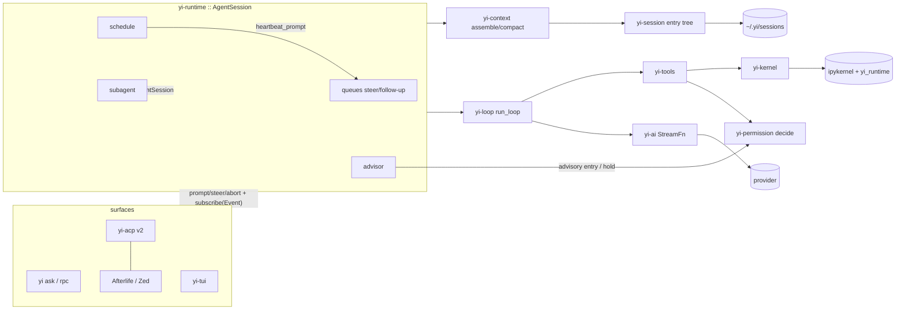

# Yi — Architecture Map

```
version: 0.24.2         # bump on any structural change; log it below
design:  YI_DESIGN.md   # the deep design; § refs below point into it
status:  phase 4 done   # yi-kernel (Jupyter client over pure-Rust zeromq) + uv venv bootstrap + verbatim rlm Python runtime (mcp.py rewritten over `yi mcp --json`) + ipython tool + runtime::subagent (rlm.run depth 1). Exit gate green: recursion scenarios incl. a live-kernel round trip. 4b done. Phase 5 done: runtime::schedule + runtime::advisor. Phase 5b done: yi-acp v2 server (hand-rolled wire, D40). Phase 6 done: yi-runtime::goal (G1-G6) + `yi serve` daemon (D4 supervisor + worker-per-root; exit gate green: a heartbeat dispatches while no client is attached and a reconnected client lists and resumes the session). Phase 7 done: `yi-tui` (D41 design — codex/atuin inline skeleton, opencode subagent UX, OMP HUD/status) in the default build; `yi [prompt]` opens the TUI on a TTY (X1). Phase 8 (D42): nothing is deferred any more — every deferred, stretch, and never-built row is open work in docs/TODOS.md (ids A1-M5), worked in that order. U13 stable-prefix streaming landed in 7; U18, dynamic viewport height, and the gitignore-aware @-walk are A3, A2, A4. TODOS section B (CLI surfaces) is closed at 0.19.0, which also lands the T14 capture/restore half of C1.
```

## Changelog

| ver | date | change |
|---|---|---|
| 0.24.2 | 2026-08-27 | `/new` starts a fresh chat from inside the TUI: a new store from the same `JsonlRepo` the CLI uses, adopted by the running session with the `reset()` + `attach_store` pair `cli::rpc`'s `new_session` already used, over the screen-and-scrollback reset a rewind performs. It refuses while a turn is running rather than stranding that turn's messages in a file the session no longer writes to. |
| 0.24.1 | 2026-08-27 | List markers stopped being written into the line buffer. A list whose items are separated by blank lines is *loose*, and CommonMark wraps each loose item's content in a paragraph — so the paragraph handler's blank flushed the marker on its own, one blank line above its own text (`1.` / `` / `read — ...`). The marker is now held pending and claimed by whichever line opens the item, which also makes looseness render as the author wrote it: loose lists keep their blank line between items, tight ones stay dense. The hanging indent follows from the markers actually on the line instead of a fixed two spaces, so `10. ` and every nested glyph wrap under their own text rather than two columns short. |
| 0.24.0 | 2026-08-25 | Transcript legibility pass and D44 (both user-directed). The bullet gutter marks the message, not every paragraph: streaming retains one slice per stable blank line, and each slice re-rendered on its own took a fresh bullet, so a resize repaint grew one per paragraph where the live paint had one — `History::retain` merges consecutive assistant slices back into the message. A callout keeps its rail and drops the bullet beside it; the advisor's note takes that rail plus blank air instead of a dim aside. The live region shows half the screen rather than six rows — a markdown table has no blank line inside it, so nothing commits until the message ends and a fixed tail cut the table's header off mid-stream. `bash` stops reporting every command as irreversible: read-only verbs (and the reporting half of `git`) are screened per `&&`/`|`/`;` segment, so the advisor's flag means something again. The status bar drops the `yi` segment and the mark shrinks from 8×4 to 6×3 cells. |
| 0.23.0 | 2026-08-25 | Rewind became visible (user-directed). Selecting a user message in the tree now rewinds to its *parent* and hands the message back to the composer unsent, as OMP's `navigateTree` does; the screen and its scrollback are cleared and the branch is replayed, so the undone turns leave the transcript instead of sitting above a rewound context. `replay_session` reads the active branch rather than every entry in the file — the whole-tree read is what left the abandoned turns on screen. The tree itself is rebuilt in OMP's `TreeSelectorComponent` layout (titled panel, help row, `Search:`, divider, `cursor + gutter + ● + role: text` rows, centered window with a scrollbar, filter label) in Yi's own colors, with Alt+↑/↓, PgUp/PgDn and Home/End. `scripts/tui_pty.py` gains `--send` and `--raw` so a real-terminal run can be driven and its escapes counted. |
| 0.22.0 | 2026-08-25 | TODOS C2 and C4. `yi-tools::reduce` is T17/T18/T19/T20 with hand-written filters: cargo keeps its diagnostics on a red run, grep is capped, everything else gets ANSI stripping, repeat collapse and head/tail — below a 2 KiB floor nothing is touched, and a lossy result is tee'd under `~/.yi/tool-output` (no tee ⇒ raw). The rtk TOML corpus stays unwired: it needs a regex dependency, which is a §13.3 decision, not a refactor. `yi-tools::jobs` gives `bash` the D13 background half — off unless `bash.autoBackgroundMs` is set, polled through the same tool with no command, and finished jobs reach the model through the R3 follow-up queue. |
| 0.21.0 | 2026-08-25 | TODOS C3, C5 and C6. C3: `yi-runtime::skills` assembles the catalog (name, description, path) from the global and project roots, project shadowing global, fitted to the P16 `skills_meta` budget and appended to the system prompt; the model opens a skill with `read`. The bundled set installs into the global root (`just install-skills`) rather than into the binary. L13 lands as `yi-loop::repair`: a tool call naming `functions.Echo_tool` runs `echo` instead of failing, while an ambiguous or genuinely unknown name still fails with the model's own spelling. §12 model roles arrive as `yi-types::config::ModelRoles` — `"models": {primary, summarizer}` in `~/.yi/config.json`, the summarizer used for compaction's summary call only, since the window math must stay on the turn's model. |
| 0.20.0 | 2026-08-25 | TODOS C1 and C7 closed. `yi-tools::diff` is T13: a unified patch with absolute paths, verified by `git apply` reproducing the post state, and the approval prompt for `write` now shows what the overwrite changes instead of only its path. T14 completes with a turn-end capture beside the turn-start one, `Checkpoints::diff(a, b)`, and `yi undo list`; undo deliberately skips the turn-end capture it is standing in, so undo/redo still toggles. |
| 0.19.1 | 2026-08-25 | Quitting the TUI prints the command that brings the session back (`yi --session <id>`, OMP's parting hint), and the TUI now honours `--session` / `--continue`: a resumed session replays its stored entries so the screen and the model's context agree. A hint is only printed for a session that recorded something. |
| 0.19.0 | 2026-08-25 | TODOS B closed: `yi sessions list|show|rm`, `yi undo`, `--continue`, `--session`, `--schema`, and static `completions/yi.{bash,zsh,fish}` (X10). `yi ask` now records every turn to a session file — without that `--continue` has no leaf to resume. B2 needed checkpoints, so the T14 core lands with it: `yi-tools::checkpoint` (shadow gitdir, capture/restore) and a turn-start capture hook on `AgentSession` that writes a `custom{checkpoint}` entry; undo records the state it replaced, which is what makes it undoable. `--schema` answers are validated against a JSON Schema subset and exit 3 on a mismatch — never prose on stdout. |
| 0.18.0 | 2026-08-24 | D43: `yi-tui` ceiling 5,000 → 10,000 lines. |
| 0.17.3 | 2026-08-24 | Docs pass: README rewritten as a self-contained statement of what Yi is and why (no reference-codebase names — those belong in the design doc, not the front door). `.ruler` gains the two rules this session paid for (prove a regression test red before claiming the fix; a capability path is only exercised when the capability is advertised) and the ref/ category note. `yi-tui` budget row corrected to D41's 5,000 and its overage tracked as A10. |
| 0.17.2 | 2026-08-24 | U34 morph fixed: a settled mark stops the frame timer, and the idle gap was being turned into progress, so the first animating frame consumed the whole morph and the wordmark snapped to the orb. Step is clamped to one frame (`logo::advance`). The mark now leads the live region with the streaming answer under it, so it holds one position while text grows. |
| 0.17.1 | 2026-08-24 | U34 revised (user-directed): one orb, not two — the `Yi` wordmark and the thinking orb are the same dot cloud morphing between them, exponential ease-in, settled at rest with no repaint. The scrollback session header is dropped with it. `scripts/tui_pty.py --term` added: the harness hardcoded `xterm-256color`, so no kitty-graphics path had ever been exercised under a PTY. |
| 0.17.0 | 2026-08-24 | TUI visual language (user-directed, reference-first): role delineation (opencode `┃` bar + codex/OMP tint + codex `• ` gutter), codex heading ladder, OMP bullets, visible link destinations, `│` code rail, OMP boxed tables, OSC 133 prompt zones, U34 session mark (a frozen U33 orb frame). Fixes: wrapped paragraphs no longer indent (the wrapper strips a line-leading indent, so only continuations showed it), nested bullets keep their indent, composer placeholder removed. `yi-tui::render` split out of `app`. |
| 0.16.2 | 2026-08-24 | Resize, second pass: the cursor-delta heuristic fixed growing but not shrinking, so codex's real path is ported instead — `update_inline_viewport_for_resize_reflow` (no scroll when the terminal itself shrank, clear from `min(prev, new)`), `invalidate_viewport`, and rebuilding the rows above the viewport from transcript source (`yi-tui::history`, 256-cell ring). |
| 0.16.1 | 2026-08-24 | Resize fix: a terminal reflows its screen on resize, so the viewport anchor went stale and each resize step left its composer box behind. Ported codex's cursor-delta re-anchor (`tui.rs:1156-1175`) with the cursor tracking it needs; `scripts/tui_pty.py` grew `--resize`. |
| 0.16.0 | 2026-08-24 | TODOS A1: `yi-tui::terminal` — codex's mutable-viewport `Terminal` ported (A.10 fallback taken; ratatui's `Viewport::Inline` height is fixed at construction). The inline viewport now sizes itself to the live region every draw and stays bottom-anchored. |
| 0.15.1 | 2026-08-24 | TODOS A3, A4: U18 external editor (Ctrl+G / `/editor`) wired; the file walk behind `glob`, `grep`, and the TUI `@` popup is gitignore-aware, one implementation in yi-tools surfaced through yi-runtime. |
| 0.15.0 | 2026-08-24 | D42: every deferred/stretch/pattern row undeferred; open work enumerated in docs/TODOS.md and the feature ledger flipped to `open (<id>)`. Phase gates end at 7; TODOS.md is the queue. |
| 0.14.3 | 2026-08-24 | Session retrospective hardening. Working/default orb evaluates the ribbon preset (orbits-64 reads as noise at cell-rect scale). New `.ruler/085-tui.md`: TUI verification (drive mode mandatory for TUI behavior changes, nonzero-offset vt100 cases, protocol lifecycle semantics as incident comments, `scripts/tui_pty.py` for the true-terminal path), reference-first UX (donor refs are the default, a smaller fresh implementation is a deviation to confirm), the visual-approach gate (medium/aesthetic decisions get a mock + sign-off before code), and byte-cursor streaming commits. New skill `yi-tui-verify` (drive-mode workflow + PTY harness); `yi-port` gains the banned-dep adaptation and reference-golden-fixture precedents. The CPR-answering PTY harness is promoted from session scratch to `scripts/tui_pty.py`. U13 row rewritten to the shipped slice-commit contract. |
| 0.14.2 | 2026-08-24 | Orb + markdown fixes from live review. Kitty orbs: placements scroll with the text under them, so every placement of the image id is deleted before each re-place (plus a fixed placement id) — no more stamp trails up the transcript; emission decouples from the draw scheduler and runs at ~30 fps on its own loop cadence while an orb is live. Streaming: the stable-prefix committer now renders each newly stable slice standalone against a byte cursor — re-rendering the whole prefix let the renderer's trailing-blank trimming misalign the committed-line count, duplicating list items mid-stream. Tables: the codex table pipeline adopted outright on user direction (A.10 pass-3, port adapted): styled-span cells (inline code/bold inside cells survives by construction — the previous string-capture dropped `code` cells into a concatenated leak), spillover-row filtering, column metrics with Narrative/TokenHeavy/Compact kinds, priority shrinking with binary-searched balancing, aligned grid rendering with in-cell wrapping and ━/─ separators, and the key/value record fallback at codex's exact fragmentation/starvation thresholds. |
| 0.14.1 | 2026-08-24 | User-directed TUI corrections. Orbs render via the **kitty graphics protocol only** (U33 revised): the reference canvas painter ported to RGBA (mirrored ink, feathered discs, alpha depth, transparent ground so Ghostty's blur shows through), chunked base64 APC frames under one stable image id, placed in an 8×4-cell rect at the working line beside the verb label, deleted at turn end; detection is TERM kitty/ghostty or KITTY_WINDOW_ID. The braille rasterizer is **deleted** — binary dots with one color per cell cannot carry the radius+ink depth language, and at readable density it saturates (516 dots onto 576 grid points); non-kitty terminals get the pre-orb spinner line back, nothing in between. Status line condensed: the transcript banner is gone (the `yi` wordmark in the status row is the branding), the context gauge bar is gone in favor of a compact `N% of 1M` segment (windows ≥ 1M collapse to M units), paths left-truncate at 24 cells, session ids display 8 chars. |
| 0.14.0 | 2026-08-24 | Thinking orbs (U33, A.13): the thinking-orbs engine ported verbatim to `yi-tui::orb` — 9 deterministic mode painters over shared projection/lattice/noise/z-sort primitives, with the resolved (state × size) tunings baked from the library's own spec so no scaling machinery can drift. **Geometry-exact: all 72 golden vectors (11,288 dots) pass at the reference's own 1e-4 tolerance**, compared after a tolerance-quantized canonical sort (coincident-z ring dots order by last-ulp float noise that legitimately differs between engines). Braille rasterizer (2×4 dots per cell, ink mirrored for dark themes, quantized to the theme's dim/muted/text tiers, brightest dot picks the cell fg; web edges Bresenham first, nodes on top). In the TUI: the `20` preset renders inline in the working line (3×2 cells) with the verb label replacing "Working…", and the `64` preset (12×6 cells) crowns the HUD while a turn runs; activity maps to the reference verbs — searching/solving by tool class, connecting on live children, composing while prose streams, listening at the approval view. Zero new deps; the golden json is a committed fixture (blob allowlist). |
| 0.13.1 | 2026-08-24 | Identity prompt: every session leads with `yi_runtime::identity_fragment()` (`prompts/identity.md`) — Yi (易) by Jack Maxwil, github.com/jackmaxwil/yi, capabilities summary (file tools + bash, persistent Jupyter kernel, `rlm` subagents). Operating doctrine is deliberately deferred to a later fragment. |
| 0.13.0 | 2026-08-24 | TUI polish pass 2 (user-directed, D41): **U13 streaming commits land** — mid-turn markdown commits progressively to scrollback at blank-line boundaries outside code fences (`markdown::stable_cut`; prefix renders are deterministic so committed lines never change), only the unstable tail repaints in the live region — this fixes long responses hiding behind pre-Yi scrollback mid-generation. **Tables** render as minimal fixed-layout grids (content-derived column widths capped at 32, bold header, dim rules, cells truncate — supersedes the "no table layout engine at launch" bullet on user direction; codex ships none, opencode gets OpenTUI's free). **Transcript modes** normal|thinking|verbose on Ctrl+O (U32): normal collapses thought to `∴ thinking · N lines` and tools to one line; thinking shows reasoning bodies; verbose adds tool result previews; `/expand` still prints the last tool verbose. Tool summaries preview grep/glob patterns, ipython first line, fetch urls. Advisories strip their `<advisory>` markup and render `⚑ source` + dim italic text. Thin dim dividers between user turns; 2-col right margin + 1-col composer inset; status paths left-truncate (tail is the signal); session id shows 8 chars; the status row carries a persistent bold-accent `yi` wordmark; the terminal title follows session focus via OSC 2 (`Yi — <latest user prompt>`, headless no-op). app.rs sheds input handling to `input.rs` for the file-size budget. |
| 0.12.2 | 2026-08-24 | TUI visual identity (D41 polish, user-directed): truecolor-dark theme is TokyoNight Moon (accent #82aaff, muted #828bb8, dim #636da6, error/warning/success from the palette; session accents blue/magenta/teal/yellow/green/orange; text stays `Reset` so the terminal fg wins); composer border muted instead of accent cyan; status row moves below the composer (OMP bottom-bar shape), working line sits above it; a one-line brand banner (`yi <version> · 易 · <model>`) commits at session start. Reasoning/prose split: thought cells carry a dim-italic `∴ thinking` label + body while assistant prose stays bright terminal fg; reasoning-heavy models stream their thought tail dim in the live region so the screen is never blank before prose arrives. |
| 0.12.1 | 2026-08-24 | TUI drive mode (U19/X1): `yi tui --headless --keys <file> --frames <dir>` runs the real UI loop — same App, reduce, and draw path — over ratatui's in-memory `TestBackend` (wrapped with a no-op `Write` so the synchronized-update commit path is unchanged), with scripted keys in the keymap grammar (`key ctrl-t`, `type …`, `wait <ms>`, `wait-idle <ms>`, `quit`) replacing the keyboard and every changed frame dumped as plain text. Deterministic rendered-UI testing without a PTY; 60 s wall cap, `wait-idle` timeout exits 1. The runtime bridge (forwarders + command driver thread) is extracted from `run_tui` and shared. Also this session: the inline-viewport draw-offset fix (rects must anchor at `area.y`; found by a CPR-answering PTY harness driving the real binary — the in-process vt100 tests started the viewport at row 0 where the offset is invisible) with a pre-scrolled regression test, and the composer's codex/OMP frame (rounded border, accent idle / dim running, placeholder hints). e2e: spawned `yi tui --headless` renders a faux turn + steered second prompt into dumped frames. Zero new deps. |
| 0.12.0 | 2026-08-24 | Phase 7: `yi-tui` lands (D41). Pure core: U8/U9 keymap (atuin shape, media keys and super dropped), U6 frame scheduler (dirty flag + OMP adaptive floor + 60 fps ceiling), U14 hand-rolled span wrap (unicode-width aware, `://` tokens never split — codex's guard needs the banned textwrap/url crates), U13 markdown via pulldown-cmark (+ `commit_complete_source` newline gate, wired to streaming in a later pass), U17 color tiers + OMP name-hash session accents, U5/U15/U27 cell vocabulary (tool rows with intent narration + Ctrl+O preview expansion, opencode two-line task cell with live `↳`), U28 pinned HUD (tree-spine progress, queued-messages block, settle-clear, Ctrl+T toggle), U16 status row (context gauge with threshold tick + collision-avoiding labels, OMP truncation cascade with protected path, focused-child dim + 👻), U31 session tree selector (double-Esc, connectors/gutters, filter modes, Enter = `move_lane` rewind + `attach_store` re-projection), U10 composer (tui-textarea + omp paste atoms verbatim semantics + history), U11 `/`+`@` popups, U12 approval view answering the TUI Asker over std mpsc. Shell: U1 guard (kitty DISAMBIGUATE+REPORT_ALTERNATE_KEYS, panic hook restores first), U2 inline viewport (fixed 16 rows v1), U3 `insert_before` commits in synchronized-update brackets, U7 drain-then-draw synchronous UI thread — runtime on its own thread, commands over an unbounded channel, events over std mpsc forwarders; per-child forwarders feed U27 counters and U29 focus (rule into scrollback, store replay, live child cells, read-only). Runtime: `SubagentHost::children_view()` exposes child handles (TUI event taps). CLI: X1 dispatch (`yi [prompt]` → TUI on TTY, ask otherwise; `yi tui` explicit), `keys` config overrides, JsonlRepo store attach. Tests 19: pure-module units + faux-session e2e (turn renders user+assistant cells), VT100Backend (codex, adapted — ratatui 0.29 hides `writer`) proving `insert_before` on a real VT parser, and the gate e2e: real SubagentHost spawn → task cell with toolcall counter → focus rule + back. Dist 5.32 MiB (+0.87, inside the ≤ 1 MiB budget), startup 3.27 ms, deps 19/165. Deferred: U18 external editor, stable-prefix streaming commit, dynamic viewport height, gitignore-aware @-walk. |
| 0.11.0 | 2026-08-24 | TUI design relitigated (D41) after a study of opencode `packages/tui` (A.8 excise amended) and OMP's HUD/status surfaces. §8.14 revised: codex/atuin/mdfried remain the mechanical skeleton (inline viewport, native scrollback, sync UI thread); opencode supplies the subagent UX — U27 two-line task cell with a live `↳` line fed by the child session's event stream, U29 focus navigation (inline adaptation of opencode's route swap: rule into scrollback, replayed badged child cells, nav footer replacing the composer, read-only, child permissions bubble to parent); OMP supplies U28 pinned HUD (rebuilt in place in the live region, tree-spine progress meter, queued-messages block, data = U20 `cards()` pulled forward as a pure view — U21 board view stays deferred per D5) and the revised U16 status line (composer top border, context gauge in the group gap, named truncation cascade, session-accent identity, subagent badge, intent-narrating spinner). Line budget 4k → 5k incl. tests; ≤ 1 MiB unchanged; no new deps beyond the §13.4 `tui` row. U31 added mid-phase on user direction: OMP's double-Esc session tree — an overlay of the session's Pi-format entry tree (connectors, fuzzy search, filter modes); selecting an entry rewinds by `move_lane`-ing the leaf there and reprinting the transcript (the tree is already the store's shape; nothing new persisted). A persisted todo/plan tool is planned for a later phase; its HUD rows land with it (D26's advisory-only ban stands — the planned tool will persist a session-store fact like `Fact::Goal`). |
| 0.10.0 | 2026-08-24 | Phase 6: goals + `yi serve` daemon. Goals (§8.17, D25 — codex ext/goal as reference): yi-types gains Goal/GoalStatus (wire enum with Other) and `Fact::Goal` — the goal is a session-store fact beside the header, never a transcript entry, so compaction cannot lose it by construction; SessionStore gains set_goal/goal. G4: strict `{{name}}` template engine port adapted from codex utils/template (unused supplied value = ExtraValue error; `{{{{`/`}}}}` escapes) + the three prompts ported adapted (`<untrusted_objective>` tags, anti-shrinkage, evidence primacy, completion audit, blocked-×3 audit; update_plan paragraph excised per D26; tool surface renamed goal.update). G2 authority split verbatim: goal.get/goal.create (fails while unfinished)/goal.update accepting only complete\|blocked — host owns pause/resume/limits; registered as kernel host requests, mirrored as the rpc `goal` command and the ACP `_yi/goal` method; bundled python skill `goal` (venv identity hash moves, rebuild on next boot). G3: continuation on idle via a new AgentSession::wake_idle_hook (AgentEnd is emitted while the status is still Running, so a status-gated hook would strand the prompt in a follow-up queue — the hook waits out the turn then starts one); abort defers continuation until the next user input; a turn that ends in StopReason::Error blocks the goal so continuation cannot loop against a failing provider (codex on_turn_error). G5: per-response accounting (uncached input + output), wall-clock accumulation, one-shot budget crossing Active→BudgetLimited delivering the budget_limit prompt. G6: custom{goal_prompt} rides L4 as source="goal", dropped at compaction, and flows to ACP as `_yi/goal_prompt` via the C9 bridge. Daemon (D4): yi-acp::daemon — supervisor routes ACP v2 between unix-socket clients (0600) and one `yi acp` worker process per root over stdio, ACP both hops, one serialized supervisor task (request-id rewrite map, sessionId→root routing learned from session/new\|resume responses, permission-bridge requests routed back by id); workers outlive client connections — notifications with no attached client drop, schedulers keep firing; worker exit errors its pending requests. `yi serve` arm + `--socket` flag (default ~/.yi/daemon.sock); `_yi/heartbeat` ACP method (H10 surface). Deferred still: H7 per-session lanes and B8 rlm-ledger — worker-per-root keeps one writer per root, so the directory registry and per-session serial queue still hold. e2e: goal continuation loop drives a faux session past idle until a failing turn blocks it; budget one-shot; template ExtraValue; rpc goal round trip; daemon gate test above. Zero new external deps (15/132; thiserror was already workspace-declared). |
| 0.9.7 | 2026-08-24 | Phase 5b: yi-acp v2 server. D40: `agent-client-protocol` rejected at the dep gate — measured 2.0.0 at +55 workspace transitive (cap 135) with schemars non-optional, a second async stack (async-io/async-process/blocking) beside tokio, and v2 still behind `unstable_protocol_v2`; Yi hand-rolls the v2 wire subset it emits (design §13.3 row flipped). yi-types::acp: JSON-RPC frames (AcpFrame/AcpResponse/AcpErrorResponse) + the session/update vocabulary (agent_message_chunk, agent_thought_chunk, agent_message/user_message full updates for replay, state_update running/idle{stopReason}/requires_action, tool_call_update + tool_call_content_chunk, terminal_update/terminal_output_chunk, usage_update) + AcpExtensionUpdate carrying `_yi/*` kinds with unknown fields re-emitted verbatim (C9, §19). yi-acp: C1 negotiate (≥2 → v2; v1 → exact "Unsupported protocol version: this agent speaks ACP v2 or later"); C3 to_updates — pure, exhaustive over AgentEvent so a new event variant fails compile; C7 terminal half (bash results → terminal_output_chunk base64 + terminal_update exit status + terminal-ref tool content; diff half waits on T13); C9 generic bridge: Custom{custom_type} → `_yi/<custom_type>` (advisory and heartbeat_prompt flow today; `_yi/heartbeat_changed` arrives with a schedule-change hook later); C2 SessionRegistry over JsonlRepo (new/list/resume/close/delete; per-session forwarder task owns its IdMap); C5 permission bridge — the sync Asker seam writes session/request_permission synchronously then blocks on a std channel that the stdin reader thread (not the executor) answers, so the current-thread runtime cannot deadlock; C6 resume{replayFrom} walks stored entries into full-message updates after the response; C8 config options model + thought_level (mode/_yi/advisor/_yi/max_depth error as unsupported until their seams are mutable). yi-cli: `yi acp` arm; build_session takes Option<Asker> (tty ask, rpc none, acp bridge). e2e: scripted v2 client over the spawned binary — full turn streams chunks and state frames, v1 mismatch string pinned, resume replays the stored branch; bridge unit-tested via injectable sink. Zero new deps (15/132 unchanged). |
| 0.9.6 | 2026-08-24 | Phase 5, second half: runtime::advisor (V1-V13). yi-types gains Advice/AdviceKind/AdvisorySeverity/AdvisoryOutcome. Six launch signals (V1, pure, stateful over the message stream): tool_failure_streak (=3), repeat_tool (identical tool+canonical args ×3, no_op_edit_repeat as the edit flavor), pre_irreversible (probes the real tool table's irreversible()), verification_skip (edits + final answer, no test/build command in the turn), unbacked_claim (§7.4 verb table vs the turn tool log — high recall, a trigger not a verdict). V2 trigger (any signal ∨ explicit cadence, budget-gated) + V3 hourly ring-buffer budget. V4 digest: user verbatim with constraint-first truncation (elided spans keep the entry id as the pull handle), assistant sentence-selection by the verb table, tool+result lines, all entry-id'd; V12 directives panel (verbatim constraint sentences, append-only). V5: Reviewer seam — RuleReviewer (canned advice, zero tokens) inline; LlmReviewer (own AgentSession, fixed system prompt + ADVISOR.md, tools {advise, transcript}, one prompt per review, spend recorded to the budget) runs signal-gated in a spawned task when advisor.reviewer is enabled (off by default, D28). V7 EmissionGuard adapted from omp (#3520 incident: noise blocklist, FIFO-4096 dedupe, one note per cycle; NFKC dropped for lack of a normalizer — row updated). V8 delivery: custom{advisory} rendering the omp-verbatim <advisory severity target guidance="weigh, don't blindly obey"> block — running session → steer (next boundary), idle → follow-up queue, never waking an idle primary; Hold → PermissionBroker.insert_hold (M5 gains expires_at_ms TTL + mutable holds + can_ask), degrading to Warn headless (D28). V9 outcome ledger: custom{advisory_outcome} after a 5-action window, target-touched tracked; /advisor stats renders the counters. V10 ADVISOR.md read from cwd. V13 transcript pull tool over the advisor's retained log (never thinking, never cross-session). V11 promote deferred until advice ids surface interactively. attach_runtime wires signals-on/reviewer-off by default; rpc gains heartbeat + advisor_stats commands. e2e: guard dedupe/noise/rate-limit, per-signal fixtures, constraint-first truncation, a real failure streak landing <advisory> in the next faux turn, headless Hold→Warn, LlmReviewer advising through the advise tool, rpc surface round trip through the spawned binary. |
| 0.9.5 | 2026-08-24 | Phase 5, first half: runtime::schedule (heartbeats). yi-types gains the schedule shapes (JobStatus/JobSource/DeliveryMode/ScheduleKind, CronSchedule, Job, DispatchRecord, ScheduleState — Yi-owned `scheduled-jobs.json` format, epoch-ms timestamps, flatten extra). H1 parse verbatim from prime (`in 5m`/`every 10m`/`at ISO`/@aliases/5-field cron incl. exact error strings; cron evaluated in UTC — std has no tzdata and chrono is banned, divergence noted in the H1 row; hand-rolled minimal ISO-8601 UTC parse; Hinnant civil math shared from yi-kernel to keep the duplication budget at zero). H3 next_run; H4 JobStore (tmp+fsync+rename, corrupt file degrades to empty, on_change notify); H5 claim-before-deliver verbatim (already-claimed due jobs skip, schedules advance at claim); H6 recover-on-start with prime's exact "Interrupted before scheduled operation completion" marker; H8 defer table verbatim (steer delivers through plain streaming, follow_up waits; compacting/retrying/bash/pending always defer); H9 delivery as custom{heartbeat_prompt} rendering <heartbeat job run>prompt</heartbeat>, L4-wrapped as yi_internal_context source="heartbeat" and dropped at compaction; Steer→steer queue, FollowUp→follow-up queue, idle sessions started via a new AgentSession::run_handle/prompt_message seam. Scheduler = one timer task armed to next_active_run_at, re-armed on store change; one session ⇒ one serial queue (H7 lanes = phase 6). H10 surfaces: /heartbeat grammar (set/status/pause/resume/clear, --every/--steer/--follow-up) + rlm_heartbeat.{list,create,update,delete} host requests registered in attach_runtime; scheduler lifecycle owned by the session (drop stops the timer). CLI: the tokio runtime now exists before build_session (the scheduler timer spawns at wiring time); run_rpc takes the runtime instead of building its own. e2e: a due heartbeat wakes an idle faux session with the framed prompt and re-arms the job; orphaned claims recover as interrupted from the reopened file; surface round trip. |
| 0.9.4 | 2026-08-24 | K10 completed: compaction-prune machinery. Snapshot template regains prime's prune branch (oversized variables identified against the per-variable cap, purged from the live namespace and the `Out` cache after the manifest is written; purge loop finishes through KeyboardInterrupt; `pruned` in the marker line and manifest) plus `build_list_names_code` (snapshot-filtered listing). KernelManager: `prune_oversized_variables()` (bounded capture with prune) and `list_namespace_names()` (5 s bound, `KERNEL_STATE_LISTING_TIMEOUT_MS`). KernelService::sync_after_compaction — a peek, never a boot — prunes, lists, and returns the `<ipython_state>` notice (prime `_syncKernelStateAfterCompaction`, adapted; notice text verbatim-shaped). AgentSession gains `set_on_compacted`; both maybe_compact sites (loop closure + compact_now) fire it on an applied compaction; attach_runtime wires the hook to spawn the sync and push the notice into the B6 steer channel. KernelSnapshotResult gains `pruned` (additive). e2e: over-cap variable pruned and NameError-dead while under-cap survives, listing filters In/Out, service sync with no kernel returns None, hook fires on compact_now. |
| 0.9.3 | 2026-08-24 | Phase 4b: K10 dill snapshot/restore. crates/kernel/src/snapshot.rs generates the kernel-side Python (per-variable dill with the always-skip set {rlm, mcp, asyncio, In, Out, …}; unpicklable variables skipped with a reason, never fatal; 16 MiB/variable and 256 MiB aggregate caps; atomic tmp+os.replace write plus a JSON manifest; builtins hardened via the _b alias) and parses the single marker-prefixed stdout result line (marker lowercase `__yi_kernel_state__` so the env-surface scan ignores it). KernelManager gains KernelSnapshotConfig, a 1.5 s debounced snapshot after every ok non-internal cell (debounced captures auto-abort after 5 s), snapshot_state()/restore_state() (best-effort, Option returns, diagnostics into the stderr tail), and a dispose-time flush bounded by 5 s before teardown. Bootstrap installs dill and `.bootstrap-version` records snapshot:"dill" (field check, no schema bump — pre-dill venvs rebuild once). KernelService: sessions with a session_dir snapshot into <dir>/kernel-state.dill; restore runs after start and before the bootstrap cell so live handles overwrite revived names; the `<ipython_state_restored>` notice fires only after a successful bootstrap and is wired to the B6 steering channel in attach_runtime. Old-flush vs new-restore is serialized by construction: busy recovery awaits kill() (which flushes) before ensure(). New wire shapes: KernelSnapshotResult/KernelRestoreResult/KernelSnapshotSkip + BootstrapVersion.snapshot (additive Option). e2e: namespace revives across two real kernels, generator skipped not fatal, In/Out never saved, missing file ⇒ empty restore; service-level test proves dispose-flush → revive → notice. 173 tests. |
| 0.9.2 | 2026-08-24 | Bundled Python skills land (first two): `compact` and `attach-image` copied from prime into python/skills/ (Yi-owned per D39, docstrings re-identified; attach-image drops the unpublishable runtime dep, keeps pillow). K1 bootstrap installs them after the runtime (declared order, per-skill failure degrades to the unavailable wrapper, never fails the venv); `.bootstrap-version` gains the skills list and the identity hash now covers python/skills/** so any skill edit rebuilds the venv. Bootstrap cell gains the skill-module wrapper (callable modules, unavailable placeholders, import-error registry). Host side: `compact.run` accepts summary-focus `instructions` (Compactor::schedule_with_instructions feeds build_summarization_prompt), `compact.status` returns real usage {tokens, context_window, percent, scheduled} via a session status handle, `model.info` gains `input` so attach_image's vision check works. e2e: real kernel boots the rebuilt venv, compact.status/run round-trip and set the host compactor pending, attach_image emits a display_data attachment that lands in ExecuteResult.attachments. |
| 0.9.1 | 2026-08-24 | D39: ports are one-time copies — corrected the ownership premise that had crept into rules and docs. Yi owns everything under crates/ and python/; verbatim porting was the initial de-risk tactic, never a parity obligation; ref/ stays study material with no upstream tracking. Rewrote .ruler/020/070/100, design §1/§3/§6/§13.3/Appendix A preamble, and the yi_runtime docstrings accordingly. Pi v4 session-file byte-compatibility stands as the one deliberate interop contract (format, not code). |
| 0.9.0 | 2026-08-24 | Phase 4 landed. yi-kernel: K1 uv venv bootstrap (`.bootstrap-version` mismatch ⇒ rebuild, mkdir+pid lock with stale-break, RUNTIME_READY_CHECK verbatim, XDG fallback, YI_KERNEL_PYTHON/VENV overrides, uv required or YI_INSTALL_UV=1); K2 connection file (0600 in 0700 mkdtemp, 25 ms port poll); K3 `<IDS|MSG>` HMAC framing (hmac+sha2, python-hashlib golden fixture); K4 channel order verbatim (control pump → 50 ms slow-joiner → iopub pump → kernel_info handshake; shell drained in a background task); K5 execute queue (tokio Mutex FIFO + active-execution re-entrancy guard); K6 pure iopub reducer (65,536-char caps with truncation markers, display MIME routing, >10 MiB attachment fails the cell, on_stream uncapped); K7 host.request comms dispatched before the parent filter, reply on control, comm-id dedupe, LRU-256 late agent-message handlers, last_cell_code attribution, reserved `status` envelope, unregistered type errors prime's way; K8 lifecycle (abort = interrupt + 1 s grace force-Aborted without clearing active; busy-reuse re-interrupt 500 ms ≤ 5 s then KernelBusyAfterInterruptError; generation counter beats stale starts; JPY_PARENT_PID reaping; orphan pid journal env-gated via YI_ORPHAN_JOURNAL, inactive only on confirmed kill; 1 KiB stderr tails on failures); K9 boot gate min(16, max(4, cpus×2)) wrapping start only; K11 RLM_* env verbatim + YI_BIN for the kernel-side mcp wrapper. python/yi_runtime: rlm/__init__.py, harness.py, skill.py byte-verbatim from prime-agent-runtime; mcp.py+mcp_base.py rewritten as a subprocess wrapper over `yi mcp --json` (no SDK, no sockets in the kernel; McpIntegration binds server tools as async methods); RUNTIME_READY_CHECK passes against the shipped package (pinned by test). yi-tools: `ipython{code}` tool (kind Exec, sequential) over a KernelBridge capability seam. yi-runtime: KernelService provisioner (lazy boot, memo, retry-after-failure, headless busy recovery = kill + fresh kernel + restart notice), HostRegistry (mcp.config → {}, mcp.refresh throws, mcp.begin_login absent, compact.run schedules only, compact.status, model.info, rlm.find_models), bootstrap cell adapted (yi paths in the missing-runtime message), subagent module (B1 spec with unknown-kwarg rejection, B2 admit: depth<max default 1 + unique names + 8-slot cap where completed children hold slots until reaped, B3 sub-<8hex> dirs, B5 detached spawn returning at admission with `[task from parent]` prompt, B9 usage attribution onto the parent's last assistant + child_usage_attributed store record, B6 role split: terminal notices arrive as user-role steering), attach_runtime wiring children recursively at depth+1. K12 contract fixtures deferred to the vocabulary's next growth; B7 `_yi/subagent_update` events, B13 mailbox, agent_message.*, fork seeding, and 4b dill snapshot stay on the deferred ledger. New deps: zeromq (pure Rust), hmac; transitive 111 → 132 (budget 135, D38); dist 4.45 MiB (+0.49); startup 3.8 ms; 168 tests. |
| 0.8.1 | 2026-08-24 | D37 landed (2c batch 2) — streamable-HTTP transport (ureq-based rmcp client impl, hand-rolled SSE parser, sse-stream as a type-only direct dep) and OAuth login/logout (PKCE S256, /dev/urandom entropy, keychain-or-file token store split from profile metadata, issuer binding + refresh lockfile per codex lessons, no auto-login). |
| 0.8.0 | 2026-08-24 | Phase 2c landed: yi-mcp-cli in every build behind the `mcp.enabled` config gate (D36). Command grammar per mcpc: connect <server> [@s] (config-entry / file:entry / file resolution), close/restart @s, grep over cached connect-time snapshots (progressive discovery, exit 1 on no match), @s tools-list/tools-get (--schema strict|compatible snapshots)/tools-call (k:=v httpie pairs, inline JSON, stdin)/resources-list/prompts-list/ping; --json MCP-spec output, --max-chars truncation; SKILL.md adapted from mcpc as the only model-facing surface, printed by `help --skill`. One-shot execution: per-command current-thread runtime, rmcp client over TokioChildProcess, no resident process. Sessions in ~/.yi/mcp/sessions.json (wire shapes in yi-types), states live/connecting/disconnected/unauthorized/expired, never auto-removed. Streamable-HTTP via ureq transport is the next 2c batch; stdio covers the exit gate (5 e2e tests vs a python fixture server). deny: chrono wrapper-scoped to rmcp, graph limited to shipping targets, dev-deps excluded. Cost: +0.94 MiB dist (3.85 MiB), +1.8 ms startup (3.9 ms), deps 10/107. |
| 0.7.1 | 2026-08-24 | D36: MCP ships compiled-in and config-gated (`mcp.enabled`, default false), superseding D9's cargo feature — MCP is standard in 2026 agents and a rebuild-to-enable is the wrong gate; reqwest ban becomes unconditional (rmcp minimal + ureq streamable-HTTP transport). Phase 2c begun on this basis; 2c deferrals: OAuth login/logout (mcpc auth spans excised), tasks-*, connect --keep bridge. |
| 0.7.0 | 2026-08-24 | Phase 3 landed: yi-context (P2 projection over Pi v4 retained-tail semantics, P3 accounting with BodyAfterPrefix scope + server-observed prefill, P4 policy, P5 cut over projected messages — the v4 retained_tail wire makes message indices the operative output, entry ids ride details, P6 serializer, P7 prompts verbatim (kernel-persistence note deferred to phase 4 with the kernel), P8 cumulative file ops, P9 window chain + Roll fallback, P10 ledger reader over prime harness_state.json (mtime-synced, no skill/refine), P11 stable prefix + overlay assembly, P16 source budgets, P17 retention floor (user messages verbatim, newest-first 64k, oldest middle-truncated), P18 world-state diff sections, L4 convertToLlm port incl. summary/bash wrappers + yi_internal_context drop-at-compaction). Auto-compaction: maybe_compact loop hook at every message boundary inside the tool loop (P13), prefix-aligned single-request summarization (14.5; split-turn second request dropped — the whole-context summary covers the prefix), front-trim retry then summary-less Roll, store append keeps in-memory == re-projection. P14 attribution rides LaneRecord::Usage cause=child_usage_attributed (no new wire shape); own_and_total split. rpc: compact (schedule/immediate) + compact_status; CLI enables compaction by default. New wire shapes: CompactionWindow, CompactionDetails, HarnessKind/Scope/Entry. Zero new deps. |
| 0.6.4 | 2026-08-24 | Phase 2b landed: hashline port (format/tag, tokenizer, parser with OMP recoveries, verbatim message table, clipboard incl. named registers, brace-scanner block resolver honoring the no-tree-sitter rule, snapshot store with seen-line provenance, patcher with prepare/commit + symlink recheck + tag-path recovery + no-op loop guard; boundary repair and drift recovery stay out) — read/edit tools over it, prompt.md verbatim as the edit description. yi-permission: pure decide() with fixed precedence, M10 catastrophic denylist (lexical, workspace .git added, yolo included), sha256 session rules over yi-types wire shape (schema v2), D35-minimal holds, M11 mode fragments, runtime broker with TTY ask / headless evidence-carrying deny. Exit: OMP error texts pinned by 38 hashline tests; live hashline edit succeeded first try vs deepseek-v4-flash (ICL bet validated). Deps: xxhash-rust, sha2. |
| 0.6.3 | 2026-08-24 | Phase 2b approved with D35 scope trims: clipboard registers deferred until move instrumentation shows demand (D11 economics unproven); D26 compound-command decisions ship v1 as whole-command + ParseOutcome::Unparsed (per-segment needs a shell parser; the codex lesson was never re-keying unparseable onto bash, not segmentation); M5 holds land as type + decide() input with User source only (advisor, the consumer, is phase 5). Hashline confirmed core after review: it is the file-editing instance of the verify-don't-trust spine; user has production evidence from OMP; in-context learning covers format novelty. |
| 0.6.2 | 2026-08-24 | D34: OpenRouter lands as the third native provider (openai-completions wire; data/openrouter.json 349 models via Pi's generator; OPENROUTER_API_KEY). First A9 compat quirks ported from pi-ai: supportsDeveloperRole, thinkingFormat=openrouter (nested reasoning:{effort}), requiresReasoningContentOnAssistantMessages. Yi's hardcoded model default removed: --model → config.json "model" key → error; dev target (openrouter/deepseek/deepseek-v4-flash-0731) is user config, not code. |
| 0.6.1 | 2026-08-24 | Phase 2 core landed: yi-tools (T1 subset, read/write/glob/grep/bash, exec-tool discovery, runtime ToolAdapter with abort-kills-subprocess), AgentSession store persistence + resume, `yi rpc` (LF-framed commands/responses/events, v4 persistence per D33, protocol tests spawn the binary), `yi ask --yolo` tool wiring. Guardrails: fn-size ceiling 150 (split 3 mapper fns), schemas.lock live (24 shapes). globset added (ledger row). |
| 0.6.0 | 2026-08-24 | Phase 2 begun → D33: `yi rpc` persists the v4 mutation log; Pi's coding-agent still writes v3 (verified: `session-manager.ts` CURRENT_SESSION_VERSION = 3, never imports harness/session), so the phase-2 exit narrows to RPC protocol tests (framing, command/response semantics, event stream) and skips Pi's v3 file-format assertions. yi-session lands: SessionState mutation replay (S1–S9 over the v4 wire types), one SessionStore for both backends (memory = no file), JsonlRepo/MemRepo, torn-tail repair + newline re-termination, fork (branch/tree), 25-case conformance port + Pi-fixture load tests. Usage token fields u64→i64 (Pi writes negative adjustment deltas). |
| 0.5.9 | 2026-08-24 | Phase 1 landed: yi-loop (L1-L12, I1/I2/I4), yi-ai (anthropic-messages + openai-chat adapters, SSE, JSON salvage, transform, retry, bundled catalog), yi-runtime AgentSession + ProviderStream glue, yi ask (text/json). Exit partially met: loop parity + faux e2e green; live-provider turn awaits a key. docs/solutions/ generated (ADRs from the decision log, architecture, coding practices). |
| 0.5.8 | 2026-08-23 | Phase 0 exit met: yi-types wire layer + AssistantMessageEvent enum + faux replay (yi-ai), all gates green. schemas.lock generation deferred to phase 1 alongside the first schema churn. |
| 0.5.7 | 2026-08-23 | Pi session format re-verified against source: v4 mutation log, not v3 → D32; S5/S7/§3 corrected; yi-types wire types + golden fixtures land (byte-identical round-trip). |
| 0.5.6 | 2026-08-22 | Repo-plumbing review (codex/jcode/atuin/rainfrog/mdfried manifests, CI, toolchain) → D31: release/dist profile split, centralized workspace deps, toolchain pin = MSRV, naming law, lints opt-in gate, src/-scoped ratchets. Phase 0 scaffold begun. |
| 0.5.5 | 2026-08-22 | Doc cleanup: staleness fixes (P17/P18 refs, naming table cut, decision log ordered, A.10 retitled, X1 `--session-dir`); §6/§12/R8/A.1/changelog compressed to single sources; summed event budget re-based 13→18 (measured: 13 loop + 5 `_yi/*`). |
| 0.5.4 | 2026-08-22 | Codex pass 2 → D29 (retry-after-first-byte; freeform tool format), D30 (PTY cut; skills catalog; hardening batch); A.10 pass-2 spans + excise. |
| 0.5.3 | 2026-08-22 | Advisor × benchmarks → D28 two-tier enable; §15.3 item 11. |
| 0.5.2 | 2026-08-22 | OMP case study → §9.2 feature-admission gates (D27). |
| 0.5.1 | 2026-08-22 | Codex case study → compaction/subagent/goal ports (D25), anti-lessons (D26); §8.17 re-based on codex `ext/goal`. |
| 0.5.0 | 2026-08-22 | ref/ reorganized; jcode case study → §9.1 zero-start gates (D23); §15 AA-benchmark integration (D24). |
| 0.4.0 | 2026-08-22 | Advisor context contract v3 (D19); one-path pass (D20–D22); §6 kernel re-verified. |
| 0.3.4 | 2026-08-21 | Pi interop suite: D16 provider pass-through, D17 Pi-differential testing (phase 3), D18 session handoff; Pi templates/skills-roots/theme import folded in (§3.1). |
| 0.3.3 | 2026-08-21 | D14 L3: remote-rendered UI bridge (§8.16) — sidecar hosts real pi-tui, Yi is a display server; measured ceiling 92–96 % of Pi's example corpus. |
| 0.3.2 | 2026-08-21 | G1 resolved: catastrophic-path denylist adopted (M10, D15). Hook bridge + Pi-compat shim recorded as stretch (D14). |
| 0.3.1 | 2026-08-21 | Rubric traceability vs the six-harness review added; honest scorecard projection; safety gap named (G1). |
| 0.3.0 | 2026-08-21 | Bloat review: D1–D13 (ACP v2-only, auto-review deferred, daemon = ACP-router supervisor + worker-per-root, board deferred with gh-issues plan, branch-summary/CompactionCheck deferred, mcp folded to feature, best-of-N demoted to pattern). HAR compliance (§18) and schema stability (§19) made normative. Port maps embedded (Appendix A). |
| 0.2.0 | 2026-08-21 | Rust greenfield pivot; crates consolidated 17→12; TUI/CLI primitives; embedded skills/modes/rtk; advisor v2 (research-grounded); memory design (§16). |
| 0.1.0 | 2026-08-21 | Initial design as Zig fork of fx (superseded). |

## Crates (12 default; `yi-mcp-cli` behind feature `mcp`) and line budgets

Budgets are ceilings (§9 ratchet); the target is always smaller.

| crate | owns | deps (internal) | budget |
|---|---|---|---|
| `yi-types` | every serde shape: messages, entries, events, tool/permission/schedule/kernel wire, config. Schema authority (§19) | — | 3,000 |
| `yi-loop` | `run_loop` + interrupt module (§8.2, §8.6) | types | 1,000 |
| `yi-ai` | providers: anthropic, openai-chat, openai-responses, faux; catalog; redact-free (§8.5) | types | 4,000 |
| `yi-session` | entry tree repo, JSONL codec, tree ops, conformance (§8.4) | types | 2,500 |
| `yi-context` | P1–P18: projection, accounting, compaction, ledger, assembly (§8.1) | types, session | 2,500 |
| `yi-permission` | modes, rules, holds, decide(); M7/M8 deferred (§8.7, D3) | types | 1,500 |
| `yi-tools` | Tool trait, fs/hashline/bash+reduce/exec-tools/checkpoint/skills (§8.8, §5, §14.3) | types, permission | 9,000 |
| `yi-kernel` | Jupyter client: ZMQ, HMAC, host.request (§8.9, §6) | types | 2,500 |
| `yi-runtime` | AgentSession + modules `subagent`, `schedule`, `advisor` (§8.3, §8.10–8.12) | all above | 6,000 |
| `yi-acp` | ACP v2 server, Event→update (§8.13, D1) | runtime | 2,000 |
| `yi-tui` | inline-viewport TUI (§8.14) | runtime | 10,000 (D43) |
| `yi-cli` | composition root; ask / rpc / acp / serve / sessions / undo; `mcp` feature (§8.15, D9) | all | 2,000 |

Non-crate: `python/yi_runtime` (prime verbatim, §6), `skills/` (bundles, §14.1), `vendor/rtk`
(§14.3), `scripts/guardrails` (§9), `evals/` cassettes (§12).

## Data flow



## Feature ledger

value/complexity: H/M/L. Status: **core** (launch), **gated** (cargo feature), **deferred**
(designed, scheduled later), **pattern** (recorded, unscheduled), **cut**.

| feature | § | status | V | C | note |
|---|---|---|---|---|---|
| pure loop + 13-event enum | 8.2 | core | H | L | |
| entry tree sessions (Pi byte-compat) | 8.4 | core | H | M | schema anchor |
| Pi RPC mode | 8.15 X4 | core | M | L | kept per review (renderer over Event stream) |
| context P1–P14, P16–P18; prefix-aligned P7 | 8.1 | core | H | M | P15 deferred (D7); live 0.7.0 (P12 live with the kernel, 0.9.0) |
| hashline edit (+ registers, instrumented) | 8.8, D11 | core | H | M | boundary-repair excluded |
| permission modes/rules/holds, deterministic auto | 8.7 | core | H | M | yolo is the default mode since D44; `--confirm` selects ask. `bash` screens read-only commands so `irreversible` is not a synonym for `Exec` |
| model auto-review M7/M8 | 8.7, D3 | open (D1, D2) | L | H | undeferred D42 |
| bash reduce (launch set) | 14.3, D13 | live 0.22.0 (Rust filters) | H | M | generic + cargo + grep, tee'd recovery; the rtk TOML corpus waits on a regex-dependency decision (C2) |
| file checkpoints + /undo | 5.3 | live 0.20.0 | H | M | shadow gitdir, both capture points, restore, tree-to-tree diff, `yi undo list`; a TUI `/undo` command rides with A5 |
| kernel + ipython + rlm() subagents | 8.9, 8.10 | live 0.9.0 | H | H | earns its H complexity; B7/B13/agent_message.*/fork open (F1–F4) |
| dill snapshot | 8.9 K10 | live 0.9.3 | M | L | kept per review |
| heartbeats | 8.11 | live 0.9.5 | H | M | H7 per-session lanes open (G1): worker-per-root keeps one serial queue per session |
| goals + autonomous | 8.17, D25 | live 0.10.0 | H | M | codex ext/goal shape: out-of-transcript fact, continuation audit, error-turn blocks |
| advisor (6 signals, Advise+ClaimAudit) | 7 | live 0.9.6 | H | M | the innovation focus; work-log context v3 (D19); two-tier default + headless Hold degrade (D28); V11 promote open (I1) |
| CompactionCheck | 7.5, D8 | open (E2) | M | M | undeferred D42 |
| SelectCandidate / best-of-N | 7.5, D10 | open (M5) | — | — | judge-selection over parallel subagents; never a TTC flag |
| ACP v2 server | 8.13 | live 0.9.7 | H | M | Afterlife integration point; C7 diff content waits on T13 (open H1); C8 + `_yi/heartbeat_changed` open (H2, H3) |
| ACP v1 adapter | D1 | **cut** | L | H | additive if a v1 client appears |
| daemon (ACP-router supervisor + worker/root) | 7, D4 | live 0.10.0 | H | M | one protocol, isolation kept; H7 lanes + B8 ledger open (G1, F6); one writer per root today |
| TUI | 8.14 | gated `tui` (ph 7) | M | M | resumable (`--session`/`--continue` replay the transcript, quit prints the resume command); esc-esc opens the OMP-shaped session tree and a rewind visibly unsends the turn |
| board + GitHub issues via `gh` | 14.4, D5 | open (K1) | M | M | zero persistence; undeferred D42 |
| MCP CLI | 5.2, D9 | gated `mcp` | M | M | subcommand; proxy cut |
| docs conversion (anydoc) | 14.6 | open (M1) | M | L | `docs` feature; undeferred D42 |
| modes (caveman/ponytail) + skills bundles | 14.1–14.2 | live 0.21.0 | M | L | catalog from both roots under the P16 budget; bundles installed into the global root |
| branch summarization P15 | D7 | open (E1) | L | M | undeferred D42 |
| structured output `--schema` | D10 | live 0.19.0 | M | L | JSON Schema subset (type/required/properties/items/enum); mismatch exits 3 |
| worktree subagent isolation B11 | 8.10 | open (F5) | M | M | undeferred D42 |
| embeddings / semantic search | 14.6 | cut until grep fails | L | H | |
| auto-skills / refine / self-extension | 5, 14.5 | **cut** (policy) | — | — | never |
| catastrophic-path denylist M10 | 8.7, D15 | core | H | L | ~200 lines; absolute tier of jcode's gate |
| hook bridge L1/L2 + **L3 remote-rendered UI** (U27–U30, A10, §8.16) | D14 | open (L1, L2) | H | M | L2 ≈ 60–65 %; **L3 ≈ 92–96 %** of Pi's 78 examples unmodified; core cost ~1k lines under `tui` feature |
| `yi-pi-compat` shim | D14 | open (L3, external pkg) | M | M | real Bun ⇒ extensions' fs/spawn work; renderers/themes/games never |
| provider pass-through (all pi-ai providers via sidecar) | 3.1, D16 | open (L4) | H | L | zero core lines beyond A10 |
| Pi-differential testing (Pi as eval baseline) | 3.1, D17 | core (ph 3, test infra) | H | M | token ratchet reports Yi-vs-Pi |
| bidirectional session handoff (`yi adopt`) | 3.1, D18 | open (L5) | M | L | reversible migration per session |
| Pi templates as commands + skills roots + theme import | 3.1 | core | M | L | folded into X1/§5/U17 |
| AA benchmark adapters (harbor + pier) + E1–E9 gates | 15 | open (J1, J2) | H | L | ~250 lines Python; TB2.1/QnA free via harbor datasets |
| ARC-AGI-3 client | 15.5 | open (J7) | — | — | not in the AA index |
| PTY interactive exec | 12, D30 | **cut** | M | H | auto-background + `ipython` cover it; per-session approval hole; ~3.7k lines |
| freeform/grammar tool format (hashline) | 8.8 T1, D29 | core (ph 2b) | M | L | openai-responses only; ~50 lines |

## Decision log

| id | decision | why | reversible via |
|---|---|---|---|
| D44 | yolo is the default permission mode; `--confirm` selects the ask gate. X1's `--yolo` stays, now a no-op default | user directive 2026-08-25. The gate was answering for a single-user personal agent on its author's own machine, where every prompt was approved; a confirmation nobody ever declines trains the reflex that makes the one that matters get approved too. M10's catastrophic denylist is unchanged and still denies in yolo, which is the tier that was actually load-bearing | flip the default back in `parse_args`; `--confirm` and the mode plumbing stay either way |
| D43 | `yi-tui`'s ceiling is 10,000 lines, revising D41's 5,000 (which itself revised 4,000) | the crate now carries what the earlier numbers costed as one surface: a forked mutable-viewport terminal with its own history insertion, the resize-reflow path, a markdown renderer with tables, the orb engine and its morph, plus the transcript, HUD, status, keymap and drive-mode machinery. The budget was set before three of those existed. Ceilings are meant to make growth deliberate, not to be quietly exceeded — the honest move is to name the number that reflects the surface and hold it | lower it once a subsystem leaves the crate; the file and function ratchets still bind every part of it |
| D42 | nothing stays deferred: every `deferred` / `stretch` / `pattern` row and every ledger row marked core-but-unbuilt becomes open work, enumerated two lines each in docs/TODOS.md (A1-M5) with the gate that closes it; the phase-gate ladder ends at 7 and TODOS.md is the queue after it. Cuts stay cut (ACP v1 D1, PTY exec D30, embeddings, auto-skills) — a cut is a decision, not a delay | user directive 2026-08-24; the deferral list had become the place work went to be forgotten (phase 3b evals were skipped outright, checkpoints and bash reduce sat as ledger `core` with no code), and a single ordered queue with a per-item done-gate is what the ledger's status column could not express | re-defer any row by moving it back to the ledger with a status and a reason |
| D1 | ACP v2 only | no v1 client in this setup; dual wire shapes were the cost | add adapter (C4 in git history) |
| D2 | Pi RPC kept | user call; cheap as a Renderer impl | — |
| D3 | model auto-review deferred | 500 lines for one mode; deterministic auto covers launch | port A.4 spans |
| D4 | daemon = ACP-router supervisor + worker-per-root, ACP v2 both hops | keeps crash isolation + non-blocking, drops second protocol/leases/journals (~15k→~2k lines) | — |
| D5 | board deferred; gh-issues plan recorded | UI after core proves out; plan prevents re-design | §14.4 plan |
| D6 | goals kept | user call | — |
| D7 | branch summarization deferred | rare path | P15 |
| D8 | CompactionCheck deferred | add on observed compaction failure | V5 job |
| D9 | mcp = cargo feature of yi-cli; proxy cut. **Feature-flag half superseded by D36** (config gate); proxy cut stands | one binary; single-user | — |
| D10 | best-of-N = multi-agent judge-selection pattern only | selection>synthesis (arXiv 2603.20324); never a TTC flag | — |
| D11 | hashline registers kept, instrumented | move-token economics; parser support ~free | stats-driven cut |
| D12 | dill snapshot kept (4b) | cheap durability for long-running goal | — |
| D13 | reduce launch set = generic + engine + cargo/git/grep/error-stream | port on first need | add filter fns |
| D14 | Pi extensibility = wire hook bridge + Bun sidecar; L3 hosts real `@earendil-works/pi-tui` (MIT) and remote-renders `render(width)→lines` into Yi slots | Pi's UI contract is remotable strings, not a toolkit — reimplementation never needed; fail-safe: bridge can crash, core cannot | L1→L2→L3 incremental |
| D15 | G1 closed: absolute catastrophic-path denylist (home dir, device nodes, workspace `.git`) denied in every mode incl. yolo | rubric's blast-radius axis; 200 lines, no parsing cleverness | — |
| D16 | pi-ai provider pass-through via sidecar | closes the providers axis optionally, zero ports | A10 |
| D17 | Pi-differential testing; Pi's suites in CI | free reference implementation; har-verify differential rung | evals/ |
| D18 | bidirectional session handoff | §19 rule 4 makes it free; reversible migration | `yi adopt` |
| D19 | advisor reviews the emitted work log, not actions-only: user prose verbatim (constraint-first truncation, directives panel), verb-table-selected assistant prose, `i` intents; thinking still excluded | actions-only too narrow to trace intent (user call); selection keeps OMP's token/cache failures out | §7.6 v2 in git history |
| D20 | bridge wire = JSON-RPC 2.0 reusing the ACP codec | one framing grammar for acp/daemon/bridge — D4's logic extended | — |
| D21 | compaction logic ports from prime only; Pi compaction spans demoted to conformance reference | two port-verbatim sources for one mechanism | A.1 |
| D22 | one token estimator (fx `StreamingEstimator`) serves P3 and streaming display | duplicate estimators drift apart | — |
| D23 | jcode-derived guardrails: zero-start budgets on every dimension the mess can move to (globs, struct/impl fan-out, filenames, dup, env surface, ratchet-reset integrity, allowlist boundaries); closed tool registry; single quirks module; not-in-scope list with one-in-one-out | jcode: every grandfathered ratchet red at HEAD, both zero-start gates held (§9.1) | — |
| D24 | AA-index benchmark integration: `--json` exit-0 + in-band failure, Pi-camelCase usage wire, proxy-aware transport, `--yolo`/`--continue`, eval deny rules on verifier/test paths, harbor+pier adapters in `evals/adapters` (~250 lines Python) | three benchmarks, one adapter shape; correctness gates are binary before any tuning (§15) | — |
| D25 | codex ports: compaction accounting/floor/chain/mid-turn (P3/P17/P9/P13), world-state diff overlay (P18), typed injection wrapper (L4), subagent fork_turns + mailbox + role-split (B1/B5/B13/B6), goals re-based on codex `ext/goal` over prime | codex's four strong subsystems verified from source; goal-outside-transcript survives compaction by construction | A.10 table |
| D26 | codex anti-lessons: retry ceiling + total wall budget + visible retries (R9), unparsed-command as distinct decision input, denial-carries-evidence, per-segment compound decisions, toolchain caches writable, preamble ≤ 8 KB, no orphan prompts, per-turn (not per-step) router build, no advisory-only state tools | codex: 50-min silent hangs, unfixable prompt loops, 53 KB preamble, print-statement plan tool | — |
| D27 | OMP-derived feature admission: functions over values admitted freely; turn-participants gated (core-hit budget, ≤ 3 interaction cells declared with named tests, one delivery channel, seam ≤ 8 members); surfaces budgeted zero-start; fix-churn F/A > 2.0 triggers reseam review | OMP: sealed features cost nothing, the 8 turn-observers broke it (78-file interaction-test matrix); LOC is the wrong metric — checkpoint 212 LOC/128 core hits vs hashline 7,193/2 | §9.2 |
| D28 | advisor two-tier enable: signals+RuleReviewer default-on (deterministic, ~zero tokens), LlmReviewer opt-in and signal-triggered only; advisor Hold → Warn when no interactive surface | verification is value, thrash is volume; reviewer tokens bill to the benchmarked run; an unanswerable Ask is a hang-to-timeout | D17 A/B decides reviewer default |
| D29 | retry after first byte is safe and adopted: every completed item commits to the tree as it arrives, a retry rebuilds from the tree, partials never enter history; delivery certainty still gates side-effectful ops. Hashline `edit` ships as a freeform/grammar tool on openai-responses | revises A4's before-first-byte rule (fx DeliveryCertainty kept for its real purpose); a stream dying at 90 % no longer costs the turn; JSON-escaping tax off the largest payload | fx rule restorable |
| D35 | 2b scope trims: registers deferred (instrumentation hooks only), D26 per-segment decisions deferred (Unparsed is still its own decision input), M5 holds minimal (type + decide input, User source) | registers are unproven token economics consuming parser complexity; per-segment needs a shell parser in tension with M10's no-cleverness rule; holds' consumer is the phase-5 advisor | each restores from its A.3/A.4 span; decide() signature already carries holds so widening is additive |
| D36 | mcp gate revised (supersedes D9's feature flag): yi-mcp-cli compiled into every build, gated at runtime by `mcp.enabled` config (default false); rmcp minimal features, streamable-HTTP via a ureq-based transport impl — reqwest stays banned unconditionally; proxy stays cut | MCP is table-stakes in 2026 agents: a rebuild to enable a standard capability is wrong, two binaries double the test matrix, and a compiled-out feature can never join the benchmarked default config (§15.1); the real restraint is architectural (no resident client, no prompt-time injection, CLI-only) and survives; the dep objection dissolves with rmcp default-features=false + custom ureq transport | re-add the cargo feature and strip the dep |
| D40 | the ACP v2 wire is hand-rolled: serde shapes in `yi-types::acp` (the subset Yi emits), JSON-RPC 2.0 codec in `yi-acp`; wire names verified against `agent-client-protocol-schema` 1.5.0 source as a read-only reference | the crate the design chose failed the phase-5b dep gate on measurement: +55 workspace transitive (cap 135), `schemars` non-optional (the "schemars off" condition §13.3 assumed no longer exists), a second async runtime stack beside tokio, v2 still feature-gated `unstable_protocol_v2`; the sole planned client is Afterlife and C9's unknown-field tolerance covers forward compat | swap `yi-types::acp` for the crate if its tree slims or v2 stabilizes; the shapes are §19-versioned so the swap is additive |
| D41 | TUI relitigation: opencode's child-session subagent UX (U27 task cell, U29 focus) and OMP's pinned HUD (U28, over U20 `cards()`) + status-line anatomy (U16 revised: composer top border, context gauge, truncation cascade) adopted onto the codex/atuin inline-viewport skeleton; opencode's alternate-screen retained scene graph, dialog framework, sidebar, and OMP's 24-segment preset system rejected; `yi-tui` budget 4k → 5k lines incl. tests | user-directed design review: opencode has the best subagent UX, OMP the best TODO/status design; both are transcript/live-region content and port onto the inline skeleton without the alt screen — OMP itself pairs native scrollback with pinned rebuilt-in-place HUDs | each adoption reverts independently (U27/U28/U29 are additive rows; U16 can fall back to the one-`format!` line); budget re-shrinks via the ratchet |
| D39 | ported code is Yi-owned from the moment it lands: port actions (verbatim/adapted) describe the initial translation only, done byte-close to de-risk bring-up; there is no upstream tracking and no long-term parity with pi/prime/omp/fx/codex — later evolution follows the design tables, not the refs. Exception: Pi v4 session-file byte-compatibility, an interop contract with a format (fixture-locked), not parity with code | the opposite premise ("byte-verbatim, don't edit") had crept into rules/docs and would have frozen Yi to dead snapshots of other agents; the whole point of a personal agent is owning every line | none needed — reverting would mean adopting upstream tracking, a new decision |
| D38 | the kernel is compiled unconditionally — no `kernel` cargo feature (supersedes the §13.4 row): zeromq/hmac/sha2 in every build, the kernel process boots lazily on first `ipython` call, a pure-chat build waits until someone wants one | same logic as D36: a rebuild-to-enable gate on a standard capability is wrong, and the runtime cost of the compiled-in path is a lazy ~0.4 MiB, zero processes until used | re-add the feature and thread it through yi-runtime |
| D37 | MCP streamable-HTTP + OAuth land dep-free: ureq impl of rmcp's `StreamableHttpClient` trait with a hand-rolled SSE parser over `sse-stream` types (direct dep, type-only); OAuth 2.1 authorization-code + PKCE S256 hand-rolled over ureq (mcpc auth spans are excised — spec-derived design; rmcp's `auth` feature rejected: pulls oauth2 + reqwest); entropy from /dev/urandom (rand stays banned; RandomState is for ids, not secrets); profile metadata in ~/.yi/mcp/profiles.json, tokens in the darwin keychain via `security` subprocess with `mcp.tokenStore` config (keychain | file); issuer-binding validation + callback `iss` check and a cross-process refresh lockfile (both codex rmcp-client lessons); tokens audience-pinned via RFC 8707 `resource`; a 401 never auto-opens a browser — login is a user action | 2026 MCP servers are predominantly remote HTTP with OAuth; zero new crates keeps §13.5 intact | drop oauth.rs + transport file; deny.toml unchanged |
| D34 | OpenRouter is the third native provider, filling the "3 + faux" slot as an openai-completions endpoint: bundled catalog + env key + compat quirks (A9 begins), no new adapter; Yi carries no built-in default model — the model comes from --model or the user config's "model" key | the dev/test target is deepseek-v4-flash-0731 via OpenRouter (user directive 2026-08-24); OpenRouter is wire-identical to openai-completions so a custom adapter would be dead weight; a hardcoded default model in the binary is product opinion where Yi should be neutral | drop catalog file + auth arm; quirks stay (they are per-model compat, not per-provider) |
| D33 | `yi rpc` writes v4 only: one store (the D32 mutation log); the phase-2 exit gate narrows to Pi's RPC protocol tests — framing, command/response semantics, event stream — and skips the file-format assertions in `rpc.test.ts`, which check the v3 session-manager layout Pi's coding-agent still writes but its own agent package has abandoned | building a v3 writer chases a format Pi is leaving; the harness v4 log is where Pi is going and yi-types already locks it byte-identical | v3 reader/writer via the D32 migration fn if Pi interop demands it |
| D32 | Pi session compat targets the v4 mutation log: yi-types models header + every entry/record/lane/fact shape, fixture-locked byte-identical (fixtures generated by Pi's own storage code); S7's operation-log cut narrows to "Yi maintains none" — records are read, preserved, re-emitted, never runtime-maintained | Pi moved v3→v4 under the design (verified 2026-08-23); byte-compat against a stale format is meaningless | v3 reader via migration fn if old files surface |
| D31 | repo plumbing from ref evidence: `release` stays cargo-default, `dist` profile carries opt-level "s"/fat LTO/CGU 1/`panic=abort`/strip and is what ratchets measure; all deps centralized in `[workspace.dependencies]`; `rust-toolchain.toml` exact stable = MSRV, inherited; naming law folder `x/` ⇒ `yi-x`; per-crate `[lints] workspace = true` enforced by manifest-verify; single inherited version; feature allowlist (§13.4 only); size ratchets scoped to `src/`, test LOC separate budget; `check_guardrails.sh` is the CI entrypoint | zero of six refs ship `panic=abort` in release (breaks unwind harnesses); jcode uncentralized deps = 16 tokio feature sets + 86 duplicate lock versions; codex: workspace lints silent without per-crate opt-in; codex `core/` 67 % test LOC | §13.2 v1 in git history |
| D30 | codex pass-2 batch: auto-background over PTY (approval attaches to the action, not the channel — every PTY stdin write bypasses the gate); skills = catalog under P16 2 %-window budget + file locator + existing `read`, no skills tool; hash-pinned trust for project exec tools; durable R3 queue; downgrade tolerance (§19 r6); M11 permission-mode fragments; S6 newline-retermination/deferred-create/tolerance-ladder; X7 precedence enum + strict unknown-key errors; workspace lints + stdio print bans + blob gate | 3.7k-line PTY subsystem vs 78 lines of policy; the rest are zero-to-low-cost hardening with codex receipts | per-row |

## Phase gates (condensed from §11)

Gates 0-7 are closed; open work after 7 is docs/TODOS.md, not a gate (D42).

0 scaffold+guardrails → 1 loop+ai+runtime+ask → 2 session+rpc+tools (+2b hashline/permission,
2c mcp feature) → 3 context+compaction (+3b evals) → 4 kernel+subagents (+4b dill) →
5 heartbeats+advisor, 5b ACP v2 → 6 daemon+goals+M7 → 7 TUI → then board.

## Rubric traceability (vs the six-harness review that seeded this project)

Target axes (what Yi optimizes) vs non-goals. "10 by design" means the design contains the
best-in-class mechanism plus a fix for every criticism the review made of it; the score is
*earned* only after implementation + soak — maturity cannot be designed.

| review axis | weight | best in review | Yi at design | evidence / gap |
|---|---|---|---|---|
| Architecture | 15% | Pi 9.3 | **10 by design** | Pi's loop (its 9.3 core, ≤1k lines enforced) + prime's ownership chain; every criticized structure has a countermeasure: OMP 112KB loop → budget; prime 385KB agent-session → 6k-crate ceiling + module budgets; fx orchestrator monolith + deps×4 → typed stages + one AgentSession; jcode app-core gravity → boundaries.toml; prime's 2-protocol daemon → ACP v2 both hops (D4) |
| Code quality | 12.5% | Pi 9.3 | **rules support 10** | HAR normative (§18), zero-panic from day 0 (stronger than jcode's grandfathered budgets), forbid(unsafe), file/function ratchets, no-comment policy. Earned in implementation |
| Context & durability | 10% | Prime 10.0 | **10 by design** | superset: prime's exact spans (A.2) + prefix-aligned summarization, source budgets, token ratchet, addressable recall, file checkpoints — none of which prime has. Full credit lands at phases 3–6 |
| Safety & permissions | 7.5% | fx 9.1 | **10-track at launch (G1 closed, D15)** | fx engine + rule IDs + holds + ask-default + child-inherit (stronger defaults than all six). Gap: the rubric names blast-radius control (cut, D-earlier) and auto-review (deferred, D3) |
| Performance & portability | 5% | fx 9.7 | **10 on the cared half** | ≤6 MiB / ≤5 ms ratcheted, zero C deps. Not chased: WASM/N-API embedding, Windows |
| Tests & CI | 7.5% | jcode 9.8 | **plan exceeds 9.8** | jcode's full ratchet set + schema lock + token ratchet + cache-stability + 2 conformance suites + cassettes + vt100 + fuzz + weekly miri, from phase 0 |
| Features/tools | 12.5% | OMP 10.0 | non-goal (~7) | deliberate: kernel, hashline, heartbeats, advisor — not breadth |
| Extensibility | 10% | OMP 9.7 | non-goal (~8) | deliberate: Python-in-kernel + exec tools + skills; no plugin runtime |
| Providers | 7.5% | OMP 9.9 | non-goal (~7.5) | 3 + faux; adding one is a leaf |
| UX/surfaces | 7.5% | OpenCode 9.6 | non-goal (~8) | CLI + ACP (Afterlife) + TUI later |
| Maturity | 5% | OpenCode 9.6 | starts at fx's 4.2 | only soak fixes this |

**G1 — closed (D15):** the absolute tier of jcode's gate ships at launch as M10: a
catastrophic-path denylist (home dir, device nodes, workspace `.git`) denied in every mode
including yolo, ~200 lines, no parsing cleverness, no reflection protocol. With holds and
ask-default this credibly clears fx's 9.1 on the rubric's own terms.
