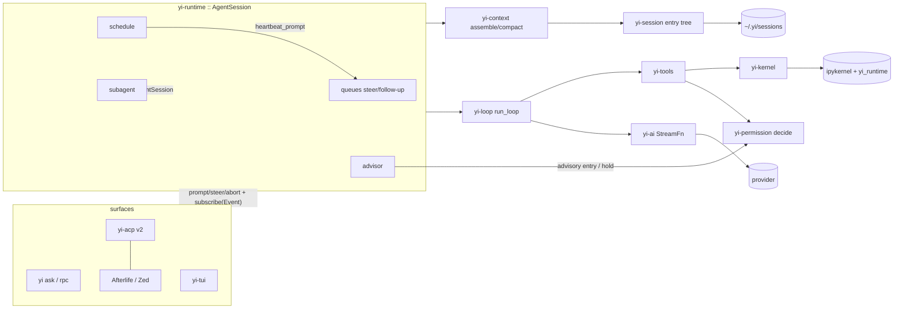

# Yi — Architecture Map

```
version: 0.100.0        # bump on any structural change; log it below
design:  YI_DESIGN.md   # the deep design; § refs below point into it
status:  phase 4 done   # yi-kernel (Jupyter client over pure-Rust zeromq) + uv venv bootstrap + verbatim rlm Python runtime (mcp.py rewritten over `yi mcp --json`) + ipython tool + runtime::subagent (rlm.run depth 1). Exit gate green: recursion scenarios incl. a live-kernel round trip. 4b done. Phase 5 done: runtime::schedule + runtime::advisor. Phase 5b done: yi-acp v2 server (hand-rolled wire, D40). Phase 6 done: yi-runtime::goal (G1-G6) + `yi serve` daemon (D4 supervisor + worker-per-root; exit gate green: a heartbeat dispatches while no client is attached and a reconnected client lists and resumes the session). Phase 7 done: `yi-tui` (D41 design — codex/atuin inline skeleton, opencode subagent UX, OMP HUD/status) in the default build; `yi [prompt]` opens the TUI on a TTY (X1). Phase 8 (D42): nothing is deferred any more — every deferred, stretch, and never-built row is open work in docs/TODOS.md (ids A1-M5), worked in that order. U13 stable-prefix streaming landed in 7; U18, dynamic viewport height, and the gitignore-aware @-walk are A3, A2, A4. TODOS section B (CLI surfaces) is closed at 0.19.0, which also lands the T14 capture/restore half of C1.
```

## Changelog

| ver | date | change |
|---|---|---|
| 0.100.0 | 2026-09-01 | The plan engine's remaining proposal clauses, and the seams that shipped without a producer (D100 through D104). **A blocked todo can now come back on its own.** §5's saturating probe ladder is built: a `Blocked{on: External}` todo carrying a probe has it run at 60 s doubling to a 30-minute ceiling, and a pass becomes a host-attributed `unblock`; one carrying no probe nudges its owner at the ceiling interval instead. The loop's stop posture already had a `Cadence` arm for this state and nothing was on the other end of it, so a todo waiting on a deploy sat until a human noticed. The ladder runs off the wall clock in its own task rather than off turns, because a session quiet on `Cadence` has no more turns. **A declared output schema is checked, not just resolved.** §3 said "declared implies Done requires validated output" and what shipped was an existence probe that passes on any file that exists, including the wrong one. The resolve seam now serves bytes, so `done` fetches the product and the schema the delegation declared and validates one against the other through the B4 validator, naming the path that failed; `Ok(None)` stays resolved-but-unserved so a scheme with no backend cannot become a refusal. **The corpus is one address space.** `history://` reaches a live child and a session on disk, `agent://` answers from the running child before its pin, and the agent segment resolves greedily — which is what fixed a defect the old unit test had hidden by hand-pinning a single-segment address: a reap pins `agent://<plan>/<todo>` to `history://<plan>/<todo>`, and splitting at the first slash read that as a plan plus an entry that never existed, so **no reap pin resolved at all**. Beside those, four smaller repairs. A reap is idempotent at the delegate seam and `supersede` runs every refusable check before the first kill, so a cascade that fails halfway is safe to retry instead of wedging forever on its own dead children. A hand edit that swaps one Running agent for another reaps the child it replaced — the reap keys on the agent, not on the state name. `Wall.deny_url` gains its producer (`rlm.run(deny_url=[...])`), so the URL-prefix deny path stops being enforced-in-tests-only. And every path that retires a session disposes its kernel: the ACP daemon's `session/close` dropped the handle and left the IPython process running, which a long-lived `yi serve` pays for once per closed session. `plans.mirror` is deleted until the mirror exists — a config switch for a feature nobody wrote reads as a capability the tree does not have. `session.rs` splits at the handle seam into `session/hooks.rs`, which is a real seam (nothing there touches the run loop) rather than a line-count cut. **And the ledger's yield stops being a promise.** Every applied op now lands as a durable `custom{plan_op}` record on the owning session — the plan file is the state and carried no record of when it moved, so every duration §12 named was a query over a store that did not exist. Over it: `yi plan report` (per-todo run/wait/block time, retries, the critical path against the wall clock, and the discovery ratio), `yi plan lint` (the mechanical half of the doctrine — an ephemeral terminal record, a prose acceptance, an external block with no probe, a blocker tag the ladder cannot read, a ready set wider than the measured cores — advisory, never a verdict, per D50), and `yi why`, which walks `git blame` to commit to `Plan:` trailer to todo to goal in both directions. `FetchLog::relevance` is M3's query, and its consumer is the reap: an owner is told how much of the context it handed a child the child ever read, measured from the child's own durable fetch entries rather than from the owner's log. The TUI grows `/plantree`, a panel over the same structs the runtime reads (D104). Two things are reported rather than built, because building them would have been a third seam with no producer: **plan-aware compaction is not here** — `Compactor` is constructed nowhere outside tests, so `/compact` is inert today and a plan-shaped summarization directive would have had no reader; and the **outcome ledger's retroactive `implicated-by` append, OpenTelemetry spans, duration priors and decomposition priors** are left to the corpus they need, which one branch cannot produce. growth +11721: D100 through D104, re-measured on the merge, from the 0.96.0 baseline that this branch is the first to price past — this version's own share is ~2,200, of which the plan-tree panel is 440, the ledger and its queries 380, `yi why` 150, the probe ladder 240, the transcript seam 90, and schema validation at `done` 60. Deletion was weighed and taken three times: `plans.mirror` and its config plumbing, the duplicated dispose-the-child's-kernel body, which is now one call, and the second copy of `tree.rs`'s window-and-thumb loop the panel would otherwise have needed — it is a shared `window_lines` instead, which is a net subtraction from `tree.rs`. Weighed and refused: widening the 16-bit hashline tag, because the tag is the one a model copies out of a hashline listing and desynchronising the two formats costs more than the ambiguity it would close — the bound stays recorded on D98, where the fetch log's own sha256 is what is evidence-grade. | | Renumbered from 0.98.0 and 0.99.0 on the merge with `origin/main`, which had spent 0.98.0 on the read-body highlighting; the growth memo below is re-measured on the merged tree, per the 0.96.0 row.
| 0.99.0 | 2026-09-01 | The plan engine (docs/plans/2026-08-31-four-primitives-and-a-plan-engine.md; D97, D98, D99). The plan stops being a fact inside the transcript and becomes a git-tracked Markdown document with YAML frontmatter under `plans.dir`, addressed by verbatim todo label, with a step table the runtime reads rather than a flow written beside it. `Fact::Plan` keeps its exact wire shape and gains one optional pointer at the file, so every existing session still loads and the three durable v4 fixtures still round-trip byte-identically. Three golden-path walkthroughs — a typo fix that never opens a plan, a two-core campaign with a decompose, a held dispatch and a cascading supersede, and a game at level grain — landed as data fixtures **before** any engine code and settled every question the proposal left open; a runner replays each step against the real engine and hard-fails on an assertion key it does not recognise, so a fixture can never be silently half-checked. Beside it, `fetch` becomes the one read path: eight internal schemes behind a single resolver that enforces the wall as URL-prefix denies, fences what arrives from outside the trust boundary, logs every read, and rewrites a citation to its pinned form at the terminal seam so no model ever produces a hash. Four bounds became mechanisms rather than advice — the spawn fuse rides the root frontmatter so a crash cannot refill it, the dispatch width is `clamp(cores − 1, 1, 8)` measured from the machine so a two-core container serialises without anything knowing which benchmark it is running, promotion happens at reap whatever the outcome so a child that failed after real work leaves its product behind, and the 32 KiB frontmatter cap is refused before the write instead of trimmed after it. A proptest fuzzer over the step table rides `just check` at 256 cases and soaks on `PROPTEST_CASES`; it and an adversarial review found twenty defects, every one reproduced before it was fixed and regression-tested after. No new crate, no new runtime dependency, no new env var; `plans.dir` and `plans.mirror` are the two new config keys, global-only until X7's project layer exists. The request-prefix gate now prices the plan tool, which is session-wired and was therefore invisible to it — 16,190 → 18,473 bytes is a measurement correction plus the tool's own 2,283, not prefix drift. growth +9498: D97's landing — the plan document, its store, step table, ops, tool, dispatch and loop coupling (4,150), the resolver (1,421), the shapes and URL type (1,557), and the hand-rolled YAML subset codec (970), the rest spread across the seams they wire. Deletion was weighed twice and refused twice with reasons: the landed plan module was migrated rather than deleted because D82's escalation ladder and D75's host-verified done are law that carries forward inside it, and a YAML crate was refused because `toml` is banned by name and the transitive budget had one unit left, which is exactly what the 970-line subset codec buys back. One gate was found dead on the way past it: `check_startup.py` calls hyperfine without `--shell=none`, so the calibrated shell subtraction drove D93's minimum to 0.00 ms and the budget could not fail on any binary; with `-N` it reads 4.18 ms against its unchanged 5 ms cap, and it was proven by watching it refuse a 1 ms cap for its own reason. |
| 0.98.0 | 2026-08-31 | A read's expanded body is syntax-coloured from the file it names. `ToolCell::body` already parsed a `NN:text` gutter out of every preview row and then painted the text flat, so a read of Rust, Python or JSON in verbose mode was one undifferentiated grey block while a diff of the same file three lines above it was fully coloured. The path is not in either tool's `details`, so it comes off `self.summary` with the split `explored_lines` already uses, and feeds the same `highlight::lang_for` + `highlight::spans` pair `diffview` calls (D63, D74) — no new function, no new dependency, no new theme entry. Colour carries only across an unbroken run of rows read verbatim from line 1, and is dropped for the rest of the cell at the first break. Three things break it: the transcript keeps a long read as head and tail with `… N more lines` between them, a `ranges` read prints `[lines N-M not shown]`, and the read tool clips a row past 512 chars. In each the parse state stops describing what the reader sees, and both carrying it (real code painted as comment) and restarting it cold (a docstring's prose painted as keywords) mis-colour with confidence, which is worse than dim. The cost is deliberate and measurable: a read opened at an `offset`, and the tail rows under an elision marker, stay flat. **What was deliberately left flat**: grep/glob/find rows, because each is one line lifted out of its file — possibly mid-string, possibly from a different file than the row above it — and the highlighter is stateful by design, so a guess mis-colours more often than it helps; the digest line, which for every tool but read/edit is the first line of arbitrary stdout; and bash, fetch and web_search preview rows, which have no known or inferable language. Subagent and replayed cells build their summary with an empty argument, so they keep today's flat body — plumbing the path into `details` is a separate change. growth +29, all in `cell.rs`. |
| 0.97.0 | 2026-08-30 | M6: multi-client watch. The daemon's per-session attachment becomes a set — every attached client gets the `session/update` fan-out, so one session can be watched from any number of terminals; the unseen ledger and the permission park now apply only while the set is empty, and a worker-originated ask fans to every watcher with first-answer-wins (the stale request ids fall out of the bridge map with the winner). `session/resume` honors a real `replayFrom` offset in entry space and answers with `replayedTo`, the total entry count: the console stores it per session, spends it only when the pane still shows that session AND nothing streamed since (any update clears the offset — a skip-ahead resume must equal a full wipe-and-replay), so an idle reconnect skips the whole replay. Additive wire only, extends D89's surface: `replayedTo` in the resume result. Tests: two-client fan-out E2E against the real daemon, and two drive tests pinning both offset paths (honored when clean, discarded after a live update). |
| 0.96.0 | 2026-08-30 | TUI proof capture (docs/plans/2026-08-30-tui-capture-proof.md, D88): the headless drive loop grows two human-facing sinks beside the frame dumps it already wrote. `--record <file.cast>` mirrors every draw through a `CrosstermBackend` into an [asciicast v2](https://docs.asciinema.org/manual/asciicast/v2/) file, `--snap <file.ansi>` dumps the last frame as a self-contained escape stream, and `just tui-proof <script>` renders those into the GIF and PNG a PR attaches so a reviewer can judge how a UI change looks — a frame dump proves the contract held, it cannot show whether the result is worth shipping. Zero new dependencies: `CrosstermBackend` and `TestBackend` are both already in the tree, the renderers (`agg`, `freeze`) stay external and dev-only, and `vt100` stays a dev-dependency, where it now verifies the recording instead of producing it. **Three defects were designed out rather than fixed later.** Crossterm answers `size`, `window_size` and `get_cursor_position` by querying the real tty, which headless has none of, so every read delegates to `TestBackend` alone. `terminal.rs` hides the cursor after every draw and the loop draws every couple of milliseconds, so cursor calls record only on a transition and an empty diff records nothing — crossterm ends even an empty `draw` with a reset triple. And the event boundary is a **flush**, not a write: crossterm formats its commands into the writer piecewise, so one event per write turned a three-frame run into 431 events of single characters (`─`, `\x1b[`, `m`); at flush granularity the same run is 7 events and 1.4 KB. The synchronized-update bracket is stripped at emit — it asks a live terminal to present a frame atomically, means nothing to a recording, and would otherwise put an event on every idle tick or leave a player mid-update when its closing half was dropped. `HeadlessBackend` is deleted; `RecordingBackend` replaces it and degenerates to the old cost when not recording. Also here: `type-ms <n>` paces typed characters (0 by default, so assertion scripts stay instant), `--deadline <secs>` replaces the hard-coded 60 s wall a paced proof outgrows, the drive-only flags now error instead of being silently inert without `--headless`, and the frame dump propagates its write errors — `fs::write(..).is_ok()` had made a failed dump indistinguishable from an unchanged frame. The load-bearing test replays the cast through `vt100` and asserts it lands on the frame the assertions ran against: two sinks, one draw stream, no silent drift. Two unit tests hold the parts a round trip only approximates: a character written two bytes before a flush and one byte after must reassemble across the two events, and 200 ticks of exactly what `render::draw` does when nothing changed must add nothing after the first tick's genuine cursor hide. **Rendered and looked at, which is what found the last defect.** `freeze` was in this design until the first PNG was opened: it is a text-screenshot tool, not a terminal emulator, so it re-renders in its own font and chrome — the composer border ran off the right edge and the grid was not the one Yi painted — and `-c full`, the invocation its docs implied, exits 0 while writing a 0-byte file. Both artifacts now go through `agg`, a real VT renderer, and `--snap` writes a one-event cast rather than a bare `.ansi` so the still is the motion's last frame on the same grid. The row format was settled by measurement too: newline-terminated rows satisfy a text renderer but scroll a 24-row frame off a 24-row screen, and the still came back blank, so rows are placed by absolute cursor move. The round-trip test now also asserts the still replays cold onto the screen the recording ends on. Verified by hand at 790x560: `run.gif` over 16 frames, `still.gif` as one. **Reviewed after landing, three defects fixed with real-binary regression tests.** `Instant + Duration` panics rather than saturating, so an unclamped `--deadline` aborted the process at 101 before the loop ran a step, in a tree whose panic budget is zero: the wall is now elapsed time from a start instant and the flag clamps to a day. A paced `type` step runs inside one outer-loop iteration where the clock is never read, so a long line ran past the deadline meant to bound it; it checks between characters now. And `--record` with `--snap` on one path left the still truncating the recording open on it — exit 0, capture silently lost, the exact failure this change exists to remove — which is refused with exit 2. growth +348: measured against the merge base (the baseline moves 52606 -> 53143 because 0.85.0 landed its own +190 without an `--update`): `capture.rs` is 333 of it, the rest CLI flags and drive wiring. Weighed for deletion and taken: `HeadlessBackend` and its fifteen delegating methods, which `RecordingBackend` subsumes, and the hand-rolled SGR emitter the first draft of this plan specified — `CrosstermBackend` over a byte sink serializes a frame in twenty lines, so the snap and the recording share ratatui's escape generation instead of a second implementation of scroll regions and colour state. | Renumbered from 0.85.0 on the merge with `origin/main`, which had spent that number on the A5 slash verbs; the growth memo below is re-measured on the merged tree, per the 0.82.0 row.
| 0.95.0 | 2026-08-31 | TODOS A6: Ctrl+R reverse-i-search on the composer. The query lives on the box title, the body previews only after the query has text, Enter accepts a match as a draft, Esc restores the pre-search text. Duplicate prompt strings are skipped inside one search. Up/Down and Ctrl+S step matches; they do not open a second UI. growth +193: the search session and its drive proof; weighed for deletion and left out: Atuin's overlay, persistent history, fuzzy match, and previewing the latest prompt on an empty Ctrl+R. |
| 0.94.0 | 2026-08-31 | The startup guardrail is scored on the run's minimum, not the mean (D93). `check_startup.py` reads hyperfine's `min` against the same `startup_ms_budget.json` cap, and the done-bar's wall-clock exception goes with it: re-running the gate idle is no longer an explanation for a red number. growth +190: none of it this landing's — 0.85.0's slash-verb row was never ratcheted on main, so its measured +190 is priced here rather than carried further; this change is one field in a guardrail script and the two docs that described the old statistic. Weighed for deletion and left out: re-baselining the 5 ms cap to what the minimum actually measures, which would move the budget without recording why. |
| 0.93.0 | 2026-09-01 | The gate stops running in one long line (D92). 0.92.0 cut what CI built; this cuts how long what remains takes, from a per-step profile of the 6m06s that was left rather than from taste. **The suite is 48 % of it, and `cargo test` was serialising it.** 671 tests live in 101 binaries and cargo runs the binaries one after another, so five of them — `cli_surfaces` 74s, `mcp_oauth` 36s, `tui_drive`/`acp_protocol`/`recursion_e2e` ~16s each — are 96 % of a 177s run while the other 95 finish in twelve seconds between them. `just test` takes `cargo nextest` when it is on PATH, which pools every test from every binary, and falls back to `cargo test` when it is not, so a fresh clone still runs the suite. nextest cannot run doctests, so those stay a second `cargo test --doc` rather than quietly leaving the gate. **Turning it loose was wrong, and the measurement said so before the change landed:** unbounded, 14 tests time out and the run takes 121.9s, because every test in the twelve binaries that drive `yi` as a child spawns a multithreaded process and they oversubscribe the machine against 600 microsecond unit tests. A `subprocess` test-group capped at three — beside the `kernel` group that was already there for the same reason — takes the same 671 tests to green in 57.0s. The cap is a scheduling bound and not a coverage one: every test still runs, and this is the mechanism `.config/nextest.toml` already existed to express. **The gate's three lanes are independent and now run as six jobs rather than two.** `lint`, `guardrails` and `test` never needed each other, so `just check` was paying their sum; `just lane <name>` runs one of them carrying prepush's own invariant — that the gate regenerated nothing — because a split run that dropped it would stop asserting the thing pre-push exists to assert. `.github/` stays a thin caller (D84): it names which lane on which runner and nothing else. The PR-title check moves to its own job rather than being re-run by all six. **And debug builds stop carrying debuginfo nobody reads**: `[profile.dev]` takes `line-tables-only` and dependencies take none at all, because generating it and linking it into 101 test binaries was a fifth of the wall clock and a backtrace through serde's frames is not what anyone reads — `file:line` on Yi's own frames survives. A side effect is a smaller `target/`, which is also a smaller cache. **The hang this was measured against is the case for the timeout.** A Linux job on the 0.92.0 branch sat in `just prepush` for 29m29s and was cancelled by hand, against 6m48s for the same commit on the previous attempt; `cargo test` has no per-test timeout and would have held the runner to the six-hour ceiling. `.config/nextest.toml`'s `terminate-after = 2` over a 30s period kills it in sixty seconds. growth +0: a profile stanza, a justfile recipe, a nextest config and two workflow files are none of them src. |
| 0.92.0 | 2026-08-31 | The PR gate stops paying for work nothing reads (D91). Measured on run 33445818093, a green two-OS gate: macOS 11m13s, Linux 16m27s. Three findings, all from the runners' own timing rather than from reading the YAML. **The fat-LTO build had no consumer on CI.** `just guardrails` depended on `build-dist` unconditionally, but `binary_size` and `startup` are the only two readers of `target/dist/yi` and both announce-skip under `CI` (D70, D68) — so every job built the shipping binary and threw it away: 1m44s on macOS, 2m49s on Linux. The dependency moves out of the justfile recipe and into `check_guardrails.sh`, beside the one branch that decides whether either gate runs; a failed build now fails both gates rather than letting a stale binary answer for code nobody wrote. **The cache never once hit.** Six live caches, 1.6 GB apiece, 10.28 GB against a 10 GB repo ceiling, every one of them saved under `refs/pull/N/merge` — a scope no other pull request can read, and `main` had none to inherit because `postmerge` has been red since it was written. Linux was worse than cold: it tarred `target/` for 26s a job and died on `zstd: error 70 : Write error : cannot write block : No space left on device`, so that runner has never had a cache at all. `Swatinem/rust-cache` replaces the hand-rolled `actions/cache` on both workflows under one `shared-key`, which prunes to the dependency artifacts, restores on a stale key instead of rebuilding 166 crates from scratch, and — saved from `postmerge` on `refs/heads/main` — is what a branch's first push inherits. **Tools were compiled from source.** `cargo install --locked just cargo-deny cargo-machete` cost 3m38s on macOS and 5m37s on Linux; `taiki-e/install-action` fetches the same three prebuilt. And `postmerge` gets the `uv` its kernel journey has always needed — the missing install is why main has been red, which is the same reason no pull request could inherit a warm cache. Two of the leads that opened this were wrong: `uv` and the Python venv are not why Linux is slow (the installer measures ~1s and the venv does not rebuild) — Linux is slower because x86 `ubuntu-latest` compiles this workspace at roughly 1.7x the arm64 macOS runner's wall clock, and because it has never had a cache. No gate is weakened: the CI skips are the ones D68 and D70 already ruled, and the two-OS matrix, `just prepush`, and the guardrail set are untouched. growth +0: `.github/`, the justfile and a shell script are none of them src. |
| 0.89.0 | 2026-08-30 | M2–M5 of the workspace shell land together (D96). **M2**: BSP pane tree in `crates/console/src/layout.rs` — split/close/geometric-focus/ratio ops with children overlapping by one border cell, so the border raster unions shared edges into real `├ ┬ ┼` junctions; tabs; zoom; a Mode enum (Normal/Prefix/Navigator) with a live hint bar; `keys.rs` holds ~16 direct alt-chords plus the full ctrl+b prefix table; the fuzzy navigator opens any session across roots into the focused pane, and the sidebar groups by root. **M3**: mouse resolves clicks, border drags, and wheel scroll against the `Hits` table the last compute_view published (they cannot disagree with the screen); the daemon parks worker-originated requests that arrive while a session is unattached and flushes them on the next attach (capped at 8 — this closes the blocked-asker hazard M1 documented); delayed re-validated notifications (`notify.rs`: 1 s hold, one slot per session so flicker re-arms instead of stacking, then OSC 9 / kitty OSC 99 out to the desktop, suppressed for the focused pane); split-open animation eases the fresh split's ratio 0.12→0.5 over 140 ms inside `CSI ?2026` synchronized frames, snap-disabled under the drive harness. **M4**: `PaneContent` is the provider seam — Session, Markdown, Diff, Notebook variants; the navigator doubles as the command line (`md <path>`, `diff <path>`, `nb`). **M5**: the notebook pane retains kernel cells off the ACP tool-call stream (code from the start's rawInput, streams/result/error/attachments from the end's details record); `crates/tools/src/ipython.rs` now carries the attachments themselves in details instead of a bare count (no consumer read the count; the wire record is the typed cell); base64 PNG attachments render as placeholders everywhere and ride kitty `f=100` transmits with a cell-rect placement on kitty/ghostty (`console/src/kitty.rs` — no new dependency: the payload is already base64, no decode, no deflate). Drive grammar grows `mouse <kind> <x> <y>` in the console's own parser, delegating everything else per line to the shared yi-tui grammar. 12 drive tests cover splits/zoom/tabs/prefix, navigator, 20x8 fuzz, mouse focus + drag, background-session notification, notebook cells and the markdown viewer. growth +2178: the layout tree, keys, notify, kitty and mouse surfaces are all new src, the shell build-out D90 claimed. Weighed for deletion and taken: the M1 single-pane transcript plumbing (folded into `PaneContent::Session`), the planned `PaneView` trait (the enum IS the seam at four variants; a trait with one impl per variant bought nothing), and a planned yi-orb dependency for the notebook image (unneeded — PNG passthrough). |
| 0.88.0 | 2026-08-30 | M1 of the workspace shell (one-out: docs conversion / `anydoc` demotes to §1.1): `yi-console` (crates/console, `yi console`), an ACP client over the `yi serve` daemon socket that renders locally from the `session/update` stream — no server-side frame rendering, no PTYs, the daemon owns every session (D95). The crate is a synchronous drain-then-draw loop on stock ratatui alt screen (not yi-tui's vendored inline terminal): `client.rs` is two std threads around one `UnixStream` (bounded hand-rolled line framing, 32 MiB frame cap, `sync_channel(4096)` so a lagging UI backpressures the socket; reconnect with 250 ms→2 s backoff), and every protocol decision — handshake order, pending-request map with 10 s deadlines that all fail on disconnect, wipe-on-resume-send because replay updates stream ahead of the resume response (a fresh `IdMap` per replay makes client-side dedup impossible by design) — lives in the sync `app.rs` reducer, which the drive harness runs verbatim over a scripted fixture daemon on a scratch socket. Transcript rendering reuses yi-tui's pure fns (markdown/cell/wrap/colors) behind a per-block line cache: committed blocks render once, only the open streaming block re-renders per delta, retained lines capped at 10,000. Sidebar carries the two-axis `(state, seen)` status (blocked ✕ / working ◐ / done-unseen ● / idle ○). Wire surface grew additively, no yi-types DTO change: `session/list` takes an optional `cwd` (forwarded to that root's worker for the persisted repo list), its daemon rows carry `unseen`/`lastState`/`lastEventMs` from the new in-memory unseen ledger at the old drop site, and `_yi/seen` zeroes the counter; the daemon also attaches the client to a resumed session *before* forwarding, because replay notifications otherwise landed in the ledger instead of the resuming client (caught by the true-E2E test: real binary, real daemon, faux model, create→prompt→detach→reattach→replay). Drive-step helpers (`typed_events`, `poll_condition`, pub `key_event`) moved into yi-tui's drive module so both loops share them. growth +2048: the console crate is all new src, the shell landing D89 claimed. Weighed for deletion and taken: the duplicated `--keys` parse block in yi-cli (collapsed into `load_drive_script`), the duplicated key-event mapping and wait-step arms (now the shared drive helpers), and the serve command's inline socket-path resolution (now `daemon_socket`, shared with the console arm). |
| 0.85.0 | 2026-08-30 | TODOS A5 leftover TUI slash verbs land on the dispatch 0.43.1 already had. `/permissions [ask|auto|yolo]` reads and writes the session broker — Codex's Read-Only / Full Access names are not Yi's modes. `/compact [instructions]` calls `Compactor::schedule` / `schedule_with_instructions`, so compaction still happens at the next tool-loop boundary rather than on the keystroke. `/sessions` lists ids for this cwd; show and rm stay on `yi sessions`. `/model` was already the picker (0.65.0). The `tui_drive` journey that proved `/plan` and `/undo` now also proves the three new verbs against the same session. growth +190: three handler arms, the slash table moved beside its dispatch, and the drive script's extra waits; weighed for deletion and left out: Codex's permission vocabulary, inline compaction, `/sessions show|rm`, and a compact-status percent line that would have duplicated the HUD. |
| 0.84.0 | 2026-08-30 | G1 per-session heartbeat lanes and the G2 multi-worker matrix land together (D86). After the H5 claim, jobs group by `Job.session_id` — now the ACP session id, because one interned `JobStore` per `scheduled-jobs.json` path replaced the per-session store that had every job carrying `rlm-{pid}`, which is what made the lanes fictional. Lanes are `spawn_blocking` tasks kept in a `JoinSet` across timer ticks and reaped by task id, and `DeliveryHub` clones the lane's `Arc` and drops its mutex before calling `deliver`, so a blocked session no longer serializes every sibling on one lock. **The timer park is the half that was missing**: both parks were a bare `join_next().await` while `JobStore::mutate` wakes with `notify_waiters`, which stores no permit, so a blocked session whose own interval re-armed — or whose only job was `Once` — froze the timer exactly as before the lanes existed. The deadline now skips busy sessions (`next_claimable_run_at` replaces `next_active_run_at`), the change waiter registers before the snapshot it acts on, and one `select!` covers due, woken and lane-finished; two e2e probes hold both cases. **Lane hygiene** from the same review: `HeartbeatService` withdraws the session's lane from the interned hub, which is what "ending the session stops the timer" means now that one timer outlives every session on its ledger; a heartbeat armed before the session store is attached is refused rather than stamped with the empty id that matched every other unbound session; and an aborted lane frees its session with a marker instead of staying busy for the process lifetime. **The withdrawal took a second review to get right**, and all three holes are closed here. `Drop` was the only withdrawal, but `RpcState::adopt` — new session, switch, fork — re-points a live `AgentSession` at another store instead of dropping it, so every rebind left the previous id's lane registered for the life of the process; `bind_session` is the one seam both paths route through and now withdraws there. Withdrawing the lane silenced delivery but left the jobs `Active`, so the timer re-claimed, re-armed and re-fsynced a dead session's heartbeat every interval forever — the skip path writes the ledger on every tick — so the same withdrawal pauses them. And the kernel's `rlm_heartbeat.list`/`update`/`delete` read the shared ledger with no session filter, so one session listed, paused and deleted its siblings' heartbeats: they take the `owns()` scoping `/heartbeat` already had, read outside the store lock so the two mutexes are never nested in both orders. **G2**: `workers_do_not_lose_heartbeats_or_tear_the_job_ledger` boots two workers × two sessions and asserts ledger integrity and reconnect, enrolled in `just journeys` by D85's tier-2 marker rather than by a justfile line of its own. growth +430: the lanes timer, the interned store and the delivery hub are all new src. Weighed for deletion and taken: `next_active_run_at` and the two parks the `select!` replaced, plus the four gate-and-poll blocks in the schedule e2e tests, which collapsed into shared helpers. |
| 0.83.0 | 2026-08-29 | Governance: growth is priced, tests are tiered, the forge is named, and a subject and a comment are both judged by a reader who has nothing else open. **Net src growth gets the budget it never had (D83).** The per-file, per-crate, per-binary and comment ratchets bounded the pieces while the repository's total slope had no price, so growth arrived unexamined and was explained afterwards. `check_growth.py` measures the same `src_files()` set every size ratchet reads against `baselines/src_loc.json`, seeded at the tree 0.82.0 closed with (52,176 lines): +150 rides free, past it the version's own changelog row carries a `growth +N:` memo naming the measured number and the deletion weighed, past +2000 that row also cites the D-row the landing claimed. **The bands are measured, and the measurement corrected the study that motivated them.** `--calibrate` walks every version bump in history: **95 versions, median +171, range -2036..+5978, 46 under the free band and 49 over, 7 of those past +2000** — two regimes with the band sitting on their seam, not the "+35 organic median, +643..+3295 landings" a 17-bump sample had suggested. So slightly more than half of this repo's history would have owed a memo, which is the intended price for a repo in heavy build-out and is a different claim from the one the band was proposed under; it is recorded here rather than smoothed over. (Three negative deltas are artifacts of 0.82.0's duplicate version numbering across the two lineages, not deletions — they widen the reported range and nothing else.) The gate runs outside `--fast`, because growth is priced once per version in the row a landing writes last, and asking it of every commit inside that landing only teaches people to ignore it. **This row eats it first:** the campaign's own net src delta is **+4** — the comment sweep below, everything else being scripts, docs, `.github/` and `.ruler/` — inside the free band, so nothing here owes a memo and the gate's first real answer is a green one. **Tests are tiered, and a ledger row names its journey (D85).** T0 unit / T1 faux cassettes (both inside `just check`) / T2 real-binary journeys (`#[ignore]`d into `just journeys`, which `just postmerge` depends on, once they are too slow for the PR gate) / T3 paid smoke (opt-in, user-run, ledgered, never in any gate — plan law 3 unchanged). It makes the zero-spend line structural, because what `just check` may run, what needs a built binary and what costs money were three different answers previously held as folklore. A tier names spend and prerequisites, not one lane: the two daemon journeys sleep 13 s apiece and move out of `just check` where every PR paid for them, while the ACP and TUI journeys measure ~1 s and stay, because `#[ignore]`ing a one-second journey to satisfy a definition runs it less often, which is the opposite of what naming the tier was for. The lane is then held rather than described: `check_test_tiers.py` refuses any `#[ignore]` whose reason is not the tier-2 marker, because `--ignored` is the whole of what `just postmerge` selects and Rust spells "slow", "flaky" and "paid" with the same attribute — so a run that costs money cannot be written into that lane at all. The nine-journey inventory it forced named the holes, and three T2 journeys close the worst of them over `faux/faux-1` with no key and no network: a resume that must not fork the session store beside an undo that puts the working tree back, a kernel cell whose `rlm.run` child answers with typed data and leaves its own durable transcript, and a red `Task.check` refusing a done claim while a green one is admitted and the completion gate holds. Beside them the TUI's `/plan` and `/undo` are proven to reach the session the turn actually ran in, the daemon is driven with **two** roots rather than one — a single root cannot tell worker-per-root apart from one worker serving everything — and `scripts/tui_pty.py` grows `--expect`, which it needed because a killed child exits 0 and a run that rendered nothing passed. **The forge stops being a fiction (D84).** docs/FORGEJO.md described runners, secrets and a publish path for a server that does not exist while the remote is GitHub with merged PRs on main; it becomes docs/FORGE.md, keeping the thin-caller and local-gate doctrine and correcting its own citation — the `.github/` deletion is the **0.60.0** row, not the 0.59.0 the doc claimed and this campaign's brief inherited. What 0.60.0 refused was a second unrun copy of the rules, and what returns is not that: `pr.yml` and `postmerge.yml` call `just prepush` and `just postmerge`, the same recipes the hooks run, on a Linux + macOS matrix, so `O1`'s cross-platform half closes with no second rule set to drift and `G2`'s stress matrix finally has a home. `PULL_REQUEST_TEMPLATE.md` is the cold-reader narrative — summary, user outcomes, UI changes, files-edited map, schema changes, LOC and justification, architecture notes, screenshots — with **zero checkboxes**, because proof that can be ticked by hand is not proof: it lives in the CI status checks alone. Branch protection on `main` is a settings act the user performs, so `O6`'s enforcing half stays open and this row says so rather than claiming it. **A subject is a sentence, not an id.** `check_trailers.py` becomes `check_commit_style.py` — the name had understated it — and over its existing `HEAD --not origin/main` span it gates one plain imperative sentence: at most 72 characters, capitalized, no terminal period, no past or progressive verb, no `WIP`/`fixup!`, no id standing in for the subject, and exactly one prefix, `Ratchet: ` carrying its measured `X -> Y`, beside the `Merge`/`Revert` subjects git writes itself. Conventional-commit dialect fails outright. `PR_TITLE=… check_commit_style.py` applies the identical rule to a title in CI. The trailer ban tightens from assistant co-authors to an allowlist that keeps the flywheel plan's §8 `Opt-*` set and git's own sign-off. Calibrated over the 62 commits of this lineage: four would be flagged, all on length, all good 73-77 char sentences, grandfathered by a cutoff sha that self-expires once this lineage lands on main — while the 130-char subject that motivated the cap sits just across the merge, in history the span does not scan. **And a comment must survive with no foreknowledge:** strip every row and decision id from it and the fact must still stand alone, ids being trailing pointers rather than the payload, since a pointer outsources the fact to a document the reader at 3am does not have open and rots the day the row is renumbered. `check_comments.py` flags a comment left with too little prose once ids and pointer words are stripped; zero-start and hard-fail, so the pointer-only comments it found are rewritten in the detector's own commit rather than baselined. The reach is every crate: only the *volume* ratchet skips `yi-types`, where a schema fact earns its line, and nesting the foreknowledge test inside that carve-out had exempted eleven comments from a law written for all of them — six of which turned out to restate the item's own name and are simply gone. TODOS `K1` stops saying the forge is moving to Forgejo, and `O11`/`O12`/`O13` open for the remaining journey gaps, the T3 tier and the ledger annotation pass. |
| 0.82.0 | 2026-08-29 | Two mains become one. `origin/main` and the flywheel lineage both forked from the reasoning-stream merge and each spent the version numbers above it, so the ledger carried 0.67.0 and 0.69.0 twice with different content. The rows that exist only on `origin/main` renumber — tool ergonomics 0.67.0 -> 0.80.0, its review 0.69.0 -> 0.81.0, each row naming the number it landed under — and `origin/main`'s 0.68.0 drops as a byte-identical restatement of the 0.67.0 row both lineages inherited. No decision-log row collided: `origin/main` added none, so D74-D82 stand unrenumbered. **Three resolutions were judgements, not unions.** Syntax highlighting keeps D74's `syntect` parser rather than the hand-rolled scanner the other lineage was repairing: the three defects that repair fixed — a lifetime opening a string, a mid-line `*/` swallowing the rest of the row, a shell `#` mid-word — are cases a grammar with a carried `ParseState` never had, and those three tests now guard the parser instead. Markdown streaming keeps both: the fence-aware `stable_stream` cut and `render_continuation` from the other lineage, over `code_lang` held by value because a `syntect` parser is per-block state rather than a `&'static` table. `regex` leaves the ban list outright for grep v2, which subsumes the narrower `zeromq`-wrapper exception D74 had left it, and `syntect`'s own `once_cell` wrapper survives beside it. Ratchet baselines are the union re-measured on the merged tree, not either side's number. **Two ceilings moved with the merge.** `subagent.rs` came out 1,208 lines — each lineage had grown it, ours to exactly the 1,200 cap — so it splits at the seam the file already had: `attach_runtime`, `RuntimeWiring`, `child_factory` and the four `wire_*` helpers become `crates/runtime/src/wiring.rs`, leaving 877 lines of child lifecycle behind. Nothing outside the crate moves, because `lib.rs` already re-exported both names. And `lang_for` grows an alias table: the other lineage's scanner answered to `ts`, `tsx`, `jsx`, `typescript`, `shell`, `python3` and `ipython`, and the bundled grammars answer to file extensions, so every one of those fences would have rendered plain. TypeScript has no grammar in the default set at all and maps to JavaScript. **One case is a real loss, recorded rather than hidden:** in shell, `echo hi;#note` is a comment to bash and a command name to the grammar, which opens a comment only off whitespace. The mid-word half — the defect that ate the rest of a row — still holds, and the test now asserts what the parser guarantees. `N15` carries the rest. |
| 0.81.0 | 2026-08-29 | Review of the tool-ergonomics change, fixed. **The streaming fence was broken in the paint (P10).** `commit_stable_prefix` prepends the reopened fence line to every in-fence slice, and `markdown::render` pushes a `│ {lang}` rail header on every `Start(CodeBlock)`, so each committed line rendered as its own block with its own header: a five-line Rust block streamed as five `│ rust` headers interleaved with its rows. A fence with no language tag rendered correctly, which is why it shipped — the three new tests asserted `stable_stream`'s cut and reopen and never the rendered output. `render_continuation` now draws the rail once per block, the live tail in `render.rs` uses it too, and the retained cell holds the bare slice rather than the reopened text, because `History::retain` concatenates consecutive assistant slices back into the original source and retaining the prefix reopened a fence mid-message on every reflow. The new test streams a fenced block byte by byte and asserts the streamed paint equals the batch paint. **The freeform grammar is gated (P7).** `edit.freeformGrammar` defaults off: `freeform()` returned `Some` unconditionally, so every Responses request carried a Lark grammar that has never been round tripped against a live provider, and one the provider rejects fails every request carrying the tool rather than one edit. `FreeformFormat.syntax` goes with it — one legal value, so the adapter names the dialect it emits. **Grep no longer strands a read's tag.** It minted a snapshot per rendered file, up to 200 per call against a 256-path LRU, so read then wide grep then edit ended in "hash is not from this session"; only the page's first 20 files mint now and the rest render bare. Its collection cap also fired on an exact fit (`>=`, where a full page is not a truncation), `files_with_matches` paging counted hits where it meant files, and the walk bounded rows but not bytes — one large file with a single hit retained its whole text — so an 8 MiB retention ceiling joins the 2,000-hit one. **Read** gives a multi-window `ranges` call the footer a single window already got: it named no next offset and no end of file. **The clips agree**: read clipped at 2,000 columns while claiming to match the patcher's reveal clip of 512, and the patcher claimed the reverse; 512 is one constant both use now, so a row read in full is a row a rejection can re-show. **`sed` is a read** unless `-i` is present — the write bucket miscounted the read tool's own clipped-line escape hatch. **Shell `#`** comments off any non-identifier byte, so `hi;#note` colours again. **HAR:** the `errorKind` taxonomy is `yi_types::event::ToolErrorKind`, one enum replacing a `&str` and three hand-maintained prose lists that already disagreed; `yi stats` totals are saturating like the rest of the token math; `join_all` loses its type parameter and its `dyn`, and its exit condition is every slot filled, which is what makes the flatten total rather than a silent drop. Recorded here but not new in this row: 0.80.0's `cap_lines` rewrite fixed a pre-existing bug where a cap below `HEAD_LINES + TAIL_LINES` emitted more lines than it named, so shell `grep`/`rg` output halves from 120 lines to the 60 the cap always claimed. | Landed on `origin/main` as 0.69.0, reviewing what is 0.80.0 here.
| 0.80.0 | 2026-08-29 | The tool-ergonomics plan lands whole (docs/plans/2026-08-29-tool-ergonomics-telemetry-tui.md, all eleven phases), seeded by a live session's self-assessment of the toolset. **Telemetry spine (P0):** every tool result's `details` now carries `durationMs` and `outBytes`, stamped in the one place all results funnel through (`run.rs::stamp_details`); failures carry an `errorKind` taxonomy (`denied`/`not_found`/`invalid_args`/`aborted`/`stale_tag`/`noop_loop`/`tool_error`) set at the site that knows, with the hashline mismatch prefix pinned as a constant so the sniff cannot drift; bash results name a `category` (codex's `command_category`), which is what makes "the model shelled out for a search grep should have served" measurable; `yi stats [id]` replays a session's JSONL into per-tool p50/p95, failure kinds, truncation counts, bash categories and edit op mix. One deviation from the plan, recorded here: `LaneRecord::ToolStarted` stays unwritten — its schema demands run/entry ids the loop never holds — and per-call timing lives in `details` instead, which the entry timestamp already brackets. Two counting bugs fixed underneath: `SessionStats` counted only child-lane `Usage` records so the main lane reported ~zero (assistant entries now accumulate), and a pi-convention `cause:"assistant"` record mirroring an entry no longer double-counts. **Read (P1/P2):** a 50 KiB model-facing byte budget (scaling to 512 KiB under an explicit `limit`), a 2000-char line clip whose rows never join the seen set (the patcher's reveal rule, applied at the source), honest three-way end notices each naming the exact next `offset`, and a `ranges: [[a,b],…]` parameter — one call, one tag, N windows, elision markers between — which with `grid scope` makes the non-linear context pack a single read. **Grep v2 (P3):** the `regex` ban is lifted here, with its first consumer — `std`+`perf`+`unicode-case` only, every engine crate already in the lock via globset; literal stays the default (`regex=true` opts in), `include`/`type` filter the walk, `offset` pages past the 200-hit cap with fx's distinguishable exhaustion reasons (page cap vs collection stopped at 2000), `files_with_matches` lists paths, and — closing prompt.md's "read/search" drift — grep now mints `[path#TAG]` headers and records shown rows as seen, so a hit anchors an edit with no read round-trip. **Loop (P4):** the computed-then-discarded `sequential` flag is honored: read-kind calls in a batch overlap under a hand-rolled `join_all` (four 80 ms reads finish in <240 ms in the test), writes keep strict order, results and events keep call order. **Kernel (P5):** `kernel.prewarm` (default on) boots the kernel on a background task at session open; children never prewarm; a failed prewarm stays silent because the first real cell repeats `ensure` and surfaces the same error. **Budgets (P6):** bash takes `max_output_lines`, min'd against the 30 KB capture ceiling; glob reports `matches`/`capped`. **Edit (P7):** C8 lands — `ToolDef.freeform` carries the hashline Lark grammar (omp's, ported) and the Responses adapter sends `edit` as a `custom` tool, replaying history as `custom_tool_call`(`_output`) and mapping streamed raw input to the `patch` argument, deleting the JSON-escaping tax; `details.ops` records the per-edit op mix M3 needs; stale-tag one-turn recovery was verified already working (mismatch records the live file with unenforced seen-lines) and deliberately left alone. **Highlight (P8):** first audit with fixtures. Three real defects fixed: a lifetime (`'a`) opened an unterminated "string" that swallowed the rest of every generic-heavy Rust row (`'` left the quote set; char literals are shape-checked, one char or an escape, which also rejects the `'a, '` span two lifetimes fake); a `/* */` closing mid-line swallowed the code after it; shell `#` mid-word (`url#frag`) commented the tail. The per-line limits that remain are named in the module header. **Orb (P9):** the flicker was delete-then-full-retransmit on every frame *and* every scroll-driven position change. Transmit (`a=t`) and placement (`a=p`) split; frames double-buffer across two image ids placing the new before deleting the old, so a placement exists at every instant; a pure move re-places ~40 bytes instead of retransmitting the frame; the placement escape is bracketed in a synchronized update with the cursor saved/restored. (Corrected in 0.81.0: this row also claimed a `Tick.bytes` payload counter read by drive mode. Nothing read it, and the field is gone.) **Markdown streaming (P10):** `stable_cut` becomes `stable_stream`: outside fences the blank-line gate stands (paragraphs re-wrap, lists renumber — the duplicate-item incident's invariant survives), but inside a top-level fence every completed line commits, with the fence's opening line carried as `reopen` so committed slices and the live tail render mid-fence rows as code; fences match by marker char and run length, so `~~~` and 4-backtick-holding-``` close where CommonMark closes them; the dead codex newline gate (`commit_complete_source`) is deleted with its test. This also collapses the worst re-render cost: a long fence's live tail stays one line instead of growing unbounded. | Landed on `origin/main` as 0.67.0; renumbered here because the flywheel lineage had already spent 0.67.0-0.79.0.
| 0.79.0 | 2026-08-29 | A model-authorized call stops being invisible, and the campaign's money gate stops failing open. **The reviewer's blind spot:** `PermissionRequested`/`PermissionResolved` were sent by `run_ask` alone, and D81 answers auto mode's fallback asks in `gated_ask` — so the one decision no human watches, a reviewer `allow` firing an unprovable command unattended, left nothing in the TUI, in ACP or in `--json`, and a reviewer denial and a recalled user verdict were equally silent: the waiting tool cell never went amber and an ACP client never entered `RequiresAction`. Every reviewed decision is now bracketed by the same pair a human-answered one is — the reviewer branch moved into `reviewed_outcome` so the announce and the settle sit on one seam instead of five returns — and `ask_user`'s replay is bracketed too, `ToolContext` carrying the `call_id` so the prompt names the cell that is waiting. Proven red twice, the allowance and the replay each asserting an empty event list first. **The money gate:** `tb21_baseline.sh` compared the cost probe's stdout in the shell, so a probe that failed left `spent` empty, `float('')` raised inside the comparison, and the empty answer read as under-cap — the only automated guard on a $25 slice, defaulting to spend. The comparison moves into `tb21_cost.py --soft/--hard` and its **exit code** is the gate: any non-zero probe exit stops the stream, and `check_cost_cap` in `evals/selftest.py` holds that line (red first against the old shape: `hard cap slept`). **And two doc rows the code had outrun:** the feature ledger still called M7/M8 `open (D1, D2)` while D81 landed it, and D81 reconciled D3 but not the flywheel plan's Law 2 and §16 ban on LLM-judged control flow — that ban is now scoped, in the plan itself, to the optimization machinery, with this reviewer named as its one recorded exception in both documents rather than in neither. |
| 0.78.0 | 2026-08-29 | The escalation ladder's upper rungs become refusals with a priced escape, and the price is one move per task (D82, revising D77; TODOS `N14` closed). D77 recorded the rungs as demands because refusing a done claim means refusing a check that might be green, and because `SPLIT_MAX_DEPTH` = 1 leaves a depth-1 subtask with no structural move of its own — a naive refusal wedges the exact node the ladder exists for. Both objections are answered structurally rather than argued away: the refusal lands **before** `verify_done` runs, so an unearned attempt spends nothing, and it names four escapes that are all reachable at depth 1, including `plan.split` of the parent, which a child's own streak earns. `(Pending, Done)` joins the admission gate for the same reason the Running edge has it — a checkless leaf that never entered Running was counted by the digest instead of named. `Task.readmit` (additive, `skip_serializing_if`) is the grant, and it is **targeted**: the blanket grant this landed with readmitted every stuck task at once, so one throwaway `plan.edit add` bought N further claims and the ladder's price collapsed. A grant now reaches only the tasks the move actually reshaped — `plan.edit add` the one task its new `for_task` names, `plan.edit reopen` the tasks that declared the reopened one as a dep, `plan.split` the stuck children whose streak earned the parent's reshape — and a move that names nothing buys nothing. Proven red both ways: neutering the targeting readmits the unnamed task (`Some(true)` where `None` is asserted), and the refusal's own marker-file test shows the check never ran. **Beside it, two measurement holes closed:** `evals/adapters/yi_usage.py` was reading D79's `usage.unknown` turns as free — the cost path the slice cap is enforced from summed a forged zero — so `parse_events` now reports `costUnknownTurns` and refuses a `costUsd`, `tb21_cost.py` raises rather than answering a number, and the ledger row's cost cell reads `?` rather than `-`. And a timed-out auto review is now cancelled: the spawned future carried no deadline of its own, so a stalled provider kept billing after the 30s denial had already been returned. |
| 0.77.0 | 2026-08-29 | A model reviewer can stand behind auto mode, and an approval now binds to the exact action it was given for (D81; TODOS `P4` `P13` measured). Auto mode's fallback `Ask` was the one decision Yi made by shrugging: it could not prove the call safe, so it woke the user — and headless, where nobody is awake, it degraded to a denial with no route back. `models.autoReview` names a second model that screens exactly those asks and nothing else. **Jurisdiction is structural, not judged:** `Decision::Ask` carries an internal `reviewable` flag set only by the auto-mode fallback constructors, so the credential-read ask, every hold, every configured rule and the catastrophic denylist are unreachable from the reviewer by construction rather than by prompt — a reviewer talked into approving an `~/.ssh` read is the exact catastrophe the read gate exists for. **Fail-safe is the only exit:** malformed output, an empty answer, an unreachable provider, a missing runtime and the 30s timeout all leave through the same denial an explicit refusal does; nothing but the literal line `allow` allows. The denial is not a dead end — it carries the reviewer's own words and a request number, and `ask_user` (registered only when the role is named, at session build, since P3 freezes tools after SessionStart) replays the stored ask to the human. **The approval binds to an action, not a session:** `ActionId` is the sha256 of the canonical string the session rules already key on, so a changed argument, path, command or cwd is a different action that cannot inherit the answer; an approval is single-use, spent by the first identical call (a standing grant is `allow always`, which is still an M4 session rule); a refusal the user upheld stays refused without re-asking; and an identical re-issue gets back the *same* request number with no second review, which is what stops a retry loop from spending money and wearing the user down. The ledger is capped at 256 with generation eviction — memory forgets, it never refuses a call. Off is the default and off is exact: with the role unnamed nothing is constructed, `ask_user` is absent, the prompt pays no bytes, and the test asserts the outcome string byte for byte. Proven red twice — neutering the ledger's idempotent `open` fails the reuse contract with `RequestId(1) != RequestId(2)`, and making the reviewer-off branch take the review path replaces `The user denied this call. …` with an escalation that should not exist. The reviewer's evidence being lost on re-issue was found the same way: the first denial quoted the reviewer, the second quoted the policy line underneath it, so `ReviewedAsk` carries the evidence. **Beside it, the flywheel's measurement half:** the route record now persists all nine prefilter features rather than three (`Features` is the scorer's own value, so a fit cannot read a Python mirror that drifts), and `evals/orient_census.py` reports fit readiness over the real corpus. Eval-ledger `0002` is the answer: 34 route rows over 364 session files, **0 escalations**, **0 `get_context` packets** — so no constant moved. `P4` has no positive labels and `P13` has no data; both rows now carry the measured n and a named threshold instead of an assumption. |
| 0.75.0 | 2026-08-29 | An unreported usage stops reading as a free turn (D79; TODOS `M6`). `Usage::zero()` was three different facts wearing one byte pattern — a turn the provider genuinely priced at zero, a provider that omitted the usage object, and a stream that died before its usage chunk — and every reader downstream took the third for the first. `Usage` gains one appended `unknown: bool`, `default` plus `skip_serializing_if`, so it is **two states and not three**: no `Option<bool>`, nothing on the wire when false, and every session file written before the field re-serializes byte for byte (the existing fixture round-trip is the proof, and `v4-usage-unknown.jsonl` joins it carrying both a `true` row and a reported-zero row beside it). The flag is set by branching on the usage object's **presence**, never its value: `request::empty_assistant` and the synthesized error message start unknown, each mapper clears it when an object actually arrives, and the per-field `unwrap_or(0)` inside a present object stays — a present-but-partial payload is a provider's zero, which is a real number. The tree carried four set-relevant sites where the row named two, and the tree won: both scaffolds plus Anthropic's `message_start` and `message_delta` folds, since the OpenAI and Responses parsers already build from `Usage::zero()` behind a caller's presence check. On the reading side, compaction's `on_usage` now returns early: a `ServerObserved` prefill **latches for the whole window** and the guard beside it records only the first observation, so one forged zero pinned the prefix at zero permanently and charged every later turn its full context — proven with a paired control, where a genuinely reported zero still compacts and the unknown one no longer does. The advisor's `tokens_per_hour` ring skips the record rather than adding a silent zero, and the TUI status line renders `$0.00+?` so `/cost` stops equating unreported with free. Faux is untouched by construction — it builds its own message from `zero_usage()`, so the offline stream is byte-identical and no cassette moves. |
| 0.76.0 | 2026-08-29 | A rewind stops losing the attempt it undid, and a compaction stops replacing the primary's view unaudited (TODOS `E1`, `E2`; D80 for the second, none for the first — `Entry::BranchSummary` was P15's planned type and only ever lacked a writer). **E1:** `rewind_to` is two-phase because it runs on the synchronous TUI render thread — it collects the orphaned span (`BranchStub{from_id, messages}`, projected through the same `yi_context::project` every other reader uses) *before* `move_lane` puts it out of the branch walk's reach, and hands it back on `Rewound.abandoned`; the TUI dispatches it to the runtime thread as `Command::SummarizeBranch`, where the async `summarize_branch` calls the `models.summarizer` role (falling back to the turn's own model), writes `SessionStore::append_branch_summary` and, only when the session is idle, pushes the projected message into live history. Best-effort throughout: nothing here returns an error, a failed or empty summary writes no entry, and the rewind stands either way. **E2:** V5's `CompactionCheck` becomes an advisory flag rather than a retry (D80): `AdvisorRuntime::note_compaction` pushes the summary into the advisor's own log and requests the next boundary's review, so the digest carries a `compaction: <head>… [pull mN]` line beside the directives panel — the ground truth the judge audits the replacement against — and `transcript` resolves the pull to the whole summary. The review stays budget-gated, and the `set_on_compacted` hook carries no payload, so the seam `note_last_compaction` reads the lane's newest `Entry::Compaction`; no store or no advisor skips silently. |
| 0.74.0 | 2026-08-29 | Every child writes its own session file (D78, closing TODOS `F7`). Nothing attached a store to a subagent: `attach_store` was called only from the rewind paths, the CLI and tests, and a child's `session_dir` went to its kernel service as an `rlm_dir` and nowhere else — so a child that ran for twenty minutes and died left its final text, its attributed usage, and an empty directory, against a doctrine that says to read a failing run's own evidence. The whole capability is eight lines in `SubagentHost::spawn`, because the persistence already existed on the other side of a seam nobody had connected: `AgentSession` persists every `MessageEnd` to whatever store is attached, so attaching one is the feature. It lands **host-side, not in `child_factory`**, so a child gets a transcript by being spawned rather than by being wired — every factory, including the ones tests substitute, records. Three decisions the row said were decisions rather than edits: the layout is **flat** — `yi_session::create_flat_session` skips the `--<encoded-cwd>--/` segment `JsonlRepo::new` adds, because a directory that exists for exactly one child encodes nothing in a cwd (which for a `isolation='worktree'` child is a throwaway checkout anyway) and would hide the file behind a name the caller cannot predict; the transcript **outlives the child and the reap**, since `delete` drops the record and aborts the session but the evidence is the point, while the two admission-failure `remove_dir_all` calls stay untouched (nothing ran, nothing to read); and a store that cannot be created **refuses the spawn**, because a child running unrecorded is the bug the row exists to kill. Two things needed no code at all: `persist_message` appends per `MessageEnd`, so an aborted child's file is already flushed to its last message, and an errored child's terminal error rides its `Assistant{stopReason:error}` entry — the transcript names the error for free, which is what the third gate asserts. The `spawned()` affordance stays as `P9` left it: the path is in the spawn reply's `session_dir` as data, not re-added to a `next:` line that costs prompt tokens on every spawn for a fact that matters after the run. |
| 0.73.0 | 2026-08-29 | The behavior flywheel gets the four pieces 0.70.0 shaped but could not run (no new decision — D17, D24 and D76 all already cover this; TODOS `J1` `J3` `J5` `J9`). **A cassette is now recorded rather than retyped.** The replay half landed at 0.70.0, so a real failure could only enter the gate by being transcribed by hand, which is the one step nobody does twice. Nothing needed capturing: the v4 session file already **is** the record — the assistant entry is the provider response, with its text, its tool calls in their original argument key order, and its usage, and the toolResult entry is the tool result — so `evals/record.py` reads it post hoc and the binary grows no flag, no env var and no capture layer. Main-lane message entries in `seq` order become turns, responses and per-tool FIFO stubs, which is exactly the order `StubTool` replays them in; thinking and replay-neutral entries are skipped with a printed note; a compaction, a branch summary, a foreign lane, an unknown role or a corrupt line is **fatal at exit 2 naming the reason**, because a silent skip emits a cassette that replays a session which never happened. Redaction runs at record time through the mining extractor's own `redact`, one vocabulary for cassettes and mining rows both, and the fixture carries a planted fake credential that must come out `[MASKED]`. `behavior.rs` gains one additive spec key, `toolCalls`, since a real assistant message interleaves commentary with parallel calls; the singular `toolCall` spelling and all five hand-written cassettes are untouched, and the baseline goes 5 -> 7. **A task suite can now be run.** `evals/run.py` asks once per task through `yi ask --json` in a throwaway copy of the task's `repo/` and scores it the TB2.1 way — `reward.sh` exits 0 or the task scored nothing, a timeout is a result and never a retry — writing the last assistant text to `answer.txt` because SWE-Atlas QnA grades only that file. `--dry` refuses any provider but faux and compares each reward to the task's declared `dryReward`; faux echoes and calls no tool, so the dry tier pins runner mechanics rather than task solving, and the two fixtures fail in opposite directions on purpose: `answer-echo` must score 1 off the echo (a runner that skips the answer file scores every real QnA rollout 0) and `edit-file` must score **0** because the workspace is untouched (a runner that flatters an untouched workspace flatters every real rollout). It is a `just postmerge` sibling, not part of `just check`, because it needs a built binary. **The binary those adapters install can now be built:** `just package-musl` cross-links a static musl target through `zig cc`/`zig ar` shims — no `musl-gcc`, no `cross` — failing closed by name on either preflight, since a missing toolchain reported as a packaged artifact is how an eval run ships the wrong binary, and `check_elf.py` reads the result's own header (64-bit, right `e_machine`, no `PT_INTERP`) so "static" is checked rather than asserted. `smoke.sh` cannot run a cross binary on the build host, so that step prints as **skipped** rather than being quietly omitted. **And `J4`'s blind spot closes:** both of its renders happen in one process, so any ambient value — a date, a hostname, a username, a pid, a git ref — embeds identically in both and passes while the cross-session cache hit rate goes to zero. Block 0 is now assembled twice through `ext::install` under two different `cwd`/`home` pairs, compared byte for byte, then scanned for the markers invariance cannot reach; short markers count only unbounded by alphanumerics, since a pid collides with prose. Block 0 only, and the test says so: block 1 is machine-dependent by design and block 2 carries a per-session nonce. Proven red by attaching the cwd at `Rank::Identity`, which fails both halves for their own distinct reasons. What stays open is what no gate may buy: the eval-ledger row and the first real-provider recording both need a real model, so they are user-run and budgeted (plan law 3), and the runner prints its ledger row ready to paste. |
| 0.72.0 | 2026-08-29 | The escalation ladder stops resetting when the session does (D77's `LADDER`, no new decision — its reversible-via already reads "the yi-types shapes survive as unknown data"). The streak lived in a `Mutex<HashMap<TaskId, RedStreak>>` on the service, so it was born empty on every `--continue`: a task that had come back red twice read rung one again, the demand to stop and ask the user never arrived, and `plan.split` refused the restructure the streak had already earned with "the ladder still reads retry" — the model re-burns the two attempts that bought it. A looping task could therefore retry across resumes forever, which is the exact sunk-cost failure the stationary thresholds exist to bound. `Task.red_count` and `Task.red_fingerprint` (additive, yi-types, both skipped when absent) carry it instead, and persistence costs **no new write**: the plan is already a durable fact and `update` already rewrites it on every rejection, so the same commit that records the blocked reason records the rung. Riding the fact also makes rewind consistent — the streak truncates with the plan it belongs to — and `HashMap`, `RedStreak`, `red_count()` and `clear_red()`'s map plumbing all delete with the field, so `runtime/src/plan.rs` **falls** 912 -> 894 lines against +8 in yi-types. The fingerprint is stored as hex rather than the raw `u64` because a value above 2^53 is the JS-precision hazard the wire rules name, and it is opaque anyway: compared for equality only, so a `DefaultHasher` change across toolchains costs one missed "same failure twice" hint and never a wrong refusal. `v4-plan-red.jsonl` joins the fixtures, and the test that matters is not the byte round-trip: a wire-key typo parks the streak in the flatten map, re-serializes byte-identical, and leaves the ladder reading `None` — so the assertion is that the count lands on the typed field and `extra` is empty, proven red by renaming the key. |
| 0.71.0 | 2026-08-29 | Provider traffic can leave through a proxy (D24's proxy-aware transport, gate E2). `ureq` does not read proxy env — its `proxy-from-env` feature is off, and turning it on would let any inherited `ALL_PROXY` silently reroute a provider request — so `yi` reads it itself, once, at the one place O9 allows: the binary. `yi-cli` resolves `HTTPS_PROXY` else `HTTP_PROXY` (lowercase accepted) plus `NO_PROXY` and hands the raw strings to `ProxyConfig::from_values`, which validates eagerly and is re-exported through `yi-runtime` so no CLI crate ever depends on `yi-ai`. **A bad value fails startup, exit 2, naming the value.** That is the whole point: pier's air-gapped tasks reach the provider only through an authenticated Squid sidecar, so a proxy that quietly degrades to a direct connection is not a fallback, it is a hang nobody can attribute — and `socks5://` is refused for the same reason, since the socks feature is not compiled in and would fail three retries deep instead. The config rides `ProviderStream::with_proxy` into all three provider arms and applies at `send_with_retry`, the single `AgentBuilder` site every request already funnels through; `NO_PROXY` exempts a host and its subdomains, `*` exempts everything. Proven without egress: a `127.0.0.1` listener plays the sidecar, the target is `http://yi.invalid` — unresolvable, so only a proxied request can exist — and the test asserts the absolute-form `POST http://yi.invalid/v1/messages` arrived. Unwired, that same test reports `Dns Failed: resolve dns name 'yi.invalid:80'`. |
| 0.70.0 | 2026-08-29 | The behavior flywheel: Yi's behavior joins its code under measurement (docs/plans/2026-08-29-prompt-flywheel.md v5; D75 D76 D77; TODOS `F8` `J10` `N11` `N12` `N13` `P12` `P13` and `J11` opened, `J1`/`J2`/`J3` extended). Code could not ship unmeasured — `just check`, shrink-only ratchets, red-first tests — while prompt files, tool descriptions, routing thresholds and subagent briefs answered to nothing; the unit of learning is now an eval case, not a rule: a real failure becomes a deterministic faux-cassette scenario, seen red, fixed, and kept green forever by the shrink-only `behavior_baseline.json` gate in `just check` (D76, zero API in CI — five cases seeded). On top of it, the online deterministic layer: `Task.check` executable acceptance, where `plan.update(done)` runs the check through `goal::run_check` and a red check refuses with the evidence tail while the advisor digest counts done-claims that ran no check (D75); and the decomposition protocol (D77) — check-first admission, lazy splitting where the model proposes `SubtaskSpec` through `plan.split` and deterministic code validates collect-all and lowers the topology, `context_keys`/`check` transport kwargs on `rlm.run` with a mandatory `discoveries` field on `ChildResult`, criticality derived by re-running the named ancestor check, a drain gate that refuses goal completion while a HIGH row stands, and the counter-driven `LADDER` whose stationary thresholds read no spend field. `get_context` lands beside it as a builtin: one clamped orientation packet behind an honest completeness header, at 445 bytes of tools prefix. The negative space is most of the decision: upfront DAG compilation inverted (ADaPT +28 pts as-needed; RSTD +80.5 % retry tokens for static splits), LLM-judged firing, persistence and control flow banned (the OMP autopsy), the plan's F/Y formulas replaced by empirical sizing with fitted overhead constants, depth stays 1, and GEPA stays parked without a D-row until S2 baselines exist. Mining (`P12`) is skill python only; the benchmark adapters (`J1`/`J2`) are python under `evals/` — deps, crates and CLI verbs all move 0, and so does the `YI_*` env surface: the adapters read `EVAL_BINARY` and `EVAL_BINARY_URL`, which are the harness's variables, not the binary's, and are named without `YI_` so `check_env_surface.py` cannot ever read them as an undeclared Yi row. `evals/selftest.py` — stdlib, no docker, no key — runs in `just check` beside `check_behavior.py`, so the adapters are not themselves an unmeasured surface, and `extract.py --selfcheck` runs there too: §10's planted-fake redaction proof and the extractor's determinism were executable but ungated, which is a redaction regression shipping green. The gate reads its own verdicts by whole line, since a cassette's assertion text is free text in the same stream and an unanchored parse scored a red case as pass. **The protocol's own silent-null paths went with it:** a discovery ledger the drain gate could not adjudicate — no readable plan — drained every recorded HIGH row as stale and let the goal complete, a failed ledger write was buried in a details field while `rlm.result` returned fine, an absent store or plan relabelled a check-violating row `deferred`, and nothing capped the list, so one child result could run a check per row at ten minutes each. All four fail closed now: the result is held back, the completion refused, the rows named, one check run per named task at a per-row budget, and at most 16 rows adjudicated per result. The ladder's upper rungs stay demands rather than refusals of the next done-claim: refusing that claim means refusing a check that may be green, and the only structural escape a depth-1 subtask has is `plan.split`, which `SPLIT_MAX_DEPTH` refuses — so `N14` carries the rung with an escape it has to name first. |
| 0.69.0 | 2026-08-29 | Syntax highlighting stops lying about multi-line code (D74, revising D63). The hand-rolled scanner was per line and stateless, and its own doc comment priced that at "one mis-coloured row"; probing it on this tree, a Rust block comment colours the row that opened it and then hands back `("let", Keyword)` for text inside the comment, with the closing `*/` row unmarked — and Python's `"""` is tokenised as an empty string plus an unterminated one, so a docstring body renders as live code in the `ipython` cells that render their own source under D62. `syntect` on `regex-fancy` carries the parse across lines with a `ParseState` and a `ScopeStack`, mapping scope prefixes to the same five `Token` kinds the theme already styles, and the five hand-rolled keyword tables and the string/comment scanner delete with it — `yi-tui` **falls** 9614 -> 9557 lines. The engine was already in the tree: `fancy-regex` rides the `regex-automata` `globset` links, so this reuses a regex engine rather than adding one, and `onig` stays banned by name. Measured, not inherited: **+876,528 bytes (+0.84 MiB)** against D63's predicted +1.40 MiB, which was probed before D69 moved the dist profile to `opt-level = "z"`; deps 17/20 direct and 166/167 transitive, inside budget; startup unmoved at 2.49 ms because the grammars decompress behind a `OnceLock` that the `--version` path never touches. |
| 0.68.0 | 2026-08-29 | Three affordances described an API Yi does not have, and a real session followed all three (docs/plans/2026-08-29-session-01a04c94-lessons.md; TODOS `P8` `P9` `O10` `P10` `A12`). **`P8`:** `rlm.run` is `async def`, and `identity.md` — the always-on fragment — showed `h = rlm.run(...)` for as long as it has existed. An un-awaited call to a coroutine function starts nothing and raises nowhere, so the example taught every session a spawn that silently does not run; the shape also taught that `run` returns synchronously and `wait` is the blocking step, and the session's own reasoning repeats that back before deferring the await for 82 s. Awaiting the spawn blocks until admission, not completion. `orchestrate.md` carried it twice and left `merge_worktree` un-awaited. Nine turns and 57 s went on recovering, carrying all three of that run's errored results. `affordance::spawned` already held the correction, but it rides the handle and the handle exists only after the await it teaches, so the hint now also lands where the failure is read: an `ipython` result carrying a coroutine repr gets it appended through the seam `grid_note` uses, matching the class rather than one name because `rlm` resolves to an instance in some kernel namespaces (`_RLMCallable.run`) and the same run also left `RLMSpawnHandle.result` un-awaited. **`O10`:** `check_prompt_examples.py` parses coroutine names out of `async def` and fails an un-awaited call in a prompt fragment's code block, so the typo cannot return. `RLMSpawnHandle` methods are covered, which needed one discrimination the module-qualified half does not — `h.result(` parses exactly like a Rust example's `table.get(key)`, and the first draft flagged `har-core.md` for precisely that — so a bare-receiver call is judged only inside a block that already calls a module coroutine. **`P9`:** `spawned` also claimed the child's transcript was at `<session_dir>/*.jsonl`; nothing attaches a store to a child, so that directory is empty during the run and after it, and the session spent two turns listing it. The clause goes and the parameter with it; writing the transcript is `F7`, where the layout, the reaping and the disk cost are a decision rather than an edit. **`A12`:** the status line's `$` priced one turn and read as a total — `render.rs` assigned it from `last_usage()`, which the runtime replaces at every assistant `MessageEnd` — and child spend never arrived at all, since `attribute_to_shared` folds into the parent's in-memory message without touching it; a run that cost $0.0434 rendered $0.00. The App accumulates instead, at both event seams, because `reduce_child` returns early for an unfocused child and a total that changes with where the user is looking is not a total. U16 is unchanged: OMP's own cost segment reads a cumulative counter its ACP layer has to difference against a per-turn baseline, so this was a bug, not a decision. **`P10`:** `enumerations()` credited a line only behind `- ` or an all-numeric head, so `*` and `+` scored zero; closed before `P4` fits weights over the feature and inherits the bias. Dropping the two `done = ` bindings the examples never read pays for the `await`s, so the always-on prefix falls a byte (6,886 -> 6,885) rather than rising six, and `yi-tui` comes out a line lighter. |
| 0.67.0 | 2026-08-29 | Reasoning survives the turn it was streamed in (U32 revised). A thought was visible only while it was the only thing on screen: the live region rendered it under `if live_markdown.is_empty()`, so the first token of prose swapped it out; it committed nothing while streaming, so the half-screen live tail dropped everything above it with no scrollback behind it; and the whole thought committed at `MessageEnd`, after the prose paragraphs U13 had already committed mid-stream, so it landed under the answer it preceded. Thought now commits on the same stable-cut boundaries as prose — `live_thought_cut` mirrors `live_cut`, `commit_stable_thought` runs before `commit_stable_prefix`, and `MessageEnd` commits only the remainder — and the live region renders both halves rather than choosing between them. `thought_lines` takes a `header` flag so the `∴ thinking` label is drawn once per thought rather than once per slice, and `History::retain` merges consecutive `Thought` cells so a repaint draws one label and `normal` counts the whole thought. **Neither cut is guaranteed to arrive:** a model can stream one paragraph longer than the screen and `stable_cut` needs a blank line, so `overflow_cut` forces a word-boundary cut once the held tail cannot fit the live budget, for prose as well as thought — a hard break mid-paragraph beats a hole nothing can scroll back to. It snaps forward to the last word that fits the row the break lands on, without which every seam left a short line; the cut that opens a block keeps its blank while the ones inside a paragraph suppress it. An open code fence refuses the cut, so a long fenced block still waits for its close. The default transcript mode becomes `thinking`: `normal` and `thinking` differ only in the thought cell — tool cells key off `verbose` alone — so the default changes reasoning display and nothing else, and without it the live region would honour `normal` and collapse to a one-line count. Ctrl+O still cycles and the status row hides whichever mode is the default. **A bug went with it:** `thought_lines` rendered markdown at the full width, then prefixed two columns of indent and re-wrapped, so every line that filled its width shed its last word onto a line of its own — every reasoning block has been ragged since 0.12.2. `app.rs` was 15 lines under its cap, so both streaming-commit methods move to `app/stream.rs` as one path. |
| 0.66.0 | 2026-08-29 | `yi-orb` leaves `yi-tui`, and the crate ceiling stops being prose (D73, closing TODOS A11). D43's 10,000 was never measured by anything: the crate was 8,464 when 0.47.0 quoted it and 10,913 by the time 0.60.0 landed the model picker, drifting past a number that only existed in a table. `check_crate_size.py` makes it a shrink-only ratchet like the comment-volume half, so the next overrun is a failing build rather than a discovery. What left is what grid proved could: `orb/{core,modes,presets,kitty}.rs` import nothing from `crate::`, no `App`, no ratatui — pure geometry plus a zlib/base64 painter — so they become a leaf crate depending only on `miniz_oxide`, taking the 72-case golden-vector parity suite and its 625 KB fixture with them. Only `orb/mod.rs`'s `Tick`/`tick` knew about `App`, the terminal and `logo`; that stays as a 72-line `crates/tui/src/orb.rs`. Three deletions ride along: 67 lines with no caller anywhere in the workspace (`terminal.rs::repaint_history`, a D47 leftover the resize-reflow rewrite replaced; `history.rs::trim_to_rows`; `wrap.rs::wrap_lines`; and four probes), and 69 lines of `table.rs`'s starved-column heuristic — `expansive_cells_are_starved` and `should_render_records` switched a table that *fit* into a key/value list, had no test anywhere, and were the only readers of three tuning constants. `render_records` stays: it is still the honest answer when no column layout fits at all. yi-tui 10,913 -> 9,406. |
| 0.65.0 | 2026-08-29 | Model and reasoning-effort switching, and the ladder each model actually advertises (U43 · D72). `yi_types::model::Effort` and `Model::supported_efforts`/`clamp_effort` make the catalog's `thinkingLevelMap` the single table it was always meant to be: `null` means the model rejects that level, an absent `xhigh`/`max` means it never offered one, and the derived list is the only ordered ladder in the workspace — `rpc.rs`'s hardcoded five and yi-acp's hardcoded five are both gone, as is `nearest_effort`, whose job the clamp now does one layer up. The default is medium, clamped, so no per-model `defaultLevel` field is needed at all. **A bug went with it:** the level lived on `ProviderStream`, and `subagent.rs` hands every child an `Arc::clone` of the *same* stream, so spawning a subagent with `thinking="low"` silently rewrote the parent session's effort for the rest of its life; effort is now a `StreamFn::stream` parameter carried per turn, seeded from the session and re-read by `prepare_next_turn`, which also gives codex's rule that a mid-turn change lands on the next turn rather than tearing a request in half. `SubagentHostOptions.default_model` becomes a live `defaults` handle for the same reason: with the TUI able to switch models for the first time, a snapshot taken at host construction would spawn children on the startup model and report it from `model.info`. `Entry::{ModelChange,ThinkingLevelChange}` are finally written *and* replayed by `attach_store`, so `--continue` resumes on what the session was left on. In the TUI, `/model` and `alt-m` open a searchable picker that chains into the model's own effort list; `shift-tab` steps the level and **refuses to cross into `xhigh`/`max`**, naming where they live instead — those need the picker's explicit `More reasoning…` step, which is the entire point of borrowing codex's gate. `ctrl-p` cycles the models used this session. OMP's 2,954-line fullscreen `/models` hub is not ported (§8.14 bans the alternate screen) and neither is its prewalk hand-off nor its `auto` classifier: the level changes when the user changes it and at no other time. |
| 0.64.0 | 2026-08-29 | Containment stops being a word (auto-mode design section 6, ported from codex `codex-rs/sandboxing`). `Decision::Contain` is a real fourth outcome now: `yi-tools::sandbox` generates a Seatbelt profile and runs the command as `/usr/bin/sandbox-exec -p <policy> -DKEY=… -- sh -c <command>`, so an unknown command runs with no prompt, writes only where a checkpoint can undo it, reads everything except the credential stores, and has no network at all. The base policy is vendored verbatim from codex (`vendor/seatbelt/`, Apache-2.0, Chrome-derived) because it is the part that makes an ordinary build work under `(deny default)`; the read, write and param sections are generated, and the network policy is deliberately not vendored, since egress off means adding no rule at all. Three details came straight from codex and each earns its place: paths bind through `-D` parameters rather than policy text, every writable root carries a `file-write-unlink` deny so a contained process cannot replace the boundary its own policy names, and the top-level alias is resolved before binding. The last one was not optional: the first live run of the test suite showed a contained command reading a key and writing outside the tree, because on macOS `/tmp` and `/var` are symlinks into `/private` and the kernel checks the resolved path, so a logical-only parameter matches nothing. The seam runs the whole way through: the broker holds the sandbox and downgrades containment to a question where no sandbox exists, the adapter hands it to the tool, and a contained command that the sandbox refuses is reported back so the **second** attempt asks rather than failing the same way forever. Tests are live, not descriptive: a write inside the tree succeeds, a write outside fails and reads as a denial, a key stays unreadable, `curl` that works unsandboxed fails sandboxed, and an end-to-end faux session proves contain-then-ask through the real broker. Landlock is not in this change: it needs two dependencies and a Linux box to test, and the honest state is that non-macOS platforms still ask. Also here: an hour-long cache retention that the API refuses now retries once at the default five minutes instead of failing the turn, since that header is the one part of the cache layout no offline test can confirm. |
| 0.63.0 | 2026-08-29 | `yi gate <command>` answers the question nobody could ask before: would this run, and why. It calls the same `decide()` the tool seam calls, over the same classifier, so the answer is the decision rather than a description of one; `--json` names every segment and its class, `--yolo`/`--confirm` read the other two modes, and the exit code is 0 when the command would run. Then a 130-command battery of ordinary dev work was run through it, and the battery found three holes that the bypass corpus had not. **`rm -rf /` was not catastrophic**: `command_targets_catastrophic` trimmed the trailing slash off `/`, leaving an empty string that expanded to the working directory, so the denylist saw the project, not the root. In yolo, which was the default mode until 0.62.0, that is an allow. **`rm -rf .git` was not catastrophic either**: a token without a slash was never treated as a path, so the workspace `.git` guard that M10 exists for never ran on the one command most likely to destroy it. Both are gone: every non-flag argument of a destructive verb is now a candidate path, an argument that trims to nothing resolves to `/` when it started absolute and to the working directory otherwise (so `rm -rf /*` denies while `rm -rf *` asks), and the regression has a test that runs it in all three modes. **A credential read was allowed**: `cat ~/.ssh/id_rsa` classified `cat` as safe and stopped there, and a key printed into a transcript has already left the machine, so auto now asks when any argument resolves inside `.ssh`, `.gnupg`, `.aws`, `.kube` or `.docker`. Two smaller corrections came from the same run: `cd` joins the safe set, since each bash call is its own shell, and a pack that declares no triggers is unconditional rather than inert. The battery is now `crates/runtime/tests/gate_battery.rs`, 136 commands with the verdict each earns, plus a property that the three modes stay strictly ordered and that a dry run never runs anything. It reads as a table on purpose: a policy change shows up here as a diff a person can review, not as a number. |
| 0.62.0 | 2026-08-29 | The persona goes native and the prompt gets a spine (docs/plans/2026-08-28-native-methodology-and-triggered-skills.md, all of it). Nothing in `skills/` had ever reached a session: discovery had two roots, the third bundled root and its installer were never built, so 500 KB of vendored caveman/ponytail/superpowers/diagram-design prose was dead weight restating a doctrine the binary already carried. The bundles are deleted and their substance is native: `identity.md` gains a Voice section that bans the machine-writing tells by name (inflated significance, participle tails, copula dodging, negative parallelism, the rule of three, vague authority, dashes as glue, formatting theater, chatbot residue) and `doctrine.md` is replaced whole (look before you write, the seven-rung ladder, subtract first, no comments, root cause, finish exhaustively, never simplify away, plan when it pays, debugging, done is a measurement, external text). In their place `yi-runtime::ext`: an event bus modeled on Pi's extension API, taking the model rather than the inventory — seven events, five effects, and the rule that a variant exists only when a shipped extension consumes it (which is why `SubagentSpawn` was written and then deleted before it landed). Every fragment now rides a ranked slot table instead of `session_system_prompt`'s concatenation, so the whole prompt is assembled from one sorted structure and persists across resume. Environment text never joins it: AGENTS.md, CLAUDE.md and project skill catalogs render in the **yard**, a region after the trusted prefix where each entry sits in a `<<<yi-external <nonce> …>>>` fence with its sentinel escaped and its control characters stripped, labeled `trust="granted"` only when `yi trust` has pinned that exact content hash — so a `git pull` after a grant reads as untrusted again, and yolo never auto-trusts. The cache layout follows from the split: three system breakpoints (universal prefix shared by every session and child, rest of the trusted prompt, yard) plus the newest message, the tool breakpoint dropped as redundant behind the first system block, and 1h retention requested for interactive sessions. Orchestrate loads exactly when it pays, by scored prefilter plus trajectory escalation, never by asking a model to classify itself; `lang-rust` is a declarative pack (JSON, not TOML — `toml` is banned by §13.5) proving the schema carries a built-in and a user pack through one interpreter. Auto becomes the default permission mode (docs/plans/2026-08-28-auto-mode.md), superseding D44's yolo default: `yi-permission::safety` reads a command into segments, refuses to read anything with expansion, redirection or a laundering wrapper, and classifies each segment Safe/Destructive/Unknown — destructive always asks, unknown is contained (asked, until the Seatbelt phase), and allow needs positive proof. An 18-entry bypass corpus is the load-bearing test and is append-only. |
| 0.61.0 | 2026-08-28 | Four of the seven rows section O opened (docs/TODOS.md). **O3:** `just postmerge` runs the suite under `--profile dist`, overriding only `CARGO_PROFILE_DIST_PANIC` — no harness survives an abort, while opt-level z and fat LTO, the parts that change codegen, stay the shipped build. D31's standing hole closed: the artifact and the tested build were different builds. **O5:** `codespell` joins the fast guardrail tier. Zero real typos in the repo — the six hits were `ratatui`, the advisor's own `advices`, the variant `unparseable`, and `modle`, the deliberate config typo a 0.55.0 test asserts on, all in `.codespellrc`; three fixture fragments (`te`, `hel`, `fo`) carry inline `codespell:ignore` directives instead, so the allowlist cannot mask a real typo elsewhere. **O6:** pre-commit refuses `main` unless `MERGE_HEAD` exists, so a reconciliation merge still lands where a plain commit does not; pre-push refuses deleting `main` and refuses a push whose remote sha is not an ancestor of the local one — an ancestor check rather than a force check, since git does not tell a hook whether `--force` was typed. `just worktrees` prints every worktree's branch and dirt plus the stash count, which is one stack shared by all ten of them and the shape of both incidents this repo has recorded. **O2:** `scripts/sign.sh` signs each tarball with `ssh-keygen -Y sign` and verifies what it signed before returning — ssh rather than minisign or gpg because every machine that can push here already has it, and signing with a key nobody can check against is worse than not signing. `package.sh` calls it, so an unsigned release cannot be built and `prerelease` fails closed until `allowed_signers` is committed; the identity is the maintainer's to choose, so the script prints the one command rather than inventing one. `just publish` uploads to a Forgejo release through the API, both failure paths exercised and the success path unverified until a server exists. O1 (platform coverage), O4 (Apple notarization) and O7 (divergence tooling) stay open. |
| 0.60.0 | 2026-08-28 | Yi becomes something that can be shipped, and the gate that proves it runs here rather than on somebody's runner. **The blocker:** `default_runtime_source_dir` resolved through `env!("CARGO_MANIFEST_DIR")`, so every binary carried the *build machine's* absolute path and a copy on any other machine looked for a checkout that was not there — invisible to every test, because every test ran with the checkout still above it. `resolve_python_root` replaces it with two rules: walk up from `current_exe` (a cargo target dir, and an unpacked tarball whose `bin/yi` sits beside `python/`), then `~/.yi` (what `install.sh` writes, so the binary can live anywhere on PATH). Exe first, so a checkout always tests its own sources; the compile-time path survives only for hosts without `current_exe`. It takes its inputs as arguments because the in-repo layout cannot distinguish the three branches — a mutation that ignores the exe leaves the naive test green. **Shipping:** version 0.2.0; `scripts/package.sh` builds the tarball (binary, `python/`, `skills/`, `completions/`), `scripts/install.sh` installs it, and `scripts/smoke.sh` unpacks under a throwaway HOME with no checkout above it and runs both layouts. **The gate:** GitHub Actions is deleted wholesale rather than carried as a second unrun copy of the rules — Forgejo is where this goes, and until then the entrypoint is `git config core.hooksPath scripts/hooks` (`just install-hooks`). Three tiers: `precommit` is source-only (fmt, clippy, `check_guardrails.sh --fast`, which drops everything needing a build); `prepush` is the full `check` plus the invariant that the gate itself regenerated nothing — a `git status` comparison, not a clean-tree demand, since a push carrying unrelated WIP is normal and a hook that fails on it is a hook people pass `--no-verify` to; `prerelease` fires from `pre-push` when the pushed ref is a `v*` tag, refuses a tag `Cargo.toml` disagrees with, and then packages and smoke-tests. **Flakes fixed rather than retried:** `tui_drive` loses its last fixed sleeps for a `wait-frame <ms> <text>` drive step polling the rendered frame (`!text` waits for it to leave), and the two sleeps covering the submit gap are simply deleted — 0.43.2 already made `wait-idle` count submissions; `recursion_e2e`'s poll budgets widen 3 s to 12 s, a bound rather than a sleep, so a green loop pays nothing. `test-nextest` is available for per-test timeouts when something hangs; `check` stays on cargo so a fresh checkout needs no install. |
| 0.59.0 | 2026-08-28 | Yi speaks MCP itself (D71). `yi-mcp-cli` drops `rmcp` from the shipped binary and talks JSON-RPC 2.0 directly: `stdio.rs` frames one message per line over a child process, `http.rs` POSTs over the tree's one ureq stack and scans the SSE reply for its own id. The dist binary goes 4,636,976 -> 3,953,216 bytes, **-683,760**, and twelve crates leave the graph — `chrono` and the whole `tracing` tree among them, so two deny.toml wrapper exceptions are deleted rather than carried. Direct deps 20 -> 16, back to §13.6's stated ceiling; transitive 167 -> 155. The evidence was that rmcp earned nothing here: all six ops ended in `to_value`, so Yi instantiated the whole derived model layer to rebuild JSON it already had, and `http.rs` was already a hand-rolled ureq transport with its own SSE parser written to satisfy rmcp's trait shape. rmcp stays as a dev-dependency serving `examples/reference_server.rs`, which the new client is tested against — the handshake, framing and error envelope are checked against an implementation Yi does not own, and breaking `tools/call` to `tools/kall` was watched turning three of those tests red for the server's own `-32601`. Two things the rewrite changed on purpose: Yi now identifies as `yi` in `initialize` instead of as `rmcp 3.1.4`, and list/call ops return the server's own `result` object rather than rmcp's re-serialization of it, so unknown fields survive. One regression was caught and fixed: `run` decided a 401 by sniffing rmcp's error prose, so the hint died with the dep — the marker is now a named constant with a test pinning it to what `AuthRequired` renders. |
| 0.58.1 | 2026-08-28 | CI installs `uv`, so `cargo test --workspace` actually runs the kernel suite. `yi-kernel`'s e2e tests bootstrap a real Jupyter kernel and deliberately refuse to install uv for you — `YI_INSTALL_UV` is opt-in and has no business being set on a runner — so three of them failed with the installer message. The failure was not new, only newly visible: until D70 the guardrail step exited non-zero first and `cargo test` never ran at all, so every CI run since the workflow landed had been reporting a missing dist binary while the kernel tests underneath had never once executed. uv joins the existing `taiki-e/install-action` list rather than adding a fourth action. |
| 0.58.0 | 2026-08-28 | `binary_size` joins `startup` as local-only (D70, superseding that half of D68). D68 kept it in CI because it is deterministic — a file length against a byte budget, independent of what else the machine is doing. True, and not enough: it is deterministic *per target*, and §13.3 names the target in the row itself — macOS arm64 — while CI is `ubuntu-latest`. The first run said so: the tree that measures 4,636,976 bytes on macOS builds to 6,980,216 on the Linux runner, so the gate failed by 2.3 MiB with nothing regressed. A per-target CI baseline was the alternative and is rejected — a second budget ratcheting on its own schedule, guarding a binary nobody ships, against a §13.3 row that names one platform on purpose. The dist build step goes with the gate, since an LTO build per run bought nothing once its only reader stopped running there. D68's shape survives: CI runs every gate that is meaningful where CI runs, the two that are not print a skip naming their row rather than vanishing from the list, and both still run on the machine where the budget was set. |
| 0.57.0 | 2026-08-28 | The dist profile optimises for size at every level, not just Yi's own crates (D69). `opt-level` moves from "s" to "z" in `[profile.dist]` and in `[profile.dist.package."*"]`, and the dist binary goes 6,041,360 -> 4,636,896 bytes: **-1,404,464, -23.2 %**, turning D63's 0.25 MiB of headroom into 1.58 MiB. §13.2 had carried the comment "`z` measured too; `s` usually wins on startup-heavy code" since D31, and this is the measurement that retires it — four binaries built from one tree (s, z on workspace crates only, z everywhere, and a nightly `-Zlocation-detail=none -Zfmt-debug=none` probe), each timed idle because a concurrent build reads a startup gate several times its quiet value. `yi --version` is 3.7 ms under all three stable variants and a full faux turn is 138.4 / 138.0 / 137.7 ms, so the size came free at the two latencies Yi ratchets. The nightly probe bought a further 316,368 bytes and is rejected in the same breath: it costs `rust-toolchain.toml`'s exact-stable-as-MSRV and every derived `Debug`. min-sized-rust's remaining rungs are rejected on the same evidence — build-std and `panic=immediate-abort` are hello-world wins against 533 KiB of `std` in a 4.5 MiB `.text`, and UPX trades a 5 ms startup budget for antivirus heuristics. |
| 0.56.0 | 2026-08-28 | CI stops being red for reasons unrelated to the code (D68). Both `binary_size` and `startup` read `target/dist/yi`, which no workflow step built, so `check` failed on every push and every pull request — the five PRs open when this landed all showed a red gate that said nothing about their contents. The two gates are split rather than fixed together: `ci.yml` now builds the dist profile and `binary_size` is enforced everywhere, because it reads a file length against a byte budget §13.3 states and the answer does not depend on what else the machine is doing — it is the ceiling that rejected syntect in D63, and a budget only checked when somebody remembers is a budget that drifts. `startup` is skipped when `CI` is set: it is wall-clock against 5 ms on a shared runner, and the workflow rules already say that number reads several times its quiet value under a concurrent build and must be re-measured idle before it is believed. The skip prints a line naming D68 rather than silently dropping a check — `check_startup.py` already refuses to pass quietly when hyperfine is missing, and an environment that cannot measure earns the same treatment. |
| 0.55.0 | 2026-08-28 | `~/.yi/config.json` is parsed once, into a type, and a bad file is an error (X7, §19). Four `read_to_string(...).ok()` + `from_str(...).ok()` sites across yi-cli and yi-mcp-cli each read a broken or misspelled file as an absent one, so `"modle"` behaved exactly like an unset default and the user never saw the typo. `yi-types::config` gains `UserConfig` with `BashConfig`/`PlanConfig`/`McpConfig` beside it, all `Option`, all `deny_unknown_fields` — config is §19's deliberate exception to schema tolerance, since it is not durable state and an unknown key is a typo the user wants named. The *reading* is in yi-cli, not beside the shape: yi-types is the DTO wall (§2), serde and nothing else, so no `std::fs` and no `$HOME` cross into it. yi-cli `set`s the `OnceLock` rather than `get_or_init`s it, so an accessor that ran before the load is an error instead of a default that silently wins, and exits 2 naming the path and the key serde stopped on. yi-mcp-cli stops opening the file at all — `mcp.tokenStore` is handed to `run()` by the caller that already read it, leaving one reader and one verdict. No decision-log row: this implements X7 rather than revising it. |
| 0.54.0 | 2026-08-28 | A thinking level the model does not support clamps to the nearest one it does, instead of being sent verbatim. `thinking_level_map` already distinguished a level a model renames from one it rejects (`null`), but `mapped_effort` read only the requested key and fell through to the caller's own string, so asking a model for `max` when its map says `"max": null` put `max` on the wire for the provider to refuse. `nearest_effort` walks the six ranked levels and takes the closest non-`null` one, breaking a tie toward the weaker level — an unsupported level degrades thinking, it never silently turns it off. A model whose every level is `null` sends no `reasoning` key at all, and on the Responses path drops `include: reasoning.encrypted_content` with it, since there is no reasoning to encrypt. `off` is deliberately outside the ranked set. The duplicate `mapped_effort` in `openai_responses.rs` is deleted for the one in `openai.rs`. |
| 0.53.0 | 2026-08-28 | `check_trailers.py` gates the workflow rule against assistant co-author trailers, which nothing enforced: every commit across the five open PRs carried `Co-Authored-By: Claude`, and 50 are already on main. The gate scans `HEAD --not origin/main`, so the landed 50 stay untouched and only a new commit is refused — a rule that fires on published history is one people disable. It matches the trailer for seven assistant names, never a human co-author, and never a prose mention. `ci.yml` gains `fetch-depth: 0`: the default depth-1 checkout has no `origin/main`, and the gate would have reported ok on every PR without ever comparing anything. A missing base ref is therefore a failure, not a pass. |
| 0.52.0 | 2026-08-28 | Review pass over 0.45.0-0.51.0, no new surface. `ToolCell` loses its `Default` impl: five construction sites had been saying `..ToolCell::default()`, which is exactly the exhaustive-field check that makes the compiler find every site when a field is added — each site now names all ten fields, and `Running`/`calls: 1` stop hiding behind a name that reads like zero. A kernel cell's `details.diffs` carry a real unified `patch` computed in `yi-tools`, where every other patch is computed, instead of `old_str`/`new_str` that `pycell` string-formatted into a fake patch and handed straight back to its own parser — a three-line change inside a 200-line replacement was rendering 400 rows. `details` strings are capped at 64 KiB (`tool::detail_text`) because they are stored in the session file and replayed from it, and `write` skips the base read entirely past that cap rather than reporting a missing base as a whole-file addition. `diffview::budgeted` drops from three passes to one, `Layout` from a struct to two arguments, and elapsed time from two render paths to one. `motion` swaps its raised-cosine easing for an eight-entry integer dwell table, which also removes every float-to-int cast but the one where a cosine becomes a band weight; the breath cycle and its table are held in agreement by a test. `AgentState::Idle` was never constructed and is gone; the Explored verb column is a fixed width, so adjacent blocks line up; `Type` needs a lowercase letter, so `MAX_ROWS` is no longer coloured as a type. Comment volume comes back under budget (1450 -> 1438) rather than ratcheting past it. |
| 0.51.0 | 2026-08-28 | The screen moves as one program (U42 · D66). `yi-tui::motion` gives the UI one clock and two cadences: braille at 80 ms for a call in flight, the diamond `◇◈◆◈` at 250 ms for agent-level work, so task cells and HUD rows pulse together instead of each keeping its own counter. The working line's narration takes codex's shimmer — a raised-cosine band swept across it, coloured by blending the theme's own dim toward its own text so it reads on any ground, and degrading to dim/normal/bold below truecolor, which is the gradient a 16-colour terminal can actually show. A finished HUD row is struck through left to right over twelve frames and then settles, so a completion is seen happening rather than announced; a live thought's `∴` becomes a breathing starburst eased 70→230 ms, every frame one cell wide because a width change would reflow the row under it on each tick. Only the live region animates: a committed row cannot be repainted, so the same cell in scrollback keeps its static glyph. Everything here is a pure per-frame function tested directly — the faux provider answers instantly, so no run ever observes a turn in flight. |
| 0.50.0 | 2026-08-28 | The subagent family becomes something you can look at (U41 · D65). `/agents` opens a popup over the children: `├─`/`└─` connectors, a glyph per state in the child's own accent, **own-usage** token and call columns so the total is the sum of what is on screen, and a ten-cell context bar that turns warning at 80 %. Children spawned by one kernel cell group under a single dim `⊙ rlm.run(...)` row naming that cell — the row no other Rust agent TUI can draw, and the attribution costs no wire field: Yi's children come from `rlm.run` inside an `ipython` call, so the kernel call running when a child appears is the call that made it, and one born outside carries nothing rather than a wrong parent. `x` arms a two-second in-row `x again to stop` and a second press aborts that child's session; moving the selection disarms, and so does walking away. The HUD header stops saying `Subagents` and starts saying `● 2 running · ◐ 1 idle · ○ 3 done`, dropping each count as it reaches zero. prime-agent's fullscreen dashboard is deliberately not ported — §8.14 bans the alternate screen — so only its row model crosses over. |
| 0.49.0 | 2026-08-28 | Four rules the tool cell was missing (U40 · D64). A call held at the permission gate renders `△` in warning colour **in place** — the transcript row the user is being asked about now says so, instead of showing an ordinary running spinner while a prompt waits elsewhere; the pairing runs on `call_id`, which also replaces the name-and-status scan that matched a result to the cell that started it. A run of finished read-only calls no longer spends a row each: `read`/`grep`/`glob`/`find` accumulate and commit as one `✱ Explored ×3` cell with a verb column in accent, closing on any other commit or at `AgentEnd` and rendering in the live region while still open, because grouping cannot be retroactive once a row is in the terminal's own scrollback. A run of one commits as the plain cell it always was, and a failure never joins a run. `bash` renders `$ cargo test --workspace` highlighted rather than echoing the word `bash` where the command belongs, with `· exit 1` in error colour on its digest. And blank-line spacing moves to the commit path: a blank separates two multi-row blocks, a run of one-line calls packs flush — now that a tool cell can be one row or forty, no cell can decide its own separation. |
| 0.48.0 | 2026-08-28 | Code reads as code (U39 · D63, closing TODOS A7). `yi-tui::highlight` is a hand-rolled per-line scanner over Rust, Python, shell, JSON and TypeScript/JS, resolved from a fence's info string or a path's extension and declining anything else rather than guessing. codex's conversion policy is kept exactly: foreground and bold, never a background — a background would fight the U37 tint the row renders inside — and never italic or underline, the two attributes terminals render least consistently. `spans` takes the caller's base style and adds only colour, which is what lets a highlighted row keep its diff tint; deletions keep their syntax colour under `DIM` so polarity still reads with both sides coloured. Scanning is per line and a line over 4 KiB renders plain; there is no token cache, because the cost OMP's LRU-256 exists to amortise is an FFI hop and a regex engine, and this is a char walk. syntect was measured before it was rejected, and the first measurement was wrong in syntect's favour — a probe that loaded a syntax set without parsing let LTO strip the parser and reported +0.38 MiB. A probe that actually parses reports +1.06 MiB *with no grammars loaded at all*, so a trimmed syntax set cannot rescue it; synoptic, the one comparable pure-Rust alternative, is +0.96 MiB and pulls the banned `regex` (docs/size-ledger.md carries every figure and the correction) — so the `highlight` cargo feature goes with it: a feature gating no dependency gates nothing. Applied at markdown fences, diff bodies, the kernel cell's source, and the `bash` head, which now renders `$ cargo test --workspace` as a highlighted command with `· exit 1 · 1s` on its digest rather than echoing `bash` where the command should be. |
| 0.47.0 | 2026-08-28 | The kernel call stops looking like a `glob` (U38 · D62). `yi-tui::pycell` renders `ipython` from its D60 record: a one-row head `⊙ python · df = pd.read_csv("data.csv") · ↑ 12 ↓ 4 lines · 340ms`, byte-identical whether the body is open or shut — a head that changes width when the body opens moves every row under it and the reader loses their place. The preview is prime-agent's *scored* line rather than the first one, so imports, comments, decorators and `print` no longer stand in for the work; a `%%bash` cell says `bash`, because its output is a shell's. Redaction runs before anything reaches a frame: an `sk-` run of sixteen key-shaped characters anywhere in a token, a quoted literal on a line naming key/secret/token/password, and any 32-character base64 run are replaced — deliberately over-broad, since the alternative is a scratch credential in a scrollback and every bug-report frame dump. Verbose opens the source under a `› ` prompt gutter with stdout, `result`, muted stderr and the traceback beneath, splitting stdout that precedes a `Traceback (most recent call last):` back out of the traceback; a failed cell shows both in Normal too, which is U15's standing rule. The cell's own file edits (`details.diffs`) render through U37 under a `╰─ <path>` header, so kernel-side writes are as legible as an `edit`. |
| 0.46.0 | 2026-08-28 | The transcript shows the change (U37 · D61). `yi-tui::diffview` renders a tool result's `details.patch` as codex's four-layer row — line-number gutter, sign column, content, and a tint carried to the right edge — with the palette forked on `ColorTier` × dark/light and codex's values verbatim, down to the more saturated light-theme gutter that keeps a number legible on the pastel and the 16-colour fork that drops backgrounds the terminal owns. Three details are load-bearing rather than decorative: the gutter never narrows below three digits (derived from the widest number it would widen at line 100 and re-pad rows already in native scrollback, which cannot be rewritten), a `-N` answered by `+N` blanks the repeated number, and rows wrap by column with a blank gutter that keeps the sign column — a word-wrapped diff row loses the alignment that makes two versions comparable, and a truncated one loses the column that marks an addition. A removal and an addition run of exactly one line each is a replacement, so the tokens that differ are marked in reverse video with the indentation excluded; a longer run is a rewrite and marks nothing. The body renders in **Normal** mode against an 8-hunk/40-row budget that keeps change rows, trims edge context, drops whole hunks from the tail and names what it dropped; Verbose renders it whole. The digest line gains `+N -N` in the diff's own colours, and `edit`'s old numbered-line body is deleted as subsumed. |
| 0.45.0 | 2026-08-28 | Tools record what they did, not just what they printed (D60), the plumbing the docs/plans/2026-08-28-tui-visual-upgrade.md phases render from. `edit` and `write` put the unified patch they already computed on `ToolResult.details` (`patch`, `added`, `removed` — counts skip the `--- a/`/`+++ b/` pair, which shares the sign column but is not a change row); the write tool reads the file before writing because nothing else reconstructs the ground it replaced, and a no-op edit sets no key rather than claiming an empty patch. `ipython` adds its source, `stdout`, `stderr`, `result` and the structured `KernelError` beside the joined text the model reads, so a renderer can style stderr and a traceback apart. `yi-tui`'s `ToolCell` carries the merged record and gains a `Default`, which is what stops a sixth field touching four construction sites again. Appendix A.2 narrows prime-agent's excise the way A.8 narrowed opencode's: `packages/tui/` and `src/modes/` were opened for the D60 study, seven spans are cited as implementation reads, the rest of both trees stays a sink; §8.14's donor list names prime-agent. |
| 0.44.0 | 2026-08-28 | The grid skill goes bundled: `skills/yi/grid/SKILL.md` joins the yi/* set (installed by `just install-skills`, discovered via the bundled skills root, shadowable per project). Teaches the query loop (`survey` -> `resolve`/`uses`/`scope` before grep), the refusal semantics (empty = cannot-prove; a resolve miss is exit 2 with the closest callsigns), handle pins, and the hard boundary that Yi's own edit tool — never `grid edit` — is the write path. Opens with an applicability check (`grid version`; absent binary = skill does not apply, fall back to grep) since the bundle lands on machines without grid. The per-repo copy at `.yi/skills/grid/` is deleted — one source, project shadowing still available where a repo wants a variant. |
| 0.43.2 | 2026-08-28 | The headless drive's `wait-idle` waits for the turn it just submitted (TODOS A10). A prompt reaches the runtime thread over a channel, so `running` — set by the `AgentStart` that comes back — is still false immediately after Enter, and a script that only checked it walked on while the turn was being written: the rewind drive test opened the session tree one entry short and rewound to the wrong message. It failed once inside a full-suite run and passed standalone every time, which is what a submit-to-start gap looks like. The App now counts submissions against `AgentStart`s and `wait-idle` also waits for that gap to close. |
| 0.43.1 | 2026-08-28 | `/plan` and `/goal` join the TUI (TODOS N9's client-side half, A5's next rows). Both are read-only: `/plan` prints the frontier summary the advisor's digest header uses plus the ready tasks with their acceptance, `/goal` prints status, objective, budget, the goal's check and the tail of its last failure. Deliberately no mutation — plan transitions are host-verified (D52) and a keystroke writer would sit outside that check, and a goal is explicit-only (G2), which a `/goal create` shortcut would quietly undo. The slash dispatch generalizes with them: one `pending_command` slot carrying the whole line, one `commands.rs` handler per verb, so the remaining A5 rows are arms rather than plumbing. ACP `_yi/plan` stays open — no ACP client has asked for it (C8). |
| 0.43.0 | 2026-08-28 | TODOS I1: advice can become a standing rule (V11 · D59). `/advisor` prints the stats line plus the promotable ids, and `/advisor promote <advice-id>` writes a D54 rule file into the project's `.yi/rules` — trigger from the advice's target, `gate` when the reviewer judged Hold and `remind` otherwise, gap 5, body the advice verbatim under a provenance line naming the advice it came from. The written file is parsed back with the same reader discovery uses (an unparseable rule is removed rather than left to fail silently) and inserted into the live `RuleEngine`, so the constraint binds this session instead of the next one; `attach_runtime` now attaches an engine even with zero rule files, because the tool adapters capture that Arc when tools are installed. Advice is retained before D28's headless degrade, so a Hold promotes as the gate the reviewer meant even where delivery had to soften it; advice naming no target is refused rather than guessed at. Promotion has no host request — the model cannot install a rule for itself. TUI: slash commands take arguments (a `/` query containing a space runs verbatim instead of completing to the highlighted item, which silently dropped the payload), and `advisor` joins `SLASH_COMMANDS`, the first of A5's rows. |
| 0.42.1 | 2026-08-28 | Docs catch up with the F-row and wall landings, no code change. YI_DESIGN gains §8.10.1, an as-built addendum to the subagent table: `B14 result` (a finished child's answer as schema-checked data in the parent's kernel namespace — plan §3.3's upstream half) and `B15 wall` (the B1 overlay's reduction arm) are named primitives rather than changelog prose, and B5's fork budget, B11's commit-before-merge, and B6's D58 revision are recorded against their rows. docs/solutions gains ADRs for D52, D53, D54, D56 and D58 (the index's no-ADR range narrows to D36-D51) and its one-pager names the runtime's modules and the two invariants this work added: a terminal claim is measured, and an overlay only reduces a child. TODOS: the header re-bases to 0.42.1 and `F6`'s premise is corrected — discovery is the host's in-process map, not a directory listing, so the JSONL ledger waits for a second writer process to exist. `.ruler` records four rules this work paid for: split a module at a seam when it hits the file ceiling, read the version header and last D-row immediately before writing them (two collisions this session), never `git add -A` in a shared tree, and prove a new gate by disabling the gate rather than the test. |
| 0.42.0 | 2026-08-28 | The guardrail aggregator gets the workflow it was written for (D31 named jcode's unreferenced aggregator as the failure to avoid; Yi had the same hole). `.github/workflows/ci.yml` runs fmt-check, clippy, `check_guardrails.sh` and `cargo test --workspace` on push to main and on every pull request, calling the commands directly rather than installing `just`; cargo-deny and cargo-machete come from a prebuilt install action so the aggregator's two tool checks pass instead of failing open. `just check` now includes `test` — the recipe gated on fmt, clippy and guardrails while never once running the suite it was quoted as proof of. Recorded open, because the workflow will surface it: the workspace test run is flaky under CPU contention. Two independent failures were observed during cold full-workspace runs and neither reproduces alone — `recursion_e2e` timing waits, and `tui_drive`'s rewind script, which uses fixed `wait 200`/`wait 500` sleeps and under load rewinds the wrong exchange. Doc drift corrected in the same pass: the crates header said 12 default with `yi-mcp-cli` behind a cargo feature, which D36 replaced with 13 crates gated at runtime by `mcp.enabled`. `yi-mcp-cli` still has no row or line budget in that table. |
| 0.41.0 | 2026-08-28 | TODOS N7's open half: the reviewer wall (plan §3.4). `rlm.run(deny_write=[…], deny_read=[…])` is a B1 overlay that *reduces* a child — `yi-runtime::wall::Wall` refuses any call whose extracted targets fall under a denied prefix (lexically normalized, so `../` cannot walk out) and any `bash` whose command names one, before the permission check and before the spawn. Write-deny leaves reads open, which is what expand-only needs: an implementer child can read the acceptance instrument and cannot edit it, so a mismatch is reported rather than legislated away; `deny_read` is the opt-in for sampled instruments where visibility itself is the Goodhart risk, and it implies write-deny. Enforced at the `ToolAdapter` seam rather than inside `decide()` as the plan drafted: the permission broker is shared parent-wide by B10, so a per-child reduction cannot live on it — the adapter is where per-session gates already sit (D54's rule gate) and is equally pre-execution, proven by a marker file the denied command never creates. Not a sandbox and recorded as such: a command that names no denied path runs. The orchestrate and review skills carry the knob. |
| 0.40.0 | 2026-08-27 | TODOS F2 and F3: children stop being fire-and-forget calls (design B6, B13 · D58). One router in `yi-runtime::mailbox` serves all three directions — a child reaches `parent` or a named sibling through the `ParentLink` its spawn handed it (a `Weak` on the parent host, so a family is not a reference cycle), the parent reaches one child by name or `all`; a broadcast returns one receipt per target rather than failing whole on the first bad one, an unknown name names the children that do exist, and no agent can address itself. `agent_message.send` carries `followup`: false queues for the target's next turn (B13 `send`), true delivers into a running turn at its boundary or starts one when the child is idle (B13 `followup`). `rlm.wait` blocks for children to report or finish, clamped to 1-300 s with the clamp reported, and an update is collected once instead of re-reported forever; `rlm.interrupt` ends a run and keeps the record where `rlm.delete_subagent` (B13 `close`) reaps it. `rlm.result` is the plan §3.3 upstream: a finished child's answer as data in the parent's kernel namespace, parsed as JSON when it is JSON and checked against a caller-supplied schema by the hoisted B4 validator at that seam, so a malformed result is refused rather than passed on; `handle.result(schema=…)` polls for it in Python. `subagent.rs` was split at the 1,200-line file ceiling: messaging and mailbox to `mailbox.rs`, the worktree hand-back verbs onto `worktree.rs`. Open and recorded: the TUI composer for child sessions (U29 stays read-only). |
| 0.39.0 | 2026-08-27 | TODOS F4 and F5: a child can inherit the thread it must continue, and a mutating child gets its own tree (design B5, B11). `rlm.run(fork=…)` seeds the child before its first turn — `'all'` for the parent's whole history, `n` for the last n turn boundaries (user messages, not messages), cut from the tail to the child's window less compaction's own reserve rather than to an invented fraction; `fork='all'` refuses a `model`/`thinking` override instead of silently ignoring it (B1's inherit rule). `rlm.run(isolation='worktree')` runs `git worktree add -b yi/<child-id>` off the parent's HEAD into the child's artifacts dir and builds the child with that path as its cwd — the factory now takes a `ChildBuild` so a per-child cwd exists at all, and it propagates through the child's tools, kernel and rule discovery. Hand-back is explicit: `rlm.merge_worktree` commits the child's uncommitted work on its branch first (without that step the merge brings nothing over), merges `--no-ff`, then removes the tree; `rlm.discard_worktree` throws branch and tree away. Both refuse while the child runs, and `rlm.delete_subagent` refuses a child still holding a worktree — no reap silently drops work. The orchestrate skill and the `rlm.run` docstring carry both knobs. |
| 0.38.0 | 2026-08-28 | Direct OpenAI (`openai-responses`) is dispatched instead of falling through to faux (D57). Catalog ids such as `gpt-5.6-luna` already carried that api tag, but `ProviderStream` only knew `anthropic-messages` and `openai-completions`. `yi-ai::openai_responses` is the A3 adapter: `POST /v1/responses`, typed SSE with the official terminals (`response.completed` / `response.incomplete` / `response.failed` / `error`) emitted without waiting for body EOF, `store: false` with Yi-replayed `input` Items, function tools only (hosted tools stay off), `include: reasoning.encrypted_content` so rewind still has a reasoning item. OpenRouter stays on `openai-completions`. D29 freeform `edit` is not in this slice. |
| 0.37.0 | 2026-08-27 | TODOS F1: the child status a client reads is typed, not inferred (design B7). `yi-types::subagent` lands `ChildId`/`ChildStatus`/`ChildActivity`/`ChildUpdate {id, name, status, activity, toolUseCount, tokenCount, answerPreview, error}` and `AgentEvent::ChildUpdate` carries it on the *parent's* bus, so one fold in `SubagentHost` (a watcher task per child, admission and terminal publishes included) replaces every consumer's private derivation. ACP maps it to a `_yi/subagent_update` notification; the TUI's task cell now takes status and the toolcall counter from the update (its own `ToolExecutionStart` counter is deleted) and keeps its child subscription only for what the update does not carry — the focus replay and the `last_tool` argument summary. `ChildView` becomes the same update plus the session handle, so the roster poll and the event stream are two deliveries of one record rather than two derivations. |
| 0.36.0 | 2026-08-27 | The advisor gets its consumer and the plan gets its reviewer moments (TODOS N8 + N9 slices, N7 skill half · D56). `models.advisor` is declared (C6's rule held: the role lands with its consumer): naming it resolves the model, constructs `LlmReviewer` in `wire_advisor`, and flips `AdvisorConfig::reviewer` — unset, the advisor keeps observing silently. Plan transitions poke the advisor: every host-verified `plan.update`/`plan.edit` write calls a `PlanChangeHook` that requests the next boundary's review (still budget-gated — a poke can never overspend) and plants a one-line frontier summary (`plan v3: 2 ready, 1 running…`) as the digest chunk's context header, so the reviewer sees tunnel vision (`N` calls on one task while ready tasks sit unclaimed) without any deterministic signal speaking. PlanAudit as a separate V5 job is recorded dissolved: the shrink vectors it would police are structurally refused (SHRINK_ERROR, host-run checks), and what remains is the ordinary Advise judgment — no speaking job without a gap (D50). `plan.staleReminderTurns` config knob lands over the constant. The `yi/review` bundled skill carries the cold-reviewer brief (only the standard, never the implementation story); the wall's write-deny overlay stays open on the F-row Spec machinery (N7). |
| 0.35.0 | 2026-08-27 | D55: comments get typed referents and named grants. §18 said how much a comment may say and never what it may point at, so backticks meant a local fn, a Jupyter wire tag and a `ref/` path interchangeably. A Rust item in a `///`/`//!` comment is now an intra-doc link, checked at doc-build: `rustdoc::broken_intra_doc_links` and `private_intra_doc_links` are denied in `[workspace.lints.rustdoc]` (inherited by all 13 crates, which already opt in per D31) and `cargo doc --workspace --no-deps --document-private-items` joins `check_guardrails.sh` — `--document-private-items` is load-bearing, since most of Yi's items are `pub(crate)` and rustdoc silently declines to resolve links into them without it. The tree documented clean before the lint landed, so nothing was seeded red. Bare backticks now mean not-an-item, which is the common case and correctly stays bare: parameters (`keep_recent`), wire names (`display_data`, `sessionUpdate`), reference symbols (`convertToLlm`). Body comments cannot carry a checked link (rustdoc resolves only in doc comments) and that ceiling is written into §18 rather than papered over. Second half: a comment invoking §18 grant (1) or (2) opens `Incident:` or `Invariant:`, a closed vocabulary `check_comments.py` enforces by rejecting any other `Word:` prefix — `Precedence:`, `Draining:` and `Detached:` were the three one-offs it caught. Tags ride an existing first line, so comment volume is unchanged and no baseline moves. |
| 0.34.0 | 2026-08-27 | Trigger rules land (plan §3.5, TODOS N6 · D54): user-authored standing corrections fire at the moment they apply. `yi-runtime::rules` discovers `~/.yi/rules/*.md` + `<cwd>/.yi/rules/*.md` (project shadows global by name; zero builtin rules; malformed files are skipped with the reason delivered as a notice, never silently): frontmatter `trigger` (literal substrings, comma-separated — regex waits on C2), `scope` (text | tool | tool:<name>), `gap` (once default | N completed turns), `mode` (remind | gate; gate requires a tool scope). Gate rules deny at the `ToolAdapter` seam BEFORE the permission check and before any spawn, carrying the rule body and source path as evidence (D26 shape); `Once` means deny-first-attempt, let the informed retry through. Remind rules deliver the body verbatim as `custom{reminder}` at the boundary — tool-scoped ones match arguments at the gate, text-scoped ones match assistant prose at MessageEnd. The V7 EmissionGuard is deliberately NOT in this path: a test proved its session-scoped dedupe silently swallows a user-chosen re-arm gap, so the per-rule gap latch is the noise budget (plan §3.6 rule 1 revised accordingly). Engine state is session-local; a restart re-arms `once` rules (recorded, acceptable). Adapter-level e2e proves a gated command never executes. `skills::frontmatter` is shared, not duplicated. Baselines re-based (comments 1143→1161, test LOC 12612→12952), each pending its own commit. |
| 0.33.0 | 2026-08-27 | Closing the loop, first slice (docs/plans/2026-08-27-closing-the-loop.md · D52, D53): completion becomes a measurement and the plan becomes a fact. `Goal` gains `check`/`checkTimeoutMs`/`checkFailure` (additive): `goal.update(complete)` now runs the check host-side through the shared `run_captured` executor and rejects the claim on nonzero exit, persisting the output tail as the audit and carrying it into the continuation prompt (`{{ check_status }}`); blocked reports never run it. `Fact::Plan` lands beside `Fact::Goal`: an expand-only task DAG (`yi-types::plan` — `PlanVersion`/`TaskId` newtypes, `TaskState` with untagged `Other`, flattened extras) whose transitions are one legality table; a done claim is host-verified (task `check` + evidence against the task `schema`, validated by the B4 subset validator hoisted from yi-cli to `yi-runtime::schema` since yi-cli is not a dependency of yi-runtime) and a failed claim blocks the task with the evidence; `plan.edit` only adds or reopens (SHRINK_ERROR names the rule); `frontier()` is derived, never stored; goal continuation now carries the frontier and a plan untouched 12 completed turns steers one latched `custom{reminder}`. Surfaces: `plan.*` host requests + bundled kernel skill `plan` (venv identity moves), rpc `plan` arm; goal create gains `check` everywhere. The doctrine fragment ships (`prompts/doctrine.md`, in the stable prefix — request budget re-based) and two bundled skills land: `yi/orchestrate` (decision-complete briefs, delegate-vs-do, cold reviewer) and `yi/session-mining` (kernel sweep, coverage line, backtest, propose-never-apply). Baselines re-based in this change, each pending its own commit: schemas.lock (+5 plan shapes), test LOC 12157→12612, request budget 9159→10211 (doctrine bytes), comment volume 1119→1143. |
| 0.32.0 | 2026-08-27 | TODOS H1 (diff half), H2 and H3: the ACP surface stops being half-built. `session/request_permission` carries the T13 patch as structured `content: [{changes, patch}]` (C7) beside the prose, so a client renders a diff instead of parsing one out of a description; the asker signature becomes one `PermissionAsk` whose `text()` folds description and patch the single way every text consumer already wanted, which is why the TUI and CLI prompts are byte-identical to before. `session/set_config_option` gains `mode`: `PermissionBroker::mode` moves behind a lock, `AgentSession` keeps the broker the way it keeps the advisor and goal services, and an unknown value is refused naming `ask|auto|yolo`. A successful `_yi/heartbeat` apply now emits `_yi/heartbeat_changed` (C9) before its reply — a heartbeat also fires with no method call, so the reply is not the signal. Not done and recorded as such: terminal output is emitted at `ToolExecutionEnd`, not streamed, because `ToolExecutionUpdate` has no emitter and the tool contract returns once; `_yi/advisor` and `_yi/max_depth` stay unimplemented because both would be live switches over machinery that does not exist yet. |
| 0.31.1 | 2026-08-27 | The prefix check covers both providers and every inherited message, not the opening one. `assert_prefix_survives_a_turn` compares the system block, the tool table and each message the second turn carries over, so a re-render at any depth fails rather than only at message one; `openai::build_params` goes through the same helper, where the system prompt is the first message rather than its own field, so one more block is covered there. No second size ratchet: the two encoders serialize the same prompt and tool source, so a second number would track the same content twice. Verified by injecting the D51 reshape into the OpenAI mapper and watching `message 1 was re-rendered by a later turn` before reverting. |
| 0.31.0 | 2026-08-27 | Cost gets a gate, and the gate found a bug (TODOS J4, J5, J8 · D51). `crates/runtime/tests/request_budget.rs` builds an Anthropic request over a fixed prompt-and-tool fixture and asserts the system block, the tool table and the opening user message are byte-identical across two turns; `scripts/guardrails/check_request_budget.py` ratchets the prefix size against `baselines/request_budget.json` (986 + 8,173 = 9,159 bytes), `--update` in its own commit like every other baseline. No cassette and no recorded session were needed — `anthropic::build_params` is pure, so the fixture is two `LlmContext` values. The skills catalog is excluded: it is assembled from the machine's roots and would make the number depend on the runner. On its first run the message assertion failed, which is D51: `convert_messages` rendered `UserContent::Text` as a bare JSON string and then rewrote whichever user message was last into a one-element text block so the cache breakpoint could be attached, so that message serialized differently the turn after. Anthropic's cache entry is a hash of the content prefix ending at the breakpoint — the `cache_control` marker is not hashed, but any block at or before it that changes is — so from turn two onward the lookup diverged at message one and the whole conversation was re-billed as fresh input on every request. Text user content is now always `[{"type":"text","text":…}]` and the string arm of the breakpoint attachment is deleted as unreachable; the comparison ignores the marker, which the documented key excludes. |
| 0.29.0 | 2026-08-27 | D50: the deterministic advisor is deleted. `advisor::signals` (six signals, `Fired`, `SignalKind`, the irreversible probe), `RuleReviewer`, the `Reviewer` trait, and the signal arm of the trigger policy all go; `V1` is cut and `V2` narrows to cadence. The advisor keeps the work log, the digest, the guard, the delivery path and the outcome ledger, and speaks only through `LlmReviewer`, which no model role names yet — so the default session observes and says nothing. Reported symptom was an advisory on nearly every tool call. Cause: §7.3 shipped the trigger tier as the delivered voice, and `signals.rs` documented its own output as "high recall, low precision — a trigger, not a verdict". The verb tables and `split_sentences` move to `advisor::digest`, which is what still uses them. `Tool::irreversible` stays — permission is its real consumer. |
| 0.28.0 | 2026-08-27 | D49: the comment rule is rewritten to test content rather than sigil, and gains its first gate. §18 granted doc comments to `yi-types` alone, which made 1,017 of the 1,129 doc-comment lines in `crates/*/src` nominal violations while saying nothing about the 82 blocks that had grown to four lines or more — the rule was aimed at the wrong target and, with no script behind it, was never aimed at all. A comment now earns its line by naming an incident, an invariant, or a `yi-types` schema fact, in three lines or fewer, whatever sigil carries it. `scripts/guardrails/check_comments.py` ratchets two numbers, shrink-only: comment volume outside `yi-types` and the count of runs past the cap (a license or attribution header at line 1 is exempt). Both were seeded at what the tree measured — 1,415 lines and 82 runs — because a gate cannot land red, and the sweep that followed took them to 1,119 and 0, which makes the cap hard from here. Full workspace suite green across the sweep; the TUI drives a turn headless unchanged. |
| 0.27.0 | 2026-08-27 | D48: the kitty orb transmits zlib-deflated (`o=z`). U34 sent raw base64 RGBA, so a single 192px frame was 198,948 bytes of escape — 150x the entire non-kitty session's terminal output, for one small mark. `animating` holds while `logo_target > 0.0`, which is the whole turn, so at `FRAME_MS = 33` the orb was pushing roughly 6.1 MB/s down the same pty the answer streams over, three orders of magnitude past the text it was competing with. The frame is 83% fully transparent pixels and deflates 11x at its densest, 49x at the wordmark; the same PTY capture that measured 198,948 bytes now measures 4,029. Ghostty's own binary carries `kitty_gfx: failed to read decompressed data`, so the path was verified present before it was taken, not assumed. Nothing about the image changes — `paint_rgba` is untouched and the test inflates the wire bytes back to the painted RGBA, checking RFC 1950's header rule rather than trusting the compressor about its own output. This does not prove the jitter is fixed: the faux provider settles a turn in microseconds, so the sustained rate stays a derivation from the measured per-frame cost. |
| 0.26.1 | 2026-08-27 | A turn no longer redraws at the frame ceiling for no reason. The event loop marked every iteration dirty while `running`, so a turn drew at U6's 16 ms ceiling regardless of whether anything had changed — five frames per visible spinner step, four of them byte-identical. Ratatui's differ suppressed the *output*, so nothing reached the terminal, but the markdown re-render, wrap, cell build and buffer diff all still ran. Arriving tokens already mark their own frame dirty in `reduce_agent`, so the request is now gated on the spinner phase actually advancing, and the poll wakes on the spinner's own 80 ms boundary rather than a fixed 90 ms that beat against it and made the glyph step unevenly. |
| 0.26.0 | 2026-08-27 | D47: resize reflow, adopted from codex whole. A terminal resize now clears scrollback and the visible screen and re-emits the retained transcript at the new width, instead of repainting only the rows above the viewport on top of what the emulator already reflowed. Ported adapted from `transcript_reflow.rs` (the width/debounce/stream state machine, 75 ms trailing debounce so a drag rebuilds once at the settled width rather than at every intermediate one), `app/resize_reflow.rs` (clear-then-replay, row-capped while rendering from source rather than after writing), and `resize_reflow_cap.rs` (per-terminal row caps: VS Code 1,000 · WezTerm 3,500 · Windows Terminal 9,001 · Alacritty 10,000 · everything else the 1,000-row fallback). `History`'s flat 256-cell ring is replaced by that row budget. The whole frame is now wrapped in one synchronized-update bracket (codex `draw_with_resize_reflow`'s `sync_update`) rather than only the commit — the commit used to present a scrolled screen with a stale viewport under it, which is the flicker seen at every paragraph boundary. A ceiling increase was authorized and proved unnecessary: the crate sits at 8,464 lines against D43's 10,000. |
| 0.25.3 | 2026-08-27 | Esc actually interrupts, and the mark survives a resize. Two things ate the interrupt: `ProviderStream::stream` took the `InterruptSignal` and discarded it (`_signal`), and the loop's stream consumer was a bare `recv().await`, so a turn with no tool call had no checkpoint at all between its first token and its last — the TUI's Esc-Esc fired the signal correctly and nothing downstream could act on it until the turn had already ended. The consumer now selects `biased` on `signal.wait()` and ends the turn `Aborted`, keeping what streamed. Separately, `I1`'s `reset_if_epoch` had zero callers and the signal is per-session, so the first abort that did land poisoned every later turn; the epoch is now read at admission and compare-and-cleared in the spawned run. And a resize forces the kitty mark to be placed again: a placement scrolls with the text under it, but `resize_viewport` only reports a change when the viewport rect moves — on a width-only resize the app computed the same cell, skipped the re-emit, and the image stayed where the emulator left it until the next turn re-armed the morph. Measured on a PTY with kitty advertised: 3 placements across two width resizes, against 1 before. |
| 0.25.2 | 2026-08-27 | Two fixes the 0.25.1 mark investigation surfaced. The approval prompt renders its diff as a diff: 0.25.0 gave every mutating call a patch, but `ApprovalView` cut the description to 200 chars and three wrapped lines and `wrap_line` has no newline handling, so the patch flattened into one span and the feature was invisible on the surface it was built for — the body now splits on newlines, colors `+`/`-`/`@@`, drops the `--- a/` / `+++ b/` pair the title already carries, and truncates rather than wraps (a wrapped diff line loses the column that says whether it is an addition), capped at 10 rows. And the live tail is now budgeted against the rest of the bottom stack: `resize_viewport` clamps the viewport to the screen and `put` silently drops what no longer fits, so `live_tail_rows`'s hard floor of 6 — which knows nothing about what the stack below it needs — cost an 8-row screen its status line, and a taller floor would have cost it the composer. |
| 0.25.1 | 2026-08-27 | The session mark trails the streaming tail instead of leading it (D46). U34 placed it at the top of the live region on the reasoning that the answer flows underneath, but U13 commits each stable paragraph to scrollback mid-stream, so the viewport's top row is the commit boundary rather than the top of the answer — the mark rendered there sat spliced between the committed half and the streaming half, walking down through the prose once per paragraph, and each move forced a kitty delete-and-replace so the orb visibly jumped. Below the tail it is always after all rendered prose, which is where the finished answer already put it, so streaming and rest now agree. |
| 0.25.0 | 2026-08-27 | Tool calls state their outcome, and mutations are previewable before they land. TUI: a finished tool cell carries a one-line `└ ` digest in every mode (codex commits five result lines by default, OMP four — Yi committed none, so a call left no trace of what it produced unless verbose was armed *before* it ran); Ctrl+O now rebuilds the rows above the viewport from the retained transcript, so the mode change reaches cells already on screen instead of only future ones, and the mode moves to the status line's mode slot rather than committing a notice per toggle. Verbose bodies are typed — reads and edits hang off a dim line-number gutter with the hashline anchor header dropped, searches print each path once, and the preview keeps head 5 / tail 5 (codex `output_lines`) because a command's error is in the tail the old `take(10)` discarded. A failure's body is never mode-gated. `edit` cells name their target, parsed from the patch's own `[path#TAG]` headers — the tool takes no `path` argument, so they rendered bare. Tools: `Tool::preview` (defaulted) lets a mutating tool render its own diff for the approval prompt — `edit` runs the patcher's existing `prepare` dry-run over a forked clipboard, which is where T13 was missing since only `write` had a preview; `grep` gains clamped `context` lines in ripgrep's own `path-N-text` shape. `edit` results now carry a context window per hunk instead of only the first, so a multi-hunk edit leaves every change anchorable and no longer forces a full re-read. TUI `/undo` reaches the T14 checkpoints (A5's first row); `/expand` is deleted, subsumed by the retroactive Ctrl+O. Prompt: `grep` is named as literal-only with `rg`-through-bash as the regex path, and the ipython tool says the kernel runs in Yi's own venv and how to reach the project's. |
| 0.24.2 | 2026-08-27 | `/new` starts a fresh chat from inside the TUI: a new store from the same `JsonlRepo` the CLI uses, adopted by the running session with the `reset()` + `attach_store` pair `cli::rpc`'s `new_session` already used, over the screen-and-scrollback reset a rewind performs. It refuses while a turn is running rather than stranding that turn's messages in a file the session no longer writes to. |
| 0.24.1 | 2026-08-27 | List markers stopped being written into the line buffer. A list whose items are separated by blank lines is *loose*, and CommonMark wraps each loose item's content in a paragraph — so the paragraph handler's blank flushed the marker on its own, one blank line above its own text (`1.` / `` / `read — ...`). The marker is now held pending and claimed by whichever line opens the item, which also makes looseness render as the author wrote it: loose lists keep their blank line between items, tight ones stay dense. The hanging indent follows from the markers actually on the line instead of a fixed two spaces, so `10. ` and every nested glyph wrap under their own text rather than two columns short. |
| 0.24.0 | 2026-08-25 | Transcript legibility pass and D44 (both user-directed). The bullet gutter marks the message, not every paragraph: streaming retains one slice per stable blank line, and each slice re-rendered on its own took a fresh bullet, so a resize repaint grew one per paragraph where the live paint had one — `History::retain` merges consecutive assistant slices back into the message. A callout keeps its rail and drops the bullet beside it; the advisor's note takes that rail plus blank air instead of a dim aside. The live region shows half the screen rather than six rows — a markdown table has no blank line inside it, so nothing commits until the message ends and a fixed tail cut the table's header off mid-stream. `bash` stops reporting every command as irreversible: read-only verbs (and the reporting half of `git`) are screened per `&&`/`|`/`;` segment, so the advisor's flag means something again. The status bar drops the `yi` segment and the mark shrinks from 8×4 to 6×3 cells. |
| 0.23.0 | 2026-08-25 | Rewind became visible (user-directed). Selecting a user message in the tree now rewinds to its *parent* and hands the message back to the composer unsent, as OMP's `navigateTree` does; the screen and its scrollback are cleared and the branch is replayed, so the undone turns leave the transcript instead of sitting above a rewound context. `replay_session` reads the active branch rather than every entry in the file — the whole-tree read is what left the abandoned turns on screen. The tree itself is rebuilt in OMP's `TreeSelectorComponent` layout (titled panel, help row, `Search:`, divider, `cursor + gutter + ● + role: text` rows, centered window with a scrollbar, filter label) in Yi's own colors, with Alt+↑/↓, PgUp/PgDn and Home/End. `scripts/tui_pty.py` gains `--send` and `--raw` so a real-terminal run can be driven and its escapes counted. |
| 0.22.0 | 2026-08-25 | TODOS C2 and C4. `yi-tools::reduce` is T17/T18/T19/T20 with hand-written filters: cargo keeps its diagnostics on a red run, grep is capped, everything else gets ANSI stripping, repeat collapse and head/tail — below a 2 KiB floor nothing is touched, and a lossy result is tee'd under `~/.yi/tool-output` (no tee ⇒ raw). The rtk TOML corpus stays unwired: it needs a regex dependency, which is a §13.3 decision, not a refactor. `yi-tools::jobs` gives `bash` the D13 background half — off unless `bash.autoBackgroundMs` is set, polled through the same tool with no command, and finished jobs reach the model through the R3 follow-up queue. |
| 0.21.0 | 2026-08-25 | TODOS C3, C5 and C6. C3: `yi-runtime::skills` assembles the catalog (name, description, path) from the global and project roots, project shadowing global, fitted to the P16 `skills_meta` budget and appended to the system prompt; the model opens a skill with `read`. The bundled set installs into the global root (`just install-skills`) rather than into the binary. L13 lands as `yi-loop::repair`: a tool call naming `functions.Echo_tool` runs `echo` instead of failing, while an ambiguous or genuinely unknown name still fails with the model's own spelling. §12 model roles arrive as `yi-types::config::ModelRoles` — `"models": {primary, summarizer}` in `~/.yi/config.json`, the summarizer used for compaction's summary call only, since the window math must stay on the turn's model. |
| 0.20.0 | 2026-08-25 | TODOS C1 and C7 closed. `yi-tools::diff` is T13: a unified patch with absolute paths, verified by `git apply` reproducing the post state, and the approval prompt for `write` now shows what the overwrite changes instead of only its path. T14 completes with a turn-end capture beside the turn-start one, `Checkpoints::diff(a, b)`, and `yi undo list`; undo deliberately skips the turn-end capture it is standing in, so undo/redo still toggles. |
| 0.19.1 | 2026-08-25 | Quitting the TUI prints the command that brings the session back (`yi --session <id>`, OMP's parting hint), and the TUI now honours `--session` / `--continue`: a resumed session replays its stored entries so the screen and the model's context agree. A hint is only printed for a session that recorded something. |
| 0.19.0 | 2026-08-25 | TODOS B closed: `yi sessions list|show|rm`, `yi undo`, `--continue`, `--session`, `--schema`, and static `completions/yi.{bash,zsh,fish}` (X10). `yi ask` now records every turn to a session file — without that `--continue` has no leaf to resume. B2 needed checkpoints, so the T14 core lands with it: `yi-tools::checkpoint` (shadow gitdir, capture/restore) and a turn-start capture hook on `AgentSession` that writes a `custom{checkpoint}` entry; undo records the state it replaced, which is what makes it undoable. `--schema` answers are validated against a JSON Schema subset and exit 3 on a mismatch — never prose on stdout. |
| 0.18.0 | 2026-08-24 | D43: `yi-tui` ceiling 5,000 → 10,000 lines. |
| 0.17.3 | 2026-08-24 | Docs pass: README rewritten as a self-contained statement of what Yi is and why (no reference-codebase names — those belong in the design doc, not the front door). `.ruler` gains the two rules this session paid for (prove a regression test red before claiming the fix; a capability path is only exercised when the capability is advertised) and the ref/ category note. `yi-tui` budget row corrected to D41's 5,000 and its overage tracked as A10. |
| 0.17.2 | 2026-08-24 | U34 morph fixed: a settled mark stops the frame timer, and the idle gap was being turned into progress, so the first animating frame consumed the whole morph and the wordmark snapped to the orb. Step is clamped to one frame (`logo::advance`). The mark now leads the live region with the streaming answer under it, so it holds one position while text grows. |
| 0.17.1 | 2026-08-24 | U34 revised (user-directed): one orb, not two — the `Yi` wordmark and the thinking orb are the same dot cloud morphing between them, exponential ease-in, settled at rest with no repaint. The scrollback session header is dropped with it. `scripts/tui_pty.py --term` added: the harness hardcoded `xterm-256color`, so no kitty-graphics path had ever been exercised under a PTY. |
| 0.17.0 | 2026-08-24 | TUI visual language (user-directed, reference-first): role delineation (opencode `┃` bar + codex/OMP tint + codex `• ` gutter), codex heading ladder, OMP bullets, visible link destinations, `│` code rail, OMP boxed tables, OSC 133 prompt zones, U34 session mark (a frozen U33 orb frame). Fixes: wrapped paragraphs no longer indent (the wrapper strips a line-leading indent, so only continuations showed it), nested bullets keep their indent, composer placeholder removed. `yi-tui::render` split out of `app`. |
| 0.16.2 | 2026-08-24 | Resize, second pass: the cursor-delta heuristic fixed growing but not shrinking, so codex's real path is ported instead — `update_inline_viewport_for_resize_reflow` (no scroll when the terminal itself shrank, clear from `min(prev, new)`), `invalidate_viewport`, and rebuilding the rows above the viewport from transcript source (`yi-tui::history`, 256-cell ring). |
| 0.16.1 | 2026-08-24 | Resize fix: a terminal reflows its screen on resize, so the viewport anchor went stale and each resize step left its composer box behind. Ported codex's cursor-delta re-anchor (`tui.rs:1156-1175`) with the cursor tracking it needs; `scripts/tui_pty.py` grew `--resize`. |
| 0.16.0 | 2026-08-24 | TODOS A1: `yi-tui::terminal` — codex's mutable-viewport `Terminal` ported (A.10 fallback taken; ratatui's `Viewport::Inline` height is fixed at construction). The inline viewport now sizes itself to the live region every draw and stays bottom-anchored. |
| 0.15.1 | 2026-08-24 | TODOS A3, A4: U18 external editor (Ctrl+G / `/editor`) wired; the file walk behind `glob`, `grep`, and the TUI `@` popup is gitignore-aware, one implementation in yi-tools surfaced through yi-runtime. |
| 0.15.0 | 2026-08-24 | D42: every deferred/stretch/pattern row undeferred; open work enumerated in docs/TODOS.md and the feature ledger flipped to `open (<id>)`. Phase gates end at 7; TODOS.md is the queue. |
| 0.14.3 | 2026-08-24 | Session retrospective hardening. Working/default orb evaluates the ribbon preset (orbits-64 reads as noise at cell-rect scale). New `.ruler/085-tui.md`: TUI verification (drive mode mandatory for TUI behavior changes, nonzero-offset vt100 cases, protocol lifecycle semantics as incident comments, `scripts/tui_pty.py` for the true-terminal path), reference-first UX (donor refs are the default, a smaller fresh implementation is a deviation to confirm), the visual-approach gate (medium/aesthetic decisions get a mock + sign-off before code), and byte-cursor streaming commits. New skill `yi-tui-verify` (drive-mode workflow + PTY harness); `yi-port` gains the banned-dep adaptation and reference-golden-fixture precedents. The CPR-answering PTY harness is promoted from session scratch to `scripts/tui_pty.py`. U13 row rewritten to the shipped slice-commit contract. |
| 0.14.2 | 2026-08-24 | Orb + markdown fixes from live review. Kitty orbs: placements scroll with the text under them, so every placement of the image id is deleted before each re-place (plus a fixed placement id) — no more stamp trails up the transcript; emission decouples from the draw scheduler and runs at ~30 fps on its own loop cadence while an orb is live. Streaming: the stable-prefix committer now renders each newly stable slice standalone against a byte cursor — re-rendering the whole prefix let the renderer's trailing-blank trimming misalign the committed-line count, duplicating list items mid-stream. Tables: the codex table pipeline adopted outright on user direction (A.10 pass-3, port adapted): styled-span cells (inline code/bold inside cells survives by construction — the previous string-capture dropped `code` cells into a concatenated leak), spillover-row filtering, column metrics with Narrative/TokenHeavy/Compact kinds, priority shrinking with binary-searched balancing, aligned grid rendering with in-cell wrapping and ━/─ separators, and the key/value record fallback at codex's exact fragmentation/starvation thresholds. |
| 0.14.1 | 2026-08-24 | User-directed TUI corrections. Orbs render via the **kitty graphics protocol only** (U33 revised): the reference canvas painter ported to RGBA (mirrored ink, feathered discs, alpha depth, transparent ground so Ghostty's blur shows through), chunked base64 APC frames under one stable image id, placed in an 8×4-cell rect at the working line beside the verb label, deleted at turn end; detection is TERM kitty/ghostty or KITTY_WINDOW_ID. The braille rasterizer is **deleted** — binary dots with one color per cell cannot carry the radius+ink depth language, and at readable density it saturates (516 dots onto 576 grid points); non-kitty terminals get the pre-orb spinner line back, nothing in between. Status line condensed: the transcript banner is gone (the `yi` wordmark in the status row is the branding), the context gauge bar is gone in favor of a compact `N% of 1M` segment (windows ≥ 1M collapse to M units), paths left-truncate at 24 cells, session ids display 8 chars. |
| 0.14.0 | 2026-08-24 | Thinking orbs (U33, A.13): the thinking-orbs engine ported verbatim to `yi-tui::orb` — 9 deterministic mode painters over shared projection/lattice/noise/z-sort primitives, with the resolved (state × size) tunings baked from the library's own spec so no scaling machinery can drift. **Geometry-exact: all 72 golden vectors (11,288 dots) pass at the reference's own 1e-4 tolerance**, compared after a tolerance-quantized canonical sort (coincident-z ring dots order by last-ulp float noise that legitimately differs between engines). Braille rasterizer (2×4 dots per cell, ink mirrored for dark themes, quantized to the theme's dim/muted/text tiers, brightest dot picks the cell fg; web edges Bresenham first, nodes on top). In the TUI: the `20` preset renders inline in the working line (3×2 cells) with the verb label replacing "Working…", and the `64` preset (12×6 cells) crowns the HUD while a turn runs; activity maps to the reference verbs — searching/solving by tool class, connecting on live children, composing while prose streams, listening at the approval view. Zero new deps; the golden json is a committed fixture (blob allowlist). |
| 0.13.1 | 2026-08-24 | Identity prompt: every session leads with `yi_runtime::identity_fragment()` (`prompts/identity.md`) — Yi (易) by Jack Maxwil, github.com/jackmaxwil/yi, capabilities summary (file tools + bash, persistent Jupyter kernel, `rlm` subagents). Operating doctrine is deliberately deferred to a later fragment. |
| 0.13.0 | 2026-08-24 | TUI polish pass 2 (user-directed, D41): **U13 streaming commits land** — mid-turn markdown commits progressively to scrollback at blank-line boundaries outside code fences (`markdown::stable_cut`; prefix renders are deterministic so committed lines never change), only the unstable tail repaints in the live region — this fixes long responses hiding behind pre-Yi scrollback mid-generation. **Tables** render as minimal fixed-layout grids (content-derived column widths capped at 32, bold header, dim rules, cells truncate — supersedes the "no table layout engine at launch" bullet on user direction; codex ships none, opencode gets OpenTUI's free). **Transcript modes** normal|thinking|verbose on Ctrl+O (U32): normal collapses thought to `∴ thinking · N lines` and tools to one line; thinking shows reasoning bodies; verbose adds tool result previews; `/expand` still prints the last tool verbose. Tool summaries preview grep/glob patterns, ipython first line, fetch urls. Advisories strip their `<advisory>` markup and render `⚑ source` + dim italic text. Thin dim dividers between user turns; 2-col right margin + 1-col composer inset; status paths left-truncate (tail is the signal); session id shows 8 chars; the status row carries a persistent bold-accent `yi` wordmark; the terminal title follows session focus via OSC 2 (`Yi — <latest user prompt>`, headless no-op). app.rs sheds input handling to `input.rs` for the file-size budget. |
| 0.12.2 | 2026-08-24 | TUI visual identity (D41 polish, user-directed): truecolor-dark theme is TokyoNight Moon (accent #82aaff, muted #828bb8, dim #636da6, error/warning/success from the palette; session accents blue/magenta/teal/yellow/green/orange; text stays `Reset` so the terminal fg wins); composer border muted instead of accent cyan; status row moves below the composer (OMP bottom-bar shape), working line sits above it; a one-line brand banner (`yi <version> · 易 · <model>`) commits at session start. Reasoning/prose split: thought cells carry a dim-italic `∴ thinking` label + body while assistant prose stays bright terminal fg; reasoning-heavy models stream their thought tail dim in the live region so the screen is never blank before prose arrives. |
| 0.12.1 | 2026-08-24 | TUI drive mode (U19/X1): `yi tui --headless --keys <file> --frames <dir>` runs the real UI loop — same App, reduce, and draw path — over ratatui's in-memory `TestBackend` (wrapped with a no-op `Write` so the synchronized-update commit path is unchanged), with scripted keys in the keymap grammar (`key ctrl-t`, `type …`, `wait <ms>`, `wait-idle <ms>`, `quit`) replacing the keyboard and every changed frame dumped as plain text. Deterministic rendered-UI testing without a PTY; 60 s wall cap, `wait-idle` timeout exits 1. The runtime bridge (forwarders + command driver thread) is extracted from `run_tui` and shared. Also this session: the inline-viewport draw-offset fix (rects must anchor at `area.y`; found by a CPR-answering PTY harness driving the real binary — the in-process vt100 tests started the viewport at row 0 where the offset is invisible) with a pre-scrolled regression test, and the composer's codex/OMP frame (rounded border, accent idle / dim running, placeholder hints). e2e: spawned `yi tui --headless` renders a faux turn + steered second prompt into dumped frames. Zero new deps. |
| 0.12.0 | 2026-08-24 | Phase 7: `yi-tui` lands (D41). Pure core: U8/U9 keymap (atuin shape, media keys and super dropped), U6 frame scheduler (dirty flag + OMP adaptive floor + 60 fps ceiling), U14 hand-rolled span wrap (unicode-width aware, `://` tokens never split — codex's guard needs the banned textwrap/url crates), U13 markdown via pulldown-cmark (+ `commit_complete_source` newline gate, wired to streaming in a later pass), U17 color tiers + OMP name-hash session accents, U5/U15/U27 cell vocabulary (tool rows with intent narration + Ctrl+O preview expansion, opencode two-line task cell with live `↳`), U28 pinned HUD (tree-spine progress, queued-messages block, settle-clear, Ctrl+T toggle), U16 status row (context gauge with threshold tick + collision-avoiding labels, OMP truncation cascade with protected path, focused-child dim + 👻), U31 session tree selector (double-Esc, connectors/gutters, filter modes, Enter = `move_lane` rewind + `attach_store` re-projection), U10 composer (tui-textarea + omp paste atoms verbatim semantics + history), U11 `/`+`@` popups, U12 approval view answering the TUI Asker over std mpsc. Shell: U1 guard (kitty DISAMBIGUATE+REPORT_ALTERNATE_KEYS, panic hook restores first), U2 inline viewport (fixed 16 rows v1), U3 `insert_before` commits in synchronized-update brackets, U7 drain-then-draw synchronous UI thread — runtime on its own thread, commands over an unbounded channel, events over std mpsc forwarders; per-child forwarders feed U27 counters and U29 focus (rule into scrollback, store replay, live child cells, read-only). Runtime: `SubagentHost::children_view()` exposes child handles (TUI event taps). CLI: X1 dispatch (`yi [prompt]` → TUI on TTY, ask otherwise; `yi tui` explicit), `keys` config overrides, JsonlRepo store attach. Tests 19: pure-module units + faux-session e2e (turn renders user+assistant cells), VT100Backend (codex, adapted — ratatui 0.29 hides `writer`) proving `insert_before` on a real VT parser, and the gate e2e: real SubagentHost spawn → task cell with toolcall counter → focus rule + back. Dist 5.32 MiB (+0.87, inside the ≤ 1 MiB budget), startup 3.27 ms, deps 19/165. Deferred: U18 external editor, stable-prefix streaming commit, dynamic viewport height, gitignore-aware @-walk. |
| 0.11.0 | 2026-08-24 | TUI design relitigated (D41) after a study of opencode `packages/tui` (A.8 excise amended) and OMP's HUD/status surfaces. §8.14 revised: codex/atuin/mdfried remain the mechanical skeleton (inline viewport, native scrollback, sync UI thread); opencode supplies the subagent UX — U27 two-line task cell with a live `↳` line fed by the child session's event stream, U29 focus navigation (inline adaptation of opencode's route swap: rule into scrollback, replayed badged child cells, nav footer replacing the composer, read-only, child permissions bubble to parent); OMP supplies U28 pinned HUD (rebuilt in place in the live region, tree-spine progress meter, queued-messages block, data = U20 `cards()` pulled forward as a pure view — U21 board view stays deferred per D5) and the revised U16 status line (composer top border, context gauge in the group gap, named truncation cascade, session-accent identity, subagent badge, intent-narrating spinner). Line budget 4k → 5k incl. tests; ≤ 1 MiB unchanged; no new deps beyond the §13.4 `tui` row. U31 added mid-phase on user direction: OMP's double-Esc session tree — an overlay of the session's Pi-format entry tree (connectors, fuzzy search, filter modes); selecting an entry rewinds by `move_lane`-ing the leaf there and reprinting the transcript (the tree is already the store's shape; nothing new persisted). A persisted todo/plan tool is planned for a later phase; its HUD rows land with it (D26's advisory-only ban stands — the planned tool will persist a session-store fact like `Fact::Goal`). |
| 0.10.0 | 2026-08-24 | Phase 6: goals + `yi serve` daemon. Goals (§8.17, D25 — codex ext/goal as reference): yi-types gains Goal/GoalStatus (wire enum with Other) and `Fact::Goal` — the goal is a session-store fact beside the header, never a transcript entry, so compaction cannot lose it by construction; SessionStore gains set_goal/goal. G4: strict `{{name}}` template engine port adapted from codex utils/template (unused supplied value = ExtraValue error; `{{{{`/`}}}}` escapes) + the three prompts ported adapted (`<untrusted_objective>` tags, anti-shrinkage, evidence primacy, completion audit, blocked-×3 audit; update_plan paragraph excised per D26; tool surface renamed goal.update). G2 authority split verbatim: goal.get/goal.create (fails while unfinished)/goal.update accepting only complete\|blocked — host owns pause/resume/limits; registered as kernel host requests, mirrored as the rpc `goal` command and the ACP `_yi/goal` method; bundled python skill `goal` (venv identity hash moves, rebuild on next boot). G3: continuation on idle via a new AgentSession::wake_idle_hook (AgentEnd is emitted while the status is still Running, so a status-gated hook would strand the prompt in a follow-up queue — the hook waits out the turn then starts one); abort defers continuation until the next user input; a turn that ends in StopReason::Error blocks the goal so continuation cannot loop against a failing provider (codex on_turn_error). G5: per-response accounting (uncached input + output), wall-clock accumulation, one-shot budget crossing Active→BudgetLimited delivering the budget_limit prompt. G6: custom{goal_prompt} rides L4 as source="goal", dropped at compaction, and flows to ACP as `_yi/goal_prompt` via the C9 bridge. Daemon (D4): yi-acp::daemon — supervisor routes ACP v2 between unix-socket clients (0600) and one `yi acp` worker process per root over stdio, ACP both hops, one serialized supervisor task (request-id rewrite map, sessionId→root routing learned from session/new\|resume responses, permission-bridge requests routed back by id); workers outlive client connections — notifications with no attached client drop, schedulers keep firing; worker exit errors its pending requests. `yi serve` arm + `--socket` flag (default ~/.yi/daemon.sock); `_yi/heartbeat` ACP method (H10 surface). Deferred still: H7 per-session lanes and B8 rlm-ledger — worker-per-root keeps one writer per root, so the directory registry and per-session serial queue still hold. e2e: goal continuation loop drives a faux session past idle until a failing turn blocks it; budget one-shot; template ExtraValue; rpc goal round trip; daemon gate test above. Zero new external deps (15/132; thiserror was already workspace-declared). |
| 0.9.7 | 2026-08-24 | Phase 5b: yi-acp v2 server. D40: `agent-client-protocol` rejected at the dep gate — measured 2.0.0 at +55 workspace transitive (cap 135) with schemars non-optional, a second async stack (async-io/async-process/blocking) beside tokio, and v2 still behind `unstable_protocol_v2`; Yi hand-rolls the v2 wire subset it emits (design §13.3 row flipped). yi-types::acp: JSON-RPC frames (AcpFrame/AcpResponse/AcpErrorResponse) + the session/update vocabulary (agent_message_chunk, agent_thought_chunk, agent_message/user_message full updates for replay, state_update running/idle{stopReason}/requires_action, tool_call_update + tool_call_content_chunk, terminal_update/terminal_output_chunk, usage_update) + AcpExtensionUpdate carrying `_yi/*` kinds with unknown fields re-emitted verbatim (C9, §19). yi-acp: C1 negotiate (≥2 → v2; v1 → exact "Unsupported protocol version: this agent speaks ACP v2 or later"); C3 to_updates — pure, exhaustive over AgentEvent so a new event variant fails compile; C7 terminal half (bash results → terminal_output_chunk base64 + terminal_update exit status + terminal-ref tool content; diff half waits on T13); C9 generic bridge: Custom{custom_type} → `_yi/<custom_type>` (advisory and heartbeat_prompt flow today; `_yi/heartbeat_changed` arrives with a schedule-change hook later); C2 SessionRegistry over JsonlRepo (new/list/resume/close/delete; per-session forwarder task owns its IdMap); C5 permission bridge — the sync Asker seam writes session/request_permission synchronously then blocks on a std channel that the stdin reader thread (not the executor) answers, so the current-thread runtime cannot deadlock; C6 resume{replayFrom} walks stored entries into full-message updates after the response; C8 config options model + thought_level (mode/_yi/advisor/_yi/max_depth error as unsupported until their seams are mutable). yi-cli: `yi acp` arm; build_session takes Option<Asker> (tty ask, rpc none, acp bridge). e2e: scripted v2 client over the spawned binary — full turn streams chunks and state frames, v1 mismatch string pinned, resume replays the stored branch; bridge unit-tested via injectable sink. Zero new deps (15/132 unchanged). |
| 0.9.6 | 2026-08-24 | Phase 5, second half: runtime::advisor (V1-V13). yi-types gains Advice/AdviceKind/AdvisorySeverity/AdvisoryOutcome. Six launch signals (V1, pure, stateful over the message stream): tool_failure_streak (=3), repeat_tool (identical tool+canonical args ×3, no_op_edit_repeat as the edit flavor), pre_irreversible (probes the real tool table's irreversible()), verification_skip (edits + final answer, no test/build command in the turn), unbacked_claim (§7.4 verb table vs the turn tool log — high recall, a trigger not a verdict). V2 trigger (any signal ∨ explicit cadence, budget-gated) + V3 hourly ring-buffer budget. V4 digest: user verbatim with constraint-first truncation (elided spans keep the entry id as the pull handle), assistant sentence-selection by the verb table, tool+result lines, all entry-id'd; V12 directives panel (verbatim constraint sentences, append-only). V5: Reviewer seam — RuleReviewer (canned advice, zero tokens) inline; LlmReviewer (own AgentSession, fixed system prompt + ADVISOR.md, tools {advise, transcript}, one prompt per review, spend recorded to the budget) runs signal-gated in a spawned task when advisor.reviewer is enabled (off by default, D28). V7 EmissionGuard adapted from omp (#3520 incident: noise blocklist, FIFO-4096 dedupe, one note per cycle; NFKC dropped for lack of a normalizer — row updated). V8 delivery: custom{advisory} rendering the omp-verbatim <advisory severity target guidance="weigh, don't blindly obey"> block — running session → steer (next boundary), idle → follow-up queue, never waking an idle primary; Hold → PermissionBroker.insert_hold (M5 gains expires_at_ms TTL + mutable holds + can_ask), degrading to Warn headless (D28). V9 outcome ledger: custom{advisory_outcome} after a 5-action window, target-touched tracked; /advisor stats renders the counters. V10 ADVISOR.md read from cwd. V13 transcript pull tool over the advisor's retained log (never thinking, never cross-session). V11 promote deferred until advice ids surface interactively. attach_runtime wires signals-on/reviewer-off by default; rpc gains heartbeat + advisor_stats commands. e2e: guard dedupe/noise/rate-limit, per-signal fixtures, constraint-first truncation, a real failure streak landing <advisory> in the next faux turn, headless Hold→Warn, LlmReviewer advising through the advise tool, rpc surface round trip through the spawned binary. |
| 0.9.5 | 2026-08-24 | Phase 5, first half: runtime::schedule (heartbeats). yi-types gains the schedule shapes (JobStatus/JobSource/DeliveryMode/ScheduleKind, CronSchedule, Job, DispatchRecord, ScheduleState — Yi-owned `scheduled-jobs.json` format, epoch-ms timestamps, flatten extra). H1 parse verbatim from prime (`in 5m`/`every 10m`/`at ISO`/@aliases/5-field cron incl. exact error strings; cron evaluated in UTC — std has no tzdata and chrono is banned, divergence noted in the H1 row; hand-rolled minimal ISO-8601 UTC parse; Hinnant civil math shared from yi-kernel to keep the duplication budget at zero). H3 next_run; H4 JobStore (tmp+fsync+rename, corrupt file degrades to empty, on_change notify); H5 claim-before-deliver verbatim (already-claimed due jobs skip, schedules advance at claim); H6 recover-on-start with prime's exact "Interrupted before scheduled operation completion" marker; H8 defer table verbatim (steer delivers through plain streaming, follow_up waits; compacting/retrying/bash/pending always defer); H9 delivery as custom{heartbeat_prompt} rendering <heartbeat job run>prompt</heartbeat>, L4-wrapped as yi_internal_context source="heartbeat" and dropped at compaction; Steer→steer queue, FollowUp→follow-up queue, idle sessions started via a new AgentSession::run_handle/prompt_message seam. Scheduler = one timer task armed to next_active_run_at, re-armed on store change; one session ⇒ one serial queue (H7 lanes = phase 6). H10 surfaces: /heartbeat grammar (set/status/pause/resume/clear, --every/--steer/--follow-up) + rlm_heartbeat.{list,create,update,delete} host requests registered in attach_runtime; scheduler lifecycle owned by the session (drop stops the timer). CLI: the tokio runtime now exists before build_session (the scheduler timer spawns at wiring time); run_rpc takes the runtime instead of building its own. e2e: a due heartbeat wakes an idle faux session with the framed prompt and re-arms the job; orphaned claims recover as interrupted from the reopened file; surface round trip. |
| 0.9.4 | 2026-08-24 | K10 completed: compaction-prune machinery. Snapshot template regains prime's prune branch (oversized variables identified against the per-variable cap, purged from the live namespace and the `Out` cache after the manifest is written; purge loop finishes through KeyboardInterrupt; `pruned` in the marker line and manifest) plus `build_list_names_code` (snapshot-filtered listing). KernelManager: `prune_oversized_variables()` (bounded capture with prune) and `list_namespace_names()` (5 s bound, `KERNEL_STATE_LISTING_TIMEOUT_MS`). KernelService::sync_after_compaction — a peek, never a boot — prunes, lists, and returns the `<ipython_state>` notice (prime `_syncKernelStateAfterCompaction`, adapted; notice text verbatim-shaped). AgentSession gains `set_on_compacted`; both maybe_compact sites (loop closure + compact_now) fire it on an applied compaction; attach_runtime wires the hook to spawn the sync and push the notice into the B6 steer channel. KernelSnapshotResult gains `pruned` (additive). e2e: over-cap variable pruned and NameError-dead while under-cap survives, listing filters In/Out, service sync with no kernel returns None, hook fires on compact_now. |
| 0.9.3 | 2026-08-24 | Phase 4b: K10 dill snapshot/restore. crates/kernel/src/snapshot.rs generates the kernel-side Python (per-variable dill with the always-skip set {rlm, mcp, asyncio, In, Out, …}; unpicklable variables skipped with a reason, never fatal; 16 MiB/variable and 256 MiB aggregate caps; atomic tmp+os.replace write plus a JSON manifest; builtins hardened via the _b alias) and parses the single marker-prefixed stdout result line (marker lowercase `__yi_kernel_state__` so the env-surface scan ignores it). KernelManager gains KernelSnapshotConfig, a 1.5 s debounced snapshot after every ok non-internal cell (debounced captures auto-abort after 5 s), snapshot_state()/restore_state() (best-effort, Option returns, diagnostics into the stderr tail), and a dispose-time flush bounded by 5 s before teardown. Bootstrap installs dill and `.bootstrap-version` records snapshot:"dill" (field check, no schema bump — pre-dill venvs rebuild once). KernelService: sessions with a session_dir snapshot into <dir>/kernel-state.dill; restore runs after start and before the bootstrap cell so live handles overwrite revived names; the `<ipython_state_restored>` notice fires only after a successful bootstrap and is wired to the B6 steering channel in attach_runtime. Old-flush vs new-restore is serialized by construction: busy recovery awaits kill() (which flushes) before ensure(). New wire shapes: KernelSnapshotResult/KernelRestoreResult/KernelSnapshotSkip + BootstrapVersion.snapshot (additive Option). e2e: namespace revives across two real kernels, generator skipped not fatal, In/Out never saved, missing file ⇒ empty restore; service-level test proves dispose-flush → revive → notice. 173 tests. |
| 0.9.2 | 2026-08-24 | Bundled Python skills land (first two): `compact` and `attach-image` copied from prime into python/skills/ (Yi-owned per D39, docstrings re-identified; attach-image drops the unpublishable runtime dep, keeps pillow). K1 bootstrap installs them after the runtime (declared order, per-skill failure degrades to the unavailable wrapper, never fails the venv); `.bootstrap-version` gains the skills list and the identity hash now covers python/skills/** so any skill edit rebuilds the venv. Bootstrap cell gains the skill-module wrapper (callable modules, unavailable placeholders, import-error registry). Host side: `compact.run` accepts summary-focus `instructions` (Compactor::schedule_with_instructions feeds build_summarization_prompt), `compact.status` returns real usage {tokens, context_window, percent, scheduled} via a session status handle, `model.info` gains `input` so attach_image's vision check works. e2e: real kernel boots the rebuilt venv, compact.status/run round-trip and set the host compactor pending, attach_image emits a display_data attachment that lands in ExecuteResult.attachments. |
| 0.9.1 | 2026-08-24 | D39: ports are one-time copies — corrected the ownership premise that had crept into rules and docs. Yi owns everything under crates/ and python/; verbatim porting was the initial de-risk tactic, never a parity obligation; ref/ stays study material with no upstream tracking. Rewrote .ruler/020/070/100, design §1/§3/§6/§13.3/Appendix A preamble, and the yi_runtime docstrings accordingly. Pi v4 session-file byte-compatibility stands as the one deliberate interop contract (format, not code). |
| 0.9.0 | 2026-08-24 | Phase 4 landed. yi-kernel: K1 uv venv bootstrap (`.bootstrap-version` mismatch ⇒ rebuild, mkdir+pid lock with stale-break, RUNTIME_READY_CHECK verbatim, XDG fallback, YI_KERNEL_PYTHON/VENV overrides, uv required or YI_INSTALL_UV=1); K2 connection file (0600 in 0700 mkdtemp, 25 ms port poll); K3 `<IDS|MSG>` HMAC framing (hmac+sha2, python-hashlib golden fixture); K4 channel order verbatim (control pump → 50 ms slow-joiner → iopub pump → kernel_info handshake; shell drained in a background task); K5 execute queue (tokio Mutex FIFO + active-execution re-entrancy guard); K6 pure iopub reducer (65,536-char caps with truncation markers, display MIME routing, >10 MiB attachment fails the cell, on_stream uncapped); K7 host.request comms dispatched before the parent filter, reply on control, comm-id dedupe, LRU-256 late agent-message handlers, last_cell_code attribution, reserved `status` envelope, unregistered type errors prime's way; K8 lifecycle (abort = interrupt + 1 s grace force-Aborted without clearing active; busy-reuse re-interrupt 500 ms ≤ 5 s then KernelBusyAfterInterruptError; generation counter beats stale starts; JPY_PARENT_PID reaping; orphan pid journal env-gated via YI_ORPHAN_JOURNAL, inactive only on confirmed kill; 1 KiB stderr tails on failures); K9 boot gate min(16, max(4, cpus×2)) wrapping start only; K11 RLM_* env verbatim + YI_BIN for the kernel-side mcp wrapper. python/yi_runtime: rlm/__init__.py, harness.py, skill.py byte-verbatim from prime-agent-runtime; mcp.py+mcp_base.py rewritten as a subprocess wrapper over `yi mcp --json` (no SDK, no sockets in the kernel; McpIntegration binds server tools as async methods); RUNTIME_READY_CHECK passes against the shipped package (pinned by test). yi-tools: `ipython{code}` tool (kind Exec, sequential) over a KernelBridge capability seam. yi-runtime: KernelService provisioner (lazy boot, memo, retry-after-failure, headless busy recovery = kill + fresh kernel + restart notice), HostRegistry (mcp.config → {}, mcp.refresh throws, mcp.begin_login absent, compact.run schedules only, compact.status, model.info, rlm.find_models), bootstrap cell adapted (yi paths in the missing-runtime message), subagent module (B1 spec with unknown-kwarg rejection, B2 admit: depth<max default 1 + unique names + 8-slot cap where completed children hold slots until reaped, B3 sub-<8hex> dirs, B5 detached spawn returning at admission with `[task from parent]` prompt, B9 usage attribution onto the parent's last assistant + child_usage_attributed store record, B6 role split: terminal notices arrive as user-role steering), attach_runtime wiring children recursively at depth+1. K12 contract fixtures deferred to the vocabulary's next growth; B7 `_yi/subagent_update` events, B13 mailbox, agent_message.*, fork seeding, and 4b dill snapshot stay on the deferred ledger. New deps: zeromq (pure Rust), hmac; transitive 111 → 132 (budget 135, D38); dist 4.45 MiB (+0.49); startup 3.8 ms; 168 tests. |
| 0.8.1 | 2026-08-24 | D37 landed (2c batch 2) — streamable-HTTP transport (ureq-based rmcp client impl, hand-rolled SSE parser, sse-stream as a type-only direct dep) and OAuth login/logout (PKCE S256, /dev/urandom entropy, keychain-or-file token store split from profile metadata, issuer binding + refresh lockfile per codex lessons, no auto-login). |
| 0.8.0 | 2026-08-24 | Phase 2c landed: yi-mcp-cli in every build behind the `mcp.enabled` config gate (D36). Command grammar per mcpc: connect <server> [@s] (config-entry / file:entry / file resolution), close/restart @s, grep over cached connect-time snapshots (progressive discovery, exit 1 on no match), @s tools-list/tools-get (--schema strict|compatible snapshots)/tools-call (k:=v httpie pairs, inline JSON, stdin)/resources-list/prompts-list/ping; --json MCP-spec output, --max-chars truncation; SKILL.md adapted from mcpc as the only model-facing surface, printed by `help --skill`. One-shot execution: per-command current-thread runtime, rmcp client over TokioChildProcess, no resident process. Sessions in ~/.yi/mcp/sessions.json (wire shapes in yi-types), states live/connecting/disconnected/unauthorized/expired, never auto-removed. Streamable-HTTP via ureq transport is the next 2c batch; stdio covers the exit gate (5 e2e tests vs a python fixture server). deny: chrono wrapper-scoped to rmcp, graph limited to shipping targets, dev-deps excluded. Cost: +0.94 MiB dist (3.85 MiB), +1.8 ms startup (3.9 ms), deps 10/107. |
| 0.7.1 | 2026-08-24 | D36: MCP ships compiled-in and config-gated (`mcp.enabled`, default false), superseding D9's cargo feature — MCP is standard in 2026 agents and a rebuild-to-enable is the wrong gate; reqwest ban becomes unconditional (rmcp minimal + ureq streamable-HTTP transport). Phase 2c begun on this basis; 2c deferrals: OAuth login/logout (mcpc auth spans excised), tasks-*, connect --keep bridge. |
| 0.7.0 | 2026-08-24 | Phase 3 landed: yi-context (P2 projection over Pi v4 retained-tail semantics, P3 accounting with BodyAfterPrefix scope + server-observed prefill, P4 policy, P5 cut over projected messages — the v4 retained_tail wire makes message indices the operative output, entry ids ride details, P6 serializer, P7 prompts verbatim (kernel-persistence note deferred to phase 4 with the kernel), P8 cumulative file ops, P9 window chain + Roll fallback, P10 ledger reader over prime harness_state.json (mtime-synced, no skill/refine), P11 stable prefix + overlay assembly, P16 source budgets, P17 retention floor (user messages verbatim, newest-first 64k, oldest middle-truncated), P18 world-state diff sections, L4 convertToLlm port incl. summary/bash wrappers + yi_internal_context drop-at-compaction). Auto-compaction: maybe_compact loop hook at every message boundary inside the tool loop (P13), prefix-aligned single-request summarization (14.5; split-turn second request dropped — the whole-context summary covers the prefix), front-trim retry then summary-less Roll, store append keeps in-memory == re-projection. P14 attribution rides LaneRecord::Usage cause=child_usage_attributed (no new wire shape); own_and_total split. rpc: compact (schedule/immediate) + compact_status; CLI enables compaction by default. New wire shapes: CompactionWindow, CompactionDetails, HarnessKind/Scope/Entry. Zero new deps. |
| 0.6.4 | 2026-08-24 | Phase 2b landed: hashline port (format/tag, tokenizer, parser with OMP recoveries, verbatim message table, clipboard incl. named registers, brace-scanner block resolver honoring the no-tree-sitter rule, snapshot store with seen-line provenance, patcher with prepare/commit + symlink recheck + tag-path recovery + no-op loop guard; boundary repair and drift recovery stay out) — read/edit tools over it, prompt.md verbatim as the edit description. yi-permission: pure decide() with fixed precedence, M10 catastrophic denylist (lexical, workspace .git added, yolo included), sha256 session rules over yi-types wire shape (schema v2), D35-minimal holds, M11 mode fragments, runtime broker with TTY ask / headless evidence-carrying deny. Exit: OMP error texts pinned by 38 hashline tests; live hashline edit succeeded first try vs deepseek-v4-flash (ICL bet validated). Deps: xxhash-rust, sha2. |
| 0.6.3 | 2026-08-24 | Phase 2b approved with D35 scope trims: clipboard registers deferred until move instrumentation shows demand (D11 economics unproven); D26 compound-command decisions ship v1 as whole-command + ParseOutcome::Unparsed (per-segment needs a shell parser; the codex lesson was never re-keying unparseable onto bash, not segmentation); M5 holds land as type + decide() input with User source only (advisor, the consumer, is phase 5). Hashline confirmed core after review: it is the file-editing instance of the verify-don't-trust spine; user has production evidence from OMP; in-context learning covers format novelty. |
| 0.6.2 | 2026-08-24 | D34: OpenRouter lands as the third native provider (openai-completions wire; data/openrouter.json 349 models via Pi's generator; OPENROUTER_API_KEY). First A9 compat quirks ported from pi-ai: supportsDeveloperRole, thinkingFormat=openrouter (nested reasoning:{effort}), requiresReasoningContentOnAssistantMessages. Yi's hardcoded model default removed: --model → config.json "model" key → error; dev target (openrouter/deepseek/deepseek-v4-flash-0731) is user config, not code. |
| 0.6.1 | 2026-08-24 | Phase 2 core landed: yi-tools (T1 subset, read/write/glob/grep/bash, exec-tool discovery, runtime ToolAdapter with abort-kills-subprocess), AgentSession store persistence + resume, `yi rpc` (LF-framed commands/responses/events, v4 persistence per D33, protocol tests spawn the binary), `yi ask --yolo` tool wiring. Guardrails: fn-size ceiling 150 (split 3 mapper fns), schemas.lock live (24 shapes). globset added (ledger row). |
| 0.6.0 | 2026-08-24 | Phase 2 begun → D33: `yi rpc` persists the v4 mutation log; Pi's coding-agent still writes v3 (verified: `session-manager.ts` CURRENT_SESSION_VERSION = 3, never imports harness/session), so the phase-2 exit narrows to RPC protocol tests (framing, command/response semantics, event stream) and skips Pi's v3 file-format assertions. yi-session lands: SessionState mutation replay (S1–S9 over the v4 wire types), one SessionStore for both backends (memory = no file), JsonlRepo/MemRepo, torn-tail repair + newline re-termination, fork (branch/tree), 25-case conformance port + Pi-fixture load tests. Usage token fields u64→i64 (Pi writes negative adjustment deltas). |
| 0.5.9 | 2026-08-24 | Phase 1 landed: yi-loop (L1-L12, I1/I2/I4), yi-ai (anthropic-messages + openai-chat adapters, SSE, JSON salvage, transform, retry, bundled catalog), yi-runtime AgentSession + ProviderStream glue, yi ask (text/json). Exit partially met: loop parity + faux e2e green; live-provider turn awaits a key. docs/solutions/ generated (ADRs from the decision log, architecture, coding practices). |
| 0.5.8 | 2026-08-23 | Phase 0 exit met: yi-types wire layer + AssistantMessageEvent enum + faux replay (yi-ai), all gates green. schemas.lock generation deferred to phase 1 alongside the first schema churn. |
| 0.5.7 | 2026-08-23 | Pi session format re-verified against source: v4 mutation log, not v3 → D32; S5/S7/§3 corrected; yi-types wire types + golden fixtures land (byte-identical round-trip). |
| 0.5.6 | 2026-08-22 | Repo-plumbing review (codex/jcode/atuin/rainfrog/mdfried manifests, CI, toolchain) → D31: release/dist profile split, centralized workspace deps, toolchain pin = MSRV, naming law, lints opt-in gate, src/-scoped ratchets. Phase 0 scaffold begun. |
| 0.5.5 | 2026-08-22 | Doc cleanup: staleness fixes (P17/P18 refs, naming table cut, decision log ordered, A.10 retitled, X1 `--session-dir`); §6/§12/R8/A.1/changelog compressed to single sources; summed event budget re-based 13→18 (measured: 13 loop + 5 `_yi/*`). |
| 0.5.4 | 2026-08-22 | Codex pass 2 → D29 (retry-after-first-byte; freeform tool format), D30 (PTY cut; skills catalog; hardening batch); A.10 pass-2 spans + excise. |
| 0.5.3 | 2026-08-22 | Advisor × benchmarks → D28 two-tier enable; §15.3 item 11. |
| 0.5.2 | 2026-08-22 | OMP case study → §9.2 feature-admission gates (D27). |
| 0.5.1 | 2026-08-22 | Codex case study → compaction/subagent/goal ports (D25), anti-lessons (D26); §8.17 re-based on codex `ext/goal`. |
| 0.5.0 | 2026-08-22 | ref/ reorganized; jcode case study → §9.1 zero-start gates (D23); §15 AA-benchmark integration (D24). |
| 0.4.0 | 2026-08-22 | Advisor context contract v3 (D19); one-path pass (D20–D22); §6 kernel re-verified. |
| 0.3.4 | 2026-08-21 | Pi interop suite: D16 provider pass-through, D17 Pi-differential testing (phase 3), D18 session handoff; Pi templates/skills-roots/theme import folded in (§3.1). |
| 0.3.3 | 2026-08-21 | D14 L3: remote-rendered UI bridge (§8.16) — sidecar hosts real pi-tui, Yi is a display server; measured ceiling 92–96 % of Pi's example corpus. |
| 0.3.2 | 2026-08-21 | G1 resolved: catastrophic-path denylist adopted (M10, D15). Hook bridge + Pi-compat shim recorded as stretch (D14). |
| 0.3.1 | 2026-08-21 | Rubric traceability vs the six-harness review added; honest scorecard projection; safety gap named (G1). |
| 0.3.0 | 2026-08-21 | Bloat review: D1–D13 (ACP v2-only, auto-review deferred, daemon = ACP-router supervisor + worker-per-root, board deferred with gh-issues plan, branch-summary/CompactionCheck deferred, mcp folded to feature, best-of-N demoted to pattern). HAR compliance (§18) and schema stability (§19) made normative. Port maps embedded (Appendix A). |
| 0.2.0 | 2026-08-21 | Rust greenfield pivot; crates consolidated 17→12; TUI/CLI primitives; embedded skills/modes/rtk; advisor v2 (research-grounded); memory design (§16). |
| 0.1.0 | 2026-08-21 | Initial design as Zig fork of fx (superseded). |

## Crates (13, all in the default build; `yi-mcp-cli` gated at runtime by `mcp.enabled`, D36) and line budgets

Budgets are ceilings (§9 ratchet); the target is always smaller.

| crate | owns | deps (internal) | budget |
|---|---|---|---|
| `yi-types` | every serde shape: messages, entries, events, tool/permission/schedule/kernel wire, config. Schema authority (§19) | — | 3,000 |
| `yi-loop` | `run_loop` + interrupt module (§8.2, §8.6) | types | 1,000 |
| `yi-ai` | providers: anthropic-messages, openai-completions (OpenRouter), openai-responses (native OpenAI, 0.37.0), faux; catalog; redact-free (§8.5) | types | 4,000 |
| `yi-session` | entry tree repo, JSONL codec, tree ops, conformance (§8.4) | types | 2,500 |
| `yi-context` | P1–P18: projection, accounting, compaction, ledger, assembly (§8.1) | types, session | 2,500 |
| `yi-permission` | modes, rules, holds, decide(); M7/M8 review verdicts + the action ledger (§8.7, D81) | types | 1,500 |
| `yi-tools` | Tool trait, fs/hashline/bash+reduce/exec-tools/checkpoint/skills (§8.8, §5, §14.3) | types, permission | 9,000 |
| `yi-kernel` | Jupyter client: ZMQ, HMAC, host.request (§8.9, §6) | types | 2,500 |
| `yi-runtime` | AgentSession + modules `subagent`/`mailbox`/`worktree`, `goal`, `plan`, `rules`, `wall`, `schedule`, `advisor` (§8.3, §8.10–8.12, §8.17) | all above | 6,000 |
| `yi-acp` | ACP v2 server, Event→update (§8.13, D1) | runtime | 2,000 |
| `yi-orb` | thinking-orb engine + kitty painter (A.13) | — | 1,378 (D73) |
| `yi-tui` | inline-viewport TUI (§8.14) | runtime, orb | 9,406 (D73) |
| `yi-cli` | composition root; ask / rpc / acp / serve / sessions / undo (§8.15) | all | 2,000 |

Non-crate: `python/yi_runtime` (prime verbatim, §6), `skills/yi/` (catalog skills, §14.1), `vendor/rtk`
(§14.3), `scripts/guardrails` (§9), `evals/` cassettes (§12).

## Data flow



## Feature ledger

value/complexity: H/M/L. Status: **core** (launch), **gated** (cargo feature), **deferred**
(designed, scheduled later), **pattern** (recorded, unscheduled), **cut**.

| feature | § | status | V | C | note |
|---|---|---|---|---|---|
| pure loop + 13-event enum | 8.2 | core | H | L | |
| entry tree sessions (Pi byte-compat) | 8.4 | core | H | M | schema anchor; journey: `journeys::a_resumed_session_keeps_one_file_and_undo_restores_the_turns_start_tree` (T2) |
| Pi RPC mode | 8.15 X4 | core | M | L | kept per review (renderer over Event stream) |
| context P1–P18; prefix-aligned P7 | 8.1 | core | H | M | live 0.7.0 (P12 live with the kernel, 0.9.0); P15 branch summaries live 0.76.0 (TODOS `E1`) — a rewind collects the orphaned span before `move_lane` and the summarizer role writes `Entry::BranchSummary{from_id}` behind it, best-effort |
| hashline edit (+ registers, instrumented) | 8.8, D11 | core | H | M | boundary-repair excluded; a context window per hunk and a `prepare`-backed approval diff since 0.25.0 |
| permission modes/rules/holds, deterministic auto | 8.7 | core | H | M | auto is the default mode since 0.62.0 (D44 superseded); `--yolo` and `--confirm` select the other two. `yi-permission::safety` classifies each command segment; destructive asks, unknown is contained in a Seatbelt sandbox on macOS (0.64.0) and asked elsewhere, allow needs proof |
| model auto-review M7/M8 | 8.7, D3, D81 | live 0.77.0 | L | H | D81 revises D3's deferral: the reviewer sees only the auto-mode fallback `Ask` (the `reviewable` flag), every non-allow path denies, and an approval binds to an `ActionId` for one call. Off unless `models.autoReview` names it. Every reviewed decision still announces and settles on the event stream, so a model-authorized call is as visible to the TUI and ACP as a human-answered one |
| bash reduce (launch set) | 14.3, D13 | live 0.22.0 (Rust filters) | H | M | generic + cargo + grep, tee'd recovery; the rtk TOML corpus waits on a regex-dependency decision (C2), which also gates a regex mode for `grep` (literal + context lines only, 0.25.0) |
| file checkpoints + /undo | 5.3 | live 0.20.0 | H | M | shadow gitdir, both capture points, restore, tree-to-tree diff, `yi undo list`; TUI `/undo` live 0.25.0; journey: `journeys::a_resumed_session_keeps_one_file_and_undo_restores_the_turns_start_tree` (T2) |
| kernel + ipython + rlm() subagents | 8.9, 8.10 | live 0.9.0 | H | H | earns its H complexity; B7 typed child updates live 0.37.0 (ACP `_yi/subagent_update` + TUI task cell); B5 fork seeding + B11 worktree isolation live 0.39.0; B6 messaging + B13 mailbox live 0.40.0 (D58); every child writes a durable v4 transcript flat in its own `session_dir`, outliving the reap, since 0.74.0 (D78, `F7`); journey: `child_transcript::a_kernel_cell_spawns_a_child_whose_typed_answer_and_transcript_land` (T2) |
| dill snapshot | 8.9 K10 | live 0.9.3 | M | L | kept per review |
| heartbeats | 8.11 | live 0.9.5, lanes 0.84.0 | H | M | H7 per-session lanes closed (G1, D86): one interned timer per ledger, a `spawn_blocking` lane per session, and a timer deadline that skips busy sessions, so neither a due sibling nor a job scheduled mid-block waits out a blocked lane, and a session that ends or rebinds leaves neither a lane nor a claimable job behind; journey: `serve_daemon::workers_do_not_lose_heartbeats_or_tear_the_job_ledger` (T2), `schedule_e2e::a_rearming_block_does_not_hide_a_sibling_coming_due`, `schedule_e2e::the_kernel_vocabulary_cannot_reach_a_sibling_session` and `schedule::shared::tests::an_ended_session_leaves_the_timer_nothing_to_re_arm` (T0) |
| goals + autonomous | 8.17, D25 | live 0.10.0 | H | M | codex ext/goal shape: out-of-transcript fact, continuation audit, error-turn blocks; `check` completion gate since 0.33.0 (D52); journey: `journeys::a_red_goal_check_refuses_the_completion_claim_and_the_plan_surface_stays_read_only` (T2) |
| plan: git-tracked document + step table + dispatch | 8.17.1, D97 | live 0.98.0 | H | H | supersedes the 0.33.0 task-DAG fact on storage only — D26 and host-verified done carry forward, and D53's anti-laundering intent survives as `drop`-marks-Abandoned plus an audited `supersede`; labels address, edges order, ready is derived, the spawn fuse and the dispatch width live in the file and on the machine rather than in config. Since 0.99.0 a `Blocked{on: External}` probe is actually run on a saturating ladder (D100) and a declared output schema is validated at `done` rather than merely resolved (D102); journey: `plan_walkthrough::campaign_decompose_and_supersede` (T1) and `journeys::a_hand_written_plan_lints_resolves_and_answers_why` (T2) |
| plan ledger: op stream, `yi plan`, `yi why` | 12, D103 | live 0.99.0 | H | M | every op is a durable session record, and the outcome ledger, the critical path, the discovery ratio, the mechanical lint and the blame-to-goal walk are queries over it plus the plan's own edges — no new store; journey: `journeys::a_hand_written_plan_lints_resolves_and_answers_why` (T2) |
| plan tree panel (`/plantree`) | 6, D104 | live 0.99.0 | M | M | the full DAG — plans, todos, states, `after` edges, sub-plans — read-only over the runtime's own structs; journey: `plantree::panel_renders_every_state_glyph_and_the_dag_edges` (T0), recorded as a drive run for the PR |
| fetch: one addressable read path | D98 | live 0.98.0 | H | M | eight internal schemes behind one resolver; walls as URL-prefix denies, declared by `rlm.run(deny_url=[...])` since 0.99.0; the fetch log is both the pin ledger and the context-relevance instrument, and `FetchLog::relevance` is the M3 query over it; `history://` and `agent://` reach a live child and a session on disk through one transcript seam (D101); `agent://` and a child's `kernel://` are ephemeral and refused in a terminal record; journey: `plan_walkthrough::campaign_decompose_and_supersede` (T1) |
| behavior baseline gate (micro-eval ratchet) | 15 | live 0.73.0 | H | L | D76: shrink-only cassette replays in `just check`, faux tier only; cases are commits; `evals/record.py` distils a case from a v4 session file since 0.73.0, redacted at record time and fatal on anything a linear cassette cannot replay; the first real-provider recording and the eval ledger stay user-run (J1, J2, J3); journey: the cassette corpus itself is the T1 tier |
| decomposition protocol (check-first · ladder · scoped transport · drain gate) | 8.10, 8.17 | live 0.72.0 | H | M | D77: the model proposes `SubtaskSpec`, code validates and lowers it; depth stays 1 until a campaign shows the task class; the drain gate rides goal completion and fails closed on a plan it cannot read; the ladder's upper rungs refuse the next done-claim before its check runs since 0.78.0 (D82), each further claim priced at one structural move naming that one task; the streak and the grant ride the plan fact, so a resume cannot launder a rung; journey: `plan_e2e` (T1) — the rpc plan surface became read-only at D97, so the T2 journey that drove the ladder through it was rewritten to the goal gate it also covered |
| `get_context` orientation packet | 5 | live 0.70.0 | M | M | one clamped, layered packet behind a completeness header; 445 bytes of tools prefix; layer fit still open (P13) |
| trigger rules (gate + remind) | 16 MM7, D54 | live 0.34.0 | H | M | user-authored, zero builtins, literal-only until C2; gate = deny-with-evidence before permission; per-rule gap is the noise budget |
| advisor (LlmReviewer only) | 7 | live 0.9.6 | H | M | V11 promote live 0.43.0 (D59); the innovation focus; work-log context v3 (D19); headless Hold degrade (D28); six deterministic signals deleted at D50; `models.advisor` names the reviewer since 0.36.0 (D56) and plan transitions force reviews; V5 `CompactionCheck` live 0.76.0 as an advisory flag (D80, revising D8) — a compaction enters the work log as its own pull-able digest line beside the directives panel; V11 promote open (I1) |
| CompactionCheck | 7.5, D8 | open (E2) | M | M | undeferred D42 |
| SelectCandidate / best-of-N | 7.5, D10 | open (M5) | — | — | judge-selection over parallel subagents; never a TTC flag |
| ACP v2 server | 8.13 | live 0.9.7 | H | M | Afterlife integration point; C7 diff content waits on T13 (open H1); C8 covers model + thought_level, its other three options and `_yi/heartbeat_changed` open (H2, H3); journey: `acp_protocol::v2_client_drives_a_session_end_to_end` and `acp_protocol::resume_replays_the_stored_branch` (T2) |
| ACP v1 adapter | D1 | **cut** | L | H | additive if a v1 client appears |
| daemon (ACP-router supervisor + worker/root) | 7, D4 | live 0.10.0 | H | M | one protocol, isolation kept; H7 lanes + B8 ledger open (G1, F6); one writer per root today; journey: `serve_daemon::two_roots_run_two_workers_that_keep_their_own_schedules` (T2); the N-workers-by-M-kernels stress matrix is still unbuilt (G2) |
| TUI | 8.14 | gated `tui` (ph 7) | M | M | resumable (`--session`/`--continue` replay the transcript, quit prints the resume command); esc-esc opens the OMP-shaped session tree and a rewind visibly unsends the turn. 0.45.0-0.51.0 (D60-D66): edits and writes render their diff in Normal mode (U37), the kernel call has its own cell (U38), code is highlighted without a dependency (U39), read-only calls group and a waiting call goes amber (U40), `/agents` shows the family and what spawned it (U41), and every animated glyph runs off one clock (U42); the status-line cost is the session's spend across parent and subagents, reset by `/new` (A12); syntax highlighting carries its parse across lines, so block comments and triple-quoted strings keep their colour (D74) ; a turn whose usage the provider never reported renders the cost as `$X.XX+?` rather than counting it free (D79); `/permissions`, `/compact` and `/sessions` close A5 (0.85.0); Ctrl+R reverse-i-search closes A6 (0.91.0); journey: `tui_drive::plan_and_undo_answer_for_the_session_the_turn_ran_in` (T2), `tui_drive::reverse_search_enter_accepts_a_match_without_submitting` (T2), with the true-terminal path covered by `just journeys`' `scripts/tui_pty.py --expect` leg |
| board + GitHub issues via `gh` | 14.4, D5 | open (K1) | M | M | zero persistence; undeferred D42 |
| MCP CLI | 5.2, D9 | gated `mcp` | M | M | subcommand; proxy cut |
| docs conversion (anydoc) | 14.6 | **demoted** | M | L | the console's one-in-one-out (§1.1, 0.88.0); the kernel venv already converts |
| extension system + yard + native voice/method | 14.1–14.2 | live 0.62.0 | H | M | slot table replaces prompt concatenation; environment text is fenced and hash-pinned; orchestrate/lang-rust/grid/telemetry are the built-ins; vendored bundles deleted |
| branch summarization P15 | D7 | open (E1) | L | M | undeferred D42 |
| structured output `--schema` | D10 | live 0.19.0 | M | L | JSON Schema subset (type/required/properties/items/enum); mismatch exits 3 |
| worktree subagent isolation B11 | 8.10 | live 0.38.0 | M | M | `isolation='worktree'`; explicit merge/discard hand-back, delete refuses while a tree is held; journey: `recursion_e2e::a_worktree_child_gets_its_own_checkout_and_hands_it_back` (T1); no real-binary journey exists, because no CLI surface can make the faux model emit a tool call (O11) |
| embeddings / semantic search | 14.6 | cut until grep fails | L | H | |
| auto-skills / refine / self-extension | 5, 14.5 | **cut** (policy) | — | — | never |
| catastrophic-path denylist M10 | 8.7, D15 | core | H | L | ~200 lines; absolute tier of jcode's gate |
| hook bridge L1/L2 + **L3 remote-rendered UI** (U27–U30, A10, §8.16) | D14 | open (L1, L2) | H | M | L2 ≈ 60–65 %; **L3 ≈ 92–96 %** of Pi's 78 examples unmodified; core cost ~1k lines under `tui` feature |
| `yi-pi-compat` shim | D14 | open (L3, external pkg) | M | M | real Bun ⇒ extensions' fs/spawn work; renderers/themes/games never |
| provider pass-through (all pi-ai providers via sidecar) | 3.1, D16 | open (L4) | H | L | zero core lines beyond A10 |
| Pi-differential testing (Pi as eval baseline) | 3.1, D17 | core (ph 3, test infra) | H | M | token ratchet reports Yi-vs-Pi |
| bidirectional session handoff (`yi adopt`) | 3.1, D18 | open (L5) | M | L | reversible migration per session |
| Pi templates as commands + skills roots + theme import | 3.1 | core | M | L | folded into X1/§5/U17 |
| AA benchmark adapters (harbor + pier) + E1–E9 gates | 15 | open (J1, J2) | H | L | ~250 lines Python; TB2.1/QnA free via harbor datasets; E2 proxy-aware transport live 0.71.0 (`HTTPS_PROXY`/`HTTP_PROXY`/`NO_PROXY`, fail-closed at startup for a provider run — a faux run never dials one and is spared, and the refusal names the host with any inline credentials redacted); `evals/run.py` + the faux dry tier and `just package-musl` live 0.73.0; only the ledger row is left, and it needs a real model |
| ARC-AGI-3 client | 15.5 | open (J7) | — | — | not in the AA index |
| PTY interactive exec | 12, D30 | **cut** | M | H | auto-background + `ipython` cover it; per-session approval hole; ~3.7k lines |
| freeform/grammar tool format (hashline) | 8.8 T1, D29 | open (C8) | M | L | openai-responses only; 0.37.0 still sends JSON function tools |

## Decision log

| id | decision | why | reversible via |
|---|---|---|---|
| D104 | the plan DAG is a panel, not an inline checkbox list: `/plantree` opens a titled, box-drawn view over the same structs the runtime reads, with `hud.rs`'s existing glyph vocabulary, `tree.rs`'s gutter runes for depth, one dim `after:` row under a gated todo, and no mutation at all — Enter closes, because the plan tool is the only writer | reference-first found the opposite default and it was taken anyway, with the reason recorded: codex, oh-my-pi and opencode all render a plan as a flat inline checkbox list, none has a popup, and only OMP draws tree runes — to nest tasks under phases, never to draw dependency edges. §6 requires the full DAG (every plan, todo, state, edge, sub-plan) to be readable by the user and by any agent at any depth, and a flat inline cell cannot carry edges or sub-plan nesting. The deviation is only in the container: the glyphs, the runes and the panel chrome are all already in this tree, so the donors' vocabulary is what a reader sees | delete `crates/tui/src/plantree.rs`, the `plantree` verb and the `plan_tree` field; `tree.rs`'s promoted helpers stay `pub(crate)` and its own panel is unchanged |
| D103 | an applied plan op is a durable record on the owning session (`custom{plan_op}`: plan, op, actor, timestamp, todo, from-state, to-state, todo count), and §12's yield is a query over it — `yi plan report` computes the per-todo outcome ledger, the critical path against the wall clock (K3's serial fraction), and the discovery ratio; `yi plan lint` is the mechanical half of the doctrine, advisory and never a verdict; `yi why` walks `git blame` to commit to `Plan:` trailer to todo to goal, and its reverse is the same data. `TodoStateName` is promoted out of the plan file's own repr so the event log and the document share one state vocabulary | the plan file is the state and carried no record of *when* it moved, so every duration in §12 — the outcome ledger, Amdahl, duration priors, an OpenTelemetry span — was a query over a store that did not exist. Timestamps do not belong in the plan file: a Done plan gains history, never mutations, and a frontmatter that grew a transition list per todo would hit the 32 KiB cap on a long run. The session's own append-only entry tree already has both properties, and the fetch log had already proved the shape | delete `crates/runtime/src/plan/{ledger,why}.rs`, the `OpSink` seam and the two CLI verbs; `yi_types::plan::ledger` stays as an unread durable shape, which is additive and loads either way |
| D102 | a declared output schema is checked at `done`, not merely resolved: the resolve seam returns the referent's bytes, so the engine fetches both the product and the schema the delegation declared and validates one against the other through the B4 validator, refusing with the path that failed. `Ok(None)` is resolved-but-unserved — a scheme this resolver has no backend for cannot adjudicate a schema, and a missing backend must not become a refusal. Beside it two reap properties: a reap is idempotent at the delegate seam, because a reap asks that a child not be running and a host holding no such child has already answered that; and `supersede` runs every refusable check — the new cut's validity and its frontmatter size — before the first reap | §3 said "declared implies Done requires validated output" and what shipped was an existence probe, which passes on any file that exists, including the wrong one. The two reap properties are the same defect from two sides: `supersede` refused after killing part of the family, and the next attempt refused on the first already-dead child, so a plan whose cascade failed halfway could never be superseded again. Refusing before the first kill makes the op safe to retry, and the idempotent reap is what makes the retry get past the children the failed attempt already took | drop `validate_product` and the two new variants and the resolve seam degrades to the existence probe; restore the `key_of` refusal in `SessionDelegate::reap` and move `validate_plan` back after the cascade |
| D101 | the corpus is one address space behind one seam: `Transcripts::open(agent)` answers from the attached session, then a live child the subagent host still holds, then a session file on disk by id, and both `history://` and `agent://` route through it — a live child is inspectable at will, a dead one through the pin its reap minted. An agent name is a todo address and carries its own slash, so the whole path is tried as an agent before a trailing entry id is split off | D98 read `history://` as agent-plus-entry at the first slash and refused any agent but the attached one. Both halves were wrong at once: a reap pins `agent://<plan>/<todo>` to `history://<plan>/<todo>`, which that split read as the plan plus an entry that never existed, so no reap pin resolved at all and the unit test that claimed otherwise hand-pinned a single-segment address; and a corpus that stops at the attached session cannot serve a retried child the failed attempt's trace, which is the whole payoff of promotion-at-reap | drop `Transcripts`, `TranscriptDesk` and `SessionTranscripts`, and `resolve_history` falls back to the attached session alone |
| D100 | `Blocked{on: External}` is a scheduled question, not a dead end: a probe rides the block, the host runs it on a saturating ladder — 60 s doubling to a 30-minute ceiling — and a pass becomes a host-attributed `unblock`; a block with no probe nudges its owner at the ceiling interval instead. The ladder runs off the wall clock in its own task, not off turns, and its due times live only in memory | the loop's stop posture already had a `Cadence` arm for exactly this state and nothing was on the other end of it: a todo blocked on an external condition sat until a human noticed, which is the one shape of stuck the topology was supposed to have no answer for. Turns are the wrong clock because a session that goes quiet on `Cadence` has no more of them. The ladder resets on resume on purpose — a probe is cheap and re-running one is not the runaway the spawn fuse guards, so it does not earn a durable counter | delete `crates/runtime/src/plan/probe.rs` and its one `spawn` call in `wire_plan_engine`; `BlockedOn::External`'s probe goes back to being carried and never run |
| D97 | the plan is a git-tracked Markdown file with YAML frontmatter under `plans.dir` (default `.yi/plans/`), and `Fact::Plan` becomes a pointer to it. One process writes, atomic tmp+replace behind a `.lease` whose arbiter is a token the holder reads back, reusing K1's branching staleness rule verbatim; the user's editor is the sanctioned second writer, and an mtime change diffs into user-attributed ops through the one differ that also renders a plan diff — a folded edit that moves a delegated todo out of Running reaps its child on the same path an engine op would. Todos are addressed by verbatim label, unique verbatim and after slugging because a URL addresses them by slug, and `after` edges carry ordering and no data. `version` bumps on `supersede` alone while a monotonic `touched` counter carries the staleness signal; `drop` marks `Abandoned`, a plan is finished exactly when every todo is terminal, and that state is recomputed each frame rather than latched, because a Failed todo is still workable. Every mutating op is gated on the target plan's state and routed through one step table, so legality lives in data and the reap-on-leaving-Running side effect has exactly one site. `supersede` reaps every Running delegation in the plan family before it applies and fails atomically if any reap fails. Four bounds are mechanisms rather than advice: the spawn fuse rides the root frontmatter so a crash cannot refill it, the dispatch width is `clamp(cores − 1, 1, 8)` measured from the machine, promotion runs at reap whatever the outcome, and the 32 KiB frontmatter cap is refused before the write. `proptest` joins dev-only under the D71 pattern to fuzz the step table. This supersedes the storage half of D53 and carries forward D26 and host-verified done | the fact was the store, so a plan could not be read by a child, opened in an editor, diffed by a human, or survive the session that wrote it — and a forty-todo ledger sat inside every request prefix. D53's expand-only rule is reconciled rather than repealed: nothing is deleted, `drop` is a state, rewording is append-new plus abandon-old, and `supersede` is the audited exception D53 was defending against silent versions of. The version/touched split falls out of that same reconciliation — with edits no longer bumping, a latch keyed on version would go quiet during exactly the churn it exists to watch. YAML because the second writer is a person with an editor; hand-rolled because `toml` is banned by name, the transitive budget had one unit left, and the subset a plan file uses is a few hundred lines against a crate that is not. The fuzzer earned its dev-dependency before it was finished: its first run found `retry` on a finished sub-plan leaving the plan Done with a Pending todo, and an adversarial review reached the same latch from the other side, along with a `block` that leaked a live child and a supersede that counted phantom flight forever | delete `crates/runtime/src/plan/{store,ops,table,tool,dispatch,loop_coupling,yaml}.rs` and the pointer field; `Fact::Plan` still carries `tasks`, every existing session file still loads, and the three durable v4 fixtures still round-trip byte-identically, because the pointer is additive and the legacy shape never changed |
| D98 | every reference is a URL behind one resolver: `local kernel plan agent history checkpoint mcp user` internally, with an open tail for anything else a resolver could fetch. The seam enforces permission (B15 walls become URL-prefix denies, one vocabulary across files, kernels, agents and remotes; an external scheme is refused as a tool call rather than fetched), provenance (content from outside the trust boundary arrives fenced) and cost, and it logs every fetch into the one log the dispatcher also pins into. `local://` and `checkpoint://` take a hashline fragment that refuses rather than clamping when the referent moved. Schemes are typed ephemeral or durable and a terminal record may not name a referent that will not outlive it, so the plan owner's own kernel is durable and a child's is not; the host, never a model, rewrites a citation to its pinned form at that seam, and a citation absent from the log is flagged as an unbacked claim. `user://<n>` counts only messages minted by a path that took input from outside the process, so a host-minted message can never shift a citation's ordinal. URLs name nouns: no write path, no verb scheme, resolvers built in, a kernel variable name validated as a bare identifier before it is anywhere near a cell, and no scheme that may ever name a secret | delegation context, a Done output, a plan body reference, a compaction citation and a permission wall were five mechanisms with five security models, and the one that mattered most — what a child was handed against what it actually read — had no instrument at all. One seam makes context-relevance telemetry a grep over the log and fabrication detection a lookup rather than a judgment, and it stops heavy context from moving transcript bytes, since a URL in a prompt is a short stable string that composes with the cache breakpoints instead of fighting them. Two bounds are recorded rather than papered over: the hashline tag is a whole-file 16-bit hash whose snapshot store is LRU-evicted, so an expired pin and a forged one are not distinguishable at this seam and the error text says exactly that; the log's own sha256 is what is evidence-grade | delete `crates/runtime/src/fetch/`; the walls fall back to their path-prefix form, which is the only enforcement any caller relies on today |
| D99 | a commit that lands work under a plan carries one `Plan: plan://<plan>/<todo>` trailer, and `check_commit_style.py` admits it as a third carve-out beside the optimizer's `Opt-*` set and the trailers git writes itself, checking the value parses as the URL it claims to be | `git blame` to commit to todo to goal to the user message that asked for it resolves "why does this line exist" with no inference, and the index exists only if it accrues from the first plan-attributed commit — a trailer added later indexes nothing before it. It is the one item of the ledger's yield that has to be paid for on day one; every other query over the plan files, the op events and the fetch log can be written whenever. Assistant and co-author trailers stay banned outright, which is the rule this row narrows rather than loosens | drop the carve-out from the gate and the ruler; existing trailers survive in history as ordinary body text |
| D96 | pane content is an enum, not a trait: `PaneContent::{Session, Markdown, Diff, Notebook}` with one render arm and one reduce arm per variant, and the navigator is the command surface that swaps a pane's kind (`md`/`diff`/`nb`). Kernel cell media rides the existing tool-call details record — `ipython` details carry the `KernelAttachment` array itself — and the console places base64 PNG straight through kitty `f=100`, so the notebook pane needs no image dependency and no schema change | a `dyn PaneView` trait was the plan, but every kind needs different state mutation from the update stream, so the trait would have grown one downcast per reducer arm — the enum keeps the match exhaustive and the compiler owns coverage; details previously carried only `attachments.len()`, which threw the image data away before it reached any wire, and nothing consumed the count | collapse the non-Session variants back out of `PaneContent`, revert ipython details to the count, delete `console/src/kitty.rs` and the navigator command arm |
| D95 | the workspace shell is a new crate (`yi-console`) speaking ACP to the `yi serve` daemon and rendering locally from semantic updates; pane = session, workspace = repo root. The daemon stays the only session owner; the console adds no runtime coupling (boundaries: yi-types + yi-tui only, zero new external deps). The client protocol state machine is synchronous in the UI loop with dumb IO threads, so the existing drive-script harness verifies the real reducer against a fixture daemon | yi-tui is an inline-viewport single-session surface ~330 lines under its own crate ceiling, and half its hardest code (insert_before commit, reflow, the vendored terminal) is inline-specific — a pane shell needs the alt screen and retained per-pane buffers, so bolting it on would fork the render model inside one crate (the yi-orb split at 0.66.0 is the precedent for a new crate instead). Rendering client-side avoids herdr-style server frame streaming (protocol versioning, blit encoders, foreground-client size arbitration) because Yi's panes are semantic event streams, not terminal cells | delete crates/console, the `console` arm in yi-cli, the `_yi/seen` arm and the ledger fields in daemon.rs; `session/list` keeps ignoring `cwd` and the drive helpers stay in yi-tui as dead pub fns |
| D94 | a TUI recording is captured at the draw boundary and rendered outside the binary: `RecordingBackend` tees ratatui's own `TestBackend` and `CrosstermBackend` into an asciicast v2 file, and `agg`/`freeze` turn that into the GIF/PNG a PR carries | the model reads text grids better than screenshots, but a person cannot judge whether a UI looks right from a text dump, and the artifact that closes that gap must not cost the binary anything — fonts, rasterizers and image encoders are exactly what the size ledger exists to keep out. Capturing crossterm's own bytes rather than a hand-rolled emitter also means scroll regions, clears and SGR are generated by code already under test | drop the `--record`/`--snap` flags and `capture.rs`; the frame dumps and every assertion path are untouched |
| D93 | the startup budget is scored on the *minimum* of hyperfine's 50 runs, not their mean: `check_startup.py` compares `results[0].min` against the unchanged `startup_ms_budget.json` cap | startup is bounded below by real work and only ever inflated by contention, so the fastest run is the binary's honest cost while the mean prices how busy the machine was; `just guardrails` depends on `build-dist`, so the gate runs right after an LTO build, where the mean read 6.5-7.4 ms against 3.1-4.4 ms idle on the same binary and blocked a push in a path `--version` never touches. The cap stays 5 ms, so it is looser against the minimum than it was against the mean — the deliberate trade is that a red startup gate now indicts the binary rather than the box | revert `min` to `mean` in `check_startup.py` and restore the wall-clock exception in `.ruler/010-done-bar.md` |
| D92 | the PR gate runs its three lanes as parallel jobs and its suite under nextest: `just lane <name>` is one lane of `just check` carrying prepush's regenerated-nothing invariant, the `.github/` matrix is `{os} x {lint, guardrails, test}`, `just test` prefers `cargo nextest` with `cargo test --doc` beside it and falls back to `cargo test`, and a `subprocess` test-group caps the twelve binaries that spawn `yi` as a child at three concurrent | profiled rather than guessed: of 6m06s, the suite was 177s and cargo was serialising 101 binaries so that five of them were 96 % of it, while the three lanes that never depended on each other were paying their sum. Both facts are scheduling, not work — the same tests and the same gates run either way. The test-group is the half that had to be measured before it could be written: nextest turned loose times out 14 subprocess tests in 121.9s, and capped runs all 671 green in 57.0s, because those children are themselves multithreaded. The invariant moves to the lane rather than staying on the whole gate because a split run would otherwise silently stop asserting it, and the fallback keeps a fresh clone able to run the suite with nothing installed | collapse the matrix back to one `just prepush` job, drop `lane` and `lint` from the justfile, revert `test` to `cargo test --workspace`, and delete the `subprocess` group and its override |
| D91 | the dist build belongs to the aggregator, not to `just guardrails`: `check_guardrails.sh` runs `cargo build --profile dist -p yi-cli` inside the same branch that decides whether `binary_size` and `startup` run, and skips it by name under `CI` — where D70 and D68 already skip both readers. A build that fails fails both gates instead of leaving a stale binary to be measured | a recipe-level `guardrails: build-dist` cannot see the skip, so CI spent 1m44s (macOS) and 2m49s (Linux) a job producing a fat-LTO binary that nothing on the runner opened. Moving the build to where the decision is made keeps the local guarantee exactly as D31 stated it — the two gates never measure a binary older than the tree — while the runner stops paying for an artifact with no reader. It is not a weakening of D68 or D70: those skips already existed and this only stops building the input to them | restore `guardrails: build-dist` in the justfile and collapse the aggregator's branch back to the two independent `if` blocks |
| D86 | H7 lanes run inside the one `Scheduler` process: after the H5 claim, jobs group by `Job.session_id` — the ACP/session-store id, not the `rlm-{pid}` directory name — and each group delivers serially on `spawn_blocking`. Lane tasks are kept in a `JoinSet` across timer ticks and reaped by task id, so a session with a lane in flight is simply not claimed; the timer's next deadline is the soonest job *outside* that busy set (`next_claimable_run_at`), and it parks in a single `select!` over that deadline, the store's change notify and a lane finishing, with the notify waiter registered before the snapshot it acts on because `notify_waiters` stores no permit. One `JobStore` and timer is interned per `scheduled-jobs.json` path so two sessions on one worker share lanes; `DeliveryHub` holds one `deliver` per bound session, clones it out from under the mutex before calling it, and the session's `HeartbeatService` withdraws its lane at whichever comes first — the service dropping or `bind_session` re-pointing it at another id — with that same withdrawal pausing the departing session's still-Active jobs so the timer has nothing left to re-claim. The kernel's `rlm_heartbeat.*` verbs are scoped to the bound session like `/heartbeat` is, and a heartbeat armed before the session store is attached is refused rather than stamped with the empty id. A second daemon process is not required | one blocked synchronous `DeliverFn` on the timer task starved every other claimed job on the shared `JobStore`, and isolating workers per root does not fix two `session_id`s inside one `scheduled-jobs.json`. Grouping alone was not enough three times over, each proven by a failing test before it was fixed: `dispatch` held the lanes mutex across the whole callback, so every session still serialized on one lock; the timer awaited a lane before its next tick, so a sibling that came due *during* a block never dispatched; and the replacement parks were still bare, so a re-arming interval or a spent `Once` job re-froze the timer. The interned store is what makes any of it real — without it every job carried `rlm-{pid}` and there was one lane per worker, not per session. Concurrent blocking lanes keep H5 (claims persist before any `deliver`) and H6 (a panicked lane leaves unresolved claims for recover-on-start), and the hub's `unregister` is what keeps "dropping the session stops the timer" true now that the timer outlives the session | restore the serial `for dispatch in claimed` loop in `Scheduler::start`, delete `lanes.rs` and `shared.rs`, and drop `HeartbeatService`'s `hub`/`deliver` fields with its `Drop`; `next_claimable_run_at` collapses back to the earliest active `next_run_at` |
| D85 | tests are tiered by where they run and what they may spend — T0 unit, T1 faux cassettes (both in `just check`), T2 real-binary journeys (the built `yi` driven end to end, offline — a cheap one rides `just check` too, one that sleeps or boots a process tree per assertion is `#[ignore]`d with a `tier-2 journey` reason into `just journeys`, depended on by `just postmerge` and the CI postmerge lane, so the attribute is the lane, held exact by `check_test_tiers.py` because Rust spells slow, flaky and paid with that one attribute and a paid test must not be able to enrol itself in a push-to-main gate), T3 paid smoke (opt-in, user-run, ledgered in docs/eval-ledger.md, never in any gate) — and every feature ledger row names its journey test in a `journey:` clause, new and edited rows at land time and existing rows in the `O13` pass | the ledger asserted "live" with no named proof, and the zero-spend line was folklore: what `just check` may run, what needs a built binary, and what costs money are three different answers that nothing wrote down, so a T2 journey was as likely to be skipped as run and a paid run was one careless `just` recipe away from a gate. Naming the tier is what lets plan law 3 be structural rather than remembered. The clause is prose in the note column with no mechanical gate: a grep over a markdown table is brittle, and the annotation pass has to finish before the question is even decidable | drop the taxonomy text, the `journey:` clauses and `check_test_tiers.py`, and delete the two `#[ignore]` attributes on the daemon journeys; every other test stays an ordinary test in the lane it already runs in |
| D84 | the forge is GitHub, and `.github/` returns as thin callers of the justfile: `pr.yml` runs `just prepush` on a Linux + macOS matrix for a pull request, `postmerge.yml` runs `just postmerge` and `postmerge-evals` on a push to main, and `PULL_REQUEST_TEMPLATE.md` is a cold-reader narrative with zero checkboxes — gate proof lives in the CI status checks alone. Branch protection on `main` (PR-only, `pr.yml` required, linear history) is `O6`'s enforcing half and stays a settings act the user performs. docs/FORGEJO.md becomes docs/FORGE.md | 0.60.0 deleted `.github/` to refuse a second unrun copy of the rules, and that reason is honored rather than reversed: a caller of the same recipes the hooks run is not a second rule set, and it is the only way a Linux-only break gets caught before it lands. Meanwhile the doc described runners, secrets and a publish path for a Forgejo server that does not exist, while the remote is GitHub with merged PRs on main — and cited the deletion at 0.59.0 when the row is 0.60.0. Checkboxes are refused on the same ground: a box a human ticks is a claim, and the gate already produces the evidence. D68 and D70's CI skips fire on `CI=true` already, so the matrix costs no new branch | delete `.github/` and revert the doc move; protection is a settings change no code reads |
| D83 | net src growth is budgeted per version: +150 lines ride free, past that the version's own changelog row carries a `growth +N:` memo naming the measured number and what was weighed for deletion, and past +2000 that row also cites the D-row the landing claimed. `check_growth.py` measures `_common.src_files()` — the set every size ratchet reads — against `baselines/src_loc.json` (`{version, loc}`, seeded 0.82.0 / 52,176), runs outside `--fast`, and moves by `--update` in its own commit like every other baseline — an `--update` that would absorb an unpaid delta is refused, and the memo's number is compared to the measurement rather than merely matched, trailing it by at most the free band  The gate checks the memo's number and, past +2000, a D-number inside the clause sentence; the deletion-weighing prose is review-enforced, and a baseline edit beside code is refused per commit by the style gate.| the ratchets bounded files, crates, functions, comments and the binary while the repository's total slope had no price, so growth was rationalized after it arrived. The bands are measured: `--calibrate` walks every version bump in history and reports 95 versions, median +171, range -2036..+5978, with 46 under +150 and 49 over, 7 of those past +2000 — two regimes, so a single flat cap either strangles a landing or gates nothing, and the free band lands on the seam between them. That means slightly more than half of past versions would have owed a memo, which is the intended price for a repo in heavy build-out and not the "+35 organic median" a 17-bump sample had suggested. A memo prices growth instead of forbidding it, and the version is the unit because a memo has a row to live in only once per version. The three negative deltas in the calibration are artifacts of 0.82.0's duplicate version numbering, not deletions | delete the gate, its baseline and the aggregator line; the memos already written survive as ordinary changelog prose |
| D82 | the escalation ladder's upper rungs are refusals of the next done-claim, not demands beside it, and one structural move buys exactly one further claim for exactly one task. `rung_refusal` fires before `verify_done`, so the refused attempt runs no check and spends nothing; it names four escapes all reachable at depth 1 (`plan.split` of the task, `plan.split` of its parent, `plan.edit add` with `for_task`, `plan.edit reopen` of a task it assumes), and `plan.split` of a parent is admitted on a child's own streak so a `SPLIT_MAX_DEPTH` subtask is never wedged. `(Pending, Done)` joins the unmeasured-admission gate. The grant is `Task.readmit` (additive, `skip_serializing_if`, cleared by the claim it buys) and reaches only the tasks the move reshaped. This revises D77's two `N14` clauses | D77 refused the rungs on two grounds, and both are answered by mechanism rather than by argument: a refusal that never runs the check cannot refuse a green check — it refuses an *attempt*, and the attempt is bought back by one move — and the escape D77 said a subtask did not have is the parent's reshape, which the child's own red streak earns. The checkless `(Pending, Done)` edge was the same hole the Running edge already had a gate for: counted in a digest header nobody has to read, versus named at the moment of the claim. Kawase is why the grant is targeted rather than global: a price of one move for N claims is not a rising price at all, and a model with five stuck tasks cleared all five with one throwaway add | delete `rung_refusal`, `grant_readmission` and the `for_task` read, and drop `(Pending, Done)` from `unmeasured_admission`; `Task.readmit` survives on disk as unknown data (§19 additive law) and every existing fixture keeps deserializing |
| D81 | auto mode may consult a model reviewer, and a human approval binds to an action identity rather than to a session. Jurisdiction is a `reviewable` flag on `Decision::Ask` set only by the auto-mode fallback constructors; the reviewer is model-role-gated on `models.autoReview` and answers a closed `allow` / `deny <reason>` vocabulary; every non-allow path denies. A denial carries the evidence plus a `RequestId`, and the `ask_user` builtin — registered at session build only when the role is named — replays the stored `ReviewedAsk` to the human. `ActionLedger` (pure, yi-permission, cap 256, generation eviction) keys on `ActionId` = sha256 of the existing canonical identity: an identical re-issue reuses the same request with no second review, an approval is single-use, a user denial is not re-asked, and any mutation is a different action. This revises D3's deferral of M7/M8 | D3 deferred both on the grounds that a model in the permission path is a new attack surface. It is, and that is why the surface is cut structurally rather than argued for in a prompt: the reviewer never sees a credential read, a hold, a configured rule or a catastrophic target, so the worst a fooled reviewer buys is an unprovable command the user would have been asked about anyway. M8 lands first because M7's denials are only safe if the model has a route to a human, and because an approval that outlives its exact action is how a one-time yes becomes a standing grant nobody granted. The identity seam already existed — the broker keys every decision on `canonical_command_identity` / `canonical_tool_identity` with `preserve_order` making a re-issue byte-identical — so this is a second consumer of a settled key, not a second hash. The advisor's `reviewer: bool` is the gating exemplar and D28's headless degrade is reused verbatim. The flywheel plan's Law 2 and §16 ban LLM-judged control flow (the OMP autopsy), and this row is the one recorded exception rather than a quiet breach of it: that ban is scoped to the optimization machinery — what fires, persists and is evicted while Yi tunes its own assets — while this reviewer is reached only where the deterministic ladder has already stopped the call, is out of jurisdiction on credential reads, holds, configured rules and catastrophic targets, and denies on everything but the literal `allow`. The plan's Laws carry the same pointer back, so neither document reads as calling the other a bug | drop the `models.autoReview` role: the reviewer is never constructed, `ask_user` is never registered, the ledger is never reached, and `gated_ask` is `run_ask`. Deleting the `reviewable` field is a mechanical edit of the four `Decision::Ask` construction sites; the enum is crate-internal and unserialized, so no wire or fixture moves |
| D80 | V5's `CompactionCheck` activates as an advisory flag, revising D8's deferral: the compaction summary enters the advisor's work log as its own `compaction:` digest line, one sentence of the system prompt asks the judge to check it against the directives panel and flag any dropped load-bearing fact, constraint or forward intent, and that is the whole job — §7.5's "retry the compaction once with gaps appended" stays out | D8 said "add on observed compaction failure", and the measurement campaign is the observation: a compaction is the one context event with no `MessageEnd`, so nothing in the advisor could see it and a dropped constraint was unfalsifiable. Flagging is what the TODOS done-gate asks for and what the advisory steer already returns to the primary's context; a retry spends a second summarization on a judgment no measurement has yet justified | delete `note_compaction` and its `digest_line`/`transcript` arms — the prompt sentence then names a line that never appears; the retry half is a later row if flags alone do not recover the facts |
| D79 | `Usage` gains an appended `unknown: bool` (`default` + `skip_serializing_if`, absent when false), set by branching on the provider usage object's **presence** rather than its value: the request scaffold and the synthesized error message start unknown and each mapper clears it when an object arrives; compaction's prefill, the advisor's spend ring and the TUI cost line all treat unknown as not-free (`$X.XX+?`) | `Usage::zero()` meant three things at once — a priced-at-zero turn, an omitted usage object, and a stream that died before its usage chunk — and `/cost`, `tokens_per_hour` and the latching compaction prefill all read the last as the first; a measurement campaign cannot price a run off a forged zero | drop the readers: the field is `default` + `skip`, so it survives on old and new files as unknown data and no migration fn is owed |
| D78 | every subagent gets a durable transcript: `SubagentHost::spawn` creates a session in the child's own `session_dir` and attaches it, **flat** (`yi_session::create_flat_session` drops the per-cwd directory segment), **outliving both the child and `rlm.delete_subagent`**, and **fail-closed** — a store that cannot be created refuses the spawn rather than running the child unrecorded | the affordance promised `<session_dir>/*.jsonl` for two releases and session 01a04c94 spent two turns listing the empty directory before `P9` deleted the claim; this is the other half, and the capability turned out to be a seam nobody had connected rather than a feature — `AgentSession` already persists every `MessageEnd` to an attached store, so eight lines in `spawn` buy the whole thing, including the errored child's terminal message and the aborted child's flushed tail. Host-side rather than in `child_factory` so a substituted factory cannot opt a child out of being recorded. The layout is a decision, not a default: per-cwd nesting inside a directory that holds exactly one child encodes nothing — and for a B11 worktree child encodes a throwaway checkout — while hiding the file behind a name the caller cannot predict, so reusing `JsonlRepo` unchanged was rejected as a smaller diff that perpetuates a lying layout. The cost the row flagged is accepted deliberately: a family that was free on disk now writes one file per child, which is what evidence costs | delete the eight lines in `spawn` and `create_flat_session`; `JsonlRepo`'s `nested` flag is private and every existing repo keeps its per-cwd layout, so nothing already on disk moves |
| D77 | long-horizon decomposition is a deterministic protocol, not a prompt: check-first admission (a task enters Running only with an executable check, or with a `reason` naming it an ask or an explicitly unmeasured leaf; `(Pending, Done)` stayed legal at this row and joined the gate at D82) · lazy splitting (attempt whole first; split only after A consecutive reds; the model proposes `SubtaskSpec` through `plan.split`, deterministic code validates collect-all and lowers it onto the plan DAG — the model never writes topology) · key-scoped typed transport (`rlm.run` gains additive `context_keys`/`check` kwargs; `ChildResult` reserves a mandatory `discoveries` field; a malformed result is fatal, never silently null) · derived criticality (a discovery is HIGH iff the runtime re-runs the named ancestor check and confirms the violation), adjudicated fail-closed: an unreadable plan or a ledger write that fails holds the child's result back instead of deferring or dropping the row, and the per-result list is capped like the context block · a drain gate (goal completion refused while an undrained HIGH row exists, and refused too when no plan can adjudicate the rows on file) · counter-driven escalation (the `LADDER` const: retry → forced change → ask) whose thresholds are stationary and read no spend field, and which refuses a split the streak has not earned; its upper rungs were demands beside the forced Done→Blocked transition at this row and became refusals of the next done-claim at D82, which answers the "refusing a check that may be green" objection by refusing before the check runs and pricing the attempt back at one structural move) | ADaPT: as-needed splitting beats always-decompose by up to +28 pts; RSTD: static upfront splits cost up to +80.5 % retry tokens over monolithic; Planetarium: ~75 % of unvalidated LLM formalizations are subtly wrong — so upfront DAG compilation is inverted, not adopted. MAST: ~42 % of multi-agent failures are specification failures, hence typed transport. SKILL.state: 0.94 vs 0.18 at equal budget with reasoning discarded after a validated patch, and its own stated limitation — an uncommitted observation is gone — is what makes discoveries a schema field rather than a scratchpad. Kawase: stationary abandon thresholds convert quadratic sunk-cost loss to linear, so no decision input reads invested tokens. The model proposes, code disposes | every piece is additive on plan/goal/subagent: dropping the split validator returns `rlm.run` to its prior kwarg set (unknown kwargs were already rejected by name), the drain gate is one refusal branch in goal completion, the ladder is one const table, and the yi-types shapes survive as unknown data |
| D76 | Yi's behavior answers to a shrink-only micro-eval ratchet: `baselines/behavior_baseline.json` lists faux-cassette-replayed cases and their pass states, runs inside `just check` on the zero-API tier only, and a formerly-green case going red fails the build | Yi's code cannot ship unmeasured but its behavior — prompt files, tool descriptions, thresholds, briefs — was the last unmeasured surface in the repository. The unit of learning is an eval case, not a rule: one occurrence suffices, cases do not rot, pass/fail is external, cases are commits. The OMP autopsy is the negative proof: every unmeasured behavior store there devolved (write-only memories, uncapped renders, model-gated persistence). CI cost is zero by construction — the tier is faux-only, so the plan's laws 3 and 4 (no scheduling, no per-prompt trusted-block churn) hold | remove the gate line from `check_guardrails.sh` and delete the baseline; the cases remain ordinary tests and keep running in the suite |
| D75 | plan tasks carry an optional executable acceptance check: `Task.check` (additive, yi-types), run by the done transition through `goal::run_check` — exit-0-only, 2,000-char evidence tail — and a red check refuses the transition with that tail; the advisor digest header counts check-less done-claims in one sentence, and no Reviewer enum is introduced | D52 host-verifies every plan transition except the one that matters: done was still taken on the model's word. TDFlow measures 94.3 % with human-written tests against 68.0 % self-written — the check is the bottleneck — and LLM self-critique is net-negative (2402.08115, 2310.01798), so the gate must be executable, not prose. The mechanism already existed: `run_check` has enforced goal completion since 0.33.0, making this a field read on an existing seam and D50-clean, completion enforcement the model opted into by writing the check | drop the field read and the digest count; the field survives as unknown data on older readers (§19 additive law) and the fixture keeps deserializing |
| D74 | syntax highlighting is `syntect` on `regex-fancy` with the bundled grammars behind a `OnceLock`, revising D63's hand-rolled scanner; `onig`/`onig_sys` are banned by name so no later feature unification can flip the backend to a C library | D63 rejected syntect on a measurement that no longer holds and accepted a defect it understated. The scanner is per line and stateless, and its own doc comment priced that at "one mis-coloured row"; the real cost is every row of the construct — probed on this tree, `/* a block comment` colours row 1, then row 2 returns `("let", Keyword)` and `("still comment", Str)` for text inside the comment, and the closing `*/` row returns nothing at all. Python is worse and matters more, because `ipython` cells render their own source under D62: `"""` is tokenised as an empty string plus an unterminated one, so a docstring body renders as live code. D63's +1.40 MiB was measured under `opt-level = "s"`; D69 has since moved the dist profile to `"z"`, and the measured cost here is **+876,528 bytes (+0.84 MiB)**, 4036464 -> 4913040. `regex-automata` was already linked through `globset`, so `fancy-regex` reuses the engine rather than adding one; deps land at 17/20 direct and 166/167 transitive, inside budget without a ratchet move. Startup is unmoved (2.49 ms of a 5 ms budget) because the grammar set decompresses lazily, and `yi-tui` **shrinks** 9614 -> 9557 lines. §13.5 never banned this shape — it bans "syntect with onig" — and deny.toml over-enforced it by name | delete the syntect dep and restore the scanner from 0.68.0; the public surface (`Token`, `lang_for`, `tokens`, `spans`) keeps its shape apart from `&mut` |
| D73 | `yi-orb` is a crate; `yi-tui`'s ceiling drops 10,000 -> 9,406 and both are enforced by `check_crate_size.py` | D43 set 10,000 and said to lower it "once a subsystem leaves the crate". One has. The split is not a judgement call about what feels separable: `core`/`modes`/`presets`/`kitty` reference nothing outside themselves, so the seam was already there and only the module boundary was missing. A ceiling nothing measures is a comment — the crate passed it by 913 lines and every guardrail stayed green, which is the failure mode ratchets exist to prevent | fold the crate back in and restore the D43 number; the split is four `git mv`s and an import rewrite |
| D72 | reasoning effort is a per-model advertised ladder derived from `thinkingLevelMap`, carried per turn as a `StreamFn::stream` parameter, with `xhigh`/`max` behind an explicit picker step | three donors were surveyed and disagreed. pi's map already shipped in Yi's catalog doing half the job (wire rename) while the capability half went unread, so `rpc.rs` published five levels no model advertises and 129 catalog models had a tier it could not name. codex's refusal-to-cross gate is the whole value of a two-step picker — a keystroke that can reach the top tier is a keystroke that bills it by accident. Carrying the level as a stream parameter rather than mutable state on the shared `ProviderStream` is what fixes the subagent clobber by construction rather than by discipline; `LlmContext` was the smaller change and was rejected because it is a serialized DTO (§19) and effort is a request knob, not context. OMP's ceiling was drafted and cut with its config key: nothing in Yi can raise its own effort, so a ceiling with no writer is an unused parameter, not an invariant | drop `Effort` back to a string and restore the two hardcoded lists; the picker is one `Bottom` variant and one module |
| D71 | `yi-mcp-cli` speaks JSON-RPC 2.0 itself; `rmcp` moves to a dev-dependency serving the reference server the client is tested against. §13.3's `rmcp` row is reversed, and `sse-stream`, `futures-util` and `http` are dropped outright | §13.3 rejected a hand-rolled client because "protocol churn outpaces a private impl; official SDK tracks spec". Measurement inverted it. rmcp cost 683,760 bytes of a 4.6 MiB binary and earned none of it: every one of the six ops ended in `to_value`, so the derived model layer was instantiated only to rebuild JSON that arrived as JSON, and `http.rs` was *already* a hand-rolled ureq transport with its own SSE parser, written to satisfy rmcp's trait shape — the dependency was being adapted to Yi, not the reverse. §5.2 is one-shot (connect, negotiate, one op, exit), so rmcp's service layer, worker tasks and cancellation model a lifecycle Yi does not have. The churn argument also cuts the other way: passing the server's `result` through as `Value` keeps unknown fields, where a typed model rejects a field it has not learned yet. It removes `chrono` and the `tracing` tree, deleting two deny.toml wrapper exceptions for §13.5-banned crates, and takes direct deps back to the stated 16. The obligation accepted is the same one D40 accepted for ACP | restore the four §13.3 rows and the rmcp call sites; `Op` and `one_shot_with_auth` keep their signatures, so `lib.rs` is untouched by the reversal |
| D70 | `binary_size` is skipped when `CI` is set, on the same terms as `startup`, and D68's dist build step is removed from `ci.yml` | D68 called the gate deterministic and missed that its baseline names a platform (§13.3: macOS arm64). The Linux runner builds the same tree to 6,980,216 bytes against a 4,636,976 macOS baseline, so the gate failed by 2.3 MiB while nothing had regressed — a byte-exact ratchet cannot cross an ABI. A second per-target baseline would drift on its own schedule and guard a binary nobody ships | delete the `CI` guards in `check_guardrails.sh` and restore the dist build in `ci.yml` |
| D69 | the `dist` profile carries `opt-level = "z"` at both levels — the workspace crates and `package."*"` — revising D31's "s", and the §13.2 comment that predicted otherwise is deleted rather than amended | measured on one tree rather than inherited from folklore: "z" everywhere is 4,636,896 bytes against "s"'s 6,041,360, and the startup and turn latencies D31 named as the reason for "s" do not move — 3.7 ms on `yi --version` for both, 138 ms on a full faux turn for both, timed idle. The objection "s usually wins on startup-heavy code" is true of code that spends its time in a hot loop the optimiser can unroll; Yi's startup is process spawn, one JSON parse and a write, where the win is smaller code to page in. Nothing else on min-sized-rust's ladder is stable: rungs 1-6 were already applied at D31, and 7 upward all cost nightly | one word at each of the two sites; every ratchet re-measures on the next `build-dist` |
| D68 | `binary_size` runs in CI (the workflow builds the dist profile first); `startup` is skipped when `CI` is set, and the skip is printed rather than silent | both gates read a dist binary CI never built, so `check` was unconditionally red and nobody read it. They split because they fail differently: `binary_size` is deterministic and guards the 6 MiB ceiling that rejected syntect in D63, so it is worth an LTO build per run; `startup` is wall-clock against 5 ms on a shared runner, and a gate whose own repository rules say to disbelieve it under load trains everyone to re-run the job and hides the one time it is right | delete the `CI` guard in `check_guardrails.sh`, drop the dist build from `ci.yml` |
| D66 | every animated glyph derives from the App's single 80 ms tick, converted once through `motion::elapsed_of`; no surface keeps a counter of its own, and only the live region animates | two counters drift, and a screen whose spinner, task cells and HUD pulse out of phase reads as several unrelated animations rather than one program working. The 80 ms tick is also the frame scheduler's wake boundary, so it is the real resolution of anything Yi can show — a dwell shorter than a tick renders as a tick, which is why the eased breath is specified in milliseconds and quantised at the call site rather than pretending to sub-tick precision. The live-region restriction is the scrollback rule again: a committed row cannot be repainted, so an animated glyph there is frozen at whatever frame it was written with | drop the `motion` call sites; `spinner_frame` still renders every surface as it did |
| D65 | the subagent family gets a `BottomView` (`/agents`), never a fullscreen dashboard, and a child's spawning kernel cell is attributed by observation rather than by a new wire field | §8.14 bans the alternate screen, so prime-agent's 2,916-line agents view ports as its row model and nothing else — connectors, own-usage columns, context bar, in-row confirm — over the popup primitive U11 already provides. The spawn attribution is the interesting half: Yi's children are created by `rlm.run` inside an `ipython` call, so the kernel call that is running when a child appears *is* the call that made it, and stamping `ChildUpdate` with an originating id would add a wire field, a schema shape and runtime plumbing to learn something the UI can already see. The failure mode is bounded in the safe direction — a child born outside a kernel call carries no attribution rather than a wrong one | drop the `Bottom::Agents` arm and the `spawn` field; the HUD, the task cells and the children themselves are untouched |
| D64 | a finished read-only call is **deferred**, not committed: `read`/`grep`/`glob`/`find` accumulate and commit as one `Explored` cell when the run closes (any other commit, or `AgentEnd`), rendering in the live region while open. Blank-line spacing is computed at commit time from the rendered height of the previous cell rather than emitted by each cell | grouping cannot be retroactive — a committed row is in the terminal's own scrollback and cannot be rewritten — so the choice is defer or never group, and eight rows of looking crowd out the answer they were looking for. Deferral is safe because the live region shows the open run, so nothing is invisible; the failure mode it trades for is a timing one, which a unit test caught immediately and which `AgentEnd` bounds. The spacing rule moves for the same reason: only the commit path knows what the previous cell actually rendered, and now that a tool cell can be one row or forty, a cell cannot decide its own separation | drop the `explore_verb` arm in `commit_cell` and the height check in `write_cell`; every cell commits itself as before |
| D63 | syntax highlighting is a hand-rolled five-language scanner in `yi-tui::highlight`, not `syntect`, and not behind a cargo feature. §8.14's "`syntect` with a trimmed syntax set is a later `highlight` feature" is revised | measured, not assumed, and re-measured when the first probe proved wrong. Against a 286,048-byte do-nothing baseline built beside them, each probe loading a set *and* running one `parse_line` so LTO cannot strip the parser: syntect 5.3 with its bundled syntaxes is +1.40 MiB over 32 crates, syntect with **no** syntaxes at all — its code alone — is +1.06 MiB, and synoptic (the only comparable pure-Rust alternative) is +0.96 MiB and pulls `regex`, which deny.toml bans outright. Yi had 0.25 MiB of headroom. The decisive number is the second one: since the grammars are only ~355 KB of syntect's cost, **trimming the syntax set cannot save it** — the floor is a regex engine, which is what a sublime-syntax highlighter is. `syntect` is also a crate §13.5 bans by name. The scanner covers exactly the languages Yi's own surfaces show and cost 16,544 bytes, a sixty-fourth of the cheapest crate that would do it. The feature gate goes with it: a cargo feature exists to make a dependency optional, and there is no dependency | delete the module and the four call sites; every surface renders the plain text it rendered before |
| D62 | the `ipython` cell renders from its own record (U38), not U15's generic tool shape, and its collapsed head is byte-identical to its expanded head. The one-line preview is scored rather than the cell's first line, and is redacted before it reaches a frame | the kernel is Yi's largest tool and rendered as its most anonymous one: `⊙ ipython import pandas as pd` names the bookkeeping and hides the work, and a cell that wrote three files, printed forty lines and raised looked exactly like a `glob`. The byte-identical head is the difference between a mode toggle a reader can use and one that scrolls the transcript out from under them. Redaction is not tidiness — a scratch cell holding a key would otherwise reach the screen, the scrollback, and every frame dump taken for a bug report, so it over-redacts by design (a token *containing* an `sk-` run, not only one starting with it) | delete the `name == "ipython"` arm in `ToolCell::lines`; the generic head, digest and typed body still render the same result |
| D61 | an edit or write renders its diff in **Normal** mode, not behind Verbose, and the transcript's diff rows wrap rather than truncate. U15's head-plus-digest contract stands for every other tool | a call whose entire subject is a change was the one cell that showed none of it: `updated; first change at line 2` names a location and withholds the content, and the reader who wanted the content had to know Ctrl+O existed and then re-read the cell. Truncation is right for U12's approval box, which has a fixed height and must not jitter, and wrong here — the transcript has no height budget, and a truncated diff row drops the column that marks an addition. The flood risk is answered by a budget (8 hunks, 40 rows) rather than by hiding, so the cost is bounded and named on screen | render an empty `Vec` from `yi-tui::diffview::render`; the digest line and the typed body are untouched behind it |
| D60 | a tool's result carries a typed record of what it did in `details` — an edit or write puts its unified patch there (`patch`/`added`/`removed`), a kernel cell puts its source, its streams apart and its structured error — and the transcript renders from that record rather than re-deriving one from the tool's prose. The prose `content` the model reads is unchanged | the patch was already computed at every write site and thrown away one layer below the screen, so the transcript's only options were a one-line digest or a second diff implementation over text it would have to re-parse; `details` is the field §19 already reserves for exactly this and is additive, so old sessions keep parsing and new ones replay with their diffs intact. The cost is the kernel cell's source stored twice (the assistant's tool call already has it), taken deliberately so replay needs no cross-entry correlation | drop the `details` assignments in the three tools; every consumer already treats the keys as optional |
| D59 | advisor promotion (V11) compiles into a D54 rule file under `<cwd>/.yi/rules`, not an M4 permission pattern or an M5 hold: the rule carries the advice text verbatim with a provenance line, gate mode covers the deny case, and the file is plain markdown the user edits or deletes. The seam is user-only — a TUI command, never a host request | V11 predates D54. Prose advice does not compile to allow/deny/ask: an M4 pattern would keep the verdict and throw away the sentence that explains it, and M5 holds die with the session, which is the opposite of what V11 exists for. D54's gate mode already denies with evidence, so one standing-instruction surface serves both. The doctrine risk is the runtime adopting its own generated words as law, which is why promotion requires a user act and the file names its source | point `promote` at `ConfigRule` instead; the rule files are inert markdown once the engine stops reading them |
| D58 | an agent's words reach another agent as a provenanced `custom{agent_message}` — `<agent_message from="…">…</agent_message>` inside a user-role message — not as an injected assistant-role message the way B6 specifies | B6 took the role split from codex and prime, whose providers accept consecutive same-role messages; Anthropic's Messages API requires alternating roles, and a report lands exactly where a turn just ended, so the assistant-role form would put two assistant messages back to back on Yi's own default provider. The hardening B6 wanted is provenance the model can see, which the envelope carries; unlike the `yi_internal_context` wrapper it is not dropped at compaction, because a child's report is content the parent needs to keep | swap `agent_message()` in `mailbox.rs` to build an `AgentMessage::Assistant`; nothing else reads the envelope |
| D57 | Direct OpenAI is a real `openai-responses` A3 adapter, never an alias onto `openai-completions`. Conversation state stays in Yi (`store: false`, no `previous_response_id`). Hosted OpenAI tools stay off; Yi's tool loop and permission broker own side effects. Stream terminals are `response.completed`, `response.incomplete` (length), `response.failed`, and `error`; Done/Error is emitted when that event arrives, not at HTTP EOF. Every `incomplete` maps to Length regardless of `incomplete_details.reason` (`StopReason` has no filter variant; the turn still terminates cleanly). D29 freeform `edit` is still JSON-schema functions on this path | Chat Completions cannot do tool calling with reasoning on GPT-5.4+; aliasing Luna onto `/chat/completions` would look live and then drop tools. Server-side response ids fight rewind, compaction, and the disk transcript. An in-request hosted-tool loop bypasses M10. OpenAI's contract has four terminals including `incomplete`; treating EOF as success is the langchain/OpenClaw incident | drop the match arm (Luna falls back to faux again); D29 freeform is an additive tool-format row |
| D56 | plan transitions are the advisor's review moments: a `PlanChangeHook` forces the next boundary's review with a frontier summary line as digest context; `models.advisor` is the switch that constructs the reviewer; PlanAudit is dissolved into Advise because expand-only structure already blocks the shrink vectors it would have policed | D50 deleted per-call deterministic triggers; task transitions restore a sparse, structural, meaningful cadence without the runtime speaking — the poke is silent and budget-gated, only the LLM reviewer has a voice. A separate PlanAudit job would be a speaking layer with no remaining gap | drop the hook wiring in attach_runtime and the `forced` flag; the advisor reverts to cadence-only |
| D55 | comment referents are typed: a Rust item in a doc comment is an intra-doc link, bare backticks mean not-an-item (parameter, wire name, or reference-codebase symbol), and a comment claiming §18 grant (1) or (2) opens with `Incident:` or `Invariant:` from a closed vocabulary | D49 fixed *how much* comment the tree carries and left *what a comment points at* unspecified, so one sigil carried three unrelated referents — `` `resize_viewport` `` (local fn), `` `display_data` `` (Jupyter wire tag) and `` `history_cell/messages.rs:530` `` (a path in ref/) are indistinguishable to a reader and to every tool. Links make the first kind machine-checked at zero comment-volume cost; the tag makes the grant §18 already defines auditable, which it was not — 6 of ~1,161 lines said which licence they were invoking | drop the two `[workspace.lints.rustdoc]` rows and the `cargo doc` line in `check_guardrails.sh`; links degrade to prose and the tag check is one function in `check_comments.py` |
| D54 | triggered rules are a deterministic layer that speaks, threading D50: the runtime is a *matcher delivering the user's own verbatim words* at a moment the user chose, never a reviewer generating judgment — rules ship zero built in, triggers are precise literals the author wrote, every rule carries a repeat gap, and the voice is the rule body unedited. Gate rules act at the tool gate as deny-with-evidence; the advisor guard is excluded from the reminder path because its session-scoped dedupe overrides user-chosen gaps | omp TTSR (docs/ttsr-injection-lifecycle.md) supplies the pattern; D50's failure was runtime-shipped always-on heuristics with the runtime's own voice — every axis is inverted here. TRACE (§16): corrections compiled into runtime checks beat recalled prose; this is the ladder's middle rung between doctrine text and a permission hold | delete `yi-runtime::rules` and the two seam hooks (adapter pre-check, boundary observer); rule files are inert markdown without them |
| D52 | completion claims are host-verified: `goal.update(complete)` runs the goal's executable `check` (exit 0 = pass) before accepting, and a plan task's done claim runs its `check` and validates evidence against its `schema`; rejection persists the evidence (goal `checkFailure`, task `Blocked{reason}`) | Factory 2026-08 result (single-agent median 56.7 vs 89.3 with an independent completion standard): checks made during implementation inherit its scope, and a self-administered audit stops early; §16's TRACE rule (enforced beats recalled) applied to completion. Revises G2's "the model may report terminal state" — the report stands, the host verifies it | drop the check run in `GoalService::update`/`PlanService::verify_done`; the fields are additive Options and stay parseable |
| D53 | the plan is a session-store fact (`Fact::Plan`), never a transcript entry or an event-only tool: an expand-only task DAG with host-verified transitions, derived frontier, goal-continuation integration, and a latched staleness reminder. Plans may be model-inferred; goals stay explicit-only (G2). One-in-one-out: the M4 embedding API row is demoted to not-in-scope (§1.1) | codex `update_plan` at 2026-08 HEAD is still `send_event`-only and banned in codex's own Plan Mode — D26's "print statement with a schema" confirmed current; the 0.11.0 ledger note pre-committed the fact-backed shape; plan state must change what the runtime does next (frontier drives continuation), which is the D26 test | delete the module and the fact arm; stored plan facts keep parsing via the wire enum |
| D51 | user text content is always a one-element text block in the `anthropic-messages` request, diverging from Pi's mapper, which emits a bare string and reshapes only the message carrying the cache breakpoint | the reshape made a block *before* the breakpoint change between turns, and the documented cache entry is a hash of the prefix ending at the breakpoint, so the multi-turn read never matched past the system and tool blocks — the whole conversation was re-billed as fresh input on every request. The marker itself is excluded from the hash, so moving it forward each turn is correct and only the shape flip was the defect. Pi's request bytes are not an interop surface (only session files are), so matching them buys nothing against this cost | one arm in `convert_messages`; the request-prefix test pins the behaviour and would go red on a revert |
| D50 | Yi has no deterministic advisor. The six signals and `RuleReviewer` are deleted rather than tuned or defaulted off; the advisor is the LLM reviewer or nothing, and project-specific checks ("edits landed with no test run") belong in a skill | a deterministic check is high-recall by design, which makes it a good way to notice and a bad way to speak: `unbacked_claim` fired on any summary sentence whose words missed the tool arguments, and because each fire embedded its own sentence as evidence, `EmissionGuard`'s text-keyed dedupe never collapsed two. Keeping it silent-but-measuring was considered and dropped: every `RuleReviewer` arm set `target: None`, so `PendingOutcome` was never pushed and `targets_touched` was 0 by construction — the instrument could not have answered the question it was being kept for. A skill has the judgment step the runtime lacks: the model invokes it when the moment is relevant | the code is one deleted module; the LLM reviewer, digest, guard, delivery and outcome ledger are untouched and still carry the pipeline |
| D49 | the comment rule tests a comment's content, not its sigil, revising §18's "doc comments on `yi-types` public items" grant. A comment is earned by naming an incident, an invariant, or a `yi-types` schema fact, and `///` is allowed wherever it is earned; a hard three-line cap and a shrink-only volume ratchet outside `yi-types` back it | the sigil test was measured against the code and found to be the wrong test: 1,017 of 1,129 doc-comment lines sat outside `yi-types` and were nominally violations, including load-bearing ones (the kitty-placement incident, the ratatui fork's reason for existing) whose only fault was sitting on an item instead of above a constant. Enforcing it as written would have deleted the knowledge the rule exists to preserve, while the actual failure the user reported — 82 comment blocks of four lines or more, and doc comments that restate the signature under them — was invisible to it. Nothing enforced any of it: fifteen guardrail scripts and none counted a comment | revert §18 to the sigil grant and delete `check_comments.py` with its baseline; the three-line cap and the ratchet are independent of each other and either can go alone |
| D48 | `miniz_oxide` is admitted as a direct dependency so the kitty orb can use the graphics protocol's `o=z` compressed transmission | the dependency budget exists to keep the binary and the tree small, and this costs +32.3 KiB and +2 transitive crates against 487 KiB of remaining headroom. What it buys is not a micro-optimisation: the orb was sending 198,948 bytes per frame at 30 fps down the same pty as the streamed answer, and the answer is what the user is reading. The two alternatives both lose — `t=t` temp-file transmission is 3300x smaller on the wire but writes 4.4 MB/s into `/tmp`, breaks whenever the terminal is across an ssh hop, and keeps the direct path alive as a fallback anyway; reducing `ORB_PX` costs fidelity that was deliberately tuned. `miniz_oxide` is `#![forbid(unsafe_code)]`, MIT/Zlib/Apache-2.0, and pulls only `adler2` | drop `o=z` from the control keys and pass `rgba` straight to `base64`; the dependency then has no caller and comes back out of both manifests |
| D47 | resize rebuilds transcript scrollback from source, revising §8.14's "no reflow on resize. Old rows keep their old width" | user directive 2026-08-27, after reading how codex actually handles it. §8.14 rejected codex's reflow at "700 lines, not needed", but A1/A2 then shipped a partial one — repainting only the rows above the viewport — which is the worst available option: it paints one window of freshly-wrapped lines on top of content the emulator has already reflowed, leaving the duplicated fragments at two wrap widths this row was filed for. codex's own `update_inline_viewport_for_resize_reflow` deliberately touches nothing above the viewport (*"resize reflow owns rebuilding those rows from transcript source, so scrolling here would move the viewport once and then replay history into the wrong row"*); the rebuild is a separate, debounced, row-capped pass that clears scrollback and re-emits the transcript at the new width. Yi adopts that pass whole rather than keeping a fragment of it. The user authorized a `yi-tui` ceiling increase for this; it was not needed — the port landed the crate at 8,464 lines against D43's 10,000, so D43 stands unrevised | the reflow is one module behind one scheduler; delete it and the partial repaint both, and old rows keep their old width as §8.14 originally said |
| D46 | the session mark renders below the live tail, revising U34's "the mark leads the live region" | the leading placement was correct only while the live region held the whole answer. U13's stable-prefix streaming moved every settled paragraph into scrollback mid-turn, which made the viewport's first row the commit boundary — so the mark was not leading the answer, it was dividing it, and it changed rows once per committed paragraph (each change a kitty delete-and-replace, which is the visible jump). U34's own goal — one steady position that reads as the agent rather than a spinner — is what the trailing placement actually delivers, and it matches where the mark already sits once the turn ends | move the `put` back above `live_lines`; the placement is one statement's position in the bottom stack and the regression test names the ordering it defends |
| D45 | a transcript-mode change repaints the rows above the viewport from the retained transcript, revising U32's "committed cells keep the mode they rendered under". A tool cell's result digest is shown in every mode, and a failed call's body is never mode-gated | U32 read the immutability of *native scrollback* as immutability of the transcript, but §8.14 already rebuilds the rows above the viewport from `yi-tui::history` on every resize — the mechanism existed and the mode change simply was not using it. As written, Ctrl+O only affected cells committed after it, so the reader had to predict before a call ran that they would want to see its output; the fix is to reuse the resize path, not to add one. What has genuinely scrolled off the screen is still never touched | drop the `pending_repaint` request and the toggle reverts to future-cells-only; the digest reverts by re-gating it on the verbose mode |
| D44 | **Superseded at 0.62.0**: auto is the default, `--yolo` and `--confirm` are the explicit alternatives. The reasoning below held only while auto was a stub that behaved exactly like ask; with a real classifier the prompts that remain are the ones worth declining. Yolo is the default permission mode; `--confirm` selects the ask gate. X1's `--yolo` stays, now a no-op default | user directive 2026-08-25. The gate was answering for a single-user personal agent on its author's own machine, where every prompt was approved; a confirmation nobody ever declines trains the reflex that makes the one that matters get approved too. M10's catastrophic denylist is unchanged and still denies in yolo, which is the tier that was actually load-bearing | flip the default back in `parse_args`; `--confirm` and the mode plumbing stay either way |
| D43 | `yi-tui`'s ceiling is 10,000 lines, revising D41's 5,000 (which itself revised 4,000) | the crate now carries what the earlier numbers costed as one surface: a forked mutable-viewport terminal with its own history insertion, the resize-reflow path, a markdown renderer with tables, the orb engine and its morph, plus the transcript, HUD, status, keymap and drive-mode machinery. The budget was set before three of those existed. Ceilings are meant to make growth deliberate, not to be quietly exceeded — the honest move is to name the number that reflects the surface and hold it | lower it once a subsystem leaves the crate; the file and function ratchets still bind every part of it |
| D42 | nothing stays deferred: every `deferred` / `stretch` / `pattern` row and every ledger row marked core-but-unbuilt becomes open work, enumerated two lines each in docs/TODOS.md (A1-M5) with the gate that closes it; the phase-gate ladder ends at 7 and TODOS.md is the queue after it. Cuts stay cut (ACP v1 D1, PTY exec D30, embeddings, auto-skills) — a cut is a decision, not a delay | user directive 2026-08-24; the deferral list had become the place work went to be forgotten (phase 3b evals were skipped outright, checkpoints and bash reduce sat as ledger `core` with no code), and a single ordered queue with a per-item done-gate is what the ledger's status column could not express | re-defer any row by moving it back to the ledger with a status and a reason |
| D1 | ACP v2 only | no v1 client in this setup; dual wire shapes were the cost | add adapter (C4 in git history) |
| D2 | Pi RPC kept | user call; cheap as a Renderer impl | — |
| D3 | model auto-review deferred | 500 lines for one mode; deterministic auto covers launch | port A.4 spans |
| D4 | daemon = ACP-router supervisor + worker-per-root, ACP v2 both hops | keeps crash isolation + non-blocking, drops second protocol/leases/journals (~15k→~2k lines) | — |
| D5 | board deferred; gh-issues plan recorded | UI after core proves out; plan prevents re-design | §14.4 plan |
| D6 | goals kept | user call | — |
| D7 | branch summarization deferred | rare path | P15 |
| D8 | CompactionCheck deferred | add on observed compaction failure | V5 job |
| D9 | mcp = cargo feature of yi-cli; proxy cut. **Feature-flag half superseded by D36** (config gate); proxy cut stands | one binary; single-user | — |
| D10 | best-of-N = multi-agent judge-selection pattern only | selection>synthesis (arXiv 2603.20324); never a TTC flag | — |
| D11 | hashline registers kept, instrumented | move-token economics; parser support ~free | stats-driven cut |
| D12 | dill snapshot kept (4b) | cheap durability for long-running goal | — |
| D13 | reduce launch set = generic + engine + cargo/git/grep/error-stream | port on first need | add filter fns |
| D14 | Pi extensibility = wire hook bridge + Bun sidecar; L3 hosts real `@earendil-works/pi-tui` (MIT) and remote-renders `render(width)→lines` into Yi slots | Pi's UI contract is remotable strings, not a toolkit — reimplementation never needed; fail-safe: bridge can crash, core cannot | L1→L2→L3 incremental |
| D15 | G1 closed: absolute catastrophic-path denylist (home dir, device nodes, workspace `.git`) denied in every mode incl. yolo | rubric's blast-radius axis; 200 lines, no parsing cleverness | — |
| D16 | pi-ai provider pass-through via sidecar | closes the providers axis optionally, zero ports | A10 |
| D17 | Pi-differential testing; Pi's suites in CI | free reference implementation; har-verify differential rung | evals/ |
| D18 | bidirectional session handoff | §19 rule 4 makes it free; reversible migration | `yi adopt` |
| D19 | advisor reviews the emitted work log, not actions-only: user prose verbatim (constraint-first truncation, directives panel), verb-table-selected assistant prose, `i` intents; thinking still excluded | actions-only too narrow to trace intent (user call); selection keeps OMP's token/cache failures out | §7.6 v2 in git history |
| D20 | bridge wire = JSON-RPC 2.0 reusing the ACP codec | one framing grammar for acp/daemon/bridge — D4's logic extended | — |
| D21 | compaction logic ports from prime only; Pi compaction spans demoted to conformance reference | two port-verbatim sources for one mechanism | A.1 |
| D22 | one token estimator (fx `StreamingEstimator`) serves P3 and streaming display | duplicate estimators drift apart | — |
| D23 | jcode-derived guardrails: zero-start budgets on every dimension the mess can move to (globs, struct/impl fan-out, filenames, dup, env surface, ratchet-reset integrity, allowlist boundaries); closed tool registry; single quirks module; not-in-scope list with one-in-one-out | jcode: every grandfathered ratchet red at HEAD, both zero-start gates held (§9.1) | — |
| D24 | AA-index benchmark integration: `--json` exit-0 + in-band failure, Pi-camelCase usage wire, proxy-aware transport, `--yolo`/`--continue`, eval deny rules on verifier/test paths, harbor+pier adapters in `evals/adapters` (~250 lines Python) | three benchmarks, one adapter shape; correctness gates are binary before any tuning (§15) | — |
| D25 | codex ports: compaction accounting/floor/chain/mid-turn (P3/P17/P9/P13), world-state diff overlay (P18), typed injection wrapper (L4), subagent fork_turns + mailbox + role-split (B1/B5/B13/B6), goals re-based on codex `ext/goal` over prime | codex's four strong subsystems verified from source; goal-outside-transcript survives compaction by construction | A.10 table |
| D26 | codex anti-lessons: retry ceiling + total wall budget + visible retries (R9), unparsed-command as distinct decision input, denial-carries-evidence, per-segment compound decisions, toolchain caches writable, preamble ≤ 8 KB, no orphan prompts, per-turn (not per-step) router build, no advisory-only state tools | codex: 50-min silent hangs, unfixable prompt loops, 53 KB preamble, print-statement plan tool | — |
| D27 | OMP-derived feature admission: functions over values admitted freely; turn-participants gated (core-hit budget, ≤ 3 interaction cells declared with named tests, one delivery channel, seam ≤ 8 members); surfaces budgeted zero-start; fix-churn F/A > 2.0 triggers reseam review | OMP: sealed features cost nothing, the 8 turn-observers broke it (78-file interaction-test matrix); LOC is the wrong metric — checkpoint 212 LOC/128 core hits vs hashline 7,193/2 | §9.2 |
| D28 | advisor two-tier enable: signals+RuleReviewer default-on (deterministic, ~zero tokens), LlmReviewer opt-in and signal-triggered only; advisor Hold → Warn when no interactive surface | verification is value, thrash is volume; reviewer tokens bill to the benchmarked run; an unanswerable Ask is a hang-to-timeout | D17 A/B decides reviewer default |
| D29 | retry after first byte is safe and adopted: every completed item commits to the tree as it arrives, a retry rebuilds from the tree, partials never enter history; delivery certainty still gates side-effectful ops. Hashline `edit` ships as a freeform/grammar tool on openai-responses | revises A4's before-first-byte rule (fx DeliveryCertainty kept for its real purpose); a stream dying at 90 % no longer costs the turn; JSON-escaping tax off the largest payload | fx rule restorable |
| D35 | 2b scope trims: registers deferred (instrumentation hooks only), D26 per-segment decisions deferred (Unparsed is still its own decision input), M5 holds minimal (type + decide input, User source) | registers are unproven token economics consuming parser complexity; per-segment needs a shell parser in tension with M10's no-cleverness rule; holds' consumer is the phase-5 advisor | each restores from its A.3/A.4 span; decide() signature already carries holds so widening is additive |
| D36 | mcp gate revised (supersedes D9's feature flag): yi-mcp-cli compiled into every build, gated at runtime by `mcp.enabled` config (default false); rmcp minimal features, streamable-HTTP via a ureq-based transport impl — reqwest stays banned unconditionally; proxy stays cut | MCP is table-stakes in 2026 agents: a rebuild to enable a standard capability is wrong, two binaries double the test matrix, and a compiled-out feature can never join the benchmarked default config (§15.1); the real restraint is architectural (no resident client, no prompt-time injection, CLI-only) and survives; the dep objection dissolves with rmcp default-features=false + custom ureq transport | re-add the cargo feature and strip the dep |
| D40 | the ACP v2 wire is hand-rolled: serde shapes in `yi-types::acp` (the subset Yi emits), JSON-RPC 2.0 codec in `yi-acp`; wire names verified against `agent-client-protocol-schema` 1.5.0 source as a read-only reference | the crate the design chose failed the phase-5b dep gate on measurement: +55 workspace transitive (cap 135), `schemars` non-optional (the "schemars off" condition §13.3 assumed no longer exists), a second async runtime stack beside tokio, v2 still feature-gated `unstable_protocol_v2`; the sole planned client is Afterlife and C9's unknown-field tolerance covers forward compat | swap `yi-types::acp` for the crate if its tree slims or v2 stabilizes; the shapes are §19-versioned so the swap is additive |
| D41 | TUI relitigation: opencode's child-session subagent UX (U27 task cell, U29 focus) and OMP's pinned HUD (U28, over U20 `cards()`) + status-line anatomy (U16 revised: composer top border, context gauge, truncation cascade) adopted onto the codex/atuin inline-viewport skeleton; opencode's alternate-screen retained scene graph, dialog framework, sidebar, and OMP's 24-segment preset system rejected; `yi-tui` budget 4k → 5k lines incl. tests | user-directed design review: opencode has the best subagent UX, OMP the best TODO/status design; both are transcript/live-region content and port onto the inline skeleton without the alt screen — OMP itself pairs native scrollback with pinned rebuilt-in-place HUDs | each adoption reverts independently (U27/U28/U29 are additive rows; U16 can fall back to the one-`format!` line); budget re-shrinks via the ratchet |
| D39 | ported code is Yi-owned from the moment it lands: port actions (verbatim/adapted) describe the initial translation only, done byte-close to de-risk bring-up; there is no upstream tracking and no long-term parity with pi/prime/omp/fx/codex — later evolution follows the design tables, not the refs. Exception: Pi v4 session-file byte-compatibility, an interop contract with a format (fixture-locked), not parity with code | the opposite premise ("byte-verbatim, don't edit") had crept into rules/docs and would have frozen Yi to dead snapshots of other agents; the whole point of a personal agent is owning every line | none needed — reverting would mean adopting upstream tracking, a new decision |
| D38 | the kernel is compiled unconditionally — no `kernel` cargo feature (supersedes the §13.4 row): zeromq/hmac/sha2 in every build, the kernel process boots lazily on first `ipython` call, a pure-chat build waits until someone wants one | same logic as D36: a rebuild-to-enable gate on a standard capability is wrong, and the runtime cost of the compiled-in path is a lazy ~0.4 MiB, zero processes until used | re-add the feature and thread it through yi-runtime |
| D37 | MCP streamable-HTTP + OAuth land dep-free: ureq impl of rmcp's `StreamableHttpClient` trait with a hand-rolled SSE parser over `sse-stream` types (direct dep, type-only); OAuth 2.1 authorization-code + PKCE S256 hand-rolled over ureq (mcpc auth spans are excised — spec-derived design; rmcp's `auth` feature rejected: pulls oauth2 + reqwest); entropy from /dev/urandom (rand stays banned; RandomState is for ids, not secrets); profile metadata in ~/.yi/mcp/profiles.json, tokens in the darwin keychain via `security` subprocess with `mcp.tokenStore` config (keychain | file); issuer-binding validation + callback `iss` check and a cross-process refresh lockfile (both codex rmcp-client lessons); tokens audience-pinned via RFC 8707 `resource`; a 401 never auto-opens a browser — login is a user action | 2026 MCP servers are predominantly remote HTTP with OAuth; zero new crates keeps §13.5 intact | drop oauth.rs + transport file; deny.toml unchanged |
| D34 | OpenRouter is the third native provider, filling the "3 + faux" slot as an openai-completions endpoint: bundled catalog + env key + compat quirks (A9 begins), no new adapter; Yi carries no built-in default model — the model comes from --model or the user config's "model" key | the dev/test target is deepseek-v4-flash-0731 via OpenRouter (user directive 2026-08-24); OpenRouter is wire-identical to openai-completions so a custom adapter would be dead weight; a hardcoded default model in the binary is product opinion where Yi should be neutral | drop catalog file + auth arm; quirks stay (they are per-model compat, not per-provider) |
| D33 | `yi rpc` writes v4 only: one store (the D32 mutation log); the phase-2 exit gate narrows to Pi's RPC protocol tests — framing, command/response semantics, event stream — and skips the file-format assertions in `rpc.test.ts`, which check the v3 session-manager layout Pi's coding-agent still writes but its own agent package has abandoned | building a v3 writer chases a format Pi is leaving; the harness v4 log is where Pi is going and yi-types already locks it byte-identical | v3 reader/writer via the D32 migration fn if Pi interop demands it |
| D32 | Pi session compat targets the v4 mutation log: yi-types models header + every entry/record/lane/fact shape, fixture-locked byte-identical (fixtures generated by Pi's own storage code); S7's operation-log cut narrows to "Yi maintains none" — records are read, preserved, re-emitted, never runtime-maintained | Pi moved v3→v4 under the design (verified 2026-08-23); byte-compat against a stale format is meaningless | v3 reader via migration fn if old files surface |
| D31 | repo plumbing from ref evidence: `release` stays cargo-default, `dist` profile carries opt-level "s"/fat LTO/CGU 1/`panic=abort`/strip and is what ratchets measure; all deps centralized in `[workspace.dependencies]`; `rust-toolchain.toml` exact stable = MSRV, inherited; naming law folder `x/` ⇒ `yi-x`; per-crate `[lints] workspace = true` enforced by manifest-verify; single inherited version; feature allowlist (§13.4 only); size ratchets scoped to `src/`, test LOC separate budget; `check_guardrails.sh` is the CI entrypoint | zero of six refs ship `panic=abort` in release (breaks unwind harnesses); jcode uncentralized deps = 16 tokio feature sets + 86 duplicate lock versions; codex: workspace lints silent without per-crate opt-in; codex `core/` 67 % test LOC | §13.2 v1 in git history |
| D30 | codex pass-2 batch: auto-background over PTY (approval attaches to the action, not the channel — every PTY stdin write bypasses the gate); skills = catalog under P16 2 %-window budget + file locator + existing `read`, no skills tool; hash-pinned trust for project exec tools; durable R3 queue; downgrade tolerance (§19 r6); M11 permission-mode fragments; S6 newline-retermination/deferred-create/tolerance-ladder; X7 precedence enum + strict unknown-key errors; workspace lints + stdio print bans + blob gate | 3.7k-line PTY subsystem vs 78 lines of policy; the rest are zero-to-low-cost hardening with codex receipts | per-row |

## Phase gates (condensed from §11)

Gates 0-7 are closed; open work after 7 is docs/TODOS.md, not a gate (D42).

0 scaffold+guardrails → 1 loop+ai+runtime+ask → 2 session+rpc+tools (+2b hashline/permission,
2c mcp feature) → 3 context+compaction (+3b evals) → 4 kernel+subagents (+4b dill) →
5 heartbeats+advisor, 5b ACP v2 → 6 daemon+goals+M7 → 7 TUI → then board.

## Rubric traceability (vs the six-harness review that seeded this project)

Target axes (what Yi optimizes) vs non-goals. "10 by design" means the design contains the
best-in-class mechanism plus a fix for every criticism the review made of it; the score is
*earned* only after implementation + soak — maturity cannot be designed.

| review axis | weight | best in review | Yi at design | evidence / gap |
|---|---|---|---|---|
| Architecture | 15% | Pi 9.3 | **10 by design** | Pi's loop (its 9.3 core, ≤1k lines enforced) + prime's ownership chain; every criticized structure has a countermeasure: OMP 112KB loop → budget; prime 385KB agent-session → 6k-crate ceiling + module budgets; fx orchestrator monolith + deps×4 → typed stages + one AgentSession; jcode app-core gravity → boundaries.toml; prime's 2-protocol daemon → ACP v2 both hops (D4) |
| Code quality | 12.5% | Pi 9.3 | **rules support 10** | HAR normative (§18), zero-panic from day 0 (stronger than jcode's grandfathered budgets), forbid(unsafe), file/function ratchets, no-comment policy. Earned in implementation |
| Context & durability | 10% | Prime 10.0 | **10 by design** | superset: prime's exact spans (A.2) + prefix-aligned summarization, source budgets, token ratchet, addressable recall, file checkpoints — none of which prime has. Full credit lands at phases 3–6 |
| Safety & permissions | 7.5% | fx 9.1 | **10-track at launch (G1 closed, D15)** | fx engine + rule IDs + holds + ask-default + child-inherit (stronger defaults than all six). Gap: the rubric names blast-radius control (cut, D-earlier) and auto-review (deferred, D3) |
| Performance & portability | 5% | fx 9.7 | **10 on the cared half** | ≤6 MiB / ≤5 ms ratcheted, zero C deps. Not chased: WASM/N-API embedding, Windows |
| Tests & CI | 7.5% | jcode 9.8 | **plan exceeds 9.8** | jcode's full ratchet set + schema lock + token ratchet + cache-stability + 2 conformance suites + cassettes + vt100 + fuzz + weekly miri, from phase 0 |
| Features/tools | 12.5% | OMP 10.0 | non-goal (~7) | deliberate: kernel, hashline, heartbeats, advisor — not breadth |
| Extensibility | 10% | OMP 9.7 | non-goal (~8) | deliberate: Python-in-kernel + exec tools + skills; no plugin runtime |
| Providers | 7.5% | OMP 9.9 | non-goal (~7.5) | 3 + faux; adding one is a leaf |
| UX/surfaces | 7.5% | OpenCode 9.6 | non-goal (~8) | CLI + ACP (Afterlife) + TUI later |
| Maturity | 5% | OpenCode 9.6 | starts at fx's 4.2 | only soak fixes this |

**G1 — closed (D15):** the absolute tier of jcode's gate ships at launch as M10: a
catastrophic-path denylist (home dir, device nodes, workspace `.git`) denied in every mode
including yolo, ~200 lines, no parsing cleverness, no reflection protocol. With holds and
ask-default this credibly clears fx's 9.1 on the rubric's own terms.
