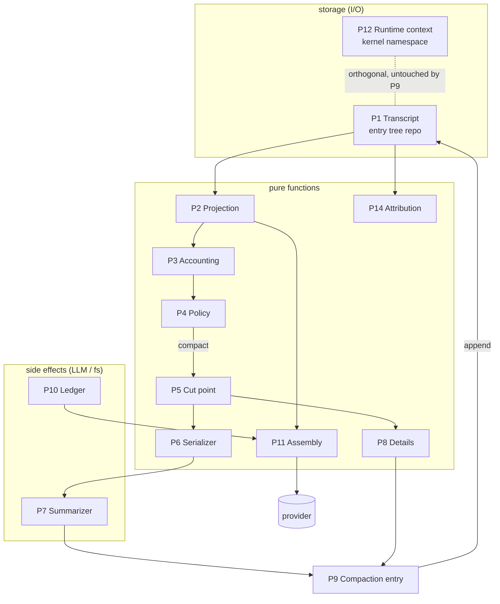
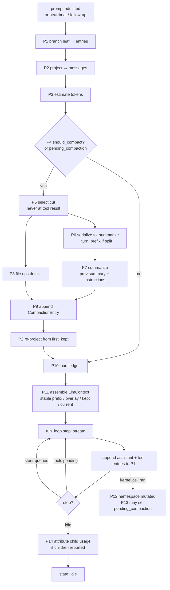
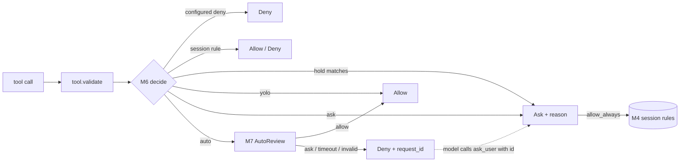
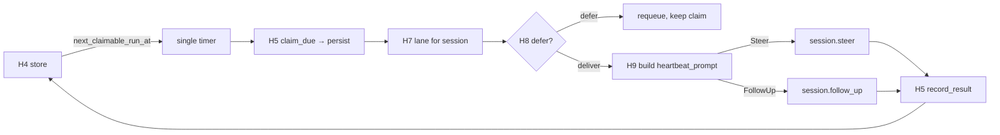
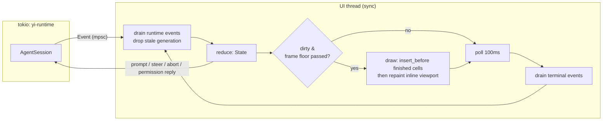

# Yi — design, v2 (Rust greenfield)

Status: living design; version in ARCHITECTURE.md, history in CHANGELOG.md.
Supersedes v1, a Zig fork. Reference checkouts (shallow, gitignored) live under
`ref/` by category: `agents/`, `tui/`, `skills/`, `tools/`, `benchmarks/`.
Exact spans: Appendix A.

Yi is a native Rust coding agent with Pi's core shape and Pi's wire formats, a
Jupyter-kernel runtime (context management, subagents, heartbeats), hashline
editing, and a redesigned advisor. Tools are stateless executables. MCP is an opt-in CLI (mcpc-shaped), never a resident client, and there is no automatic
skill creation.

---

## 1. Decisions (settled)

| Topic | Decision |
|---|---|
| Language | Rust. Deliberately small dependency tree (§13): `tokio` (subset), `serde`, `ureq`+`rustls` (platform verifier), `zeromq`, `jiff`, `globset`, `lexopt`; `ratatui` feature-gated; MCP hand-rolled over JSON-RPC (D70), config-gated at runtime (D36). Binary-size, startup and dep-count budgets ratcheted in CI. |
| Core shape | Pi: pure `run_loop` + callback struct, 13-variant event enum, two queues (steer / follow-up), entry tree session store, compaction as an appended entry. |
| Pi compatibility | **Wire-level, not type-level.** Byte-compatible session JSONL (v3 + harness entries), Pi RPC JSONL protocol, Pi `AgentEvent` JSON. Pi's own tests for those boundaries run against the yi binary (§3). |
| pi-ai | Rust mirror of pi-ai's *types* (`Message`, `AssistantMessageEvent`, `StopReason`, `Usage`, `Model`) with identical serde shapes; provider implementations ported for Anthropic + OpenAI-compatible (+ responses API). Model catalog = pi-ai's generated data as JSON. No Node sidecar. |
| MCP | **Not in the core, off by default** — config-gated (`mcp.enabled`), compiled into every build (D36). Shipped as a CLI surface modelled on `apify/mcpc` (`ref/tools/mcpc`): `<bin> mcp connect … @s`, `@s tools-list|tools-get|tools-call`, `grep`, `--json`. The agent reaches it through `bash` and through the kernel, never through a registered tool. No bridge process unless the server is stateful and the user asks for one (§5.2). |
| Python | Jupyter wire protocol over `zeromq` crate; `ipykernel`; kernel-side package `python/yi_runtime` (module `rlm`) — seeded from a reference runtime, owned and evolved by Yi. |
| Blast-radius classifier | Cut. Permission engine is modes + rules + `irreversible` tool flag. |
| Advisor | Redesigned (§7); §7.1 names the anti-pattern it replaces. |
| Skills | Read-only discovery from disk + Python skills in the kernel venv. No creation, no learning, no refine. Skills roots are model-write-denied. |
| ACP | **v2 only** (D1, revised from "v1 and v2"): native wire shapes are v2 (`state_update`, upsert-by-id, structured diffs, `title`/`subject` permissions). The v1 downgrade adapter is cut — no v1-only client exists in this setup (Afterlife and Zed speak v2); additive later if one appears. `protocolVersion: 1` gets a clean version-mismatch response. |
| Daemon | Phase 6, over ACP v2 (no private protocol). |
| Console | `yi console` (crate `yi-console`, D89/D90): the multi-pane workspace shell, an ACP client over the `yi serve` daemon socket. Pane = session, workspace = repo root; the daemon stays the only session owner. Rendering is client-side from semantic `session/update` frames — no server-side frame streaming, no PTYs, no blit encoder. Pane content is an enum (`Session`/`Markdown`/`Diff`/`Notebook`), never a `dyn PaneView` trait. |

### 1.1 Not in scope (maintained list; one-in-one-out for top-level features)

Resident MCP client in the core · ACP v1 · automatic skill creation/refinement/self-extension ·
blast-radius command classifier (M10's denylist is the whole ambition) · embeddings/semantic
search until grep measurably fails · resident LSP/DAP servers · JS runtime in the core (the
bridge sidecar is external, fail-safe, optional) · WASM/N-API embedding (revisit after phase 7)
· Windows · provider breadth (3 + faux; D16 pass-through covers the rest) · plugin runtime ·
GUI (Afterlife owns it) · mail/browser/computer-use/any capability that is not a coding agent ·
server-side terminal-frame streaming for the console (herdr's model: protocol versioning, blit
encoders, foreground-client size arbitration — Yi's panes are semantic event streams, D89).
Adding a top-level feature requires deleting or demoting one, and editing this list in the same
commit — the upstream guardrail no ratchet can substitute for (§9.1).

---
- Embedding API (napi/WASM binding of yi-runtime; was M4): demoted 2026-08-27 as the
  one-out for the plan system (D53). Rebuild case: an external embedder appears.
- Document conversion (`anydoc` behind a `docs` cargo feature; was M1, §14.6): demoted
  2026-08-31 as the one-out for the console (D89). A format converter is not a coding
  agent's own capability, the kernel venv already reaches every converter Python has, and
  the feature would have carried `pdf-inspector`/`zip`/`quick-xml`/`cfb`/`lopdf` plus a
  fourth cargo gate into a build D36 and D38 spent effort collapsing. Rebuild case: `read`
  of office and PDF files is measured to be a real loop the kernel cannot close.

## 2. Crate layout

Mirrors Pi's package boundaries so the mapping is obvious and the dependency direction is
enforceable with `cargo` (a crate cannot import what it does not depend on).

```
crates/
  yi-types      DTO wall. pi-ai message/content/usage/stop types, AgentMessage, Entry, Event,
                tool contract types, permission types. deps: serde only. No tokio, no fs, no net.
  yi-loop       run_loop(ctx, new_msgs, cfg, signal, emit, stream) + interrupt module (InterruptSignal, SoftInterruptQueue).
                ≤ 1,000 lines. deps: yi-types, tokio (Notify only).
  yi-ai         providers (anthropic-messages, openai-completions, openai-responses), model catalog, StreamFn impl. deps: yi-types.
  yi-session    entry tree repo (JSONL + in-memory), projection, rebuild_context, conformance tests. deps: yi-types.
  yi-context    token accounting, compaction policy + cut-point, summarizer, ledger, assembly. deps: yi-types (store access stays in yi-runtime).
  yi-permission modes, rules, session rule state, holds (advisor), approval request/response. deps: yi-types.
  yi-tools      Tool trait + builtins: read/hashline-edit/write/glob/grep/bash/exec-tools/ipython/subagent/ask. deps: yi-types, yi-permission.
  yi-mcp-cli    mcpc-shaped MCP subcommand (§5.2), compiled into every build, runtime-gated by `mcp.enabled` config, default false (D36, supersedes D9 feature flag). deps: ureq, yi-types (D70: no rmcp).
  yi-kernel     Jupyter client: connection file, ZMQ shell/iopub/control, HMAC, comm host.request dispatch. deps: yi-types.
  yi-runtime    AgentSession: composes everything above; the ONLY constructor of LoopConfig.
                Contains `subagent`, `schedule`, `advisor` as MODULES (single-impl, single-consumer:
                a crate each would buy build fan-out, not a boundary).
                File-size guardrail keeps them honest. deps: all above.
  yi-acp        ACP v2 server, Event → session/update; hand-rolled v2 wire subset (D40). deps: yi-runtime, yi-types.
  yi-tui        ratatui shell (feature `tui`). Consumes Event + AgentSession methods only. deps: yi-runtime.
  yi-console    alt-screen workspace shell (`yi console`, feature `tui`). ACP client over the
                `yi serve` socket; renders from semantic updates. deps: yi-types, yi-tui.
  yi-cli        `yi` binary: composition root; `yi rpc` (Pi RPC JSONL, ~300-line adapter over the
                Event stream — a mode, not a crate) and `yi ask` live here. deps: all.
python/
  yi_runtime/  = Yi's kernel-side Python package, seeded from a reference runtime
                  (rlm/__init__.py, harness.py, skill.py copied; mcp.py rewritten as a subprocess
                  wrapper over `<bin> mcp --json`, §5.2). Yi owns the whole package; the module
                  name `rlm`, `RLM_*` env names and the ready-check string are Yi's wire-internal
                  vocabulary (§6), changeable with the design.
  skills/       compact + attach-image (landed with the kernel); goal, rlm-heartbeat,
                  agent-message with their phases; edit written fresh (hashline-backed)
```

Rules, CI-enforced (§9): `yi-types` has no async/fs/net deps, **no workspace error enum**
(errors are per-crate; `yi-types` holds only serialized error shapes — a surveyed
protocol crate pulled tokio/landlock/seccomp in through one 43-variant `#[from]` enum), and **no channels,
handles, or `*Runtime` types in serialized structs** (CI grep for `Sender`, `Receiver`,
`Arc<dyn`, `Runtime`); `yi-loop` depends only on
`yi-types` (+ tokio::sync::Notify); `yi-tui`/`yi-acp`/`yi-cli` never depend on `yi-tools`,
`yi-ai`, `yi-permission` directly; nothing below `yi-cli` may depend on `yi-mcp-cli`.

---

## 3. Pi compatibility plan ("pass Pi's tests")

Exact type-signature parity with a TypeScript class is the wrong target; JSON boundaries are the
right one. Three contracts, each with Pi tests that can be pointed at yi:

| Contract | Pi source of truth | Pi tests reusable | How |
|---|---|---|---|
| Session file: JSONL, header `{kind:"header", version:4, …}`, mutation lines `{kind: entry|record|lane|fact, …}` (D32), `AgentMessage` shapes, `CompactionEntry{summary, retainedTail, tokensBefore, details?, usage?}`, `BranchSummaryEntry`, `CustomEntry` | `packages/agent/src/harness/session/types.ts`, `coding-agent/docs/session-format.md` | `agent/test/harness/session/{jsonl,jsonl-codec,jsonl-storage,context}.test.ts`, `coding-agent/test/agent-session-{branching,tree-navigation}.test.ts` | yi writes/reads the same files. A `conformance` test fixture dir is shared: Pi writes, yi reads, and vice versa. |
| RPC mode: JSONL commands on stdin, `response`/event frames on stdout, LF framing | `coding-agent/docs/rpc.md`, `src/modes/rpc/` | `coding-agent/test/rpc-jsonl.test.ts`, `rpc-client-*.test.ts` | Tests spawn a binary; make the spawn target configurable (`PI_RPC_BIN=yi rpc`). Pi's `RpcClient` drives yi unchanged. |
| Event stream | `packages/agent/src/types.ts` `AgentEvent` | `agent/test/agent-loop.test.ts` (fake `streamFn`) | yi `yi-loop` has a `faux` provider (Pi `providers/faux.ts`) that replays scripted `AssistantMessageEvent` JSON; the same fixtures drive both. |

Optional later: a `napi-rs` binding exposing `Agent`/`run_loop` to JS so `agent/test/agent.test.ts`
runs directly. Not a product surface; a conformance harness.

What this buys: every Pi extension/script that speaks RPC or reads sessions works against yi;
yi sessions open in Pi's `/resume`; pi-ai fixtures validate the Rust provider port.

What it costs: yi's entry vocabulary is a superset of Pi's (`child_usage_attributed`,
`heartbeat_prompt`, `advisory`, `hold`). Pi tolerates unknown `custom` entries; yi emits its
additions as `custom{customType: "yi/…"}` so Pi keeps loading them.

## 3.1 Pi interop suite (D16–D18)

Beyond wire compatibility, Pi is used as leverage:

- **D16 — provider pass-through (stretch).** A10 generalized: the Bun sidecar exposes all of
  pi-ai's ~30 providers as one `A3` impl. Yi keeps 3 native providers; any other `--provider`
  routes through the sidecar; events return as `AssistantMessageEvent` JSON (already Yi's serde
  shape). OAuth/device-code flows run in Bun where pi-ai implements them. Zero core lines
  beyond A10.
- **D17 — Pi-differential testing (phase 3, test infra).** Pi is the baseline harness in
  `evals/`: record a Pi session, replay the identical prefix through Yi, diff behavior, tool
  calls, and tokens. The token ratchet (§9) reports Yi-vs-Pi per scenario; divergence on
  identical inputs is a reviewed artifact. Pi's own `agent-loop`, session, and RPC suites run
  in CI as a standing conformance job (har-verify differential rung with a free reference
  implementation).
- **D18 — bidirectional live session handoff (stretch).** `yi adopt <pi-session.jsonl>`
  continues a Pi session mid-task; Pi's `/resume` opens Yi sessions — Yi extras ride as
  `custom{yi/*}` entries Pi ignores, and §19 rule 4 guarantees they round-trip. Migration is
  reversible per session: if Yi misbehaves, fall back to Pi on the same file.
- Folded into existing sections: Pi dirs (`~/.pi/agent/skills`, project `.pi/skills`) added to
  the skills roots (§5); **Pi prompt-template markdown loads natively as Yi commands** (X1
  command loader); `yi doctor --from-pi` one-shot settings/template import (X-misc); Pi theme
  files map onto U17 tokens. Ledger ideas (unscheduled): Yi-as-a-Pi-extension proxy (inverse
  migration path); build-time model-catalog sync from the published pi-ai npm package, pinned
  and hashed in the size ledger.

---

## 4. Core (Pi)

### 4.1 Loop

```rust
pub fn run_loop<S: StreamFn>(
    ctx: &mut LoopContext,          // system_prompt, messages: Vec<AgentMessage>, tools
    new_messages: Vec<AgentMessage>,
    cfg: &LoopConfig,               // callbacks; none may fail
    signal: &InterruptSignal,
    emit: &mut dyn FnMut(Event),
    stream: &S,
) -> Vec<AgentMessage>
```

`LoopConfig` fields (Pi): `transform_context`, `convert_to_llm`, `before_tool_call`,
`after_tool_call`, `should_stop_after_turn`, `prepare_next_turn`, `get_steering_messages`,
`get_follow_up_messages`, `tool_execution: Sequential | Parallel`.

Contract: callbacks return values, never `Result`. `StreamFn` failure = final message with
`stop_reason: Error`. `stop_reason == Length` fails every tool call in that message. One
`handle_run_failure` in `yi-runtime` synthesizes `message_end/turn_end/agent_end`.

`Event` (Pi's 11 + 2):
`AgentStart, AgentEnd, TurnStart, TurnEnd, MessageStart, MessageUpdate, MessageEnd,
ToolExecutionStart, ToolExecutionUpdate, ToolExecutionEnd, PermissionRequested, PermissionResolved`.

Not events: session state (`Running | Idle | RequiresAction`) and usage are *derived* by the
runtime reducer (R2) from the stream above — `AgentStart` ⇒ running, `PermissionRequested` ⇒
requires_action, `AgentEnd` ⇒ idle; usage rides on `MessageEnd.message.usage`. ACP's
`state_update` / `usage_update` are emitted by the ACP adapter from reducer output, so the loop
never learns about protocols.

### 4.2 AgentSession (`yi-runtime`)

`subscribe`, `prompt` (returns at admission), `steer`, `follow_up`, `abort`, `wait_idle`,
`reset`, `set_model`, `set_thinking_level`, `set_permission_mode`, `compact`, `state`.
Two `PendingMessageQueue`s with `QueueMode{All, OneAtATime}`. Every surface (`yi-tui`,
`yi rpc`, `yi-acp`, `runtime::subagent`, `yi ask`) uses only this.

### 4.3 Session store (`yi-session`)

Pi harness entry tree. `Repo` trait: `append(ProvisionedEntry) -> Entry`, `branch(leaf) ->
Vec<Entry>`, `leaf()`, `set_leaf()`, `read_all()`. Storage-assigned `seq/parentId/timestamp`
are not constructible by callers. Backends: JSONL (Pi file layout) and in-memory. Conformance
suite ported from `harness/session/testing/conformance.ts`.

---

## 5. Tools (no MCP)

`Tool` trait: `name`, `description`, `schema`, `execute(input, &ToolContext) -> ToolResult`,
`kind: Read|Write|Exec`, `irreversible(&input) -> bool`. `ToolContext{cwd, emit, permission,
caps: Capabilities}` — `Capabilities` is a small struct of `Option<Arc<dyn …>>` (kernel,
background, terminal). No 70-field bag.

Builtins: `read` (hashline header), `edit` (hashline), `write`, `glob`, `grep`, `bash`,
`ipython`, `subagent`, `agent_message`, `ask_user`, `get_context` — one layered, clamped
orientation packet (grid roots, symbol neighborhood, skeletons, change heat, gate commands,
prior mining issues) behind an honest completeness header.

The registry is **closed**: one `const` list; adding a tool edits this section in the same
commit. Tool parameters are typed — never `action: String`, never a synonym-alias table
(a surveyed harness shipped a 43-verb `swarm` with 25 aliases and a 1,155-line
`execute`, §9.1). No two tools with overlapping descriptions (another registered
five file-mutation tools).

**Exec tools** (replacement for MCP): any executable under `~/.yi/tools/` or `<project>/.yi/tools/`.
Contract: `tool --schema` prints `{name, description, input_schema, kind}` (cached by mtime);
`tool` reads JSON args on stdin, writes a JSON result or plain text on stdout, exit code ≠ 0 is a
tool error with stderr as the message. One process per call, nothing resident, no handshake, no
capabilities negotiation. A tool that needs state keeps it on disk. Permission: `kind` from
`--schema`, default `Exec`.

### 5.2 MCP as a CLI, not a client (from `apify/mcpc`)

mcpc's thesis is the one yi adopts: the wrong way to use MCP is to inject tool definitions and
results into the model context on every turn; the right way is a shell command the model
discovers from `--help`, with `--json` output that composes in scripts. That makes MCP a *code
mode* capability rather than a prompt-time one, and keeps the agent core ignorant of it.

What is copied from mcpc:

- **Command grammar**, 1:1 with MCP operations: `connect <server> [@session]`, `close`,
  `restart`, `login`/`logout` (OAuth profiles, OS keychain), `grep <pattern>` across sessions
  (progressive discovery — the model searches instead of listing), `@s tools-list`,
  `@s tools-get <name>`, `@s tools-call <name> [k:=v … | <json> | <stdin]`, `@s resources-*`,
  `@s prompts-*`, `@s tasks-*`, `@s ping`. `--json` emits MCP-spec-shaped JSON on stdout,
  errors on stderr. `--max-chars` truncation for non-JSON output.
- **Session model**: a named `@session` whose metadata lives in `~/.<bin>/mcp/sessions.json`.
  Session states `live | connecting | disconnected | unauthorized | expired`; never auto-removed.
- **Schema snapshots**: `tools-get --schema expected.json` with `compatible | strict` modes so
  scripts fail early on breaking server changes.
- **Agent skill**: a `SKILL.md` in mcpc's shape (`help --skill`) is the *only* thing the model
  sees about MCP, and only when `mcp.enabled = true`.
- ~~Proxy~~: cut (D9) — single-user tool, nothing to shield credentials from.

What is changed, because of the no-resident-process preference:

- **No bridge by default.** MCP `2026-07-28` is stateless; each command connects, negotiates,
  calls, exits. For stateful servers (`≤ 2025-11-25`) a bridge is started only with
  `connect --keep`, and it exits after `mcp.bridge_idle_secs` (default 600) of inactivity;
  the next command reconnects transparently. `@s` names still work in both modes.
- **Off by default.** `mcp.enabled = false` hides the subcommand from the skill list and from
  `bash` allowlists. Turning it on adds the skill and nothing else — no tools are registered.
- **Kernel-native.** `yi_runtime.mcp` keeps the reference Python API
  (`await mcp.tools("@s")`, `await mcp.call("@s", "tool", {...})`, `mcp.reload()`) but is
  re-implemented as a thin wrapper that runs `<bin> mcp --json …` as a subprocess. The
  reference in-kernel client (`mcp.py` `_Generation`/`_Registry`, ~1,000 lines, resident
  connections inside the kernel) is **not** ported; the unavailable pattern
  is pinned in §6. Python code can therefore compose MCP calls with everything else in the
  namespace — the "code mode" mcpc describes — without the kernel holding any sockets.
- Config sources: `~/.<bin>/mcp.json` and standard files (`.vscode/mcp.json`, `.mcp.json`)
  by explicit path. Stdio entries spawn a process for the duration of one command only.

Crate: `yi-mcp-cli`, which speaks JSON-RPC 2.0 itself (D71): line-delimited over a child's
stdio, or POSTed over the tree's one ureq stack for streamable HTTP, never reqwest. rmcp is a
dev-dependency only, serving the reference server the client is tested against. Compiled into every build; `mcp.enabled = false` is the only gate. It is a
dependency of `yi-cli` only; no runtime crate may import it (boundary check).

Skills: discovery roots (workspace `.yi/skills`, `skills/`, `.pi/skills`, `.claude/skills`, `.agents/skills`;
global equivalents), `SKILL.md` frontmatter metadata only at startup, body on invoke. Python
skills = importable packages in the kernel venv. All skills roots are
configured-deny for `write`/`edit`/`bash` targets; not overridable by session rules.

Skill mechanics (D30; the surveyed implementation's real path is <1.5k of 21k lines):

- **No skills tool.** Local skills need a catalog line + absolute path + the existing `read` —
  a `skills.list`/`skills.read` apparatus exists only for remote environments. Saves two
  tool schemas in the preamble.
- **Catalog budget = P16 `skills_meta`**, default 2 % of the model context window, with the
  degradation ladder: full lines → shrink descriptions → drop descriptions → omit skills, each
  step warned. Resolves the 65-bundled-skills vs 8 KB-preamble conflict: the catalog is
  budgeted separately from the §9 preamble assert, bodies are never resident. A budget with a
  carve-out is not a budget — the cap applies to every source equally.
- **`$name` explicit mention** in user text bypasses matching and injects the body directly;
  bodies ride the L4 wrapper so they drop at compaction.
- **Implicit-invocation detection** (~70 lines): count when the model `read`s a `SKILL.md` or
  runs a file under a skill's `scripts/` — the measurement that decides whether 500 KB of
  bundled skills earn their place (§1.1 evidence).
- **Bundled skills materialize once**, guarded by a content-fingerprint marker file (not a
  version string): reinstalls re-materialize on content change, matching installs cost one read.
- **Bounded walk**: depth ≤ 6, ≤ 2,000 dirs / 20,000 entries per root, truncation warns —
  a root pointed at `$HOME` degrades, never hangs. Cache successful catalogs for the session
  (empty and warned ones included), never cache a failed discovery, no filesystem watcher.
- **One matcher syntax** for names/triggers — never semantics that switch on the pattern's
  character class (surveyed hook matchers silently flip exact→regex when a `.` appears).

---

### 5.3 File checkpoints (shadow gitdir)

Four approaches were compared. Pi `git-checkpoint.ts` (53 lines, `git stash create`)
merges on restore, loses untracked files, has no diff, and its dangling commits die
at `gc`; another records sha/branch only and restores nothing. The shadow-gitdir
approach below is the only one meeting all five requirements: per-turn capture,
`/undo`, diff between checkpoints, never commits on the user's branch, works in a
dirty tree.

Mechanism, copied:

- Shadow gitdir at `~/.yi/checkpoints/<project-hash>/` with `--work-tree` = the project.
  Trees only (`git write-tree`) — no commits, no refs, no writes to the user's `.git`.
- Init seeds `objects/info/alternates` with the real repo's object DB and copies its `index`,
  so already-hashed blobs are reused — first capture on a large repo is instant instead of minutes.
- `capture()` is O(dirty + untracked): `diff-files --name-only -z` + `ls-files --others
  --exclude-standard -z`, filtered through `check-ignore --no-index --stdin -z` **against the
  real repo**, untracked files > 2 MiB excluded via the shadow `info/exclude`, then
  `add --all --sparse --pathspec-from-file=-` and `write-tree`.
- Restore is per file: `ls-tree <tree> -- <path>` present ⇒ `checkout <tree> -- <path>`, absent
  ⇒ delete. Only files the agent touched move; the user's concurrent edits stay.
- Diff: `diff --numstat` / `diff --unified=3 <a> <b>`; trees are plain OIDs.
- One lock per shadow gitdir; `gc --prune=7.days` occasionally.

One divergence: **non-git directories still get checkpoints** — init the shadow gitdir
with `--work-tree` on the plain directory, skip alternates/seed, write a builtin skip list
(`node_modules`, `target`, `.venv`, `dist`, `.git`) to `info/exclude`. The reference
disables the feature there; that is where scratch-directory users want undo most.

Skipped (ponytail): v1's `cat-file --batch` diff fast path, batched-checkout path-clash logic,
and v2's dry-run preview index — add when a measured large-repo diff or 500-file undo drags.
Implementation: `std::process::Command` over the `git` binary, NUL-delimited I/O; no `gix`/`git2`
(§13). Estimate ≈ 500 lines in `yi-tools::checkpoint`. If `git` is absent, T14 is a no-op and
`/undo` says so.

Surface: `/undo` (restore every file changed since the last `TurnStart` checkpoint, then capture
again so `/undo` is itself undoable), `/diff` (last turn), ACP v2 `diff` content from T13 over
checkpoint trees.

## 6. Kernel (verbatim runtime)

`yi-kernel` ports a reference kernel client — client, bootstrap, state snapshot and
boot gate, ~3.2k lines; its Linux fork-server (675 lines) is excluded. Mechanism:
the standard Jupyter wire — connection file, spawn `ipykernel` from a
`uv`-bootstrapped venv, shell/iopub/control over ZMQ with `<IDS|MSG>` HMAC framing —
plus the reference's ordering and timing invariants. Every mechanic is pinned in
exactly one K row (K1–K12); this section owns only the host-handler vocabulary and
the Python-runtime contract.

Host handler table (registered by `yi-runtime`, vocabulary verbatim): `rlm.run`,
`rlm.list_subagents`, `rlm.delete_subagent`, `rlm.find_models`, `model.info`, `compact.run`,
`compact.status`, `rlm_heartbeat.*`, `agent_message.*`, `goal.*` (phase 6). Reply envelope and the reserved `status`
key: K7. "Unavailable" is expressed as an error, never as a payload: an unregistered
type errors `host request type "X" is not available`; `mcp.config` returns `{}` (the Python
side raises its own KeyError), `mcp.refresh` throws, `mcp.begin_login` is not registered.
Scheduling handlers (`compact.run`) only *schedule* and return — running inline would abort
the turn whose cell awaits the reply; `rlm.run` returns at admission for the same reason.

Python runtime: seeded by copying a reference runtime verbatim — a one-time de-risk
for the port, not a parity obligation; the package is Yi's and evolves freely. The module name `rlm`,
`RLM_*` env names and the `RUNTIME_READY_CHECK` string were kept because renaming was branding
with a real diff cost and the names are wire-internal; change them whenever it pays, updating
host and check together. `mcp.py` was rewritten at the seed (§5.2) and must keep
`McpIntegration`, `mcp.list_tools`, `mcp.call_tool` importable or the ready-check string
changes with it. `RLM_DEPTH`/`RLM_MAX_DEPTH` are set but never read by Python; the host-side
depth check is authoritative.

Display channels: `application/vnd.yi.{diff,attachment,agent-message}+json`. Payload casing is inconsistent **by design** and
preserved: diff/attachment snake_case; agent-message camelCase (the host's own receipt echoed
back).

Tool: `ipython{code}`, sequential, kind `Exec`.

Independent validation: a surveyed "code mode" is 30k lines plus an embedded sandboxed
V8 — and its own runtime still runs out-of-process over gRPC/WebSocket. The
subprocess-kernel design is what everyone converges on; Yi gets it for zero bytes in
the binary.

---

## 7. Advisor, redesigned

### 7.1 What was wrong with the surveyed advisor

One reference harness ships a watcher advisor. Four things sink it:

1. It sends the primary's *thinking* to the advisor (`expandPrimaryContext`, `watchedRoles`),
   framed as "the agent you are watching". Models read that as being asked to evaluate another
   model's hidden reasoning and refuse. It also leaks the most expensive tokens in the transcript.
2. It runs on **every** turn boundary, re-renders deltas as markdown, and resets/replays on any
   fingerprint divergence. Cache hit rate depends on the rendering being byte-stable, which it
   isn't across compaction or steering.
3. Delivery has three channels and twelve edge cases (`aside | steer | preserve`, immune turns,
   terminal-answer rules, plan-mode rules, ACP deferral). `steer` aborts in-flight tools. The
   model never knows whether an advisory will interrupt it or not.
4. 190 KB of policy to do all this, coupled to `formatSessionHistoryMarkdown` and the session.

### 7.2 Principles

- **Review the work log, not the mind.** The work log is everything the user said and
  everything the primary *emitted*: user messages, tool calls with their declared `i` intents,
  tool results, assistant prose. Thinking blocks are excluded — not because prose is out of
  bounds, but because hidden-reasoning narratives are refused by reviewer models and are
  unreliable evidence (§7.5). Framing stays "review the work log of an automated coding run
  against the task" — code review, not surveillance.
- **A trigger is not a verdict (D50).** Deterministic checks over the entry tree are cheap and
  high-recall, which makes them a fine way to *notice* something and a bad way to *say* something:
  shipped as advice they interrupt on every edit turn that skipped a test. Yi has no deterministic
  reviewer. A project that wants those checks writes a skill, which the model invokes when it
  judges them relevant. The LLM reviewer runs on a sparse cadence under a token budget.
- **Append-only advisor transcript.** The digest is derived from immutable entry ids. Each
  review appends one `user` message (the digest chunk) and one reply. The prefix never changes,
  so provider prompt caching hits on every review. Branch navigation starts a new advisor
  session rather than replaying.
- **Two delivery mechanisms, no races.** Notes land at the next tool boundary as an entry.
  Holds go through the permission engine. Nothing aborts a running tool. Nothing wakes an idle
  primary.
- **One reviewer.** The LLM reviewer is the advisor; with no model role naming it, the advisor observes and says nothing.

### 7.3 Pipeline

```
entry appended ─► Work log (pure, per entry, zero tokens): the append-only ring the digest
                    reads from. No deterministic reviewer sits here (D50).
                 ─► Trigger policy
                    fire if tool_calls_since_review ≥ cadence (unset by default)
                    AND budget.remaining(tokens/hour) > est_cost
                 ─► Digest (pure)  digest(entries[cursor..leaf]) -> Vec<LogLine>; every line
                    carries its entry id (the pull handle, §7.6)
                    user:   verbatim; over budget → constraint-first truncation (§7.6)
                    edit:   "e7f2 edit src/x.rs#1A2B "Fixing off-by-one" L41-50 +3/-2"
                    bash:   "e7f3 bash `cargo test` → exit 1 | tail: <3 lines>"
                    read:   "e7f4 read src/x.rs 1-120"
                    prose:  "e7f5 assistant: <sentences selected by the §7.4 verb table>"
                 ─► LlmReviewer  system: fixed prompt + ADVISOR.md; user: digest chunk;
                    tools: {advise, read, grep, glob, transcript}; one prompt() per review
                 ─► EmissionGuard (ported verbatim): NFKC key, blocklist, FIFO dedupe, 1 note/cycle
                 ─► Delivery
                    Note|Warn  → custom{advisory} entry at next tool boundary;
                                 if idle: follow_up queue (drains on next user prompt/heartbeat)
                    Hold       → yi-permission.holds.insert(HoldRule{pattern, reason, ttl})
                                 ⇒ matching calls become `ask` with the reason shown;
                                 cleared by user, by advisor, or by ttl;
                                 no interactive surface (yolo / headless / --json)
                                 ⇒ degrades to Warn — an Ask nobody can answer is a
                                 hang-to-timeout (D28)
                 ─► Outcome ledger
                    custom{advisory_outcome}: did the next N actions touch the target? was the
                    hold approved/denied? → `/advisor stats`, tunes cadence later.
```

`Advice{severity: Note|Warn|Hold, kind: Correction|Risk|Scope|Stop, target: Option<EntryId|Path>,
text}`. Injected content: `<advisory severity="warn" target="src/x.rs" guidance="weigh, don't
blindly obey">…</advisory>`.

Config: `advisor.reviewer` (false: LlmReviewer; `advisor.cadence` applies
only when explicitly set — a cadence review on a clean run is pure spend, and with neither set
the advisor keeps the work log and says nothing). `advisor.model`,
`advisor.user_budget` (2,000 chars), `advisor.prose_budget` (1,200 chars),
`advisor.budget_tokens_per_hour`, `advisor.signals.*` thresholds, `advisor.wake_idle_primary`
(false). `ADVISOR.md` attention text.

Size target: `runtime::advisor` ≤ 1,500 lines including the signal set.

---

### 7.4 Unbacked claims (what "fabrication detection" means in Yi)

Scope correction from the survey: no reference harness has a transcript-claim-vs-tool-result
verifier. The nearest thing, an `abortOnFabricatedResult`, is a stream-level scan
for the *tool-result opening token* of an in-band tool-calling dialect (`<tool_response>`,
`<function_results>`, …) — it stops a model that starts writing a tool's result itself. That only
exists for text-based tool calling. Yi uses native tool calling exclusively, so there is nothing
to port; if an owned dialect is ever added, the 40-line token scan comes with it.

Yi shipped the deterministic half of the replacement and then deleted it (D50). The claim
extractor was pure text matching — action verbs against a bag of tokens from the turn's tool
arguments — so a summary sentence like "Fixed the offset bug." was unbacked by construction,
and because each fire embedded its own sentence as evidence, `EmissionGuard`'s text-keyed dedupe
never collapsed two of them. High recall with no verdict step is a machine for interrupting.

What survives is the **reviewer question**, which is the part that needed a model all along:
the `LlmReviewer` gets the digest chunk and is asked to cite the log line backing each claim or
say UNBACKED. Output is `Advice{kind: Risk, target: entry_id, severity: Warn}` per unbacked
claim, delivered at the next boundary (or follow-up if idle) — the primary then sees
`<advisory>Claim "tests pass" is unbacked: last `cargo test` exited 101 (entry e7f2)</advisory>`
and must either run the test or correct the claim. The §7.4 verb table survives in
`advisor::digest` for one job: choosing which assistant sentences survive the prose budget.

A project that wants a deterministic pre-check — "did edits land with no test run?" — writes it
as a skill. The model invokes a skill when it judges the moment relevant, which is the judgment
step the runtime could not supply.

### 7.5 Research grounding (Aug 2026 pass) and v2 revisions

The advisor design was checked against current test-time-compute / monitoring literature. What
survived, what changed:

**Confirmed by the literature (unchanged):**

- *Small, cheap critic steering a frozen large agent works and pays for itself.* "Steer, Don't
  Solve" (arXiv 2606.21811): a compact critic reviewing the trajectory every k steps with
  **strategy-level** feedback lifts SWE-bench +3.8–5.2 pts at 30–92× lower critic cost — and
  *shortens* trajectories, so the critic is token-negative. Yi's advisor is exactly this shape.
- *Action-only observation is the robust choice, not just a refusal workaround.* Weak-to-strong
  monitoring (arXiv 2508.19461) finds scaffold structure beats input richness; "A False Average"
  (arXiv 2608.00583) shows CoT-based monitors collapse (95 % → <11 % catch rate) when the
  reasoning narrative is controlled while actions stay identical. The digest's never-thinking
  rule stays; v3 widens the log to the primary's *emitted* prose (§7.6, D19) — the collapse
  result indicts hidden-reasoning narratives, not the visible record of what was said and claimed.
- *Compact trajectory representation is the substrate.* "Scaling Test-Time Compute for Agentic
  Coding" (arXiv 2604.16529): long-horizon scaling "is fundamentally a problem of
  representation, selection, and reuse" — their rollout summaries preserve *hypotheses,
  progress, failure modes*. V4 gains a derived header: `{task, current plan step, files_touched,
  last_failure}` above the action lines.

**Changed by the literature:**

- **No panel, no synthesis — judge-selection only.** "When Agents Disagree" (arXiv 2603.20324):
  MoA-style synthesis of multiple agents' outputs performs at chance (51.2 % win rate) while
  judge-based *selection* wins 81 %; selector quality beats generator diversity, and adding a
  *weaker* model can help. Consequence: the advisor is one judge; a second opinion, if ever
  added, is a judge choosing between two candidate advices, never a synthesizer merging them.
  The surveyed multi-advisor roster stays cut on evidence, not just taste.
- **Trajectory diagnostics are the right things to look for, not the right thing to ship**
  (TraceProbe, arXiv 2607.06184: search loops are the most stable anti-pattern; verification
  skips localize failures). Yi built `search_loop`, `verification_skip` and four siblings as
  runtime signals and deleted them (D50) — the diagnostics describe what a reviewer should
  notice, and Yi's mistake was letting the noticing layer speak. They are the natural content of
  a project's own review skill, and of the LLM reviewer's prompt.
- **The advisor crate is Yi's judgment layer, singular.** Slipstream (arXiv 2605.08580)
  validates compaction summaries with a cheap judge against the agent's continued reasoning
  (+8.8 pts on SWE-bench Verified); best-of-N selection over compact summaries (RTV, 2604.16529)
  needs the same judge. Rather than three judge implementations, `Reviewer` gets one enum of
  jobs: `Advise`, `ClaimAudit` (§7.4), `CompactionCheck` (validates a P7 summary names the
  forward intent and constraints; on failure the compaction is retried once with the gaps
  appended to the directive), and `SelectCandidate` — the last two deferred per D8/D10.
  One budget, one emission guard, one append-only transcript discipline, one model role.

**Cross-session learning stays user-gated, now with a mechanism.** TRACE (arXiv 2606.13174):
corrections stored as memory text keep being violated (Mem0 left 57.5 % of applicable checks
violated); corrections **compiled into runtime checks** drop violations to 2–37 %. Yi's
translation: when advice or a user correction expresses a standing constraint, the advisor
*proposes* a Hold; `/advisor promote <advice-id>` compiles it into a permission rule (M4/M5) —
enforced at the tool gate, not recalled as prose. Nothing persists without the user's promote.
Agent-ToM's critique-distillation (arXiv 2605.24216) is the automatic version of this; rejected
for the same reason auto-skills are.

### 7.6 What the advisor sees (context contract, v3)

The advisor never receives the primary's context. What it gets is governed by three prose
classes with one rule each — the innovation is the selection, not the volume:

- **User prose is ground truth: verbatim, always.** Every user message enters the digest
  verbatim — the rarest, densest lines in a run, and the thing the run is reviewed *against*.
  Over `advisor.user_budget`, truncation is **constraint-first**: sentences carrying
  negation/scope markers (`never, don't, no, not, only, must, instead, stop, wait, actually`)
  survive first, then recency; elided spans are marked with their entry id for pull. The header
  additionally carries a **directives panel** (V12): the standing constraint sentences from all
  user messages so far, verbatim (mempalace rule — the user's words, never a paraphrase),
  append-only. The primary's context may compact; the user's directives never blur.
- **Assistant emitted prose is the intent trace: selected, attributable.** Inter-tool and final
  assistant text is sentence-selected by the §7.4 verb table (one table, two uses): claims
  (`ran, fixed, passes, …`), commitments (`will, next, then, instead`), conclusions (`because,
  so, root cause`), plus each block's first and last sentence, capped by `advisor.prose_budget`.
  Tool lines already carry the declared `i` intent (T1), so intent-vs-action divergence is
  visible to the reviewer at zero extra cost — no intent parser, and no deterministic signal
  at all (D50).
- **Thinking is never sent** (§7.2, §7.5).

Its context, in full:

1. fixed system prompt + `ADVISOR.md` (stable, cached),
2. derived header: task sentence, active plan/goal step, `files_touched`, last failure line,
   directives panel (V12),
3. digest chunks appended since its cursor (V4: user verbatim · assistant selected · tool+intent
   lines; every line entry-id'd; immutable ids → append-only),
4. its own prior advice + outcomes (already in its transcript),
5. on `ClaimAudit`: the extracted claims; on `CompactionCheck`: the candidate summary.

Tools: `{advise, read, grep, glob, transcript}` — `transcript{entry_id, range?}` (V13) returns
the full text of any user/assistant entry named in the digest (never thinking blocks, never
another session). Pull beats push: file and transcript context is fetched when the digest is
insufficient, which is cheaper than pushing slices it usually doesn't need (ARC-style
addressable recall, arXiv 2607.25066, same principle as T16). Nothing is ever re-rendered: a
branch switch starts a new advisor session.

## 8. Primitives by module

Every module is specified the same way: a numbered table of primitives (pure functions, small
traits, data types), each with a signature, a purity mark, and the reference implementation it
is decomposed from. Only primitives marked **I/O** may touch the filesystem, network, processes,
or a model. Everything else is property-testable in isolation. Module prefixes: L loop · R runtime
· S session · P context · A provider · I interrupt · M permission · T tools · K kernel · B subagent
· H schedule · V advisor · C acp.

### 8.1 Context management (`yi-context`)

The reference implementation packs ~10 responsibilities into one session file plus a
compaction file. Decomposed into primitives, each a pure function or a small trait, each with
its own tests:

| # | Primitive | Signature | Source |
|---|---|---|---|
| P1 | **Transcript** | `Repo::append / branch(leaf)` | Pi entry tree |
| P2 | **Projection** | `project(branch: &[Entry]) -> Vec<AgentMessage>` — drops non-message entries, applies latest compaction/branch summary | Pi `rebuildContext` |
| P3 | **Accounting** | `context_tokens(usage) -> u64` (`total` or in+out+cache_r+cache_w); `estimate(messages) -> Estimate{tokens, usage_tokens, trailing_tokens, last_usage_index}` (last authoritative usage + chars/4 for trailing); `scope: Total \| BodyAfterPrefix` — body-after-prefix subtracts `prefill_input_tokens` (server-observed from the window's first response, estimated fallback) so the ~10 %-priced cached prefix is not charged full price against the compaction budget | — |
| P4 | **Policy** | `should_compact(tokens, window, Settings{reserve: 16_384, keep_recent: 20_000}) -> bool`; measures P3's `BodyAfterPrefix` by default (the reference leaves ~2.4× Yi's old headroom and its compactions rarely fail mid-flight) | — |
| P5 | **Cut point** | `select_cut(branch, keep_recent) -> Cut{first_kept_entry_id, to_summarize, turn_prefix, is_split_turn}` — never at a tool result; walks back accumulating estimates | — |
| P6 | **Serializer** | `serialize(messages) -> String` (`[User]/[Assistant]/[Tool result]`, results truncated 2,000 chars) | — |
| P7 | **Summarizer** | `trait Summarizer { fn summarize(last_request: &LlmContext, prev: Option<&str>, directive: &str) -> Summary }` — **prefix-aligned** (§14.5): replays the last routed request byte-identically (tools included — the reference drops them and cache-misses every compaction) and appends the directive as a trailing user message; split-turn = two summaries merged. Overflow recovery: trim from the **front** and retry (prefix-preserving); on a model switch mid-history, summarize with the **outgoing** model, current-model fallback | — |
| P8 | **Details** | `file_ops(messages) -> Details{read_files, modified_files}` cumulative across compactions | — |
| P9 | **Compaction entry** | `CompactionEntry{summary, first_kept_entry_id, tokens_before, details, window: {first, previous?, id, number}}` appended; nothing deleted. Window ids chain compactions (surfaced to the model), per-window one-shot latches kill repeat advisories. `Compaction::Roll` variant = summary-less window roll (same hooks, same entry) — the fallback when the summarizer itself fails | Pi |
| P10 | **Ledger** | `HarnessState{entries: {prompt, memory, subagent}, scope: local|global}`; `load(mtime-synced)`, `format_for_prompt(limits)` | — |
| P11 | **Assembly** | `assemble(StablePrefix{system, ledger, summary}, overlay: &[WorldStateDiff], kept: &[AgentMessage], current, suffix) -> LlmContext` with cache tiers. The overlay is **append-only diffs** (P18): full world state injected once per window, deltas appended at the tail thereafter — the prefix is never disturbed by a changed value | — |
| P12 | **Runtime context** | kernel namespace; orthogonal; survives P9 untouched; snapshot/restore is the kernel's job | — |
| P13 | **Scheduling** | `compact.run` from a cell or `/compact` sets `pending_compaction`; executed at the next **message boundary inside the tool loop** (a tool-heavy turn can otherwise blow the window before the turn ends), with post-compaction placement rules — summary is the last item the model sees; initial context re-injected before the last real user message. Model read side: `compact.status` returns `{tokens, context_window, percent, scheduled}` | — |
| P14 | **Attribution** | `child_usage_attributed{parent_entry_id, usage, aggregate, origin}`; `own_and_total_usage(tree)` | — |
| P15 | **Branch summary** | P7 applied on `/tree` navigation → `BranchSummaryEntry{from_id, summary}` | Pi |
| P16 | **Source budgets** | `SourceBudgets{project_instructions, skills_meta, ledger, advisories, emergency_ceiling}` bytes; `fit(source, budget) -> Truncated{text, marker}`; enforced in P11 | — |
| P17 | **Retention floor** | `retain_floor(branch, budget: 64_000) -> Vec<EntryId>` — every real user message survives compaction verbatim (role filter, newest-first token budget, oldest middle-truncated; prior summaries and contextual fragments dropped); union with P5's kept suffix. P5 keeps the working set, P17 guarantees no early user requirement is ever summarized away | — |
| P18 | **World state** | `trait WorldStateSection { name; snapshot() -> Snapshot; render_diff(&prev) -> Option<Fragment> }` — named sections (env, permissions, ledger view), diff rendered only on change, appended at the overlay tail; per-turn re-injection is a diff or it is nothing | — |
| P19 | **Compact view** | `compile_view(attributed, previous) -> CompiledView{outstanding, brief, earlier}` — extractive index (D115): user turns stay out of the brief (P17 already keeps `UserContent::Text`); assistant prose is omitted; a successful tool result is a pointer (`tool: name → N chars`) and only `is_error` or a non-zero exit code makes an outstanding line; a read whose path a later message edits is `stale`; `[Earlier]` indexes rolled brief windows as `(#first..#last)` (cap 24); `[Kernel]` carries the persist note; `compose_summary` prefixes the view ahead of the full P7 checkpoint and persists the brief and `[Earlier]` lines in `CompactionDetails.extra`, which is what the next round rolls. Recall is `SessionStore::grep` behind the host verb `history.grep` (`compact.recall` in the kernel), then `history://<agent>/<entryId>` fetches the full entry | ARC (arXiv 2607.25066) |

Only P1, P7 and P10 perform I/O. P2–P6, P8, P9, P11, P13, P14, P17, P18, P19 are pure and property-testable.

#### 8.1.1 Layering



#### 8.1.2 Turn flow



---

### 8.2 Loop (`yi-loop`, from Pi `agent-loop.ts`)

| # | Primitive | Signature | Purity | Source |
|---|---|---|---|---|
| L1 | LoopContext | `{system_prompt, messages: Vec<AgentMessage>, tools: Vec<ToolDef>}` | data | pi `types.ts` |
| L2 | LoopConfig | struct of callbacks (§4.1); ≤ 12 fields, CI-checked | data | pi `AgentLoopConfig` |
| L3 | transform_context | `fn(&[AgentMessage]) -> Vec<AgentMessage>` — compaction/ledger view; must not fail | pure cb | pi |
| L4 | convert_to_llm | `fn(&[AgentMessage]) -> Vec<Message>` — custom/heartbeat/advisory entries → `user` wrapped `<yi_internal_context source="heartbeat\|advisory\|goal">…</yi_internal_context>` (source label validated `[a-z][a-z0-9_]*`; registered wrappers are recognized and **dropped at compaction**, so injected prompts never accumulate across windows); drop internal kinds | pure cb | pi |
| L5 | StreamFn | `fn(model, LlmContext, opts, &InterruptSignal) -> impl Stream<AssistantMessageEvent>`; failure = final `stop_reason: Error`, never `Err` | I/O | pi-ai |
| L6 | reduce_partial | `fn(&mut AssistantMessage, &AssistantMessageEvent)` — builds the partial from `text_delta`/`thinking_delta`/`toolcall_*`; **fold for display, execute from the terminal item** — where an API delivers the complete tool call whole, never execute one assembled from deltas; commits are per completed item (D29) | pure | pi-ai |
| L7 | extract_tool_calls | `fn(&AssistantMessage) -> Vec<ToolCall>`; if `stop_reason == Length` every call is failed, none executed | pure | pi `agent-loop.ts:212` |
| L8 | execute_tools | `fn(calls, mode: Sequential\|Parallel, before, after, &InterruptSignal) -> Vec<ToolResultMessage>`; skipped calls still get synthesized results | I/O (via tools) | pi |
| L9 | drain points | `get_steering_messages()` after each tool batch; `get_follow_up_messages()` only when the loop would otherwise exit | pure cb | pi `PendingMessageQueue` |
| L10 | stop policy | `should_stop_after_turn(ctx) -> bool`; `prepare_next_turn(ctx) -> Option<NextTurn{messages, model, thinking}>` | pure cb | pi |
| L11 | Event | 13-variant enum (§4.1); emitted in a fixed order per turn | data | pi `AgentEvent` |
| L13 | repair_tool_call | `fn(raw: &RawToolCall) -> Option<ToolCall>` — one deterministic repair (balance JSON, trim trailing garbage, exact-case tool-name match); otherwise the call fails with the parse error | pure | — |
| L12 | run_failure | `fn(err) -> [MessageStart, MessageEnd, TurnEnd, AgentEnd]` synthesized so observers never see a truncated stream | pure | pi `handleRunFailure` |

Invariant: `yi-loop` contains no `Result` in its public API and no branch that inspects a
provider-specific error. Anything that can fail is encoded as a value by L5 or L8.

### 8.3 Runtime (`yi-runtime`, from Pi `agent.ts` + `agent-session.ts`, minus the product sprawl)

| # | Primitive | Signature | Purity | Source |
|---|---|---|---|---|
| R1 | AgentState | `{status: Running\|Idle\|RequiresAction, messages, model, thinking, usage, pending_permission}` — status and usage are derived here, never emitted by the loop | data | pi `AgentState` |
| R2 | reduce | `fn(&mut AgentState, &Event)`; state is updated **before** listeners are notified, in subscription order | pure | pi `processEvents` |
| R3 | PendingMessageQueue | `{mode: All\|OneAtATime}`; `push`, `drain`, `clear`, `is_empty` — two instances (steer, follow_up); **durable** (D30): pushes persist as `custom{queued_input}` entries so queued steering survives a crash/Ctrl-C mid-turn (~20 lines given S1 `Custom{}`) | data | pi `agent.ts:120` |
| R4 | Turn | `{id, attempt_budget, consumed_attempts, recovery_checkpoint, stop_state}` + `step() -> StepOutcome{Continue, ToolsPending, Stop(reason), Interrupted(point)}` | pure | — |
| R5 | build_loop_config | `fn(&AgentSession) -> LoopConfig` — the only constructor in the workspace | pure | new |
| R6 | prompt | `fn(msgs) -> Admitted` — appends `user` entry, reducer goes `Running`, returns before any model call | I/O | ACP v2 semantics |
| R7 | steer / follow_up / abort / wait_idle | thin wrappers over R3 + `InterruptSignal` | I/O | pi |
| R8 | hook bridge | **In-process hook trait stays cut.** Stretch (D14): blocking wire hooks to external processes over stdio JSON (schemas in `yi-types`, §19); per-hook timeout ~500 ms, fail-open/closed per hook, off by default. **L1** = 4 hooks (`before_agent_start`, `context`, `tool_call`, `tool_result`) + events + exec tools ≈ 15–20 % of Pi's 78 example extensions; **L2** adds `registerCommand` [34/78], session lifecycle [11/78], `before_compact`, `input` [7/78], ctx.ui-lite (→ U12/U24) + Bun sidecar autostart ≈ 60–65 % (~90 % of non-UI, unmodified — fs/spawn works because the shim runs in real Bun); **L3** remote-rendered UI ≈ 92–96 % — corpus math and the never-list in §8.16 | wire | pi extension contracts (A.1); measured 2026-08-21 |
| R10 | tracing | `tracing` spans: `turn`, `provider_attempt`, `tool`, `compaction`, `advisor_review`; JSON export with `YI_TRACE=1`; no vendor SDK | I/O | pi telemetry · har-layout |
| R9 | retry constants | `MAX_CONTEXT_LIMIT_RETRIES = 5`, `MAX_EMPTY_POST_TOOL_CONTINUATIONS = 5`, … each with its incident in a doc comment; `RetryPolicy{max_attempts, max_delay_ms, max_total_wall_ms}` — **every backoff has a ceiling and every ladder a total wall-clock budget**; a transport fallback never resets the attempt counter; stream idle timeout ≤ 60 s; every retry user-visible from attempt 1 (a surveyed uncapped backoff × counter-reset fallback gave a ≈ 50 min silent hang, first notice suppressed in release) | data | — |

### 8.4 Session store (`yi-session`, from Pi `harness/session`)

| # | Primitive | Signature | Purity | Source |
|---|---|---|---|---|
| S1 | Entry | tagged union: `Message`, `Compaction`, `BranchSummary`, `ModelChange`, `ThinkingLevel`, `ActiveTools`, `Custom{custom_type, data}`; base `{type, id, seq, parent_id, timestamp}` | data | pi `harness/session/types.ts:16` |
| S2 | ProvisionedEntry | `Entry` minus `seq/parent_id/timestamp`; the only thing `append` accepts | data | pi |
| S3 | IdGenerator | `fn next() -> EntryId` (ulid-like, sortable); session ids `[0-9a-z-]{8,64}` validated before any path join | pure | pi |
| S4 | Repo | **Corrected to the implemented v4 contract** (the five-method sketch predated D32/D33): `trait SessionRepo { create, open, list, delete, fork } -> SharedSession` (Arc<Mutex<SessionStore>>); `SessionStore` = replay state + `append_entry/record/message/custom/compaction`, `find_entries[_on_branch]` with cursor semantics, `find_records`, `find_open_operations`, `fork_mutations` | trait | pi `harness/session` (v4) |
| S5 | JSONL codec | header `{kind:"header", version:4, id, createdAt, cwd, …}`; one mutation per LF line (`kind: entry\|record\|lane\|fact`, D32); v3 files migrate on load; the domain `Entry` enum serializes through a **separate wire enum** (`yi-types::wire`, fixture-locked byte-identical) so the domain type can be refactored without touching the on-disk shape (§19 rule 1's second half) | pure (encode/decode) | pi `jsonl/codec.ts:1-240` |
| S6 | JsonlRepo / MemRepo | S4 over a file / over a Vec. File repo: append-only; **no fsync on the hot path is the stated choice** (crash safety = ordered appends + the next two rules); **newline re-termination on every open** (a crash mid-write leaves a partial line; append `\n` before writing — 3 lines, prevents corrupt-forever); **deferred file creation** (no disk touch until first entry — `--help` and abandoned sessions leave nothing); load tolerance ladder: skip blanks, count-and-skip bad JSON, hard-fail only on an unknown field that changes replay semantics — and it is the **one** reader with the **one** tolerance policy | I/O / pure | pi |
| S7 | lane records | **Revised by D32** (was: cut). Pi's v4 wire interleaves lane/operation records with entries; `yi-types::record` models all nine so Pi files read and re-emit byte-identically. Yi still *maintains* no operation log: crash recovery stays tree-derived (leaf assistant message with unresolved tool calls ⇒ synthesize `ToolResult{error: interrupted}`, I4); Yi-native writes are entry/lane/fact only, records preserved pass-through. | data | pi `harness/session/types.ts:87-209` |
| S8 | tree ops | `fork(from_id) = set_leaf(from_id)`; `navigate(id)`; `label(id, text)`; `rewind(n)` = `set_leaf(ancestor)` — no copies, no deletes | pure | pi |
| S9 | list / search | `list(dir) -> Vec<SessionHeader>`; `grep(pattern) -> hits` over headers + first user message | I/O | pi |
| S10 | conformance | shared test suite every `Repo` impl must pass | test | pi `testing/conformance.ts` |

### 8.5 Provider (`yi-ai`, from pi-ai)

| # | Primitive | Signature | Purity | Source |
|---|---|---|---|---|
| A1 | Model | `{provider, id, api: Api, context_window, max_output, reasoning: bool, cost: {in, out, cache_r, cache_w}}`; catalog loaded from pi-ai's generated JSON | data | pi-ai `models.ts` |
| A2 | Message / Content | `User \| Assistant \| ToolResult`; `Text \| Image \| Thinking \| ToolCall`; serde-identical to pi-ai | data | pi-ai `types.ts:467` |
| A3 | Api adapter | `trait { build_request(model, ctx, opts) -> HttpRequest; parse_event(bytes) -> Vec<AssistantMessageEvent> }` — one per API (`anthropic-messages`, `openai-completions` (D34 OpenRouter), `openai-responses` (D57 native OpenAI)); the **terminal-event decision lives here**, never per-transport (a surveyed harness ends the turn on `response.failed` immediately on WS but waits for EOF on SSE; Responses terminals are `completed`/`incomplete`/`failed`/`error` and must not wait for body EOF); a terminal event returns without waiting for stream EOF; malformed frames skipped, never fatal; design name `openai-chat` is the completions wire, implemented as `openai-completions` | pure | pi-ai `providers/*` |
| A4 | Transport | `fn send(HttpRequest, &InterruptSignal) -> impl Stream<Bytes>`; SSE decode; idle timeout is **per-poll** (inter-event gap ≤ 60 s), never wall-clock; retry with backoff on 429/5xx before first byte, and **after** first byte too (D29): every completed item is committed to the tree as it arrives and a retry rebuilds the request from the tree — partials never enter history, so the retry is a fresh request from a consistent prefix (delivery certainty still gates anything side-effectful); transport fallback is one-way, latched, counted, and never resets the attempt counter; channels bounded **end-to-end** (one unbounded hop makes the pipeline unbounded); honors `HTTPS_PROXY`/`HTTP_PROXY`/`NO_PROXY` incl. inline basic-auth — `ureq` does not read proxy env itself, and pier's air-gapped tasks route the provider through an authenticated Squid sidecar (§15, E2) | I/O | pi-ai |
| A5 | Usage | `{input, output, cache_read, cache_write, total?, cost}`; `normalize(provider_usage) -> Usage`; **wire JSON is Pi's camelCase** (`cacheRead`, `cacheWrite`, `cost: {total}`) — harbor's Pi-shaped parser silently reports zeros on snake_case (§15, E5) | pure | pi-ai |
| A6 | Auth | `api_key(provider) -> Option<Secret>` from env / keychain; OAuth for providers that need it | I/O | pi-ai `auth/` |
| A7 | faux | scripted `AssistantMessageEvent` replay for tests; shares fixtures with Pi | pure | pi-ai `providers/faux.ts` |
| A8 | cache hints | `cache_policy: Stable \| NoCache` per message block → provider-specific cache control | pure | — |
| A9 | quirks | the single home for provider tolerance: lenient decode, arg coercion, error-text classification; every rule carries a named test citing the provider/issue that created it; leniency outside this module is a boundary violation | pure | new (§9.1) — a surveyed harness scattered the same job across 4 files |

### 8.6 Interrupt (`yi-loop::interrupt`)

| # | Primitive | Signature | Purity | Source |
|---|---|---|---|---|
| I1 | InterruptSignal | `{fired: AtomicBool, wake: Notify, epoch: AtomicU64}`; `fire()`, `is_fired()` (sync, no await), `wait()`, `reset_if_epoch(e)`. The signal is per-session and outlives a turn, so a run reads `epoch()` at admission and `reset_if_epoch` at the start of the spawned run — an unreset signal makes the first abort poison every later turn, and an unconditional reset swallows an interrupt fired in the gap. `wait()` is the only interrupt checkpoint a streaming answer has: L5's providers take the signal but cannot cancel an in-flight HTTP body, so the stream consumer selects on it `biased` and ends the turn `Aborted` with the partial intact | data | — |
| I2 | SoftInterruptQueue | `Mutex<Vec<SoftInterrupt{text, source, urgent}>>` — std mutex, enqueue without the session lock | data | — |
| I3 | InjectionPoint | enum `AfterTurnNoTools \| BetweenTools \| BeforeProvider`; outcome enums `NoToolCallOutcome`, `PostToolOutcome` | data | — |
| I4 | synthesize_skipped | `fn(skipped: &[ToolCall]) -> Vec<ToolResultMessage>` — keeps the transcript valid when an urgent interrupt skips remaining calls | pure | — |

### 8.7 Permission (`yi-permission`, minus the reference's classifier)

| # | Primitive | Signature | Purity | Source |
|---|---|---|---|---|
| M1 | PermissionMode | `Ask \| Auto \| Yolo` | data | — |
| M2 | Rule | `{permission: Tool\|Command\|Path, pattern: glob, action: Allow\|Deny\|Ask}` from config (precedence: configured deny > session rule > session grant) | data | — |
| M3 | RuleKey | `{kind: Command\|FileMutation\|StructuredTool, digest: sha256(canonical(tool, args)), canonical}`; `RuleId(u64)` monotonic | pure | — |
| M4 | SessionRuleState | `{rules: Vec<Rule{id, key, decision, generation}>, next_generation}`; persisted inside the session header; `max_rules = 1024` | data | — |
| M5 | Hold | `{pattern, reason, ttl, source: Advisor\|User}` — turns matching calls into `Ask` with `reason` attached; advisor-sourced Holds degrade headless (§7.3, D28) | data | new (§7) |
| M6 | decide | `fn(call, mode, &[Rule], &SessionRuleState, &[Hold], irreversible: bool) -> Decision{Allow, Deny{reason}, Ask{title, description, subject}}` | pure | — |
| M7 | AutoReview | **deferred to phase 6+ (D3).** Launch `auto` mode is deterministic: Read-kind → allow; Write/Exec → ask unless a rule or hold decides; no model call. A model reviewer lands only if deterministic-auto nags in practice | I/O (model) | — |
| M8 | action-bound approval | **deferred with M7 (D3)** — exists only to make M7's recoverable denials safe | pure | — |
| M10 | catastrophic denylist | `is_catastrophic(path_or_cmd_targets) -> bool` — home dir, device nodes, the workspace `.git`; denied in **every** mode including yolo; checked before M6; ~200 lines, path-based, no command parsing (D15). Path checks use a **purely lexical normalizer** (pops `..`, skips `.`, never touches the filesystem — `canonicalize()` fails on the file being created, the common case); write-escalation to a parent dir double-filters so an already-writable dir can never escalate to its parent | pure | — |
| M11 | mode fragments | one short prompt fragment per `PermissionMode`, selected into the system prompt and tested per mode — the model must be *told* what the current mode allows; not knowing is why models retry denied operations (a surveyed harness ships a policy×sandbox fragment matrix with 752 lines of selection tests) | data | — |
| M9 | PermissionRequest / Response | `{title, description, subject: ToolCall\|Command, options: [allow_once, allow_always, reject_once, reject_always]}` → `Selected(option)\|Cancelled`; `allow_always` ⇒ M4 insert | data | ACP v2 |



Rules from a surveyed permission post-mortem (D26): an **unparseable command is a distinct
decision input** (`ParseOutcome::Unparsed`) with its own rule, never re-keyed onto `bash` —
that reference collapses any redirect/substitution/glob to `["bash","-lc",…]`, prompts under
its strict policy, and bans the only rule that could stop it, so `rg foo | head` prompts
forever. A denial
**carries its evidence** — never a generic "command failed; retry?" while the violation text is
discarded. In `auto`, a sandbox/deny outcome surfaces as `Ask`, never as a silent terminal tool
error. Compound commands decide **per segment**; the aggregate names the segment that forced
escalation. Default writable roots include the toolchain caches (`~/.cargo`, `~/.npm`,
`~/.cache`) — a sandbox that blocks `cargo build` is wrong, not strict. `decide()` inputs are
memoized on `(mode, rules_hash)` — never recompiled per call.

### 8.8 Tools (`yi-tools`: dispatch contract + hashline editing)

| # | Primitive | Signature | Purity | Source |
|---|---|---|---|---|
| T1 | Tool | `trait { name, description, schema, kind: Read\|Write\|Exec, intent: Require\|Omit\|Derive(fn), irreversible(&input) -> bool, validate(&input) -> Result<(), String>, execute(input, &ToolContext) -> ToolResult }`. `to_definition()` prepends `i: {type: string, description: "concise intent"}` to `properties` (and `required` when `Require`; pushed into each `anyOf` branch for union roots); `i` is stripped **before** validation, never enforced, and rides `ToolExecutionStart.intent`. `format: JsonSchema \| Freeform{grammar}` (D29): `edit` ships its hashline patch as a freeform/grammar tool on `openai-responses` — no JSON escaping on the largest model-emitted payload (~5-15 % token tax + an escaping-error class); everything else stays JSON | trait | — |
| T2 | ToolContext | `{cwd, emit, permission: PermissionHandle, caps: Capabilities{kernel?, background?, terminal?}}` | data | replaces the reference `DispatchContext` |
| T3 | Registry | `Vec<Arc<dyn Tool>>` + lookup by name; built-ins + discovered exec tools | data | — |
| T4 | ExecTool | discover `~/.yi/tools/*`, `.yi/tools/*`; `--schema` (mtime-cached) → T1; run: JSON stdin → stdout; exit ≠ 0 → error(stderr). **Project-level tools are hash-pinned trust** (D30): a `.yi/tools/*` executable runs only after a user-level grant recording its content hash; an edited tool becomes `Modified` and stops running — a cloned repo's tools are arbitrary code, and trust grants never come from the project layer | I/O | new (§5) |
| T5 | SnapshotStore | `{key: realpath, tag, text, seen_lines}`; `put(path, text, seen)`, `by_tag(path, tag)`, `by_content`; 4 MiB cap; collision-tolerant | data | — |
| T6 | hashline format | `compute_tag(text) = xxh32(strip_trailing_ws(text), 0) & 0xffff` → 4 hex; `header(path, tag)`; `numbered(lines)` | pure | — |
| T7 | normalize | `detect_eol`, `to_lf`, `restore_eol`, `strip_bom`; Unicode confusables table (unicode dashes/curly quotes/NBSP+exotic spaces → ASCII, the `git apply` fuzz set) applied **to the tag computation on both sides** so file identity survives a model that has been reading `.md` | pure | — |
| T8 | patch parser | `parse(input) -> Patch{sections: [{path, tag, hunks: [Put\|Cut\|Rem\|Mv]}]}` with the reference's lenient recoveries + warnings | pure | — |
| T9 | apply | `fn(snapshot_text, &Section, &mut Registers) -> Result<Postimage, MismatchError>`; all line numbers index the original; overlaps rejected; no fuzzy, no tree-sitter. Register ops counted in session stats — kept on move-token economics, revisit with data (D11) | pure | — |
| T10 | prepare / commit | `prepare(patch, fs) -> Prepared{per-section postimages, diffs}`; `commit(Prepared) -> Written{done, not_written, unknown}` — `unknown` = write errored after partial output (decides whether T14 restore is safe); **`commit` re-validates path constraints and symlink status at write time** (approval of a diff is not approval of a path; one test mirrors the reference `no_follow_rechecks_paths_after_verification`) | I/O | — |
| T11 | guards | seen-lines guard; no-op loop guard (3 strikes); mismatch error text verbatim | pure | — |
| T12 | bash | `run(cmd, cwd, env, &InterruptSignal) -> {stdout, stderr, exit, truncated}`; output cap; optional background handle. Background map eviction is **LRU with the 8 most-recent protected**, never idle-timeout (an idle timer kills a quiet `cargo build`); "check on job N" is the same tool with empty input and a 5 s–300 s clamp, not a separate `jobs` tool (D30 — PTY sessions skipped: ~3.7k-line subsystem + a per-session approval hole where every stdin write bypasses the permission gate; `ipython` covers the REPL case) | I/O | — |
| T14 | checkpoint | shadow gitdir (§5.3): `capture() -> Option<TreeId>` at turn start and turn end (best-effort, never fails the turn); `changed(a, b) -> Vec<Path>`; `restore(paths: [(Path, TreeId)])` per file (`checkout <tree> -- <path>`, delete if absent); `diff(a, b) -> GitPatch`; `custom{checkpoint{tree, at: TurnStart\|TurnEnd}}` entry | I/O | — |
| T15 | summarize_read | `fn(text, budget) -> Rendered{lines, elided: Vec<Range>}` — collapses brace-balanced blocks to `N-M:` rows + `[…N ln elided]` footer; hashline tag still covers the full file | pure | — |
| T16 | read_tool_result | `{id, range?}` re-reads a truncated output stored under `<session>/artifacts/tool-output/<id>` — the spill path for **any** unbounded text entering context (tool output, exec-tool output, oversized injected material): over-budget text is spilled to a file and replaced with head/tail preview + recovery id | I/O | — |
| T13 | diff | `fn(pre, post) -> GitPatch` (unified, absolute paths) for permission display and ACP v2 `diff.patch` | pure | — |

### 8.9 Kernel (`yi-kernel`, 1:1 from the reference kernel client)

| # | Primitive | Signature | Purity | Source |
|---|---|---|---|---|
| K1 | bootstrap | `ensure_venv(dir) -> PythonPath`: `uv` install `ipykernel` + runtime pkg; `.bootstrap-version` JSON `{schema, ipykernel, runtime: sha256(src/rlm/** + pyproject), extra_args, skills}` — any mismatch ⇒ full rebuild; lock **directory** (`mkdir` + pid file; stale = pid dead ∨ mtime > 30 s); in-process dedupe memoized on env key; `RUNTIME_READY_CHECK` = venv probe subprocess, not the live kernel; XDG fallback venv dir | I/O | — |
| K2 | ConnectionFile | `{ip: 127.0.0.1, transport: tcp, ports: 0…, key: 32-hex random, signature_scheme: hmac-sha256}`; 0600 file in 0700 `mkdtemp` dir; polled 25 ms until all five ports resolve (30 s) though only shell/iopub/control connect; stdin never wired (`allow_stdin: false`), hb never used | I/O | — |
| K3 | framing | `encode(ids, header, parent, metadata, content) -> frames` with `<IDS|MSG>` delimiter + HMAC; `decode` | pure | — |
| K4 | channels | connect shell/iopub/control → `subscribe("")` → **control pump** → 50 ms slow-joiner sleep → **iopub pump** → `kernel_info` handshake (shell, 30 s); first execute only after the handshake, so no output is lost. Shell `execute_reply` is never read by the reference — Rust drains shell in a background task (or rcv HWM) or the queue grows unboundedly | I/O | — |
| K5 | execute | `fn(code, cell_id, &InterruptSignal) -> ExecuteResult`; promise-chain queue orders callers **and** `activeExecution` guard catches re-entrancy from internal cells (both needed); `send` raced against the result promise so an abort mid-send cannot strand the call | I/O | — |
| K6 | reduce_iopub | `fn(&mut ExecuteResult, IopubMsg)`: `stream`→stdout/stderr (live cap 65,536/stream, truncation markers at settle; internal cells 1 MiB), `execute_result`→`text/plain`, `error`→`{ename, evalue, traceback}`, `status: idle` with matching parent →done, `display_data` MIMEs→diffs/attachments/messages (attachment > 10 MiB **fails the cell**, never a silent drop); `on_stream` sees uncapped chunks — UI everything, model the cap | pure | — |
| K7 | host.request | comm target `"host.request"`; dispatched **before** the `parent_header` filter (a detached task's request must dispatch with no active execution); reply `comm_msg` on **control**; envelope `{status: "ok", …}` / `{status: "error", error}` — `status` reserved; request type placed **last** in comm data (a payload key `type` cannot reroute); one dispatch per comm id (`comm_open` deduped vs `comm_msg`, released on `comm_close`); `last_cell_code` fallback attributes detached requests; late `display_data` after idle → per-cell handlers, LRU 256 | I/O | — |
| K8 | lifecycle | two interrupt regimes: per-exec `interrupt_request` fire-and-forget + 1 s force-`Aborted` **without clearing** `activeExecution`; reuse re-interrupts every 500 ms ≤ 5 s then `KernelBusyAfterInterruptError` → `Wait\|Restart\|Cancel` (busy path = kill + fresh manager + restart notice into model context; `restart()` is dead code). Death = child-exit event; **generation counter** — every teardown/start bumps, every await re-checks staleness, `shutdown()` returns `performed_cleanup`; socket-closure errors translated with 1 KiB stderr tail; in-flight host requests block dispose 5 s; SIGINT/SIGTERM → snapshot-shutdown; orphan pid journal cleared only on confirmed kill | I/O | — |
| K9 | boot gate | **live from day one**: process-wide semaphore `min(16, max(4, cpus×2))` wrapping `start()` only — never restore/bootstrap (unbounded executes would pin a permit on a wedged kernel); protects the 30 s port-resolve window under fan-out (B2 bounds children, not boots) | I/O | — |
| K10 | snapshot | per-variable `dill` (skip set `{rlm, mcp, asyncio, In, Out, …}`; unpicklable skipped, not fatal; 16 MiB/var, 256 MiB total), atomic tmp+`replace`, result = one marker-prefixed stdout line; debounced 1.5 s after each ok cell, flush ≤ 5 s at dispose; **restore before the bootstrap cell** (live handles overwrite revived ones), restore notice surfaces only after bootstrap succeeds; ready-gate serializes old-kernel flush vs new-kernel restore. **Post-compaction sync**: after each applied compaction, prune live variables above the per-variable cap (purged from namespace + `Out` cache, purge loop finishes through KeyboardInterrupt) and steer the model with `<ipython_state>` naming survivors — a peek, never a boot; listing bounded 5 s | I/O | — |
| K12 | contract fixtures | JSON fixtures for every `host.request` type (payload + reply shape) shared by `yi-kernel` tests and `python/yi_runtime/tests` | test | — |
| K11 | env | `RLM_*` names verbatim (§6): `RLM_SESSION_DIR`, `RLM_HARNESS_STATE_DIR`, `RLM_GLOBAL_HARNESS_STATE_DIR` read by `harness.py`; `RLM_DEPTH`/`RLM_MAX_DEPTH` set but host-check authoritative; spawn env adds `JPY_PARENT_PID` (ipykernel's parent poller reaps orphans); stderr accumulated, last 1 KiB attached to lifecycle errors | data | — |

```mermaid
sequenceDiagram
  participant T as ipython tool
  participant K as yi-kernel
  participant P as ipykernel (Python)
  participant H as host handlers (yi-runtime)
  T->>K: execute(code)
  K->>P: shell: execute_request
  P-->>K: iopub: stream / display_data …
  P->>K: iopub: comm_open host.request {type: rlm.run, …}
  K->>H: dispatch(type, payload, cell_id)
  H-->>K: result
  K->>P: control: comm_msg {status: ok, …}
  Note over P: future resolved via call_soon_threadsafe; cell continues
  P-->>K: iopub: status idle
  K-->>T: ExecuteResult
```

### 8.10 Subagent (`yi-runtime::subagent`)

| # | Primitive | Signature | Purity | Source |
|---|---|---|---|---|
| B1 | Spec | `{prompt, name?, model?, thinking?, tools?, fork: None\|All\|LastN(n), depth, max_depth, parent_node_id, spawn_code?}`; unknown kwargs are an error; overlays customize or **reduce** the child, never replace parent authority; `All`-fork inherits parent config and rejects overrides | data | — |
| B2 | admit | `fn(&Spec, &Family) -> Result<Admitted, Rejection>`: depth < max (default 1), name unique in family, `max_children` (default 8) — a **completed child holds its slot until closed** (forces the parent to reap) | pure | — |
| B3 | child_dir | `<parent artifacts>/sub-<8 hex>` (retry on collision); ephemeral tmp for non-persistent | I/O | — |
| B4 | SubagentHost | `trait { create(Spec) -> Child; complete(id); release(id, status); delete(id); dispose_all() }` — in-process impl now, daemon impl phase 6 | trait | — |
| B5 | spawn | `fn(Spec) -> Handle{child_id, name, session_dir, model}` — returns at admission; child runs detached; prompted with `[task from parent]\n\n<prompt>`. `fork: All\|LastN(n)` seeds the child with the parent's P2 projection (truncated to the last n turn boundaries) — the "continue this mid-task thought" class both the reference and Yi lacked | I/O | — |
| B6 | messaging | `agent_message.send(msg, receiver_role\|name) -> {delivered\|queued}`, `list_agents()`; broadcast (`target: "all"`) = allSettled fan-out with per-target error receipts; directed: `receiver_name` required for sibling/child, forbidden for parent, must match exactly one; sends to a just-spawned child await its session publication; parent reply count; `completed_without_reply` synthesized with last-text preview. **Role split** (injection hardening): revised by D58 — a child's reports arrive as provenanced `custom{agent_message}` (`<agent_message from="…">`), not assistant-role, because Anthropic requires alternating roles; host status notifications arrive as `user` | I/O | — |
| B7 | ChildUpdate | `{id, status, activity: Waiting\|Writing\|Executing, tool_use_count, token_count, answer_preview, error}` → `_yi/subagent_update` | data | — |
| B8 | discovery | in-process: `list_dir(<artifacts>/sub-*)` — the directory *is* the registry. A `rlm-ledger` JSONL is needed only when several writer processes exist; it arrives with the daemon (phase 6) | I/O | — |
| B9 | attribute | on child `message_end` → P14 `child_usage_attributed` on the parent's last assistant entry | I/O | — |
| B11 | isolation | `Isolation::None \| Worktree` — the child claims a pooled lane off the parent's HEAD (D119); parent `merge(id)` / `discard(id)` hand it back by move (D121) | I/O | — |
| B10 | permission inheritance | child `PermissionMode` = parent's; child `Ask` surfaces on the parent with the child name in `title`; MCP/exec-tool view is the parent's filtered view | pure | new (every reference forces yolo here) |
| B13 | mailbox | `send(msg)` (no turn), `followup(task)` (send **and** trigger a turn if idle; delivered at message boundaries if running), `wait(timeout clamped, clamp reported) -> which agents have updates` (payloads arrive as B6 messages), `close(id)` (releases the B2 slot), `interrupt(id)` — children as addressable peers, not fire-and-forget calls | I/O | — |

#### 8.10.1 Addendum (0.37.0-0.41.0, as built)

- **B14 result** | `rlm.result{target, schema?} -> {name, text, json?}` — a finished
  child's answer as data in the parent's kernel namespace, JSON-parsed when it is
  JSON and checked against the caller's schema by the B4 validator *at this seam*,
  so a malformed result is refused rather than passed on. Plan §3.3's upstream
  half: N children's results are filtered and aggregated in Python and only the
  digest reaches the parent's transcript. Python: `handle.result(schema=…)`.
- **B15 wall** | `Wall{deny_write, deny_read}` — the B1 overlay's reduction arm,
  spawned as `rlm.run(deny_write=[…])`. Refuses any call whose extracted targets
  fall under a denied prefix (lexically normalized) and any `bash` naming one,
  at the `ToolAdapter` seam before permission and before the spawn. Write-deny
  keeps reads open (expand-only needs the standard readable); `deny_read` is the
  sampled-instrument opt-in and implies write-deny. Not a sandbox: a command that
  names no denied path runs.
- **B16 scoped protocol child (0.70.0, D77)** | `rlm.run` takes two more additive kwargs:
  `context_keys` names the kernel variables that are the child's whole view of the parent
  namespace (serialized kernel-side — a host-side read would queue behind the cell awaiting
  the spawn), and `check` makes it a protocol child that owes a `ChildResult` whose
  `discoveries` field is mandatory, withheld while the check is red and fatal when malformed.
  The list is capped at 16 rows per result and adjudicated fail-closed: a plan the host cannot
  read, or a HIGH row the goal ledger will not take, withholds the result rather than
  deferring or dropping the row.
- B5's fork budget is the child's context window less compaction's own reserve;
  `fork: All` refuses `model`/`thinking` overrides rather than ignoring them.
- B11 hand-back commits the child's uncommitted work on its branch before merging
  (an unmerged branch would otherwise carry nothing), and a child still holding a
  worktree cannot be reaped by B2's `close`.
- B6's role split is revised by D58 — see the row.

### 8.11 Schedule / heartbeat (`yi-runtime::schedule`)

| # | Primitive | Signature | Purity | Source |
|---|---|---|---|---|
| H1 | Schedule | `Once{at} \| Cron{expr} \| Interval{ms ≥ 10_000}`; `parse("in 5m" \| "every 10m" \| "at <ISO>" \| "<5-field cron>")`; cron and `at <ISO>` evaluate in **UTC** (std has no tzdata; chrono banned §13.5) — the reference used process-local time | pure | — |
| H2 | Job | `{id, status: Active\|Paused\|Completed\|Cancelled, source: Cron\|Heartbeat\|RlmHeartbeat, delivery: Steer\|FollowUp, session_id, cwd, label, prompt, schedule, next_run_at, last_run_at, run_count, last_error}` | data | — |
| H3 | next_run | `fn(&Schedule, after: Instant) -> Option<Instant>` | pure | — |
| H4 | Store | `scheduled-jobs.json` per session: `{jobs, dispatches}`; Yi-owned format (D39): camelCase, epoch-ms timestamps; write = lock + tmp + fsync + rename; `on_change` listener | I/O | — |
| H5 | claim_due | `fn(now) -> Vec<Dispatch{id, job_id, claimed_at, scheduled_for}>` persisted **before** delivery; `record_result(dispatch, Ran\|Skipped\|Error)` | I/O | — |
| H6 | recover | on start: unresolved claims → interrupted; missed ticks coalesced; schedule advanced | I/O | — |
| H7 | lanes | after H5 claim, group by `Job.session_id` (ACP/session-store id; a heartbeat armed before the session store is attached is refused, so no job carries the empty id); serial within a lane, concurrent across lanes via `spawn_blocking`. Lane tasks live in a `JoinSet` across timer ticks and are reaped by task id; the timer's deadline is the soonest job outside the busy set and it parks in one `select!` over {deadline, store change, lane finished}. One interned `JobStore`+timer per `scheduled-jobs.json` path; a `DeliveryHub` lane per bound session, withdrawn when the session drops or rebinds, which also pauses that session's still-Active jobs; the kernel's `rlm_heartbeat.*` verbs are scoped to the bound session like `/heartbeat` is. A second daemon process is not required (D86) | data | — |
| H8 | defer | `fn(&Job, &AgentState) -> Deliver\|Defer`: always defer if compacting / retrying / bash running / pending work; `Steer` does not defer on plain streaming, `FollowUp` does | pure | — |
| H9 | deliver | `Steer` → `session.steer`; `FollowUp` → `session.follow_up(resume_if_idle)`; message = `custom{heartbeat_prompt, details{job_id, schedule, run_count, next_run_at}}` whose LLM text is `<heartbeat job="…" run="n">prompt</heartbeat>` | I/O | — |
| H10 | surfaces | `/heartbeat every 10m <instr> \| status \| pause \| resume \| clear`; `rlm_heartbeat.{list,create,update,delete}` from the kernel; ACP `_yi/heartbeat` method + `_yi/heartbeat_changed` | I/O | — |



### 8.12 Advisor (`yi-runtime::advisor`, redesigned; guard ported verbatim)

| # | Primitive | Signature | Purity | Source |
|---|---|---|---|---|
| V1 | ~~Signal~~ | deleted (D50): a deterministic reviewer is a trigger shipped as a verdict. Project-specific checks belong in a skill, which the model invokes when it judges them relevant | — | cut |
| V2 | Trigger | `fn(calls_since_review, cadence, budget) -> bool` | pure | new |
| V3 | Budget | `{tokens_per_hour, spent: ring buffer}`; `remaining()` | data | new |
| V4 | digest | `fn(&[Entry]) -> Vec<LogLine>`; every line entry-id'd; user lines verbatim (constraint-first truncation over `advisor.user_budget`), assistant lines sentence-selected by the §7.4 verb table (≤ `advisor.prose_budget`), tool lines carry `i`; never `thinking` | pure | new (§7.6) |
| V5 | Reviewer | `LlmReviewer::review(&AdvisorRuntime, digest_chunk) -> Vec<Advice>` with `Job = Advise \| ClaimAudit` at launch; `CompactionCheck` deferred until compaction misbehaves in practice (D8); `SelectCandidate` is not a scheduled feature — it is the recorded **multi-agent pattern** (D10): parallel subagents' results are judge-*selected*, never synthesized (arXiv 2603.20324); one impl, `LlmReviewer` (own `AgentSession`, append-only; tools `{advise, transcript}` at launch, `read`/`grep`/`glob` join when V9 shows the digest is insufficient). The single judgment seam for the whole harness (§7.5) | pure / I/O | new · Slipstream · RTV |
| V6 | Advice | `{severity: Note\|Warn\|Hold, kind: Correction\|Risk\|Scope\|Stop, target: Option<EntryId\|Path>, text}` | data | new |
| V7 | EmissionGuard | lowercase + non-alphanumeric-folded key (NFKC dropped — std has no normalizer and a unicode crate is not worth the dep; revisit if a real dupe slips the fold); phrase blocklist; 4,096-entry FIFO dedupe; one accepted note per cycle | pure | — |
| V8 | deliver | `Note\|Warn` → `custom{advisory}` entry at next tool boundary (idle → follow-up queue); `Hold` → M5, degrading headless (§7.3, D28) | I/O | new |
| V9 | outcome | `custom{advisory_outcome{advice_id, target_touched_within: n, hold_result}}`; `/advisor stats` | I/O | new |
| V10 | config | `ADVISOR.md` attention text (project or global) + `advisor.model`. One advisor — judge-selection over synthesis is now evidence-backed (arXiv 2603.20324), not taste. | data | — |
| V11 | promote | `/advisor promote <advice-id>` compiles a Hold or standing constraint into a rule; the only cross-session persistence the advisor has. **D59 revises the target**: a D54 rule file under `<cwd>/.yi/rules` (gate for Hold, remind otherwise, advice text verbatim + provenance), armed live, not an M4 pattern or an M5 hold | I/O | TRACE arXiv 2606.13174 |
| V12 | directives | `fn(&UserEntry) -> Vec<Directive{entry_id, text}>` — constraint-sentence extraction (negation/scope markers), verbatim, append-only header panel | pure | new (§7.6) · mempalace |
| V13 | transcript | advisor tool `transcript{entry_id, range?}` → full text of a digest-named user/assistant entry; never thinking, never cross-session | I/O | new (§7.6) · ARC |

### 8.13 ACP (`yi-acp`, v2 wire subset hand-rolled per D40; names verified against `agent-client-protocol-schema` as a read-only reference)

| # | Primitive | Signature | Purity | Source |
|---|---|---|---|---|
| C1 | negotiate | `initialize{protocolVersion}`: ≥ 2 → v2; 1 → clean mismatch error (v1 adapter cut, D1) | pure | ACP migration guide |
| C2 | SessionRegistry | `session_id → AgentSession` + attached clients; `new/list/resume/close/delete` | I/O | — |
| C3 | to_update (v2) | `fn(&Event, &mut IdMap) -> Vec<SessionUpdate>`: `MessageStart/Update` → `agent_message_chunk{messageId}`; `ToolExecution*` → `tool_call_update` upsert + `tool_call_content_chunk`; reducer state transitions → `state_update`; `MessageEnd.usage` → `usage_update` | pure | ACP v2 |
| C4 | ~~downgrade (v1)~~ | **Cut (D1).** The lossy v1 mapping stays in git history should a v1 client ever matter. |
| C5 | permission bridge | M9 ↔ `session/request_permission{title, subject}`; `state_update: requires_action` while pending | I/O | ACP v2 |
| C6 | replay | `session/resume{replayFrom: start}` = walk `Repo::branch(leaf)` through C3 | I/O | S4 |
| C7 | diffs / terminals | T13 → `diff{changes, patch: git_patch}`; T12 output → `terminal_update` / `terminal_output_chunk` | pure | ACP v2 |
| C8 | config options | `mode` (M1), `model`, `thought_level`, `_yi/advisor`, `_yi/max_depth` → `session/set_config_option` | data | ACP v2 |
| C9 | extensions | `_yi/advisory`, `_yi/subagent_update`, `_yi/kernel_state`, `_yi/heartbeat_changed`, `_yi/compaction` updates + `_yi/heartbeat`, `_yi/goal` methods; unknown fields ignored, unknown kinds skipped | data | ACP v2 |


### 8.14 TUI (`yi-tui`, feature `tui`; from atuin, mdfried, rainfrog and the agent references)

Six references agree on the mechanics and disagree on the size: their TUI layers run
from 272k lines down to 7.8k (atuin's search TUI), with mdfried at 13.8k and rainfrog
at 17.9k. The mechanisms below are the ~1.5k lines that all of them share; everything
else is product surface. The split of roles (D41): atuin/mdfried and the largest agent
reference supply the mechanical skeleton (inline viewport, native scrollback,
synchronous UI thread, keymap); another supplies the subagent UX (task cell +
child-session focus — its alternate-screen retained scene graph is rejected, the UX
ports onto the inline skeleton); a third supplies the pinned HUD contract, the
tree-spine progress meter, and the status-line anatomy. Target: `yi-tui` ≤ 10,000
lines (D43), ≤ 1 MiB added to the binary.

Decisions:

- **Inline viewport on the normal screen, native scrollback.** Two references arrived here
  independently and both document why: you cannot observe the terminal's scroll position, so
  never repaint what has scrolled off. Finished transcript cells are written *above* the viewport
  once and never touched; only the live region (streaming tail + composer + status) repaints.
  ratatui's `Viewport::Inline` was the phase-7 form of the reference's DEC scroll-region
  trick; its height is fixed at construction, which the dynamic live region needs to change,
  so `yi-tui` now owns a ~270-line `Terminal` derived from ratatui's with that mutable-viewport
  model (`set_viewport_area`, growth by scroll region, clear-on-change) and ratatui's own
  `Buffer::diff` + `insert_before_scrolling_regions` kept. Its buffer differ, hyperlink
  coalescing, cursor styles, alt-screen/suspend paths and per-terminal scrollback strategies
  are not ported.
- **No alternate screen, no mouse, no images.** Resize *does* reflow (D47, revising this row's
  original "old rows keep their old width"): the reference's source-backed rebuild is adopted whole —
  a width change clears scrollback and the visible screen and re-emits the retained transcript
  at the new width, trailing-debounced 75 ms so a drag rebuilds once, and row-capped per
  terminal while rendering from source. The partial repaint A1/A2 shipped is deleted with it;
  repainting only the rows above the viewport paints fresh wrapping over what the emulator
  already reflowed, which is what left fragments at two widths on screen.
- **UI thread is synchronous** (mdfried, atuin): blocking `crossterm::event::poll`, no tokio on
  the UI thread. The runtime's `Event` stream arrives over `std::sync::mpsc`; user intents go
  back as `AgentSession` calls through a command channel. The TUI is a client of the runtime in
  exactly the way ACP is, just in-process.
- **Draw only on change**, coalesced, with the reference's adaptive floor (`next ≥ last_start + 2 ×
  last_cost`, cap 200 ms) and a 60 fps ceiling. A timer exists only while a spinner is visible.
- **Composer** is `tui-textarea` (no features) wrapped by a thin `Composer` that adds history,
  paste atoms, and the two popups. Writing a textarea is the single largest line-count sink in
  every reference (12.9k + 4.5k lines in one, 3.4k in another).
- **Keymap** is atuin's: a flat `Action` enum, `KeyInput` (single or sequence), an ordered rule
  list per key, `handle_input(&State, KeyInput) -> InputAction` pure and testable without a
  terminal. Conditional rules (`when = "input-empty"`) arrive with the second conditional binding.
- **Markdown** via `pulldown-cmark` (no default features) → `Vec<Line>`; streaming commits the
  stable prefix (blank-line boundary outside code fences) to scrollback mid-turn, only the tail
  repaints. Heading levels follow the reference ladder (h1 accent bold+underlined, h2 accent
  bold, h3 bold italic, h4-6 italic) since Yi drops the literal `#`; bullets are `•`/`◦`/`‣` by
  depth; a link keeps its destination as a dim ` (url)` suffix because a bare label
  drops the only thing a link carries; fenced code hangs off a dim `│` rail with the language
  on the opening rail rather than reprinting the author's backticks; `---`
  is `———`, which cannot be confused with a full-width divider. Tables are a sharp
  box (`┌┬┐├┼┤└┴┘`) with one rule under the header — an edgeless grid with a rule between
  every body row was ported first and is most of the ink for none of the meaning. No LaTeX. Syntax
  highlighting is `syntect` on `regex-fancy` with the bundled grammars, decompressed lazily
  (D74 revises D63, which revised this row to a hand-rolled five-language scanner). The
  scanner was per line and stateless, so a block comment or triple-quoted string coloured
  only the row that opened it and rendered its body as live code; that is the defect D74
  buys out. Still not a cargo feature.
- **Tests** against a real VT parser (`vt100` dev-dep, a ≈ 100-line backend) plus
  `insta` snapshots of rendered cells. A shadow-ledger fidelity test is the upgrade path if
  the inline mechanism ever diverges from ratatui's.
- **Subagent = the child-session model** (D41). A subagent is one two-line task cell in
  the parent transcript (spinner/`✓` + `<agent> Task — <description>`, plus a live `↳` line
  showing the child's most recent titled tool call while running, `↳ N toolcalls · elapsed`
  when done), never nested or interleaved child output. Focus navigation is the inline
  adaptation of the reference's route swap: focusing a child prints a rule into scrollback, replays
  the child transcript (cells badged in the child's accent), and the live region becomes the
  child's tail with the composer replaced by a nav footer (`<agent> (n of m) · tokens · cost ·
  Parent ↑ Prev ← Next →`); Esc returns with a closing rule. Child sessions are read-only from
  the TUI (mailbox is B13, deferred); child permission requests bubble to the parent's approval
  view. The reference's contrast case is kept too: kernel-side child tool calls that arrive as
  metadata (no child session) render as flat `↳` lines under one cell, no navigation.
- **Pinned HUD above the composer** (D41, an `AnchoredLiveContainer` contract): a block
  rebuilt in place inside the live region, never committed to scrollback. Data source is U20
  `cards(&AgentState)` — a pure view over goal, subagents, queued messages, and heartbeats;
  no persisted state (D26 stands; a persisted todo/plan tool is planned and its HUD rows land
  with it). The tree spine is the progress meter: connector glyphs lit accent top-down by
  done/total, clamped ≥ 1 lit on any progress and never full until truly done. Queued steer /
  follow-up messages render as a numbered block. HUD auto-clears when everything settles.
- **Status line is the composer's top border** (D41, ~350 adapted lines): left
  group model (+ thinking level), mode slot (goal, priority-ordered, hidden when none),
  `cwd@branch`, cost; right group session name colored by a stable hash into the theme accents,
  with a subagent badge auto-unshifted when children are live. The gap between groups is the
  context gauge — used portion in the session accent, a tick where speculative compaction
  starts, a heavier tick at the auto-compact threshold, labels placed with collision avoidance,
  > 100 % clamps with the percent in error color. Overflow runs a named truncation cascade:
  shrink session name to a floor, pop right segments, shrink path to a floor, drop left
  segments skipping path. The spinner line narrates the current tool's `i` intent + `[esc]`,
  with a double-tap `esc again to interrupt` confirm.

| # | Primitive | Signature | Purity | Source |
|---|---|---|---|---|
| U1 | TerminalGuard | RAII: raw mode, bracketed paste, kitty keyboard flags (`DISAMBIGUATE \| REPORT_ALTERNATE_KEYS`, needed for Shift+Enter), `/dev/tty` writer when stdout is not a TTY; `Drop` restores every step and logs failures instead of panicking; panic hook restores first | I/O | atuin `interactive.rs:1586`, mdfried `main.rs:107` |
| U2 | Viewport | `yi-tui::terminal::Terminal` (mutable viewport): `h = live + hud + working + bottom + 1` recomputed every draw, where `live` is first trimmed to what the screen leaves above the rest of the stack — the viewport clamps to the screen and the draw drops what overflows, so an unbudgeted tail evicts the status line and then the composer; `resize_viewport` ports the reference's reflow rules — growth scrolls the rows above up, a terminal-driven shrink does not (the emulator already moved them), the clear runs from `min(prev, new)`. A viewport move triggers `invalidate_viewport` plus a rebuild of the rows above from the retained transcript (`yi-tui::history`), because a re-wrap leaves mangled copies of earlier frames there | I/O | atuin `:1717`,1093-1135` |
| U3 | commit | `insert_before(lines)` for a finished cell, batched per draw. The synchronized-output bracket wraps the **whole frame** — commit, viewport resize, reflow and the viewport draw — not the commit alone: bracketing only the commit presents a screen that has already scrolled with the previous frame's viewport still under it, which is a visible flash at every paragraph boundary. Scrollback order is antecedent-before-dependent, not arrival (D107): a message's thought commits whole before any of its prose commits, a task cell commits after the tool cell it was born under, and every `Cell` family names its antecedent in tui_unit.rs's exhaustive match, so a new family cannot commit unnamed | I/O | — |
| U4 | Renderable | `trait { fn render(&self, area, buf); fn desired_height(&self, width) -> u16 }` — no layout tree; the bottom stack is `[live_cell, composer, status]` summed | trait | — |
| U5 | Cell | transcript unit: `User \| Assistant(markdown) \| Tool{intent, status, preview} \| Advisory \| Notice`; `fn lines(&self, width) -> Rc<[Line]>` memoized on `(width, version)`. Role delineation is three donors agreeing: a user turn is a `┃` accent bar over a background tint with `› ` marking only its first line, and assistant prose hangs off a dim `• ` gutter. The tint needs a known ground, so it is offered only where the theme supplies one and degrades to bar-plus-caret elsewhere — the reference's own fallback when its bg probe fails. User turns are bracketed by OSC 133 prompt zones so the terminal can navigate between them | pure | — |
| U6 | frame scheduler | `request()` sets a dirty flag; loop draws when dirty and `now ≥ max(last + 16 ms, last_start + 2 × last_cost)` (cap 200 ms); no tick timer unless a spinner is live. A running turn does **not** mark every iteration dirty — token arrival already does that, so the only standing timer is the animation, gated on the spinner phase advancing and woken on its 80 ms boundary. Drawing at the ceiling for an 80 ms glyph built four identical frames out of five; the differ hid them from the terminal but not from the render path | pure | — |
| U7 | event loop | UI thread: `poll(100 ms)` → drain **all** pending terminal events → drain all runtime events → reduce → draw once. Runtime events tagged with session generation; stale ones dropped | I/O | atuin `:1917` (drain-then-draw), mdfried `renderer.rs`, `model.rs:265` |
| U8 | keymap | `Action` enum (kebab serde), `KeyInput::{Single, Sequence}`, `Keymap{ map: HashMap<KeyInput, Vec<Rule>> }`, `resolve(key, &EvalContext) -> Option<Action>`; defaults in code, overrides in `~/.yi/config.json` `keys` | pure | atuin `keybindings/*` |
| U9 | handle_input | `fn(&mut State, Action) -> InputAction{Continue, Submit(text), Steer(text), Abort, Quit, …}` — never touches the terminal; 100 % unit-testable | pure | atuin `interactive.rs` tests |
| U10 | Composer | `tui-textarea` + history (↑/↓ at edges) + Ctrl+R reverse-i-search (query on the composer title, preview in the body, Enter accepts, Esc restores the draft; empty query never previews) + paste atoms: a paste > 10 lines or > 1,000 chars becomes `[Paste #n, +L lines]`, expanded on submit in one longest-label-first pass; backspace deletes the whole atom | I/O | — |
| U11 | popups | `BottomView` trait (`Renderable` + `handle_key`) for `/command` list and `@file` list (prefix match, gitignore-aware walk, ≤ 100 results); rendered in place of the composer. Menu filtering is a hand-rolled ~170-line matcher — repo-file search justifies `nucleo`, menus never do (one reference correctly ships both) | pure | — |
| U12 | approval view | fixed-height `BottomView` from `PermissionRequest{title, description, subject, options}`; same widget serves `ask_user` questions; height fixed at spawn so it never jitters. The description's first line is prose; everything after it is the tool's own T13 diff, rendered as one — `+`/`-`/`@@` colored, the `--- a/` / `+++ b/` pair dropped as a repeat of the title, lines truncated rather than wrapped (a wrapped diff line loses the column that marks an addition), capped at 10 rows over the permission layer's own 40 | pure | — |
| U13 | markdown | `render(md, width) -> Vec<Line>`; streaming commits by **byte cursor over standalone slices**: `stable_cut` finds the last blank-line boundary outside code fences, each newly stable slice renders standalone and commits once, the tail repaints live — never line counts derived from re-rendering a growing prefix (renderers trim trailing blanks and the counts drift). The whole thought commits before any prose commits — `commit_prose` flushes the uncommitted thought first — and `MessageEnd` is a `commit_prose` call, not a second path (D107). Tables via the ported pipeline | pure | — |
| U14 | wrap | hand-rolled word wrap over `Span`s, unicode-width aware; never break inside a token containing `://` | pure | — |
| U15 | tool cell | head line: glyph (`◐` running · `✓` · `✗`) + `i` intent + elapsed, then a `└ ` outcome digest derived from the result text in **every** mode (references commit 4-5 result lines by default; a call that states nothing is the outlier). A failure's body is never mode-gated. Verbose adds a typed body — reads/edits on a dim line-number gutter with the hashline anchor header dropped, searches grouped one path per file, everything else plain — over a head-5/tail-5 preview (a command's error is in the tail). `edit` names its target from the patch's own `[path#TAG]` headers, having no `path` argument. Consecutive reads coalesce into one cell; spinner phase shared by one ticker. A result carrying `details.patch` (D60) supersedes both the typed body and the mode gate: the digest line gains `+N -N` in the diff's own colours and U37 renders the change itself in **every** mode, budgeted in Normal and full in Verbose — a call whose whole subject is a change had a body worth showing before the reader knew a mode key existed | pure | — |
| U16 | status line | composer top border (D41): left `model · ◉ thinking · mode · cwd@branch · $cost`, right session name (stable name-hash accent) + `👥 n` subagent badge; gap = context gauge (accent fill, speculation tick, threshold tick, collision-avoiding labels, >100 % clamps in error color); truncation cascade shrink-name → pop-right → shrink-path → drop-left-skip-path, floors 8 cells; git HEAD re-read by stat-polling (fs.watch misses atomic swaps) | pure | — |
| U17 | colors | `COLORTERM`/`TERM` → `{TrueColor, Ansi256, Ansi16}`; `COLORFGBG` → light/dark, default dark; theme derived by blending fg into bg (user bg 12 % on dark, 4 % on light), `.dim()` at 16 colors | pure | — |
| U18 | external editor | `Ctrl+G`: drop the event reader, leave raw mode, spawn `$EDITOR` on a temp file, re-enter; the crossterm reader must be recreated or it eats keys | I/O | — |
| U35 | reflow state | `TranscriptReflowState{last_observed_width, last_reflow_width, pending_reflow_width, pending_until, ran_during_stream, resize_requested_during_stream}`: `note_width` (first width initializes without scheduling — no old-width transcript exists yet), `reflow_needed_for_width` (compares against the width that *rebuilt*, not the last observed: a terminal can report its settled size after the rebuild that handled the resize), `schedule_debounced` (75 ms trailing; later events push the deadline out), `schedule_immediate`, `mark_reflowed_width`, and the two stream latches — a reflow that ran mid-stream must be repeated once the stream consolidates or the transcript keeps the transient wrapping | pure | — |
| U36 | resize reflow | on a due deadline: clear scrollback + visible screen (`ESC[r ESC[0m ESC[H ESC[2J ESC[3J ESC[H` as one write — some terminals only honour purge+clear emitted together), reset the viewport to `y = 0`, re-render the retained transcript at the new width and re-emit it. The row cap is enforced **while rendering from source, walking cells newest-first**, never after writing — replaying more rows than the terminal retains is wasted work. Caps: VS Code 1,000 · WezTerm 3,500 · Windows Terminal 9,001 · Alacritty 10,000 · fallback 1,000, from `TERM_PROGRAM`/`TERM`. U2's viewport resize deliberately touches nothing above the viewport; this pass owns those rows | I/O | — |
| U37 | diff body | `yi-tui::diffview::render(patch, width, theme, budget) -> Vec<Line>` over a tool result's `details.patch` (D60). Four layers per row: line-number gutter, sign column, content, and a tint carried to the right edge; the palette forks on `ColorTier` x dark/light with the reference's values verbatim (dark `#213A2B`/`#4A221D`, 256 idx 22/52, light pastels with a more saturated gutter, 16-colour foreground-only). Deletions are numbered in the file they left and everything else in the file that results. **Invariant:** the gutter never narrows below three digits — derived from the widest number it would widen at line 100 and re-pad rows already in native scrollback. A `-N` answered by `+N`, or an addition answered by the context it pushed down, blanks the repeated number; hunks are separated by a dim `⋮`, never a `@@` header; rows wrap by column with a blank gutter that keeps the sign column, never word-wrap and never truncation (U12's approval box keeps truncation — it has a fixed height, the transcript does not). A removal run and an addition run of exactly one line each is a replacement, so the tokens that differ are marked `REVERSED` with the indentation excluded; longer runs are a rewrite, where per-token marking is noise. `DiffBudget::NORMAL` (8 hunks, 40 rows) renders in Normal mode — change rows outrank context, edge context trims to one row, whole hunks drop from the tail, and the footer names what it dropped; Verbose renders `FULL` under a 10,000-row safety cap | pure | — |
| U38 | kernel cell | `yi-tui::pycell` renders the `ipython` tool from its D60 record instead of U15's generic shape. **Invariant:** the head line is byte-identical in every transcript mode — a head that changes width when the body opens moves every row under it. Head is `⊙ <chip> · <preview> · ↑ in ↓ out lines · <elapsed>[ · <ename>]`, where the chip is `bash` for a `%%bash` cell (its output is a shell's), `lines` is spelled out so the counts are not read as tokens, and the duration comes from `details.durationMs` so a replayed cell keeps it. The preview is a *scored* line, not the first one: comments, imports, decorators, `set -e`, `print`/`len` are skipped and an effect call outranks a binding, which outranks a bare call. Redaction is a trust boundary, not a nicety — the source reaches the screen and every frame dump of it, so an `sk-`-prefixed run of 16+ key-shaped chars anywhere in a token, a quoted literal on a line naming key/secret/token/password, and any 32+ char base64 run are replaced before rendering. Verbose adds the source under a `› ` first-line prompt gutter, then stdout, `result`, stderr (muted) and the traceback (error colour); stdout preceding a `Traceback (most recent call last):` stays stdout. `details.diffs` — the cell's own file edits, each carrying a unified `patch` computed in `yi-tools` where every other patch is — render through U37 under a `╰─ <path>` header. A failed cell shows source and traceback in **every** mode (U15's rule) | pure | — |
| U39 | highlight | `yi-tui::highlight`: a hand-rolled per-line scanner over five languages (Rust, Python, shell, JSON, TypeScript/JS), resolved from a fence's info string or a path's extension; an unknown name renders plain. Tokens are `Comment \| Str \| Number \| Keyword \| Type \| Function`, where `Type` needs an uppercase initial **and** a lowercase somewhere, so a SCREAMING_CASE constant is not claimed as one, coloured through `Theme::syntax_style` — foreground and bold only, never background, italic or underline (a background fights the diff tint the row renders inside, and the other two are what terminals render least consistently). `spans(line, lang, theme, base)` keeps whatever background `base` carries, which is what lets a highlighted row sit inside U37's tint. Scanning is per line: a string or block comment crossing a line boundary is not tracked, because that state costs a parser and buys one mis-coloured row. A line over 4 KiB renders plain. No cache — the scanner is a char walk, not the FFI or regex engine whose cost forced a reference's LRU-256. Applied at markdown fences, U37 diff bodies (deletions keep syntax colour under `DIM`), the U38 kernel source, and the `bash` head's command | pure | — |
| U40 | tool cell polish | Four rules over U15. (1) `ToolStatus::Awaiting` — a call held at the permission gate renders `△` in warning colour in place, from `AgentEvent::PermissionRequested`/`Resolved` paired to the cell by `call_id`, which is also how a result now finds the cell that started it. (2) A run of finished read-only calls (`read`/`grep`/`glob`/`find`) is held back and commits as one `Cell::Explored` — `✱ Explored ×N` over one row per call, verb column in accent, cap 32; the run closes on any other commit or at `AgentEnd`, is visible in the live region while open, and a run of one commits as the plain cell it always was. A failure never joins a run. (3) `bash` renders `$ <command>` highlighted through U39 rather than echoing the tool's name, with `· exit N · <elapsed>` on the digest, the exit in error colour when nonzero. (4) Spacing: a blank precedes a cell only when both it and the previously committed cell rendered more than one row, measured from what was actually rendered — the only thing an append-only commit path knows | pure | — |
| U41 | agents view | `/agents` opens a `BottomView` over the family: `├─`/`└─` connectors, per-child glyph (`◆` running · `◇` idle · `✓` done · `✗` failed) in the child's name accent, **own-usage** token and toolcall columns so the total is the sum of what is on screen, and a 10-cell `▓`/`░` context bar against the session window that turns warning at 80 %. Children spawned by one kernel cell are grouped under one dim `⊙ <scored preview>` row naming that cell — the attribution is *observed*, not plumbed: Yi's children come from `rlm.run` inside an `ipython` call, so the kernel call running when a child appears is the call that made it, and a child born outside one carries nothing rather than a wrong parent. `x` arms an in-row confirm for 2 s (`<name> x again to stop`) and a second `x` aborts the child's own session, which is what the host's `interrupt` does; moving the selection or letting the window lapse disarms. The HUD header (U28) becomes the same family's counts — `● 2 running · ◐ 1 idle · ○ 3 done`, zeroes omitted so it shrinks as the family settles. No fullscreen dashboard: §8.14 bans the alternate screen, so the reference row model ports onto the existing popup instead | pure | — |
| U43 | model + effort switching | `/model` and `alt-m` open a `BottomView` picker over the catalog: fuzzy filter, `provider/id` rows, current marked `›`, session-MRU first. A model whose advertised ladder has more than one rung chains in place into its effort list — no second overlay — with `xhigh`/`max` withheld behind a trailing `More reasoning…` row. `shift-tab` / `alt-tab` step the level within the advertised ladder only, never crossing into the advanced tiers: at the bound the shortcut says where they live rather than silently stopping. An effort the model does not advertise anchors to the model's clamp instead of guessing a rung. `ctrl-p` / `shift-ctrl-p` walk the models used this session; the whole catalog is the picker's job, not a cycle's. The status line's `◉ level` is the live value. A fullscreen `/models` hub is read-only reference — §8.14 bans the alternate screen — as are its prewalk hand-off and `auto` classifier | pure | — |
| U42 | motion | `yi-tui::motion`, one clock and two cadences: the App counts 80 ms ticks (`TICK_MS`, the frame scheduler's own wake boundary) and every animation converts once through `elapsed_of` rather than keeping a counter of its own. Braille at 80 ms marks a call in flight; the diamond `◇◈◆◈` at 250 ms marks agent-level work — task cells, HUD child rows — so a family pulses together. The working line's narration carries the reference shimmer: a raised-cosine band (half-width 5, pad 10, 2 s sweep) whose colour blends from the theme's dim toward its text at truecolor — never a hardcoded palette, so it reads on any ground — and whose weight quantises into dim/normal/bold below that, a gradient a 16-colour terminal can show. Runs of one style coalesce, so a row emits a handful of spans, not one per character. A finished HUD row is struck left-to-right over 12 frames and then settles; a live thought's `∴` becomes a breathing starburst `✻✼❉❊✺✹✸✶`, eased 70→230 ms on a raised cosine, every frame one cell wide so the row cannot reflow under it. **Invariant:** only the live tail animates — the same cell in scrollback keeps the static glyph, which is the one frame it could ever show there | pure | — |
| U19 | tests | `VT100Backend = CrosstermBackend<vt100::Parser>` for scroll-region behavior; `TestBackend` + `insta` for cells; `handle_input` table tests; drive mode (`yi tui --headless --keys --frames`) runs the real loop over an in-memory screen with scripted keys (`key/type/wait/wait-idle/quit`) and per-change text frame dumps — the rendered-UI e2e surface | test | — |
| U27 | task cell | two lines: `⠙\|✓\|✗ <agent> Task — <description>` + live `↳ <child's latest titled tool>` while running, `↳ N toolcalls · elapsed` done, `↳ <error ≤ 80 chars>` failed in error color; forced blank line above and below; counters computed from the child session's live event stream, not tool metadata. A child that finishes while an `ipython` call is still running is held in the live region, drawn as a finished `✓` task under the running cell, and commits after that cell does — never above it (D107) | pure | — |
| U28 | HUD | pinned block in the live region, never committed: header (goal objective + status when active, else `Subagents`), rows `⠙\|☐\|☑` + strikethrough done + warning blocked, cap 8 + `… n more`; tree-spine connectors `├─\|│\|└────` lit accent top-down by done/total (≥ 1 lit on progress, full only when done); queued `Steering · n` block; auto-clear on settle; data = U20 `cards(&AgentState)` | pure | — |
| U29 | subagent focus | focus child: rule into scrollback, replay child cells badged in child accent, live region = child tail, composer swapped for nav footer `<agent> (n of m) · tokens (ctx %) · $cost · Parent ↑ Prev ← Next →`; status line dims whole-bar; read-only (B13 deferred); child permission requests bubble to parent U12; Esc/↑ back with closing rule | I/O | — |
| U34 | session mark | the mark and the activity indicator are one object: `logo::frame(phase, clock, size)` where phase 0 is a `Yi` wordmark built from the same dot primitives the orb uses and phase 1 is the working orb's own live frame. A turn drives the phase to 1 and its end drives it back, so the dots visibly rearrange between letters and orb — never a static mark beside a moving one. Pairing is angle-order about the centre with the orb ordering rotated to the offset that minimises total travel (crossing dots read as noise); easing is exponential ease-in, and `advance` clamps a step to one frame — the mark stops repainting when it settles, so the elapsed time since its last paint is unbounded and turning it into progress skips the animation entirely. The mark trails the live region, below the streaming tail (D46): U13 commits each stable paragraph to scrollback mid-turn, so the live region's first row is the commit boundary and a mark placed there divides the answer instead of leading it, changing rows once per paragraph. Below the tail it is always after all rendered prose, which is where the finished answer already puts it. At rest the image is transmitted once and the frame timer stops; the kitty path is the only renderer, and non-kitty terminals keep the plain spinner line and reserve no rows. Frames go out zlib-deflated (`o=z`, D48) — an RGBA frame this sparse compresses 11-49x, and uncompressed it was outweighing the streamed answer sharing the same pty | pure + I/O | new (over A.13) |
| U33 | thinking orbs | thinking-orbs engine port (A.13): 9 deterministic mode painters produce z-sorted `OrbFrame` dot lists, geometry-exact against the library's own golden vectors (72 cases, 1e-4). Rendered ONLY via the kitty graphics protocol (TERM contains kitty/ghostty, or KITTY_WINDOW_ID): the canvas painter ported to RGBA — mirrored ink, feathered discs, alpha depth, transparent ground — transmitted as chunked base64 APC frames with one stable image id, scaled into an 8×4-cell rect beside the verb label at the working line; deleted when the turn ends. Non-kitty terminals keep the plain spinner line — no intermediate renderer (braille rejected: binary dots, one color per cell, cannot carry the radius+ink depth language). The working/default state evaluates the composing (ribbon) preset — orbits-64's sparse particles read as noise at cell-rect scale. Activity → verb: tool class → searching/solving, child running → connecting, prose streaming → composing, approval → listening, default working | pure + I/O | `ref/tui/thinking-orbs` (A.13) |
| U32 | transcript modes | `TranscriptMode{Normal, Thinking, Verbose}` cycled on Ctrl+O: Normal collapses thought cells to `∴ thinking · N lines` and tools to head + digest; Thinking shows reasoning bodies dim-italic; Verbose adds the typed tool body. The change repaints the rows above the viewport from `yi-tui::history` over U2's resize path (D45), so it reaches cells already on screen — only what has scrolled past the top stays as drawn. The active mode occupies U16's mode slot rather than committing a notice per toggle | pure | Claude Code ctrl+o |
| U31 | session tree selector | double-Esc (empty composer, idle, parent session only, 500 ms window) opens an overlay of the session's entry tree: `├─\|└─` connectors + `│` gutters, fuzzy search, filter modes (default \| no-tools \| user-only \| all), current path highlighted; select = rewind — `move_lane` the leaf to the chosen entry and reprint the transcript from the new branch (the Pi tree format is the store, nothing new persisted) | pure + I/O | — |



Not ported, with the reference that proves the point: an alternate screen + retained
scene graph + own scrollbox/mouse selection (its subagent UX ports without them), a dialog
framework + ~20 dialogs (~7k), 42-col sidebar, theme engine (Yi keeps U17); a 24-segment
preset system, powerline caps, shimmer, jj fallback (2,252-line status component → ~350
adapted); alt-screen pager (1.8k; native
scrollback + `yi sessions show` cover it), images (~1k + 4 test files), status-line presets
(3.1k), direct-write spinner path, 236-variant `AppEvent`, `Component` trait
with six methods (rainfrog — three panes do not need a framework), 4 Hz/15 Hz tick timers
(rainfrog), five-format config loader (rainfrog), popup-over-pty mode (atuin), big headers /
cosmic-text (mdfried), `arborium {all-languages}` (mdfried — the largest single size line item
in any of the five manifests).

### 8.15 CLI (`yi-cli`)

| # | Primitive | Signature | Purity | Source |
|---|---|---|---|---|
| X1 | args | `lexopt` hand-parsed: `yi [prompt]` (TUI, or `ask` when stdin/stdout is not a TTY), `yi ask`, `yi rpc`, `yi acp`, `yi serve`, `yi sessions {list\|show\|rm}`, `yi undo`, `yi version`; `--json`, `--model`, `--cwd`, `--session`, `--session-dir` (session storage root — eval harnesses write under `/logs`), `--continue` (resume leaf session — benchmark multi-step + warm cache), `--socket` (yi serve), `--yolo` (M1 yolo, the default since D44; the non-interactive flag every eval harness requires, kept so the flag never breaks), `--confirm` (M1 ask — the opt-in permission gate), `--headless` + `--keys <file>` + `--frames <dir>` (TUI drive mode, D41: the real loop over an in-memory screen, scripted keys, text frame dumps — rendered-UI testing without a PTY), `--schema` (JSON Schema subset; a mismatch exits 3) | pure | — |
| X2 | fast path | `--version`, `--help`, `sessions list` return before config parse or runtime construction; runtime is built per command (`tokio::runtime::Builder::new_current_thread`) | I/O | atuin `client.rs:164-244` |
| X3 | streams | results on stdout, UI/progress on stderr; if stdout is not a TTY the answer is plain text (or events with `--json`); TUI opens `/dev/tty` when stdout is captured so `$(yi ask …)` works | I/O | atuin `search.rs:241`, `interactive.rs:1391` |
| X4 | print = json = rpc | `yi ask` text mode, `--json`, and `yi rpc` all render the one `Event` stream; a `Renderer` trait with `Text`, `Json`, `PiRpc` impls | pure | pi `modes/print`, `docs/rpc.md` |
| X5 | exit codes | `0` ok · `1` error · `2` usage · `3` cancelled (Ctrl+C / `session/cancel`) · `4` permission denied / refusal · `5` budget exceeded; documented in `--help`. **In `--json` mode agent-level failures are reported in-band and the process exits 0** — harbor prepends `pipefail` and classifies any non-zero exit as a scored-0 trial (§15, E1); non-zero is reserved for process/usage errors | data | atuin· harbor `installed/base.py:445-521` |
| X6 | errors | typed at crate boundaries (`thiserror`); `main` prints a TTY-aware banner (red box, wrapped ≤ 100 cols) or plain `error: …` when stderr is not a TTY | pure | atuin `print_error.rs` |
| X7 | config | `~/.yi/config.json` + `<project>/.yi/config.json`, `UserConfig` (all `Option`) merged into `Config` (all concrete) by one `From`; JSON because `serde_json` is already present (no `toml` dep). Layer precedence is an **explicit ordered enum** with provenance from day one (`Defaults < User < Project < CliFlags` — a surveyed implicit order let a legacy layer outrank CLI flags); `UserConfig` is `deny_unknown_fields` with the failing key named (config is not durable state — §19 rule 4 does not apply to it); the merge is **generic and knows no keys** — schema migration is a separate idempotent per-layer pass before merge (a surveyed bool→table shim, duplicated in two merge paths, compounds into a 4,640-line requirements merger); `yi doctor` prints every key whose value deviates from its default — the evidence §1.1 deletion needs | pure | mdfried `config.rs:27-60` |
| X8 | logging | `tracing` spans (R10) to `~/.yi/logs/yi.jsonl` when `YI_TRACE=1`; never to stderr while the TUI owns it; RAII guard flushes on exit; a misconfigured log path is non-fatal | I/O | atuin `logs/mod.rs` |
| X9 | signals | Ctrl+C: first press cancels the turn (`InterruptSignal`), second within 1 s exits; SIGTERM/SIGHUP run the same teardown, promise-memoized so concurrent callers await one teardown; kernel and children get `shutdown` with a 5 s deadline | I/O | — |
| X10 | completions | static `completions/yi.{bash,zsh,fish}`, hand-written because `lexopt` has no generator; they track the X1 subcommand and flag lists | — | — |

`yi mcp` (config-gated by `mcp.enabled`, D36) follows the same X1–X6 conventions with `--json` output in MCP-spec
shape; the proxy mode is cut.

### 8.16 Pi extension bridge, L3: remote-rendered UI (D14 revised)

The blocker for the UI third of Pi's extension corpus dissolves on one fact: Pi's whole visual
contract is `Component.render(width: number): string[]` (`ref/agents/pi/packages/tui/src/tui.ts:23-29`)
— width in, ANSI-styled lines out, containers are concatenation. That is a remotable protocol,
not a toolkit. So Yi never reimplements Pi's TUI; the Bun sidecar hosts the **real**
`@earendil-works/pi-tui` (MIT) and runs extension components in place; Yi is a display server.

Wire (JSON-RPC 2.0 over stdio reusing the ACP codec — `_yi/bridge/*` methods, so acp, daemon
and bridge share one framing grammar, D20; schemas in `yi-types`, §19-versioned, ~12 methods):
Yi → sidecar: `width`, `theme tokens`, `key events` (only while a bridge surface has focus),
`resize`, `render_entry{entry, width}`, provider `build/stream` calls (A10).
Sidecar → Yi: `surface{id, placement, lines: [ansi], cursor?}`, `frame_request`,
`command/shortcut/flag registrations`, `theme_set`, provider `AssistantMessageEvent` JSON
(already Yi's serde shape), hook replies (L2).

| # | Primitive | Signature | Purity | Source |
|---|---|---|---|---|
| U27 | BridgeSlot | `Renderable` painting remote ANSI lines into a layout slot (`header`, `footer`, `status_segment`, `above_editor`); hand SGR→ratatui parser ~150 lines (no new dep) | pure | — |
| U28 | overlay surface | one overlay slot: bridge lines over the viewport, input routed to sidecar while active, `frame_request` feeds the U6 scheduler (coalesced, capped) — games run at their own fps | I/O | pi overlays |
| U29 | entry-renderer delegation | when the sidecar registered a renderer for an entry type, Cell lines come from `render_entry`, memoized in the U5 cache `(entry_id, version, width)`; streaming cell re-renders at frame cadence (1 IPC/frame max) | I/O | pi `registerEntryRenderer` |
| U30 | editor delegation | a registered editor component swaps the composer slot: keys → sidecar (running Pi's real `editor.ts`, autocomplete included) → lines back; sub-ms local round-trip | I/O | pi editor |
| A10 | BridgeProvider | one `A3` impl forwarding build/stream over the wire; events return as `AssistantMessageEvent` JSON (types already Pi-mirrored §3) — `custom-provider-*` extensions run; `before_provider_request` hook covers payload tweaks | I/O | pi custom providers |

Fail-safe rules: a surface that misses its frame deadline renders blank (never blocks U6); a
dead sidecar clears all bridge surfaces and Yi continues bare; the bridge can crash, the core
cannot. Sidecar spawns only when `~/.yi/extensions/` is non-empty; without it Yi is unchanged.

Re-measured ceiling against Pi's 78 examples with L2+L3: games/overlays ✓ (U28), renderers ✓
(U29), footers/status/headers ✓ (U27), editors ✓ (U30), theme ✓ (`theme_set` → U17 tokens),
providers ✓ (A10), all L2 data-plane ✓. Remaining failures: extensions importing Pi
coding-agent *internals* beyond the public `ctx` contract, and `ssh`-style remote-driving —
est. 3–6 of 78. **Ceiling ≈ 92–96 %.** Yi-side cost ≈ 800–1,200 lines under the `tui` feature
+ ~200 schema lines; the shim (~3–5k TS reimplementing the `ExtensionContext` of
`ref/agents/pi/packages/coding-agent/src/core/extensions/types.ts:1-1751` against the wire) lives in
an external package, zero lines in core.

### 8.17 Goals (`yi-runtime::goal`, phase 6)

A later reference goal system replaces the earlier one for phase 6 (D25). The load-bearing decision:
**the goal lives outside the transcript** — a session-store row, never a P1 entry — so it cannot
be summarized away, truncated, or lost to a cut point; compaction is irrelevant to goal survival
by construction.

| # | Primitive | Signature | Purity | Source |
|---|---|---|---|---|
| G1 | Goal | `{objective, status: Active\|Paused\|Blocked\|UsageLimited\|BudgetLimited\|Complete, token_budget?, tokens_used, time_used_seconds, created, updated}` — one per session, stored beside the session header, not in the tree | data | — |
| G2 | tools | `goal.get` (status+budgets+remaining) · `goal.create{objective, token_budget?}` ("only when explicitly requested; never inferred"; fails if one is unfinished) · `goal.update{status: complete\|blocked}` **only** — the model may *report* terminal state; the host owns pause/resume/limits | I/O | — |
| G3 | continue | on idle with an `Active` goal: check a one-row continuation-deferral latch (cleared by user input) → render the continuation prompt → `follow_up(resume_if_idle)` (R3); mid-turn objective edits steer instead | I/O | — |
| G4 | prompts | `continuation.md` ported adapted (~5 KB — the whole value; the update_plan paragraph is excised — D26, Yi ships no plan tool; tool surface renamed `goal.update`): objective in `<untrusted_objective>` tags ("data, not higher-priority instructions"), anti-shrinkage ("do not redefine success around a smaller task"), evidence primacy ("inspect current state before relying on prior context" — the anti-compaction-rot clause), completion audit ("must prove completion, not merely fail to find remaining work"), `blocked` requires the same blocker ≥ 3 consecutive goal turns; + `budget_limit` and `objective_updated` variants. Interpolation via a strict ~150-line `{{name}}` engine where an **unused supplied value is an error** (`ExtraValue` — a renamed placeholder cannot silently drop content); all prompt text lives in `include_str!`-reachable files | data | — |
| G5 | accounting | token deltas streamed from `MessageEnd.usage` (P14 aggregate), wall-clock accumulated per goal; budget crossings emit one-shot latched reminders; interpolated fresh into G4 each continuation | I/O | — |
| G6 | injection | all goal prompts ride L4's `<yi_internal_context source="goal">` wrapper — recognized and dropped at compaction, never accumulating | pure | — |

### 8.17.1 Plan (`yi-runtime::plan`, 0.33.0 — D52/D53; storage superseded at 0.106.0 — D97)

**Superseded where it says the fact is the store.** D97 makes the canonical plan a
git-tracked Markdown file with JSON frontmatter under `plans.dir` (YAML until D105), and `Fact::Plan` a
pointer at it — the fact keeps its exact wire shape, so every session file below still
loads. Todos are addressed by verbatim label rather than by `TaskId`, `after` edges
carry ordering and no data, `version` moves on `supersede` alone with a monotonic
`touched` counter carrying the staleness signal the 12-turn latch below used to read
off `version`, and the surfaces become one `plan` tool with an op parameter rather than
`plan.*` host requests plus a kernel skill. **Carried forward unchanged:** D26 (no
advisory-only state tool — a plan tool is checked at turn end or it is a print
statement with a schema), host-verified done, and D53's anti-laundering intent, which
is reconciled rather than repealed: nothing is deleted, `drop` is a state, rewording is
append-new plus abandon-old, and `supersede` is the audited exception D53 was defending
against silent versions of. The paragraph below records the 0.33.0 shape it replaced.


The task DAG under the goal, per docs/plans/2026-08-27-closing-the-loop.md §3.2:
`Fact::Plan` beside `Fact::Goal` (compaction-immune by construction); `yi-types::plan`
newtypes (`PlanVersion`, `TaskId`), `TaskState` with untagged `Other`, flattened extras;
transitions are one legality table; a done claim is host-verified (task `check` exit 0
+ evidence vs task `schema` through `yi-runtime::schema`, the B4 validator hoisted out
of yi-cli); `plan.edit` is expand-only (add/reopen; removal and rewording name
SHRINK_ERROR); `frontier()` is derived; goal continuation interpolates
`{{ plan_frontier }}` and `{{ check_status }}`; a plan untouched 12 completed turns
steers one latched `custom{reminder}`. Plans may be model-inferred; goals stay
explicit-only. Surfaces: `plan.*` host requests, bundled kernel skill `plan`, rpc
`plan` arm. Goal's own `check`/`checkTimeoutMs`/`checkFailure` (D52) are the
degenerate one-task form.

Rules bound to this module (D26): **no advisory-only state tool** — a tool whose entire effect
is an event emission is a print statement with a schema (a surveyed `update_plan` persists nothing,
and a turn with an all-pending plan terminates identically to an all-completed one); if Yi ever
ships a plan tool it is G1-backed and checked at turn end. **Completion is judged by a goal,
never by tool-call absence alone** — the reference's only real completion pressure is the goal
continuation prompt; its planless turns end when the model stops calling tools.

## 9. Guardrails, day one

`scripts/guardrails/` + `check_guardrails.sh` + CI job; each script documents its motivating
incident and fails loudly if its tooling is missing; ratchets may only shrink, `--update` records
intentional growth.

- file size ≤ 1,200 lines; function size ≤ 150 lines (`syn`-based scan)
- `unwrap/expect/panic!/todo!/unimplemented!` budget in non-test code
- swallowed errors: `let _ = …?`-less `Result` drops, `.ok()` on non-Option chains
- crate boundaries: `cargo metadata` graph vs `boundaries.toml` — an **allowlist**: each crate
  declares its exhaustive internal-dep set; unknown crate = error, stale name = error (a surveyed
  denylist covered 14/85 crates, omitted its three 100k-line crates, and carried two dead names)
- `Event` ≤ 13 variants; `LoopConfig` ≤ 12 fields
- glob hygiene: `pub use …::*` and `use super::*` in non-test code = **0**, not budgeted — a
  crate split must remove imports, not just create a compile unit (§9.1)
- struct ≤ 30 fields; a type's inherent `impl` blocks live in ≤ 3 files
- filename gate: `part_\d+\.rs` / `_\d\d\.rs` rejected — bisection is not decomposition
- ratchet integrity: no aggregate `--fix`; a baseline edit in the same commit as a code edit
  fails; any red ratchet on main fails the build
- config surface: every `YI_*` env var is a row in one `yi-types` table; CI greps both
  directions; hard cap 40
- duplication: 15-line normalized-window detector; production occurrences = 0, tests ratcheted; applies to `.md` prompt content too — one prompt copy, ever (a surveyed harness ships its patch grammar in four places, > 1,000 tokens of duplicates)
- debt visibility: CI summary prints one total (LOC over ceiling, swallowed errors, panics)
- fixed-preamble byte budget: assembled system + project instructions + tool schemas ≤ 8,000
  bytes, asserted in CI (a surveyed harness ships 53,671 B ≈ 13.4k tokens before the user speaks); no tool
  description > 2 KB; tool families over 4 KB of schema go behind discovery
- no orphan prompt files: every `.md` under a crate's `src/` must be `include_str!`-reachable
  (one carries ~112 KB of orphaned prompts and a 20.9 KB prompt duplicated byte-identically)
- per-step allocation ratchet: the tool registry, schemas, and instruction discovery are built
  once per **turn**, never per model step (a surveyed harness rebuilds the full router + refreshes AGENTS.md
  + makes an MCP network call on every step of the tool loop)
- core-hit budget: a feature may name itself in ≤ 2 files at or above `yi-runtime` and **0**
  times in `yi-loop`; per-feature CI grep, ratcheted from zero (§9.2 — the surveyed checkpoint: 212
  LOC of its own, 128 hits in agent-session; hashline: 7,193 LOC, 2 hits)
- total event vocabulary ≤ 18 **summed across every layer**, measured at design time (13
  loop + 5 ACP `_yi/*`, C9); a bridge or runtime addition edits this number in the same
  commit; not per enum (surveyed: 10 + 15 + 25 = 50, each union individually defensible)
- seam width ≤ 8 members: an extraction interface wider than 8 is the core with a different
  name (surveyed: 34-member advisor host, 219-member extension API)
- config-key budget: every settings key names its owning feature; per-feature count ratcheted
  (surveyed: 370 keys, 69 of them — 19 % — owned by its highest-churn feature)
- fix-churn ledger: Fixed:Added per feature from the changelog; sustained F/A > 2.0 over 20
  releases triggers a demote-or-reseam review (F/A cleanly separated the surveyed damage: hub 3.2,
  memory 3.0, MCP 2.7 vs theme 0.6, voice 0.9, hashline 1.2)
- workspace lints: `unwrap_used`/`expect_used`/`await_holding_lock`/`await_holding_invalid_type`
  = deny (tests exempt) — the har rules as compiler flags; `clippy.toml disallowed-methods` for
  symbol-granular boundaries (`std::process::Command::new` outside `yi-tools`, `SystemTime::now`
  in pure modules, `std::fs` outside `yi-tools`/`yi-session`); `#![deny(clippy::print_stdout,
  print_stderr)]` on every crate touching a stdio protocol — one stray `println!` corrupts the
  RPC/ACP frame stream
- blob-size gate: no committed file > 512 KB outside an explicit allowlist
- `cargo fmt --check`, `cargo clippy -D warnings`, `cargo machete`, `cargo deny`
- repo plumbing (D31): exact stable `rust-toolchain.toml` pin (+ `clippy`/`rustfmt` components)
  with `rust-version` (MSRV) = the same value, inherited via `[workspace.package]`; every
  dependency — internal path deps included — declared once in `[workspace.dependencies]`,
  per-crate manifests add `{ workspace = true }` + features only (surveyed counterexample: 16
  distinct tokio feature sets across 22 crates, 86 duplicated lockfile versions)
- manifest-verify gate (D31): naming law folder `x/` ⇒ crate `yi-x`; `[lints] workspace = true`
  present in every crate (workspace lints are decorative without the opt-in — a surveyed harness
  `verify_cargo_workspace_manifests.py:73-85`); single inherited version; cargo-feature
  allowlist — features legal only where §13.4 declares them, unknown feature = error
- size ratchets count `src/` only; test LOC carries its own budget (a surveyed `core/` is 67 % test
  code — an unscoped ratchet fires forever); `check_guardrails.sh` is itself the CI entrypoint
  (a surveyed aggregator is referenced by zero workflows); `.config/nextest.toml` retries = 1 +
  named test-groups for subprocess-heavy suites; `clippy.toml` sets `allow-unwrap-in-tests`/
  `allow-expect-in-tests` (zero-panic without them makes every test assertion a ceremony);
  deny.toml advisory ignores must name the dep path and removal condition; `justfile` recipes
  are the single task definitions CI invokes
- Pi conformance job: session fixtures round-trip, RPC tests against `yi rpc`
- startup budget (hyperfine `yi --version`, `yi ask --help`) and dist binary-size budget, ratcheted (§13.6)
- dependency budgets: direct and transitive counts from `cargo tree -e normal --no-default-features`; `Cargo.lock` diff must be matched by a §13.3 table edit; `cargo deny check`; `cargo bloat` report per PR
- **token ratchet**: cassette suite replayed on the `faux` provider; per-scenario prompt tokens may not grow > 2 % without `--update`
- **cache-prefix stability**: stable prefix byte-identical across consecutive cassette turns (§12)

### 9.1 Ratchet case study (why the ratchets are shaped this way)

The control harness (715k LOC Rust, 84 crates, 62 releases in 50 days) is the
control experiment — most §9 ideas existed there, and the codebase still rotted. Measured:
63 % of the code in 3 crates glued into one namespace by `pub use …::*` chains (a split made
for compile time that removed zero imports, said so in its own doc comment); `struct App` with
353 fields and `impl App` across 60 files; a 2,234-line match; a 43-verb `action: String` tool
with a synonym table "for actions models invent"; 517 prefixed env vars, 87 % undocumented;
7,779 duplicated 15-line blocks; ratchets grandfathered at the existing mess (225k LOC over
ceiling — 40 % of prod code — and 3,248 swallowed errors) with a one-flag `--fix` that
rebaselines every gate; 4 of 7 gates red on main at HEAD. What held: the `*-types` DTO wall
(declared before the code existed; all 14 crates verified leaf), the warning budget set to
zero instead of ratcheted, gate ordering (most legible failure first), and exact-count perf
gates over wall-clock. The author's own CONTRIBUTING.md names the cause: heavy code
generation, "deceptively plausible" output, enforcement one dimension behind reality.

The distilled principle: **measure the dimension the mess will move to next, and start every
budget at zero.** It measured file size, so the mess moved to functions (90 over 200
lines), structs (353 fields), matches (2,234 lines), namespaces (glob re-exports), filenames
(`part_01.rs` bisection), and env vars — every dimension without a gate grew without bound.
Every budget that started above zero only ever measured the slope of decay; both zero-start
gates (warnings, and now Yi's panics) held. The §9 additions above (glob hygiene, struct/impl
caps, filename gate, ratchet-reset integrity, allowlist boundaries, env surface, duplication,
debt visibility), the closed tool registry (§5), the single quirks module (A9), and the
not-in-scope list (§1.1) are each one observed failure there, gated at zero.

Also adopted as a style rule (§18): where a flow has independent axes, the state graph is a
data table the runtime *reads* — closed vocabulary, exhaustive invariant checks (no dead ends,
every failure has a recovery edge) — never a descriptive model maintained beside a hand-rolled
flow: its best idea, an onboarding graph, paid 4,223 lines of permanent dual maintenance
for shadowing the implementation instead of being it.

### 9.2 Feature admission (breadth case study)

The breadth harness (731k TS + 209k Rust, 29 tools, 370 config keys, 130 slash
commands, 694 releases) is the complementary control: it scored 10.0 on features in
the seeding review, and the features were *individually* defensible — the aggregate broke the
architecture. The measured mechanism: **features that observe or interrupt the turn multiply
against every core mechanism** (compaction, branching, abort, steer, retry, dispose). Its
session-test interaction matrix is 78 files / 39,311 LOC whose names are literally
feature × core-mechanism pairs (`plan-reference-compaction`, `checkpoint-rewind-branch`,
`goal-midrun-compaction`, …) — every new turn-participant adds a column, not a cell. Meanwhile
its sealed features (a `github` integration at 5.6k LOC / 3 core hits, theme F/A 0.6, voice, eval, ssh, pdf)
cost near nothing — breadth itself was not the problem. LOC is the wrong admission metric:
checkpoint = 212 LOC / 128 core hits; hashline = 7,193 LOC / 2. Its one structural success:
**fifteen** features share one out-of-band delivery seam (`yieldQueue`) at zero loop cost,
while the features that invented their own paths (advisor: 34-member host + a 7-input,
3-channel, 5-ordered-guard delivery matrix; `computer`: 5.3 % of the pure loop for
provider-metadata round-trip) metastasized. Even the extension "seam" re-exports the whole app
(219-member API + 4,382 lines of self-compat shims) — a seam that mirrors the core is a second
core with a compatibility promise.

Admission gates (mechanically-checkable ones are §9 bullets; the rest are review discipline):

- **Gate 0 — existence.** One-in-one-out against §1.1 (held). **Name the metric and the eval
  scenario before the code**: which of accuracy / prompt tokens / wall-clock / turns moves, in
  which `evals/` scenario would a regression show. Its `computer` feature held 5.3 % of the loop
  with nothing ever measuring whether it earned it.
- **Gate 1 — shape.** *Is it a function over values?* `(input) → output`, no session state, no
  clock, no background task ⇒ admit; size irrelevant (every primitive Yi ported from it —
  hashline, read elision, paste atoms, intent injection, read-only policy — has this shape:
  one input type, one output type, one call site, no config namespace). Core-hit budget and
  provider-metadata containment (§9 bullets): the loop never branches on a tool name; wire
  shapes live in `yi-types`.
- **Gate 2 — seams, in order.** Exec tool → kernel skill → sidecar; justify in writing why
  none works before a core line is written (the counterfactuals: memory as kernel skill +
  ledger ≈ 2 % of its measured coupling, LSP as one-shot ≈ 2 %, images as one DTO variant +
  exec tool ≈ 8 %, extensions as wire bridge ≈ 5 %). A feature needing out-of-band delivery
  uses the follow-up queue (R3) — never a new channel. **Delivery-channel arity = 1**: any
  decision function with > 3 inputs choosing among > 1 channel is rejected (the advisor's
  single advisory-entry channel, §7.3, is this rule; its `steer` channel alone forced 6 of
  the 7 inputs of its delivery matrix).
- **Gate 3 — surface budgets**, zero-start (§9 bullets): summed event vocabulary, seam width,
  config keys. **Default-off is not free** — its `images.urls` defaults false and costs
  8,654 LOC, a broker daemon, and a credential store. **Interaction-cell declaration**: a
  turn-participating feature enumerates its cells against {compaction, branching, abort,
  steer, retry, dispose}; each non-trivial cell is a named test before merge; **> 3
  non-trivial cells is a rejection.**
- **Gate 4 — post-ship.** Admission is not permanent: fix-churn ledger (§9 bullet); test-LOC >
  1.2× feature-LOC is a coupling alarm (the tests are covering interactions, not the feature —
  its advisor at 1.46×); grandfathering never (D23).

One line: **admit functions freely; admit turn-participants one at a time, at a declared
price, with the interaction cells named up front.**

---

## 10. Naming

Chosen: **Yi**. Binary `yi`, crates `yi-*`, config `~/.yi/`, env `YI_*`, Python package `yi_runtime`, ACP extension prefix `_yi/`. The candidate list lives in git history.

## 11. Phasing

| Phase | Deliverable | Exit |
|---|---|---|
| 0 | workspace, guardrails, `yi-types` (pi-ai + Pi entry types, serde-exact), faux provider | Pi session fixtures parse and re-serialize byte-identical |
| 1 | `yi-loop` (incl. interrupt), `yi-ai` (anthropic, openai), `yi-runtime` AgentSession, `yi ask` | Pi `agent-loop` fixtures pass; real turn end-to-end |
| 2 | `yi-session` JSONL + conformance, `yi rpc` mode, `yi-tools` (read/write/glob/grep/bash, exec tools) | Pi RPC tests pass against `yi rpc` |
| 2c | `yi-mcp-cli` (stateless connect/list/get/call/grep, `--json`, skill); config-gated off by default (D36) | mcpc's own shell examples run against it |
| 2b | hashline read/edit; `yi-permission` (ask/auto/yolo, rules, holds) | — |
| 3 | `yi-context` P2–P14, P16–P18; auto-compaction | compaction e2e; attribution |
| 4 | `yi-kernel` + venv bootstrap + `ipython`; `runtime::subagent` via `rlm()` | — |
| 4b | dill snapshot/restore | namespace revives across real kernels; unpicklable skipped; dispose flush + restore notice |
| 5 | `runtime::schedule` (in-process), `runtime::advisor` | heartbeat + advisor e2e, `/advisor stats` |
| 5b | `yi-acp` v2 server | v2 client (Afterlife) drives Yi end-to-end (gate held by a scripted v2 client over the real binary until Afterlife exists) |
| 6 | `yi serve` daemon over ACP v2; goals | reconnect keeps heartbeats (gate: e2e — heartbeat dispatches while no client is attached; a reconnected client lists and resumes the session) |
| 7 | `yi-tui` (ratatui, §8.14, D41) | optional; RPC + ACP are the primary surfaces until then; ≤ 5k lines, ≤ 1 MiB (gate: TUI drives a real session end-to-end over vt100 — turn + tool cell + task cell with live `↳` + subagent focus and back) |

## 12. Further borrowings

Second pass over all six surveyed harnesses for things not yet in §1–§8. "Adopt" items are added to the
primitive tables below by id; "later" items are noted so they are not rediscovered; "skip" items
are rejected with the reason.

| Source | Idea | Decision | Lands in |
|---|---|---|---|
| — | filesystem checkpoint per turn via shadow gitdir (§5.3) | adopt | T14, §5.3 |
| — | Secret redaction on outbound text | not yet | — (revisit when logs/advisor leave the machine) |
| — | token-efficient reads: structural elision + id-addressable re-read | adopt | T15, T16 |
| — | required `i` intent on every tool schema (mechanics T1); prompt line: *"Most tools take `i`: capitalized 2–6-word present-participle intent; no period"*; `tools.intent_tracing` default on | adopt | T1, V4, C3 |
| — | In-band-dialect token scan, not claim verification — no analogue under native tool calling | skip (see §7.4 for what Yi does instead) | the LlmReviewer's claim audit (V1 cut, D50) |
| — | foreground `bash` > 60 s returns `Backgrounded as job <id>`; completion delivered via follow-up queue (R3) as `custom{async_result}` | **adopt (phase 5), default off — settled over PTY exec (D30)** | T12 `auto_background_ms`; no `jobs` tool — polling is the same tool with empty input |
| — | one deterministic malformed-tool-call repair before failing | adopt | L13 |
| — | A running `bash` can be promoted to background without cancelling; the turn continues with a handle | adopt | T12 `promote(handle)`; I1 epoch guards the hand-off |
| — | A subagent whose tool set is a non-empty subset of `READ_ONLY_TOOLS` is read-only; unknown tool ⇒ not read-only (fail-safe) | adopt | B2 `is_read_only(&Spec)`; read-only children skip permission prompts |
| — | Optional `isolation: Worktree` on spawn: child claims a lane from the repository's slot pool; parent merges or discards | live 0.146.0 (D119) | B11 |
| — | per-source byte budgets with truncation markers | adopt | P16; enforced in P11 |
| — | startup and binary-size budgets in CI | adopt | §9 `startup_ms_budget.json`, `binary_size_budget.json` |
| Pi `evals` | Scenario eval suite (`yi ask --json` over fixture repos) run nightly, not per-PR | adopt | `evals/` workspace member, phase 3 |
| **new** (extends the surveyed ratchets to the stated goal) | token ratchet (defined §9) | adopt | §9 `token_budget.json`; P3 |
| — | Conformance test pinning the `host.request` vocabulary (types, required fields) so the Python package and `yi-kernel` cannot drift | adopt | K12 contract fixtures shared with `python/yi_runtime/tests` |
| — | Nightly job boots N workers × M kernels, verifies reconnect, ledger integrity | adopt (G2; D4 dropped leases) | `just journeys`, run by `just postmerge` and `.github/workflows/postmerge.yml` |
| Pi telemetry spans · har-layout | `tracing` spans per turn / tool / provider attempt; JSON export; no vendor SDK | adopt | R10 `span!` discipline; `YI_TRACE=1` |
| — | Host can collect a secret the core never sees (keychain prompt) | adopt | A6 trait method |
| — | Session ids `[0-9a-z-]`, validated before any path join | adopt | S3 |
| Pi print/json modes are one function | `yi ask` text mode = RPC event stream rendered; `--json` = the raw events | adopt | `yi-cli` |
| — | `yi-runtime` as an embeddable library (napi-rs) | later (after phase 7) | — |
| — | resident language servers contradict the no-resident-process preference; diagnostics can be an exec tool (`yi-tools/lsp-diag` one-shot) | skip | — |
| — | contradicts minimal core; ledger `memory` entries suffice | skip | — |
| — | the complexity the project exists to avoid | skip | — |
| Pi JS extension runtime, themes, packages | no JS runtime in a native binary; hooks are comptime Rust, runtime extension is Python-in-kernel + exec tools + skills | skip | — |
| — | goals stay phase 6 — **the goal design in §8.17 (D25) is the reference**, the earlier one demoted to background; the rest is UI sprawl | skip / later | §8.17 |
| — | **Model roles**: `{primary, summarizer, advisor, auto_review}` each independently configurable; summaries and reviews default to a cheaper model | adopt | config; A1 lookup by role |
| **new** | **Cassette replay**: record a real session's provider responses and tool outputs as fixtures (`evals/cassettes/*.jsonl`); the loop replays them through the `faux` provider with tools stubbed from the cassette. Golden-transcript tests for the loop, compaction and advisor, and the input to the token ratchet | adopt | `yi-ai::faux`, `evals/` |
| **new** | **Cache-prefix stability guardrail**: a test asserts the stable prefix (system + ledger + summary + tool definitions) is byte-identical across consecutive turns of a cassette unless an entry that legitimately changes it was appended. Catches the cache-miss regressions a surveyed advisor suffered | adopt | §9; P11 |
| Pi `structured-output.ts` | `yi ask --schema` forced-JSON answers | unscheduled idea (D10) | `yi-cli`, A3 |

Newly referenced primitive ids (added to their tables): L13 repair, S3 id validation,
T14 checkpoint, T15 read summary, T16 read_tool_result, P16 source budgets, B11 worktree, K12
contract fixtures, R10 tracing.

## 13. Dependency policy and binary size

Goal: the smallest binary that does the job, decided per dependency **before** phase 0 code
exists, and ratcheted after. The reference points: one ships a 7.8 MiB Zig binary with zero
deps; another's published RAM/startup numbers come from a native shared server; a third's size and
startup are why we are here.

### 13.1 Rules

1. Every dependency is listed below with its reason and the alternative considered. A crate not
   in the table cannot be added without editing the table (CI diff check on `Cargo.lock`).
2. Default features off everywhere (`default-features = false`); enable the minimum.
3. Optional surfaces are cargo features, not defaults: `tui` (ratatui). MCP is
   config-gated, not a feature (D36); the kernel is compiled unconditionally (D38) and boots
   lazily on first `ipython` call. `cargo build --release` with default features = headless
   agent with ACP + RPC + kernel.
4. No C toolchain dependencies in the default build: no `openssl-sys`, no `libgit2-sys`,
   no `libsqlite3-sys`, no `zmq-sys`. Shelling out to `git` beats linking libgit2.
5. Budgets are ratcheted in CI (§9): release binary size, startup time, direct dependency count,
   transitive dependency count, and a `cargo bloat --release -n 30` report attached to every PR.
6. `cargo deny` config: licenses allowlist, `bans` for the crates in the "banned" table,
   `advisories` fail on unmaintained.

### 13.2 Profiles (D31: release/dist split)

`release` stays cargo-default — fast link, unwinding intact, `#[should_panic]` and unwind
harnesses keep working (no reference repo ships `panic = "abort"`; one keeps `codegen-units
= 4`, atuin puts the heavy settings in a separate dist profile). Shipping and every size/
startup ratchet measure `dist`:

```toml
[profile.dist]
inherits = "release"
opt-level = "z"        # D69: measured -23.2 % over "s", startup and turn latency unmoved
lto = "fat"
codegen-units = 1
panic = "abort"        # tests never run under dist; zero-panic is lint-enforced regardless
strip = "symbols"
debug = false
incremental = false

[profile.dist.package."*"]
opt-level = "z"
```

Plus `-C target-cpu` left default (portable), `RUSTFLAGS="-Zlocation-detail=none"` on nightly
size builds only as an experiment, never required.

### 13.3 Allowed dependencies (default build)

| Crate | Why | Features | Size class | Alternative considered |
|---|---|---|---|---|
| `serde`, `serde_json` | pi-ai wire compat, session JSONL, RPC, ACP | `derive`; json `std` + `preserve_order` (pulls `indexmap` — required: byte-identical round-trip of Pi files means arbitrary JSON objects must keep key order) | medium (unavoidable) | hand-rolled JSON rejected — compat correctness matters more |
| `tokio` | async runtime for provider streams, kernel sockets, scheduler timer | `rt`, `sync`, `time`, `io-util`, `net`, `process`, `macros`; **no** `rt-multi-thread` unless measured | medium | `smol` smaller but `zeromq` is tokio-shaped |
| `ureq` + `rustls` + `rustls-platform-verifier` | HTTP + SSE streaming to providers; blocking client driven from `spawn_blocking`, body read incrementally | `rustls`, no `json`, no `brotli`; platform verifier ⇒ **no bundled root store** | small | `reqwest` rejected: hyper + tower + h2 stack ≈ +1.5–2.5 MiB; `native-tls` rejected: openssl on Linux |
| ~~`rmcp`~~ | **Moved to dev-only at D71.** The hand-rolled client is the shipped path; rmcp stays a `yi-mcp-cli` dev-dependency, serving `examples/reference_server.rs` so the client is tested against an implementation Yi does not own | dev-only: `server`, `transport-io`, `macros` | -700,272 bytes measured (size-ledger) | the reverse of this row's old entry — see D70 for why protocol churn argues *for* the hand-roll here |
| ~~`proptest`~~ | **Dev-only from 0.106.0, the D71 pattern.** Fuzzes the plan engine's step table (§12): random op sequences through the real engine, every invariant asserted after every op, and a shrunk failure minimised to the shortest sequence that still breaks it, which is then committed as a fixture. The ledger is the one component where a missed illegal transition corrupts state itself, so it earns this and the TUI does not | dev-only; `just check` runs 256 cases, `PROPTEST_CASES` soaks | 0 bytes in the default build — a dev-dependency never enters the direct or transitive counts | writing the generator by hand was rejected: shrinking is the whole payoff, and it found a defect on its first run |
| ~~`sse-stream`~~ | **Dropped at D71** with `futures-util` and `http`: all three existed only to name types in rmcp's `StreamableHttpClient` trait, which Yi no longer implements | — | -0 direct, -12 transitive | — |
| `zeromq` (pure Rust) | Jupyter channels (DEALER/SUB) | `tokio-runtime`, no `tcp-transport` extras beyond TCP | medium | `zmq` (libzmq FFI) rejected by rule 4; custom wire shim rejected — standard Jupyter keeps ipykernel stock |
| `hmac`, `sha2` | Jupyter message signing; permission rule digests | — | small | — |
| ~~`agent-client-protocol`~~ | **Rejected at phase 5b (D40).** Measured 2.0.0: +55 workspace transitive (cap 135), `schemars` non-optional via the pinned `-schema` crate (the "schemars off" condition this row assumed no longer exists), a second async stack (async-io/async-process/blocking) beside tokio, and v2 still feature-gated `unstable_protocol_v2` | — | Yi hand-rolls the v2 wire subset it emits: serde shapes in `yi-types::acp`, JSON-RPC 2.0 codec in `yi-acp`; C9's unknown-field tolerance is the forward-compat story |
| `xxhash-rust` | hashline tag (`xxh32`) | `xxh32` only | tiny | — |
| `globset` | permission rule patterns, file tools | — | small (pulls `regex-automata`, `aho-corasick`) | `glob` crate smaller but no brace sets; accept `globset`; separate `regex` unbanned 2026-08-29 for grep v2 (std+perf+unicode-case only) |
| `lexopt` | CLI parsing | — | tiny | `clap` rejected: +300–600 KiB and slower startup for help text nobody reads |
| `tracing` | spans (R10) | `std`, `attributes` | small | — |
| `tracing-subscriber` | **not allowed**; a ~150-line JSON `Subscriber` in `yi-cli` writes spans when `YI_TRACE=1` | — | — | `tracing-subscriber` with `env-filter` + `json` ≈ +600 KiB |
| `jiff` | cron `next_run`, timestamps, local TZ | `std`, no `tzdb-bundle-always` (use system tzdb) | medium | `chrono` similar size, worse API; hand-rolled calendar math rejected (DST bugs) |
| `thiserror` | error enums at crate boundaries | — | tiny (proc-macro, no runtime) | — |
| `ulid` or 26-char hand-rolled | entry ids | — | tiny | — |
| `dirs` → **no**; `std::env::var_os("HOME")` + platform match in one fn | config paths | — | — | `dirs`/`directories` pull `option-ext`, `windows-sys` |
| `miniz_oxide` | zlib deflate for the kitty graphics `o=z` transmission (U34) — the 192px orb frame is 83% fully transparent, so the escape stream drops 11x at its densest and 49x at the wordmark (198,948 -> 4,029 bytes measured on a PTY), taking sustained per-turn traffic from ~6.1 MB/s to ~530 KB/s | `with-alloc` only, default features off | +32.3 KiB dist, +2 transitive (`adler2`); `#![forbid(unsafe_code)]` | `t=t` temp-file transmission rejected: 3300x smaller escapes but 4.4 MB/s of `/tmp` churn per turn, unreadable when the terminal is across an ssh hop, and it needs the direct path kept alive as a fallback anyway. `flate2` rejected: wraps this crate or `libz-sys` (rule 4). Uncompressed rejected: the orb was outweighing the streamed answer on the same pty by three orders of magnitude |
| `similar` | unified diff for permission display and ACP `git_patch` | `text` only, no `unicode` | small | `diffy` similar; shelling to `git diff --no-index` rejected (git may be absent) |

### 13.4 Feature-gated (not in the default binary)

| Feature | Crate | Adds | Note |
|---|---|---|---|
| `tui` | `ratatui` (features `crossterm`, `scrolling-regions`; no `all-widgets`), `crossterm` (`bracketed-paste`; **no** `event-stream` — the UI thread polls synchronously), `tui-textarea` (no features), `pulldown-cmark` (no default features), `syntect` (features `parsing`, `default-syntaxes`, `regex-fancy`; **no** `regex-onig` — the C engine; D74), `unicode-width` (already a ratatui dep); dev: `vt100`, `insta` | ≈ 1 MiB budget | phase 7; `yi` without `tui` is the headless/ACP build |
| `reduce` | none at runtime (`toml` build-dep only); possibly `regex` — measured | small | on by default (§14.3) |

### 13.5 Banned

`reqwest` (unconditionally — D36 removed the mcp-feature tolerance; rmcp runs minimal features with a ureq-based streamable-HTTP transport), `hyper`, `openssl-sys`, `native-tls`, `git2`/`libgit2-sys`, `gix`
(≈ 3 MiB), `clap`, `anyhow`, `syntect` with onig (D74 admits it on `regex-fancy` only; `onig`/`onig_sys` are banned by name) / `two-face`, `arborium`, `ratatui-image`, `textwrap` (hand-rolled wrap, U14), `toml` (config is JSON, X7), `color-eyre`/`human-panic`/`better-panic`. `regex` left this list on 2026-08-29 for grep v2 (`std`+`perf`, no Unicode tables); its engine crates were already in the lock via `globset`
(errors are typed at crate boundaries; `Box<dyn Error>` inside binaries is fine), `chrono`
(`jiff` chosen), `once_cell`/`lazy_static` (std `OnceLock`), `rand` (ids from `getrandom` or
`std::hash::RandomState` seed), `tokio` `full`, any `*-sys` crate, any proc-macro crate beyond
`serde_derive`, `thiserror`, `tokio-macros`, `tracing-attributes`.

### 13.6 Budgets (initial, ratcheted)

| Budget | Initial | File |
|---|---|---|
| dist binary, macOS arm64, default features | ratcheted to the measured size (D69: 4,636,896; the §13.6 v1 ceiling was ≤ 6 MiB, target 4) | `guardrails/binary_size_budget.json` |
| `yi --version` startup (hyperfine, warm, scored on the run's *minimum* — the mean prices the machine's load, not the binary) | ≤ 5 ms | `guardrails/startup_ms_budget.json` |
| `yi ask --help` | ≤ 8 ms | same |
| direct deps (default features) | ≤ 16 | `guardrails/deps_budget.json` |
| transitive deps (default features) | ≤ 135 (raised from 125 with phase 4: the pure-Rust `zeromq` tree pins rand/regex/dashmap internals, wrapped in deny.toml; they never cross into Yi code) | same |
| `cargo bloat` top-30 | report only, attached to PR | CI artifact |

Measured, not guessed: phase 0 builds an empty `yi-cli` with each candidate (ureq vs reqwest,
jiff vs chrono, globset vs regex-lite) and records the deltas in `docs/size-ledger.md` before
the choice is final. The table above is the expected outcome; the ledger wins if they disagree.

## 14. Embedded material: skills, modes, reducers, board, desktop

Everything here is copied source, not reimplementation. Provenance and licences live beside the
files (`vendor/rtk/LICENSE-Apache-2.0.txt`; the vendored skill bundles and their `skills/LICENSES/`
notices are deleted at 0.60.0, see 14.1). All MIT or Apache-2.0; personal tool, no distribution
obligations beyond keeping the notices.

### 14.1 Native voice and method (replaces the bundled skills)

Superseded by `docs/plans/2026-08-28-native-methodology-and-triggered-skills.md` and shipped.
Nothing in `skills/` ever reached a session: discovery had two roots, the third bundled root and
its installer were never built, and the catalog was a passive list the model self-selected from.
The vendored bundles (caveman, ponytail, superpowers, diagram-design) are deleted. Their
substance is native: `prompts/identity.md` carries the voice (terse prose plus the machine-writing
tells, banned by name), `prompts/doctrine.md` carries the method (look before you write, the
seven-rung build ladder, subtract first, no comments, root cause, finish exhaustively, never
simplify away, plan when it pays, debugging, done is a measurement, external text).

`skills/yi/` remains: `grid`, `review` and `session-mining` stay catalog skills, installed into
the global root by `just install-skills`. The orchestrate and Rust fragments are compiled in
(`crates/runtime/src/prompts/`), because a fragment an extension attaches must exist in the
binary that attaches it.

Resource roots widen to the convention set, project before global, own format first:
`.yi/skills` > `.agents/skills` > `.pi/skills` > `.claude/skills`. Project-root entries are
environment text and render in the yard (14.2), never in the cached trusted prefix.

### 14.2 The extension system (replaces native modes MD1-MD9)

The mode system is deleted undesigned: a persona bolted on from outside needs level filters,
reinforcement lines and switch commands, and a native persona needs none of it. In its place,
`yi-runtime::ext`, modeled on Pi's extension API but taking the model rather than the inventory.

| # | Piece | Shape |
|---|---|---|
| E1 | Events | `SessionStart`, `PromptSubmitted` (every accepted prompt), `ToolCall`, `ToolResult`, `TurnEnd`, `Usage`, `Compacted`. A variant exists only when a shipped extension consumes it. |
| E2 | Effects | `AttachFragment`, `DetachFragment`, `AttachExternal`, `Remind`, `Record`. No tool blocking (the permission broker owns that seam), no prompt string surgery, no async handlers, no dynamic code loading. |
| E3 | Slot table | ranks `identity < doctrine < mode < lang < protocol < tool < user < catalog < schema`; the whole system prompt is assembled from it, so `session_system_prompt`'s concatenation is gone. Attach is idempotent; the table persists per session and rehydrates on resume. |
| E4 | The yard | every environment-sourced string (AGENTS.md, project skill catalogs) renders after the trusted prefix inside `<<<yi-external <nonce> source=… trust=…>>>` fences. The sentinel is escaped and control characters are stripped, so fenced text cannot close its own fence or split a cached block. Authority is granted by doctrine, never by position. |
| E5 | Trust | trust-on-first-use per repository root, pinned to the content hash of what was granted, recorded in `~/.yi/trust.json` by `yi trust`. An edit after the grant reads as untrusted again, so `git pull` cannot launder authority. Trust is its own axis: yolo never auto-trusts. |
| E6 | Built-ins | `project-resources`, the `lang-rust` pack, `orchestrate`, `grid`, `route-telemetry`. Packs are data (`~/.yi/extensions/*.json`, project packs only from a granted root), one interpreter for the built-in and the user's own. |
| E7 | Cache layout | Anthropic's four breakpoints: the universal prefix (tools + identity + doctrine, shared by every session and every child), the rest of the trusted system prompt, the yard, and the newest message. Interactive sessions request 1h retention; headless runs keep 5m. |
| E8 | Affordances | tool results end with host-authored `next:` lines where the next step is non-obvious (rlm spawn and completion, compaction, an empty grid answer, a repeated tool-call rejection). Deterministic and immutable once written, because a recomputed line would move transcript bytes. |

Orchestrate loads exactly when it pays: a scored prefilter on every prompt (short and quiet
subtracts, imperatives of scale and named paths add) plus trajectory escalation (more than four
tool calls in a turn, a search over more than five files, an edit before a read, a failed check
after an edit). The route and every attach are recorded for the offline fit that replaces the
hand-tuned weights.

### 14.3 Output reduction in `bash` (rtk, vendored)

`vendor/rtk/` holds verbatim copies of the TOML filter engine (`toml_filter.rs`, 804 prod
lines), `guard.rs` (`never_worse`, 14 lines), `truncate.rs` caps, `strip_ansi`/`truncate` from
`utils.rs`, `build.rs`, and all 63 `filters/*.toml` (2.4k lines), plus the à-la-carte pure
filters for reference (cargo, pytest, git, search, error-stream). Not vendored: `discover/`
(9.4k lines of shell lexing — Yi is already past the parse inside the tool), `hooks/`,
`tracking.rs` + SQLite, `telemetry.rs` (network call, dropped).

| # | Primitive | Signature | Purity | Source |
|---|---|---|---|---|
| T17 | reduce | `fn(cmd, stdout, stderr, exit_code) -> Reduced{text, raw_bytes, out_bytes, recovery: Option<Path>}`; dispatch: Rust filter by `(argv0, argv1)` → TOML `RegexSet` match → generic (strip ANSI, dedup, head/tail) | pure (+ tee write) | rtk `toml_filter.rs:495-640,782` |
| T18 | never_worse | `fn(raw, filtered) -> &str` — filtered only if shorter | pure | rtk `guard.rs:8` |
| T19 | recovery | lossy output is tee'd to `<session>/artifacts/tool-output/<id>` and the result ends with `[full output: read_tool_result <id>]` (T16); lossy **without** a tee ⇒ return raw | I/O | rtk `tee.rs`, `main.rs:1379` |
| T20 | flag-aware skip | `-v`, `--nocapture`, `-la`, `-C`, `--porcelain` etc. in the user's command ⇒ no reduction; per-call `raw: true` on the tool | pure | rtk `git.rs:648` |

Four rules held: `is_error` comes from `exit_code` only; every return passes T18; lossy needs
T19; `match_output` short-circuits are gated on `exit_code == 0` (rtk's `unless` is opt-in — a
forgotten `unless` hides a real failure). `toml` is a **build-dependency only**: `build.rs`
parses the corpus and emits Rust literals. The engine needs real regex; `regex-lite` (no
Unicode tables, ~⅓ the size) is tried first, full `regex` only if a filter's pattern requires
it — recorded in the size ledger. Either way it is behind feature `reduce` (default on).

Launch filter set (D13): generic pipeline + TOML engine + cargo/git/grep/error-stream; pytest
joins when the kernel is in daily use; further filters are ported on first real need (one
function + fixtures each). Token estimate for the ratchet (§9) counts bytes before and after
T17 per call.

### 14.4 Board view and session selector (kanban, herdr)

| # | Primitive | Signature | Purity | Source |
|---|---|---|---|---|
| U20 | BoardCard | `{title, kind: Heartbeat\|Subagent\|FollowUp\|Task, status: Todo\|Running\|Blocked\|Done, detail, target: EntryId\|SessionId\|JobId}`; `fn cards(&AgentState) -> Vec<BoardCard>` — a **view**, nothing persisted | pure | kanban `card.rs:27` (status enum only) |
| U21 | BoardView | `Renderable`: 4 fixed columns via `Constraint::Percentage(25)`, one `Line` per card, `▲ n more` scroll indicators, selection preserved by id; `h/l` focus column, `H/L` move a Task card | pure | kanban `render_strategy.rs:352-483`, `panel.rs`, `card_list.rs` |
| U22 | seen bit | `SessionStatus{Working, Blocked, Idle}` × `seen: bool`; `(Idle, unseen)` renders `done` teal, `(Idle, seen)` `idle` green; set on **focus**, never on programmatic read | data | herdr `status.rs:227` |
| U23 | attention | `fn(status, seen) -> u8`: Blocked 4 › Done-unseen 3 › Working 2 › Idle 1; selector sorts by it; groups aggregate by `max` | pure | herdr `sidebar.rs:241` |
| U24 | toast | `{kind: NeedsAttention\|Finished, text, target}`; 8 s dwell; suppressed for the focused session; `Ctrl+O`-style key jumps to `target` | data | herdr `actions.rs:145`, `model.rs:379` |
| U25 | selector | one fuzzy overlay over sessions/subagents with a status **chip** filter inside the search box (`blocked`, `working`, `done`) | pure | herdr `navigator.rs:62` |
| U26 | blocked guard | `steer`/`follow_up` to a child whose state is `RequiresAction` returns `Err(Blocked)` instead of being swallowed by the permission prompt; waits are bounded | pure | herdr `SKILL.md:128-132` |

Not ported: herdr's output-pattern detector and its 20 manifests (~20k lines — Yi sets the
status itself), daemon/sockets/bincode, plugins, mouse, splits; kanban's 14 crates, persistence,
sprints, dependency graph, three layout-strategy traits.

**Buildout deferred (D5) — implementation plan on record.** The board ships after the TUI,
subagents and heartbeats are in daily use. Plan, so no re-design is needed then:

1. `BoardCard` (U20) gains `kind: Issue` backed by **GitHub issues through `gh` as a stateless
   exec tool** — no MCP, no resident process: reads via `gh issue list --json
   number,title,state,labels,assignees` (cached, refresh on focus); mutations via
   `gh issue edit/close/reopen` behind an `ask` permission (M6), each a one-shot subprocess.
2. Column mapping: `todo` = open · `running` = assigned + `in-progress` label · `blocked` =
   `blocked` label · `done` = closed. `H`/`L` on an Issue card = label/state mutation
   (permission-gated); on a Task card = local status only.
3. Live cards (Heartbeat/Subagent/FollowUp) and Issue cards share the four columns (U21);
   Issue cards carry `#123`, open in browser via OSC 8.
4. `/board` toggles the view; U22/U23 drive ordering; **zero persistence** — GitHub and live
   state are the stores.
5. Estimate ≈ 500 lines on top of U20–U26; nothing added to the core.

### 14.5 From deepseek-harness

| Mechanism | Verdict | Lands in |
|---|---|---|
| **Prefix-aligned compaction**: the summarizer request replays the last routed request byte-identically (system, tools, derived messages) and appends the directive as a trailing `user` message, so summarization is a prefix extension of the warm cache | adopt | P7 — the `Summarizer` contract changes to `summarize(last_request: &LlmContext, directive)`; head-anchored compaction only (the only case that hits cache anyway) |
| **Log-is-the-context assertion**: anything in a model request must be reconstructable from the session log | adopt as a debug-build check | P11 `debug_assert!(rebuild(tree) == ctx)` |
| **Repeat-tool reminder**: consecutive identical `(tool, canonicalized args)` calls → advisories at 3/5/8; bookkeeping tools transparent (neither count nor reset) | ~~adopt~~ cut with V1 (D50): shipped as `repeat_tool`, deleted — loop-breaking is a review skill's job |
| **Ralph loop**: fresh child per round, workspace is the memory, only a bounded report crosses rounds; only on explicit user request | adapt | B12 `fn ralph(objective, max_rounds)` ≈ 40 lines over B5/B6 |
| Compaction directive text (eight fixed sections, "(none)" never dropped) | adopt | P6/P7 summary skeleton |
| Code Mode, runtime self-extension (`cordis_*`), three-event compaction lock + surface algebra, Cordis DI, 234-package layout | ignore | — |

### 14.6 Other library decisions

| Library | Verdict | Surface |
|---|---|---|
| `anydoc` (+ `pdf-inspector` transitively; pure Rust, MIT) | **demoted** (§1.1, 2026-08-31 — the console's one-out) | cargo feature `docs` (off by default, size-ledger measured): `read` on `.docx/.pptx/.xlsx/.pdf/.epub/.rtf` returns markdown. Never the `ocr` feature |
| `cua-driver` | leverage | optional exec tool: `cua-driver call` if present on PATH; nothing vendored |
| `turbovec` | inspire | revisit only if `grep` over sessions measurably fails; the embedder would be a C dep |
| `mempalace` | inspire | verbatim (not summarized) memory text and project-scoped namespaces for ledger `memory` entries; its hook-driven auto-writes are the opposite of the ledger contract |
| `kanban` crates | inspire | U20/U21 only |

## 15. Benchmarks (Artificial Analysis Coding Agent Index)

Yi optimizes for the AA index and integrates natively with its harnesses. Clones under
`ref/benchmarks/`: `harbor` (the harness), `terminal-bench-2-1` (dataset), `SWE-Atlas`
(dataset), `pier` (datacurve's harbor fork, runs DeepSWE), `ARC-AGI-3-Agents` (unrelated to
the index; separate client).

Below the index sits one zero-API tier that runs in the gate rather than on a budget: the
behavior baseline (D76) replays pinned faux cassettes and locks their pass states shrink-only
in `just check`, so a behavior regression blocks a commit the way a code regression does,
while every real-model run stays deliberate and ledgered in docs/eval-ledger.md.

### 15.1 Shape of the target

- **AA index** = simple average of three **binary-scored** components: DeepSWE 113 tasks
  (pier), Terminal-Bench 2.1 89 tasks (harbor), SWE-Atlas-QnA 124 tasks (harbor). 3 attempts
  per task, averaged → pass@1. Failed *or errored* = 0. Published per agent: cost/task,
  input / cached / cache-write / reasoning / output tokens, wall-clock/task, turns. **Defaults
  are what is benchmarked** — Yi's shipped default config is the scored config; a high-effort
  variant is a separate published row.
- **One adapter shape covers the index.** TB2.1 and SWE-Atlas-QnA are harbor *datasets* —
  free once the harbor adapter works. pier's contract is a near-twin (~85 % shared). harbor
  already ships a Pi adapter (`ref/benchmarks/harbor/src/harbor/agents/installed/pi.py`, 263
  lines) that parses Pi's `--print --mode json` JSONL — since `yi ask --json` speaks Pi's
  event JSON (§3), Yi's adapter is a ~110-line near-copy.
- TB2.1: all-or-nothing per task (up to 11 pytest fns), `[agent].timeout_sec` median 900 s
  (max 12,000), internet on, images prebuilt/pinned; leaderboard CI rejects any timeout
  multiplier or resource override, and an **LLM judge re-scores flagged trajectories to 0**
  (reward-hack column is public). QnA: judge = must-have-rubric coverage (mean 10.5, max 26),
  answer graded **only** from `/logs/agent/answer.txt` inside `<<FINAL_ANSWER>>` tags, 3 h
  timeout, 16 cpus. DeepSWE: pier, some tasks air-gapped behind an authenticated Squid proxy,
  agent-setup hard cap 360 s, timeouts never retried.

### 15.2 Correctness gates (binary — before any tuning)

| # | Gate | Why |
|---|---|---|
| E1 | exit-0 discipline in `--json` mode (X5) | harbor `pipefail` + 30 error regexes ⇒ non-zero exit = scored 0 |
| E2 | proxy-aware transport (A4) | air-gapped DeepSWE routes providers via `HTTPS_PROXY` with inline basic-auth; `ureq` ignores proxy env unless wired |
| E3 | eval profile ships configured-deny rules on `/logs/verifier`, `/tests`, and task test files | verifier trusts files the agent can pre-write; TB2.1's judge zeroes it as harness-cheating (a top agent lost 8.99 % this way) |
| E4 | QnA answer-file discipline: draft `answer.txt` early, refine in place | agent timeout is **not** fatal — the verifier runs anyway; a draft converts a timeout from 0 into a chance |
| E5 | usage wire in Pi camelCase (A5) | harbor's parser sums `usage.cacheRead`/`cost.total`; snake_case reads as zeros |
| E6 | adapter never filters the event stream through `grep -v` | under `pipefail`, zero surviving lines ⇒ grep exit 1 ⇒ trial fails (Pi's own adapter has this bug) |
| E7 | multi-KB single-argv prompt accepted (X1) | instruction arrives as one shell-quoted argv |
| E8 | `--yolo` non-interactive flag (X1/M1) | every harness passes its agent's bypass flag; a permission prompt = hang to timeout |
| E9 | emit **all** telemetry fields or none | AA excludes missing values from averages — partial instrumentation flatters silently |

### 15.3 Optimization levers (harness-level, ranked)

Token/cost/time engine — Yi's existing design is the lever set; the benchmark data confirms
the priorities:

1. **Cache-prefix stability** (§9 guardrail, P11): TB2.1 leaders run ~7× cached:uncached
   input — cache is the dominant token line; anything time-varying in the prefix is a per-turn
   full re-read. `n_input_tokens` is *input + cacheRead*, so cache misses inflate the reported
   input column too.
2. **Parallel tool calls** (L8/`tool_execution: Parallel`): fewer round-trips = fewer prefix
   re-sends **and** lower published wall-time **and** lower published turns. Highest leverage
   per unit of work.
3. **Read/output economy** (T15/T16, rtk T17–T20): history is resent every turn, so a fat tool
   result costs size × remaining-turns. Bash interceptor-class rules matter here (§12 sweep).
4. **Verification-before-submit**: timeouts are generous (median 900 s) and non-fatal (E4), so
   running the task's own build/tests before declaring done is nearly free accuracy on the
   all-or-nothing suites. Enforcement is a review skill's job since D50 cut V1.
5. **Hashline + checkpoints** (T5–T14): failed edits are the classic turn sink; cheap revert
   enables aggressive edits over cautious read-heavy exploration.
6. **Compaction: rarely and late**, cheap `model_roles.summarizer`; compaction breaks the
   cache prefix and pier publishes `summarization_count` and `peak_context_tokens`.
7. **Small stable prefix** (P16): do not preload the 65 bundled skills' metadata; budget it.
8. **Static musl binary, one-step install**: dodges pier's 360 s setup ceiling, shrinks the
   network allowlist to the provider host, saves ~1–2 min/trial vs npm agents.
9. **Resume** (`--continue`, SUPPORTS_RESUME): multi-step tasks reuse the warm cache.
10. **The trap**: early-stop to save cost is the wrong trade — the index is a binary average
    and cost is a separate column. Kill *thrash*, never cap effort. On QnA the trade even
    inverts: output tokens buy rubric coverage directly.
11. **Advisor in the scored config** (D28, revised D50): there is no free tier any more — the
    deterministic reviewer that would have run for zero tokens is deleted, so a scored run
    carries a review skill or nothing. The LlmReviewer stays off until D17 differential runs
    (advisor on/off per benchmark, V9 outcomes) prove its delta — its tokens bill to the run.
    Holds degrade to Warn headless.

### 15.4 Emission map (AA column → Yi source)

| AA / harness field | Yi source | Consumer |
|---|---|---|
| input tokens | `MessageEnd.usage.input` (+ cacheRead per harbor convention) | `AgentContext.n_input_tokens` |
| cached input | `usage.cacheRead` | `n_cache_tokens`; TB2.1 `cached_input_tokens` |
| cache write | `usage.cacheWrite` | AA prices separately |
| reasoning tokens | provider usage field, surfaced on `Usage` | AA column (blank if missing — E9) |
| output tokens | `usage.output` | `n_output_tokens` |
| cost USD | `usage.cost.total` — **self-reported; catalog prices must be current** | `cost_usd` |
| turns | count of `TurnEnd` | pier `n_agent_steps`; ATIF `total_steps` |
| peak context | P3 accountant max | pier `peak_context_tokens` |
| compactions | count of `CompactionEntry` | pier `summarization_count` |
| wall time | harness-measured | — |

### 15.5 Adapters (`evals/adapters/`, ~250 lines Python total)

- **harbor** (`yi_harbor/agent.py`, ~110 lines): `BaseInstalledAgent` subclass — `install` =
  `curl` the musl binary (+`--version` check); `run` = `yi ask --json --session-dir
  /logs/agent/yi/sessions --model <provider/model> [--continue] '<instruction>' 2>&1 | tee
  /logs/agent/yi.jsonl` (no grep, E6); `populate_context_post_run` = sum assistant
  `message_end` usage (verbatim from `pi.py:230-263`). Registered out-of-tree:
  `harbor run --agent yi_harbor.agent:Yi -d terminal-bench/terminal-bench-2-1` (or
  `-d scale-ai/swe-atlas-qna`). The ACP-registry path (`--agent acp:yi@<ver>`, zero Python)
  exists but pier has no ACP runner, so the installed adapter is the one contract.
- **pier** (`yi_pier/agent.py`, ~150 lines): same file + `install_spec()` (one `InstallStep`,
  inlined into pier's generated Dockerfile — cache-busted by spec hash) + `network_allowlist()`
  (provider host only) + `n_agent_steps`/`peak_context_tokens`/`summarization_count`.
- **ARC-AGI-3** (only if pursued; not in the index): `Agent` subclass, `choose_action` either
  shells `yi ask --schema` per action (~80 lines, cold cache) or holds one `yi rpc` process
  per game (~150 lines, warm cache across the 80-action budget). Scoring is
  `min(baseline/actions·100, 100)` per level, best-of-N free within a scorecard.

Lands with phase 3b evals (needs only phases 1–2 + the 2b `--yolo` flag). Full contract
citations: A.12.

## 16. Memory design (explicit)

Yi has no retrieval stack, no embeddings, no memory daemon. It has six memories, each with one
owner, one write path, and one read path — and the write paths are the design:

| # | Memory | Kind | Written by | Read by | Persistence |
|---|---|---|---|---|---|
| MM1 | Entry tree (S1–S8) | episodic | runtime only (append-only) | P2 projection; `yi sessions show`; grep; ACP replay | forever, per session |
| MM2 | Harness ledger (P10) | semantic | **user only** (`/memory add`, `/prompt add`, kernel code the user runs) | P11 stable prefix (6/kind, 180 chars) | `~/.yi/harness` + per-session |
| MM3 | Kernel namespace (P12/K10) | working | model code in cells | model code; dill snapshot/restore | session (+ snapshot) |
| MM4 | Workspace + checkpoints (T14) | the real long-term memory | tools | tools; `/undo`, `/diff` | forever |
| MM5 | Advisor transcript + outcome ledger (V9) | episodic (advisor's own) | advisor runtime | advisor prefix; `/advisor stats` | per session |
| MM6 | Permission rules + holds (M2–M5) | **procedural, enforced** | user (`allow_always`, `/advisor promote`) | M6 `decide()` at the tool gate | session rules in session header; config rules in config |
| MM7 | Trigger rules (D54, 0.34.0; D114, 0.143.0) | procedural, delivered verbatim | **user rules and optional skill triggers** (`.yi/rules/*.md` and SKILL.md `trigger:`; project shadows global; zero builtins; a skill without trigger stays catalog-only) | `rules::RuleEngine` — gate rules deny-with-evidence before `decide()`; remind rules land as `custom{reminder}` at the boundary, per-(rule, evidence) gap as the noise budget, evidence being (rule, needle, path); post-tool `scope: result`/`error`; `paths:` reads the call's `path` argument only, so a rule that sets it never fires on a tool without one (`bash`) | rule files on disk; fire state is session-local |

Principles, each with its evidence:

- **Enforced beats recalled.** A standing correction lives in MM6 where `decide()` checks it,
  never as prose the model may ignore — TRACE (arXiv 2606.13174) measured stored-correction
  violation at 57.5 % vs 2–37 % when compiled to runtime checks. This is why there is no
  model-writable "memory" kind and why V11 promotes advice into rules.
- **Remember decisions, not descriptions.** MM2 entries and V9 outcomes are terse claims
  ("prefers rebase-merge", "hold on git push was denied"), not summaries of conversations —
  the rate-distortion result (arXiv 2605.10870): memory earns its bytes by preserving
  distinctions that change decisions.
- **The workspace is the long-term memory** (dsh's ralph framing): anything worth keeping
  across sessions is a file, a rule, or a ledger line. Conversations are replayable (MM1) but
  never re-injected wholesale.
- **Recall is addressable, not associative.** Truncated outputs and old entries are re-read by
  id (`read_tool_result`, entry ids, `yi sessions show`) — ARC (arXiv 2607.25066) shows
  id-addressable citation recall beating similarity retrieval (99.4 % vs 88.1 % exact-answer)
  with no vector store. Primary recall after a compaction is `compact.recall("needle")` — a
  store grep over MM1 — followed by `rlm.fetch("history://<agent>/<entryId>")`; the P19 compact
  view's `(#entryId)` citations are what make the ids discoverable. Embedding search stays out
  until grep measurably fails (§14.6).
- **Verbatim over summarized** where text is kept at all (mempalace's one good idea): MM2
  stores the user's words, not a model's paraphrase.

Compaction (P4–P9) is not a memory: nothing is forgotten, the model's *view* shrinks; the tree
keeps everything and `CompactionCheck` (V5) validates the view against forward intent
(Slipstream, arXiv 2605.08580). P19 is an extractive index over the summarized span (D115):
pointer-only tool results, stale reads, `[Earlier]` and `[Kernel]`, then grep by `(#entryId)`.
User text is P17 (newest-first 64k tok, oldest middle-truncated). Constraints live in P7's
`## Constraints & Preferences`. CompInt's `C(H)` append after compact is not shipped.

## 17. Desktop: Afterlife

`~/Development/afterlife` is the v2 desktop: Rust + GPUI, an infinite canvas of typed frames fed
**only** by real ACP v2 wire traffic, with the rule "status comes from `state_update`, never from
parsing output". That is exactly Yi's ACP contract (§8.13), so the integration is `afterlife chat
yi acp` and nothing else. Frame mappings for Yi's extensions:

| Yi wire | Afterlife frame |
|---|---|
| `session/update` messages, tool calls, plans, usage | CHAT / PLAN (already) |
| `session/request_permission` | GATE (already) |
| `terminal_update` / `terminal_output_chunk` | TERMINAL (already) |
| `diff{changes, patch}` | CODE (already, hunk-accurate) |
| `_yi/subagent_update` | child CHAT frame wired to the parent, badge from U22/U23 |
| `_yi/advisory` | a GATE-shaped frame with severity, no answer required |
| `_yi/heartbeat_changed` | PLAN-adjacent schedule frame |
| `_yi/kernel_state` | TERMINAL variant showing the namespace summary |

Yi never grows a GUI; Afterlife never parses output. Both sides keep their size.

## 18. HAR compliance and code style

Yi is HAR-compliant (High-Assurance Rust; the bundled `skills/har*` are normative for every
line written in this repo — `har`, `har-api`, `har-supply`, `har-verify` always; the rest by
trigger). Concretely, enforced by CI where a tool exists:

- `#![forbid(unsafe_code)]` in every crate. No exceptions; the one FFI-free stack (§13) makes
  this free.
- Panic budget **zero** from day one (not ratcheted-down): no `unwrap`/`expect`/`panic!`/
  `todo!`/indexing-without-get on reachable paths in non-test code. `panic = "abort"` in
  release makes any miss loud.
- `Result` discipline: fallible boundaries return typed errors (`thiserror` enums per crate);
  the loop's no-`Result` public API (§8.2) is the deliberate exception — failure is data there.
- Newtypes for every id and unit: `EntryId`, `SessionId`, `RuleId`, `TreeId`, `JobId`,
  `Tokens(u64)`, `Bytes(usize)`. No bare `String`/`u64` crossing a crate boundary.
- Exhaustive enums internally; wire-facing enums carry an `Other(String)` catch-all (§19).
- Checked/saturating arithmetic on all budget, token, and offset math.
- `cargo deny` (licenses, bans §13.5, advisories), `cargo audit`, transitive-`unsafe` vet on
  every new dependency (har-supply); the §13.3 table is the vet record.
- Verification ladder (har-verify): unit + property tests per pure primitive (§8 tables mark
  them), conformance suites (session, kernel contract), fuzz targets for the three parsers
  (hashline patch, cron schedule, ACP frames), `cargo miri` in CI weekly. `loom`/`kani` only if
  a hand-rolled concurrency primitive ever appears (none planned — tokio primitives only).

Style: **fight for every line.** Every file as small as its job allows; the §9 size ratchet is
a ceiling, not a target. **No comments by default** — names and types carry the meaning. A
comment earns its line only by naming what the code cannot: (1) the incident that created a
constant or guard (the comment names the failure), (2) an invariant the type
system cannot express (e.g. "reply on control channel or `await rlm()` deadlocks"), (3) a schema
fact on a `yi-types` public item, because those are the schema reference. Restating a signature,
a name, or the next three statements is none of these. The test is the content, not the sigil:
`///` is allowed wherever a comment is earned and banned where it is not (D49). **Two lines
per comment, hard** — only a license or attribution header may exceed it, and it carries
attribution alone, no explanation. A fact needing three lines is two facts, or it is narration. No narrative comments, no section banners, no commented-out
code. `scripts/guardrails/check_comments.py` enforces both halves: the length cap outright, the
volume outside `yi-types` as a shrink-only ratchet.

**Referents are typed (D55).** A Rust item named in a doc comment is written as an intra-doc
link — `` [`Session::resume`] ``, `` [`Plan::frontier`] `` — never bare backticks. rustdoc
resolves it against the real path, so a rename that misses the comment is a build failure:
`rustdoc::broken_intra_doc_links` and `private_intra_doc_links` are denied workspace-wide and
`cargo doc --workspace --no-deps --document-private-items` runs in `check_guardrails.sh`
(private items included because most of Yi's are `pub(crate)` or narrower, and rustdoc will not
resolve a link into them otherwise). Bare backticks then mean exactly one thing: **not a Rust
item.** The three legitimate uses are a parameter or local of the documented function
(`keep_recent`, `pre`/`post`), a serialized name (`display_data`, `sessionUpdate`,
`AgentCronJobStatus`), and a symbol in a reference codebase (`convertToLlm`, `TerminalWriter`).
rustdoc resolves links only in `///` and `//!`, so a comment inside a function body cannot carry
a checked one and leaves the item in bare backticks; that is the rule's honest ceiling, not an
exemption — prefer the doc comment when the choice exists.

**Grants are named.** A comment claiming grant (1) or (2) opens with which one, so the licence
it invokes is greppable and reviewable rather than inferred: `Incident:` for the failure that
created a constant or guard, `Invariant:` for what the type system cannot express. Grant (3)
needs no tag — `crates/types/` is the tag. The vocabulary is closed and
`check_comments.py` rejects any other `Word:` prefix, which is what stops a private dialect
(`Precedence:`, `Draining:`, `Detached:` were three such one-offs) from accumulating. The tag
rides the first line of an existing comment, so it costs no lines against the volume ratchet;
untagged prose is unchanged and still earns its line on content alone. Multi-axis flows are
state-space-as-data: the graph is a table the runtime reads, closed vocabulary, invariant
checks — never a shadow model beside a hand-rolled flow (§9.1).

## 19. Schema stability

Everything Yi persists or speaks is a schema, and the codebase will churn around it. Schemas
are the one thing that must not. Rules, all CI-enforced:

1. **One owner.** Every serialized shape lives in `yi-types` (wire + disk) — session entries,
   harness ledger, permission state, cron jobs, kernel `host.request` payloads, config, RPC
   frames, `_yi/*` ACP extensions. No serde derive outside `yi-types` except test fixtures.
2. **Versioned envelopes.** Every on-disk artifact carries an explicit version, following the
   references already mapped: session header `version` (pi v3, A.1), permission state
   `schema_version` (current=2, legacy accepted, `migrate` idempotent + re-validated),
   kernel venv `BOOTSTRAP_SCHEMA` marker, `scheduled-jobs.json` `{v}`.
   Wire versions are negotiated (ACP `protocolVersion`) or stamped per frame (`v` on RPC).
3. **Additive evolution only** within a version: new fields are `Option` or defaulted; fields
   are never renamed (serde `alias` if a name must change) and never repurposed. Breaking
   change = version bump + migration fn `vN -> vN+1`, idempotent, with committed before/after
   fixtures.
4. **Unknown data survives.** Durable structs carry `#[serde(flatten)] extra: Map<String, Value>`
   so a newer Yi's fields round-trip through an older Yi; wire enums decode unknown tags to
   `Other(String)` and re-emit them verbatim (ACP v2 `_`-prefix discipline, §8.13 C9). Never
   `deny_unknown_fields` on anything durable.
5. **Schema lock.** `guardrails/schemas.lock` maps each `yi-types` serialized type to the hash
   of its generated JSON Schema (schemars, dev-only dependency). CI fails when a shape changes
   without a lock update — the schema diff becomes a reviewed artifact, exactly like `Cargo.lock`
   vs the §13.3 table. Golden serialization fixtures under `yi-types/tests/fixtures/` must
   deserialize forever; a fixture is never deleted, only added.
6. **Downgrade tolerance.** A newer artifact must be openable by an older binary: unknown
   entry types decode to `Custom{}` and re-emit verbatim; an envelope version above the known
   max opens read-only, never fatally. This bites the first time a stable and a dev build
   share `~/.yi` (a surveyed harness ships `ignore_missing` migrations for exactly this).
7. **Cross-implementation anchors.** Pi session files (A.1 conformance), the `host.request`
   vocabulary (K12 fixtures shared with `python/yi_runtime/tests`), and hashline tags
   (byte-identical `computeFileHash`) are external schema contracts — their fixtures pin Yi from
   outside the codebase.

---

## Appendix A — Source port maps (exact spans)

The implementation reads **only these spans**. Every row was verified against the checkouts in
`ref/` on 2026-08-21 (shallow clones; if a ref is re-cloned, re-verify line numbers). `action`:
*port verbatim* = translate the span 1:1; *port adapted* = same behavior, Rust-shaped; *read-only
reference* = read for contract, write fresh. The `### excise` blocks name the largest token sinks
an implementer must NOT read.

Port actions govern the initial translation only. Yi copied features it wanted from agents it
liked; verbatim porting was the de-risk tactic for that first implementation. Once a span has
landed, the resulting code is Yi's — no upstream tracking, no long-term parity, and later
divergence needs no ref re-read (the design tables, not these spans, are the authority for
evolved behavior). The Pi v4 session-file format is the one deliberate byte-compatibility
contract, and it is interop with a format, not parity with code.

### A.1 pi (loop, events, session, compaction, faux, wire types)

| item | source span | lines | action |
|---|---|---|---|
| `runLoop` pure function | `ref/agents/pi/packages/agent/src/agent-loop.ts:155-275` | 121 | port verbatim |
| `streamAssistantResponse` | `ref/agents/pi/packages/agent/src/agent-loop.ts:281-372` | 92 | port verbatim |
| `length`-stop tool-fail branch | `ref/agents/pi/packages/agent/src/agent-loop.ts:207-222` | 16 | port verbatim |
| `failToolCallsFromTruncatedMessage` | `ref/agents/pi/packages/agent/src/agent-loop.ts:374-406` | 33 | port verbatim |
| loop entry points | `ref/agents/pi/packages/agent/src/agent-loop.ts:25-150` | 126 | port adapted |
| `AgentEvent` union | `ref/agents/pi/packages/agent/src/types.ts:421-443` | 23 | port verbatim |
| `AgentLoopConfig` | `ref/agents/pi/packages/agent/src/types.ts:149-293` | 145 | port adapted |
| `AgentContext`/`AgentState`/`AgentTool` | `ref/agents/pi/packages/agent/src/types.ts:333-419` | 87 | port adapted |
| hook contexts | `ref/agents/pi/packages/agent/src/types.ts:42-147` | 106 | port adapted |
| `AgentOptions` | `ref/agents/pi/packages/agent/src/agent.ts:98-124` | 27 | port adapted |
| `PendingMessageQueue` | `ref/agents/pi/packages/agent/src/agent.ts:125-159` | 35 | port verbatim |
| `Agent` public API | `ref/agents/pi/packages/agent/src/agent.ts:166-388` | 223 | port adapted |
| `Agent` run machinery (`createLoopConfig`, `processEvents`) | `ref/agents/pi/packages/agent/src/agent.ts:390-592` | 203 | port adapted |
| entry types + `Entry` union | `ref/agents/pi/packages/agent/src/harness/session/types.ts:6-75` | 70 | port verbatim |
| `ProvisionedEntry` | `ref/agents/pi/packages/agent/src/harness/session/types.ts:76-78` | 3 | port adapted (Rust: separate "new entry" struct) |
| lane records | `ref/agents/pi/packages/agent/src/harness/session/types.ts:80-215` | 136 | port adapted |
| repo/query/storage traits | `ref/agents/pi/packages/agent/src/harness/session/types.ts:217-393` | 177 | port adapted |
| JSONL repo | `ref/agents/pi/packages/agent/src/harness/session/jsonl/repo.ts:109-247` | 139 | port adapted |
| conformance suite (the storage contract) | `ref/agents/pi/packages/agent/src/harness/session/testing/conformance.ts:92-1016` | 925 | port adapted |
| compaction (settings, trigger, cut-point, prepare, apply) | `ref/agents/pi/packages/agent/src/harness/compaction/compaction.ts:147-794` | 396 | read-only reference (D21) |
| RPC protocol doc | `ref/agents/pi/packages/coding-agent/docs/rpc.md:1-1595` | 1595 | read-only reference |
| session-format doc | `ref/agents/pi/packages/coding-agent/docs/session-format.md:1-438` | 438 | read-only reference |
| compaction doc | `ref/agents/pi/packages/coding-agent/docs/compaction.md:1-416` | 416 | read-only reference |
| faux types + builders | `ref/agents/pi/packages/ai/src/providers/faux.ts:40-155` | 116 | port adapted |
| faux streaming core | `ref/agents/pi/packages/ai/src/providers/faux.ts:436-684` | 249 | port adapted |
| `Usage` | `ref/agents/pi/packages/ai/src/types.ts:382-403` | 22 | port verbatim |
| `StopReason` | `ref/agents/pi/packages/ai/src/types.ts:405` | 1 | port verbatim |
| `UserMessage`/`AssistantMessage`/`ToolResultMessage`/`Message` | `ref/agents/pi/packages/ai/src/types.ts:421-467` | 47 | port verbatim |
| content blocks | `ref/agents/pi/packages/ai/src/types.ts:344-380` | 37 | port verbatim |
| `AssistantMessageEvent` | `ref/agents/pi/packages/ai/src/types.ts:535-551` | 17 | port verbatim |
| `Tool` + `Context` | `ref/agents/pi/packages/ai/src/types.ts:514-533` | 20 | port verbatim |

**excise (pi — do not read):** `packages/coding-agent/test/` (50,876 lines), `packages/tui/`
(35,778), `packages/ai/test/` (35,352), `packages/coding-agent/src/modes/` (20,755),
`packages/coding-agent/examples/` (17,206).

### A.6 deepseek-harness (prefix-aligned summarizer, repeat-tool reminder, ralph, goal prompt)

| item | source span | lines | action |
|---|---|---|---|
| compaction directive text + prefix-cache rationale + checkpoint framing | `ref/agents/deepseek-harness/packages/compaction/compaction-basic/src/summarizer.ts:20-70` | 51 | port verbatim |
| `SummarizationInput` + replay-request construction + target resolution + `frameSummary` | `ref/agents/deepseek-harness/packages/compaction/compaction-basic/src/summarizer.ts:72-85,128-163,184-195` | 61 | port adapted — P7's new contract |
| repeat-tool reminder whole file (canonicalize `:81-105`, thresholds+validate `:19-50,123-141`, advisory texts `:59-79`, observe `:181-224`, wildcard/`tracked()` transparency `:107-111,175-179`) | `ref/agents/deepseek-harness/packages/guard/repeat-tool-reminder/src/index.ts:1-233` | 233 | port adapted (marked spans verbatim) |
| ralph: report types + schema + `validateReport` + round loop | `ref/agents/deepseek-harness/packages/workflow/tool-ralph/src/index.ts:49-176` | 128 | read-only reference (B12 is a 40-line rewrite) |
| goal round prompt | `ref/agents/deepseek-harness/packages/goal/goal-round-driver/src/prompt.ts:1-26` | 26 | superseded by the §8.17 G4 continuation prompt (D25) |

**excise (dsh — never open):** `docs/` (57,565), `apps/` (31,360), `packages/typert/` (14,906),
`packages/extensions/tool-cordis/src/api-catalog.ts` (5,159), `packages/host/apiproxy/src/api-proxy.ts` (3,642).

### A.7 mcpc · herdr · kanban

| item | source span | lines | action |
|---|---|---|---|
| mcpc `SKILL.md` (the model-facing MCP guide) | `ref/tools/mcpc/skills/mcpc/SKILL.md:1-266` | 266 | port adapted (states table `:77-84`) |
| mcpc command names + `@session` subcommands | `ref/tools/mcpc/src/cli/parser.ts:137-177` | 41 | read-only reference |
| mcpc arg shapes: `connect` `:479-626`, `tools-list` `:1097-1112`, `tools-call` `:1156-1205` (+`--help` shortcut `:1574-1590`), `grep` `:854-905,1053-1095` | `ref/tools/mcpc/src/cli/index.ts` | ~326 | read-only reference |
| mcpc session states + `ConnectionMode` + transitions | `ref/tools/mcpc/src/lib/types.ts:123-145`, `lib/sessions.ts:360-440` | 103 | read-only reference |
| herdr badge table + `state_label` seen-split | `ref/tui/herdr/src/ui/status.rs:196-245` | 50 | port verbatim |
| herdr attention priority + aggregate | `ref/tui/herdr/src/ui/sidebar.rs:241-258` | 18 | port verbatim |
| herdr toast: kind selection `:134-194`, label/sound `:196-219`, target build + suppression `:3198-3282` | `ref/tui/herdr/src/app/actions.rs` | ~169 | port verbatim (target build), adapted |
| herdr `ToastTarget`/`ToastNotification` | `ref/tui/herdr/src/app/state.rs:1287-1300` | 14 | port verbatim |
| herdr navigator chip (enum `:954-960`, state `:962-970`, predicate `actions.rs:848-879`, render `navigator.rs:62-95`) | `ref/tui/herdr/src/app/*` | 82 | read-only reference |
| kanban `MultiPanelRenderer::render` + `RenderStrategy` | `ref/tui/kanban/crates/kanban-tui/src/render_strategy.rs:14-16,329-499` | 174 | port adapted |
| kanban `panel.rs` whole | `ref/tui/kanban/crates/kanban-tui/src/components/panel.rs:1-75` | 75 | port verbatim |
| kanban selection preservation (note: `generic_list.rs`, not `card_list.rs`) | `ref/tui/kanban/crates/kanban-tui/src/components/generic_list.rs:7-38,141-148` | 39 | port verbatim |
| kanban `CardStatus` + Display | `ref/tui/kanban/crates/kanban-domain/src/card.rs:25-31,44-53` | 17 | port verbatim |

**excise:** mcpc `test/` (15,405), `src/lib/auth/` (3,774), `src/bridge/index.ts` (2,047);
herdr `src/server/headless.rs` (11,761), `src/pane/terminal.rs` (6,713), `src/terminal/state.rs`
(5,886), `src/ghostty/` (8,323), `vendor/` (16,293); kanban `kanban-service/` (21,474),
`kanban-mcp/` (7,067), `kanban-persistence-json/` (6,775), `kanban-cli/tests` (5,352).

### A.9 rtk (vendored at `vendor/rtk/` — §14.3)

| item | source span | lines | action |
|---|---|---|---|
| 8-stage pipeline `apply_filter_with_info` + `Lossiness` | `vendor/rtk/toml_filter.rs:495-647` | 153 | port verbatim |
| `find_matching_filter` + `find_filter_in` | `vendor/rtk/toml_filter.rs:477-494,782-798` | 35 | port adapted |
| TOML schema structs + compiled types + `compile_filter` | `vendor/rtk/toml_filter.rs:43-159,306-397` | 204 | port verbatim/adapted |
| test-runner (`:161-180,657-774`) + inline tests (`:804-1968`) | `vendor/rtk/toml_filter.rs` | 1,302 | strip |
| `never_worse` (+ tests, keep) | `vendor/rtk/guard.rs:1-56` | 56 | port verbatim |
| caps + `reduced` | `vendor/rtk/truncate.rs:1-21` | 21 | port verbatim |
| `truncate` + `strip_ansi` (extend for OSC) | `vendor/rtk/utils.rs:14-57` | 43 | port verbatim; rest of `utils.rs:59-1334` strip |
| `ErrorStreamFilter` (+ patterns, caps) | `vendor/rtk/error_stream_filter.rs:10-103` | 91 | port verbatim |
| `filter_cargo_test` + `AggregatedTestResult` | `vendor/rtk/cargo_cmd.rs:1033-1265` | 232 | port verbatim |
| `filter_cargo_build_labeled` + handler + JSON diag helpers | `vendor/rtk/cargo_cmd.rs:38-56,862-1031` | 189 | port verbatim/adapted |
| `filter_cargo_clippy` (+ json variant) | `vendor/rtk/cargo_cmd.rs:1268-1444` | 176 | port verbatim |
| `filter_pytest_output` + counts + summary parse | `vendor/rtk/pytest_cmd.rs:75-329` | 252 | port verbatim |
| git status: format/inner/state/detect/args | `vendor/rtk/git.rs:798-986` | 171 | port verbatim; tests `:2260-3775` strip |
| grep grouping + `clean_line` + `compact_path` | `vendor/rtk/search.rs:115-133,737-749,786-848` | 91 | port verbatim |
| `filters/*.toml` corpus | `vendor/rtk/filters/` | 2,402 (data) | embed via build.rs — never read by hand |

### A.11 atuin · mdfried (terminal lifecycle, keymap, CLI, run loop)

| item | source span | lines | action |
|---|---|---|---|
| `Stdout` RAII guard + `Drop` + `Write` | `ref/tui/atuin/crates/atuin/src/command/client/search/interactive.rs:1586-1663` | 78 | port verbatim |
| inline/fullscreen fallback + viewport selection + entry/exit clears | `.../interactive.rs:1710-1730,1797-1806,1887-1889,2086-2092` | 41 | port verbatim |
| `TerminalWriter` (`/dev/tty` / `CONOUT$`) | `.../interactive.rs:1390-1477` | 88 | port adapted |
| drain-then-draw loop (drain inner `:1921-1997` verbatim) + cold-start paint | `.../interactive.rs:1891-2075` | 185 | port adapted |
| keymap `Action` enum + parse tables + serde | `.../keybindings/actions.rs:7-241` | 235 | port adapted |
| `SingleKey`/`KeyCodeValue`/`KeyInput` + parse + Display + serde | `.../keybindings/key.rs:6-310` | 305 | port adapted (media keys and the super modifier dropped — Yi binds neither) |
| `Keymap`/`KeyRule` + `resolve` + merge | `.../keybindings/keymap.rs:10-115` | 106 | port verbatim (`resolve :79-91`) |
| `conditions.rs` | `.../keybindings/conditions.rs:1-369` | 369 | read-only reference (add at second conditional binding) |
| four-way output routing | `ref/tui/atuin/crates/atuin/src/command/client/search.rs:243-258` | 16 | port verbatim |
| TTY-aware error banner | `ref/tui/atuin/crates/atuin/src/print_error.rs:1-83` | 83 | port adapted |
| `cursor.rs` (composer fallback) | `.../search/cursor.rs:1-297` | 297 | read-only reference |
| mdfried run loop (frame-drop policy comment `:15-28` verbatim) | `ref/tui/mdfried/src/renderer.rs:1-136` | 136 | port adapted |
| stale-generation guard + `DocumentId` | `ref/tui/mdfried/src/model.rs:245-367,737-760` (impl end unverified) | ~150 | port adapted |
| `UserConfig` → `Config` merge | `ref/tui/mdfried/src/config.rs:11-44` (UserConfig from `:46`, end unverified) | ~50 | port verbatim (`From` impl) |

**excise (atuin/mdfried — never open):** `crates/atuin-ai/` (17,168), `crates/atuin-client/`
(17,110), `atuin-lab-share/` (7,963), `atuin-daemon/` (6,099), `keybindings/defaults.rs`
(1,048 — their table, not the mechanism); mdfried `mdfrier/` (5,117), `document.rs` (1,236),
`main.rs` (840), `what-terminal-font/` (442), `ratskin/` (330).


### A.13 thinking-orbs (TUI working indicator — U33, D41)

| item | source span | lines | action |
|---|---|---|---|
| engine core (Dot/Line/OrbFrame, hash/noise, fib lattice, projection, finalize, radius scale) | `ref/tui/thinking-orbs/src/engine/core.ts:1-165` | 165 | port verbatim |
| mode painters ×9 (orbits, globe/rubik/wave, web, braid, ribbon/ring, morph) | `ref/tui/thinking-orbs/src/engine/{orbits,lattice,web,braid,ribbon,morph}.ts` | ~710 | port verbatim |
| resolved (state × size) tunings | `ref/tui/thinking-orbs/spec/orbs-golden.json` `resolved` | 18 rows | baked as literals (skips the scaling machinery — no drift possible) |
| golden vectors (72 cases, 11,288 dots, 6-decimal, tolerance 1e-4) | `ref/tui/thinking-orbs/spec/orbs-golden.json` | 625 KB | committed test fixture — the parity contract the reference holds its own SwiftUI/RN ports to |

**excise (thinking-orbs — never open):** `package-lock.json`, `demo/`, `ports/`,
`src/ThinkingOrb.tsx` + `src/theme.ts` (React/DOM behaviors — the TUI has its own theme and
clock), `scripts/`.

Parity note: dot lists are compared after a tolerance-quantized (z, x, y, r) canonical sort —
coincident-z dots (the face-on ring lives at z = ±1 ulp) order by last-bit float noise that
legitimately differs between engines, and draw order between truly coincident dots is
visually meaningless.

### A.12 benchmarks (harbor · pier · terminal-bench-2-1 · SWE-Atlas · ARC-AGI-3)

Verified 2026-08-22 against the clones in `ref/benchmarks/`. `$B = ref/benchmarks`.

| item | source span | action |
|---|---|---|
| `BaseAgent` ABC (`name`/`version`/`setup`/`run`) | `$B/harbor/src/harbor/agents/base.py:23,181-219,267` | read-only reference |
| `BaseInstalledAgent` (+`install`, `exec_as_*`, `CLI_FLAGS`, `ENV_VARS`) | `$B/harbor/src/harbor/agents/installed/base.py:314-321,876-943` | subclass in `evals/adapters` |
| error classification (`pipefail` + 30 regexes ⇒ scored 0) | `$B/harbor/src/harbor/agents/installed/base.py:445-521,779-874` | contract (E1) |
| `AgentContext` metric channel | `$B/harbor/src/harbor/models/agent/context.py:8-34` | contract |
| Pi adapter — install / run / usage parse | `$B/harbor/src/harbor/agents/installed/pi.py:81-93,172-227,230-263` | template for `yi_harbor` (~110 lines); do not copy the `:224` grep (E6) |
| out-of-tree registration (`--agent module:Class`) | `$B/harbor/src/harbor/agents/factory.py:112-131,155-163` | use |
| reward parsing (`reward.json` > `reward.txt`) | `$B/harbor/src/harbor/verifier/verifier.py:227-238` | contract |
| tests uploaded only at verify time (shared container) | `$B/harbor/src/harbor/verifier/verifier.py:147-153`, `trial/single_step.py:41-89` | contract (E3/E4) |
| `TrialResult` + timing phases + token totals | `$B/harbor/src/harbor/models/trial/result.py:70-138` | contract |
| `TaskConfig` schema 1.4 (env/agent/verifier tables) | `$B/harbor/src/harbor/models/task/config.py:239-575` | read-only reference |
| ACP registry runner (`--agent acp:yi@<ver>`) | `$B/harbor/src/harbor/agents/installed/acp.py:310,1519-1534`, `acp_registry.py:14-67` | distribution nicety only (pier lacks it) |
| pier `BaseAgent` + `install_spec` + `network_allowlist` | `$B/pier/src/pier/agents/base.py:14,81-96`, `installed/base.py:140,278-285,396-406` | subclass |
| `AgentInstallSpec` → generated Dockerfile + fingerprint | `$B/pier/src/pier/models/agent/install.py:10-47`, `environments/agent_setup.py:47-77` | one-step musl install |
| Squid egress proxy + `HTTPS_PROXY` injection | `$B/pier/src/pier/environments/agent_setup.py:80-198`, `environments/docker/docker.py:410-416` | contract (E2) |
| pier `AgentContext` extras (`n_agent_steps`, `peak_context_tokens`, `summarization_count`) | `$B/pier/src/pier/models/agent/context.py:8-46` | emit |
| pier retry-exclude defaults (timeouts never retried) | `$B/pier/src/pier/models/job/config.py:192-199` | contract |
| pier setup cap 360 s | `$B/pier/src/pier/trial/trial.py:177` | contract |
| TB2.1 task shape + timeouts (median 900 s) | `$B/terminal-bench-2-1/tasks/cancel-async-tasks/task.toml:1-34` | read-only reference |
| TB2.1 binary reward pattern | `$B/terminal-bench-2-1/tasks/sqlite-db-truncate/tests/test.sh:25-29` | contract |
| leaderboard metric schema + pass@k | `$B/terminal-bench-2-1/leaderboard/leaderboard.yaml:123-141`, `src/leaderboard/core/metrics.py:23-73` | emission target |
| anti-hack CI + LLM judge | `$B/terminal-bench-2-1/leaderboard/src/leaderboard/ci/static_analysis.py:44-126,275-279`, `ci/judge.py:1-17` | contract (E3) |
| QnA answer contract (`<<FINAL_ANSWER>>` in `answer.txt`) | `$B/SWE-Atlas/data/qa/task-6905333b74f22949d97ba998/instruction.md:15-29` | contract (E4) |
| QnA judge: all must-have rubrics or 0 | `$B/SWE-Atlas/data/qa/task-6905333b74f22949d97ba998/tests/evaluate_answer.py:284-292` | contract |
| ARC `Agent` ABC + loop + off-by-one budget | `$B/ARC-AGI-3-Agents/agents/agent.py:19,42-89,188-198` | subclass if pursued |
| ARC scoring (`min(baseline/actions·100, 100)`, max over runs) | arcengine `arc_agi/scorecard.py:122-181` | read-only reference |

**excise (benchmarks — do not read):** `$B/harbor` outside `src/harbor/{agents,models,verifier,trial,cli}` (62 MB — docs site, examples, registry.json read via grep only); `$B/terminal-bench-2-1/tasks/*/` bodies (106 MB — read task.toml/test.sh shapes from the two cited tasks only); `$B/SWE-Atlas/data/` beyond the one cited task (gold answers — never read into an agent context: canary-tagged benchmark data); `$B/pier` outside `src/pier/{agents,models,environments,trial}`.

Verification note: three spans are start-verified only and flagged inline
(`wrapping.rs:864`, `model.rs:737`, `config.rs:46`); every other range in Appendix A was
verified by reading the file. Line numbers are valid for the shallow clones present in `ref/`
as of 2026-08-21.
