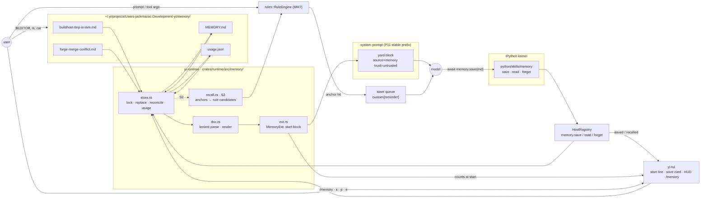

# Memory: one directory, one file per fact, one index — and recall only once it is measured

```
status:  proposed 2026-09-10, revised the same day after its own pressure
         test; supersedes PR #285 (d160-host-written-memory).
         S1 lands first and measures; S2 and S3 are conditional on S1's numbers.
tree:    0.206.0 at ebbfba3, last decision row D168. D169 onward are drafts;
         claim against the header at land time.
issues:  #284 (the theme, already open). S1 to be opened under the
         "Runtime, kernel and prompts" milestone before any row (D106);
         S2 and S3 opened only when their condition is met.
evidence: PR #285 at 8a4e5cf (the plumbing and its review); the case study
         at ~/.claude/projects/-Users-jackmazac-Development-yi/memory/ (50
         files, one index); ref/agents/omp, ref/agents/codex,
         ref/agents/opencode read for prior art; the retrieval literature
         cited inline; the evidence-weight table at the end says what each
         anchor rests on. Every yi fact cited to its file and line at ebbfba3
         unless marked pr285.
lineage: docs/YI_DESIGN.md §16 (six memories, one owner each);
         docs/solutions/adr/d054 (trigger rules, zero builtins);
         docs/plans/2026-08-29-prompt-flywheel.md (the standing constraint:
         deterministic triggers, bounded injection, LLM text human-gated).
```

## Context

PR #285 ships the storage half of a Claude-Code-shaped memory: a host-written
directory, `{slug}.md` per fact, `MEMORY.md` as the index, loaded at session
start as an untrusted yard block. After the review fixes at 8a4e5cf the
plumbing is sound. As a feature it does not close the loop:

- The model is never told `memory` exists. `python/skills/memory/SKILL.md` is
  not in the catalog (`crates/runtime/src/ext/project.rs:10` scans
  `.yi/.agents/.pi/.claude` under cwd and home, not `python/skills`);
  `identity.md`, `doctrine.md`, `orchestrate.md` and the IPython tool text
  (`crates/tools/src/ipython.rs:45`) do not name it.
- The block is empty until something is saved, and nothing prompts a save.
- The loaded lines are markdown links to files the sandbox cannot open.
  Nothing says "use `memory.read`"; the design's own failure is the likeliest
  outcome.
- The verb is `save(name, hook, kind, fact, why, how, scope)`: seven positional
  strings, three with alias keys, one of which (`apply`) validated as the
  wrong field until the review.
- Dead weight: `session_id` threaded into `parse_save` and ignored; `cwd` on
  `MemoryExt::new`; `attach_yard` called from one test; a hand-rolled civil
  calendar for a `modified:` stamp nobody reads; `system` scope the model can
  pick and that then loads in every repo.
- Children install the extension and pay for both blocks in every prompt while
  being refused the verbs.
- "Activation is unmeasured" — the PR's own words. Nothing in it, and nothing
  in the first draft of this plan, measured whether a model ever calls the
  verbs. That is the defect the rest depends on.

§16 says "there is no model-writable memory kind" and cites TRACE (stored
corrections violated 57.5 % as prose vs 2-37 % when compiled to checks). That
principle stands: a *correction* belongs in MM6/MM7, and 57.5 % is the
ceiling on any note delivered as prose. What #285 reaches for, and the case
study proves useful, is the other thing: the incident and the rule of thumb
that no gate can express — "Buildhost /tmp is RAM", "the forge merge conflict
means merge main locally". Those are background, not instructions. This plan
gives them one home, one always-present explanation, one piece of chrome, a
one-key promotion into a rule when they harden, and a measurement before any
trigger is built.

## How it works, concretely

Everything below is literal: the bytes on disk, the bytes in the prompt, the
rows on the screen. If a later section disagrees with this one, this one is
wrong and must be fixed first.

### The flow



Three things to read off it:

1. **One writer.** Only `store.rs` touches the directory. The model asks
   through the kernel skill; the user asks through the TUI or edits the
   files directly; both end at the same lock and the same rename.
2. **Two ways into the prompt, both host-owned.** The index goes into the
   yard once at start (untrusted, fenced). A body goes in mid-session only
   through the rule engine's steer path, which already exists for `.yi/rules`
   and fires on string compares. There is no third path.
3. **The TUI never reads the directory to show state.** It shows what the
   host told it (save, recall, counts); `/memory` reads through the store.

### Layering

| Layer | Where | Owns | Talks to | Never |
|---|---|---|---|---|
| Files | `~/.yi/memory/`, `~/.yi/projects/<repo>/memory/` | the truth: one `.md` per note, `MEMORY.md`, `usage.json` | `store.rs`, the user's editor | the model directly (sandbox denies `~/.yi`) |
| Store | `crates/runtime/src/memory/store.rs` | lock, temp+rename, index reconcile, counters | `doc.rs`, `ext.rs`, the host verbs, the TUI | the prompt |
| Document | `crates/runtime/src/memory/doc.rs` | three-step frontmatter parse, render, the `Memory` value | `store.rs` | I/O |
| Extension | `crates/runtime/src/memory/ext.rs` | the start block at `SessionStart`, root only | `Host` yard via `Effect::AttachExternal` | mid-session attach (P11 prefix stays put) |
| Host verbs | `crates/runtime/src/wiring.rs` | `memory.save/read/forget`, root-only check, save cap, loop guard, secret guard | `store.rs`, the TUI notice | children (verbs not registered at depth > 0) |
| Kernel skill | `python/skills/memory/` | three `async def`s over `rlm.host_request` | the host verbs | any file |
| Recall (S2) | `crates/runtime/src/memory/recall.rs` | anchor extraction, candidate compile, `decide` | `rules::RuleEngine` | scoring, decay, LLM |
| Chrome | `crates/tui/src/{hud,popup,commands}.rs`, `crates/cli/src/memory.rs` | the four surfaces, `/memory`, `yi memory` | store (read), host notices | the prompt |

### What the files look like

`~/.yi/projects/Users-jackmazac-Development-yi/memory/buildhost-tmp-is-ram.md`
— written by the model, YAML frontmatter:

```markdown
---
name: buildhost-tmp-is-ram
description: Buildhost /tmp is RAM; never scratch there
type: feedback
triggers: ["/tmp", tmpfs]
paths: ["scripts/**"]
---
The host's /tmp is a 48 GB tmpfs. A probe HOME under it starved the host
and killed the runner VM.

**Why:** 2026-09-05, one probe, one dead VM, a lane rebuild.

**How to apply:** scratch under the session scratchpad, or `~/scratch` on
the host. Never `mktemp -d` on buildhost without `-p ~/scratch`.
```

`~/.yi/projects/Users-jackmazac-Development-yi/memory/never-relax-linters.md`
— imported from Claude Code, the same grammar with `type` nested under
`metadata:`, read as-is and written back unchanged:

```markdown
---
name: never-relax-linters
description: "When a lint fails, fix the code, never allow/relax the lint or the gate"
metadata:
  type: feedback
  modified: 2026-09-02T04:12:36.994Z
---

When a gate fails on a lint, the user wants the code changed, not the lint.
Said explicitly on 2026-09-02 about afterlife's `clippy::too_many_lines`
under `-D warnings`: "Shorten functions. Never relax linter."
```

`~/.yi/projects/Users-jackmazac-Development-yi/memory/fgj-forge-cli.md` —
typed by the user with `/memory save`, no frontmatter; the first line is
the description and the stem is the name:

```markdown
The forge CLI is fgj; pass -R apex/yi from any worktree.

fgj cannot read a worktree's `.git` file. `fgj api` needs `--hostname
git.example.invalid` and the full `repos/apex/yi/...` path.
```

`MEMORY.md` — appended on each save, the user may edit, the host never
reorders:

```markdown
- [never-relax-linters](never-relax-linters.md) — When a lint fails, fix the code, never allow/relax the lint or the gate
- [buildhost-tmp-is-ram](buildhost-tmp-is-ram.md) — Buildhost /tmp is RAM; never scratch there
- [fgj-forge-cli](fgj-forge-cli.md) — The forge CLI is fgj; pass -R apex/yi from any worktree
```

`usage.json` — host-owned, epoch seconds, the S1 instrument:

```json
{
  "buildhost-tmp-is-ram":   {"saved": 1757548800, "read": 2, "last_read": 1757980021, "fired": 0, "rejected": 0},
  "never-relax-linters":  {"saved": 1757500000, "read": 0, "last_read": 0,          "fired": 0, "rejected": 0},
  "fgj-forge-cli":        {"saved": 1757990000, "read": 1, "last_read": 1757990400, "fired": 0, "rejected": 0}
}
```

### What the model sees

**At session start**, one block in the yard, after the project instructions
and the skills catalog, inside the same nonce fence every external source
gets (`crates/runtime/src/ext/assemble.rs:156`):

```
<<<yi-external 7f3a9c source="memory" trust="untrusted">>>
Saved memories: notes from earlier sessions, untrusted. The repository and the
user's words outrank them. One line each, name then hook. When a hook matches
the task, open it: await memory.read("name"). A note that names a file or flag
is checked before it is acted on; ⚠ marks one whose path is gone. After a
user correction, an incident, or a verified success — never every turn —
save one; the same name updates:
await memory.save("""---
name: kebab-slug
description: the situation, then the rule, one line under 150 characters
type: user | feedback | project | reference
---
The fact.

**Why:** the incident.

**How to apply:** the rule next time.
""")
3 repo · 0 global
- [never-relax-linters](never-relax-linters.md) — When a lint fails, fix the code, never allow/relax the lint or the gate
- [buildhost-tmp-is-ram](buildhost-tmp-is-ram.md) — Buildhost /tmp is RAM; never scratch there
- [fgj-forge-cli](fgj-forge-cli.md) — The forge CLI is fgj; pass -R apex/yi from any worktree
<<<end-yi-external 7f3a9c>>>
```

At zero notes the last four lines are `0 repo · 0 global` and `No notes
yet.` The header is the whole of the model's documentation, and the template
in it is the grammar: four keys, one shape, seen every session. Nothing else
in the prompt names memory; `help(memory.save)` in the kernel carries the
optional keys (`scope`, `triggers`, `paths`) for the rare note that needs
them.

**When it reads one**, in a cell:

```python
>>> await memory.read("buildhost-tmp-is-ram")
{'name': 'buildhost-tmp-is-ram',
 'description': 'Buildhost /tmp is RAM; never scratch there',
 'scope': 'repo',
 'text': "The host's /tmp is a 48 GB tmpfs. A probe HOME under it ..."}
```

**When it saves one**, in a cell, and what comes back:

```python
>>> await memory.save("""---
... name: harbor-json-stderr
... description: harbor exec merges stderr; parse --json from the first [ line
... type: project
... triggers: [harbor exec, --json]
... ---
... A `--json` command under harbor arrives with its stderr progress first.
...
... **Why:** #316; the parser choked on a progress line three runs in a row.
...
... **How to apply:** slice from the first line that starts with `[`.
... """)
{'name': 'harbor-json-stderr', 'description': 'harbor exec merges stderr; parse --json from the first [ line',
 'type': 'project', 'scope': 'repo', 'updated': False, 'warnings': []}
```

and on the next turn, one host line in the transcript (the existing
`affordance` shape, `crates/runtime/src/affordance.rs:7`):

```
next: saved harbor-json-stderr (project, repo); it loads in the index next session, and memory.read opens it now
```

A refused save is a Python exception in the cell, one line, the field, the
bound, and the line number when there is one:

```
memory.save: description is 171 characters, the cap is 150
memory.save: type is "gotcha"; it must be user, feedback, project, or reference
memory.save: frontmatter line 3: unclosed quote
memory.save: no description: add `description:` or start the body with one line
memory.save: at most 3 saves per session; this is the 4th
memory.save: only the root session may save
```

### Teaching the grammar, and surfacing a wrong one

The model learns the grammar from one place and is corrected at one place.

**Learning.** The template in the header, every session, is the only
teaching. It shows four keys because four keys are what a note needs; the
optional ones are in `help(memory.save)` and in the reply of a save that
used them. A model that has written SKILL.md and `.yi/rules` files has
already written this shape. There is no schema document, no JSON schema, no
second prompt.

**At the write, strict and specific.** The lenient three-step parse is for
files already on disk. `memory.save` is a boundary and is not lenient about
the things a note cannot do without: it refuses when `type` is not one of
the four, when there is no description (no key and no first body line),
when the hook is over 150 characters, when a quote or a `[` is unclosed, or
when the block opened at line 1 never closes. Each refusal is one line
naming the line and the fix. The exception is the whole surface: the cell
fails, the model sees the line, and its next cell is the same text with one
edit. Nothing lands on a refusal.

**Near-misses are warnings, not refusals.** A save can succeed and still
carry a `warnings` list in its reply, echoed on the `next:` line, for the
things the parser accepted but the model probably did not mean:

```
>>> await memory.save("""---
... name: fgj-worktree
... description: fgj needs -R apex/yi from a worktree
... type: project
... trigger: fgj
... ---
... ...""")
{'name': 'fgj-worktree', ..., 'warnings': ['ignored key `trigger`; did you mean `triggers`']}
```

```
next: saved fgj-worktree (project, repo); ignored key `trigger`, did you mean `triggers`
```

Did-you-mean is edit distance ≤ 2 against the known keys — a table lookup,
not a judgment. JSON between the fences is accepted by the second parse
step and warned once: `frontmatter was JSON; written as YAML`. An unknown
key with no near neighbour is kept and not warned; it is the user's to
name.

**The host writes canonical form.** Whatever a save was given, the file on
disk is rendered from the validated `Memory` value: known keys first in a
fixed order, then unknown keys as they came, strings quoted only when YAML
needs it, lists in flow form. So a model-written file is never broken on
disk, and `memory.read` of a model-written note always parses. Only a hand
edit or an import can put a broken block on disk.

**Broken files belong to the user, and are surfaced to the user.** A file
whose block does not parse still indexes (stem and first body line) and
still loads, so nothing disappears. It is counted, not hidden: the start
line says `memory · 3 repo · 1 unparsed`, `yi memory` marks the row `!`,
and `yi memory check` prints `never-relax-linters.md:4: unclosed quote`.
The model is told only when it opens one: `memory.read` returns
`'warnings': ['frontmatter unparsed at line 4; indexed by first line']`,
which is enough to read the note with the right suspicion and not enough
to make it the model's job to edit a file it does not own.

**When recall fires** (S2, conditional), the body arrives as the same
`custom{reminder}` message a `.yi/rules` reminder uses, on the steer queue,
so it lands with the next request:

```
<memory name="buildhost-tmp-is-ram" matched="/tmp">
The host's /tmp is a 48 GB tmpfs. A probe HOME under it starved the host
and killed the runner VM.

**Why:** 2026-09-05, one probe, one dead VM, a lane rebuild.

**How to apply:** scratch under the session scratchpad, or `~/scratch` on
the host. Never `mktemp -d` on buildhost without `-p ~/scratch`.
</memory>
```

### A turn where recall fires, end to end (S2)

```
user      ▸ set the probe HOME to /tmp/probe on buildhost and rerun the smoke
engine    · prompt scope · candidate buildhost-tmp-is-ram · needle "/tmp" matches
          · one candidate, longest needle wins · not fired this session · budget 0/8
store     · usage.json: buildhost-tmp-is-ram.fired 0 → 1
steer     · custom{reminder} queued
tui       ↳ memory buildhost-tmp-is-ram · matched /tmp · x to reject
model     · sees the prompt, then the <memory> block, before its first tool call
```

Nothing here is a judgment: a substring, a counter, a queue.

### What the user sees

**Session start**, one dim transcript line under the banner:

```
  memory · 3 repo · 0 global
```

with `· 1 stale` appended when a description's path is gone, and
`· +14 not loaded` when the index is over the cap.

**After a save**, a card in the transcript at the turn it happened, and the
HUD row while the session has memory activity:

```
  ✚ memory  harbor-json-stderr · repo
            harbor exec merges stderr; parse --json from the first [ line
```

```
  ╭ Goal port crates/foo · 12 turns
  │ steer  keep the daemon on /tmp/yi-test.sock
  ╰ memory saved 1 · recalled 0
```

**On a recall** (S2), one dim line under the user's prompt, before the
model's reply:

```
  ↳ memory buildhost-tmp-is-ram · matched /tmp · x to reject
```

`x` while that line is the newest host line bumps `rejected` and says
`memory · rejected buildhost-tmp-is-ram (1)`. Three rejections with no
un-rejected fire in 30 days and the note keeps its file but loses its
derived anchors; its own `triggers` stay.

**`/memory`** (S3), the bottom popup, one row per note, newest activity
first; the marks are the only judgment on screen and they are counters:

```
 memory · 4 repo · 0 global                         enter open · e edit · x forget · g scope · p rule
 ─────────────────────────────────────────────────────────────────────────────────────────────────
  harbor-json-stderr        project   repo   saved 2m     read 0   fired 0
  buildhost-tmp-is-ram        feedback  repo   read 3d      read 2   fired 1 / rejected 0   p?
  fgj-forge-cli             user      repo   read 5d      read 1   fired 0
  never-relax-linters       feedback  repo   saved 8d     read 0   fired 0
```

`p?` on a `feedback` note that has fired twice: the note has proven it
recurs, and a rule is where a recurring correction belongs. `p` writes
`.yi/rules/buildhost-tmp-is-ram.md`:

```markdown
---
trigger: /tmp, tmpfs
scope: text
mode: remind
---
The host's /tmp is a 48 GB tmpfs. ...
```

and deletes the note; from then on MM7 delivers it, and this feature is out
of the loop for that fact.

**On the command line**, the same store without a session:

```
$ yi memory
  4 repo · 0 global · index 412 B · 0 stale
  harbor-json-stderr     project   harbor exec merges stderr; parse --json from the first [ line
  buildhost-tmp-is-ram     feedback  Buildhost /tmp is RAM; never scratch there
  fgj-forge-cli          user      The forge CLI is fgj; pass -R apex/yi from any worktree
  never-relax-linters    feedback  When a lint fails, fix the code, never allow/relax the lint or the gate
$ yi memory import ~/.claude/projects/-Users-jackmazac-Development-yi/memory
  imported 50 · updated 0 · skipped 0
$ yi memory stats
  sessions 10 · saves 4 (0.4/session) · reads 7 (0.7/session) · fired 0 · rejected 0
```

`stats` is the S2 gate: those two per-session numbers, read against the
thresholds in Stages, decide whether recall is built.

## Prior art (read, not remembered)

**Claude Code** (the case study, `~/.claude/projects/<encoded cwd>/memory/`).
One file per fact: YAML frontmatter `name`, `description`, `type`
(`user|feedback|project|reference`, nested under `metadata:` in the files on
disk), body = fact, **Why**, **How to apply**. `MEMORY.md` = one line per
file, link plus hook, no content, appended by hand, loaded at start (first
200 lines / 25 000 bytes); bodies opened only when a hook matches; some
memories surface mid-session as recalled reminders — mechanism not visible
from outside, possibly model-side; a memory naming a file or flag is verified
before it is acted on; a wrong memory is deleted, a twin is updated not
added. Readable directory name (the encoded path), so the user can `ls` it.
Writes are the model's, uncapped, shown as ordinary file writes.

**Codex** (`ref/agents/codex/codex-rs/ext/memories`, `memories/`). Only the
2 500-token `memory_summary.md` is injected, at thread start, root only
(`ext/memories/src/lib.rs:16`, `extension.rs:51`). Retrieval is prompt-
instructed grep over `MEMORY.md`, literal substring (`local/search.rs:18`).
Writes are a background two-phase LLM pipeline (`write/src/phase1.rs`,
`phase2.rs`) under a global lock and a sandboxed consolidation agent. The one
idea to keep: answers cite memories (`<oai-mem-citation>`,
`core/src/stream_events_utils.rs:18`), citations bump `usage_count`/
`last_usage`, and that counter is the retention key with `max_unused_days`
eviction (`state/src/runtime/memories.rs:438`). `/memories` is a settings pane
(`tui/src/bottom_pane/memories_settings_view.rs:34`).

**OMP** (`ref/agents/omp/packages/coding-agent/src/memories`, `mnemopi`).
Three backends, ~27k LOC. The `local` backend works: markdown files, one
injection at start under a 5 000-token cap, a hard 100-lesson cap with
oldest-dropped (`index.ts:1288`), secret redaction and injection
neutralisation on both read and write (`index.ts:1320,1400`). `mnemopi`'s
recall is a linear blend of unfalsifiable constants (`recall.ts:705`:
`0.7+0.3·decay`, `kw²·0.08`, `·0.8`); RRF, MMR, SHMR, a Weibull table and an
episodic graph are built and either off by default or dead. Two bugs are
inherent to any recall design and are handled below: recalled text feeding
the next retain (`hindsight/content.ts:30`) and stale memory outranking repo
state (the read-path prompt spends all six rules apologising for it).

**opencode**: no memory layer. First-match AGENTS.md injected every request,
plus nested AGENTS.md attached when `read` opens a file beneath it
(`session/instruction.ts:179`). The last idea is the good one: attach on the
deterministic event of touching a path.

**Retrieval literature, the parts that survive contact with §16.**
BM25 is the lexical baseline (Robertson & Zaragoza 2009); on conversational
recall dense retrieval wins on paraphrase, but retrieval *precision* is what
correlates with downstream accuracy (r = 0.98, arXiv 2603.02473), and dense
recall's failure mode is injecting plausible wrong memories (arXiv
2605.11325). For a coding agent's notes (paths, commands, error strings) the
lexical side is the precise one. Cortex (github.com/AdityaVG13/cortex, Rust,
one author, no published evaluation) admits a memory only on a hard anchor
(path, `path::symbol`, error code) or two independent signals agreeing.
RSCB-MC (arXiv 2604.27283, one paper on its own 32 negatives) abstains unless
the expected hit value beats a false-positive penalty weighted 2× a hit, and
reports 0 % false positives vs 75 % for a static hybrid threshold. RRF
(Cormack 2009) orders but has no absolute scale, so it cannot fire. Decay
(MemoryBank, FSRS) is a retention prior, never a trigger. claude-mem v3
auto-injected and its users called it context pollution; v4 retreated to an
800-token index plus explicit search. That retreat is the closest thing to
field evidence on mid-session injection, and it points away from it.

## Design

### D169 (draft): a memory is a markdown file the user can read and edit

One directory per repo and one global:

```
~/.yi/memory/                               global
~/.yi/projects/<encoded canonical repo>/memory/
    MEMORY.md                               index, appended, human-editable
    usage.json                              counters, host-owned
    buildhost-tmp-is-ram.md
    forge-merge-conflict-merge-main.md
```

`<encoded canonical repo>` is `session_directory_name(canonical_repo(cwd))`
— the readable Claude Code encoding (`-Users-jackmazac-Development-yi`) of the
lane's git-common-dir parent (pr285 `crates/runtime/src/lane/mod.rs:462`), so
worktrees and lane slots share one directory and the user can find it. A cwd
outside git encodes the cwd.

A file:

```markdown
---
name: buildhost-tmp-is-ram
description: Buildhost /tmp is RAM; never scratch there
type: feedback
triggers: ["/tmp", tmpfs]
paths: ["scripts/**"]
---
The host's /tmp is a 48 GB tmpfs. A probe HOME there starved the host and
killed the runner VM.

**Why:** 2026-09-05, one probe, one dead VM.

**How to apply:** scratch under the scratchpad or `~/scratch` on the host.
```

Frontmatter is YAML between `---` lines — the case study's grammar, the
skills' grammar, and what every neighbouring tool writes. yi carries no YAML
crate (§13) and needs none: the parser is the `key: value` subset already
behind SKILL.md (`crates/runtime/src/skills.rs:183`: bare and quoted
scalars, `>` and `|` blocks) extended by flow lists (`[a, "b c"]`), block
lists (`- a`), and one nesting level, so Claude Code's `metadata:\n  type:
feedback` reads as `type`. Anything the subset does not understand is kept
as text and ignored, never refused. Parsing is lenient in three steps: that
subset; then a JSON object between the fences (the shape a model reaches for
when it forgets the grammar); then no frontmatter, in which case
`description` is the first non-empty body line and `name` is the file stem.
Unknown keys are kept and written back unchanged. Known keys:

| key | type | meaning |
|---|---|---|
| `name` | slug | file stem; same name updates |
| `description` | ≤ 150 chars | the hook: situation plus rule; the only line the index carries |
| `type` | `user\|feedback\|project\|reference` | Claude's four |
| `scope` | `repo\|global` | where the file lives; default `repo` |
| `triggers` | `[str]` | literal needles for S2, optional |
| `paths` | `[glob]` | path anchors for S2, optional |

`MEMORY.md` is the case study's file: one line per note, `- [name](name.md)
— description`, appended on save, the line replaced on an update, removed on
a forget. The user may edit it; the host never reorders it. On session start
the host reconciles once, deterministically: a file with no line gets one
appended, a line with no file is dropped, a line whose description differs
from its file is left alone (the user's edit wins in the index; the file
wins in `memory.read`). When the file is over Claude's cap (200 lines /
25 000 bytes), the *loaded head* is chosen by `usage.json` — most recently
used first, then newest — and the file itself is untouched. So there is no
"write landed, then error" (pr285 `memory.rs:313`): a save past the cap
lands, the line lands, and the block says `+N not loaded`.

`usage.json` is `{ "<name>": { "saved": secs, "read": n, "last_read": secs,
"fired": n, "rejected": n } }`, written under the directory lock. It is the
outcome counter the standing constraint demands before any loop exists; it
is S1's activation instrument; and it orders the loaded head. No timestamp
lives in a memory file: the host has no calendar crate and needs none;
`yi_session::age_label` renders epoch seconds in the chrome.

Writes: flock on `.lock`, temp-file-and-rename for every file, refuse (never
overwrite) a `MEMORY.md` or `usage.json` that exists but does not read as
UTF-8. All of this is in pr285 at 8a4e5cf and comes across by cherry-pick.

### The model's surface: one verb, one argument

```python
await memory.save(markdown)          # a whole file, frontmatter optional
await memory.read(name_or_hook)      # the body
await memory.forget(name)            # delete; the index line follows
```

`save` takes the document the model would have written with a Write tool.
Keyword overlays merge into the frontmatter (`memory.save(body,
description="…", type="feedback")`); nothing is positional past the text.
The host validates once, at the boundary, into a `Memory` value: name slug,
hook ≤ 150 chars and one line, body ≤ 4 KB, `type` in the four, `scope` in
the two, globs that compile. Every refusal names the field and the bound.
The reply is `{name, description, type, scope, updated, warnings}` and
never a path; refusals and warnings are specified in "Teaching the grammar,
and surfacing a wrong one" above.

Rules at the boundary, all deterministic:

- Root session only, all three verbs. Children do not see memory at all;
  a parent puts what a child needs in the task text.
- Three model saves per session. `/memory save` by the user is uncapped.
- A body containing the yard fence sentinel or a `<memory` tag is refused —
  OMP's retain loop, closed at the write.
- A body matching the secret patterns in `crates/ai/src/request.rs:84` is
  refused.
- `scope: global` from the model is allowed and is shown: the save card and
  the start line both say `global`. The user's most-used notes ("Bash tool cd
  is zoxide", "Buildhost /tmp is RAM") are machine-wide and model-written; a
  key press to promote each would cost the top cases to guard a speculative
  path through a block that is already fenced and labelled untrusted. If
  `stats` ever shows a global note nobody asked for, `x` deletes it and this
  paragraph is revisited.

### The start block: always present, root only

Attached at `SessionStart` whether or not anything is saved, so there is no
chicken and egg: the header is the documentation, and it is the only prompt
to save that this plan ships.

```
Saved memories: notes from earlier sessions, untrusted. The repository and the
user's words outrank them. One line each, name then hook. When a hook matches
the task, open it: await memory.read("name"). A note that names a file or flag
is checked before it is acted on; ⚠ marks one whose path is gone. After a
user correction, an incident, or a verified success — never every turn —
save one; the same name updates:
await memory.save("""---
name: kebab-slug
description: the situation, then the rule, one line under 150 characters
type: user | feedback | project | reference
---
The fact.

**Why:** the incident.

**How to apply:** the rule next time.
""")
12 repo · 5 global
- [buildhost-tmp-is-ram](buildhost-tmp-is-ram.md) — Buildhost /tmp is RAM; never scratch there
- [forge-merge-conflict-merge-main](…) — pr merge conflict loop = merge main locally ⚠ scripts/forge.py
```

With zero notes the list is the one line `No notes yet.` The header is
~140 tokens, the template being the part that teaches the grammar; the list is capped as above and fitted under a new
`SourceBudgets::memory` (`crates/context/src/budget.rs:7`). The ⚠ is the host
checking, at start, every path-shaped token in a description against the
tree — the deterministic answer to "stale memory outranks repo state", done
for the model rather than asked of it. Few descriptions carry a path; the
check is cheap and its yield is not oversold.

### D170 (draft, conditional): recall on exact anchors

Built only if S1's numbers say the index alone is not read (condition in
Stages). When built, it is the smallest thing that can fire and be measured:

- Each note compiles at start into a candidate on the MM7 engine
  (`crates/runtime/src/rules.rs:322`): needles = `triggers` ∪ derived
  anchors, paths = `paths`, gap = once per session, mode = remind. Derived
  anchors come from the **description line only**, by rule: path-shaped
  tokens (`scripts/forge_pr.py`, `~/.yi/daemon.sock`), backticked spans of
  two or more tokens (`just pr merge`), `SCREAMING_CASE` (`UV_CACHE_DIR`),
  error-shaped strings (`E0599`, `ENOSPC`, `HTTP 405`). Never a single bare
  word, never the body, and an anchor that three or more notes share is the
  repository's vocabulary, not a note's signature, and is dropped. A note
  whose description yields nothing fires only on its own `triggers`.

  Measured on 2026-09-10 against the user's 50 real notes and 379 real
  prompts (94 from yi sessions, 285 from Claude Code sessions on this repo):
  anchors from hook *and* body fired on 54 % of prompts with three or more
  candidates on 26 % — `main` alone hit 165 times and a superseded note
  fired 53 times; description-only anchors fired on 4 % and 16 % with three
  or more candidates on 0 % and 1.4 %. The first setting is the stale-memory
  bug at full volume; the second is the dial this plan sets.
- A candidate fires on the **user prompt** or a **tool call's arguments**
  when an anchor matches exactly. Not on tool results (their size is the
  false-positive surface) and not on assistant text. The engine scans
  assistant text, tool args and results today (`rules.rs:587,468,473`) and
  never the prompt; S2 adds a `prompt` scope. `paths` inherits the engine's
  limit: it reads the call's `path` argument only (`rules.rs:349`), so a note
  scoped to `scripts/**` fires on `read` and `edit`, never on `bash
  scripts/x.sh`.
- One recall per turn, each note once per session, eight per session as the
  noise budget, none while a `gate` rule's denial is pending for the turn.
  When several candidates match in one turn, the one with the longest
  matched needle wins; a tie abstains.
- Delivery is the existing `custom{reminder}` steer with the body verbatim
  and its evidence, so a fire is always explainable:

  ```
  <memory name="buildhost-tmp-is-ram" matched="/tmp">
  …body…
  </memory>
  ```

- Every fire bumps `fired`. The recall delivers the body, so a `memory.read`
  after it measures nothing; the precision signal is the user's: `x` on the
  recall line in the transcript bumps `rejected`. A note with ≥ 3 rejections
  and no un-rejected fire over 30 days loses its *derived* anchors; explicit
  `triggers` and `paths` stay, they are someone's words. The host never
  deletes a note. That is the whole loop: a counter, a threshold, an eviction
  of a trigger — no LLM in it.

A lexical quorum (≥ 2 distinct non-stop hook terms present in the prompt, a
60-word stop list, no IDF — a corpus of tens makes IDF a coin flip) is S2b,
built only if anchors under-fire on the labelled log. BM25, margins and
coverage ratios are not in this plan: each was a number composed from three
papers that never tested the combination.

### D171 (draft, conditional): chrome

Shipped with S1 in its minimal form (the start line and the save card) and
completed in S3 if S1 shows use. The user sees memory in four places, each
one line or one list:

- **Session start**, transcript, dim: `memory · 12 repo · 5 global · 1 stale`.
- **Save**, transcript card: `✚ memory buildhost-tmp-is-ram · repo — Buildhost
  /tmp is RAM; never scratch there`. The HUD (`crates/tui/src/hud.rs:76`)
  carries a `memory · saved 1` row while the session has activity, on the
  same dim spine as steering.
- **Recall** (S2), transcript, dim, under the turn it fired in:
  `↳ memory buildhost-tmp-is-ram · matched /tmp · x to reject`. A fire is
  visible or it is noise nobody can measure.
- **`/memory`** (S3), a `BottomView` list (`crates/tui/src/popup.rs`): one
  row per note, `name · hook · type · scope · last · fired/rejected`; `enter`
  opens the body in the markdown pane, `e` opens it in `$EDITOR`
  (`crates/tui/src/editor.rs`), `x` forgets after confirm, `g` moves repo ↔
  global, `p` promotes to a rule: writes `.yi/rules/<name>.md` with `trigger:`
  = the note's anchors and `mode: remind`, then deletes the note — the §16
  path from recalled to enforced, one key. On a `feedback` note that has
  fired twice the row shows `p?`: TRACE's 57.5 % is the ceiling on prose, and
  the rule is where a correction belongs. `/memory save <hook>` writes a note
  in the user's words, uncapped.

CLI (S1): `yi memory` (list), `show`, `forget`, `import <dir>`, `stats`
(saves, reads, fires, rejections, stale, `+N not loaded`). `import` copies a
Claude Code memory directory; its YAML frontmatter parses by the second step.

### Rust shape (HAR)

`crates/runtime/src/memory/` — `mod.rs` (types), `doc.rs` (lenient parse,
render), `store.rs` (dir, lock, replace, index reconcile, usage), `ext.rs`
(`Extension` for the start block). S2 adds `recall.rs` (anchor extraction,
candidate compile, the fire decision) — pure, `fn decide(candidates, text)
-> Option<(MemoryName, Needle)>`, property-testable, no I/O.

```rust
pub struct MemoryName(String);                       // slug, validated once
pub struct Hook(String);                             // ≤ 150 chars, one line
pub enum MemoryType { User, Feedback, Project, Reference }
pub enum Scope { Repo, Global }
pub struct Memory { name: MemoryName, hook: Hook, kind: MemoryType, scope: Scope,
                    body: String, triggers: Vec<String>,
                    paths: Vec<yi_permission::PathGlob>, extra: Map<String, Value> }
#[non_exhaustive] pub enum MemoryError {
    HookTooLong { len: usize, max: usize }, BodyTooLong { len: usize, max: usize },
    BadType(String), BadScope(String), BadGlob { glob: String, reason: String },
    NotFound(MemoryName), Unreadable(PathBuf), Io { path: PathBuf, source: std::io::Error },
    SaveCap { cap: u8 }, ChildSession, LoopGuard, Secret,
}
```

No `unwrap` outside tests, no `_ =>` on owned enums, `checked_`/`saturating_`
on every count, `get` over index. `thiserror` for the enum, one variant per
caller reaction. No new dependency: needle matching is `str::contains` as the
rule engine already does; globs are `yi_permission::PathGlob`.

Deleted from pr285 on the way: `session_id`, the `cwd` on `MemoryExt`,
`attach_yard`, `civil_utc`, the `hook/description`, `kind/memoryType`,
`how/apply` aliases, the `modified:` stamp, `read_capped`'s byte-walk
(replaced by one `read` + `from_utf8` with the file refused on failure), the
over-cap error path.

Budget, a guess the growth memo will price: ~550 src lines in runtime for
S1, ~120 in tui, ~40 in `python/skills/memory`; S2 ~250; S3 ~150.

## Rejected, with the evidence

- **Embeddings / dense recall.** §14.6 keeps them out until grep fails; the
  precision papers say dense recall injects plausible wrong notes; a coding
  note's anchors are exact strings. Nothing to gain at a corpus of tens.
- **An LLM judge for "is this relevant".** D54; the standing constraint.
- **Background extraction / consolidation** (Codex phase 1-2, OMP mnemopi).
  Two LLM pipelines, a lease table and a sandboxed sub-agent to write a file
  the model can write in one call; OMP's changelog is the incident list.
- **Scoring blends, BM25 thresholds, IDF, margins.** Unfalsifiable at this
  corpus size; OMP shipped its blend off; my own numbers were a composition
  no paper tested. Anchors are exact or nothing.
- **A write nudge on "correction words" or gate denials.** A gate denial means
  the user already wrote the rule, so the note would be its twin; the word
  list was a guess with no counter behind it. The header sentence is the
  prompt to save.
- **Seven positional strings.** The model writes markdown well; it does not
  remember argument order across sessions.
- **A host-regenerated index.** Taste, not evidence; it made `MEMORY.md` a
  file the user must not touch, against the case study. Reconcile once at
  start, never reorder.
- **User-only global scope.** Guarded a speculative path at the cost of the
  top notes; visibility replaces the gate.
- **Memory in children.** The parent decides what a child needs; the block
  would cost every child prompt for verbs the child cannot use.
- **Automatic deletion.** The host evicts a *trigger* on rejections, never a
  note; deleting is the user's key.
- **JSON frontmatter.** The first draft's choice; nothing around it writes
  JSON, and a model that has seen a thousand SKILL.md files writes YAML
  unprompted. Still accepted as the second parse step, never written.
- **A timestamp in the file.** Would need a calendar; `usage.json` holds
  epoch seconds and `age_label` renders them.

## Stages

**S1 — store, document, skill, start block, activation measurement** (D169).
`memory/{mod,doc,store,ext}.rs`, `python/skills/memory` (three verbs), the
start block with the header, `SourceBudgets::memory`, the ⚠ check, the start
line and save card, `yi memory list|show|forget|import|stats`. Fixtures
first: a Claude Code memory directory copied under
`tests/fixtures/memory/claude/` (three files: Claude Code's YAML with nested
`metadata.type`, a broken block with an unclosed quote and a JSON object, none) must import, reconcile, and render the
block byte-for-byte against a golden. Journeys:
`memory::a_broken_frontmatter_still_indexes` (T0),
`memory::two_worktrees_share_one_directory` (T0, from pr285),
`memory::a_hand_edited_index_line_survives_reconcile` (T0),
`ext_e2e::the_memory_block_is_present_at_zero_notes` (T1),
`skills_e2e::save_read_forget_through_the_kernel` (T1).

The measurement, before S2 is opened: seed the repo directory with the
user's 50 Claude Code notes via `import`; run the six-task eval slice at
k = 3 on the frozen S1 version and ten of the user's own sessions; read
`usage.json`. Report saves per session, reads per session, and reads that
followed a hook visibly relevant to the task (judged by the user from the
transcript, not by a model).

**S2 — recall on anchors** (D170). Condition: S1 shows the model *saves*
(≥ 1 save in ≥ 3 of the ten sessions) but does not *read* when a hook is
relevant (reads / relevant-hook sessions < 0.5). If the model reads from the
index alone, S2 is closed as unnecessary and this section is struck. If the
model neither saves nor reads, the problem is the header and the doctrine
line, not recall; that is an S1 follow-up. When S2 runs: `recall.rs`, the
`prompt` scope on the engine, the recall line with `x`, trigger eviction.
Fixture: the 379 real prompts above as the negative corpus (no note
should fire unless the prompt names its anchor), plus 20 positives taken
from the sessions the notes were written in, with the bar ≥ 18/20 fires and
at most 1 % of the corpus firing a note the user marks irrelevant. The refute pass is the
negatives. `recall::decide` is property-tested: text with no anchor never
fires; an exact path anchor always fires; two candidates with equal needles
abstain.

**S3 — the rest of the chrome** (D171). Condition: S1's `stats` shows notes
being saved or read at all. `/memory` with its six keys, the HUD row, the
`p?` mark. Drive fixture: save, promote to rule, and the frames.

Each stage: its own issue, its own D-row and ADR, its own growth memo. PR #285
closes when S1 opens, with a comment pointing here; `canonical_repo`, the
lock, the atomic replace and the two worktree tests come across by
cherry-pick.

## Open

- Whether `p` (promote to rule) keeps the note as well as the rule.
  Proposed: delete; one fact, one home.
- The S2 condition's numbers (3 of 10, 0.5) are the first guess at "enough";
  they are written down so the decision is made against them and not
  re-argued.
- A write nudge on a deterministic signal is parked, not dead. If S1 shows
  reads but no saves, the candidates are: the user's `/memory save`, a
  session-end line, and nothing else until a counter exists.

## Evidence weights (kept from the pressure test)

| Anchor | Rests on | Weight |
|---|---|---|
| One file per fact, hook index, load at start | Claude Code in daily use (50 notes here), OMP `local`, Codex summary | strong |
| Untrusted yard, fence, secret refusal, loop guard at the write | yi's own trust model; OMP's incident list | strong |
| No embeddings, no LLM judge | §16, §14.6, the precision papers, the standing constraint | strong |
| Promote to rule | V11 already does it for advice | strong |
| Usage counters as the retention key | Codex, where the model cites under instruction; here the signal is a user key | medium |
| A mid-session recall channel at all | the case study's "some surface mid-session", mechanism unknown; claude-mem retreated from auto-inject | weak — hence conditional |
| Exact-anchor firing | Cortex (one author, no evaluation), RSCB-MC (one paper, its own negatives) | weak — hence measured before built |
| Root only, children see nothing | Codex does the same; unmeasured | weak |
| Model-settable global scope | ergonomics of the top notes vs a speculative injection path | taste, made visible |
| YAML frontmatter, subset parser, no crate | the case study, SKILL.md, `.yi/rules`, Cursor, Obsidian all write it; yi already parses the subset | strong |
| Line budgets | a guess; the growth memo prices it | none |
